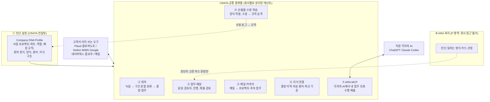

# 00. 방향 정리: CRATA가 만들려는 것

> 기준일 2026-10-01 · **이 문서가 리서치 전체의 최상위 문서입니다.**
>
> **근거 자료:** 사용자가 Codex 대화에서 남긴 메시지입니다(채팅에서 복사해 전달받음). 마지막 메시지를 궁극적인 방향으로 보았습니다. Codex의 답변은 방향 근거로 쓰지 않았고, 사실 주장은 따로 검증했습니다([07 문서](./07_work-os-market.md) 5장).
>
> **함께 읽을 문서**
> - 기존 리서치: [01 시장 지도](./01_market-map.md) · [02 회의 자동 분류](./02_meeting-auto-classification.md) · [03 Company DNA](./03_company-dna-playbook.md) · [04 데이터 거버넌스](./04_data-governance.md)
> - 이번 보강 조사: [07 통합 플랫폼·구축 대행 시장](./07_work-os-market.md) · [08 수정 학습 루프](./08_correction-learning.md) · [09 ARA MCP 원격·멀티테넌트](./09_ara-mcp-remote.md) · [10 ARA 복지](./10_ara-wellbeing.md)

---

## 1. 한 줄 정의

> **고객사에 들어가 그 회사가 일하는 방식을 뽑아 설정하고, 직원 각자의 AI가 그 맥락으로 일하게 연결하고, 수정이 쌓일수록 결과가 좋아지도록 운영해 주는 AX 서비스. 직원 복지로 ARA를 함께 제공한다.**

여기서 "일하는 방식"은 사업·프로젝트·파트 구조, 회의 방식, 업무 배분 기준, 문서 양식, 회사 지식을 말합니다.

팔아야 하는 것은 새 소프트웨어가 아니라 **"회사 운영모델 설계 + 월 운영"**입니다. 소프트웨어는 이를 돕는 얇은 층입니다.

---

## 2. 대화에서 읽은 방향 (사용자 발언 기준)

| 순서 | 사용자가 한 말(요지) | 담긴 의도 |
|---|---|---|
| 1 | "여기 Plaud가 연결돼 있지 않아? 이런 식으로 우리도 연결할 수 있도록 만들면 어떨까?" | 직원이 **각자 쓰는 AI**(ChatGPT·Codex·Claude)에서 회사 업무를 바로 다루게 한다 |
| 2 | "구현해봐줘." | 로컬 ARA MCP를 실제로 만들어 확인했다. 도구 6개: 내 업무 조회, 상세, 시작, 진행 기록, 결과 제출, 검토 상태 |
| 3 | "배포해서 상품으로 팔 거니까 다른 곳에서 등록해도 다 되는 거지?" | **여러 회사·여러 PC**에서 쓰는 판매용 서비스 |
| 4 | "다른 컴퓨터에서도 들어가서 녹음하고 다 할 수 있어?" | 지금은 로컬 개발판이라는 한계를 확인했다 |
| 5 (궁극) | "이미 있는데 무슨 의미가 있을까? 회사마다 업무 배분 기준, PPT 템플릿, 수정사항이 쌓여 수정 없이 만족하는 결과, 메일 연결, 옵시디언처럼 지식 정리·연결, 회의 핵심·중요하게 여기는 것·회의 방식·프로젝트별 회의, 주요 사업과 하위 프로젝트·파트 연결 → 하나의 회사 업무 사이트를 만들어주는 AX 서비스. 복지 차원에서 아라도." | **회사별 업무 사이트 = 진단 + 설정 + 연결 + 학습 + 복지** |

**정리:** 처음 관심은 "회의 → 업무 배분"과 "각자의 AI 연결"이었습니다. 마지막에는 **"회사 전체가 일하는 방식을 담은 업무 사이트"**로 넓어졌습니다. 이번 리서치의 GOAL A(회의 자동 분류)와 GOAL B(회사 스타일·패턴 추출 → 업무사이트)는 이 큰 그림의 부품입니다.

---

## 3. "이미 있는데 무슨 의미가 있나?"에 대한 답

**사실 확인: 기능은 대부분 이미 있습니다.**
- Notion, Microsoft 365 Copilot, Lark는 7개 항목(구조·회의·배분·메일·지식·템플릿·외부 AI 연결) 중 5~6개를 공식 기능으로 갖추고 있습니다([07 문서](./07_work-os-market.md) 2장).
- 국내 제품도 빠르게 따라옵니다.
  - 플로우: ChatGPT·Claude 공식 앱
  - 두레이: 프로젝트 에이전트
  - 티로: 회의록 지식그래프 + MCP

**그런데 비어 있는 곳이 분명합니다.**

1. **"회사마다 규칙을 정하고, 설정하고, 계속 고쳐주는 일"은 어떤 제품도 대신하지 않습니다.** 그래서 파트너 시장이 있습니다([07 문서](./07_work-os-market.md) 4장).
   - Notion 공식 컨설팅 파트너는 구현·교육·지속 관리를 맡습니다.
   - kintone 伴走(운영 동행)는 월 ¥85,000~¥340,000입니다.
   - 국내 노션 컨설팅은 월 구독형 케어로 4년째 계약을 이어 가는 사례가 있습니다.
2. **"수정이 쌓여 다음 결과가 좋아지는" 전체 흐름은 공개 자료에서 확인되지 않았습니다**([08 문서](./08_correction-learning.md)).
   - 있는 것은 관리자가 넣는 규칙(브랜드킷·스타일가이드)이나 개인 메모리뿐입니다.
   - 없는 것은 "수정 → 범위 분류 → 승인 → 회사 규칙 → 효과 측정"을 잇는 흐름입니다.
3. **한국 업무 환경과의 연결이 약합니다.** 네이버웍스·다음·하이웍스 메일, 결재선, HWP 같은 국내 환경과 글로벌 AI 기능 사이가 비어 있습니다.
4. **성향 기반 협업·복지는 빈자리입니다.** 국내 EAP는 상담사 연결과 위기 개입이 중심이고, 성향 진단 기반 협업 카드는 아무도 하지 않습니다([10 문서](./10_ara-wellbeing.md)).
5. **CRATA만의 진입 경로가 있습니다.** 강의·워크샵으로 회사에 들어가고, 그 실습이 곧 진단 데이터가 됩니다([03 문서](./03_company-dna-playbook.md) 3.3절).

**결론:** "이미 있다"는 것은 시장이 검증됐다는 뜻입니다. CRATA는 다음 세 가지를 판다고 보면 됩니다.
- 기존 도구 위에서 회사별 운영모델을 설계하는 일
- 수정 학습 루프를 운영하는 일
- 한국 환경 연결과 복지 ARA를 더하는 일

해자는 소프트웨어가 아니라 다음에서 나옵니다. 플랫폼들이 기능을 빠르게 흡수하기 때문입니다.
- 고객 관계
- 회사별로 쌓인 규칙 데이터
- 운영 역량
- 교육·학교 도메인 지식

---

## 4. 말씀하신 방향 검토: 맞는 것과 고칠 것

| 말씀하신 것 | 판단 | 조정 제안 | 근거 |
|---|---|---|---|
| 회사마다 업무 사이트를 만들어 준다 | 방향은 맞음, **방식은 조정** | 회사마다 새로 개발하지 않습니다. **공통 플랫폼 1개 + 회사별 설정(Company DNA Profile)**으로 하고, 고객이 이미 쓰는 도구와 연결합니다. 회사별 개발은 유지보수 부담이 커서 판매 규모를 키울 수 없습니다 | [03](./03_company-dna-playbook.md) 6장, [07](./07_work-os-market.md) 6장 |
| 수정사항이 쌓여 나중엔 수정 없이 만족 | **핵심 가치.** 약속 방식은 조정 | "수정 0"을 약속하지 않습니다. 대신 **같은 수정의 재발률·편집량·검토시간이 줄어드는 것**을 숫자로 보여줍니다. 수정은 세 범위로 나눠 승인합니다: 템플릿 / 작성 규칙 / 이번 고객·문서만 | [08](./08_correction-learning.md) |
| 업무 배분 기준 | 맞음 | 배분 알고리즘은 이미 있습니다(Asana·monday·ClickUp). 차별점은 **한국식 규칙**(검토자, 직급, 결재선, 겸직)을 회사 정책 문서로 만들어 운영하는 데 있습니다 | [07](./07_work-os-market.md) 3장(a), [03](./03_company-dna-playbook.md) 레이어 L5 |
| PPT 템플릿 | 맞음 | 템플릿 적용은 기존 도구(M365 Brand kit, Templafy, Gamma)를 씁니다. CRATA는 작성 규칙과 스킬을 관리하고 수정 학습을 맡습니다 | [08](./08_correction-learning.md) |
| 메일 바로 연결 | 맞음, **주의 필요** | 메일 앱은 만들지 않고 **커넥터 + 분류 규칙**만 만듭니다. 네이버웍스는 공식 Mail API가 있고 직원 본인 OAuth로만 연결됩니다. 다음은 IMAP, 하이웍스는 API 미확인입니다. 메일은 가장 민감하므로 읽기 권한부터 시작합니다 | [07](./07_work-os-market.md) 3장(b), [04](./04_data-governance.md) |
| 옵시디언처럼 지식 정리·연결 | **개념은 맞고 도구는 조정** | Obsidian은 팀 사용에 제약이 큽니다: 공유 보관소 20명, 세부 권한 없음, 동시 편집 없음, 공식 MCP 없음. 고객이 쓰는 Notion·Drive·위키에 연결하고, **연결 구조(온톨로지·용어집·결정 이력)**는 CRATA가 설계합니다. 지식 엔진은 직접 만들지 않습니다. CRATA 내부에서는 Obsidian을 써도 됩니다 | [07](./07_work-os-market.md) 3장(c), [03](./03_company-dna-playbook.md) 레이어 L3·L6 |
| 회의 핵심·중요하게 여기는 것·회의 방식·프로젝트별 회의 여부 | 맞음 | 회의 자동 분류(02)로 회의를 사업·프로젝트·업무에 연결하고, 회의 리듬과 문화는 Company DNA 레이어 L8로 뽑습니다 | [02](./02_meeting-auto-classification.md), [03](./03_company-dna-playbook.md) 레이어 L8 |
| 주요 사업 > 하위 프로젝트·파트 연결 | 맞음, **모든 것의 뼈대** | 회사 온톨로지(03 레이어 L6)가 업무사이트의 데이터 구조이고, 회의 분류 체계(02)도 같은 구조를 씁니다. 이 구조를 제일 먼저 정해야 합니다 | [02](./02_meeting-auto-classification.md) 4장, [03](./03_company-dna-playbook.md) 레이어 L6 |
| 각자의 AI에 연결(MCP) | **강점** | 로컬판을 원격 멀티테넌트로 바꿉니다: OAuth 2.1 로그인, 토큰의 회사 ID로 데이터 분리, DB 행 단위 보안. AI는 **'제출'까지만**, '완료'는 웹에서 검토자가 합니다 | [09](./09_ara-mcp-remote.md) |
| 아라를 복지로 | 맞음, **분리가 필수** | 기본 포함(진단·일하는 방식 카드·라이트) + 유료 애드온(무제한 코칭·상담 연결). 개인 영역은 회사가 볼 수 없게 분리하고, 집계는 10명 이상일 때만 보여줍니다. 인사평가 사용 금지, '치료' 표현 금지, 위기 시 109 안내 | [10](./10_ara-wellbeing.md) |
| 상품으로 판매 | 맞음, **검증 필요** | 아직 지불 의사는 확인되지 않았습니다. CRATA 내부 적용 → 가까운 고객 1~2곳 유료 파일럿 순으로 검증합니다 | [01](./01_market-map.md) 5장 |

---

## 5. 제품 구조 (모듈 지도)

| 모듈 | 하는 일 | CRATA가 얇게 만들 것 | 기존 도구에 맡길 것 | 근거 | 현재 상태 |
|---|---|---|---|---|---|
| ① 진단·설정 | 회사의 구조·규칙·양식·용어를 뽑아 설정 | 프로파일 스키마, 진단 플레이북, 설정 자동화 | — | [03](./03_company-dna-playbook.md) | 스키마 템플릿 있음(`templates/`) |
| ② 회의 | 녹음 → 구간 분할·분류 → 결정·업무 | 분류·라우팅 레이어 | STT: Plaud, 클로바노트, 티로 | [02](./02_meeting-auto-classification.md) | 설계, 분류 체계, 프롬프트, 스키마 있음 |
| ③ 업무·배분 | 배분 규칙, 담당·검토자, 진행 | 규칙 스키마, 배분 제안, 검토 화면 | 고객이 쓰는 업무 도구(연동 선택) | [07](./07_work-os-market.md) 3장(a) | Codex 로컬판에 업무 화면 있음 |
| ④ 산출물·수정 학습 | 양식 적용, 수정 → 규칙 승격 | 수정·규칙 저장소, 스킬 변환, 검사 | M365 Brand kit, Templafy, Gamma | [08](./08_correction-learning.md) | 설계만 있음 |
| ⑤ 메일 | 메일 → 프로젝트 연결, 후속 업무 | 커넥터, 분류 규칙 | Gmail, Outlook, 네이버웍스 API | [07](./07_work-os-market.md) 3장(b) | 미착수 |
| ⑥ 지식 | 결정·자료·용어 연결, 최신 기준 관리 | 연결 구조, 검증 주기 | Notion, Drive, 티로 Wiki | [07](./07_work-os-market.md) 3장(c) | 미착수 |
| ⑦ ARA MCP | 각자의 AI에서 내 업무 조회·수행·제출 | 원격 MCP, OAuth, 테넌트 분리 | ChatGPT, Claude, Codex | [09](./09_ara-mcp-remote.md) | 로컬판 도구 6개 동작 |
| ⑧ ARA 복지 | 진단, 일하는 방식 카드, 코칭 | 개인 영역 분리, 동의 흐름, 집계 리포트 | 외부 EAP·공공 EAP(연결) | [10](./10_ara-wellbeing.md) | ARA 기존 서비스 |

**만들지 말 것**([07](./07_work-os-market.md) 6장)
- 메일 클라이언트
- 문서 에디터·위키·지식그래프 엔진
- STT
- 범용 프로젝트 관리 화면
- PPT 생성 엔진
- 사내 통합검색

---

## 6. 데이터 영역 (04 문서와의 연결)

| 영역 | 무엇 | 원칙 |
|---|---|---|
| 회사 업무 데이터 | 등급 L0~L2(정의는 [04](./04_data-governance.md)) | 회사별 테넌트 분리. L2는 국내 저장·국내 처리 경로 |
| L3 | 학생 식별 정보, 상담·사례 내용 | 회사 업무 파이프라인에서는 녹음·처리하지 않음 |
| **P 영역(새로 정의)** | ARA 복지의 직원 개인 데이터: 진단 원점수, 코칭 대화 | 직원 본인 소유. 별도 DB와 직원별 암호화. 회사·관리자 접근, 회사 지식검색, 모델 학습 모두 금지. 회사와 공유되는 것은 본인이 고른 카드 문장 사본뿐이고, 집계는 10명 이상일 때만 보여줌([10](./10_ara-wellbeing.md)) |

- ARA MCP 도구 결과는 직원이 연결한 해외 AI 사업자(ChatGPT, Claude 등)로 전달됩니다. 따라서 국외이전 고지가 필요합니다([09](./09_ara-mcp-remote.md) 5장).
- 메일은 사용자 본인 OAuth로만 연결하고, 기본 등급을 L1 이상으로 봅니다.

---

## 7. 실행 순서 (Codex 제안과 비교)

Codex가 제안한 순서는 두 갈래였습니다.
- 개발 순서: 공유 업무 저장소 → 계정·업무 연결 → ARA MCP
- 첫 적용 흐름: 고객 요청 메일 → 회의 → 담당 업무 → 회사 양식 제안서 → 검토·수정 → 다음 제안서에 반영

이 첫 흐름에는 동의합니다. 이 흐름 하나가 모듈 ②③④⑤⑦을 한 번에 시험합니다. 이를 반영한 권장 순서는 아래와 같습니다.

| 단계 | 기간(제안) | 할 일 | 끝났다고 보는 기준 |
|---|---|---|---|
| 0. CRATA 자신을 첫 고객으로 | 2주 | 템플릿으로 CRATA의 Company DNA Profile 작성(사업·프로젝트·파트, 역할, 배분 규칙, 제안서 양식·작성 규칙 v0). 회의 분류 MVP(02의 1주 MVP) | 분류 체계 확정, 회의가 프로젝트별로 쌓이기 시작 |
| 1. 교육 제안 흐름 하나를 끝까지 | 4~6주 | 문의 메일 → 회의 → 업무 배정 → 회사 양식 제안서 생성 → 검토·수정 → 규칙 승격 → 다음 제안서. 동시에 ARA MCP 원격 v1(최소 멀티테넌트) | 같은 종류 제안서 3건째부터 수정량 감소가 보임. CRATA 직원이 각자의 AI로 업무를 받아 제출함 |
| 2. 유료 파일럿 1~2곳 | 2~3개월 | 가까운 교육·컨설팅 조직. 진단 2~4주 + 설정 2~4주 + 월 운영. ARA 복지 라이트 포함 | 고객이 실제로 돈을 냄. 같은 수정 재발률·검토시간·주간 활성 지표 확보 |
| 3. 패키지화 | 그 뒤 | 가격표, 계약 조항(데이터 등급·복지 분리·인사평가 사용 금지), 파트너 제휴(티로·노션·EAP 등). 공공(학교·교육청)은 CSAP 등 별도 트랙 | 반복 판매 가능 |

**1단계에서 ARA MCP 원격 v1을 같이 하는 이유:** 다른 회사·다른 PC에서 되는지는 판매의 전제 조건이고, 검증 기준이 이미 명확합니다([09](./09_ara-mcp-remote.md) 8장). 최소 스택은 Next.js + MCP 핸들러(서울 리전) + Supabase 서울(인증·DB·행 단위 보안)입니다.

---

## 8. 첫 판매 가능 릴리스의 기준

1. **멀티테넌트:** 서로 다른 두 회사가 각자의 PC에서 가입하고, 각자의 AI(ChatGPT·Claude·Codex)를 OAuth 로그인만으로 연결합니다. 자기 회사·자기 업무만 조회하고 제출합니다. 상대 회사의 업무 ID로 조회하면 "없음"이 나옵니다([09](./09_ara-mcp-remote.md) 8장).
2. **검토:** AI가 제출한 결과는 '검토 대기'로만 들어가고, 승인과 반려는 웹의 검토자만 합니다.
3. **수정 학습:** 같은 종류 문서에서 승인된 규칙이 다음 생성에 적용됐는지 기록(규칙 ID별)되고, 같은 수정의 재발률이 줄어듭니다([08](./08_correction-learning.md)).
4. **복지 분리:** 관리자 계정으로 ARA 개인 대화나 원점수에 접근할 수 없습니다. 10명 미만 집계는 표시되지 않습니다([10](./10_ara-wellbeing.md)).
5. **회의 연결:** Plaud 회의가 사업·프로젝트로 분류되고, 결정·업무가 해당 프로젝트에 붙습니다([02](./02_meeting-auto-classification.md)).

---

## 9. 가격·사업모델 가설 (검증 전)

- **구조:** 구축비(진단 + 설정) + 월 운영(동행) + 좌석(플랫폼, ARA 복지 애드온)
- **참고 기준점**
  - kintone 伴走: 월 ¥85,000(10시간)~¥340,000(40시간), 초기 구축 ¥2.5M 이상([07](./07_work-os-market.md) 4장)
  - 크몽 노션 구축 5~30만 원: 이런 단건 저가 시장은 피합니다
  - 복지 AI: Wysa $50/인/년, MBTI Teams $99.95/인([10](./10_ara-wellbeing.md))
  - 국내 운영비: [01 문서](./01_market-map.md) 5.7절(그룹웨어 내장형 월 10~30만 원 / 독립 포털 월 30~100만 원)
- **재원:** AI 바우처는 2026년 기업당 최대 3,000만 원, 자부담 20%(2차 출처라 공고문 확인 필요). AI 기능분만 인정될 수 있습니다.
- 가격은 2단계 파일럿에서 실제 지불 의사로 정합니다.

---

## 10. 결정이 필요한 것

1. **첫 타깃 고객군:** 교육·컨설팅 조직(권장: CRATA와 업무가 비슷해 템플릿 재사용이 쉬움), 일반 중소기업, 학교·교육청(공공 보안 요건이 커서 나중 권장) 중에서 고릅니다.
2. **이름 정리:** 지금 "ARA"가 세 가지를 가리킵니다.
   - 상담·코칭 에이전트
   - Codex로 만든 업무 화면
   - MCP

   권장 구성은 이렇습니다.
   - 플랫폼 이름(예: CRATA 워크사이트)
   - ARA(직원 개인 비서·복지)
   - ARA 연결(MCP)
3. **고객 도구 위에 얹기 vs 자체 포털:** 권장 기본값은 자체 경량 포털 + 고객 도구 연결입니다([03](./03_company-dna-playbook.md) 6장).
4. **ARA 개인 영역의 법적 구조:** CRATA가 직원에게 직접 동의를 받는 독립 처리자 구조로 갈지 법률 검토가 필요합니다([10](./10_ara-wellbeing.md) 4장).
5. **메일 범위:** 어떤 메일부터 연결할지 정합니다(CRATA가 실제 쓰는 메일 우선).
6. **코드 위치:** Codex로 만든 로컬판(`crata-frontend`의 회의·업무·ARA MCP)은 이 저장소에 없습니다. 원격 v1을 어느 저장소에서 개발할지 정해야 합니다.

---

## 11. 기존 리서치와의 관계

| 기존 문서 | 이 방향에서의 위치 |
|---|---|
| [02 회의 자동 분류](./02_meeting-auto-classification.md) (GOAL A) | 모듈 ② 회의. 분류 체계(사업 > 프로젝트 > 업무유형)는 모듈 ①의 구조와 같아야 합니다 |
| [03 Company DNA 플레이북](./03_company-dna-playbook.md) (GOAL B) | 모듈 ① 진단·설정. 회사별 업무사이트의 설정 원천입니다 |
| [04 데이터 거버넌스](./04_data-governance.md) | 모든 모듈의 데이터 원칙. 이 문서에서 P 영역(ARA 개인)을 추가로 정의했습니다 |
| [01 시장 지도](./01_market-map.md) | 시장·포지셔닝. [07](./07_work-os-market.md)이 통합 플랫폼과 구축 대행 시장을 보강합니다 |
| [08](./08_correction-learning.md) · [09](./09_ara-mcp-remote.md) · [10](./10_ara-wellbeing.md) | 모듈 ④·⑦·⑧의 설계 근거 |
