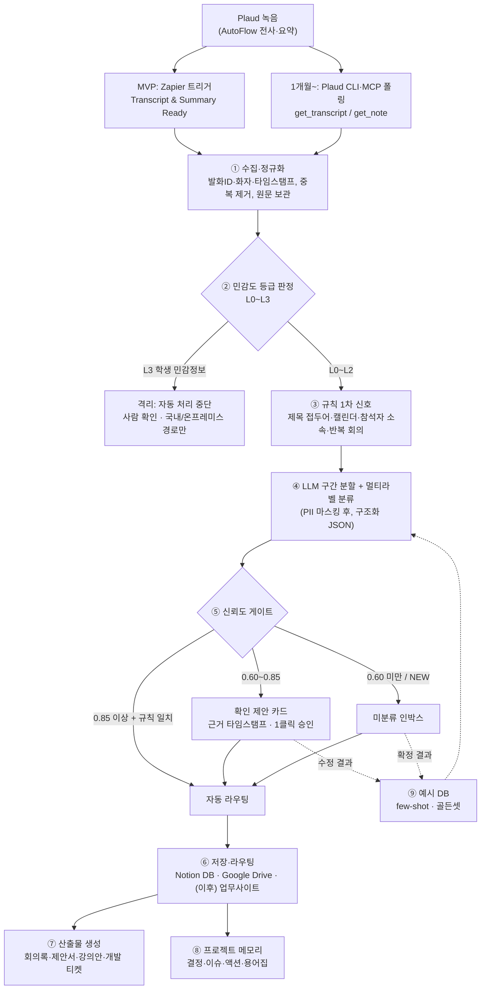

# CRATA 회의 자동 분류·라우팅 시스템 설계안 (GOAL A)

> 기준일: 2026-10-01 · 대상: CRATA 대표와 실무자 · 범위: Plaud 녹음 → 사업부·프로젝트별 자동 분류 → 산출물 생성
> 표기: **TODO**는 CRATA 내부에서 확인해야 할 항목, **(미검증)**은 공식 자료로 확인하지 못한 내용, **(제안)**은 이 문서가 권하는 기준값입니다.

---

## 1. 결론 요약

1. 권고는 **"녹음·전사는 지금 쓰는 서비스를 그대로 쓰고(Buy), 분할·분류·라우팅 레이어만 얇게 직접 만든다(Build)"**입니다. Plaud는 그대로 쓰고, 공식 경로인 Zapier 트리거와 Plaud MCP·CLI로 녹음을 가져옵니다. 회의를 구간으로 나누고, 사업부·프로젝트로 분류하고, 알맞은 곳으로 보내는 부분만 CRATA가 만듭니다.
2. 직접 만드는 이유는 시장에 해당 기능이 없기 때문입니다. 국내외를 다 찾아봐도 "회의 하나를 구간으로 나눠 구간마다 다른 프로젝트로 보내는" 완제품은 확인되지 않았습니다. 가장 가까운 Circleback의 태그 자동 분류와 Plaud Intelligence의 Events 자동 배정도 회의 1건 단위로만 동작합니다.
3. 비용은 걸림돌이 아닙니다. LLM 처리비는 60분 회의 1건에 약 $0.12(약 175원, Claude Sonnet 5.5 기준)이고, 월 증분 비용은 4~7만 원 수준입니다. 성패는 분류 체계를 얼마나 잘 설계하느냐와 사람 검수 루프에 달려 있습니다.
4. 순서는 다음과 같습니다. 1주 MVP(Zapier → Claude → Notion 또는 Drive, 전부 사람 확인) → 1개월(Plaud CLI·MCP로 타임스탬프 기반 구간 분할과 프로젝트 메모리 구축) → 3개월(학습 루프를 붙이고 아라 모듈로 제품화).
5. 학맞통 학생 개인정보가 들어 있는 회의(사례회의, 상담)는 이 파이프라인에 넣지 않습니다. Plaud 클라우드와 해외 LLM을 거치기 때문입니다. 이것이 전체 설계의 전제 조건입니다.

---

## 2. 기존 서비스로 어디까지 되나: 범위와 한계

### 2.1 Plaud 자체 기능 (CRATA가 현재 쓰는 입력원)

| 기능 | 가능 여부 | 근거와 비고 |
|---|---|---|
| 한국어 전사·화자 분리 | ○ | 112개 언어에 한국어 포함 ([Plaud 요금](https://www.plaud.ai/pages/plaud-ai-plan-pricing)) |
| 자동 전사·요약 (AutoFlow) | ○ | 클라우드 동기화 때 자동 실행되고, 이메일 발송 옵션이 있음 ([AutoFlow](https://support.plaud.ai/hc/en-us/articles/50835520394009-AutoFlow)) |
| 커스텀 요약 템플릿 | ○ | CRATA 전용 템플릿을 만들어 요약 안에 "사업부 후보 / 주제 전환 지점" 섹션을 넣을 수 있음 |
| 일반 공개 API | ✕ | 일반 사용자용 범용 API가 없고 대기자 명단도 없다고 공식 안내 ([Plaud 지원센터](https://support.plaud.ai/hc/en-us/articles/60726890231449)) |
| MCP·CLI | ○ (읽기 전용) | 2026-05-12 GA. 도구는 login, logout, get_current_user, list_files, get_file, get_note, get_transcript 7개. get_transcript는 타임스탬프와 화자 라벨을 주고, get_file은 24시간 유효한 오디오 URL을 줌 ([MCP 문서](https://docs.plaud.ai/plaud-mcp-cli/mcp), [변경 이력](https://docs.plaud.ai/plaud-mcp-cli/changelog.md)). 모든 활성 계정에서 무료 |
| MCP 버전 | 주의 | 문서에는 "v1.0.0"으로 적혀 있지만 npm 패키지는 0.x입니다(2026-09 기준 @plaud-ai/mcp 0.3.13, @plaud-ai/cli 0.3.14). **버전은 0.x로 고정하세요** ([npm](https://registry.npmjs.org/@plaud-ai/mcp)) |
| 녹음 목록 필터 | 제한적 | list_files는 제목 키워드와 날짜 범위로만 거를 수 있고 폴더·태그 필터는 없음. CLI 검색은 최근 500개 녹음의 제목만 대상 ([CLI 문서](https://docs.plaud.ai/plaud-mcp-cli/cli)) |
| Zapier 연동 | ○ (트리거 1개) | "Transcript & Summary Ready" 하나뿐. 재전사·재요약 때도 다시 발동하고, 액션은 0개. 출력 필드는 문서화되어 있지 않음 ([Zapier](https://zapier.com/apps/plaud/integrations)) |
| Plaud 폴더 자동 배정, 폴더 쓰기 | ✕ | 공식 수단으로는 폴더를 읽을 수도 쓸 수도 없음. 따라서 분류 결과의 정본은 Plaud 밖에 둬야 함 |
| Plaud Intelligence: Events, Skills, Routines, Connectors, Artifacts | 배포 예정 | 2026-09-22 발표, 10월 배포 예정(공식 페이지 메타 설명에는 10월 12일). Agent가 맥락을 보고 녹음을 사용자가 만든 Event에 배정함 ([Plaud Intelligence](https://www.plaud.ai/blogs/news/introducing-plaud-intelligence), [Knowledge Base](https://www.plaud.ai/blogs/news/plaud-knowledge-base)) |
| └ 한계 | | 회의 단위로만 배정되고, 구간 분할은 문서에 없음. Connectors는 보내기 전에 항상 사용자 확인을 받음 ([Connectors](https://www.plaud.ai/blogs/news/plaud-intelligence-artifacts-connectors)). Skills·Routines는 Plaud 크레딧을 차감함. 새 지식베이스는 기존 폴더 대신 시간·Events 기준으로 정리됨. 한국어 Agent 품질은 확인하지 못함 |

**정리:** Plaud로 "녹음 → 전사 → 요약 → 회의 단위 자동 배정"까지는 됩니다. "한 회의 안의 여러 파트 분할, 구간별 라우팅, 프로젝트 메모리 누적"은 Plaud 밖에서 만들어야 합니다.

### 2.2 국내외 회의 AI의 자동 분류 기능 비교

| 서비스 | 자동 분류/라우팅 | 다중 주제 분할 | API/MCP | 한국어 | 비고 |
|---|---|---|---|---|---|
| **Circleback** (미국) | AI가 **사용자가 미리 만든 태그 목록 안에서만** 회의를 태깅함. 태그 설명과 과거 태깅 이력을 참고하고, 태그를 조건으로 Notion, Linear, 웹훅 자동화를 실행 ([문서](https://circleback.ai/docs/support/meetings/automatic-meeting-tagging)) | ✕ (회의 단위) | Public API(2026-08), API로 회의 가져오기(2026-09), MCP(2026-07) ([릴리스](https://circleback.ai/releases)) | ○. 주 언어 하나로 전사해서 언어 혼용에 약함 ([언어](https://circleback.ai/docs/support/meetings/meeting-languages)) | GOAL A에 가장 가까운 구조. 분류 체계 설계를 벤치마크할 1순위 |
| **Fireflies.ai** (미국) | Rules Engine. 제목, 호스트, 참석자 도메인, 내부/외부 여부 같은 **결정론적 규칙**으로 라우팅. Enterprise 관리자 전용 ([문서](https://guide.fireflies.ai/articles/4608292950-learn-about-the-rules-engine-feature)) | ✕ | GraphQL, 웹훅, 원격 MCP ([MCP](https://docs.fireflies.ai/getting-started/mcp-configuration)) | ○ | AI가 의미로 분류하는 기능은 아님. 1차 규칙 필터 설계의 참고용 |
| **Granola** (영국) | 반복 회의 시리즈 → 폴더 자동 추가(사용자가 켜야 함) ([문서](https://docs.granola.ai/help-center/sharing/folders/spaces-and-folders)) | ✕ | API, MCP(일부 도구는 유료) ([MCP](https://docs.granola.ai/help-center/sharing/integrations/mcp)) | ○ | 폴더 단위 질의응답과 Recipes(회의 유형별 프롬프트)가 참고할 만함 |
| **Read AI** (미국) | 회의 유형 7종 자동 분류 + 커스텀 태그 ([소개](https://www.read.ai/post/new-features-read-introduces-meeting-tags-and-advanced-search)) | 챕터·토픽 | MCP·API 오픈베타(2026-03) | ○ (2025-02 추가) ([공지](https://www.read.ai/post/korean-polish-catalan-and-ukrainian-now-added-to-read-ai)) | "사업부 × 회의 유형" 2축 분류의 근거 |
| **Avoma** (미국) | 제목 키워드로 회의 목적을 정하고 템플릿을 자동 적용 ([문서](https://help.avoma.com/purposes-and-outcomes)) | Smart Chapters | API | 국내 비교 글 기준 지원(품질 편차) | "제목 접두어 규칙"의 근거 |
| **MeetGeek** | 제목, 참석자, 대화 구조, 어휘, 흐름으로 회의 유형을 판별해 템플릿 적용(유료) ([문서](https://support.meetgeek.ai/en/articles/6021910-meeting-templates)) | ✕ | API, MCP | 미확인 | 다중 신호 분류의 참고 |
| **tl;dv** (독일) | ✕ | 토픽별로 묶은 노트 | API(Pro/Business), 웹훅, MCP ([문서](https://intercom.help/tldv/en/articles/11583137-api-and-webhooks)) | ○ | URL로 회의를 가져올 수 있음 |
| **MS Teams** 인텔리전트 요약 | ✕ | **챕터·토픽 분할** 있음 ([문서](https://support.microsoft.com/en-us/teams/meetings/recap-in-microsoft-teams)) | Graph(aiInsights는 베타) | Copilot은 지원. 여러 언어가 섞인 회의에 약함 | 분할은 되지만 구간별 라우팅은 없음 |
| **Notion** AI 회의록 + Custom Agents | "AI 회의록 완료" 트리거로 에이전트 실행(2026-07-31). 어느 프로젝트로 보낼지는 직접 설계해야 함 ([릴리스](https://www.notion.com/releases/2026-07-31)) | ✕ | API, MCP | 전사는 지원. 화자 라벨은 영어만 ([문서](https://www.notion.com/help/ai-meeting-notes)) | Business/Enterprise 플랜 필요. 에이전트가 전사본을 그대로 받는지는 문서에 명시되지 않음 |
| **Otter.ai** | 캘린더 규칙으로 채널 자동 공유 | — | API, MCP | **✕ 미지원** | 직접 도입 불가 |
| **Supernormal** | 프로젝트 배정은 수동 | — | MCP | **✕ 미지원** (7개 언어) | "회의 → 제안서·덱" 콘셉트만 참고 ([업데이트](https://www.supernormal.com/product-updates)) |
| **Fathom** | ✕ | — | API, MCP | 전사만 | 2026-09-14 Superhuman 인수 발표. 독립 제품으로서의 방향이 불확실 ([TechCrunch](https://techcrunch.com/2026/09/14/superhuman-acquires-yc-backed-notetaker-fathom-as-productivity-platforms-push-for-agentic-work/)) |
| **티로(Tiro)** (국내) | 폴더 자동화는 **프리셋 상속일 뿐 AI 분류가 아님**. 외부에서 "Attach Note to Folder" API로 분류할 수는 있음 ([폴더](https://docs.tiro.ooo/en/guide/automation/folders.md)) | 미확인 | API, MCP, CLI, 웹훅을 전 플랜에서 무료로 제공 ([문서](https://docs.tiro.ooo/en/guide/notes/api-mcp-cli.md)) | 네이티브 | 저장은 서울이지만 **처리는 미국 수탁자**가 함 ([처리방침](https://tiro.ooo/privacy-policy)) |
| **콜라보(Callabo)** (국내) | "AI 레이블 자동 추천/설정" ([요금](https://callabo.ai/pricing)) | 미확인 | 웹훅 API는 "제공 예정" | 네이티브 | 국내에서 가장 가까운 기능. ISO 27001 보유 |
| **클로바노트**(네이버웍스) | ✕ (폴더 수동 관리) | — | Team 이상에서 외부 연동 API(공개 문서 없음) | 네이티브 | AI 학습에 쓰지 않는다고 명시 ([소개](https://naver.worksmobile.com/feature/clovanote/)) |
| **텐센트회의** (중국) | ✕ | 장·주제·발언자별 요약(V3.35.0) ([릴리스](https://cloud.tencent.com/document/product/1095/47064)) | Open API | 미확인 | 요약 축 설계 참고 |
| **통의청오** (알리바바) | ContentExtraction: 사용자가 정의한 차원을 최대 100개까지 추출 ([문서](https://help.aliyun.com/zh/tingwu/content-extraction)) | 주제 기반 장 분할과 **세밀도 선택**(시간당 Coarse 약 4개 ~ Meticulous 12~15개) ([문서](https://help.aliyun.com/zh/tingwu/chapter-quick-view)) | API. 문장 ID를 근거로 반환 ([CustomPrompt](https://help.aliyun.com/zh/tingwu/custom-prompt)) | 한국어 전사는 감지하지만 장 요약은 중국어/영어로만 출력 | **베이징 리전 전용**이라 도입은 권하지 않음. API 설계만 참고 |
| **Feishu** 妙记 + 다차원표 | 워크플로의 "AI 분류" 노드가 2~10개 분기에 "기타"까지 지원 ([문서](https://www.feishu.cn/hc/zh-CN/articles/843535382074)) | 章节纪要(장별 요약) ([API](https://open.feishu.cn/document/uAjLw4CM/ukTMukTMukTM/minutes-v1/minute/artifacts)) | Open API와 이벤트 | 미확인 | 완제품은 아니고 부품을 조립하는 구조. 파이프라인 설계 참고 |
| **Rimo**(구 Rimo Voice, 일본) | Actions: 태스크를 제안하고, 승인하면 산출물로 실행 ([소개](https://rimo.app/about/actions)) | — | 권한을 반영하는 CLI·MCP(2026-06) ([공지](https://rimo.app/about/company/news/cli-mcp)) | 60개 이상 언어 | 2026-10-01 이름 변경 |
| **Otolio**(구 스마트書記, 일본) | kintone 필드 업데이트를 **근거 타임스탬프와 함께 제안**하고 1클릭으로 승인 ([공지](https://www.smartshoki.com/news/post-9933/)) | — | kintone, Salesforce | 미확인 | **사람 검수 UX의 모범 사례** |
| **Omi** (오픈소스) | 폴더 설명을 보고 대화를 폴더에 자동 배정(MIT) ([변경 이력](https://feedback.omi.me/changelog/goals-tracking-long-awaited-folders-daily-recaps-and-much-more)) | — | REST, 웹훅, MCP | 미확인 | 정확도 문제가 보고된 적 있음 ([#4043](https://github.com/BasedHardware/omi/issues/4043)) |

### 2.3 시사점

- **빈 영역은 "구간 단위 라우팅" 하나입니다.** 분할(Teams, 텐센트, 통의청오, Feishu)과 회의 단위 분류(Circleback, Read AI, Plaud Events)는 각각 있습니다. 둘을 이어 "구간마다 다른 프로젝트로 보내는" 제품은 확인되지 않았습니다. 이 부분이 CRATA가 만들 부분이자, 나중에 아라에 넣을 차별점입니다.
- **바로 가져다 쓸 설계 원칙**은 네 가지입니다. ① 닫힌 태그 목록과 설명을 기반으로 분류(Circleback) ② 사업부 축과 회의 유형 축을 나눈 2축 분류(Read AI, MeetGeek) ③ 근거를 붙여 제안하고 사람이 1클릭으로 승인(Otolio, Rimo) ④ 세밀도 조절과 문장 ID 근거(통의청오).
- **특정 업체에 묶이면 위험합니다.** Limitless는 Meta에 인수된 뒤 한국 서비스가 바로 종료됐고(2025-12, [9to5mac](https://9to5mac.com/2025/12/05/rewind-limitless-meta-acquisition/)), Fathom은 인수됐으며, OpenAI Agent Builder는 2026-11-30 종료 예정입니다([공지](https://developers.openai.com/api/docs/deprecations)). 원문 전사본과 분류 결과는 CRATA 소유 저장소에 보관해야 합니다.
- **국내 실전 선례**도 있습니다. GPTers의 "클로바노트 → 고객사별 Notion DB 자동 정리" 사례에서는 사전 인터뷰, 1건 검증 후 일괄 처리, 처리 로그, "애매하면 미분류" 원칙을 썼습니다([GPTers](https://www.gpters.org/nocode/post/clobanote-which-only-accumulated-UHMKOafs00VtQ8X)). 공개된 Plaud 루틴 예시는 녹음을 4개 프로젝트로 내용 기반 분류하고, 애매한 건은 "Unsorted"로 보내며, 태스크를 NEW/UPDATE/TRACKED로 구분해 중복을 제거합니다([gist](https://gist.github.com/voyera/8b2aa27c9f080497a83e9f0c3849bcb6)).

---

## 3. 권장 아키텍처

### 3.1 전체 흐름도



### 3.2 단계별 설명

| 단계 | 하는 일 | 핵심 규칙 |
|---|---|---|
| ① 수집·정규화 | 전사본을 `[uid │ 시각 │ 화자] 발화` 형태로 바꾸고, 녹음 ID로 중복을 제거함 | Zapier 트리거는 재요약 때도 다시 발동하므로 **중복 제거가 필수**. 원문은 CRATA 저장소에 따로 보관 |
| ② 민감도 판정 | L0~L3 등급을 매김(8장 참조) | 등급은 **해외 LLM에 보내기 전에** 정해야 함. 메타데이터, 제목 접두어, 키워드 규칙을 쓰고, 판단이 애매하면 높은 등급으로 처리 |
| ③ 규칙 신호 | 제목 접두어, 녹음 시각과 맞는 캘린더 일정(일정명, 참석자 도메인, 장소), 반복 일정 여부, 프로젝트 별칭 일치 | Fireflies·Avoma·Granola처럼 결정론적 신호를 먼저 씀. LLM에는 "힌트"로 전달 |
| ④ LLM 분할·분류 | 회의 전체를 한 번에 넣어 구간과 라벨을 JSON으로 받음 | 60분 회의는 컨텍스트에 통째로 들어감. 구간 범위는 발화 ID로 지정하게 해서 시각을 지어내지 못하게 함 |
| ⑤ 신뢰도 게이트 | 자동 처리, 확인 제안, 미분류 중 하나로 보냄 | 6장 참조. 처음 2주는 **전부 사람이 확인** |
| ⑥ 저장·라우팅 | 구간마다 1행을 만들고 프로젝트 DB와 연결함 | **정본은 Plaud 밖**에 둠. Plaud 폴더는 API로 쓸 수 없음 |
| ⑦ 산출물 | 사업부와 업무유형별 템플릿으로 초안을 만듦 | 외부로 나가는 것(메일, 고객 공유)은 항상 사람이 확인 |
| ⑧ 메모리 | 결정, 이슈, 액션, 용어를 덧붙이기만 하는 방식으로 누적 | 원본 회의 링크와 타임스탬프를 근거로 남김 |
| ⑨ 학습 | 사람이 수정한 결과를 예시로 저장 | 다음 분류 때 비슷한 예시를 자동으로 넣음 |

### 3.3 입력 경로 4가지 비교

| 경로 | 구성 | 장점 | 한계 | 월 증분 비용(3인·월 40건 / 10인·월 80건) | 설치 시간 |
|---|---|---|---|---|---|
| **A. Zapier** (1주 MVP 권장) | Plaud 트리거 → Claude → Looping → Notion/Drive → 알림 | 노코드. 녹음이 끝나면 바로 실행되는 푸시 방식 | 출력 필드가 문서화되지 않아 타임스탬프가 빠질 수 있음(**먼저 테스트**). 태스크 과금 | 약 $50 / $110~130 | 8~16시간 |
| **B. 에이전트 루틴 + Plaud CLI·MCP** (1개월 목표) | 상시 서버나 Claude Code 루틴이 `plaud recent`로 조회 → get_transcript → 분할·분류 → Notion MCP | 타임스탬프와 화자를 확실히 받음. 산출물 생성까지 한 흐름 | 읽기 전용이고 웹훅이 없어 폴링해야 함. Node 20 이상 필요. 0.x 버전 고정 | 약 $35~40 / $105 | 20~40시간 |
| **C. Plaud 기본 기능** (병행 실험) | Events, Skills, Routines, Notion 커넥터 | 개발이 필요 없음 | 회의 단위로만 배정되고, 보낼 때마다 확인이 필요하며, 크레딧이 들고, 출시 전임 | $20~60 / $80~200 | 2~6시간 |
| **D. AutoFlow 메일** (최저가 대안) | AutoFlow 메일 → 전용 Gmail → Apps Script → Claude → Drive/Notion | Zapier 비용이 없음 | 메일 형식이 바뀌면 깨지기 쉽고, 화자와 타임스탬프가 빠질 수 있음 | 약 $28 / $85 | 10~20시간 |

> 위 비용에는 Plaud 구독, Zapier, LLM API가 포함되고 Notion 좌석료는 빠져 있습니다. Notion Business를 쓰면 3인 +$60, 10인 +$200이 추가됩니다. 경로 A·B·C·D의 구성은 [Zapier](https://zapier.com/apps/plaud/integrations), [Plaud CLI](https://docs.plaud.ai/plaud-mcp-cli/cli), [Plaud Intelligence](https://www.plaud.ai/blogs/news/introducing-plaud-intelligence), [AutoFlow](https://support.plaud.ai/hc/en-us/articles/50835520394009-AutoFlow) 기준입니다. 참고로 Zapier MCP로는 Plaud 데이터를 조회할 수 없습니다. Plaud 쪽에 액션이 없기 때문입니다.

### 3.4 도구 선택과 이유

| 역할 | MVP 선택 | 이유 | 대안·나중 |
|---|---|---|---|
| 처리 엔진 | Claude Sonnet 5.5 API + 구조화 출력 | 한국어 품질이 좋고, JSON 스키마 형식을 보장하며([문서](https://platform.claude.com/docs/en/build-with-claude/structured-outputs)), 건당 약 175원 | 분류만 할 때는 Haiku 4.5(건당 약 65원). L2 등급은 국내 리전(8장) |
| 자동화 | Zapier Pro 750 태스크($19.99/월, 연간 결제) | Formatter·Paths·Filter 단계는 태스크로 차감되지 않음([요금](https://zapier.com/pricing)) | n8n: Text Classifier 노드가 "여러 클래스 동시 허용"과 "매칭 없음 → Other 분기"를 지원([문서](https://docs.n8n.io/integrations/builtin/cluster-nodes/root-nodes/n8n-nodes-langchain.text-classifier/)). 셀프호스팅 CE는 무료 |
| 정본 저장소 | **TODO: 지금 쓰는 협업 도구 확인.** Notion을 쓰고 있다면 Notion DB(관계·뷰를 검수 화면으로 겸용), 아니라면 Google Sheets + Drive | DB 하나에 회의, 구간, 프로젝트, 결정, 액션을 관계로 연결 | 3개월 이후 CRATA 업무사이트(GOAL B와 같은 구조) |
| 알림 | Slack 또는 메일(**TODO: 사내 메신저 확인**) | 미분류와 확인 요청을 알림 | 사내 메신저 봇 |
| 장표 산출물 | Gamma API(템플릿 기반 생성, PDF/PPTX 내보내기) ([문서](https://developers.gamma.app/)) | 브랜드 템플릿을 재사용할 수 있음 | 사내 PPT 템플릿 |
| 개발 티켓 | Linear MCP(**TODO: 사용 여부**) ([문서](https://linear.app/docs/mcp)) | 아라 개발 회의에서 바로 티켓 생성 | Notion 업무 DB 또는 GitHub |

> Notion Custom Agents는 Business 이상에서 쓸 수 있고 2026-05-04부터 1,000 크레딧당 $10로 과금됩니다([도움말](https://www.notion.com/help/custom-agents)). Plaud에서 온 데이터로 에이전트를 돌리려면 "AI 회의록 완료" 트리거가 아니라 "DB에 페이지 추가" 트리거를 써야 합니다. MVP는 Custom Agents 없이 만들 수 있습니다.

### 3.5 단계별 로드맵

#### 0단계 (1~2일, 추가 비용 0원): 준비
- 대표와 1~2시간 인터뷰해서 분류 체계 v0.1(4장)을 확정합니다. 진행 중인 고객과 과정, 학맞통 기관, 아라 하위 과제를 레지스트리에 등록합니다.
- Claude Desktop/Code에 Plaud MCP를 연결합니다. 과거 녹음 30건을 수동으로 분할·라벨링해서 **골든셋**(정답 세트)을 만듭니다. 이 단계에서 프롬프트를 다듬습니다. 순서는 1건 검증 후 일괄 처리입니다.
- 녹음 제목 규칙을 정합니다. 녹음 직후 앱에서 `[강의] [학맞통] [아라] [공통] [혼합]` 접두어를 붙입니다. 제목 키워드는 list_files 필터로도 쓰입니다.

#### 1주 MVP: "복사·붙여넣기를 없애고, 전부 사람이 확인"
1. Plaud AutoFlow를 켜고 **CRATA 전용 요약 템플릿**을 만듭니다. 섹션은 회의 요약, 사업부 후보, 프로젝트·고객 후보, 주제 전환 지점(시각), 언급된 기관·고객명, 결정·할 일입니다.
2. Zapier: 트리거(최소 길이 3~5분) → 중복 키(파일 ID 필드가 있으면 그것, 없으면 제목+시각) → Claude 호출(5장 프롬프트, JSON) → 구간마다 반복 → "구간 DB" 행 생성과 프로젝트 관계 연결 → 신뢰도와 관계없이 "확인 대기"로 넣고 알림.
3. 산출물은 회의록과 액션아이템 2종만 만듭니다.
4. **통과 기준(제안):** 회의 20건 처리, 사업부 단위 정확도 측정, 담당자의 수정 시간 기록.

#### 1개월: "정확한 구간 분할 + 프로젝트 메모리"
1. 수집을 경로 B로 옮깁니다. Plaud CLI·MCP(0.3.x로 고정)로 폴링하고, processed_ids로 처리 이력을 남기고, 원문 전사를 별도 보관합니다.
2. 발화 ID 기반 정규화와 2단계 처리를 도입합니다. 라우팅용은 굵게 나누고, 산출물용은 구간 안에서 세밀하게 나눕니다.
3. 민감도 게이트와 PII 마스킹(8장)을 적용하고, L3는 격리 큐로 보냅니다.
4. 프로젝트 메모리 DB(결정, 이슈, 액션, 이해관계자, 용어집)를 만들고 다음 회의 전 자동 브리핑을 붙입니다.
5. 산출물 템플릿 5종을 추가합니다(7장): 강의 요구분석, 견적 제안, 학맞통 기관 협의 메모(비식별), 아라 티켓, 후속 메일 초안.
6. 신뢰도 게이트를 켭니다. 0.85 이상이면서 규칙과 일치할 때만 자동 처리합니다.
7. Plaud Intelligence가 배포되면 사업부별 Event를 만들어 2~4주 병행 시험하고 분류 정확도를 비교합니다.
8. **통과 기준(제안):** 사업부 정확도 95% 이상, 프로젝트 정확도 85% 이상, 자동 처리 비율 40% 이상.

#### 3개월: "스스로 좋아지는 시스템, 그리고 아라 모듈화"
1. 예시 DB에서 비슷한 사례 5개를 KURE-v1 한국어 임베딩([모델](https://huggingface.co/nlpai-lab/KURE-v1))으로 찾아 few-shot으로 자동 삽입합니다.
2. 확정 라벨이 쌓이면 SetFit(클래스당 약 8개 예시로도 경쟁력이 있음, [GitHub](https://github.com/huggingface/setfit))으로 값싼 1차 분류기를 만듭니다. SetFit과 LLM의 결과가 다르면 검수로 보냅니다.
3. 긴 회의는 경계를 교차 검증합니다. 임베딩 변화점(ruptures, TreeSeg)과 LLM 경계를 비교합니다([ruptures](https://github.com/deepcharles/ruptures), [TreeSeg](https://github.com/AugmendTech/treeseg)).
4. 여러 회의를 묶은 리포트를 만듭니다. 사업부별 주간 리포트와 "이 프로젝트에서 지난 3번 회의의 결정은?" 같은 질의응답입니다.
5. (선택) 시간축 메모리 Graphiti를 도입합니다([GitHub](https://github.com/getzep/graphiti)). CRATA 회의 저장소를 MCP로 노출해 Claude와 아라가 직접 조회하게 합니다(Rimo 방식).
6. 품질이 나쁜 녹음은 재전사 A/B를 합니다: RTZR, CLOVA Speech(한영 혼합 enko 모드)(9장).
7. 파이프라인을 아라 모듈로 정리해서 GOAL B(고객사 업무사이트)에 재사용합니다.
8. **통과 기준(제안):** 프로젝트 정확도 90% 이상, 자동 처리 60% 이상, 회의 1건당 사람 검수 2분 이하.

---

## 4. 분류 체계(taxonomy) 설계

### 4.1 설계 원칙

1. **닫힌 목록(closed set).** LLM은 목록 안에서만 고릅니다. 새 프로젝트는 `NEW` 후보로 제안만 하고, 등록은 사람이 합니다. Circleback도 "이미 만든 태그 안에서만" 고르는 원칙으로 흔들림을 막습니다([문서](https://circleback.ai/docs/support/meetings/automatic-meeting-tagging)).
2. **설명이 핵심입니다.** 노드마다 포함·제외 기준, 키워드, 별칭(전사 오류 포함), 대표 고객·기관, 예시 2~3개를 둡니다. Circleback의 태그 설명, Omi의 폴더 설명, 통의청오의 "차원 정의문"이 같은 방식입니다.
3. **2축으로 나눕니다.** "어디로 보낼지(사업부 > 프로젝트 > 업무유형)"와 "어떤 회의인지(회의 유형)"를 분리합니다. 회의 유형 축은 산출물 템플릿을 고를 때 씁니다(Read AI, MeetGeek).
4. **코드가 아니라 데이터로 관리합니다.** 정본은 YAML이나 Notion DB입니다. 프롬프트의 enum은 매 호출 때 정본에서 생성하므로 새 프로젝트가 생겨도 프롬프트를 고칠 필요가 없습니다.
5. **계층은 3단으로 고정하고, 형제 노드는 10개 안팎으로 유지합니다.** Feishu의 AI 분류 노드도 2~10개 분기로 제한됩니다.
6. **교차 규칙을 문서로 적어 둡니다.** 예: "학맞통 주제의 교사 연수는 SSI가 primary, EDU는 secondary." 규칙이 없으면 같은 회의가 매번 다르게 분류됩니다.
7. **민감도 기본값을 노드에 붙입니다.** 예를 들어 SSI는 기본 L2이고, 학생 정보가 감지되면 L3로 올립니다.
8. **용어집은 두 군데에 씁니다.** 같은 별칭 목록을 STT 부스팅 사전과 분류 힌트로 함께 씁니다.
9. **미분류는 실패가 아니라 정상적인 출구입니다.** 억지로 분류하는 것보다 미분류가 낫습니다(GPTers 사례와 voyera 루틴의 공통 원칙).
10. **담당자와 리뷰 주기를 정합니다.** 월 1회 혼동 사례를 보고 설명과 별칭을 고칩니다.

### 4.2 CRATA 분류 체계 YAML 초안 v0.1

> 강의·워크샵, 학맞통, 아라는 사용자가 말한 사업부입니다. DX(진단·코칭)는 회사 웹사이트([crata.co.kr](https://crata.co.kr/about))에 4종 행동방식검사, Re:Cover 프로그램, 강사교육이 보여서 후보로 넣었습니다. AXC(AX 컨설팅·업무사이트)는 GOAL B를 반영한 후보입니다. 두 후보는 별도 사업부인지 **TODO**로 확인해야 합니다.

```yaml
# CRATA 회의 분류 체계 v0.1 (초안, 2026-10-01)
# 이 파일(또는 같은 구조의 Notion DB)이 정본이다. 프롬프트의 enum은 매 호출 때 여기서 생성한다.
meta:
  version: "0.1"
  owner: "TODO: 분류체계 관리자 1명"
  last_reviewed: "2026-10-01"
  review_cycle: "월 1회. 혼동 사례를 보고 description, keywords, aliases를 고친다"

cross_rules:   # 사업부가 겹칠 때의 우선순위 (TODO: 대표 확인)
  - "학맞통이 주제인 연수·강의는 SSI가 primary, EDU는 secondary"
  - "강의 중 아라 시연·홍보 논의는 EDU primary, ARA secondary"
  - "아라를 학교·기관에 시범 도입하는 논의는 ARA.pilot primary. 학맞통 관련이면 SSI secondary"
  - "특정 사업부의 견적·정산은 그 사업부의 업무유형으로 분류. 회사 전체 재무만 CORE.finance"
  - "이 회의 분류 시스템 자체에 대한 논의는 ARA-MEETING-PIPELINE"

sensitivity_levels:
  L0: "공개 정보 위주: 강의 기획, 마케팅, 공개 자료"
  L1: "CRATA 내부 업무: 아라 개발, 내부 운영, 업무 연락처 수준의 개인정보"
  L2: "고객 기밀: 고객사·기관 내부 사정, 계약 조건"
  L3: "민감: 학생 개인정보·상담·건강·가정, 14세 미만, 인사 분쟁"

meeting_types:   # 두 번째 축. 산출물 템플릿 선택에 쓴다
  - {id: client_meeting, name: "고객 미팅", keywords: [요구사항, 견적, 고객사, 담당자]}
  - {id: agency_consult, name: "기관 협의", keywords: [교육청, 교육지원청, 학교, 센터, 협의]}
  - {id: planning, name: "기획·브레인스토밍", keywords: [기획, 아이디어, 설계, 구상]}
  - {id: internal_regular, name: "내부 정기회의", keywords: [주간회의, 진행 상황, 공유]}
  - {id: review, name: "리뷰·회고", keywords: [리뷰, 회고, 피드백, 만족도]}
  - {id: one_on_one, name: "1대1 면담", keywords: [면담, 원온원]}
  - {id: lecture_rehearsal, name: "강의 리허설", keywords: [리허설, 시연, 예행]}
  - {id: other, name: "기타", keywords: []}

business_lines:
  # ─────────────────────────────── 강의·워크샵
  - id: EDU
    name: "강의·워크샵"
    owner: "TODO"
    default_sensitivity: L0
    description: "기업·학교·교사 대상 AI 강의·워크샵·연수의 수주, 기획, 운영, 사후관리"
    include: "고객 요구 미팅, 커리큘럼·교안 작업, 강사 배정, 견적·정산, 사후 리뷰"
    exclude: "학맞통이 주제인 연수(→ SSI), 아라 제품 개발 자체(→ ARA)"
    keywords: [강의, 특강, 워크샵, 연수, 커리큘럼, 교안, 실습, 강사, 수강생, 출강, 견적, 만족도]
    aliases: [워크숍, 세미나, 교육과정]
    examples:
      - "○○기업 임원 대상 생성형 AI 특강 요구사항 미팅"
      - "교사 대상 AI 활용 연수 2차시 교안 리뷰"
    projects:
      - id: EDU-TEMPLATE
        name: "{고객사}-{과정명}-{연도}"
        description: "TODO: 진행 중인 과정마다 1행씩 등록 (예: EDU-2026-007)"
        client: "TODO"
        keywords: ["TODO: 고객사명", "TODO: 과정명", "TODO: 담당자 직함"]
        aliases: []
        examples: []
        owner: "TODO"
        status: template
      - id: EDU-CONTENT
        name: "공통 강의 콘텐츠·교안 자산"
        description: "특정 고객과 무관한 표준 교안·실습 자료 개발"
        keywords: [표준 교안, 공통 자료, 실습 예제]
        aliases: []
        examples: ["생성형 AI 기초 표준 교안 개정 논의"]
        owner: "TODO"
        status: active
    task_types:
      - {id: EDU.inquiry, name: "문의·수요 발굴", description: "신규 문의 대응, 교육 수요 파악", keywords: [문의, 수요, 소개, 연락], examples: ["○○재단 담당자 첫 통화"], owner: TODO}
      - {id: EDU.proposal, name: "제안·견적", description: "제안서·견적서 작성, 가격·조건 협의", keywords: [제안서, 견적, 단가, 예산, 계약], examples: ["강사료·인원 기준 견적 조정"], owner: TODO}
      - {id: EDU.needs, name: "사전진단·요구분석", description: "고객 현업 사례 수집, 대상·수준·목표 파악", keywords: [요구사항, 대상, 수준, 목표, 현업 사례], examples: ["수강 대상 직무와 AI 활용 수준 확인"], owner: TODO}
      - {id: EDU.curriculum, name: "커리큘럼 설계", description: "차시 구성, 학습 목표, 실습 흐름 설계", keywords: [차시, 모듈, 학습목표, 구성], examples: ["4시간 과정 3모듈 구성안 논의"], owner: TODO}
      - {id: EDU.materials, name: "교안·실습자료", description: "슬라이드, 실습지, 사전과제 제작", keywords: [교안, 슬라이드, 실습지, 사전과제], examples: ["실습용 프롬프트 예제 교체"], owner: TODO}
      - {id: EDU.instructor, name: "강사 배정·강사교육", description: "강사 매칭, 강사 사전 교육, 리허설", keywords: [강사, 배정, 리허설, 강사교육], examples: ["보조 강사 2명 배정 논의"], owner: TODO}
      - {id: EDU.ops, name: "운영·일정·장소", description: "일정, 장소, 장비, 수강생 안내", keywords: [일정, 장소, 장비, 노트북, 안내문], examples: ["교육장 와이파이·노트북 대여 확인"], owner: TODO}
      - {id: EDU.review, name: "만족도·사후 리뷰", description: "설문 결과 분석, 개선점 정리", keywords: [만족도, 설문, 피드백, 개선], examples: ["1차 교육 설문 결과 리뷰"], owner: TODO}
      - {id: EDU.billing, name: "정산·계산서", description: "강사료·대금 정산, 세금계산서", keywords: [정산, 계산서, 입금, 강사료], examples: ["10월 출강분 정산 확인"], owner: TODO}
      - {id: EDU.followup, name: "후속 제안", description: "심화 과정·추가 계약 제안", keywords: [후속, 심화, 2차, 연장], examples: ["심화 과정 추가 제안 논의"], owner: TODO}

  # ─────────────────────────────── 학맞통
  - id: SSI
    name: "학맞통(학생맞춤통합지원)"
    owner: "TODO"
    default_sensitivity: L2
    description: "2026.3.1 시행 학생맞춤통합지원법 관련 교육청·교육지원청·학교 대상 컨설팅, 연수, 서식·도구 개발"
    include: "기관 협의, 지원 체계 구축 컨설팅, 관리자·교사·강사 양성 연수, 서식·매뉴얼 개발, 입찰·조달, 성과보고"
    exclude: "학생 개별 사례 논의(사례회의, 상담)는 이 파이프라인에서 처리하지 않음 (L3 격리)"
    keywords: [학맞통, 학생맞춤통합지원, 지원대상학생, 지원팀, 교육지원청, 통합지원센터, 연계기관, 학교장, 교감, 운영계획]
    aliases: [학맞, 학생맞춤, "학맞 통"]
    l3_triggers: ["학생 실명", "학년·반과 이름의 조합", "상담 내용", "가정·건강·경제 형편", "학폭 사안 당사자"]
    policy_area_tags: [심리·정서, 가정, 기초학력, 학업중단, 경제, 건강, 학폭·법률]   # 기관·정책 단위로만 쓴다. 학생 단위 태깅 금지
    examples:
      - "○○교육지원청 학맞통 센터 운영 방안 협의"
      - "학교 관리자 대상 학맞통 연수 커리큘럼 회의"
    projects:
      - id: SSI-TEMPLATE
        name: "{기관}-{사업명}-{연도}"
        description: "TODO: 진행 중인 기관 사업마다 1행 (예: SSI-2026-003)"
        client: "TODO: 교육청·교육지원청·학교명"
        keywords: ["TODO: 기관명", "TODO: 담당 부서", "TODO: 지역 체계 명칭"]
        aliases: []
        examples: []
        owner: "TODO"
        status: template
      - id: SSI-RESEARCH
        name: "학맞통 법령·정책 리서치 자산"
        description: "특정 기관과 무관한 법령·지침·사례 정리"
        keywords: [법령, 시행령, 지침, 매뉴얼, 정책]
        aliases: []
        examples: ["시행령 개정 사항 정리"]
        owner: "TODO"
        status: active
    task_types:
      - {id: SSI.law, name: "법령·지침 해석", description: "학맞통법·시행령·교육청 지침 해석", keywords: [법령, 시행령, 조문, 지침, 동의], examples: ["보호자 동의 절차 해석 논의"], owner: TODO}
      - {id: SSI.agency, name: "기관 협의", description: "교육청·센터·학교와의 협의, 요구사항 확인", keywords: [협의, 장학사, 센터장, 요청사항], examples: ["센터 의뢰 절차 개선 요청 협의"], owner: TODO}
      - {id: SSI.system, name: "체계 구축 컨설팅", description: "지원팀 구성, 업무 흐름, 서식 체계 설계", keywords: [지원팀, 업무흐름, 체계, 역할분담], examples: ["학교 지원팀 역할 분담안 검토"], owner: TODO}
      - {id: SSI.training, name: "연수(관리자·교사·강사 양성)", description: "학맞통 연수 기획·운영, 강사 양성", keywords: [연수, 강사 양성, 찾아가는 연수, 관리자], examples: ["찾아가는 연수 강사 양성 과정 설계"], owner: TODO}
      - {id: SSI.diagnosis, name: "진단도구 적용", description: "행동방식검사 등 진단 도구의 기관 적용 설계", keywords: [진단, 검사, 도구, 선별], examples: ["교사 대상 검사 적용 방안"], owner: TODO}
      - {id: SSI.forms, name: "서식·매뉴얼·도구 개발", description: "표준 서식, 매뉴얼, 체크리스트, AI 도구 개발", keywords: [서식, 매뉴얼, 체크리스트, 양식, HWP], examples: ["운영계획서 표준 서식 초안"], owner: TODO}
      - {id: SSI.procurement, name: "입찰·조달", description: "제안요청서 분석, 입찰·수의계약 준비", keywords: [입찰, 제안요청서, 조달, 수의계약, 나라장터], examples: ["연수 용역 제안요청서 검토"], owner: TODO}
      - {id: SSI.report, name: "성과보고", description: "사업 결과·성과 보고서", keywords: [성과, 결과보고, 실적], examples: ["상반기 연수 실적 보고서 구성"], owner: TODO}
      - {id: SSI.case_meeting, name: "사례회의(처리 제외)", process: false, description: "학생 개별 사례 논의. CRATA 파이프라인에서 처리하지 않고 격리", keywords: [사례회의, 상담, 학생 A], examples: [], owner: TODO}

  # ─────────────────────────────── 아라 에이전트 개발
  - id: ARA
    name: "아라(ARA) 에이전트 개발"
    owner: "TODO"
    default_sensitivity: L1
    description: "CRATA 자체 AI 에이전트 '아라'의 기획·개발·운영. 회사 웹사이트는 아라를 검사 결과 기반 상담 AI 에이전트로 소개함 (TODO: 현재 제품 범위 확인)"
    include: "제품 기획, 프롬프트·대화 설계, 개발·인프라, 안전장치, 평가, 기관 파일럿, 요금제"
    exclude: "아라를 소재로 한 강의(→ EDU), 학맞통 정책 논의(→ SSI)"
    keywords: [아라, ARA, 에이전트, 프롬프트, 기능, 배포, 버그, 스프린트, PRD, 모델]
    aliases: [아라 에이전트]
    examples:
      - "아라 상담 대화 흐름에 위기 신호 에스컬레이션 추가 논의"
      - "다음 스프린트 버그 우선순위 정리"
    projects:
      - {id: ARA-CORE, name: "아라 제품 본체", description: "제품 기능 개발·운영 전반", keywords: [기능, 릴리스, 버그], aliases: [], examples: ["v1.x 릴리스 범위 확정"], owner: TODO, status: active}
      - {id: ARA-PILOT-TEMPLATE, name: "{기관}-아라 파일럿", description: "TODO: 기관별 시범 도입 1행씩", keywords: ["TODO: 기관명"], aliases: [], examples: [], owner: TODO, status: template}
      - {id: ARA-MEETING-PIPELINE, name: "회의 자동 분류 파이프라인", description: "이 설계안의 시스템. 이후 아라 모듈로 제품화", keywords: [플라우드, 회의 분류, 자동화, 파이프라인], aliases: [Plaud], examples: ["분류 정확도 주간 점검"], owner: TODO, status: active}
    task_types:
      - {id: ARA.prd, name: "제품기획·요구사항", description: "기능 정의, PRD 변경", keywords: [PRD, 요구사항, 기능 정의, 우선순위], examples: ["보호자용 화면 요구사항 정리"], owner: TODO}
      - {id: ARA.prompt, name: "대화·프롬프트 설계", description: "대화 흐름, 시스템 프롬프트, 톤", keywords: [프롬프트, 대화 흐름, 페르소나, 톤], examples: ["첫 인사 문구와 질문 순서 조정"], owner: TODO}
      - {id: ARA.data, name: "데이터모델·검사결과 연동", description: "검사 결과·사용자 데이터 구조 (TODO: 연동 여부 확인)", keywords: [데이터, 스키마, 검사 결과, 연동], examples: ["검사 결과 필드 매핑"], owner: TODO}
      - {id: ARA.ux, name: "UX·UI", description: "화면, 사용 흐름", keywords: [화면, UI, UX, 디자인], examples: ["모바일 결과 화면 개선"], owner: TODO}
      - {id: ARA.backend, name: "백엔드·인프라", description: "서버, API, 모델 호출, 비용", keywords: [서버, API, 인프라, 배포 환경, 비용], examples: ["모델 호출 비용 절감 방안"], owner: TODO}
      - {id: ARA.safety, name: "안전장치·위기 에스컬레이션", description: "위기 신호 감지와 사람 연결 규칙", keywords: [위기, 에스컬레이션, 안전, 차단], examples: ["자해 언급 시 사람 연결 절차"], owner: TODO}
      - {id: ARA.privacy, name: "개인정보·보안", description: "수집 항목, 보관, 국외이전, 동의", keywords: [개인정보, 동의, 보관, 암호화], examples: ["14세 미만 법정대리인 동의 처리"], owner: TODO}
      - {id: ARA.eval, name: "평가·QA", description: "품질 평가, 테스트 세트", keywords: [평가, 테스트, QA, 정확도], examples: ["상담 응답 평가 기준 합의"], owner: TODO}
      - {id: ARA.release, name: "배포", description: "릴리스 일정, 배포 체크", keywords: [배포, 릴리스, 출시], examples: ["다음 주 배포 체크리스트"], owner: TODO}
      - {id: ARA.bm, name: "요금제·BM", description: "가격, 패키지, 판매 모델", keywords: [요금제, 가격, 구독, 패키지], examples: ["기관용 연간 라이선스 가격"], owner: TODO}
      - {id: ARA.feedback, name: "사용자 피드백·CS", description: "사용자 의견, 장애 문의", keywords: [피드백, 문의, 불만, 오류 신고], examples: ["파일럿 교사 피드백 정리"], owner: TODO}
      - {id: ARA.pilot, name: "기관 파일럿", description: "기관 시범 도입 설계·운영", keywords: [파일럿, 시범, 도입 기관], examples: ["○○학교 4주 파일럿 일정"], owner: TODO}

  # ─────────────────────────────── 공통(교차 영역)
  - id: CORE
    name: "공통·경영"
    owner: "TODO"
    default_sensitivity: L1
    description: "특정 사업부에 속하지 않는 회사 운영 전반"
    include: "영업 파이프라인 전체, 재무·투자, 채용·HR, 마케팅, 파트너십, 법무, 정부지원사업, 사내 AX"
    exclude: "특정 사업부 고객의 견적·정산(→ 해당 사업부)"
    keywords: [매출, 투자, 채용, 마케팅, 파트너, 계약서, 정부지원, 바우처, 사무실]
    aliases: []
    examples: ["분기 매출·현금흐름 점검", "AI바우처 공급기업 등록 준비"]
    projects:
      - {id: CORE-GENERAL, name: "회사 운영 일반", description: "프로젝트 단위로 나누지 않는 운영 논의", keywords: [], aliases: [], examples: [], owner: TODO, status: active}
    task_types:
      - {id: CORE.sales, name: "영업·파이프라인", description: "전체 영업 현황, 리드 관리", keywords: [영업, 리드, 파이프라인, 수주], examples: ["이번 달 신규 리드 점검"], owner: TODO}
      - {id: CORE.finance, name: "경영·재무·투자", description: "매출, 비용, 투자 유치", keywords: [매출, 비용, 투자, 현금], examples: ["분기 비용 점검"], owner: TODO}
      - {id: CORE.hr, name: "채용·HR", description: "채용, 평가, 조직", keywords: [채용, 면접, 인사, 조직], examples: ["개발자 채용 조건 논의"], owner: TODO}
      - {id: CORE.marketing, name: "마케팅·브랜딩", description: "홍보, 콘텐츠, 브랜드", keywords: [홍보, 콘텐츠, 브랜드, SNS], examples: ["사례 콘텐츠 발행 계획"], owner: TODO}
      - {id: CORE.partnership, name: "파트너십·MOU", description: "협력사·기관 제휴", keywords: [MOU, 제휴, 협력, 파트너], examples: ["지역 기관 MOU 논의"], owner: TODO}
      - {id: CORE.legal, name: "법무·개인정보", description: "계약서, 처리방침, 규제 대응", keywords: [계약서, 처리방침, 개인정보, 법률], examples: ["처리방침 국외이전 표 개정"], owner: TODO}
      - {id: CORE.gov, name: "정부지원사업", description: "바우처, 지원사업 신청·수행", keywords: [바우처, 지원사업, 공고, 신청서], examples: ["2027 AI바우처 준비"], owner: TODO}
      - {id: CORE.ops, name: "운영·총무", description: "사무실, 장비, 계정, 도구", keywords: [사무실, 장비, 계정, 구독], examples: ["협업 도구 구독 정리"], owner: TODO}
      - {id: CORE.internal_ax, name: "사내 AX", description: "CRATA 내부 업무 자동화 (회의 파이프라인은 ARA-MEETING-PIPELINE)", keywords: [자동화, 업무 개선], examples: ["견적서 자동화 아이디어"], owner: TODO}

  # ─────────────────────────────── 후보 사업부 (TODO: 존재·범위 확인)
  - id: DX
    name: "진단·코칭 (후보)"
    status: "TODO_confirm"   # crata.co.kr에 4종 행동방식검사, Re:Cover, 강사교육이 있음. 별도 사업부인지 확인 필요
    owner: "TODO"
    default_sensitivity: L2
    description: "행동방식검사 개발·운영, 결과지, 코칭 과정, 강사·협회 네트워크"
    include: "검사 개발·개정, 결과지, 코칭 과정 운영, 강사 양성"
    exclude: "학맞통 기관 대상 검사 적용(→ SSI.diagnosis)"
    keywords: [검사, 결과지, 코칭, 색채, 행동동기, Re:Cover, 협회, 강사]
    aliases: [리커버]
    examples: ["8주 코칭 과정 운영 점검"]
    projects: []
    task_types:
      - {id: DX.test_dev, name: "검사 개발·개정", description: "문항·유형 체계 개정", keywords: [문항, 유형, 개정], examples: [], owner: TODO}
      - {id: DX.report, name: "결과지", description: "연령별 결과지 구성", keywords: [결과지, 해석], examples: [], owner: TODO}
      - {id: DX.coaching, name: "코칭 과정 운영", description: "코칭·워크숍 운영", keywords: [코칭, 회기], examples: [], owner: TODO}
      - {id: DX.network, name: "강사 양성·협회", description: "강사 교육, 협회 운영", keywords: [협회, 강사 양성], examples: [], owner: TODO}

  - id: AXC
    name: "AX 컨설팅·업무사이트 구축 (후보)"
    status: "TODO_confirm"   # GOAL B. 강의·워크샵 하위로 둘지 별도 사업부로 둘지 결정 필요
    owner: "TODO"
    default_sensitivity: L2
    description: "고객사 업무 패턴 진단, 맞춤 업무사이트·에이전트 구축"
    include: "패턴 진단, 요구사항, 포털 설계·개발, 이관, 인수인계 교육"
    exclude: "단순 강의 납품(→ EDU)"
    keywords: [진단, 업무사이트, 포털, 결재선, 양식, 구축, 이관]
    aliases: [AX 컨설팅]
    examples: ["○○사 결재 흐름 인터뷰 결과 공유"]
    projects: []
    task_types:
      - {id: AXC.diagnosis, name: "패턴 진단", description: "문서·회의·조직 데이터로 스타일·패턴 추출", keywords: [진단, 패턴, 인터뷰], examples: [], owner: TODO}
      - {id: AXC.requirements, name: "요구사항", description: "포털 요구사항 확정", keywords: [요구사항, 메뉴, 권한], examples: [], owner: TODO}
      - {id: AXC.build, name: "설계·개발", description: "포털·에이전트 구축", keywords: [개발, 화면, 배포], examples: [], owner: TODO}
      - {id: AXC.migration, name: "데이터 이관", description: "기존 자료·DB 이관", keywords: [이관, 마이그레이션], examples: [], owner: TODO}
      - {id: AXC.handover, name: "교육·인수인계", description: "운영자 교육, 인수인계", keywords: [인수인계, 운영 교육], examples: [], owner: TODO}

deliverable_catalog: [minutes, action_list, followup_email_draft,
  edu_needs_analysis, edu_curriculum, edu_workshop_agenda, edu_proposal_deck, edu_quote_memo, edu_preassignment, edu_review_memo,
  ssi_consult_memo_deid, ssi_requirements_table, ssi_proposal_draft, ssi_training_plan, ssi_form_manual_draft,
  ara_prd_delta, ara_dev_ticket, ara_adr, weekly_report, none]

glossary:   # STT 부스팅 사전과 분류 힌트로 같이 쓴다
  - {term: "학맞통", variants: [학맞, 학생맞춤통합지원, "학 맞 통"]}
  - {term: "아라", variants: [ARA, 아라 에이전트]}
  - {term: "크라타", variants: [CRATA]}
  - {term: "플라우드", variants: [Plaud]}
  - {term: "TODO: 고객사·학교·기관·과정 고유명사", variants: []}
```

---

## 5. 한 회의에 여러 파트가 섞인 경우: 구간 분할과 멀티라벨 분류

### 5.1 방법

| 요소 | 설계 | 근거 |
|---|---|---|
| 처리 방식 | 회의 전체를 한 번에 넣어 구간과 라벨을 동시에 받음. 청킹하지 않음 | 60분 전사는 컨텍스트에 통째로 들어감 |
| 구간 지정 | LLM은 **발화 ID 범위**로만 구간을 지정. 시각은 해당 줄을 복사하고 후처리에서 다시 계산·검증 | 시각을 지어내는 것을 막음 |
| 여러 구간으로 흩어진 주제 | 같은 프로젝트 이야기가 다시 나오면 같은 segment_id에 범위를 추가 | QMSum의 다중 구간 방식([GitHub](https://github.com/Yale-LILY/QMSum)) |
| 세밀도 | **라우팅용은 굵게**(프로젝트가 바뀔 때만 분할), **산출물용은 세밀하게**(구간 안에서 다시 분할) | 분할은 정답이 하나인 문제가 아니라 세밀도를 고르는 문제임([arXiv 2512.17083](https://arxiv.org/abs/2512.17083)). 통의청오의 세밀도 파라미터도 같은 생각 |
| 짧은 언급 | 약 2분 미만의 언급은 인접 구간에 secondary 라벨로 붙임. 단, 결정이나 액션이 있으면 독립 구간으로 둠 | 과도한 분할 방지 |
| 경계 판단 | 경계 앞뒤 맥락을 각각 요약한 뒤 판단하고 근거 문장을 남김 | Def-DTS 방식이 잘못된 경계를 줄임([arXiv 2505.21033](https://arxiv.org/abs/2505.21033)) |
| 분류 | 닫힌 목록 안에서 primary 1개 + secondary 최대 2개, 각 라벨에 신뢰도와 근거 발화 | 계층 분류에서는 few-shot이 zero-shot보다 일관되게 좋고, 계층이 작으면 전체 계층을 프롬프트에 넣는 방식이 유리함([arXiv 2508.04219](https://arxiv.org/abs/2508.04219)) |
| 분할 힌트 | Plaud 요약의 "주제 전환 지점" 섹션, "다음은 ~ 건인데요" 같은 전환 발화, 녹음 중 하이라이트 표시(쓰는 경우) | 무료로 얻는 단서 |
| 교차 검증 (3개월) | KURE-v1 임베딩 + ruptures 변화점과 LLM 경계를 비교. 크게 어긋나는 회의만 검수 | 비용을 늘리지 않는 품질 감시 |

### 5.2 전처리: 전사 정규화 형식

Plaud get_transcript는 타임스탬프와 화자 라벨을 돌려줍니다([MCP 문서](https://docs.plaud.ai/plaud-mcp-cli/mcp)). 이를 아래 형식으로 바꿉니다.

```
[u0001 | 00:00:05 | 화자1] 오늘 세 가지 얘기할게요. 먼저 ○○기업 견적부터요.
[u0002 | 00:00:12 | 화자2] 네, 인원이 40명으로 늘었다고 연락 왔어요.
...
[u0087 | 00:18:40 | 화자1] 자, 다음은 학맞통 연수 건인데요.
```

### 5.3 LLM 프롬프트 초안 (전문)

> 프롬프트 캐싱을 위해 시스템 프롬프트, 분류 체계, 용어집처럼 매번 같은 부분을 앞에 둡니다. 캐시 읽기는 기본 입력가의 0.1배입니다([요금](https://platform.claude.com/docs/en/about-claude/pricing)).

**[시스템 프롬프트]**

```text
당신은 주식회사 크라타(CRATA)의 '회의 분류 담당자'입니다.
하나의 회의 전사본을 읽고 다음 세 가지를 합니다.
(1) 주제가 바뀌는 지점에서 회의를 구간(segment)으로 나눈다.
(2) 각 구간을 CRATA 분류 체계의 사업부·프로젝트·업무유형으로 분류한다.
(3) 구간별 요약, 결정사항, 액션아이템, 미해결 쟁점, 엔티티, 추천 산출물을 뽑는다.
결과는 주어진 JSON 스키마로만 출력합니다.

## 입력
- <meeting_meta>: 날짜, 길이, 녹음 제목, 캘린더 일정명·참석자 소속(있을 때), 규칙 엔진 힌트, Plaud 요약(참고용)
- <taxonomy>: 허용된 사업부·프로젝트·업무유형 ID와 설명, 포함/제외 기준, 키워드, 별칭, 교차 규칙
- <examples>: 사람이 확정하거나 수정한 과거 구간 예시(있을 때). 비슷한 판단이 필요하면 이 예시를 따른다.
- <glossary>: 사내 용어와 전사 오류 별칭
- <transcript>: 한 줄에 발화 하나. 형식: [uid | HH:MM:SS | 화자] 내용

## 구간 나누기
1. 경계는 '이야기의 대상이 다른 프로젝트·고객·기관·사업부로 넘어가는 지점'이다.
   같은 프로젝트 안의 소주제 변화(예: 일정 → 예산)는 나누지 않는다.
2. 경계를 정하기 전에 경계 앞과 뒤의 맥락을 각각 한 문장으로 요약해 보고, 정말 다른 대상인지 확인한다.
   판단 근거를 boundary_reason에 한 문장으로 남긴다.
3. 전환 신호 예시: "다음은 ~ 건인데요", "그건 그렇고", 새 고객·기관·과정명의 첫 등장, 화자가 바뀌면서 화제도 바뀌는 경우.
4. 약 2분(또는 발화 10개) 미만의 짧은 언급은 독립 구간으로 만들지 말고 인접 구간의 secondary 라벨로 붙인다.
   단, 그 언급에 결정사항이나 액션아이템이 있으면 독립 구간으로 둔다.
5. 같은 프로젝트 이야기가 회의 후반에 다시 나오면 새 구간을 만들지 말고 기존 segment_id의 spans에 범위를 추가한다.
6. 인사·잡담만 있는 부분은 segment_type="offtopic", 회의 일정 조율·출석 확인 같은 부분은 segment_type="admin"으로 두고,
   라벨은 CORE 또는 UNCLASSIFIED로 둔다.
7. 구간 범위는 반드시 <transcript>에 있는 uid로 지정한다.
   start와 end에는 해당 uid 줄의 시각을 그대로 복사한다. 시각을 추정하거나 만들어내지 않는다.

## 분류
8. business_line, project_id, task_type에는 <taxonomy>에 있는 ID만 쓴다. 목록에 없는 ID를 만들지 않는다.
9. 맞는 프로젝트가 없지만 새 고객·새 과정·새 기관 사업이 분명하면 project_id="NEW"로 두고,
   new_project_candidates에 가칭, 사업부, 근거 uid를 적는다.
   사업부조차 판단하기 어려우면 business_line="UNCLASSIFIED", project_id="NONE"으로 둔다.
10. 한 구간에 여러 사업부가 섞이면 분량이 가장 많고 결정이 걸린 쪽을 role="primary"로,
    나머지를 role="secondary"로 둔다(라벨은 최대 3개). <taxonomy>의 cross_rules를 먼저 적용한다.
11. <meeting_meta>의 rule_hints(제목 접두어, 참석자 소속 등)는 강한 단서다.
    하지만 구간 내용이 명백히 다르면 내용을 따르고, boundary_reason에 "힌트와 다름"이라고 적는다.
12. confidence 기준:
    - 0.90 이상: 프로젝트명·고객명·기관명·과정명이 그 구간 안에서 직접 언급됨
    - 0.70~0.89: 직접 언급은 없지만 키워드·참석자·맥락으로 거의 확실함
    - 0.50~0.69: 두세 후보 중 하나로 추정함
    - 0.50 미만: 근거 부족. UNCLASSIFIED 또는 NEW를 검토함
13. evidence_uids에는 판단 근거가 된 발화 uid를 1~3개 넣는다.

## 추출
14. decisions에는 '합의·확정된 것'만 넣는다. 의견, 아이디어, 가능성은 넣지 않는다.
15. action_items에는 '누가 무엇을 하기로 한 것'만 넣는다. 담당자가 발화에 없으면 owner=null.
    기한은 회의 날짜를 기준으로 YYYY-MM-DD로 바꾼다. 확실하지 않으면 due=null로 두고 due_text에 원문 표현("다음 주 중")을 남긴다.
16. 결론이 나지 않은 질문이나 쟁점은 open_issues에 넣는다.
17. summary는 구간마다 3~5문장, 사실 위주로 쓴다. 전사본에 없는 내용을 더하지 않는다.
18. suggested_deliverables는 카탈로그 값 중에서만 고르고, 그 구간 내용만으로 초안을 만들 수 있는 것만 제안한다.

## 개인정보
19. 학생 이름, 학년·반과 이름의 조합, 상담 내용, 건강·가정·경제 형편 등 학생 개인정보가 보이면
    해당 구간 sensitivity="L3"로 표시하고 meeting.sensitivity도 "L3"로 올린다.
    summary, decisions, action_items, entities에 이름이나 식별 정보를 쓰지 말고 "학생 A"처럼 표현한다.
20. 외부 인물은 가능하면 이름 대신 소속과 역할로 적는다(예: "○○교육지원청 장학사"). CRATA 내부 인원은 이름을 써도 된다.
21. 외부 인물·기관 엔티티 중 개인 식별이 가능한 것은 is_sensitive=true로 표시한다.

## 출력
22. JSON만 출력한다. 설명 문장, 마크다운, 코드블록 표시를 붙이지 않는다.
```

**[사용자 메시지 템플릿]**

```text
<meeting_meta>
meeting_id: {{plaud_file_id}}
date: {{YYYY-MM-DD}}
duration_min: {{분}}
recording_title: {{녹음 제목}}
calendar: {{일정명 / 참석자 소속 / 장소. 없으면 "없음"}}
rule_hints: {{예: title_prefix=[혼합]; attendee_domain=○○교육지원청 → SSI-2026-003; recurring=주간회의 → CORE-GENERAL}}
plaud_summary: {{Plaud 요약. 참고용이며 판단은 전사본 기준}}
</meeting_meta>

<taxonomy>
{{레지스트리에서 생성: 사업부·프로젝트(status=active만)·업무유형 ID, 설명, 포함/제외, 키워드, 별칭, cross_rules}}
</taxonomy>

<glossary>
{{표준어 | 별칭 목록}}
</glossary>

<examples>
{{임베딩 유사도로 고른 확정 예시 3~5개. 각 예시: 구간 원문(마스킹됨) → 정답 라벨 → 수정 사유}}
</examples>

<transcript>
{{[u0001 | 00:00:05 | 화자1] ...}}
</transcript>
```

### 5.4 출력 JSON 스키마

> Claude 구조화 출력의 제약에 맞췄습니다. 재귀 구조가 없고, 모든 객체에 `additionalProperties: false`를 넣었고, 수치 범위(min/max)는 description에 적었습니다. 선택 파라미터와 유니온 타입 수도 한도 안에 있습니다. 또 enum 값의 대소문자가 보장되지 않으므로 비교할 때 대소문자를 무시하세요([문서](https://platform.claude.com/docs/en/build-with-claude/structured-outputs)). `project_id`와 `task_type`의 enum은 **매 호출 때 레지스트리에서 생성**합니다. 아래 값은 예시입니다.

```json
{
  "type": "object",
  "additionalProperties": false,
  "required": ["meeting", "segments", "new_project_candidates", "unclassified_notes"],
  "properties": {
    "meeting": {
      "type": "object",
      "additionalProperties": false,
      "required": ["meeting_id", "date", "meeting_type", "sensitivity", "overall_summary"],
      "properties": {
        "meeting_id": {"type": "string", "description": "Plaud 파일 ID"},
        "date": {"type": "string", "description": "YYYY-MM-DD"},
        "meeting_type": {"type": "string", "enum": ["client_meeting", "agency_consult", "planning", "internal_regular", "review", "one_on_one", "lecture_rehearsal", "other"]},
        "sensitivity": {"type": "string", "enum": ["L0", "L1", "L2", "L3"], "description": "구간 중 가장 높은 등급"},
        "overall_summary": {"type": "string", "description": "회의 전체 3문장 요약"}
      }
    },
    "segments": {
      "type": "array",
      "items": {
        "type": "object",
        "additionalProperties": false,
        "required": ["segment_id", "segment_type", "title", "spans", "labels", "summary", "decisions", "action_items", "open_issues", "entities", "suggested_deliverables", "sensitivity", "boundary_reason"],
        "properties": {
          "segment_id": {"type": "string", "description": "S1, S2 ... 같은 주제가 다시 나오면 같은 ID에 span 추가"},
          "segment_type": {"type": "string", "enum": ["business", "admin", "offtopic"]},
          "title": {"type": "string", "description": "20자 내외 구간 제목"},
          "spans": {
            "type": "array",
            "items": {
              "type": "object",
              "additionalProperties": false,
              "required": ["start_uid", "end_uid", "start", "end"],
              "properties": {
                "start_uid": {"type": "string"},
                "end_uid": {"type": "string"},
                "start": {"type": "string", "description": "HH:MM:SS. start_uid 줄의 시각을 그대로 복사"},
                "end": {"type": "string", "description": "HH:MM:SS. end_uid 줄의 시각을 그대로 복사"}
              }
            }
          },
          "labels": {
            "type": "array",
            "description": "primary 1개 + secondary 최대 2개",
            "items": {
              "type": "object",
              "additionalProperties": false,
              "required": ["role", "business_line", "project_id", "task_type", "confidence", "evidence_uids"],
              "properties": {
                "role": {"type": "string", "enum": ["primary", "secondary"]},
                "business_line": {"type": "string", "enum": ["EDU", "SSI", "ARA", "CORE", "DX", "AXC", "UNCLASSIFIED"]},
                "project_id": {"type": "string", "enum": ["EDU-2026-007", "EDU-CONTENT", "SSI-2026-003", "SSI-RESEARCH", "ARA-CORE", "ARA-MEETING-PIPELINE", "CORE-GENERAL", "NEW", "NONE"]},
                "task_type": {"type": "string", "enum": ["EDU.proposal", "EDU.curriculum", "SSI.agency", "SSI.training", "ARA.prd", "ARA.safety", "CORE.sales", "UNKNOWN"]},
                "confidence": {"type": "number", "description": "0.0~1.0. 시스템 프롬프트의 기준표를 따름"},
                "evidence_uids": {"type": "array", "items": {"type": "string"}, "description": "근거 발화 uid 1~3개"}
              }
            }
          },
          "summary": {"type": "string", "description": "3~5문장, 사실 위주"},
          "decisions": {
            "type": "array",
            "items": {
              "type": "object",
              "additionalProperties": false,
              "required": ["text", "decided_by", "evidence_uids"],
              "properties": {
                "text": {"type": "string"},
                "decided_by": {"type": ["string", "null"]},
                "evidence_uids": {"type": "array", "items": {"type": "string"}}
              }
            }
          },
          "action_items": {
            "type": "array",
            "items": {
              "type": "object",
              "additionalProperties": false,
              "required": ["task", "owner", "due", "due_text", "evidence_uids"],
              "properties": {
                "task": {"type": "string"},
                "owner": {"type": ["string", "null"]},
                "due": {"type": ["string", "null"], "description": "YYYY-MM-DD"},
                "due_text": {"type": ["string", "null"], "description": "원문 기한 표현"},
                "evidence_uids": {"type": "array", "items": {"type": "string"}}
              }
            }
          },
          "open_issues": {
            "type": "array",
            "items": {
              "type": "object",
              "additionalProperties": false,
              "required": ["text", "evidence_uids"],
              "properties": {
                "text": {"type": "string"},
                "evidence_uids": {"type": "array", "items": {"type": "string"}}
              }
            }
          },
          "entities": {
            "type": "array",
            "items": {
              "type": "object",
              "additionalProperties": false,
              "required": ["type", "text", "evidence_uid", "resolved_id", "is_sensitive"],
              "properties": {
                "type": {"type": "string", "enum": ["internal_person", "external_role", "client_org", "school_or_agency", "project", "product", "document", "date", "amount", "other"]},
                "text": {"type": "string"},
                "evidence_uid": {"type": "string"},
                "resolved_id": {"type": ["string", "null"], "description": "레지스트리의 고객·기관·프로젝트 ID. 없으면 null"},
                "is_sensitive": {"type": "boolean"}
              }
            }
          },
          "suggested_deliverables": {
            "type": "array",
            "items": {
              "type": "object",
              "additionalProperties": false,
              "required": ["deliverable_type", "reason", "priority"],
              "properties": {
                "deliverable_type": {"type": "string", "enum": ["minutes", "action_list", "followup_email_draft", "edu_needs_analysis", "edu_curriculum", "edu_workshop_agenda", "edu_proposal_deck", "edu_quote_memo", "edu_preassignment", "edu_review_memo", "ssi_consult_memo_deid", "ssi_requirements_table", "ssi_proposal_draft", "ssi_training_plan", "ssi_form_manual_draft", "ara_prd_delta", "ara_dev_ticket", "ara_adr", "weekly_report", "none"]},
                "reason": {"type": "string"},
                "priority": {"type": "string", "enum": ["high", "medium", "low"]}
              }
            }
          },
          "sensitivity": {"type": "string", "enum": ["L0", "L1", "L2", "L3"]},
          "boundary_reason": {"type": "string", "description": "이 구간을 나눈 근거 한 문장"}
        }
      }
    },
    "new_project_candidates": {
      "type": "array",
      "items": {
        "type": "object",
        "additionalProperties": false,
        "required": ["name", "business_line", "reason", "evidence_uids"],
        "properties": {
          "name": {"type": "string"},
          "business_line": {"type": "string", "enum": ["EDU", "SSI", "ARA", "CORE", "DX", "AXC", "UNCLASSIFIED"]},
          "reason": {"type": "string"},
          "evidence_uids": {"type": "array", "items": {"type": "string"}}
        }
      }
    },
    "unclassified_notes": {"type": "array", "items": {"type": "string"}, "description": "분류하지 못한 내용과 그 이유"}
  }
}
```

**출력 예시 (가상의 회의, 일부만 표시)**

```json
{
  "meeting": {"meeting_id": "plaud_abc123", "date": "2026-10-01", "meeting_type": "internal_regular", "sensitivity": "L2", "overall_summary": "○○기업 특강 견적 조정, 교육지원청 학맞통 연수 협의 준비, 아라 위기 에스컬레이션 규칙을 논의했다."},
  "segments": [
    {
      "segment_id": "S1", "segment_type": "business", "title": "○○기업 특강 견적 조정",
      "spans": [{"start_uid": "u0001", "end_uid": "u0086", "start": "00:00:05", "end": "00:18:31"},
                {"start_uid": "u0210", "end_uid": "u0225", "start": "00:47:10", "end": "00:49:02"}],
      "labels": [{"role": "primary", "business_line": "EDU", "project_id": "EDU-2026-007", "task_type": "EDU.proposal", "confidence": 0.93, "evidence_uids": ["u0001", "u0002"]}],
      "summary": "수강 인원이 40명으로 늘어 보조 강사 1명 추가가 필요하다. 견적을 인원 기준으로 다시 산정한다.",
      "decisions": [{"text": "보조 강사 1명 추가", "decided_by": "대표", "evidence_uids": ["u0041"]}],
      "action_items": [{"task": "수정 견적서 송부", "owner": "김○○", "due": "2026-10-06", "due_text": "다음 주 월요일", "evidence_uids": ["u0080"]}],
      "open_issues": [], "entities": [{"type": "client_org", "text": "○○기업", "evidence_uid": "u0001", "resolved_id": "CLIENT-021", "is_sensitive": false}],
      "suggested_deliverables": [{"deliverable_type": "edu_quote_memo", "reason": "인원 변경에 따른 재견적", "priority": "high"}],
      "sensitivity": "L1", "boundary_reason": "회의 시작부터 ○○기업 견적만 다룸. 후반 u0210에서 같은 건으로 돌아와 범위를 추가함"
    },
    {
      "segment_id": "S2", "segment_type": "business", "title": "교육지원청 학맞통 연수 협의 준비",
      "spans": [{"start_uid": "u0087", "end_uid": "u0154", "start": "00:18:40", "end": "00:33:12"}],
      "labels": [{"role": "primary", "business_line": "SSI", "project_id": "SSI-2026-003", "task_type": "SSI.training", "confidence": 0.88, "evidence_uids": ["u0087"]},
                 {"role": "secondary", "business_line": "EDU", "project_id": "EDU-CONTENT", "task_type": "EDU.curriculum", "confidence": 0.62, "evidence_uids": ["u0120"]}],
      "summary": "...", "decisions": [], "action_items": [], "open_issues": [], "entities": [],
      "suggested_deliverables": [{"deliverable_type": "ssi_training_plan", "reason": "연수 일정과 구성이 정해짐", "priority": "medium"}],
      "sensitivity": "L2", "boundary_reason": "u0087 '다음은 학맞통 연수 건'에서 대상 기관이 바뀜"
    }
  ],
  "new_project_candidates": [],
  "unclassified_notes": []
}
```

### 5.5 후처리 규칙

1. **시각 재계산:** 모든 범위의 start와 end를 원문 uid로 다시 계산합니다. LLM이 쓴 값과 다르면 원문 값으로 바꾸고 로그를 남깁니다.
2. **enum 검증:** 대소문자를 무시하고 레지스트리와 대조합니다. 목록 밖의 값이 나오면 미분류로 보냅니다.
3. **라우팅:** 구간 × primary 라벨마다 1행을 만들고, secondary 라벨은 해당 프로젝트에 "관련 언급"으로 연결합니다.
4. **같은 프로젝트 병합:** 프로젝트 페이지에는 "원본 회의 링크 + 해당 구간 요약 + 액션"만 게시합니다.
5. **액션 중복 제거:** 기존 업무와 비교해 NEW, UPDATE, TRACKED로 구분합니다(voyera 루틴 방식).
6. **엔티티 연결:** 별칭 테이블로 고객·기관 ID를 붙입니다. 실패하면 "신규 엔티티 후보"로 올리고, 사람이 한 번 승인하면 다음부터는 자동으로 처리합니다.

---

## 6. 신뢰도 임계값, 사람 검수(HITL), 학습 루프

### 6.1 임계값 (제안, 2주 운영 후 골든셋으로 보정)

| 조건 | 처리 | 알림 |
|---|---|---|
| primary 신뢰도 **0.85 이상**이고 규칙 힌트와 일치 | 자동 라우팅(로그 기록) | 일일 요약에만 포함 |
| **0.60~0.85**, 또는 0.85 이상이지만 규칙 힌트와 불일치 | **확인 제안 카드**: "이 구간 → 학맞통 > SSI-2026-003 > 연수 (근거 18:40 재생)" + 승인/수정 버튼 | 즉시 |
| **0.60 미만**, `UNCLASSIFIED`, `NEW` | 미분류 인박스 | 즉시 |
| 등급 **L3** | 신뢰도와 관계없이 격리. 자동 처리와 산출물 생성을 중단 | 즉시(책임자) |
| 외부 발송(메일, 고객 공유, 외부 공개 티켓) | 항상 사람 확인 | — |

- LLM이 스스로 매긴 신뢰도는 정확히 보정된 값이 아닙니다. **운영 첫 2주는 자동 라우팅을 끄고 전부 확인 제안으로 보냅니다.** 그동안 쌓인 정답과 신뢰도를 비교해 임계값을 다시 정합니다.
- 3개월 차에 SetFit 1차 분류기가 생기면, **SetFit과 LLM이 다를 때는 신뢰도와 상관없이 확인 큐**로 보냅니다.

### 6.2 검수 흐름 (Otolio·Rimo식 "근거를 붙여 제안하고 1클릭 승인")

```
회의 처리 완료
  └→ 확인 제안 카드 생성 (Notion "확인 대기" 뷰 + 알림)
        카드 = [구간 제목] [추천 라벨·신뢰도] [근거 발화 1~3줄 + 재생 시각] [추천 산출물]
        ├─ 승인      → 라우팅 확정 → 산출물 생성 → 예시 DB에 "정답" 저장
        ├─ 라벨 수정 → 라우팅 확정 → 예시 DB에 "수정 전/후 + 사유" 저장
        ├─ 구간 수정 → 경계를 다시 지정(재분류 요청) → 예시 DB에 저장
        └─ 신규 프로젝트 → 레지스트리 등록 요청(관리자 승인) → 다시 분류
미분류 인박스: 하루 1번 몰아서 처리. 담당자당 5분 이내(제안 목표)
```

### 6.3 학습 루프 (수정 피드백을 few-shot 예시로 축적)

| 주기 | 할 일 | 도구 |
|---|---|---|
| 매 건 | 확정·수정 결과를 **예시 DB**에 저장. 필드: 구간 원문(마스킹), 메타, 예측 라벨, 정답 라벨, 수정 사유, 검수자, 날짜 | Notion 또는 Sheets |
| 매 호출 | 새 회의의 각 구간과 비슷한 확정 예시 3~5개를 임베딩으로 찾아 `<examples>`에 넣음(1개월 차는 같은 사업부 최근 예시로 시작) | KURE-v1 |
| 매주 | 지표 확인: 사업부·프로젝트·업무유형별 정확도, 자동 처리 비율, 미분류 비율, 건당 검수 시간 | 대시보드 |
| 매월 | **혼동 사례 리뷰.** 자주 헷갈리는 쌍(예: EDU.curriculum과 SSI.training)을 보고 description, 제외 기준, 교차 규칙, 별칭을 고침. 분류 체계 버전을 올림 | YAML/DB |
| 분기 | 골든셋 200~300건으로 정밀 평가. 확정 라벨이 충분히 쌓인 클래스는 SetFit 1차 분류기를 다시 학습 | SetFit, Label Studio([GitHub](https://github.com/HumanSignal/label-studio)) |

> Linear Triage Intelligence도 과거 배정 이력을 학습해 팀·프로젝트·라벨을 추천합니다([문서](https://linear.app/docs/triage-intelligence)). 사람이 수정할수록 정확해지는 구조는 이미 검증된 방식입니다.

---

## 7. 회의에서 산출물로

### 7.1 사업부별 산출물 템플릿

| 사업부 | 트리거(업무유형 × 회의 유형) | 산출물 | 형식·도구 | 검수 |
|---|---|---|---|---|
| **강의·워크샵** | EDU.needs × 고객 미팅 | 교육 요구분석서 + 커리큘럼안 초안 | Notion 페이지 또는 DOCX | 담당 강사 |
| | EDU.proposal | 제안서(장표) + 견적 메모 | Gamma API(템플릿 기반, PDF/PPTX) | 대표 |
| | EDU.curriculum, EDU.materials × 기획 | 워크샵 아젠다, 진행 시나리오, 사전과제 | Notion, 슬라이드 | 강사 |
| | EDU.review × 리뷰 | 개선 메모 + 후속 제안 초안 | Notion | 대표 |
| **학맞통** | SSI.agency × 기관 협의 | **비식별** 협의 메모(요구사항표, 결정, 후속 일정) | Notion. 기관 제출본은 HWP 양식(필요하면 python-hwpx) | 담당자 |
| | SSI.system | 지원팀 구성안, 서식 개선안 초안 | DOCX/HWP | 담당자 |
| | SSI.training | 연수 계획서, 교안 구성 | DOCX, 슬라이드 | 담당자 |
| | SSI.procurement | 제안요청서 요건 대조표, 제안서 목차 | Notion | 대표 |
| | **SSI.case_meeting** | **CRATA 파이프라인에서 처리하지 않음.** CRATA는 기관이 자기 시스템 안에서 쓸 **비식별 사례회의록 템플릿**만 제공 | 템플릿 파일 | — |
| **아라** | ARA.prd × 기획 | PRD 변경분(diff) | Notion 또는 Git | PM |
| | ARA.* × 스프린트·버그 | 개발 티켓(NEW/UPDATE/TRACKED 구분) | Linear MCP 또는 Notion 업무 DB(**TODO**) | 개발 리드 |
| | 설계 결정 | ADR(결정 기록) | Markdown | 개발 리드 |
| | ARA.safety | 에스컬레이션 규칙 변경 기록 | Notion | 대표 |
| **공통** | 모든 회의 | 회의록, 액션 목록, 후속 메일 초안(발송은 사람) | Notion, 메일 초안 | 회의 주최자 |
| **여러 회의 묶음** | 매주 | 사업부별 주간 리포트(결정, 지연된 액션, 리스크) | Notion | 대표 |

> 여러 회의를 묶어 주기적으로 분석하는 기능은 Fireflies의 다중 회의 AI Skills, tl;dv의 정기 리포트와 같은 개념입니다. 고객용 산출물에는 "AI 생성 초안, CRATA 검수" 표기를 기본으로 붙입니다(8장의 AI 기본법 참조).

### 7.2 산출물 레시피 작성 규칙

Granola의 Recipes처럼 레시피 하나에 **목적·맥락 / 분량·문체 / 구조** 3요소를 적습니다. 단일 회의용과 여러 회의용은 분리합니다([Granola Recipes](https://docs.granola.ai/help-center/getting-more-from-your-notes/recipes.md)).

```yaml
recipe_id: edu_needs_to_curriculum
trigger: {business_line: EDU, task_type: [EDU.needs, EDU.curriculum], meeting_type: [client_meeting]}
scope: single_meeting              # 또는 multi_meeting (예: 주간 리포트)
inputs: [segment_transcript, segment_summary, project_card, glossary]
purpose_context: "고객 요구를 강의 설계 언어로 옮겨, 첫 미팅 후 24시간 안에 회신할 초안"
length_style: "A4 2쪽 이내, 개조식, 고객사 호칭과 용어를 그대로 사용"
structure: [교육 목적, "대상·인원·수준", "핵심 요구(근거 시각 표기)", "차시별 모듈안", "확인이 필요한 질문", "다음 단계"]
output: notion_page
review: required
label: "AI 생성 초안 · CRATA 검수"
```

산출물을 생성하는 프롬프트에는 **해당 구간 원문 + 프로젝트 카드(누적 결정·용어) + 레시피**만 넣습니다. 같은 회의에서 산출물을 여러 개 만들 때는 전사본을 캐시해 연속 호출하면 입력 비용이 크게 줄어듭니다.

### 7.3 프로젝트별 누적 메모리

**DB 구조 (Notion 기준, 관계로 연결)**

| DB | 주요 필드 | 쌓는 방식 |
|---|---|---|
| 회의 | Plaud ID, 날짜, 유형, 등급, 원문 링크 | 회의 1건당 1행 |
| 구간 | 회의, 범위(시각), 라벨, 신뢰도, 요약, 검수 상태 | 구간 1개당 1행 |
| 프로젝트 | 사업부, 고객·기관, 담당자, 상태, 설명·키워드(분류 체계와 같은 원천) | 레지스트리 |
| **결정 로그** | 결정 내용, 결정자, 날짜, 근거(회의 링크 + 시각), 대체한 결정 | **추가만** 함. 결정이 바뀌면 기존 행에 "대체됨" 표시 |
| **이슈** | 내용, 열린 날짜, 상태(열림/종결), 근거 | 추가 → 종결 |
| 액션 | 할 일, 담당, 기한, 상태, 근거 | NEW / UPDATE / TRACKED |
| 이해관계자 | 소속·역할, 관심사, 결정 권한 | 회의에서 추출하고 사람이 승인 |
| **용어집** | 용어, 정의, 별칭(전사 오류 포함), 프로젝트 | 분류 힌트와 STT 부스팅에 함께 사용 |

**운영 원칙**
- 기존 내용을 덮어쓰지 않고, **추가(ADD), 갱신(UPDATE), 종결(CLOSE) 기록만** 남깁니다. 모든 항목에는 원본 회의와 시각을 링크로 붙입니다.
- **다음 회의 전 자동 브리핑:** 캘린더에 해당 프로젝트 일정이 있으면 하루 전에 "최근 결정 5개, 열린 이슈, 기한이 임박한 액션"을 보냅니다. 미국의 학생지원(MTSS) 플랫폼 Branching Minds도 회의 전에 학생 정보를 모으고 아젠다를 만드는 방식으로 준비 시간을 줄인다고 말합니다([소개](https://www.branchingminds.com/meeting-assistant)).
- **질의응답:** "SSI-2026-003에서 지난 3번 회의의 결정은?"처럼 프로젝트 범위로 좁혀 검색합니다.
- (3개월, 선택) 결정이 시간에 따라 바뀐 이력이 중요해지면 Graphiti로 옮깁니다. Graphiti는 바뀐 사실을 지우지 않고 무효 처리하며, 원본 에피소드를 추적합니다([GitHub](https://github.com/getzep/graphiti)).

---

## 8. 보안·개인정보

### 8.1 법적 기본 사항

| 영역 | 핵심 | CRATA의 할 일 |
|---|---|---|
| 녹음 (통신비밀보호법) | 대화에 **직접 참여한 사람**의 녹음은 위법이 아님([2013도16404](https://casenote.kr/대법원/2013도16404)). 제3자 녹음은 1~10년 징역 대상. 학부모가 교실 수업을 녹음한 것은 위법이고 증거로도 인정되지 않음([2020도1538](https://casenote.kr/대법원/2020도1538)) | CRATA 인원이 참석한 회의만 녹음. 자리를 비우면 녹음 중지. 회의실에 녹음기를 두고 나가지 않음 |
| 처리위탁·국외이전 (개인정보 보호법) | 해외 서버를 거치면 ZDR(무보존) 계약이 있어도 **국외이전**에 해당하므로 처리방침에 공개하거나 동의를 받아야 함([제28조의8](https://casenote.kr/법령/개인정보_보호법/제28조의8)). 위탁은 문서로 계약하고 공개해야 함([제26조](https://casenote.kr/법령/개인정보_보호법/제26조)) | 처리방침에 수탁자 표와 국외이전 표 추가(다글로 처리방침 형식 참고, [다글로](https://daglo.ai/d/ko/legal/privacy)) |
| AI 기본법 (2026-01-22 시행) | 고영향·생성형 AI 서비스는 사전 고지와 결과물 표시 의무가 있고, 고지 위반 등은 3천만 원 이하 과태료([제31조](https://casenote.kr/법령/인공지능_발전과_신뢰_기반_조성_등에_관한_기본법/제31조)). 학생 평가는 고영향 AI 범주 | 내부 회의 분류기는 대상이 아님. 고객용 산출물에는 AI 생성 표기. 아라가 학생 판단에 관여하면 고영향 검토 |
| 학맞통 | 지원할 때 학생과 보호자 동의 필수(제11조③). 정보시스템은 승인받은 담당자만 다룸(제17조) ([법령](https://casenote.kr/법령/학생맞춤통합지원법)). 학교의 학습지원 SW는 교육부 기준을 충족하고 학교운영위원회 심의를 거쳐야 함(2026학년도부터) ([보도](http://v.daum.net/v/20251229142323534)) | 학생 정보는 CRATA 시스템 밖에 두는 것을 기본으로 함 |

**녹음 고지 스크립트 (고객 회의 시작 시):**
"오늘 회의는 정확한 기록과 후속 자료 작성을 위해 녹음하고 AI로 전사·요약합니다. 녹음은 Plaud 클라우드에서 처리되고 AI 요약은 미국에 있는 AI 제공사를 거칩니다. 원본은 30일 뒤 삭제합니다. 원치 않으시면 말씀해 주세요. 녹음을 끄거나 그 부분을 빼겠습니다." 같은 문구를 캘린더 초대 메일에도 미리 넣습니다.

### 8.2 데이터 경로 사실 확인 (설계에 반영할 점)

- **Plaud:** 데이터센터는 미국, 프랑크푸르트, 싱가포르, 일본에 있고 **한국 리전은 없습니다.** EU 밖 사용자는 **미국에서 호스팅되는 LLM**(OpenAI, Anthropic, Google)을 쓰며, 계약(DPA)으로 학습 금지와 무보존을 적용합니다([신뢰센터](https://www.plaud.ai/pages/trust-center)). MCP를 HTTP로 연결하면 미국에 있는 Plaud MCP 서버를 거칩니다(처리 중 경유만 하고 저장하지 않음) ([MCP 문서](https://docs.plaud.ai/plaud-mcp-cli/mcp)).
- **국내 서비스라고 국내에서만 처리되는 것은 아닙니다.** 티로는 저장만 서울에서 하고, 음성과 전사는 미국 수탁자가 처리합니다([처리방침](https://tiro.ooo/privacy-policy)). 다글로도 미국 클라우드와 LLM으로 국외이전한다고 공개합니다.
- **Anthropic API:** 상용 데이터는 기본적으로 학습에 쓰지 않고, 30일 안에 삭제하며, ZDR 계약도 가능합니다. 다만 정책 위반으로 플래그된 데이터는 최대 2년 보관합니다([보관](https://privacy.claude.com/en/articles/7996866-how-long-do-you-store-my-organization-s-data)).
- **국내에서 추론하는 선택지:** Amazon Bedrock 서울 리전에서 최신 Claude 모델(Sonnet 5.5, Opus 5.5 등)은 **Global 교차 리전 추론만** 됩니다. **Claude Opus 5와 Sonnet 5는 서울 리전 안에서 추론**할 수 있습니다([AWS](https://docs.aws.amazon.com/bedrock/latest/userguide/models-region-compatibility.html)). Azure OpenAI는 Korea Central 리전에서 Standard·Regional 배포를 써야 국내 처리가 됩니다. Global 배포는 레지던시를 보장하지 않습니다([MS](https://learn.microsoft.com/en-us/azure/ai-foundry/openai/how-to/deployment-types)).
- **온디바이스:** 셀바스AI 셀비노트는 인터넷 없이 단말에서 전사하고, 경찰·법무부·특허청·지자체의 조사·상담 기록에 쓰입니다(GS 1등급, 약 70개 고객사) ([보도](https://m.ddaily.co.kr/page/view/2026022608415070571)).

### 8.3 등급별 처리 경로와 외부 LLM 전송 정책

| 등급 | 녹음 | Plaud 클라우드 | 분류·산출물 LLM | 저장 위치 |
|---|---|---|---|---|
| **L0** 공개 | 가능 | 가능 | 해외 LLM API(학습 미사용 기업 계약) | Notion/Drive |
| **L1** 내부 | 가능(고지) | 가능 | 해외 LLM. 외부인 이름과 연락처는 **마스킹 후** 전송. 가능하면 ZDR | Notion/Drive. 처리방침에 국외이전 공개 |
| **L2** 고객 기밀 | 고지 + 고객 동의 | 고객이 서면 동의한 경우만 | **국내 리전 추론**(Bedrock 서울 리전의 Claude Opus 5/Sonnet 5, Azure Korea Central Standard/Regional). 해외 LLM은 고객 승인과 마스킹이 있을 때만 | 국내 저장 |
| **L3** 학생 민감 | **원칙적으로 녹음하지 않음.** 꼭 필요하면 참석자 전원의 서면 동의를 받고 학생이 없는 자리에서만 | **사용 금지** | 온디바이스·온프레미스 또는 기관이 승인한 시스템만 | 기관 시스템. 외부로 내보내는 것은 가명·합성 사례만 |

**학맞통 운영 규칙**
1. **사례회의와 상담은 Plaud로 녹음하지 않습니다.** CRATA 컨설팅은 가상·합성 사례와 비식별 템플릿으로 진행합니다.
2. 교사 연수나 기관 협의 녹음(L2)에서 질의응답 중 학생 사례가 나오면, 그 구간은 **자동으로 L3 격리**됩니다. 처리를 멈추고, 책임자에게 알리고, 해당 구간을 삭제하거나 마스킹한 뒤 재처리합니다. 원본 녹음 삭제 여부도 검토합니다.
3. **판정 순서가 중요합니다.** 분류도 본문을 읽어야 하므로, 해외 LLM에 보내기 전에 메타데이터와 제목 접두어(예: `[학맞통-사례]`), 키워드 규칙으로 먼저 등급을 정합니다. 애매하면 높은 등급으로 처리합니다.
4. **가명처리:** Presidio의 한국 인식기(KR_RRN 주민등록번호, KR_FRN, KR_PASSPORT, KR_DRIVER_LICENSE, KR_BRN)([문서](https://presidio.dataprivacystack.org/supported_entities/))에 이름 인식(GLiNER 등)과 학교·기관 사전을 더해 "학생 A", "○○초" 같은 표기로 바꿉니다. **원본과 가명의 매핑표는 국내 저장소에만** 두고 열람 권한을 제한합니다.
5. **보안 구조 참고:** 서울시교육청 쎈GPT는 ZDR 모델만 쓰고, 기관·이용자·에이전트별로 데이터를 분리하고, 민감정보를 필터링합니다([보도](http://v.daum.net/v/20261001111514949)). NHN 두레이는 인프라·반출·사용 통제 3계층에 프롬프트 DLP를 더합니다([보도](https://www.econovill.com/news/articleView.html?idxno=752387)). 학맞통 프로젝트 데이터는 **별도 공간과 별도 키**로 분리합니다.
6. **공공기관 고객:** 발주기관에 개인정보보호위원회의 "공공 AX 혁신지원 헬프데스크" 사전 검토를 권합니다([PIPC](https://www.pipc.go.kr/np/cop/bbs/selectBoardArticle.do?bbsId=BS074&mCode=C020010000&nttId=11869)).

**보유기간 기본값 (제안):** 원본 오디오 30일, 전사본 1년, 산출물은 개인정보를 제거한 뒤 보관. Plaud 클라우드 사본은 CRATA 저장소로 옮긴 뒤 삭제 여부를 정책으로 정합니다. Plaud가 주는 오디오 URL은 24시간 뒤 만료되므로 필요하면 즉시 내려받습니다.

---

## 9. 비용과 리스크

### 9.1 LLM 처리비 (60분 한국어 회의 1건, 분할·분류와 산출물 1개)

가정: 전사 약 2만 토큰(4.7 이후 모델은 새 토크나이저 때문에 약 30% 더 많음), 시스템 프롬프트와 분류 체계 6천 토큰은 캐시, 출력 약 7천 토큰, 환율 1달러=1,450원.

| 모델 | 1건 | 월 40건 | 월 80건 | 비고 |
|---|---|---|---|---|
| Claude Haiku 4.5 | 약 $0.046 (≈65원) | $1.8 | $3.7 | 분류만 할 때 |
| **Claude Sonnet 5.5** | **약 $0.12 (≈175원)** | $4.9 | $9.8 | **MVP 권장** |
| Claude Opus 5.5 | 약 $0.25 (≈360원) | $10 | $20 | 필요하지 않음 |

급하지 않은 회의는 Batch API로 처리하면 50% 할인됩니다. 단가는 Sonnet 5.5 $2/$10, Haiku 4.5 $1/$5, Opus 5.5 $4/$20(100만 토큰당) 기준입니다([요금](https://platform.claude.com/docs/en/about-claude/pricing)). 3개월 차에는 "Haiku로 분할·분류, 확정된 구간의 산출물만 Sonnet"으로 나누면 건당 비용이 더 줄어듭니다.

### 9.2 월 총비용 (Notion 좌석료 제외, 3.3절 표와 같은 기준)

| 구성 | 3인·월 40건 | 10인·월 80건 |
|---|---|---|
| A. Zapier(MVP) | 약 $50 (7만 원) | $110~130 (16~19만 원) |
| B. 에이전트 루틴 + Plaud CLI·MCP | $35~40 (5~6만 원) | 약 $105 (15만 원) |
| D. AutoFlow 메일 | 약 $28 (4만 원) | 약 $85 (12만 원) |
| + Notion Business(Custom Agents를 쓸 경우) | +$60 | +$200 |
| + 재전사(선택, 품질이 나쁜 녹음만) | RTZR 시간당 1,000원(600분 무료) ([요금](https://developers.rtzr.ai/docs/en/pricing/)) · CLOVA Speech 15초당 5원(시간당 약 1,200원) ([요금](https://www.ncloud.com/product/aiService/clovaSpeech)) | 월 80시간을 전부 재전사해도 RTZR 8만 원 |

- Plaud 구독: Pro $17.99/월(연간 결제 시 $8.33, 월 1,200분), Unlimited $29.99(연간 $19.99), Team은 연간 결제 시 1인당 $20(2026-11-30까지 가입하면 첫해 출시가) ([요금](https://www.plaud.ai/pages/plaud-ai-plan-pricing)). 10인 팀이 공유 폴더와 관리 기능이 필요하면 Team 출시가를 잡는 것이 유리합니다.
- 비용을 좌우하는 것은 LLM이 아니라 **좌석 요금(Plaud, Notion, Zapier)과 사람 시간**입니다. 설치에 드는 시간은 MVP 8~16시간, 1개월 구성 20~40시간(추정)입니다.
- (제품화 참고) 이 파이프라인을 아라 모듈로 만들면 정부 AI바우처의 공급 경로를 검토할 수 있습니다. 소상공인분과는 공급기업이 소상공인 10개사 이상을 모아 신청하며 과제당 최대 2억 원입니다([NIPA](https://www.nipa.kr/home/2-2/16592)). 2026년 모집은 마감됐고, 2027년 일정은 **확인하지 못했습니다.**

### 9.3 리스크와 대응

| 리스크 | 영향 | 대응 |
|---|---|---|
| Plaud 연동 제약: 읽기 전용, MCP 웹훅 없음, Zapier 출력 필드 미문서화, 재요약 때 트리거 재발동 | 누락·중복, 타임스탬프 결손 | MVP 첫날 Zapier 출력 필드를 테스트. 중복 키 사용. 1개월 차에 CLI 폴링으로 전환하고 processed_ids 기록 |
| Plaud 정책 변화: 지식베이스가 폴더 대신 시간·Events로 바뀜, 크레딧 과금 | 폴더 기반 설계가 깨짐 | 정본은 처음부터 Plaud 밖에 둠. Events는 병행 실험용으로만 |
| 버전·업체 변동: npm 0.x 버전, 인수·종료(Limitless, Fathom, OpenAI Agent Builder) | 갑작스러운 중단 | 버전을 0.x로 고정. 원문 전사, 구간, 산출물 3계층을 CRATA 저장소에 보관하고 입력 어댑터만 교체할 수 있게 설계 |
| 분류 품질 저하: 새 고객 증가, 표현 변화 | 잘못된 라우팅 | 닫힌 목록 + `NEW` 출구, 월간 혼동 리뷰, 골든셋 회귀 테스트 |
| 신뢰도가 실제와 맞지 않음 | 잘못된 자동 라우팅 | 첫 2주는 전부 사람 확인. 임계값 보정. 규칙과 불일치하거나 분류기 간 불일치하면 검수 |
| 한국어 STT 오류(고유명사, 한영 혼용) | 분류 근거가 훼손됨 | 용어집을 분류 힌트와 별칭으로 활용. 문제 녹음만 RTZR 키워드 부스팅이나 CLOVA enko 모드로 재전사([CLOVA](https://api.ncloud-docs.com/docs/en/ai-application-service-clovaspeech-longsentence)) |
| 녹음 습관 미정착(제목 접두어 누락) | 1차 신호 약화 | 앱 제목 규칙을 1페이지로 공지. 주간 지표에 접두어 누락률 표시 |
| 개인정보 사고(학생 정보 유입, 고지 없는 녹음) | 법적·평판 리스크 | L0~L3 등급 게이트, L3 격리, 마스킹, 고지 스크립트, 처리방침 국외이전 표 |
| 과도한 자동화(고객에게 잘못된 메일 발송) | 신뢰 손상 | 외부로 나가는 것은 항상 사람 확인. 산출물에 "AI 생성 초안" 표기 |
| 비용 증가(좌석, 크레딧) | 예산 초과 | 월 비용 대시보드. Notion Custom Agents 없이도 동작하게 설계 |

---

### 부록: 이번 주에 할 일

1. [ ] 대표 인터뷰로 분류 체계 v0.1 확정: 진행 중인 프로젝트 등록, 교차 규칙 확정, DX·AXC 사업부 여부 결정
2. [ ] 사내 협업 도구 확인(Notion 사용 여부, 메신저, 티켓 도구)과 정본 저장소 결정
3. [ ] Claude에 Plaud MCP를 연결하고 과거 회의 30건으로 골든셋을 만들고 프롬프트를 다듬기
4. [ ] Plaud에 CRATA 요약 템플릿을 등록하고 녹음 제목 접두어 규칙을 공지
5. [ ] Zapier에 Plaud 트리거를 연결해 **출력 필드(파일 ID, 타임스탬프, 화자) 존재 여부부터 테스트**
6. [ ] 학맞통 L3 운영 규칙(사례회의 녹음 금지, 격리 절차)과 녹음 고지 스크립트를 내부에 공유
7. [ ] 처리방침의 수탁자·국외이전 표 개정을 담당자 업무로 등록(**TODO: 담당자 지정**)