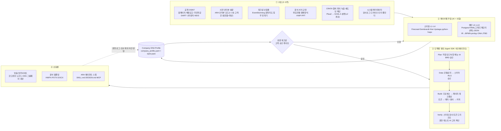

# 고객사 스타일·패턴 추출 방법론 (Company DNA 플레이북)과 맞춤 업무사이트 생성 파이프라인

> CRATA AX 컨설팅 GOAL B 실행 문서 · 2026-10-01 기준
> 대상 독자: CRATA 컨설턴트·강사·ARA 개발자 (비개발자도 따라 할 수 있는 수준)
> 표기: "검증됨"은 1차 출처로 확인된 사실, "미확인"과 "추정"은 확인되지 않았거나 CRATA가 가정한 값입니다.
> **정본 범위**: 이 문서는 GOAL B 프레임(10-레이어 L1~L10), **Company DNA Profile**(`clients/{slug}/company_profile.yaml` + `style-pack/`), 진단 일정, 자료 요청 목록의 정본입니다. [01 시장 지도](./01_market-map.md)는 이 문서의 L1~L10에 매핑만 둡니다. 데이터 등급(L0~L3), 수탁자·국외이전 목록, 정보주체 권리 대응은 [04 데이터 거버넌스](./04_data-governance.md)가, 회의 분류 스키마·녹음 제목 접두어·신뢰도 임계값은 [02 회의 자동 분류](./02_meeting-auto-classification.md)가 정본입니다. 이 문서의 해당 부분은 요약입니다.
> **용어 주의**: 데이터 등급 L0~L3(04 문서)과 프로파일 레이어 L1~L10(이 문서 2장)은 서로 다른 체계입니다. 이 문서에서 "레이어 L1"처럼 쓰면 프로파일 레이어, "등급 L1"이나 `data_class: L1`이면 데이터 등급입니다.

---

## 1. 결론 요약

1. **스타일과 패턴은 출처가 다릅니다.**
   - 스타일(어떻게 보이고 어떻게 말하는가)은 홈페이지, 문서, 공지에서 대부분 자동으로 추출할 수 있습니다.
   - 패턴(어떻게 일하고 결정하는가)은 위임전결규정, 결재 양식, 완결 문서, 업무분장표, 회의, 폴더 구조 같은 내부 흔적에만 남아 있습니다.
   - 그래서 고객사를 10개 레이어로 나누고, 레이어마다 검증된 추출 기법을 정합니다. 결과는 기계가 읽을 수 있는 하나의 프로파일(`company_profile.yaml`과 `style-pack/` 폴더)로 모읍니다.
2. **흔적을 먼저 보고, 인터뷰는 그다음에 합니다.**
   - Glean은 context graph를 "엔티티와 그 사이의 시간순 행동·이벤트 흔적을 잇는 모델"로 정의합니다([Glean](https://www.glean.com/blog/how-do-you-build-a-context-graph)).
   - 인터뷰는 두 가지 용도로 씁니다. 판단 기준과 예외를 캐묻는 것([Relevance AI Invent](https://relevanceai.com/invent)), 그리고 흔적과 말이 어긋나는 지점(말 vs 행동)을 검증하는 것입니다.
3. **시각 스타일 추출은 기존 부품을 조립하면 됩니다.**
   - [Firecrawl branding](https://docs.firecrawl.dev/features/scrape)과 [Dembrandt](https://github.com/thevangelist/dembrandt)로 추출해 [W3C DTCG 2025.10](https://www.designtokens.org/) 토큰으로 만들고, Style Dictionary로 변환합니다.
   - 한국어 보이스(종결어미, 존칭, 개조식)와 결재란을 다루는 해외 도구는 이번 조사에서 확인되지 않았습니다. 다만 HWP 문서 생성 자체는 국내에 이미 도구가 여럿 있습니다([테크빌 마이클](https://www.tekville.com/?c=business/mycl)의 HWP 양식 생성, [웍스AI](https://docs.wrks.ai/release-notes) HWPX 내보내기, 엘리스 헬피챗의 한글 문서 수정, [다글로](https://daglo.ai/) 한컴 애드온).
   - 따라서 CRATA의 차별점은 "HWP를 만든다"가 아니라 **고객사별 보이스·결재 패턴을 추출해서 생성물에 적용한다**는 데 있습니다.
4. **한국 조직의 의사결정 패턴은 이미 설정값으로 들어 있습니다.**
   - [다우오피스](https://daouoffice.com/features_approval.jsp)는 사내 위임 규정을 넣으면 결재선을 자동으로 만듭니다.
   - 반면 결재 이력을 대량으로 내보내는 API는 확인한 범위에서 찾지 못했습니다. 하이웍스와 NAVER WORKS 모두 확인했습니다.
   - 그래서 위임 규정, 문서 샘플, 감사로그 세 가지를 대조해 결재 경로를 재구성합니다.
5. **생성은 단계마다 승인을 받습니다.**
   - [Power Apps Plans](https://learn.microsoft.com/en-us/power-apps/maker/plan-designer/plan-designer)처럼 요구사항, 데이터, 솔루션 순서로 만들고 단계마다 사람이 승인합니다.
   - 인증, 권한, 개인정보는 고정된 베이스에 둡니다([Retool 방식](https://retool.com/blog/retool-launches-react-ai-app-builder)). AI는 그 위에서 화면, 워크플로, 테마, 카피만 생성합니다.
6. **납품 방식은 4개 질문으로 정합니다.** 고객사에 유지보수 인력이 있는지, 망분리·CSAP 요건이 있는지, 이미 쓰는 그룹웨어가 무엇인지, 예산과 사용자 수는 어떤지입니다.
   - 선택지는 ① 코드 생성(Next.js + Supabase 서울), ② 노코드, ③ 오픈소스 셀프호스팅, ④ 국내 그룹웨어 내장, 네 가지입니다.
   - 기본 권장안은 그룹웨어 내장과 CRATA 멀티테넌트 경량 포털을 함께 쓰는 것입니다. 단, 학교·교육청 같은 공공 고객에게 멀티테넌트 SaaS를 제공하려면 CSAP 인증이 필요하므로, 인증을 받기 전까지 공공 고객에게는 내부망 설치형(③)이나 인증 그룹웨어 내장형(④)만 제안합니다(§6.7).
7. **CRATA만 가진 무기는 네 가지입니다.**
   - 강의·워크샵을 구조화된 데이터 수집 채널로 쓸 수 있습니다.
   - 행동방식검사로 사람 레이어를 채울 수 있습니다(개인 결과는 본인에게만, 회사에는 5명 이상 팀 단위 분포만).
   - 학맞통·학교 도메인(HWP, NEIS, KRDS)을 압니다.
   - Plaud 회의 자동분류(GOAL A)가 프로파일을 계속 갱신합니다(고객 진단 회의(고객 내부 자료·견적·계약 조건을 다루는 회의)는 등급 L2이므로 GOAL A의 L2 경로가 생긴 뒤부터).
8. **일정은 "진단 2~4주 + 구축 2~4주"입니다.** 진단은 표준 4주, 압축하면 2주입니다. 사전조사(1일) → 사전 인터뷰·설문 → 킥오프 워크샵 → 2주간 수집·셰도잉 → AI 분석 → 검증 워크샵(그 자리에서 포털 시안 시연) → v1.0 확정 순서이고, 그 뒤 포털 구축에 2~4주가 걸립니다. 아직 없는 도구(ARA 인터뷰 모드, 생성기 v0)는 1~2호 고객에서 대체 경로로 진행합니다(§3.1).
9. **법적 준수와 신뢰도 상품의 일부입니다.**
   - 녹음은 CRATA 진행자가 당사자로 참여한 대화만 합니다(통신비밀보호법 참여자 원칙). 워크샵 소그룹 토론과 셰도잉은 녹음하지 않습니다. 학교·교육청에서는 녹음 전에 기관 보안담당 확인을 받습니다.
   - 해외 LLM을 쓰면 국외이전을 고지합니다. 고객이 비밀로 지정한 자료(등급 L2)는 국내 경로(Amazon Bedrock 서울 In-Region)로만 처리합니다.
   - 학생 식별 정보와 상담·사례 내용(등급 L3)은 수집·녹음하지 않습니다. 실수로 들어오면 처리를 멈추고 격리한 뒤 즉시 삭제합니다.
   - 직원 관찰은 노사협의를 거치고, 팀 단위로만 집계하며, 인사평가에는 쓰지 않습니다.
   - 등급 정의는 [04 데이터 거버넌스](./04_data-governance.md)가 정본입니다(§8.1 요약).

**이번 달에 할 일 3가지**
- (1) 이 문서의 YAML 스키마([`templates/company_profile.template.yaml`](../../templates/company_profile.template.yaml))로 CRATA 자신의 프로파일을 먼저 만들어 봅니다(내부 파일럿).
- (2) 다음 강의·워크샵에 §3.3의 수집형 실습 2개를 넣습니다.
- (3) 고객사 계약서에 데이터 등급(L0~L3, [04 문서](./04_data-governance.md)), 재사용 조항, 행동방식검사 결과 제공 범위 조항(§2.3 L8)을 추가합니다.

---

## 2. 정의와 10-레이어 모델

### 2.1 스타일 vs 패턴

| 구분 | 정의 | 특징 | 업무사이트에서 결정하는 것 |
|---|---|---|---|
| **스타일** | 보이는 것과 말하는 방식: 비주얼, 톤, 용어, 문서 포맷 | 밖에서도 관찰할 수 있고 비교적 잘 바뀌지 않음 | 테마, 카피, 문서 서식(겉모습) |
| **패턴** | 일하는 방식: 조직구조, 업무 객체, 프로세스, 의사결정, 커뮤니케이션 리듬, 도구 스택, 페인포인트 | 내부 흔적에만 남고 자주 바뀜 | 데이터 모델, 워크플로, 권한, 알림, 대시보드(뼈대) |

- **경계 레이어**는 문서 원형(L4)입니다. 서식과 문체는 스타일이고, 결재란과 문서 구조는 패턴입니다.
- **네 가지 수집 렌즈**를 씁니다. 산출물(문서·슬라이드·양식), 소통(회의·메신저·메일 메타데이터), 행동(화면 캡처·이벤트 로그), 인터뷰(드러나지 않은 판단 규칙)입니다. [Sierra Ghostwriter](https://sierra.ai/product/ghostwriter)도 SOP, 원본 통화 녹취, 현업 전문가 음성 인터뷰를 함께 받아 에이전트를 만듭니다.

### 2.2 한눈에 보기

| # | 레이어 | 구분 | 무엇을 뽑나 | 주 데이터 소스 | 추출 방식 | 산출물 |
|---|---|---|---|---|---|---|
| L1 | 정체성·비주얼 | 스타일 | 색·폰트·간격·컴포넌트·로고·브랜드 성격 | 홈페이지, CI, PPT 마스터 | 자동, 사람 확정 | `brand.tokens.json`(DTCG), `DESIGN.md` |
| L2 | 보이스·톤 | 스타일 | 보이스 쌍, 채널별 톤, 종결체·존칭 통계 | 제안서·공지·메일·회의 전사 | 반자동 | `voice-card.json/.md` |
| L3 | 조직 언어·용어집 | 스타일 | 약어, 사업명, 별칭, 호칭, 금지어 | 문서·회의·조직도·JD | 반자동 | `glossary.csv` |
| L4 | 문서 원형·서식 | 경계 | 문서 유형, 골격, 번호 체계, 결재란, 파일명 규칙 | 결재 양식, 완결 문서 20~50건, 폴더 트리 | 반자동 | `doc-archetypes.json`, `templates/` |
| L5 | 조직·역할·의사결정권 | 패턴 | 위임전결, 결재선, RACI, 실질 결정자, 협업망 | 규정, 결재란, 감사로그, 캘린더 메타 | 반자동, 수동 | `org` 섹션 |
| L6 | 업무 객체 온톨로지 | 패턴 | 객체·속성·상태·링크·액션·민감도 | 워크샵, 인터뷰, 전사, 엑셀 컬럼 | 반자동 | `ontology` 섹션, Pydantic 타입 |
| L7 | 프로세스·판단 규칙 | 패턴 | 트리거, 단계, 판단 기준, 예외, 병목, 흐름 갈래 | 셰도잉, 이벤트 CSV, 화면 캡처 | 반자동 | AOP 문서, `.bpmn` |
| L8 | 리듬·의례·소통·문화 | 패턴 | 회의·보고 주기, 연간 피크, 응답 규범, 문화 척도, 행동유형 | 캘린더, Plaud, 메시지 메타, 설문, 검사 | 자동, 수동 | `cadences` 섹션 |
| L9 | 도구·시스템 | 패턴 | 시스템 목록, API, 이중 입력, 섀도 툴, 보안 제약 | 인터뷰, JD, 관리자 화면 | 반자동 | `tools` 섹션 |
| L10 | 페인포인트·KPI·AI 기회 | 패턴 | 반복 업무 시간, 중요도×만족도, KPI, AI 기회·위험 | 업무 쪼개기, 설문, 셰도잉 | 반자동, 합의 | `pain_points`·`kpis`·`ai_opportunities` |

### 2.3 레이어별 상세

#### L1. 정체성·비주얼 (Identity & Brand Tokens)
- **무엇을**: 로고, 의미 역할별 색(primary·secondary·surface·text·danger), 타이포, 간격, 라운드, 버튼·입력창 스타일, 브랜드 성격(톤·에너지·타깃), 문서용 폰트, 접근성.
- **데이터 소스**: 홈페이지 5~10페이지, 채용·블로그 페이지, CI 규정, PPT 마스터, HWP 서식, (공공 고객이면) 정부 디자인 시스템.
- **추출 방법**
  - 자동
    - Dembrandt: Playwright로 계산된 스타일을 읽어 DTCG, Tailwind v4, shadcn 테마, 브랜드 가이드 PDF로 내보냅니다. WCAG 대비 검사와 MCP 도구를 지원하고 MIT 라이선스입니다.
    - Firecrawl `formats:['branding']`: 색·폰트·간격·컴포넌트·로고와 함께 personality(톤·에너지·타깃)를 반환합니다.
    - 교차 검증용으로 [context.dev(구 brand.dev) styleguide 추출](https://docs.context.dev/)과 [Brandfetch](https://brandfetch.com/developers)를 씁니다. Brandfetch는 국내 중소기업·학교가 데이터베이스에 없을 가능성이 큽니다.
  - 반자동: 빈도 가중으로 상위 색·폰트만 남기고, 각 색의 의미 역할은 사람이 정합니다([Project Wallace](https://www.projectwallace.com/) 식 빈도 감사). 홈페이지가 오래됐으면 "로고 색 + 기본 토큰"으로 대신합니다.
  - 수동: 브랜드 가이드 PDF를 고객에게 보여 주고 확인받습니다.
- **참고**
  - DTCG 2025.10은 W3C 커뮤니티 그룹의 첫 안정판으로, W3C 권고안은 아닙니다.
  - [Style Dictionary](https://styledictionary.com/info/dtcg/)는 v4가 DTCG를 지원하고, v5에서 2025.10 완전 지원을 진행 중입니다.
  - 공공·학교 고객은 [KRDS](https://github.com/KRDS-uiux/krds-uiux) 토큰을 베이스로 깔 수 있습니다. 표준 오픈소스 라이선스가 아니라 이용약관이 따로 있으니 확인이 필요합니다.
- **산출물**: `brand.tokens.json`(DTCG), 브랜드 가이드 PDF, LLM이 읽을 `DESIGN.md`. Google Stitch는 벤치마크로만 보고 [Stitch skills](https://github.com/google-labs-code/stitch-skills)의 `DESIGN.md` 형식만 차용합니다(Stitch의 현재 Labs 상태는 미확인, 같은 Google의 Firebase Studio는 2027-03-22 종료 예정).

#### L2. 보이스·톤 (Voice & Tone)
- **무엇을**
  - 변하지 않는 보이스("우리는 X이지만 Y는 아니다" 쌍)와 채널별 톤.
  - [NN/g 톤 4축](https://www.nngroup.com/articles/tone-of-voice-dimensions/): 격식–친근, 진지–유머, 존중–불경, 사실–열정.
  - **한국어 고유 축**: 종결체 분포(하십시오체·해요체·개조식 -함/-음·반말), 존칭·호칭, 문장 길이, 한자어 비율, 두괄식 여부, 번호 체계, 금기·선호 표현.
- **데이터 소스**: 홈페이지 카피, 제안서·보고서, 공지·가정통신문, 메일, 회의 전사, (동의를 받은 경우) 업무 단톡방.
- **추출 방법**
  - 자동: [Kiwi](https://github.com/bab2min/Kiwi) 형태소 분석으로 종결어미와 문장 길이를 통계로 냅니다. LLM이 문서 유형별 샘플 30~50개를 읽고 해석 가능한 속성 카드를 씁니다([LISA](https://arxiv.org/abs/2305.12696) 방식). 속성마다 근거 문장을 인용합니다.
  - 반자동: Kiwi 통계와 LLM 판단이 어긋나면 "불일치"로 표시합니다.
  - 수동: 검증 워크샵에서 30분 동안 "우리 말투가 맞다/아니다"를 확인합니다.
- **참고**
  - [WRITER](https://writer.com/blog/new-roundup-may-2026/): 보이스 프로필에 용어 목록과 스타일 가이드를 연결하는 기능(2026-05, 검증됨).
  - [Jasper Brand IQ](https://www.jasper.ai/brand-iq): Voice, Style Guide, Visual Guidelines에 위반 플래그를 더한 구조.
  - [Mailchimp 보이스·톤 가이드](https://styleguide.mailchimp.com/voice-and-tone/).
- **산출물**: `voice-card.json` + `voice-card.md`, 고치기 전/후 리라이팅 예시.

#### L3. 조직 언어·용어집 (Glossary)
- **무엇을**: 사내 약어, 사업명, 시스템명, 기관 별칭, 직함과 호칭 규칙, 외부 사용 금지어, 최근 바뀐 이름. 항목마다 정의, 담당 팀, 예문을 붙입니다.
- **데이터 소스**: 문서, 회의 전사, 인터뷰, 조직도, 채용공고, 그룹웨어 메뉴명.
- **추출 방법**
  - 자동: Kiwi로 명사구 후보를 뽑고, 일반 코퍼스 대비 빈도로 순위를 매깁니다. 그다음 LLM이 표기만 다른 같은 용어를 묶습니다.
  - 반자동: 워크샵의 "신입 사전" 활동으로 보강합니다.
  - 수동: 담당 팀이 확인합니다.
- **참고**
  - [Tiro Wiki](https://docs.tiro.ooo/en/guide/notes/wiki.md)는 회의록에서 사람, 주제, 결정과 그 관계를 자동으로 페이지화합니다. Pro 이상 요금제에서만 됩니다.
  - [Markup AI(구 Acrolinx)](https://docs.markup.ai/)는 용어집을 CSV나 ACTIF XML로 가져옵니다.
  - 클로바노트 '자주 쓰는 단어'는 2,000개(공용 1,000개 + 개인 1,000개)까지 등록할 수 있습니다.
  - CLOVA Speech boostings는 최대 1,000개, RTZR은 keywords 기능을 지원합니다.
- **산출물**: `glossary.csv`. 한 파일을 ① STT 부스팅, ② GOAL A 회의 분류 키워드, ③ 포털 UI 카피, ④ 산출물 검수 규칙에 같이 씁니다.

#### L4. 문서 원형·서식 (Document Archetypes)
- **무엇을**: 문서 유형 목록과 월간 빈도, 섹션 골격, 번호 체계(1. → 가. → 1) → 가)), 표 양식, 표지, 결재란, 붙임 관행, 파일명·폴더 규칙, 버전 관리 습관("최종_진짜최종").
- **데이터 소스**: 결재 양식 목록, 유형별 "잘 된 문서" 20~50건(HWP/HWPX/DOCX/PPTX/PDF), PPT 마스터, 공유드라이브·NAS 폴더 트리 메타데이터(본문 제외).
- **추출 방법**
  - 자동
    - [Upstage Document Parse](https://www.upstage.ai/products/document-parse): HWP/HWPX를 포함해 좌표가 붙은 HTML/Markdown으로 변환합니다. 페이지당 약 $0.01이고, 동기 호출은 100페이지, 비동기는 2,000페이지까지입니다.
    - [python-hwpx](https://pypi.org/project/python-hwpx/)와 [hwpx-owpml-model](https://github.com/hancom-io/hwpx-owpml-model)로 HWPX의 스타일 정의를 읽습니다.
    - [Drive API](https://developers.google.com/workspace/drive/api/reference/rest/v3/files)의 parents, lastModifyingUser 필드로 폴더 트리를 복원하고 명명 규칙을 찾습니다.
  - 반자동: 제목 패턴("~계획(안)", "~결과 보고", "~ 품의")으로 문서를 묶고, LLM이 유형별 골격 JSON을 씁니다.
  - 수동: 원본 템플릿을 정비합니다. 예를 들어 .potx 마스터에 테마 색과 폰트를 정의합니다.
- **참고**
  - [Templafy](https://www.templafy.com/mcp/): AI가 쓴 내용을 받아 브랜드 서식의 Office 문서로 만듭니다(MCP).
  - [M365 Copilot Brand Kit](https://support.microsoft.com/en-us/topic/c8bc6df5-37ed-4398-8b90-f78a8fdcf9bb): 템플릿, 테마 색·폰트, 보이스 가이드를 담습니다. 요금제에 따라 포함되지 않을 수 있습니다.
  - [테크빌 마이클](https://www.tekville.com/?c=business/mycl): HWP 양식을 생성하고 NEIS와 MCP로 연동합니다. 국내 기준점으로 삼을 만합니다.
- **산출물**: `doc-archetypes.json`, `templates/*.hwpx|*.potx|*.dotx`, 파일 명명 규칙.

#### L5. 조직·역할·의사결정권 (Org, Roles, Decision Rights)
- **무엇을**: 부서·역할·인원, 위임전결(문서 유형 × 금액 × 전결권자), 결재선, RACI, 실질 결정자, 규정과 실제의 차이(대결·후결 빈도, 협조 결재 남발, 리드타임), 부서 간 관계(누가 누구 양식에 맞추는가), 협업 허브와 고립된 팀.
- **데이터 소스**: 조직도, 위임전결·직제 규정, 업무분장표, 결재 샘플의 결재란, 그룹웨어 감사로그, 캘린더 메타데이터, 관계 설문.
- **추출 방법**
  - 자동
    - 결재란을 파싱합니다.
    - 메타데이터로 조직 네트워크를 분석(ONA)합니다. [Worklytics](https://www.worklytics.co/pricing) 무료 등급은 캘린더만, 최대 100명, 30일 이력까지 지원합니다.
    - [NAVER WORKS 감사로그](https://help.worksmobile.com/ko/admin-guides/audit/message/)는 메시지 송수신 메타데이터를 180일 보관하고, [Audit API](https://developers.worksmobile.com/kr/docs/audit)로 CSV를 받을 수 있습니다.
  - 반자동: 규정을 표로 정규화하고, 문서 샘플·감사로그와 대조해 결재 경로를 재구성합니다.
  - 수동: 워크샵의 "결재선 퀴즈"와, 학교처럼 로그가 없는 곳을 위한 5문항 관계 설문([Polinode](https://www.polinode.com/) 식 Active ONA)을 씁니다.
- **주의**
  - [하이웍스 API](https://developers.hiworks.com/)에는 결재 이력·결재선을 대량 조회하는 엔드포인트만 없습니다. 조직·구성원·직위·직무는 추가·수정·삭제·조회가 되고, 전자결재 아래 회계 코드(코스트센터·거래처·계정과목) 추가·수정·삭제·조회와 기안·문서 상태 조회도 있습니다. 다만 개발자센터 공지가 2019년 이후 갱신되지 않았으므로 착수 전에 API가 계속 유지되는지 확인합니다.
  - NAVER WORKS 결재 감사는 문서 조회와 삭제만 기록하므로 결재 패턴 분석에는 약합니다.
  - 다우오피스 고객이라면 위임 규정 설정 화면이 곧 기준 데이터입니다.
- **참고**: RACI, [DDD Context Map](https://github.com/ddd-crew/context-mapping), [Viva Insights ONA](https://learn.microsoft.com/en-us/viva/insights/advanced/analyst/network-collaboration-insights)(고립 팀·허브 탐지).
- **산출물**: `org` 섹션(units, roles, decision_rights, raci, observed_vs_rule, ona, context_map).

#### L6. 업무 객체 온톨로지 (Objects / Links / Actions)
- **무엇을**: 업무에서 다루는 대상(건, 회의, 문서, 사업, 예산, 강의, 견적, 거래처 등)과 그 속성·상태·관계, 그리고 각 대상에 대해 누가 무엇을 할 수 있는지(액션)와 민감도.
- **넣지 않는 것**: 학생 식별 정보와 상담·사례 내용(등급 L3)은 온톨로지 객체로 만들지 않습니다. 학교·교육청 고객이라도 학생 사례는 교육청 학생맞춤통합지원정보시스템(학맞통법 제17조)이 다루므로, 포털에는 저장하지 않고 필요하면 그 시스템으로 가는 링크만 둡니다. 가명정보도 개인정보이므로 "가명이라 괜찮다"는 근거가 되지 않습니다.
- **데이터 소스**: EventStorming 결과, 인터뷰, 문서·회의 전사, 시스템 화면과 엑셀 컬럼.
- **추출 방법**
  - 자동: 고객 문서에서 엔티티 타입 후보를 자동으로 찾습니다. [GraphRAG auto prompt tuning](https://microsoft.github.io/graphrag/prompt_tuning/auto_prompt_tuning/)의 `--discover-entity-types` 방식을 차용합니다. GraphRAG 본체는 유지보수 모드라서 방법만 빌려 씁니다.
  - 반자동: 컨설턴트가 15~25개 타입으로 확정하고 Pydantic 타입으로 고정합니다. **첫 2~3개 고객은 Postgres(Supabase 서울)와 YAML로 충분합니다.** 사실이 바뀌면 행을 지우지 않고 `valid_from`/`valid_to`로 무효 처리합니다.
  - (선택) 그래프 메모리: 고객이 늘거나 시점별 질의가 많아지면 [Graphiti](https://github.com/getzep/graphiti)를 검토합니다. Apache-2.0이고, 사실이 바뀌면 삭제하지 않고 무효 처리하는 시간축 구조이며, MCP 서버를 제공합니다. 같은 Pydantic 타입을 그대로 쓸 수 있고, 이후 들어오는 회의와 인터뷰를 에피소드로 넣어 시점별로 갱신합니다.
  - 수동: 검증 워크샵에서 카드 소팅으로 확정합니다.
- **참고**
  - [Palantir Ontology](https://www.palantir.com/docs/foundry/ontology/why-ontology/): 객체와 링크를 명사, 액션을 동사로 보고, 의사결정을 데이터·로직·액션·보안의 조합으로 모델링합니다.
  - [OCEL 2.0](https://arxiv.org/pdf/2403.01975): 이벤트 하나가 여러 객체에 연결되는 표준입니다. 견적 하나에 고객사, 교육 과정, 강사, 계약 문서가 함께 얽히는 업무에 맞습니다.
  - [Celonis PI Graph + MCP 서버](https://www.celonis.com/news/press/celonis-unveils-platform-innovations-to-power-the-ai-driven-composable-enterprise).
- **산출물**: `ontology` 섹션, `ontology/types.py`, (그래프 메모리를 쓸 때만) 그래프 group_id.

#### L7. 프로세스·판단 규칙 (Processes & Judgment)
- **무엇을**: 핵심 업무 5~10개 각각의 트리거, 입력, 단계, 담당, 사용 시스템, 판단 규칙, 예외, 산출물, SLA. 흐름 갈래(variant), 병목, 재작업, 그리고 말과 실제 행동의 차이.
- **데이터 소스**
  - 인터뷰 전사(CRATA가 참여하고 동의를 받은 인터뷰만 녹음)와 셰도잉 메모. **셰도잉 중에는 Plaud로 녹음하지 않고 메모만 합니다.** 관찰 중에는 직원이 받는 전화나 옆자리 대화처럼 CRATA가 당사자가 아닌 대화가 섞이기 쉽기 때문입니다. "말하면서 일하기" 설명이 필요하면 셰도잉이 끝난 뒤 별도 인터뷰로 받습니다.
  - 동의한 직원의 화면 캡처(허용한 도메인만). NEIS·K-에듀파인·학생 업무 화면은 캡처하지 않습니다.
  - 결재·공문 대장과 파일 메타데이터로 만든 "건번호-활동-시각-담당자" 4열 CSV.
- **추출 방법**
  - 자동
    - 전사를 JSON 중간표현으로 바꾼 뒤 BPMN으로 그립니다. BPMN XML을 바로 생성하는 것보다 토큰을 75% 이상 줄인다는 연구가 있습니다([arXiv 2509.24592](https://arxiv.org/abs/2509.24592)).
    - 이벤트 CSV를 [Fluxicon Disco](https://fluxicon.com/disco/)나 [pm4py](https://github.com/process-intelligence-solutions/pm4py)에 넣어 흐름 갈래와 병목을 찾습니다. pm4py는 AGPL-3.0이라 상용화 전에 법무 검토가 필요합니다.
    - [Scribe Optimize](https://scribe.com/optimize)로 SOP를 자동 생성합니다. 관리자가 승인한 브라우저 앱에서 동의한 사용자만 캡처합니다.
  - 반자동: [ProMoAI](https://github.com/humam-kourani/ProMoAI)(AGPL)나 [uEngine Process-GPT](https://bpm-intro.uengine.io/process-gpt/) 방식으로 초안을 만들고 현업이 검토합니다.
  - 수동: "이럴 땐 누가 어떻게 판단하나요?"를 캐묻습니다.
- **참고**
  - [EventStorming](https://www.eventstorming.com/), SIPOC, [Service Blueprint](https://www.nngroup.com/articles/service-blueprints-definition/), [JTBD 잡맵(8단계)](https://strategyn.com/jobs-to-be-done/).
  - [Decagon AOP](https://decagon.ai/product/aop): 자연어 절차에 코드 수준 제어와 Git 버전관리를 더한 형식.
  - [Mimica](https://www.mimica.ai/): 단계 → 작업 → 프로세스의 3단 업무 지도.
  - [Power Automate Process Mining](https://learn.microsoft.com/en-us/power-automate/process-advisor-overview): 90일 체험에 태스크 마이닝과 프로세스 마이닝이 포함됩니다.
- **산출물**: `processes` 섹션(AOP 형식), `process/*.bpmn`, 자동화 후보 목록.

#### L8. 리듬·의례·소통·문화 (Cadences, Rituals, Communication, Culture)
- **무엇을**: 정기 회의, 보고 주기와 마감, 연간 피크, 회의 진행과 결정 방식, 채널별 사용 규범, 첫 응답까지 걸리는 시간, 업무시간 외 소통 비율, 문화 척도, CRATA 행동유형 분포.
- **데이터 소스**: 캘린더 메타데이터, Plaud 회의(GOAL A 분류 결과), 메시지 메타데이터, (동의한) 업무 단톡방, [NEIS 학사일정 API](https://open.neis.go.kr/portal/data/service/selectServicePage.do?infId=OPEN17220190722175038389180&infSeq=1), [학교알리미](https://www.schoolinfo.go.kr/ng/go/pnnggo_a01_l2.do), 설문, 행동방식검사.
- **추출 방법**
  - 자동
    - 반복 일정을 파싱합니다.
    - 메시지 메타데이터로 응답 지연과 시간대 히트맵을 만듭니다.
    - 카톡 내보내기 파일은 오픈소스 파서([kakaotalkparse](https://github.com/1kko/kakaotalkparse) 등)로 처리합니다. 조직 분석용 상용 B2B 서비스는 이번 조사에서 찾지 못했습니다. 파싱한 뒤 LLM으로 결정 발화("확정", "그렇게 진행하시죠")가 누구에게서 나오는지 봅니다.
  - 수동
    - [Erin Meyer Corporate Culture Mapping Tool](https://erinmeyer.com/tools/) 방식으로 8개 척도를 소그룹이 직접 표시합니다. 넷플릭스가 쓴 방식이고 15~20분이면 됩니다.
    - OCAI 방식으로 현재 문화와 원하는 문화를 묻는 12문항 한국어 설문을 자체 제작합니다.
    - CRATA [행동방식검사](https://crata.co.kr/tests)(색채·행동동기·문제해결방식·관계성장방식)를 실시합니다. 회사가 직원에게 검사를 받게 하면 동의가 자발적이라고 보기 어렵고 회사가 개인 결과를 요구할 위험이 있으므로, **계약서에 다음 조항을 넣습니다**: "① 개인 결과는 본인에게만 제공한다. ② 회사에는 5명 이상 팀 단위 분포만 제공한다(5명 미만 팀은 인접 팀과 합쳐 집계). ③ 검사에 응하지 않아도 어떠한 불이익도 없다. ④ 결과는 인사평가·배치·보상에 쓰지 않는다."
- **참고**: [CultureX](https://www.culturex.com/)는 리뷰 문장을 7개 문화 동인으로 코딩합니다. [Culture Amp MCP](https://www.cultureamp.com/mcp)는 진단 결과를 AI가 질의할 수 있게 노출합니다.
- **산출물**: `cadences` 섹션과 "문화 → 포털 기본값" 매핑.

#### L9. 도구·시스템 (Tools & Systems)
- **무엇을**: 시스템 목록과 각 시스템의 역할·관리자·API 가능 여부, 이중 입력, 섀도 툴(엑셀·카톡·개인 메모), 보안 제약(망분리, CSAP, HWP 필수), 연동 표면.
- **데이터 소스**: 인터뷰, 채용공고([원티드 OpenAPI](https://openapi.wanted.jobs/), [사람인 API](https://oapi.saramin.co.kr/guide/job-search)), 그룹웨어 관리자 화면, 셰도잉.
- **추출 방법**
  - 자동: 채용공고에서 사용 툴 언급을 추출합니다. 원티드 Stat API는 시장 통계가 아니라 client별 지원 현황이라는 점에 주의합니다.
  - 반자동: 시스템 맵을 그립니다.
  - 수동: 관리자 권한과 API 키 발급 가능 여부를 확인합니다.
- **참고**: Microsoft는 연동을 synced(색인)와 federated(MCP 실시간 조회, 데이터 이동 없음)로 나눕니다([Work IQ](https://learn.microsoft.com/en-us/microsoft-365/copilot/extensibility/work-iq/)). 민감하거나 자주 바뀌는 데이터는 federated로 둡니다.
- **산출물**: `tools` 섹션.

#### L10. 페인포인트·KPI·AI 기회 맵
- **무엇을**: 반복 업무 Top N과 소요 시간, 오류와 위험이 큰 업무, JTBD 중요도×만족도, 기준선 KPI와 목표, AI 기회(없애기·표준화·자동화), AI 기본법상 위험 등급, 반드시 사람이 해야 할 일.
- **데이터 소스**: 워크샵 "업무 쪼개기" 결과, 설문, 셰도잉 소요 시간, 캡처 데이터.
- **추출 방법**
  - 자동: 업무 목록을 집계하고 ROI(절감 시간 × 인건비)를 계산합니다.
  - 반자동: LLM이 기회를 분류합니다.
  - 수동: 경영진과 현업이 함께 우선순위를 합의합니다. [METI DX推進指標](https://www.ipa.go.jp/digital/dx-suishin/about.html)처럼 현재 수준과 3년 뒤 목표를 0~5단계로 토론하는 방식을 씁니다.
- **참고**: Mimica의 없애기·표준화·자동화 3분류, Scribe Optimize의 ROI 비즈니스 케이스, [BCG 연구](https://www.bcg.com/press/24october2024-ai-adoption-in-2024-74-of-companies-struggle-to-achieve-and-scale-value)(AI 실질 가치를 내는 기업 26%, 과제의 약 70%가 사람·프로세스).
- **산출물**: `pain_points`, `kpis`, `ai_opportunities`.

---

## 3. 진단 프로세스 (진단 2~4주 + 구축 2~4주)

### 3.1 전체 일정

아래는 진단(표준 4주, 압축 2주) 일정입니다. 프로파일 v1.0이 확정되면 포털 구축에 2~4주가 더 걸립니다(§6).

| 단계 | 시점 | 주요 활동 | 도구 | 산출물 |
|---|---|---|---|---|
| 0. 계약·동의 | D-14~D-7. 상시 30인 이상이고 직원 관찰(셰도잉·화면 캡처·ONA)을 하면 계약 협의 단계(D-45 전후, 추정)부터 노사협의회 일정 확인 | NDA, 개인정보 처리위탁(재수탁자 동의 포함), 데이터 등급(L0~L3) 합의, 녹음 고지문, 노사협의(정기회의가 맞지 않으면 임시회의 소집 요청), 학교·교육청이면 학교장 승인과 기관 보안담당 확인 | 계약 패키지(§8) | 서명본, 등급표, 노사협의 회의록 사본 |
| 1. 사전조사(OSINT) | D-7 (1일) | 공개 데이터로 스타일과 조직 가설 수립 | Firecrawl, Dembrandt, 공공 API | Org Style Card v0, 첫 미팅 질문 10개 |
| 2. 사전 인터뷰·설문 | D-7~D-1 | 직원 10~30명 15분 음성 인터뷰, 준비도·문화·행동방식 설문 | ARA 인터뷰 모드(**미개발**. 1~2호 고객은 설문폼 + 화상 인터뷰) | 레이어별로 태그된 요약, 가설 목록 |
| 3. 킥오프 워크샵 | W1 D1 (반나절~1일) | EventStorming, 문화지도, 결재선 퀴즈, 업무 쪼개기, 신입 사전 | 포스트잇·사진(국내 저장소), Miro(L1 내용만. L2는 고객 자체 Miro 테넌트), Plaud(진행자가 참여한 전체 세션만) | `events.json`, `tasks.csv`, `culture_map.json`, 용어 후보 |
| 4. 녹음·문서 수집, 셰도잉 | W1~W2 | 문서 20~50건, 규정, 폴더 메타데이터, 2주간 CRATA 참여 회의 녹음, 3~5명 셰도잉(녹음 없이 메모만), 핵심 웹 업무 캡처 | Plaud, Scribe, Drive API | `evidence/` |
| 5. AI 분석 | W2~W3 초 | 레이어별 추출과 근거 연결 | Claude(등급 L2 고객 자료는 Bedrock 서울 In-Region의 Sonnet 5·Opus 5만), Kiwi, Upstage, pm4py, Postgres/YAML(그래프 메모리는 선택) | 프로파일 v0.5, `style-pack/` 초안, BPMN 초안 |
| 6. 검증 워크샵 | W3 (2~3시간) | 보이스 카드 확인, BPMN 따라 걷기, 온톨로지 확정, 말과 행동 차이 리포트, 포털 시안 즉석 시연 | 생성기 v0(**미개발**. 1~2호 고객은 더미 데이터로 만든 Lovable 시안) | 수정 목록, 승인 |
| 7. 프로파일 확정 | W4 | v1.0 서명, 책임자·유효기간 지정, 포털 구축(2~4주) 착수 | — | `company_profile.yaml` v1.0 |

[Soroco](https://soroco.com/)도 조직 전체의 운영 그림을 그리는 데 2~4주가 걸린다고 밝힙니다. 진단 2~4주는 업계 기준에 맞습니다.

**1~2호 고객용 대체 경로 (아직 없는 기능에 일정을 묶지 않기)**

ARA 인터뷰 모드와 포털 생성기 v0는 아직 없습니다. 1~2호 고객은 아래 대체 경로로 진행하고, 이 과정에서 나온 질문지·시안 프롬프트를 나중에 두 기능의 요구사항으로 씁니다.

| 아직 없는 기능 | 원래 쓰는 단계 | 1~2호 고객용 대체 경로 | 주의 |
|---|---|---|---|
| ARA 인터뷰 모드(비동기 음성 인터뷰, 꼬리질문 자동화) | 2. 사전 인터뷰 | ① 설문폼으로 §5 질문 중 레이어별 1~2개를 서면으로 받음 ② 핵심 인원 5~8명은 컨설턴트가 30분 화상 인터뷰(동의 후 녹음, CRATA 참여) ③ 답변에 레이어 태그를 사람이 붙이고 LLM은 정리만 보조 | 설문폼 도구의 저장 위치를 확인하고, 응답에 실명을 받지 않음(역할코드로 받음) |
| 포털 생성기 v0(프로파일 → 골격 자동 생성) | 6. 검증 워크샵 | 프로파일 v0.5에서 **등급 L0 토큰(`brand.tokens.json`, `DESIGN.md`)과 더미 데이터만** 뽑아 Lovable로 시안을 만들고 워크샵에서 보여줌 | 고객 문서·업무 객체 실제 값·직원 이름은 Lovable·v0에 넣지 않음(§6.4 규칙) |
| 그래프 메모리(Graphiti 등) | 5. AI 분석 | Postgres/YAML(`company_profile.yaml` + `evidence/index.csv`) | 선택 사항. 첫 2~3개 고객은 필요 없음 |

**1호 고객 최소 도구셋과 투입 인시 (추정)**

도구 10여 개를 4주에 다 운용하지 않습니다. 1호 고객은 아래 최소 도구셋만 씁니다. 인시는 30인 이하 SMB 기준 **추정치**이고, 1호 고객에서 실측해 고칩니다.

| 단계 | 최소 도구 | 데이터 등급 | 투입 인원 | 투입 인시(추정) |
|---|---|---|---|---|
| 0. 계약·동의 | 계약 패키지 템플릿(§8), 등급표 | — | 컨설턴트 1 | 4~6시간 |
| 1. 사전조사 | Firecrawl·Dembrandt(공개 웹만), 공공 API, 스프레드시트 | L0 | 컨설턴트 1 | 6~8시간 |
| 2. 사전 인터뷰·설문 | 설문폼, 화상회의, Plaud(동의한 인터뷰만. L2 내용이면 Plaud 사본 국외 보관까지 동의) | L1~L2 | 컨설턴트 1 | 10~14시간(인터뷰 5~8명 + 정리) |
| 3. 킥오프 워크샵 | 포스트잇·사진(국내 저장소), 스프레드시트. Miro는 L1 내용만(L2는 고객 자체 Miro 테넌트) | L1~L2 | 진행자 1 + 보조 1 | 16~20시간(준비 포함, 2인 합계) |
| 4. 문서 수집·셰도잉 | 공유 폴더(국내 저장소), Upstage Document Parse 또는 python-hwpx, 메모 | L2 | 컨설턴트 1 | 16~24시간(셰도잉 3명 × 반나절 포함) |
| 5. AI 분석 | Claude(L0~L1은 학습 미사용 API·Team/Enterprise, L2는 Bedrock 서울 In-Region Sonnet 5), Kiwi, 스프레드시트, YAML | L0~L2 | 컨설턴트 1 + 빌더 1 | 24~32시간 |
| 6. 검증 워크샵 | Lovable(L0 토큰 + 더미 데이터만), 인쇄한 보이스 카드·BPMN | L0 | 진행자 1 + 빌더 1 | 12~16시간(시안 제작 포함) |
| 7. 확정 | YAML, 보고서 | L2 | 컨설턴트 1 | 6~8시간 |
| **합계** | | | 컨설턴트 1명이 주도(4주간 주 20시간 안팎), 빌더·보조 1명이 일부 투입 | **약 94~128시간(약 12~16인일)** |

- Claude는 Team/Enterprise 플랜이나 API(학습 미사용)로 씁니다. 개인 플랜을 쓰면 학습 허용 설정이 꺼져 있는지 먼저 확인합니다. 어느 경우든 등급 L2 고객 자료는 Claude 앱·API가 아니라 Bedrock 서울 In-Region 경로로만 처리합니다.
- Upstage Document Parse는 국내 기업 서비스이지만 API의 처리 위치와 보존 조건은 이번 조사에서 확인하지 못했습니다(미검증). 확인하기 전에는 L2 문서를 python-hwpx 등 로컬 파싱으로 처리합니다.
- 01 문서의 원가 가정(포털당 40~120시간)은 구축 단계 인시이고, 위 표는 진단 단계 인시입니다.

### 3.2 단계별 실행 가이드

**0) 계약·동의.** 데이터를 받기 전에 아래 문서를 먼저 끝냅니다. 세부 내용은 §8을 봅니다.
- 처리위탁 계약(개인정보보호법 제26조)과 재수탁자 서면 동의. 재수탁자는 이번 진단에서 실제로 쓰는 것만 적습니다(예: Plaud, Anthropic API, AWS Bedrock 서울, Supabase 서울, Upstage, Firecrawl, Lovable·Vercel). 서비스별 처리 국가와 허용 등급은 [04 문서](./04_data-governance.md)의 수탁자 표가 정본입니다.
- 국외이전 고지 문구 제공(제28조의8).
- 데이터 등급(L0~L3) 합의. 고객이 NDA·비밀로 지정한 자료(위임전결규정, 완결 문서, 견적·계약 조건 등)는 등급 L2입니다.
- 행동방식검사를 쓰면 결과 제공 범위 조항(개인 결과는 본인에게만, 회사에는 5명 이상 팀 단위 분포만, 불참해도 불이익 없음, §2.3 L8).
- 상시 30인 이상 사업장에서 직원 활동을 관찰한다면 노사협의회 협의([근로자참여법 제20조 ①14호](https://casenote.kr/법령/근로자참여_및_협력증진에_관한_법률/제20조)).
  - 노사협의회 정기회의는 3개월마다 열립니다(근로자참여법 제12조, 조문 확인 TODO). 진단 일정이 정기회의와 맞지 않으면 고객 인사담당에게 **임시회의 소집**을 요청합니다. 회의 소집에는 사전 통보 기간(제13조, 미검증)이 있으므로 계약 협의 단계(D-45 전후, 추정)에서 요청합니다.
  - 협의가 끝나기 전에는 직원 관찰(셰도잉, 화면 캡처, ONA·감사로그 분석)을 시작하지 않습니다. 관찰이 없는 단계(공개 자료 조사, 규정·양식 수집, 워크샵)는 먼저 진행할 수 있습니다.
- 학교라면 학교장 승인.
- 학교·교육청이라면 **녹음하기 전에 기관 보안담당 확인**을 받습니다. 기관 규정이 녹음기 반입이나 해외 클라우드 업로드를 금지하는지 묻고, 금지하면 녹음 없이 메모로 진행합니다.

**1) 사전조사 OSINT (1일).** 첫 미팅 전에 공개 데이터만으로 가설을 세웁니다.
- 오전: 홈페이지, 블로그, SNS, 보도자료를 Firecrawl과 Dembrandt로 수집해 시각 토큰과 보이스 초안을 만듭니다.
- 오후
  - 원티드·사람인 API로 채용공고를 모아 사용 툴, 직무 체계, 문화 키워드를 뽑습니다.
  - (SMB) [국민연금 사업장 데이터](https://www.data.go.kr/data/15083277/fileData.do)로 인원과 월별 취득·상실 추이를 봅니다. 고지 대상을 비교한 값이라 실제 입·퇴사자 수와 다를 수 있습니다.
  - (공공·학교) 공무원·교원은 공무원연금·사학연금에 가입하므로 국민연금 데이터로 인원을 확인할 수 없습니다. 학교알리미 교직원 현황과 기관 조직도를 씁니다.
  - [OpenDART](https://opendart.fss.or.kr/intro/main.do)와 [나라장터 낙찰 API](https://www.data.go.kr/data/15129397/openapi.do)를 확인합니다.
  - 블라인드와 잡플래닛은 직접 읽고 요약만 합니다. 크롤링은 하지 않습니다. 300인 이상 고객이면 [blind Insight](https://www.blindhub.net/kr/)를 검토합니다(회사 단위 집계만 제공).
- 학교 고객: NEIS 학사일정, 학교알리미 공시(교직원 규모, 특색사업, 상담 계획), [정보공개포털 원문](https://www.open.go.kr/othicInfo/infoList/orginlInfoList.do), 단위과제 고시([공공기록물법 시행령 제25조, 2026.8.25 개정](https://casenote.kr/%EB%B2%95%EB%A0%B9/%EA%B3%B5%EA%B3%B5%EA%B8%B0%EB%A1%9D%EB%AC%BC_%EA%B4%80%EB%A6%AC%EC%97%90_%EA%B4%80%ED%95%9C_%EB%B2%95%EB%A5%A0_%EC%8B%9C%ED%96%89%EB%A0%B9))를 봅니다.
- 출력: **Org Style Card**. 보이스, 비주얼, 규모와 성장, 문화 평판, 추정 툴스택, 의사결정 스타일 가설, 첫 미팅 질문 10개를 담습니다.

**2) 사전 인터뷰·설문**
- (목표 형태) ARA에 "인터뷰 모드"를 만들어 직원 10~30명에게 15분짜리 비동기 음성 인터뷰를 보냅니다. 질문은 §5에서 레이어마다 1~2개를 고르고, 판단 기준과 예외는 꼬리질문으로 캐묻습니다. 답변에는 레이어 태그와 근거 인용을 자동으로 붙입니다.
- (1~2호 고객) 인터뷰 모드는 아직 없으므로 **설문폼 + 화상 인터뷰**로 대신합니다(§3.1 대체 경로). 설문폼으로 레이어별 질문을 받고, 핵심 인원 5~8명은 컨설턴트가 30분씩 화상으로 인터뷰합니다. 녹음은 CRATA가 참여한 인터뷰에서 동의를 받은 경우만 하고, 인용할 때는 역할코드로 가명 처리합니다.
- 상용 사례로는 [Listen Labs](https://listenlabs.ai/)(120개 이상 언어를 주장하고, 모든 주장을 원 인터뷰로 추적)와 [Outset](https://outset.ai/)(수백 건 병렬 인터뷰, 테마·인용 자동 정리, 신뢰도 점수가 붙은 디지털 트윈)이 있습니다. 한국어 품질을 확인하지 못했으므로 구독보다 ARA에 내재화하기를 권합니다. Listen Labs·Outset은 미국 서비스이므로 쓴다면 수탁자 목록([04 문서](./04_data-governance.md))에 넣고 국외이전을 고지합니다.
- 설문은 함께 보냅니다. AI 준비도 30문항(전략·데이터·도구·보안·사람·문화 6축 × 5문항, 자체 제작), 문화 12문항, CRATA 행동방식검사입니다.

**3) 킥오프 워크샵 (반나절~1일).** §3.3의 모듈을 조합합니다.
- **녹음은 CRATA 진행자가 참여한 전체 세션만** 합니다. 시작할 때 녹음 사실을 반드시 알립니다.
- **소그룹 토론은 녹음하지 않습니다.** 소그룹 테이블에 녹음기를 두면 CRATA가 당사자가 아닌 대화를 녹음하게 되어 통신비밀보호법 위반이 됩니다. 꼭 필요하면 그 그룹 전원의 동의를 받고 진행자가 그 자리에 함께 앉습니다.
- 소그룹 결과는 포스트잇·활동지·발표 내용으로 수집합니다.
- 녹음 파일은 고객 진단 자료(등급 L2)로 다루고, GOAL A 분류기에는 L2 경로(Bedrock 서울)가 생긴 뒤에만 넣습니다(§3.2-4 녹음 수칙).

**4) 녹음·문서 수집과 셰도잉 (W1~W2)**

*신규 SMB 고객 최소 요청 목록*
- [필수]
  - ① 조직도(직급·직책 포함)
  - ② 위임전결규정, 또는 그룹웨어 결재선·위임 설정 화면 캡처
  - ③ 업무분장·R&R 문서
  - ④ 결재 양식 목록과 최근 완결 문서 20~30건(유형별 2~3건, 금액과 개인정보는 가림)
  - ⑤ 사용 도구 목록과 관리자 담당자
- [권장]
  - ⑥ 공유드라이브·NAS 폴더 트리와 파일 메타데이터 CSV(본문 제외, CRATA가 스크립트 제공)
  - ⑦ 로고, CI 가이드, 최근 제안서·보고서 PPT 2~3개
  - ⑧ 대표 업무 단톡방 1~2개의 최근 3개월 내보내기(참여자 고지·동의서 첨부, 고객 PC에서 가명 처리한 뒤 전달)
- [선택]
  - ⑨ 그룹웨어 감사로그(NAVER WORKS는 180일 한도)
  - ⑩ 구성원 진단 설문 응답

*신규 학교 고객 최소 요청 목록*
- [CRATA가 먼저 수집] NEIS 학사일정, 학교알리미 공시, 학교교육계획서 공개본, 교육청 원문공개, 단위과제 고시
- [필수]
  - ① 올해 업무분장표(성명은 가려도 됨)
  - ② 결재 경로 확인(담당 → 부장 → 교감 → 교장, 행정실 경유 여부)
  - ③ K-에듀파인 단위과제·기록물철 목록과, **학생 관련 단위과제(학교폭력·학적·상담·생활지도 등)를 뺀 단위과제별 최근 1년 문서 건수 집계**. 문서 제목 목록은 받지 않습니다. 학폭·학적·상담 공문 제목에는 학생 이름과 사안이 자주 들어가 본문을 빼도 비식별이 되지 않기 때문입니다. 제목이 꼭 필요하면 학교 담당자가 학생 이름·사안을 마스킹한 뒤 제공합니다. 추출은 학교 담당자가 내부에서 합니다.
- [권장]
  - ④ 반복 공문 유형 Top 20(학생 관련 단위과제 제외)과 체감 소요 시간 설문
  - ⑤ 가정통신문·알림장 샘플 5~10건(학생 정보 제거)
  - ⑥ 학맞통 협의체 운영 계획(식별정보 제외)
- [요청 금지] NEIS 학생·성적·생활기록 데이터, 학생 관련 공문 제목·본문, 학맞통 사례 자료(가명 포함), 교내 메신저 본문

*녹음과 셰도잉 수칙*
- **CRATA 진행자가 당사자로 참여한 대화만 녹음합니다**(통신비밀보호법). 녹음기를 두고 자리를 비우지 않습니다.
- 학교·교육청에서는 녹음하기 전에 **기관 보안담당 확인**을 받습니다(§3.2-0).
- 등급 L2 회의(고객 내부 회의, 견적·계약 조건)를 Plaud로 녹음하려면 Plaud 사본이 국외(미국 등)에 보관된다는 점을 동의서에 적고 고객의 서면 동의를 받습니다. 동의하지 않으면 국내 STT(RTZR·CLOVA Speech)를 쓰거나 녹음 없이 메모합니다. 정본은 국내 저장소(Supabase 서울, NAVER WORKS Drive 등)에 두고 Notion에는 링크만 둡니다.
- Plaud AutoFlow는 동기화하자마자 Plaud 클라우드와 미국 LLM으로 요약하므로, Plaud 단계의 노출은 CRATA 파이프라인으로 막을 수 없습니다. 그래서 **녹음 자체를 통제**합니다. 학생 식별 정보나 상담·사례 내용(등급 L3)이 나올 자리는 녹음하지 않고, 실수로 녹음되면 자동 처리를 멈추고 격리한 뒤 즉시 삭제합니다.
- 녹음 제목은 [02 문서](./02_meeting-auto-classification.md)의 6개 접두어(`[강의]` `[학맞통]` `[아라]` `[AX]` `[공통]` `[혼합]`) 중 하나로 시작합니다. 고객 진단 회의는 `[AX]`입니다.
  - 주의: 02 문서의 1주 MVP(Zapier → Claude API)는 `[AX]`를 통과시키지만, 고객 진단 녹음은 등급 L2라서 그 경로로 보내면 안 됩니다. L2 경로(Bedrock 서울)가 생기는 1개월 차 전까지는 고객 진단 녹음을 별도 Plaud 계정·기기 또는 수동 동기화로 분리하고 자동 처리하지 않습니다. 이 규칙은 [02 문서](./02_meeting-auto-classification.md) 3.5절 1주 MVP에 반영돼 있습니다(02 문서 4.2절 `mvp_filter.exclude_l2_recordings`, [04 문서](./04_data-governance.md) 2.4절. 설정 파일은 [`config/meeting_taxonomy.yaml`](../../config/meeting_taxonomy.yaml)). 실수로 Zap 계정에 들어오면 L2 키워드(위임전결·결재선·결재 양식·완결 문서·감사로그·진단 인터뷰·이관 등)로 중단합니다.
  - Plaud MCP·CLI·Zapier는 로그인한 계정의 녹음만 봅니다. 컨설턴트 여러 명이 각자 녹음하면 계정별 인증, Zap 복제, Plaud Team 공유 공간 중 무엇을 쓸지 정해야 합니다(TODO). MCP·CLI는 `@plaud-ai/mcp@0.3.13`, `@plaud-ai/cli@0.3.14`로 고정합니다(§8.3).
- 화자 음성 등록(목소리 프로필)은 특정인을 식별하려고 만든 음성 특징정보라 생체인식정보, 즉 민감정보입니다(개인정보 보호법 제23조, 시행령 제18조). **고객사 직원의 목소리는 등록하지 않고, 고객사 화자 프로필을 산출물로 만들지 않습니다.** 등록은 CRATA 내부 직원만 별도 서면 동의를 받은 뒤 합니다.
- **셰도잉 중에는 Plaud로 녹음하지 않고 메모만 합니다.** 핵심 역할 3~5명을 반나절씩 관찰하고, "말하면서 일하기" 설명이 필요하면 셰도잉이 끝난 뒤 동의를 받은 별도 인터뷰로 받습니다.
- 핵심 웹 업무 3~5개는 동의한 직원만, 허용 도메인 안에서 Scribe로 캡처합니다. **NEIS·K-에듀파인·학생 업무 화면은 캡처하지 않습니다.** 학교에서는 화면 캡처 대신 담당자가 직접 설명하는 메모로 대신합니다.
- 고객사별 녹음 묶음은 국내 저장소(Supabase 서울, NAVER WORKS Drive 등)의 고객 폴더로 관리합니다. Plaud Intelligence의 Events 기능(사용자가 만든 묶음에 Agent가 맥락으로 녹음을 배정, [2026-10 배포 예정](https://www.plaud.ai/blogs/news/plaud-knowledge-base))은 Plaud 내부(미국 LLM)에서 처리되므로 등급 L0~L1 녹음에만 씁니다. 고객 진단 녹음(L2)은 Events에 넣지 않고 국내 정본 저장소에서 묶습니다([04 문서](./04_data-governance.md) 6.4절).

**5) AI 분석 (W2~W3 초)**
- §2.3의 레이어별 파이프라인을 돌립니다.
- 크롤링 비용(미검증): Firecrawl 가격 페이지 기준 무료 등급은 월 1,000 크레딧이지만, branding 포맷이 페이지당 크레딧을 얼마나 쓰는지는 확인하지 못했습니다. 고객 한 곳의 사이트 50~200페이지는 무료 등급으로 될 수도 있지만, **고객이 여러 곳이면 유료 플랜(Hobby 월 $16~19, 5,000 크레딧 등)을 전제**로 잡습니다. Dembrandt는 MIT 오픈소스라 로컬에서 돌리면 비용이 없습니다.
- LLM 비용은 고객당 $5~20 수준입니다(추정). 등급 L2 고객 자료는 Bedrock 서울 In-Region 경로라 Message Batches 할인이 없고 요금은 Bedrock 요금을 따릅니다(Sonnet 5 Bedrock 단가 확인 필요). 원가 대부분은 인건비입니다(§3.1 투입 인시).
- 등급별 LLM 경로: 공개 자료(L0)와 일반 업무 연락(L1)은 학습 미사용 계약의 Claude API(또는 Team/Enterprise)로, 고객이 비밀로 지정한 자료(L2)는 **Amazon Bedrock 서울 In-Region의 Claude Sonnet 5·Opus 5만** 씁니다. Haiku 4.5, Sonnet 5.5, Opus 5.5는 서울에서 Global 교차 리전 전용이므로 L2에 쓰지 않습니다.
- 모든 항목에 `evidence`와 `confidence`를 반드시 붙입니다. 아래는 핵심 프롬프트 예시입니다.

```text
[보이스 카드 추출]
역할: 한국어 조직 문체 분석가.
입력: 문서유형별 샘플(가명처리) N건, Kiwi 통계(JSON).
지시:
1) 축별 값과 근거(문서ID#문장번호)를 쓴다: 격식도, 종결체 분포(하십시오체/해요체/개조식/반말),
   두괄식 여부, 평균 문장 길이, 번호 체계, 표 사용, 사내 약어, 금기 표현 후보.
2) NN/g 4축 점수(0~1)와 'We are X, not Y' 쌍 3~5개를 제안한다.
3) Kiwi 통계와 모순되는 판단은 "불일치"로 표시한다.
4) confidence 구간은 GOAL A와 같게 쓴다: ≥0.85 근거 문장에서 직접 확인(2건 이상), 0.60~0.84 추정, <0.60 근거 부족.
   근거가 2건 미만이면 confidence < 0.60으로 두고 검증 워크샵 질문 목록에 넣는다.
출력: voice_card JSON(첨부 스키마, additionalProperties=false).
```

```text
[프로세스 JSON 중간표현]
입력: 인터뷰·셰도잉 전사(문장ID 포함) + 해당 업무 문서 샘플.
출력: {process_id, trigger, lanes[역할코드], tasks[{id, lane, name, system, input_docs, output_docs, evidence_ids}],
       gateways[{id, question, branches, judgment_rule, evidence_ids}], exceptions[], sla, variants[], open_questions[]}
규칙: 발화에 없는 단계는 만들지 말고 open_questions에 넣는다. 사람마다 다르게 말한 부분은 variants로 분리한다.
→ bpmn-js로 렌더링해 검증 워크샵에서 함께 따라 걷는다.
```

```text
[온톨로지 후보 발견]
입력: 문서·전사 샘플 50~100건.
지시: 반복 등장하는 '대상'(사람 제외 역할코드, 건, 문서, 사업…)의 타입 후보 30개 이내,
각 타입의 속성·상태·관계·대상에 대한 행동(동사)을 근거와 함께 제안. 민감정보 속성은 sensitivity 표시.
학생 식별 정보·상담·사례 내용(등급 L3)에 해당하는 타입이나 속성은 제안하지 말고 excluded_l3 목록에만 이름을 적는다.
→ 컨설턴트가 15~25개로 확정 → Pydantic 타입으로 고정(Postgres/YAML 기본, 그래프 메모리는 선택).
```

**6) 검증 워크샵 (W3, 2~3시간)**
- ① 보이스 카드 "맞다/아니다" 30분
- ② 업무별 BPMN 따라 걷기 15분씩
- ③ 온톨로지 카드 소팅
- ④ 말과 행동의 차이 리포트: 설문으로 스스로 인식한 문화와, 로그로 드러난 실제(결재 리드타임, 응답 지연, 결정 발화 집중도)를 비교
- ⑤ **포털 시안 즉석 시연**. 東急(도큐)은 요건을 듣는 자리에서 kintone 'アプリ作成AI'로 앱 골격을 바로 보여줍니다([사례](https://kintone-sol.cybozu.co.jp/cases/tokyu2.html)). CRATA도 프로파일 v0.5로 만든 골격을 이 자리에서 보여줍니다.
  - **규칙: 시안 엔진(Lovable·v0 등 해외 빌더)에는 등급 L0 토큰(`brand.tokens.json`, `DESIGN.md`)과 더미 데이터만 넣습니다.** 고객 문서 원문, 업무 객체의 실제 값, 직원 이름, 견적·계약 조건(L2)은 넣지 않습니다. 넣으면 L2 고객 기밀이 국외로 나가 국외이전과 재위탁 동의 대상이 됩니다.
  - 메뉴 구조·화면 이름처럼 프로파일에서 나온 정보는 고객이 L0로 분류해 준 범위에서만 씁니다. Lovable(스웨덴)·Vercel(미국)은 수탁자 목록([04 문서](./04_data-governance.md))에 넣습니다.
  - 생성기 v0가 생기기 전(1~2호 고객)에는 이 규칙대로 Lovable로 시안을 만듭니다(§3.1 대체 경로).
- ⑥ AI 기회 우선순위 합의

**7) 확정과 운영**
- v1.0에 서명하고 `owner`, `last_verified`, `valid_until`을 기입합니다. [Guru](https://www.getguru.com/)처럼 항목마다 담당자를 두고 검증 주기를 관리하는 방식입니다.
- 운영 중에는 새 회의와 문서를 밤사이 배치로 반영해 결정, 용어, 리듬을 갱신합니다([Letta sleep-time](https://www.letta.com/blog/sleep-time-compute) 패턴). 고객 자료(L2)를 처리하는 배치는 Bedrock 서울 경로를 쓰므로 Message Batches 할인을 전제로 하지 않습니다.
- 분기마다 1회 재검증합니다.

### 3.3 CRATA 강의·워크샵을 구조화 데이터 수집 채널로 쓰기

교육비를 받으면서 진단 데이터도 쌓는 구조입니다. Palantir 5일 부트캠프와 엘리스의 "자사 데이터로 하는 PBL"이 같은 원리입니다. 수강 동의서에 "익명화한 산출물을 진단에 활용한다"는 조항을 반드시 넣습니다.
- 녹음은 CRATA 진행자가 참여한 전체 세션만 합니다. 아래 모듈의 소그룹 활동은 녹음하지 않고 활동지·포스트잇·사진으로 수집합니다(필요하면 그룹 전원 동의 + 진행자 동석).
- 실습에 쓰는 문서는 수강생이 동의한 것만 쓰고, 해외 LLM으로 실습하면 등급 L0~L1 자료만 넣습니다. 고객 비밀 자료(L2)로 실습하려면 Bedrock 서울 경로를 쓰거나 더미 자료로 바꿉니다.

| 워크샵 모듈 | 시간 | 실습 | 구조화 산출물 | 레이어 |
|---|---|---|---|---|
| 내 업무 AI로 쪼개기 | 60분 | 개인별 업무 폼(업무명·빈도·소요 시간·JTBD 단계·AI 적합도) | `tasks.csv` | L7, L10 |
| 우리 팀 업무 흐름 그리기 | 2~3시간 | EventStorming Big Picture(주황 포스트잇=사건, 행위자·시스템·핫스팟). Miro 템플릿을 쓰거나(L1 내용만. L2는 고객 자체 Miro 테넌트) 포스트잇 사진을 등급에 맞는 LLM 경로로 디지털화(L2는 Bedrock 서울 In-Region) | `events.json` | L6, L7 |
| 실제 보고서 AI로 다시 쓰기 | 60분 | 동의한 문서의 원본, AI 버전, 수정본 3종 비교 | 문체 코퍼스, 금기·선호 표현 | L2, L3, L4 |
| 우리 회사 문화지도 | 15~20분 | 8척도 소그룹 표시 | `culture_map.json` | L8 |
| 결재선 퀴즈 | 20분 | "이 문서는 누가 최종 결재?" 카드 | decision_rights 초안 | L5 |
| 신입 사전 만들기 | 20분 | 사내 약어와 별칭 적기 | 용어 후보 | L3 |
| AI 준비도 사전·사후 설문 | 각 10분 | 6축 30문항 | 준비도 점수(교육 KPI) | L10 |
| CRATA 행동방식검사 | 별도 | 4종 검사(자율 참여, 개인 결과는 본인에게만) | 5명 이상 팀 단위 유형 분포 | L8 사람 레이어 |

### 3.4 압축 2주판과 상품화

- **압축 2주판**(10~30인 조직, 학교 한 부서): Palantir AIP Bootcamp의 "0에서 유스케이스까지 5일"([Palantir](https://www.palantir.com/platforms/aip/bootcamp/))을 본떠 1주차를 이렇게 운영합니다.
  - Day1: 수집과 흔적 분석
  - Day2: 온톨로지 확정
  - Day3: 스킬 작성과 에이전트 구성
  - Day4: 현업 워크샵
  - Day5: 포털 시안 시연(L0 토큰 + 더미 데이터)
  - 2주차에는 검증과 v1.0 확정을 합니다.
- **상품 구조**는 kintone 파트너 모델을 참고합니다.
  - 伴走(동행) 서비스는 초회 협의 → 전략·업무 정리 → 앱 구성 → 공동 작성 → 현장 피드백의 5단계로 진행합니다. 가격은 월 수만~수십만 엔에 초기 구축 수백만 엔부터입니다([Cybozu](https://kintone.cybozu.co.jp/support/menu/partner/banso/)).
  - [JOYZO System 39](https://service.joyzo.co.jp/system39/)는 세금 별도 39만 엔 정액으로 2시간씩 3회 대면 구축을 합니다(첫 2시간 무료).
  - CRATA 안: 무료 2시간 진단(즉석 시안, 더미 데이터) → 2~4주 본 진단 → 2~4주 정액 포털 구축 → 월 伴走(재검증, 스킬 개정, 내부 AI 운영자 교육).
  - 가격대 추정: 진단 300~800만원, 포털 MVP 1,500~4,000만원, 월 운영비는 **그룹웨어 내장형 월 10~30만 원 / 독립 포털 월 30~100만 원**. 검증이 필요한 추정치입니다([01 문서](./01_market-map.md) 5.7과 같은 기준).
  - 학교·공공 고객은 수의계약 한도를 넘으면 협상에 의한 계약·입찰·혁신제품·GS 인증 경로로 갑니다. 한 사업을 나눠 수의계약하는 분할계약은 계약법령상 금지이므로 권하지 않습니다. 사업을 나눌 수 있는 경우는 독립된 산출물이 있는 별개 사업뿐입니다(조문 확인 TODO).
- **정부 지원**
  - AI바우처는 교육훈련비, 자문비, AI와 무관한 웹 화면 개발비를 인정하지 않습니다. 공급기업 POOL에 등록돼 있어야 합니다(2026년 최종 1,428개사, [NIPA](https://www.nipa.kr/home/2-2/16592)). 따라서 ARA를 AI 솔루션으로 등록해야 합니다.
  - 소상공인분과는 공급기업이 소상공인 10개사 이상을 모아 신청하는 구조입니다. 소상공인은 자부담이 면제되고, 공급기업이 20% 이상을 부담합니다.
  - 2026년 회차는 마감됐습니다. 2027년 일정은 확인하지 못했습니다.

---

## 4. 산출물: Company DNA Profile 템플릿

### 4.1 고객사 폴더 구조 (`style-pack/` 포함)

```text
clients/{client_slug}/
├── company_profile.yaml        # 단일 원천(아래 4.2)
├── style-pack/
│   ├── brand.tokens.json       # W3C DTCG 2025.10
│   ├── voice-card.json / voice-card.md
│   ├── glossary.csv            # term,variants,forbidden,definition,owner_unit,example,stt_boost,ui_label
│   ├── doc-archetypes.json
│   ├── templates/              # *.hwpx *.potx *.dotx 원본
│   ├── DESIGN.md               # LLM이 읽는 디자인 시스템 문서
│   └── SKILL.md                # brand-{slug} 에이전트 스킬(Agent Skills 형식)
├── ontology/types.py           # Pydantic 엔티티·엣지 타입(Postgres/YAML 기본, 그래프 메모리는 선택)
├── process/                    # *.bpmn, aop/*.md
├── people/team_types.json      # 5명 이상 팀 단위 행동유형 분포(개인 결과 미포함)
└── evidence/index.csv          # 근거 ID ↔ 원본 파일·타임스탬프·데이터 등급
```

- 이 폴더 전체(프로파일과 `style-pack/`)의 이름은 **Company DNA Profile**입니다. `style-pack/`은 폴더 이름일 뿐 별도 산출물 이름이 아닙니다.
- 폴더에 등급 L2 자료가 들어가므로 정본은 국내 저장소(Supabase 서울, NAVER WORKS Drive 등)에 둡니다. 등급 L3 자료(학생 식별 정보, 상담·사례 내용)는 어디에도 두지 않습니다.

- 이 구조는 [Sembly](https://www.sembly.ai/)의 "고객별 살아있는 컨텍스트 환경"과 재사용 브랜드 패키지, [Lovable](https://docs.lovable.dev/features/design-systems)의 `design-system.json` + `system.md`, Anthropic [brand-guidelines 스킬](https://github.com/anthropics/skills/tree/main/skills/brand-guidelines)을 한국 실정에 맞게 합친 것입니다.
- [Agent Skills](https://claude.com/blog/skills) 표준을 쓰기 때문에 Claude, Glean, Dust 등 다른 플랫폼으로 옮길 수 있습니다.

### 4.2 `company_profile.yaml` 템플릿 (주석 포함 전체본)

> **v1.1에서 바뀐 점**
> - 예시 고객을 가상의 SMB "OO교육컨설팅(주)"(교육 프로그램 영업·견적·운영)로 바꿨습니다. 이전 예시(교육지원청 학생지원과)의 지원 사례 객체, 사례회의 프로세스, 사례 현황 위젯, 사례회의 녹음 → 공문 AI 기회는 모두 삭제했습니다. 학생 사례는 교육청 학생맞춤통합지원정보시스템(학맞통법 제17조)이 다루는 영역이고, 가명정보도 개인정보이기 때문입니다(§6.6).
> - `data_governance`를 [04 문서](./04_data-governance.md)의 등급 정의에 맞췄고, 해외 LLM 호출 전 로컬 게이트(`pre_llm_gate`), 녹음 원칙(`recording_policy`), 노사협의 리드타임, 행동방식검사 결과 제공 범위 조항을 넣었습니다.
> - 수탁자 목록에 AWS(Bedrock 서울), Upstage, Firecrawl, Lovable, v0(시안, L0), Vercel 호스팅(L1)을 추가했고, Plaud의 허용 최대 등급을 [04 문서](./04_data-governance.md) 5.1절에 맞춰 L2(서면 동의 시)로 고쳤습니다. `gaol_a_keyword` 오타를 `goal_a_keyword`로 고쳤습니다. 그래프 메모리는 선택 사항(`graph_memory.enabled: false`)으로 바꿨습니다.

```yaml
# =====================================================================
# Company DNA Profile  (CRATA 표준 스키마 v1.1)
# 위치: clients/{client_slug}/company_profile.yaml
# 사용법: 이 파일을 위 위치로 복사한 뒤 예시 값을 고객 값으로 바꾼다.
# 정본: docs/research/03_company-dna-playbook.md §4.2
#       데이터 등급(L0~L3) 정의와 수탁자 목록의 정본은 docs/research/04_data-governance.md
# 작성 원칙
#  1) 판단 항목에는 evidence(근거 ID)와 confidence(0~1)를 단다.
#     evidence 예: DOC-012#p3 | MTG-0915#00:12:31 | INT-07#q4 | WS-tasks.csv#r14 | LOG-msg-meta
#  2) 개인 실명 금지. 사람은 역할코드(R_*)·가명ID로만 쓴다. 매핑표는 고객사 보관.
#  3) 규정상 값(stated)과 관찰된 값(observed)을 구분한다.
#  4) owner / last_verified / valid_until 로 주기 재검증한다.
#  5) 데이터 등급 L3(학생 식별 정보, 상담·사례 내용)는 어떤 섹션에도 넣지 않는다.
#     학교·교육청 고객이라도 학생·사례 객체를 만들지 않는다(가명정보도 개인정보).
#  6) 프로파일 레이어 L1~L10(섹션 주석)과 데이터 등급 L0~L3(data_class·sensitivity)은 다른 체계다.
#  7) 아래 값은 모두 '예시'다. 가상의 SMB 'OO교육컨설팅(주)'
#     (기업·기관 대상 교육 프로그램 영업·견적·운영 회사, 학생 정보 없음).
# =====================================================================

schema_version: "1.1"

meta:
  client_slug: "example-smb"              # 폴더명·DB tenant id로 재사용
  client_name: "OO교육컨설팅(주)"         # 예시(가상)
  client_type: smb                        # smb | midsize | school | school_office | public | nonprofit
  industry: "기업·기관 교육 프로그램 기획·영업·운영"
  headcount: 34
  headcount_source: "조직도 + 국민연금 사업장 데이터 교차 확인(SMB만. 공공·학교는 학교알리미 교직원 현황 + 조직도)"
  engagement_id: "AX-2026-017"
  status: draft                           # draft → validated → active → archived
  owner: "crata:R_CONSULTANT_A"           # CRATA 측 책임자
  client_owner: "client:R_OPS_LEAD"       # 고객 측 확인 책임자
  last_verified: 2026-10-01
  valid_until: 2027-01-01                 # 분기 1회 재검증 권장
  evidence_index: "./evidence/index.csv"

# ---------------------------------------------------------------------
# 0. 데이터 거버넌스 — 모든 레이어보다 먼저 확정 (§8.1 요약, 정본은 04 문서)
# ---------------------------------------------------------------------
data_governance:
  default_class: L2                       # GOAL B 진단 자료는 고객이 NDA로 비밀 지정 → 기본 L2
  class_examples:                         # L0 공개·내부 일반 | L1 일반 업무·일반 개인정보 | L2 고객 비밀·견적·계약 | L3 학생 식별·상담·사례
    L0: ["홈페이지·블로그·보도자료", "공개 채용공고", "브랜드 토큰(brand.tokens.json)"]
    L1: ["일반 영업 미팅(고지·동의 후)", "강의·워크샵 운영 연락", "성명·연락처 수준의 일반 개인정보"]
    L2: ["위임전결규정·결재 양식·완결 문서", "견적·계약 조건", "그룹웨어 메타데이터·감사로그", "고객 내부 회의 녹음"]
    L3: []                                # 이 고객에는 해당 자료 없음. 들어오면 자동 처리 중단 → 격리 → 즉시 삭제
  routes:                                 # 등급별 저장·추론 경로(고객 서면 승인 대상)
    L0: { storage: "CRATA 저장소(Notion/Drive 가능)", llm: "해외 LLM API 허용(학습 미사용 계약)" }
    L1: { storage: "CRATA 저장소(Notion/Drive 가능). 처리방침에 국외이전 공개", llm: "녹음 고지·동의 후 학습 미사용 계약(상용 API 또는 Team·Enterprise)으로 해외 LLM 허용" }
    L2: { storage: "정본은 국내(Supabase 서울, NAVER WORKS Drive 등). Notion에는 링크만", llm: "Amazon Bedrock 서울 In-Region의 Claude Sonnet 5 / Opus 5만. Message Batches 할인 없음, 요금은 Bedrock 요금(확인 필요)" }
    L3: { storage: "보관하지 않음", llm: "처리하지 않음. 녹음·수집하지 않는 것이 원칙. 실수로 들어오면 자동 처리 중단 → 격리 → 즉시 삭제" }
  banned_models_for_L2: ["Haiku 4.5", "Sonnet 5.5", "Opus 5.5"]   # 서울에서 Global 교차 리전 전용
  pre_llm_gate:                           # 해외 LLM 호출 '이전'에 로컬에서 실행. LLM 프롬프트의 L3 규칙은 2차 안전망일 뿐
    methods: ["키워드·학교/학생 사전", "Kiwi 고유명사 추출", "GLiNER 인명 인식", "Presidio KR 인식기(주민번호 등)"]
    on_l3_hit: "자동 처리 중단 → 격리 → 책임자 알림 → 즉시 삭제"
    on_l2_hit: "해외 경로 중단 → Bedrock 서울 In-Region 경로로만 처리"
  contracts:
    nda: true
    processing_entrustment: "개인정보보호법 제26조 처리위탁 계약(체결일)"
    subprocessors_approved:               # 재수탁 서면 동의(제26조⑥). 처리 국가·허용 등급의 정본은 04 문서 수탁자 표
      - { id: plaud,             role: "녹음·전사·요약",                         region: "미국 등(한국 리전 없음)", max_class: L2, note: "L2 녹음은 Plaud 사본의 국외 보관을 동의서에 적고 서면 동의를 받은 경우만. L3 금지" }
      - { id: anthropic-api,     role: "LLM(학습 미사용 API 또는 Team·Enterprise)", region: "미국",               max_class: L1 }
      - { id: aws-bedrock-seoul, role: "LLM(Claude Sonnet 5·Opus 5 In-Region)",   region: "한국(서울 리전)",     max_class: L2 }
      - { id: supabase-seoul,    role: "DB·파일 저장(L2 정본)",                    region: "한국(서울 리전)",     max_class: L2 }
      - { id: upstage,           role: "문서 파싱(Document Parse)",               region: "확인 필요(미검증)",   max_class: L1, note: "API 처리 위치·보존 조건 확인 전에는 L2 문서 투입 금지(로컬 python-hwpx 우선)" }
      - { id: firecrawl,         role: "공개 웹 크롤링·branding 추출",              region: "미국",               max_class: L0 }
      - { id: lovable,           role: "시안 엔진",                               region: "스웨덴",             max_class: L0, note: "L0 토큰과 더미 데이터만" }
      - { id: v0,                role: "시안 엔진",                               region: "미국",               max_class: L0, note: "L0 토큰과 더미 데이터만" }
      - { id: vercel-hosting,    role: "포털 호스팅",                             region: "미국",               max_class: L1, note: "L2 데이터가 지나는 서버 함수·로그 처리 위치 확인 전까지(TODO). 운영 포털 배포 시 재승인" }
    cross_border_notice_provided: true    # 제28조의8 고지 문구를 고객 처리방침용으로 제공
    labor_council:                        # 근로자참여법 제20조①14호(근로자 감시 설비)
      required: true                      # 상시 30인 이상 + 직원 관찰(셰도잉·화면 캡처·ONA)
      regular_meeting_cycle: "3개월"      # 정기회의 주기(제12조, 조문 확인 TODO)
      plan: "정기회의 일정이 맞지 않으면 임시회의 소집 요청(계약 협의 단계, D-45 전후 추정)"
      observation_starts_after: "협의 완료 + 회의록 사본 수령"
      consulted_on: null                  # 협의 완료일
    behavior_test_clause:                 # CRATA 행동방식검사를 쓸 때만
      individual_results: "본인에게만 제공"
      company_receives: "5명 이상 팀 단위 분포만(5명 미만 팀은 인접 팀과 합쳐 집계)"
      non_participation: "응하지 않아도 불이익 없음"
      hr_use: "인사평가·배치·보상에 사용 금지"
    school_approvals: "해당 없음(학교·교육청 고객이면 학교장 승인 + 기관 보안담당 확인 + 학운위 심의(학습지원SW 해당 시))"
  recording_policy:
    participant_only: true                # CRATA 진행자가 당사자로 참여한 대화만(통신비밀보호법)
    small_group_discussion: "녹음하지 않음(꼭 필요하면 그룹 전원 동의 + 진행자 동석)"
    shadowing: "녹음하지 않음, 메모만"
    screen_capture_forbidden: ["NEIS", "K-에듀파인", "학생 업무 화면"]
    title_prefix: "[AX]"                  # 02 문서의 6개 접두어 중 하나. 고객 진단 회의는 [AX]
    plaud_account: "GOAL B 진단·인터뷰·워크샵 녹음(L2)은 1개월 차 L2 경로 전까지 MVP Zap에 연결하지 않은 별도 Plaud 계정·기기(AutoFlow 끔, 수동 동기화)로 녹음하거나 메모"   # config/meeting_taxonomy.yaml mvp_filter.exclude_l2_recordings
    plaud_l2_consent: "Plaud 사본이 국외(미국 등)에 보관됨을 동의서에 명시. 부동의 시 국내 STT(RTZR·CLOVA Speech) 또는 메모"
  pseudonymization:
    method: "실명→역할코드. Presidio KR 인식기 + 사용자 정의 인식기(인명·고객사명)"
    mapping_table_location: "고객사 내부"
  reuse_policy: "개인정보·고객 식별요소 제거 + 5개사 이상 집계된 일반 패턴만 CRATA 라이브러리 재사용"
  retention: { raw_audio_days: 30, transcripts_days: 365, after_contract: "파기 확인서 발급", note: "CRATA 보관 원본 기준. 외부 처리사의 보관 기간은 각사 정책을 따름" }
  ai_act:                                 # 인공지능기본법(2026-01-22 시행)
    generative_notice_required: true      # 제31조: 사전 고지·결과물 표시(과태료는 제43조)
    high_impact_review: "강사 선발·수강생 평가처럼 개인에게 중대한 영향을 주는 판단에 쓰면 고영향 여부 검토(제2조 제4호, 해당 여부 확인 TODO)"

# =====================================================================
# STYLE — 보이는 것·말하는 방식
# =====================================================================

# 레이어 L1. 정체성·비주얼
identity:
  one_liner: { value: "현장에서 바로 쓰는 맞춤 교육을 설계·운영하는 회사", evidence: ["WEB-home", "INT-01#q1"], confidence: 0.7 }
  audiences: ["기업 HR·교육 담당자", "기관 연수 담당자", "수강생"]
  brand_personality:                      # Firecrawl branding.personality 초안 → 워크샵 검증
    tone: "전문적·친근"
    energy: medium
    target_audience: "기업·기관 교육 담당자"
    confidence: 0.6
  tokens:                                 # 데이터 등급 L0. 시안 엔진(Lovable·v0)에 넣을 수 있는 고객 정보는 이것뿐
    format: "dtcg-2025.10"
    file: "./style-pack/brand.tokens.json"
    extracted_by: ["dembrandt --dtcg --brand-guide", "firecrawl formats:[branding]"]
    base_system: shadcn-default           # krds(공공·학교) | shadcn-default | client-ds
    color:                                # 빈도 가중 상위값 + 의미역할은 사람이 확정
      primary:   { value: "#1F4E9E", evidence: ["WEB-8of10pages"], confidence: 0.9 }
      secondary: { value: "#F2A900", evidence: ["CI-guide-p2"], confidence: 0.8 }
      surface:   { value: "#FFFFFF" }
      text:      { value: "#1A1A1A" }
      danger:    { value: "#C62828" }
    typography:
      web_heading: { family: "Pretendard", fallback: "나눔고딕, sans-serif" }
      web_body:    { family: "Pretendard", fallback: "나눔고딕, sans-serif" }
      hwp_body: "(HWPX 스타일 정의에서 추출한 글꼴명)"
      pptx_heading: "(.potx 마스터에서 추출한 글꼴명)"
    radius: { sm: "4px", md: "8px" }
    spacing_scale: [4, 8, 12, 16, 24, 32]
  logo: { light: "./style-pack/logo.svg", dark: "./style-pack/logo-dark.svg" }
  accessibility: { wcag_contrast_pass: true, note: "운영 매니저가 현장에서 모바일로 확인 → 기본 본문 16px" }
  design_md: "./style-pack/DESIGN.md"

# 레이어 L2. 보이스·톤
voice:
  constant_voice:                         # 채널이 바뀌어도 유지되는 성격
    - { we_are: "실무 중심", not: "이론 나열", evidence: ["DOC-004", "INT-02#q3"] }
    - { we_are: "정중함", not: "딱딱함", evidence: ["DOC-019"] }
  nng_tone_scores:                        # NN/g 4축. 0=왼쪽 극, 1=오른쪽 극
    formal_to_casual: 0.35
    serious_to_funny: 0.2
    respectful_to_irreverent: 0.05
    matter_of_fact_to_enthusiastic: 0.5
  tone_by_channel:
    proposal:       { register: "개조식", endings: ["-함", "-임"], headline_first: true }
    client_email:   { register: "합니다체" }
    learner_notice: { register: "해요체", max_sentence_chars: 40 }
    messenger:      { register: "해요체", emoji_ok: true }
  korean_metrics:                         # Kiwi 형태소 분석 통계(근거)
    endings_dist: { hasipsio: 0.33, haeyo: 0.29, gaejoshik: 0.34, banmal: 0.04 }
    avg_sentence_chars: 34
    sino_korean_ratio: 0.41
    honorifics: ["님", "담당자님", "강사님"]
    numbering_style: "1. → 가. → 1) → 가)"
  preferred_expressions: ["회신 부탁드립니다", "첨부 참고 부탁드립니다"]
  banned_expressions: ["효과 100% 보장", "최저가", "타사 비방 표현"]
  sample_rewrites:
    - { channel: learner_notice, before: "(원문)", after: "(고객 승인된 수정문)" }
  validated: { date: 2026-10-14, method: "검증 워크샵 '맞다/아니다' 30분", by: "client:R_OPS_LEAD" }
  files: { json: "./style-pack/voice-card.json", md: "./style-pack/voice-card.md" }

# 레이어 L3. 조직 언어·용어집
glossary:
  file: "./style-pack/glossary.csv"
  highlights:
    - term: "맞춤과정"
      variants: ["커스텀 과정", "기업 맞춤 교육", "인하우스 과정"]
      definition: "고객사 요구에 맞춰 커리큘럼을 새로 짜는 교육 상품"
      owner_unit: U_CONTENT
      stt_boost: true                     # STT 부스팅 목록 등록(CLOVA boostings / RTZR keywords)
      goal_a_keyword: true                # GOAL A 회의 분류 키워드로도 사용
      ui_label: "맞춤 과정"               # 포털 메뉴 표기
      evidence: ["MTG-0915#00:03:10", "DOC-021"]
    - term: "회차"
      variants: ["차수", "세션"]
      definition: "한 과정 안에서 날짜·장소가 정해진 개별 교육 진행 단위"
      owner_unit: U_OPS
      stt_boost: false
      goal_a_keyword: false
      ui_label: "회차"
      evidence: ["DOC-033"]
  renamed_recently: [{ old: "교육운영팀", new: "러닝운영팀", since: 2026-03-01 }]
  external_forbidden: ["다른 고객사의 견적 단가·할인율", "강사 개인 단가"]

# 레이어 L4. 문서 원형·서식
documents:
  archetypes:
    - id: DA_QUOTE
      title_pattern: "[고객사] ○○ 교육 견적서_v{n}"
      monthly_volume: 18                  # observed: 견적 대장 집계
      skeleton: ["1. 교육 개요", "2. 과정 구성(회차×시간)", "3. 강사 구성", "4. 비용 산출", "5. 진행 조건·유의사항"]
      numbering: "1. 가. 1) 가)"
      style: "개조식, -함/-임"
      tables: ["회차별 일정표", "비용 산출 내역(강사료·교재비·운영비)"]
      approval_block: ["담당", "팀장", "대표"]   # 레이어 L5 decision_rights와 연결
      data_class: L2                      # 견적·계약 조건
      template_file: "./style-pack/templates/quote.xlsx"
      renderer: "스프레드시트 템플릿 렌더러(구현 시 선택)"   # LLM은 JSON만 채우고, 렌더는 템플릿 엔진이
      samples: ["DOC-012", "DOC-027"]
      confidence: 0.85
    - id: DA_PROPOSAL
      title_pattern: "[고객사] ○○ 교육 제안서"
      monthly_volume: 6
      skeleton: ["배경·니즈", "교육 목표", "커리큘럼", "운영 방안", "강사 소개", "기대 효과", "견적 요약"]
      style: "두괄식, 슬라이드당 메시지 1개"
      data_class: L2
      template_file: "./style-pack/templates/master.potx"
      renderer: "python-pptx"
      samples: ["DOC-031"]
      confidence: 0.8
    - id: DA_RESULT_REPORT
      title_pattern: "○○ 교육 결과 보고"
      monthly_volume: 10
      skeleton: ["1. 교육 개요", "2. 운영 결과", "3. 만족도(집계)", "4. 개선 사항", "붙임"]
      numbering: "1. 가. 1) 가)"
      style: "개조식, -함/-임, 두괄식"
      data_class: L1                      # 수강생 개별 응답은 넣지 않고 집계값만
      template_file: "./style-pack/templates/result_report.hwpx"   # 공공기관 고객 제출용
      renderer: "python-hwpx"
      samples: ["DOC-040"]
      confidence: 0.75
  slide_master: "./style-pack/templates/master.potx"   # 마스터에 테마 색·폰트 정의
  file_naming: { observed: "YYMMDD_고객사_제목_v{n}", recommended: "YYYY-MM-DD_고객사_제목_v{n}" }
  folder_taxonomy: { axis_1: "연도", axis_2: "고객사", axis_3: "문서유형", evidence: ["DRV-tree.csv"] }
  versioning_habit: "'최종','최최종' 접미사 다수 → 포털에서 버전 자동 관리"

# =====================================================================
# PATTERN — 일하는 방식
# =====================================================================

# 레이어 L5. 조직·역할·의사결정권
org:
  units:
    - { id: U_CEO,     name: "대표",         parent: null,  headcount: 1 }
    - { id: U_SALES,   name: "영업팀",       parent: U_CEO, headcount: 8 }
    - { id: U_OPS,     name: "러닝운영팀",   parent: U_CEO, headcount: 10 }
    - { id: U_CONTENT, name: "콘텐츠개발팀", parent: U_CEO, headcount: 11 }
    - { id: U_MGMT,    name: "경영지원팀",   parent: U_CEO, headcount: 4 }
  roles:
    - { id: R_CEO,          title: "대표",             count: 1 }
    - { id: R_SALES_LEAD,   title: "영업팀장",         count: 1 }
    - { id: R_AM,           title: "어카운트 매니저",  count: 7 }
    - { id: R_OPS_LEAD,     title: "러닝운영팀장",     count: 1 }
    - { id: R_OPS_MANAGER,  title: "교육 운영 매니저", count: 9 }
    - { id: R_CONTENT_LEAD, title: "콘텐츠개발팀장",   count: 1 }
    - { id: R_CONTENT_DEV,  title: "교육 콘텐츠 개발자", count: 10 }
    - { id: R_MGMT,         title: "경영지원 담당",    count: 4 }
  decision_rights:                        # stated: 위임전결규정 + 그룹웨어 위임 규정 설정 화면
    source: "위임전결규정(개정본) DOC-001, 그룹웨어 위임 규정 설정 캡처 DOC-002"
    rules:
      - doc_type: "견적·계약"
        thresholds:
          - { up_to_krw: 10000000, final: R_SALES_LEAD }
          - { up_to_krw: null, final: R_CEO }
      - { doc_type: "할인 10% 초과 견적", final: R_CEO, cooperation: [U_MGMT] }
      - { doc_type: "외부 강사 위촉", final: R_OPS_LEAD, cooperation: [U_MGMT] }
  raci:
    - { process: P_QUOTE_TO_CONTRACT, R: R_AM, A: R_SALES_LEAD, C: [R_OPS_LEAD, R_CONTENT_LEAD], I: [R_CEO] }
  observed_vs_rule:                       # observed: 결재란 샘플 + 감사로그
    approval_lead_time_days_median: 1.8
    proxy_or_post_approval_rate: 0.22     # 대결·후결 비율
    real_decision_maker_note: "1천만 원 이하 견적도 대표에게 메신저로 사전 확인하는 관행"
    evidence: ["DOC-sample-30", "LOG-msg-meta"]
  ona:                                    # 팀 단위 집계(n>=5). 개인 결과는 만들지도 제공하지도 않음
    source: "캘린더 메타데이터 30일"
    min_group_size: 5
    merged_units: [{ merged: [U_CEO, U_MGMT], reason: "5명 미만이라 합쳐 집계" }]
    hubs: [U_OPS]
    silos: [U_CONTENT]
  context_map:                            # DDD: upstream/downstream, conformist 등
    - { upstream: "고객사 구매·HR 양식", downstream: U_SALES, relation: conformist }
    - { upstream: U_SALES, downstream: U_OPS, relation: customer_supplier }

# 레이어 L6. 업무 객체 온톨로지 (명사=객체·링크 / 동사=액션)
ontology:
  store: { engine: "postgres", location: "supabase-seoul", types_file: "./ontology/types.py" }
  graph_memory: { enabled: false, candidate: "graphiti", note: "선택. 첫 2~3개 고객은 Postgres/YAML로 충분" }
  excluded_l3: []                         # L3 객체·속성은 만들지 않음. 발견되면 이름만 적고 데이터는 받지 않음
  objects:
    - id: Opportunity
      ui_label: "영업 기회"
      sensitivity: L1
      properties:
        - { name: client_org, type: string }
        - { name: stage, type: "enum[문의,요구사항 확인,견적,협상,수주,실주]" }
        - { name: contact_ref, type: role_code, pii: true }   # 고객 담당자는 역할코드로만 참조
      evidence: ["WS-eventstorming", "INT-05"]
    - id: Quote
      ui_label: "견적"
      sensitivity: L2                     # 견적·계약 조건
      properties:
        - { name: quote_no, type: string }
        - { name: status, type: "enum[작성중,승인대기,발송,수주,실주]" }
        - { name: amount_krw, type: integer }
        - { name: discount_rate, type: number }
      evidence: ["DOC-012", "INT-03#q2"]
    - { id: Course,     ui_label: "교육 과정", sensitivity: L1 }
    - { id: Session,    ui_label: "회차",      sensitivity: L1 }
    - { id: Instructor, ui_label: "강사",      sensitivity: L1 }   # 성명·연락처 수준. 강사 단가는 Quote 쪽(L2)
    - { id: Document,   ui_label: "문서",      sensitivity: L1 }
  links:
    - { from: Opportunity, to: Quote,      type: has_quote, cardinality: "1:N" }
    - { from: Quote,       to: Course,     type: includes,  cardinality: "N:M" }
    - { from: Course,      to: Session,    type: runs_as,   cardinality: "1:N" }
    - { from: Session,     to: Instructor, type: taught_by, cardinality: "N:M" }
    - { from: Document,    to: Quote,      type: about,     cardinality: "N:1" }
  actions:
    - id: create_quote
      ui_label: "견적 작성"
      actors: [R_AM]
      preconditions: ["요구사항 미팅 기록이 Opportunity에 연결됨"]
      effects: ["Quote.status = 작성중", "R_SALES_LEAD 알림"]
      approval: none
    - id: request_discount
      ui_label: "할인 승인 요청"
      actors: [R_AM]
      approval: { required: true, approver_rule: "decision_rights '할인 10% 초과 견적' → R_CEO" }
      outputs: [DA_QUOTE]
    - id: confirm_session
      ui_label: "회차 확정"
      actors: [R_OPS_MANAGER]
      preconditions: ["강사 일정 확인", "Quote.status = 수주"]
      effects: ["Session 캘린더 등록", "강사·고객 담당자 안내 발송"]
      approval: none

# 레이어 L7. 프로세스·판단 규칙 (AOP: 자연어 절차를 단일 원천으로, Git 버전관리)
processes:
  - id: P_QUOTE_TO_CONTRACT
    name: "문의 → 견적 → 계약"
    trigger: "고객 교육 문의 접수(메일·전화·홈페이지 폼)"
    inputs: ["요구사항 미팅 메모", "과정 카탈로그", "강사 단가표(L2)"]
    steps:
      - { n: 1, actor: R_AM,         do: "요구사항 미팅·니즈 정리", system: "대면/화상",          output: "미팅 메모" }
      - { n: 2, actor: R_AM,         do: "견적서·제안서 작성",      system: "엑셀·PPT",           output: DA_QUOTE }
      - { n: 3, actor: R_SALES_LEAD, do: "조건 검토·승인",          system: "그룹웨어 전자결재",  output: "승인된 견적" }
      - { n: 4, actor: R_MGMT,       do: "계약서 작성·체결",        system: "전자계약",           output: "계약서" }
    judgment_rules:
      - { if: "할인율 10% 초과 또는 신규 외부 강사 투입", then: "대표 결재 + 러닝운영팀 사전 협의", evidence: ["INT-09#q5"] }
      - { if: "공공기관 고객", then: "기관 계약 절차를 따름(한 사업을 나눠 계약하지 않음)", evidence: ["INT-04#q2"] }
    exceptions: ["고객이 자체 견적 양식을 요구하면 그 양식으로 작성(context_map: conformist)"]
    sla: { quote_within_days: 3 }
    variants_observed: 3                  # 이벤트 로그·인터뷰에서 발견한 흐름 갈래 수
    bottlenecks: ["강사 일정 확인 대기 평균 2일"]
    say_do_gap: "인터뷰: 견적 3일 내 회신 / 기록 중앙값: 5일"
    bpmn: "./process/P_QUOTE_TO_CONTRACT.bpmn"
    sop_md: "./process/aop/P_QUOTE_TO_CONTRACT.md"
    confidence: 0.75

# 레이어 L8. 리듬·의례·소통·문화
cadences:
  rituals:
    - { name: "주간 영업·운영 회의", rrule: "FREQ=WEEKLY;BYDAY=MO", minutes: 60, output: "회의록(개조식)", decision_style: "대표 최종" }
    - { name: "월간 실적 보고", due: "매월 5일", to: R_CEO, format: DA_MONTHLY }
  annual_peaks: ["3~4월 신입·상반기 교육", "11~12월 예산 소진·차년도 계획"]   # 문서 생성량 히트맵 + 인터뷰
  communication:
    channels:
      - { name: "그룹웨어 메신저",      use: "실시간 업무·사전 합의" }
      - { name: "그룹웨어 전자결재",    use: "견적·계약 승인" }
      - { name: "고객사별 카톡 단톡방", use: "고객 소통(섀도 채널)" }
    first_reply_minutes_median: 22
    after_hours_ratio: 0.18
    meeting_style: { agenda_shared_before: false, decisions_recorded: true, source: "GOAL A 회의 분류 누적(L2 경로 개통 후)" }
  culture:
    culture_map:                          # Erin Meyer 8척도. 워크샵 소그룹 표시(1~10)
      communicating: 7                    # 고맥락
      evaluating: 6                       # 간접 피드백
      persuading: 4
      leading: 7                          # 위계
      deciding: 6                         # 하향식
      trusting: 7                         # 관계 기반
      disagreeing: 7                      # 대립 회피
      scheduling: 5
    current_vs_preferred: { current: "위계형", preferred: "협력형", instrument: "OCAI형 12문항(자체)" }
    crata_behavior_profile:               # CRATA 행동방식검사 — 자율 참여, 5명 이상 팀 단위 분포만
      instruments: ["색채", "행동동기", "문제해결방식", "관계성장방식"]
      participation: "자율(불참 불이익 없음, data_governance.contracts.behavior_test_clause)"
      team_distribution_file: "./people/team_types.json"
      portal_implications: ["알림은 하루 2회 묶음", "승인 버튼 크게, 결재선 항상 노출"]

# 레이어 L9. 도구·시스템
tools:
  systems:
    - { name: "그룹웨어(예: 다우오피스)", role: "전자결재·메신저·게시판", api: "엔터프라이즈형 오픈 API(서비스형이면 범위 확인 필요)", must_link: true }
    - { name: "엑셀 견적 대장", role: "섀도 시스템", migrate: true }
    - { name: "설문 도구", role: "만족도 설문", api: "확인 필요" }
    - { name: "고객사별 카톡 단톡방", role: "섀도 채널", migrate: false, note: "본문 수집은 업무방·참여자 전원 동의·가명 처리 후만" }
  double_entry: ["견적 금액을 엑셀 대장과 전자결재에 이중 입력", "회차 일정을 캘린더와 엑셀에 이중 입력"]
  ai_tools_in_use: [{ name: "직원 개인별 생성형 AI(개인 플랜 혼재)", official: false, note: "학습 허용 설정 점검 필요" }]
  constraints: { network_separation: none, csap_required: false, hwp_required: "공공기관 고객 제출 문서만", overseas_llm_allowed: "등급 L0·L1만(L2는 Bedrock 서울 In-Region)" }
  integration_surface:
    federated_mcp: ["그룹웨어 API(범위 확인 후)"]   # 실시간 조회, 데이터 이동 없음
    synced_index: ["과정 카탈로그", "서식 모음"]    # 정적 문서만 색인

# 레이어 L10. 페인포인트·KPI·AI 기회
pain_points:
  - id: PP1
    statement: "견적서·제안서를 매번 이전 파일을 복사해 고치느라 건당 3시간"
    jtbd_step: prepare                    # define|locate|prepare|confirm|execute|monitor|modify|conclude
    importance: 9
    satisfaction: 3
    evidence: ["WS-tasks.csv#r14", "SHADOW-03"]
  - id: PP2
    statement: "교육 결과 보고서(만족도 집계 포함) 작성에 회차당 2시간"
    jtbd_step: conclude
    importance: 7
    satisfaction: 4
    evidence: ["WS-tasks.csv#r22"]
kpis:
  - { id: K1, name: "문의→견적 회신 일수",   baseline: "5일",     target: "2일",      measure: "포털 로그" }
  - { id: K2, name: "결과 보고서 작성 시간", baseline: "2h/회차", target: "40분/회차", measure: "포털 로그" }
ai_opportunities:
  - id: AI1
    task: "요구사항 미팅 기록 → 견적서(XLSX)·제안서(PPTX) 초안"
    category: automate                    # eliminate | standardize | automate
    skill: "ara.skill.quote_draft"
    data_class: L2                        # 견적·계약 조건 → Bedrock 서울 In-Region(Sonnet 5)만, 정본은 국내 저장
    human_in_loop: "어카운트 매니저 검토 후 영업팀장 승인"
    ai_act: "생성형 기능. 고객에게 제출할 때 결과물 표시가 필요한지 제31조 기준으로 확인"
    est_saving_hours_month: 30
    priority: 1
  - id: AI2
    task: "만족도 설문 집계 → 결과 보고서(HWPX/DOCX) 초안"
    category: automate
    skill: "ara.skill.result_report"
    data_class: L1                        # 수강생 개별 응답은 넣지 않고 집계값만
    human_in_loop: "운영 매니저 검토"
    est_saving_hours_month: 12
    priority: 2
  - { id: AI3, task: "결재선 미리보기·지연 알림", category: standardize, priority: 3 }

# ---------------------------------------------------------------------
# 업무사이트 생성 힌트 (§6 생성기 입력)
# ---------------------------------------------------------------------
portal_hints:
  delivery_mode: groupware_embedded       # code_gen | nocode | oss_selfhost | groupware_embedded
  home_widgets: ["이번 주 회차·강사 배정", "견적 승인 대기·지연", "영업 기회 단계별 건수", "KPI K1·K2"]
  notification_channel: "그룹웨어 메신저(API 범위 확인 필요)"
  must_have_outputs: ["XLSX", "PPTX", "HWPX(공공기관 고객용)", "PDF"]
  mockup_inputs_allowed: ["identity.tokens", "style-pack/DESIGN.md", "더미 데이터"]   # 시안 엔진(Lovable·v0)에는 등급 L0만
  public_sector_note: "해당 없음(공공 고객이면 CSAP SaaS 인증 전까지 oss_selfhost 또는 인증 그룹웨어 내장만)"
  language: ko
```

> 구조화 출력으로 LLM에 이 스키마를 채우게 할 때는 다음을 지킵니다([Claude structured outputs](https://platform.claude.com/docs/en/build-with-claude/structured-outputs)).
> - 재귀 스키마를 지원하지 않으므로 트리 대신 `parent_id`를 쓰는 평면 목록으로 만듭니다.
> - 모든 객체에 `additionalProperties:false`를 넣습니다.
> - 숫자 범위(min/max) 제약은 적용되지 않으므로 description에 적습니다.
> - 구조화 출력은 스키마 준수를 보장합니다. 후처리에서 enum을 대소문자 무시로 비교하는 코드는 구조화 출력을 쓰지 않는 경로(예: 텍스트로 받은 JSON을 파싱하는 경우)에 대비한 방어 코드로만 둡니다.
> - 등급 L2 고객 자료로 이 스키마를 채울 때는 Bedrock 서울 In-Region의 Claude Sonnet 5·Opus 5를 씁니다(§8.1).

**구현 파일:** 위 템플릿 전체는 [`templates/company_profile.template.yaml`](../../templates/company_profile.template.yaml)에 같은 내용으로 저장돼 있고, PyYAML로 파싱 검증을 마쳤습니다. 새 고객은 이 파일을 `clients/{client_slug}/company_profile.yaml`로 복사해 시작합니다. 스키마를 고치면 이 문서와 템플릿 파일을 함께 고칩니다.

---

## 5. 인터뷰·워크샵 질문 뱅크

표기: [사전]은 AI 사전 인터뷰, [워크샵]은 현장 워크샵, [관리자]는 관리자·담당자 확인용입니다.

**L1 정체성·비주얼**
1. [사전] 우리 조직을 한 문장으로 소개한다면? 외부(고객·학부모)에게는 어떻게 다르게 말하나요?
2. [관리자] 공식 CI, 로고 원본, 색상 규정이 있나요? 실제로 지켜지고 있나요?
3. [워크샵] 가장 "우리답다"고 생각하는 문서, 화면, 홍보물 3개는?
4. [워크샵] 반대로 "우리 같지 않다"고 느낀 자료는?
5. [사전] 직원들이 가장 익숙하게 쓰는 시스템 화면은? (포털이 이어받을 UI 패턴)
6. [관리자] 고령이나 저시력 직원처럼 접근성을 고려해야 할 사용자가 있나요?

**L2 보이스·톤**
1. [사전] 상사에게 보고할 때, 고객(학부모)에게 안내할 때, 동료와 메신저할 때 말투가 어떻게 다른가요?
2. [워크샵] "우리는 ○○하지만 △△하지는 않는다" 문장을 3개 완성해 주세요.
3. [사전] 쓰면 안 되는 표현이나 금기어가 있나요?
4. [사전] 개조식(-함/-임)과 서술식은 각각 언제 쓰나요?
5. [워크샵] 보고서를 잘 쓴다고 알려진 사람은 누구이고, 무엇이 다른가요?
6. [워크샵] AI가 쓴 초안을 보고 "우리 말투가 아니다"라고 느끼는 지점은?

**L3 조직 언어·용어집**
1. [사전] 신입이 처음 오면 가장 헷갈려하는 사내 약어 10개는?
2. [사전] 같은 대상을 다르게 부르는 이름(부서·시스템·사업명)이 있나요?
3. [관리자] 외부 문서에 쓰면 안 되는 내부 용어는?
4. [사전] 직함과 호칭 규칙은? (님 / 선생님 / 주무관님)
5. [사전] 자주 만나는 고객사·기관을 부르는 별칭은?
6. [관리자] 최근 조직개편이나 사업명 변경으로 바뀐 이름은?

**L4 문서 원형·서식**
1. [사전] 한 달에 가장 많이 만드는 문서 유형 5개와 대략적인 건수는?
2. [관리자] 그중 양식이 정해진 것과, 사람마다 다르게 쓰는 것은?
3. [관리자] 결재란 구성은 문서마다 다른가요?
4. [사전] 반드시 HWP로 내야 하는 문서는? HWP·DOCX·PPT·엑셀 비중은?
5. [관리자] 파일 이름이나 폴더 규칙이 있나요? 실제로는 어떻게 쓰고 있나요?
6. [사전] 붙임으로 자주 들어가는 자료는?
7. [워크샵] "최종_진짜최종" 같은 버전 혼선을 겪은 적이 있나요?

**L5 조직·역할·의사결정권**
1. [관리자] 위임전결규정을 보여주실 수 있나요? 실제로 규정대로 처리되나요?
2. [사전] 금액이나 중요도에 따라 최종 결정은 누가 하나요?
3. [사전] 공식 결재 전에 말이나 메신저로 미리 합의를 받는 사람이 있나요? (실질 결정자)
4. [사전] 협조 결재를 거치는 부서는? 가장 오래 걸리는 단계는?
5. [관리자] 대결이나 후결은 얼마나 자주 있나요?
6. [워크샵] 업무분장표와 실제 담당이 다른 업무는?
7. [워크샵] 다른 부서와 일할 때 "우리가 맞춰줘야 하는" 곳은?

**L6 업무 객체 온톨로지**
1. [워크샵] 하루 업무에서 가장 자주 다루는 "대상"은? (건·문서·사업·예산·강의·견적)
2. [워크샵] 그 대상은 어떤 상태를 거치나요? (접수 → 진행 → 종결)
3. [관리자] 그 대상을 식별하는 번호나 코드가 있나요?
4. [워크샵] 대상끼리는 어떻게 연결되나요? (한 건에 회의 여러 번, 문서 여러 건)
5. [워크샵] 각 대상에 대해 하는 행동(접수·배정·승인·보고)은 무엇이고, 누가 할 수 있나요?
6. [관리자] 접근을 제한해야 하는 민감 정보는 무엇인가요? (학생 식별 정보·상담 내용처럼 CRATA가 받으면 안 되는 자료는 이 자리에서 "받지 않을 목록"으로 정리)

**L7 프로세스·판단 규칙**
1. [사전] 이 업무는 무엇으로 시작되나요? 끝났다는 건 어떻게 아나요?
2. [워크샵] 단계마다 누가 무엇을 받아, 무엇을 하고, 누구에게 넘기나요?
3. [사전] "이럴 땐 어떻게 판단하세요?"에 해당하는 예외 상황 3가지는?
4. [사전] 어디서 가장 자주 막히거나 되돌아가나요?
5. [워크샵] 사람마다 다르게 처리하는 방식이 있나요?
6. [관리자] 이 업무에 쓰는 시스템과 엑셀 파일은?
7. [워크샵] 화면을 공유하면서 한 번 보여주실 수 있나요? (말과 행동의 차이 확인. NEIS·K-에듀파인·학생 업무 화면은 제외)

**L8 리듬·의례·소통·문화**
1. [사전] 정기 회의, 보고 주기, 고정 마감은?
2. [사전] 1년 중 가장 바쁜 시기는? (학사일정·결산 등)
3. [사전] 급한 일은 어떤 채널로 연락하나요? 업무시간 외 연락 문화는?
4. [워크샵] 회의에서 결정은 어떻게 나나요? (합의 / 위계 / 다수결)
5. [워크샵] 피드백은 직접 하는 편인가요, 돌려 말하는 편인가요?
6. [워크샵] 일정과 마감은 엄격한가요, 유연한가요?
7. [워크샵] 신뢰는 일로 쌓나요, 관계로 쌓나요?

**L9 도구·시스템**
1. [사전] 매일 쓰는 시스템과, 각 시스템에서 하는 일은?
2. [사전] 같은 정보를 여러 곳에 두 번 입력하는 경우가 있나요?
3. [사전] 공식 시스템 밖에서 쓰는 엑셀, 카톡, 개인 메모는?
4. [관리자] 외부 클라우드나 AI 사용을 제한하는 정책이 있나요? (망분리, CSAP, 보안 서약)
5. [관리자] 그룹웨어 관리자 권한은 누가 갖고 있나요? API 키를 발급받을 수 있나요?
6. [사전] 지금 쓰는 AI 도구는 무엇이고, 공식으로 승인된 것인가요?

**L10 페인포인트·KPI·AI 기회**
1. [워크샵] 시간을 가장 많이 잡아먹는 반복 업무 Top 5와 주당 시간은?
2. [사전] 실수가 가장 잦거나 위험이 큰 업무는?
3. [워크샵] 1년 뒤 "이게 해결되면 성공"이라고 말할 수 있는 지표는?
4. [사전] AI에 맡기기 싫은, 사람이 꼭 해야 하는 업무는?
5. [관리자] 예전에 도입했다가 실패한 시스템과 그 이유는?
6. [관리자] 경영진이 매주 보고 싶어 하는 숫자는?
7. [워크샵] 교육과 변화관리에 쓸 수 있는 시간은 얼마나 되나요?

---

## 6. 프로파일에서 업무사이트를 자동 생성하는 파이프라인

### 6.1 설계 원칙
1. **단일 원천.** 포털, 문서 템플릿, ARA 스킬은 모두 `company_profile.yaml`과 `style-pack/`만 읽습니다. 변경 요청은 프로파일을 고친 차이(diff)로 관리합니다. Feishu 다차원표 AI의 전문가 모드도 설계 문서를 먼저 만들어 확인받은 뒤 구축합니다([Feishu](https://www.feishu.cn/hc/zh-CN/articles/882125125335)).
2. **단계마다 승인.** Power Apps Plans는 Requirement, Data, Solution 에이전트를 차례로 돌리고 단계마다 "Looks good" 승인을 받으며, 계획은 PDF로 내보냅니다(GA, [문서](https://learn.microsoft.com/en-us/power-apps/maker/plan-designer/create-plan)). Zoho Creator는 Plan Agent가 BRD를 먼저 씁니다([Zoho](https://www.zoho.com/creator/)). [GitHub Spec Kit](https://github.com/github/spec-kit)도 같은 계열입니다. 단계별 승인 기록이 그대로 컨설팅 보고서가 됩니다.
3. **거버넌스는 고정하고 화면만 생성합니다.** 인증, RBAC, 데이터 정책, 감사, 개인정보 마스킹은 앱 코드 밖의 고정 베이스에 둡니다(Retool 2026-06 빌더 구조).
4. **디자인 시스템은 스킬로 다룹니다.** [v0 Design Systems 2.0](https://v0.app/docs/design-systems-2)은 디자인 시스템을 "안전한 컴포넌트·props·토큰을 담은 스킬과 스타터 앱"으로 저장합니다. Lovable은 생성 결과에서 하드코딩 색 같은 위반을 검사합니다.
5. **생성과 검수를 나눕니다.** [Markup AI](https://docs.markup.ai/)의 Content Guardian처럼 별도 검수 에이전트가 프로파일 기준으로 채점합니다.
6. **이식 가능한 포맷만 씁니다.** YAML, Markdown(AOP), DTCG, BPMN, SKILL.md, MCP를 씁니다. OpenAI Agent Builder는 deprecated 상태이고 2026-11-30 종료 예정이므로([공지](https://developers.openai.com/api/docs/deprecations)) 특정 빌더에 묶이지 않게 합니다.
7. **해외 빌더에는 L0만 넣습니다.** 시안 엔진(Lovable·v0 등)에는 등급 L0 토큰과 더미 데이터만 넣습니다. 실제 데이터가 들어가는 운영 빌드는 국내 저장(Supabase 서울)과 등급별 LLM 경로(§8.1)를 지키는 고정 베이스에서만 합니다.

### 6.2 매핑 규칙

| 프로파일 섹션 | 생성 대상 | 변환 규칙(예) | 도구 |
|---|---|---|---|
| `ontology.objects` | DB 테이블 | 객체 → 테이블, 속성 타입 → 컬럼, `pii`·등급 L2 속성 → 암호화·마스킹 컬럼. 등급 L3 객체·속성은 스키마에 만들지 않음(생성기가 거부) | Postgres(Supabase 서울) |
| `ontology.links` | 관계 | 1:N은 FK, N:M은 조인 테이블, 상세 화면에 "관련 항목" 탭 | — |
| `ontology.actions` | 버튼·서버 함수·상태 전이 | 전제조건 → 검증, `approval.required` → 결재선 미리보기와 승인 화면 | Refine, 서버 함수 |
| `processes` | 메뉴·페이지·폼·워크플로 | 프로세스 하나 = 메뉴 하나(목록·상세·작성), 단계 → 상태 머신, 판단 규칙 → 분기·경고, SLA → 마감 알림 | n8n, 크론 |
| `org.roles`·`raci`·`decision_rights` | 권한 | 역할 → RBAC. RACI의 A=승인자, C=검토 요청, I=알림 대상. 민감도 → RLS와 필드 단위 권한([Noloco](https://noloco.io/) 패턴) | Supabase RLS |
| `identity.tokens` | 디자인 시스템 | DTCG → Style Dictionary → Tailwind 테마와 shadcn CSS 변수, PPT 테마 색, HWPX 문단 스타일 | Style Dictionary |
| `voice` | 마이크로카피와 AI 출력 톤 | 버튼·오류·빈 화면 문구, ARA 시스템 프롬프트 | `SKILL.md` |
| `glossary` | UI 카피 | `ui_label` → 메뉴·필드명(`ko.json`), `forbidden` → 카피 린트 | — |
| `documents` | 문서 생성기 | LLM이 archetype JSON을 채우면 python-hwpx/python-pptx가 원본 템플릿에 렌더 | python-hwpx |
| `cadences` | 캘린더·알림·홈 | 반복 일정 → 알림, 연간 피크 → "이달의 할 일" | 그룹웨어 봇 |
| `tools` | 연동 | federated는 MCP 실시간 조회, synced는 색인, 알림은 기존 메신저 봇 | MCP |
| `pain_points`·`kpis` | 홈 대시보드 | KPI 위젯, 기준선 대비 추이 | — |
| `ai_opportunities` | 내장 에이전트 | ARA 스킬, `human_in_loop` → 승인 단계, AI 기본법 고지 배너와 결과물 라벨 | Agent SDK |
| `culture` | 기본값 | 위계형이면 결재선 명시·승인 버튼 강조, 합의형이면 의견 수렴 위젯, 간접 피드백이면 완곡한 AI 코멘트, 일정 유연형이면 마감 알림 강화 | — |

학교 포털이라면 데이터 모델의 초안으로 현장 교사가 직접 만든 [업무분장·인수인계 대시보드](https://github.com/kittycong/eopmu-bunjang)의 필드(업무명·분야·주기·기한·사용 시스템·진행 상태·인수인계 구분/상대방)를 그대로 채택합니다. 업무분장표만 넣으면 포털이 생성되는 것이 목표입니다. 학교 포털은 업무분장·연수·협의 운영만 다루고 학생 데이터는 담지 않습니다.

### 6.3 전체 흐름도



### 6.4 단계별 생성 절차 (Claude Agent SDK 기준)

[Claude Agent SDK](https://code.claude.com/docs/en/agent-sdk/overview)는 스킬, 서브에이전트, 훅, MCP, 세션을 Python과 TypeScript에서 쓸 수 있게 해 줍니다. 아래 5단계를 서브에이전트로 나눕니다.

1. **Plan 에이전트**
   - 입력: `org`, `processes`, `pain_points`, `portal_hints`
   - 출력: `brd.md`와 `ia.yaml`. 메뉴는 상위 업무 흐름으로, 홈은 KPI·할 일·결재 대기로 구성합니다.
   - [Relume](https://www.relume.ai/) 방식(브리프 → 사이트맵 → 와이어프레임 → 스타일)으로 정보구조부터 확정합니다.
   - 고객 승인(PDF).
2. **Data 에이전트**
   - 입력: `ontology`, 민감도, RACI
   - 출력: `schema.sql`, `rls.sql`, 시드 데이터(더미). 고객 승인.
   - 등급 L3 객체·속성이 입력에 있으면 생성을 멈추고 컨설턴트에게 돌려보냅니다.
3. **Build 에이전트**
   - 고정 베이스: Next.js + Supabase(서울) + 인증·RLS·감사로그·마스킹. 이 위에 페이지와 워크플로를 생성합니다.
   - 시안은 Lovable과 v0로 빠르게 만들 수 있습니다. Lovable에는 `design-system.json`/`system.md`를 넣고 [Build with URL](https://docs.lovable.dev/integrations/build-with-url)로 고객 홈페이지(공개, L0)를 참조로 지정합니다. 이 기능은 프롬프트를 미리 채워 줄 뿐 자동으로 빌드하지는 않습니다.
   - **시안 엔진에는 등급 L0 토큰과 더미 데이터만 넣습니다.** 프로파일 v0.5 전체, 고객 문서, 실제 업무 데이터, 견적·계약 조건(L2)을 넣으면 고객 기밀이 국외로 나가 국외이전·재위탁 동의 대상이 됩니다. Lovable(스웨덴)·v0/Vercel(미국)은 수탁자 목록([04 문서](./04_data-governance.md))에 넣습니다.
   - 고객이 쓰는 그룹웨어 화면 스크린샷은 [screenshot-to-code](https://github.com/abi/screenshot-to-code)로 익숙한 패턴을 재현하는 데 씁니다.
   - CRUD 화면은 [Refine](https://refine.dev/) 위에 올려 생성할 코드량을 줄입니다.
4. **Verify 에이전트**
   - 스타일 검사: 용어집, 금기어, 종결체를 Kiwi로 채점합니다.
   - Dembrandt로 토큰 드리프트를 검사합니다.
   - RLS 권한 테스트, 접근성(대비) 검사를 합니다.
   - AI 기본법 제31조 고지 배너와 결과물 라벨이 들어 있는지 확인합니다.
   - 등급 L2 데이터를 다루는 기능이 Bedrock 서울 In-Region 모델(Sonnet 5·Opus 5)만 호출하는지 확인합니다.
5. **Deploy & Learn**
   - 사용 로그와 회의를 프로파일에 반영합니다. 고객 진단 회의(고객 내부 자료·견적·계약 조건을 다루는 회의)는 등급 L2이므로 GOAL A 분류기의 L2 경로(Bedrock 서울)로만 넣습니다.
   - 회의에서 포털을 갱신하는 경로로 Notion Custom Agents의 'AI Meeting Note 완료' 트리거(2026-07-31, Business/Enterprise)를 쓸 수 있습니다. 단, 에이전트가 전사본과 요약을 직접 받는지는 문서상 확인되지 않았습니다. Notion은 해외 서비스이므로 이 경로는 등급 L0~L1 회의에만 쓰고, L2 회의는 국내 저장소의 정본을 기준으로 갱신합니다(Notion에는 링크만).

### 6.5 스택 옵션 비교 (한국 SMB·학교 기준)

| 옵션 | 구성 | 장점 | 단점·주의 | 고객 월비용(20인 기준) |
|---|---|---|---|---|
| **A. 코드 생성** | Claude Code / Agent SDK + Next.js + [Supabase](https://supabase.com/pricing)(서울) + [Vercel](https://vercel.com/pricing). 시안은 Lovable과 v0(L0 토큰 + 더미 데이터만) | 소유권과 이식성 최고, 프로파일을 가장 정확히 반영, 국내 저장 가능 | CRATA가 유지보수를 떠안음, 개발 역량 필요. Lovable Cloud는 리전을 활성화한 뒤 바꿀 수 없고 자체 Supabase로 원클릭 이전도 안 되므로([문서](https://docs.lovable.dev/integrations/cloud)) 운영은 자체 Supabase로. Vercel(미국)로 운영 배포하면 데이터 경로를 확인하고 수탁자로 고지(TODO). **학교·교육청에 CRATA 멀티테넌트 SaaS로 제공하려면 CSAP 인증 필요**(취득 전에는 공공 고객에 A를 제안하지 않음, §6.7) | 약 $50~75(Supabase Pro $25 + Vercel Pro $20/개발자). CRATA 멀티테넌트로 운영하면 고객당 약 $10~20 |
| **B1. Power Apps Plans** | 요구사항 → 데이터 → 솔루션 자동 생성(GA) | 단계별 생성과 승인이 내장됨, M365 데이터를 그대로 활용 | Plans의 한국어 지원 미확인. vibe는 프리뷰이고 영어만 지원([문서](https://learn.microsoft.com/en-us/power-apps/vibe/overview)). Dataverse 필요 | Premium $20/인 → 약 $400 |
| **B2. 노코드** | [Softr](https://www.softr.io/pricing)+Airtable, [Glide(GlideOS)](https://www.glideapps.com/pricing), Notion DB + Sites + Custom Agents, [Zite](https://zite.com/)(사용자당 요금 없음) | 2~3주 납품, 고객이 직접 수정 가능 | 계속 요금이 나감, HWP와 한국 결재 문화 구현이 약함. Airtable의 Bending Spoons 인수(2026-09-04 완료 공지)는 [Airtable 뉴스룸](https://www.airtable.com/newsroom/airtable-joins-bending-spoons) 기준이고 다른 검증에서는 확인되지 않아 장기 의존 전 재확인 필요 | Softr Pro $99 ~ Business $329 + Airtable 편집자 $20/인. Glide Pro $125. Notion Business $20/인 + 에이전트 크레딧 $10/1,000 |
| **C. 오픈소스 셀프호스팅** | [Appsmith](https://www.appsmith.com/)(Apache 2.0, 망분리 가능), [Budibase](https://budibase.com/)(결재·라우팅 에이전트), Refine, n8n CE | 라이선스 비용 0원, 내부망 운영 가능 | 유지보수 책임, UI 완성도 | VM 비용(미확인) + 유지보수. 클라우드판은 Appsmith Business $15/인 |
| **D. 국내 그룹웨어 내장** | NAVER WORKS(봇·디렉터리·Audit API), 두레이(결재 서식 직접 생성), flow(API/MCP, ChatGPT·Claude 공식 앱 39개 기능), 다우오피스(위임 규정, 엔터프라이즈형 API 무료), 카카오워크(운영사 ㈜디케이테크인, 조직·봇 API) | 추가 비용이 거의 없음, 직원이 이미 익숙함, 공공 인증(두레이 CSAP 표준등급, 네이버웍스 CSAP 보유) | API 범위 제약(결재 이력 API 부재 등), 커스터마이징 한계 | [NAVER WORKS](https://naver.worksmobile.com/pricing/) Standard 8,500원/인(연간 7,000원), [두레이](https://dooray.com/main/pricing/) 25인 이하 무료, [다우오피스](https://www.daouoffice.com/price.jsp) 서비스형 4,000~5,000원/인 + 설치비 5만원(엔터프라이즈형 5,000~6,000원/인 + 설치비 50만원·월 기본료 20만원, 오픈 API), [flow](https://flow.team/ko/pricing) Starter 연간 9,000원/인(최소 5인) |

*flow의 MCP는 2026-06-25 'AX Festa'에서 처음 공개됐고, ChatGPT·Claude 공식 앱 등록은 2026-09-17자 기사로 보도됐습니다([벤처스퀘어](https://www.venturesquare.net/1114673/)).*

**선택을 위한 4개 질문:** ① 고객사에 코드를 유지보수할 사람이 있는가 ② 망분리, CSAP, 국내 처리 의무가 있는가 ③ 이미 쓰는 그룹웨어는 무엇인가 ④ 사용자 수와 월 예산은 얼마인가.

### 6.6 고객 유형별 권장

| 고객 유형 | 권장 | 이유 |
|---|---|---|
| 10~50인 SMB, 그룹웨어 사용 중 | D(결재·알림은 그룹웨어) + A 경량 포털(업무 대시보드·문서 생성, CRATA 멀티테넌트) | 고객 추가 비용 최소, 다우오피스 위임 규정처럼 기존 설정을 그대로 활용 |
| 10~50인 SMB, 엑셀·카톡 중심 | A, 또는 빠른 PoC가 필요하면 B2(Glide·Softr) | 엑셀 구조 자체가 패턴 데이터이고, 노코드로 2~3주 안에 검증 가능 |
| 학교·교육지원청 | D(CSAP 그룹웨어 안) 또는 C(내부망) + KRDS 베이스 + HWPX 출력. A(CRATA 멀티테넌트 포털)는 CSAP SaaS 인증 취득 후에만 | 공공 보안 요건. 학맞통 의뢰·진단 흐름은 교육청 플랫폼(경기 G-ONE '지원이' 등)이 가져가고 있으므로 학교 내부 협의·연수·업무분장 영역에 집중. 학생 사례는 포털에 저장하지 않고, 필요하면 교육청 시스템 링크만 둠 |
| M365 중견기업 | B1(Power Apps Plans) 또는 Work IQ 연동 + CRATA 스킬 | 라이선스와 데이터가 이미 있음 |
| 개발 친화 스타트업 | A | 소유권과 확장성 |

### 6.7 GOAL B 단계별 로드맵과 공공 고객 제안 범위

시점은 [01 문서](./01_market-map.md) 5.6(내부 도구 → 패키지 → SaaS)과 같습니다. 단계별 할 일 배치(예: 인터뷰 모드·생성기 v0를 2단계에 개발)는 CRATA 제안이며 확정된 일정이 아닙니다.

| 단계 | 시점 | GOAL B에서 할 일 | 공공(학교·교육청) 고객에게 제안할 수 있는 방식 |
|---|---|---|---|
| 1단계. 내부 도구 | 2026-10~12 | CRATA 자신의 Company DNA Profile 작성, 1~2호 고객은 대체 경로(설문폼 + 화상 인터뷰 + 더미 데이터 Lovable 시안, §3.1), Postgres/YAML | C(내부망 설치형), D(인증 그룹웨어 내장형)만 |
| 2단계. 패키지 | 2027-01~06 | 진단·포털 MVP·운영 구독 패키지, ARA 인터뷰 모드와 생성기 v0 개발, 고정 베이스 템플릿 | C, D만 |
| 3단계. SaaS | 2027 하반기~ | 멀티테넌트 운영, 국내 처리 옵션, Company DNA Profile MCP 서버, 포털 생성기. **CSAP SaaS 등급 인증 취득**(비용·기간 확인 필요) | 인증 취득 후 A(CRATA 멀티테넌트 포털) 추가. 취득 전까지는 C, D만 |

- 학교·교육청에 멀티테넌트 SaaS를 제공하려면 CSAP 인증이 필요합니다. 인증 등급별 요건, 취득 비용, 기간, 국정원 N2SF와의 관계는 1차 원문으로 확인하지 못했습니다(TODO).
- 학생이 직접 쓰는 기능을 넣으면 초·중등교육법 제29조의2에 따른 학습지원 소프트웨어 기준 충족과 학교운영위원회 심의가 추가로 필요합니다(§8.2).

---

## 7. 참고 레퍼런스 Top 10

| 순위 | 레퍼런스 | 정확히 무엇을 가져오나 | CRATA 적용 | 방식 |
|---|---|---|---|---|
| 1 | [Palantir Ontology](https://www.palantir.com/docs/foundry/ontology/why-ontology/) + [AIP Bootcamp](https://www.palantir.com/platforms/aip/bootcamp/) + FDE | 객체·링크(명사)와 액션(동사), 의사결정 = 데이터·로직·액션·보안. 5일 부트캠프. 현장 전략가와 엔지니어 분업. Ontology MCP로 외부 에이전트에 노출 | L6 YAML 스키마, "CRATA AX 부트캠프" 상품, 강사·컨설턴트와 빌더 2인 1조 FDE-lite 팀 | 벤치마크 |
| 2 | [Glean context graph](https://www.glean.com/blog/how-do-you-build-a-context-graph) + [Skan Context Graph of Work](https://www.skan.ai/) | 엔티티 + 시간순 행동 흔적. Skan의 개인이 아닌 집계, opt-in, 익명 메타데이터 중심 프라이버시 설계(2026-08 $63M Series C) | "흔적 먼저, 인터뷰는 검증" 원칙, 노조·개인정보 담당자를 설득하는 논리 | 벤치마크 |
| 3 | [Firecrawl branding](https://docs.firecrawl.dev/features/scrape) + [Dembrandt](https://github.com/thevangelist/dembrandt) + [DTCG](https://www.designtokens.org/)/Style Dictionary | URL에서 토큰을 뽑아 Tailwind·shadcn·PPT 테마로 변환. 브랜드 가이드 PDF로 고객 확인, CI에서 드리프트 검사 | L1 자동화, 검증 워크샵 자료 | 부품으로 직접 사용 |
| 4 | [WRITER](https://writer.com/blog/new-roundup-may-2026/) 보이스 프로필 + [Markup AI](https://docs.markup.ai/) Guardian | 보이스 프로필 하나에 용어 목록과 스타일 가이드를 붙이는 데이터 모델. 생성과 검수를 분리하고, 검수 도구를 MCP로 제공 | `voice-card` 스키마, ARA `style-check` 도구, 스타일 적합도 점수를 KPI로 | 벤치마크 |
| 5 | [Tiro Wiki](https://docs.tiro.ooo/en/guide/notes/wiki.md) | 회의록에서 사람·주제·결정과 관계(동료·보고·소속·관련)를 자동 추출하고 출처 문단에 링크. API·MCP·CLI가 모든 요금제에 포함 | 회의 기반 레이어 L3·L5·L8 "조직 언어 지도". Wiki는 Pro 이상. 저장만 서울이고 음성·전사 처리는 미국 수탁자(STT·LLM)를 거치므로([처리방침](https://tiro.ooo/privacy-policy)) 등급 L0~L1 회의에만 쓸 수 있음(L2 고객 기밀에는 사용 불가) | 부품 또는 벤치마크 |
| 6 | [Sembly 3.0](https://www.sembly.ai/) | 고객마다 살아있는 컨텍스트 환경(정체성·이력·계약·회의·납품 기준)과 재사용 브랜드 패키지. 브랜드 서식 PPTX·DOCX 산출물(2026-09) | `clients/{slug}/` 폴더 구조, 프로파일 섹션의 출발점 | 벤치마크 |
| 7 | [Sierra Ghostwriter](https://sierra.ai/product/ghostwriter) + [Relevance Invent](https://relevanceai.com/invent) + [Decagon AOP](https://decagon.ai/product/aop) | SOP·원본 전사·전문가 음성 인터뷰로 에이전트 초안을 만들고 배포 전에 사람이 검토. SOP를 읽고 판단 기준을 캐묻는 대화형 디스커버리. 자연어 절차 + Git 버전관리 | ARA "빌더 모드", 인터뷰 꼬리질문 설계, AOP 마크다운 표준 | 벤치마크 |
| 8 | [Power Apps Plans](https://learn.microsoft.com/en-us/power-apps/maker/plan-designer/plan-designer) (+ Feishu 전문가 모드, Zoho Plan Agent) | Requirement → Data → Solution 순서의 생성, "Looks good" 승인 게이트, 계획 PDF | §6.4의 5단계 생성 절차, 승인 산출물을 컨설팅 보고서로 | 벤치마크(M365 고객은 도입) |
| 9 | [Retool](https://retool.com/blog/retool-launches-react-ai-app-builder) + [v0 DS 2.0](https://v0.app/docs/design-systems-2) / [Lovable 디자인 시스템](https://docs.lovable.dev/features/design-systems) | 인증·RBAC·데이터 정책을 앱 코드 밖에 고정. 디자인 시스템 = 스킬 + 스타터 앱. 생성할 때마다 위반 검사 | CRATA 고정 베이스 템플릿과 고객별 디자인 시스템 스킬. Lovable·v0에는 L0 토큰과 더미 데이터만 | 부품 또는 벤치마크 |
| 10 | kintone 파트너 모델([伴走](https://kintone.cybozu.co.jp/support/menu/partner/banso/), [JOYZO System 39](https://service.joyzo.co.jp/system39/), [東急 사례](https://kintone-sol.cybozu.co.jp/cases/tokyu2.html)) | 5단계 伴走, 정액 대면 구축 2시간×3회(첫 2시간 무료), 요건 청취 중 AI로 즉석 시안 | CRATA 상품 구조(무료 진단 → 정액 구축 → 월 伴走), 검증 워크샵의 즉석 시연 | 벤치마크 |

**추가로 참고할 것**
- [Graphiti](https://github.com/getzep/graphiti): (선택) 고객별 시간축 그래프 메모리. 첫 2~3개 고객은 Postgres/YAML로 충분하고, 고객이 늘거나 시점별 질의가 많아지면 검토합니다.
- [Templafy MCP](https://www.templafy.com/mcp/), [M365 Brand Kit](https://support.microsoft.com/en-us/topic/c8bc6df5-37ed-4398-8b90-f78a8fdcf9bb), [Upstage Document Parse](https://www.upstage.ai/products/document-parse), [python-hwpx](https://pypi.org/project/python-hwpx/): "AI는 JSON, 템플릿 엔진은 서식" 구조와 HWP 지원.
- [Trainual](https://trainual.com/): 업무 포털 정보구조(조직도·역할·책임·SOP·교육·회의 결정·KPI).
- [Scribe Optimize](https://scribe.com/optimize): 동의 기반 업무 캡처와 ROI 산출.
- [Erin Meyer Culture Map](https://erinmeyer.com/tools/).
- [다우오피스 위임 규정 결재선](https://daouoffice.com/features_approval.jsp).
- [Worklytics](https://www.worklytics.co/pricing)·[Polinode](https://www.polinode.com/): 조직 네트워크 분석.
- [Otolio(구 스마트書記)](https://www.smartshoki.com/news/post-9933/): 근거 타임스탬프를 붙인 필드 제안과 1클릭 승인.
- [테크빌 마이클](https://www.tekville.com/?c=business/mycl): 국내 교원 AI의 기준점.

---

## 8. 리스크와 대응

### 8.1 데이터 등급(L0~L3)과 처리 경로 (요약)

등급 정의, 수탁자·국외이전 목록, 정보주체 권리 대응(삭제 요청 시 Plaud·정본·예시 DB를 한꺼번에 지우는 절차 포함)의 **정본은 [04 데이터 거버넌스](./04_data-governance.md)**입니다. 아래는 GOAL B 기준 요약이고, 내용이 다르면 04 문서를 따릅니다.

| 등급 | GOAL B에서의 예 | 저장 | 추론(LLM) | 비고 |
|---|---|---|---|---|
| L0 공개·내부 일반 | 고객 홈페이지·블로그·보도자료, 공개 채용공고, 브랜드 토큰, 강의 기획 | CRATA 저장소(Notion/Drive 가능) | 해외 LLM API 허용(학습 미사용 계약) | 시안 엔진(Lovable·v0)에 넣을 수 있는 유일한 등급 |
| L1 일반 업무·일반 개인정보 | 일반 영업·고객 미팅, 강의·워크샵 운영 연락(EDU 기본값), 성명·연락처 수준의 개인정보 | CRATA 저장소(Notion/Drive 가능) | 녹음 고지·동의 후 학습 미사용 계약(상용 API 또는 Team·Enterprise)으로 해외 LLM 허용. 외부인 연락처는 마스킹 후 전송(1개월 차부터 로컬 Presidio·GLiNER, MVP 단계 방법은 TODO, [04 문서](./04_data-governance.md) 2.1절. [Presidio KR 인식기](https://presidio.dataprivacystack.org/supported_entities/)는 주민번호 등, 이름은 별도 인식기 필요) | 처리방침에 국외이전 공개 |
| L2 고객 비밀 | 고객이 NDA·비밀로 지정한 진단 자료(위임전결규정, 완결 문서, 그룹웨어 메타데이터·감사로그, 고객 내부 회의), 견적·계약 조건(EDU.proposal 포함), 학맞통 기관 협의(학생 비식별 전제) | **정본은 국내**(Supabase 서울, NAVER WORKS Drive 등). Notion에는 링크만 | **Amazon Bedrock 서울 In-Region의 Claude Sonnet 5 / Opus 5만**([AWS](https://docs.aws.amazon.com/bedrock/latest/userguide/models-region-compatibility.html)). Haiku 4.5·Sonnet 5.5·Opus 5.5 등 최신 모델은 서울에서 Global 교차 리전 전용이라 사용 금지. Message Batches 할인 없음, 요금은 Bedrock 요금(확인 필요) | "서울 리전이니까 국내 처리"라고 단정하지 말 것. Bedrock 계정과 모델 접근 신청이 먼저 필요 |
| L3 학생 식별·상담·사례 | 학생 식별 가능 정보, 상담·사례 내용 | **보관하지 않음** | **처리하지 않음.** 녹음·수집 자체를 하지 않는 것이 원칙. 실수로 들어오면 자동 처리 중단 → 격리 → 즉시 삭제 | 가명 처리해도 L3로 봄(가명정보도 개인정보). 기관이 자체적으로 기록을 남길 때는 온디바이스 옵션(예: [셀비노트](https://m.ddaily.co.kr/page/view/2026022608415070571), 인터넷 없이 단말에서 전사)을 권할 수 있지만, CRATA는 녹음·보관하지 않음 |

- **L3 탐지는 해외 LLM을 부르기 전에 로컬에서 먼저 합니다.** 키워드·학교/학생 사전, Kiwi 고유명사 추출, GLiNER 인명 인식을 쓰고, 애매하면 높은 등급으로 봅니다. LLM 프롬프트에 넣는 L3 규칙은 2차 안전망일 뿐입니다.
- **Plaud 단계의 노출은 파이프라인으로 막을 수 없습니다.** AutoFlow는 동기화 즉시 Plaud 클라우드와 미국 LLM으로 요약하므로 녹음 자체를 통제합니다(§3.2-4 녹음 수칙). TODO: 학맞통 기관 협의 녹음을 AutoFlow 대상에서 빼는 방법 확인(별도 계정·기기, 수동 동기화).
- 한 회의에 여러 등급이 섞이면 구간마다 등급을 매기고 가장 높은 등급의 규칙을 따릅니다. L3 구간이 있으면 그 회의 전체의 자동 처리를 멈춥니다.
- 등급 L1을 해외 LLM으로 처리할 때 Claude는 Team/Enterprise 또는 API(학습 미사용)로 씁니다. 개인 플랜이면 학습 허용 설정이 꺼져 있는지 확인합니다.

### 8.2 리스크 표

| 분류 | 리스크 | 구체 시나리오 | 대응 |
|---|---|---|---|
| 개인정보 | 녹음 적법성 | CRATA가 빠진 회의를 녹음(녹음기를 두고 나감), 워크샵 소그룹 테이블에 녹음기를 둠, 셰도잉 중 직원의 전화·옆자리 대화가 녹음됨, 교실·사례회의를 제3자가 녹음 | 통신비밀보호법상 대화 참여자의 녹음은 위반이 아니지만([2013도16404](https://casenote.kr/대법원/2013도16404)), 학부모가 교실 수업을 녹음한 사건은 위법이고 증거능력도 부정됐습니다([2020도1538](https://casenote.kr/대법원/2020도1538)). CRATA 진행자가 당사자로 참여한 대화만 녹음하고, 소그룹 토론은 녹음하지 않거나 그룹 전원 동의 + 진행자 동석, 셰도잉은 메모만 합니다. 학교·교육청은 녹음 전에 기관 보안담당 확인을 받습니다. 시작할 때 고지 스크립트("기록과 후속 자료 작성을 위해 녹음하고 AI로 전사합니다. [처리 위치]를 거칩니다. CRATA가 보관하는 원본은 30일 뒤 삭제하고, 외부 처리사의 보관 기간은 각사 정책을 따릅니다. 원치 않으시면 말씀해 주세요")를 읽습니다. L3는 녹음하지 않습니다 |
| 개인정보 | 국외이전 | Plaud는 EU 외 사용자에게 미국 호스팅 LLM을 쓴다고 밝힘(학습·보존 금지 DPA, [Trust Center](https://www.plaud.ai/pages/trust-center)). Tiro도 처리는 미국 수탁자 경유 | ZDR 계약이 있어도 국외이전에 해당합니다([제28조의8](https://casenote.kr/법령/개인정보_보호법/제28조의8)). 처리방침에 수탁자·국외이전 표를 공개하고, CRATA와 계약이 없는 정보주체(고객 직원·학부모)는 동의를 받거나 국내에서 처리합니다. GOAL B에서 쓰는 수탁자(Plaud, Anthropic, AWS Bedrock 서울, Supabase 서울, Upstage, Firecrawl, Lovable·v0·Vercel, Miro, Scribe, Worklytics, Listen Labs 등)의 처리 국가와 허용 등급은 [04 문서](./04_data-governance.md) 수탁자 표를 따르고, 계약서에는 실제로 쓰는 것만 적습니다 |
| 개인정보 | 재수탁과 재사용 | 고객 데이터로 만든 패턴을 다른 고객에게 재사용 | 고객 서면 동의([제26조](https://casenote.kr/법령/개인정보_보호법/제26조)), 고객 고유 산출물은 고객 소유. 다른 고객에게는 익명·5개사 이상 집계 패턴만 재사용하고 이를 계약에 명시 |
| 개인정보 | 학생 정보 | 학맞통 사례회의 녹음이 클라우드로 업로드됨, 학교 자료(공문 제목·화면 캡처)에 학생 이름이 섞여 들어옴 | 사례회의·상담은 녹음하지 않고, 학생 관련 공문 제목·NEIS·에듀파인 화면은 받지 않습니다. 실수로 들어오면 자동 처리 중단 → 격리 → 즉시 삭제(L3). 포털에는 학생 사례를 저장하지 않습니다([학맞통법](https://casenote.kr/%EB%B2%95%EB%A0%B9/%ED%95%99%EC%83%9D%EB%A7%9E%EC%B6%A4%ED%86%B5%ED%95%A9%EC%A7%80%EC%9B%90%EB%B2%95) 제17조 정보시스템, 제11조③ 학생·보호자 동의). 학생이 쓰는 ARA는 교육부 학습지원 SW 기준(필수 5개 항목)을 충족하고 학교운영위원회 심의를 거쳐야 합니다([보도](http://v.daum.net/v/20251229142323534)). 발주 기관에는 [PIPC 공공 AX 헬프데스크](https://www.pipc.go.kr/np/cop/bbs/selectBoardArticle.do?bbsId=BS074&mCode=C020010000&nttId=11869) 사전 검토를 권합니다 |
| 개인정보 | 직원 감시 | 태스크 마이닝, ONA, 감사로그 분석이 "감시 설비"로 문제 됨. 노사협의회 정기회의(3개월 주기)를 기다리느라 일정이 밀림 | 노사협의회 협의(정기회의가 맞지 않으면 임시회의 소집을 계약 협의 단계에서 요청, §3.2-0), 협의 전에는 관찰 시작 금지, 메타데이터 우선, 팀 단위 집계(n≥5), 동의자만 opt-in, 키로깅 금지, 계약에 "인사평가 사용 금지" 조항 |
| 개인정보 | 행동방식검사 강요 | 회사가 직원에게 검사를 받게 하고 개인 결과를 요구함 | 계약 조항: 개인 결과는 본인에게만, 회사에는 5명 이상 팀 단위 분포만, 응하지 않아도 불이익 없음, 인사평가·배치·보상에 사용 금지(§2.3 L8) |
| 개인정보 | 해외 빌더로 고객 기밀 유출 | 프로파일 v0.5나 고객 문서를 Lovable·v0에 넣어 시안을 만듦 | 시안 엔진에는 등급 L0 토큰과 더미 데이터만. Lovable·Vercel은 수탁자 목록에 넣음(§6.4) |
| 개인정보 | 카톡 내보내기 | 단톡방 전체 대화에 외부인 발화와 사적 대화가 섞임 | 수집 우선순위 6위로 낮춥니다. 업무방만, 참여자 전원 고지·동의, 외부인 발화 제외, 고객 PC에서 가명 처리한 뒤 전달 |
| 규제 | AI 기본법 | ARA나 포털의 생성형 기능에 고지가 없음. 학생 평가·지원대상 판단에 관여 | [제31조](https://casenote.kr/법령/인공지능_발전과_신뢰_기반_조성_등에_관한_기본법/제31조) 사전 고지와 결과물 표시를 고정 베이스에 넣습니다. 제31조① 고지 위반은 [제43조](https://casenote.kr/법령/인공지능_발전과_신뢰_기반_조성_등에_관한_기본법/제43조)에 따라 3천만원 이하 과태료 대상입니다. 학생 평가는 고영향 AI에 해당할 수 있으므로 사람이 최종 결정하게 하고, 근거 로그와 위험관리 문서를 둡니다. 계도기간 종료일은 미확인이라 별도 확인이 필요합니다 |
| 정확도 | LLM 환각과 과일반화 | 근거 없는 "패턴"이 프로파일에 들어감 | 모든 항목에 evidence ID 필수. confidence 구간은 GOAL A와 같음(≥0.85 직접 확인 / 0.60~0.84 추정 / <0.60 근거 부족). 근거 2건 미만이면 confidence < 0.60. 발화에 없는 단계는 open_questions로. Kiwi 통계와 교차 검증 |
| 정확도 | 표본 편향 | 팀장 문서만, 목소리 큰 사람만 반영 | 문서 유형별 할당 표본, 인터뷰 10~30명, ONA는 집계로만, 말과 행동 차이 리포트 |
| 정확도 | 한국어 STT 오류 | 사업명·기관명이 잘못 전사됨 | `glossary.csv`를 STT 부스팅(CLOVA boostings 최대 1,000, RTZR keywords)에 등록하고, 품질이 낮은 회의만 다시 전사 |
| 정확도 | 시각 토큰 오류 | 낡은 홈페이지, 일관성 없는 CSS | 빈도 가중 추출, 의미 역할은 사람이 확정, 로고 색 + KRDS로 대체, 브랜드 가이드 PDF로 고객 확인 |
| 정확도 | 프로파일 노후화 | 조직개편, 담당자 교체 | `valid_until`과 분기 재검증, `valid_from`/`valid_to`로 사실을 지우지 않고 무효 처리(그래프 메모리는 선택), 회의를 밤사이 반영 |
| 고객 저항 | "감시·평가 도구"라는 오해 | 직원이 인터뷰와 캡처를 거부 | 목적을 한정한 문서, 개인 결과는 만들지 않음, opt-in, 노조·직원 설명회. 워크샵의 "내 업무 쪼개기"가 직원 본인에게 이득이 되도록 설계 |
| 고객 저항 | 교사 업무 전가 불만 | 학맞통 현장에 자료 요청이 쌓임 | 공개 데이터(NEIS 학사일정, 학교알리미, 정보공개)로 먼저 채우고, 학교에는 학생 관련 단위과제를 뺀 건수 집계 같은 메타데이터만 요청. 업무 경감 효과(업무분장·연수 운영 문서 초안 등)를 먼저 보여줌 |
| 사업 | 공공 SaaS 인증 | 학교·교육청에 CRATA 멀티테넌트 포털을 제안했다가 보안 심사에서 막힘 | CSAP SaaS 인증 취득 전까지 공공 고객에는 C(내부망)·D(인증 그룹웨어 내장)만 제안. 인증 취득은 3단계 로드맵(§6.7) |
| 사업 | 공공 계약 방식 | 금액이 수의계약 한도를 넘음 | 협상에 의한 계약·입찰·혁신제품·GS 인증 경로. 한 사업을 나눠 수의계약하는 분할계약은 금지(조문 확인 TODO) |
| 고객 저항 | 변화 피로, 결과 불신 | "또 컨설팅 보고서" 반응 | 검증 워크샵에서 즉석 시안을 보여주고, 퀵윈 1~2개를 먼저 냄. 내부 AI 운영자 육성. 경영진과 현장이 METI 지표 방식으로 현재와 3년 목표를 함께 토론 |
| 사업 | 바우처 비목 불인정 | 교육·자문비를 AI바우처로 청구 | ARA를 AI 솔루션으로 POOL에 등록. 비목 중복 청구, 자부담 대납·환급은 부정수급 |
| 사업 | 라이선스 | pm4py·ProMoAI(AGPL), KRDS 이용약관 | 상용 SaaS에 포함하기 전 법무 검토. 필요하면 방법만 차용 |

### 8.3 벤더·플랫폼 리스크

- **인수·종료 사례**
  - Limitless는 Meta에 인수(2025-12-05)된 뒤 한국 등 7개 지역에서 서비스를 즉시 종료했습니다([9to5Mac](https://9to5mac.com/2025/12/05/rewind-limitless-meta-acquisition/)).
  - OpenAI Agent Builder는 deprecated 상태이고 2026-11-30 종료 예정입니다.
  - Firebase Studio는 2026-06-22 신규 생성을 막았고 2027-03-22 종료됩니다([Firebase](https://firebase.google.com/docs/studio)).
  - Fathom은 2026-09-14 Superhuman 인수가 발표됐습니다(종결은 확인되지 않음, [TechCrunch](https://techcrunch.com/2026/09/14/superhuman-acquires-yc-backed-notetaker-fathom-as-productivity-platforms-push-for-agentic-work/)). Apromore는 Salesforce와 2025-10-09 계약하고 2025-11-03 인수가 종결됐습니다. Workfellow는 ProcessMaker(현재 Decisions + ProcessMaker)로 넘어갔습니다.
  - 더존비즈온은 EQT에 인수돼 상장폐지 수순입니다. 카카오워크 운영사는 ㈜디케이테크인(dk techin, a kakao company)입니다.
  - KYP.ai는 공식 페이지를 확인하지 못했습니다.
- **대응**
  - 원본(전사, 문서, 분류 결과)은 CRATA 또는 고객 소유 저장소에 둡니다. 녹음 기기와 서비스는 어댑터로만 붙입니다(기기 중립).
  - Plaud MCP는 2026-05-12에 GA됐지만 npm 패키지는 아직 0.x입니다. 0.x에서는 마이너 버전도 호환이 깨질 수 있으므로 **`@plaud-ai/mcp@0.3.13`, `@plaud-ai/cli@0.3.14`로 정확히 고정**하고, 버전 없는 `npx` 실행은 쓰지 않습니다. 올릴 때는 골든셋 회귀 테스트를 먼저 돌립니다([문서](https://docs.plaud.ai/plaud-mcp-cli/mcp)).
  - Plaud MCP·CLI·Zapier는 로그인한 계정의 녹음만 봅니다. 여러 사람의 계정을 처리하는 방법(계정별 인증, Zap 복제, Plaud Team 공유 공간)은 정해야 합니다(TODO, [02 문서](./02_meeting-auto-classification.md)와 함께).
  - 프로파일과 스킬은 YAML, Markdown, DTCG, BPMN, SKILL.md, MCP 같은 공개 포맷으로만 보관해 플랫폼을 바꿔도 다시 쓸 수 있게 합니다.