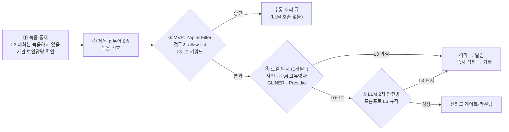

# 공통 부록: 데이터 등급·처리 경로·수탁자/국외이전·정보주체 권리·녹음 원칙

> 기준일: 2026-10-01 · 대상: CRATA 대표, 실무자, 고객 계약 담당 · 범위: GOAL A(내부 회의 자동 분류 파이프라인)와 GOAL B(고객사 진단·맞춤 업무사이트)에서 다루는 모든 녹음·문서·데이터
> **정본 범위:** 이 문서는 ① 데이터 민감도 등급(L0~L3) 정의 ② 사업부별 기본 등급 ③ 녹음 원칙과 고지 문구 ④ 수탁자·국외이전 목록 ⑤ L3 사전 탐지·격리·삭제 절차 ⑥ 정보주체 권리 대응 절차의 **정본**입니다. [01 시장 지도](./01_market-map.md) 4.1~4.4·4.9절, [02 회의 자동 분류](./02_meeting-auto-classification.md) 8장, [03 Company DNA 플레이북](./03_company-dna-playbook.md) 8장은 요약입니다. 서로 다르면 이 문서를 따르고, 이 문서를 고친 뒤 요약을 맞춥니다.
> **표기:** **TODO**는 CRATA 내부에서 확인·결정할 항목, **(미검증)**은 공식 자료로 확인하지 못한 내용, **(제안)**은 이 문서가 권하는 기준값, **확인 필요**는 벤더 문서나 계약서로 확인해야 하는 사실입니다.
> **이 문서는 법률 자문이 아닙니다.** 계약 체결, 처리방침 공개, 제품 출시 전에는 개인정보·노동·공공조달 전문가의 검토를 받아야 합니다(11장).

---

## 0. 한눈에 보는 핵심 규칙 10개

1. **L3(학생 식별 정보, 상담·사례 내용)는 녹음하지 않습니다.** 실수로 들어오면 자동 처리를 멈추고 격리한 뒤 즉시 삭제합니다. 국내 경로로 돌려서 처리를 이어가지 않습니다.
2. **L3 탐지는 해외 LLM을 부르기 전에 로컬에서 먼저 합니다.** LLM 프롬프트의 L3 규칙은 2차 안전망입니다.
3. **Plaud 단계의 노출은 파이프라인으로 막을 수 없습니다.** AutoFlow는 동기화 즉시 Plaud 클라우드와 미국 LLM으로 요약하므로 **녹음 자체를 통제**합니다. MVP 기간(1주~1개월)에는 Zap에 연결된 Plaud 계정에 L0~L1 회의만 녹음합니다(2.4절).
4. **L2(고객 비밀, 견적·계약 조건, 학맞통 기관 협의, ARA 파일럿·안전·피드백)는 Amazon Bedrock 서울 In-Region의 Claude Sonnet 5 / Opus 5만** 씁니다. 정본은 국내 저장소에 두고 Notion에는 링크만 둡니다.
5. **L0~L1은 학습 미사용 계약의 해외 LLM API**(Claude API, Claude Team/Enterprise)로 처리할 수 있습니다. 처리방침에 국외이전을 공개합니다.
6. **녹음은 CRATA 진행자가 당사자로 참여한 대화만** 합니다. 워크샵 소그룹 토론과 셰도잉은 녹음하지 않습니다.
7. **학교·교육청에서는 녹음 전에 기관 보안담당 확인**을 받습니다.
8. **목소리 등록(화자 음성 프로필)은 생체인식정보=민감정보**입니다. 내부 직원만, 별도 서면 동의 후 씁니다.
9. **시안 엔진(Lovable·v0 등 해외 빌더)에는 L0 토큰과 더미 데이터만** 넣습니다.
10. **수탁자 표(5장)에 없는 도구에는 고객·회의 데이터를 넣지 않습니다.** 새 도구는 표에 먼저 추가하고 허용 등급을 정한 뒤 씁니다.

---

## 1. 목적과 적용 범위

### 1.1 목적

- CRATA가 다루는 녹음·전사·문서·업무 데이터를 민감도에 따라 나누고, 등급마다 **녹음 여부, 저장 위치, 허용 LLM, 보존 기간, 자동 처리 여부**를 하나로 정합니다.
- 세 문서(01·02·03)가 같은 기준을 쓰도록 정의를 한곳에 둡니다.
- 고객 계약서의 "데이터 등급 부속서"와 CRATA 개인정보 처리방침의 수탁자·국외이전 표의 원본으로 씁니다.

### 1.2 적용 범위와 CRATA의 역할

| 범위 | 무엇을 다루나 | CRATA의 법적 지위 | 핵심 근거 |
|---|---|---|---|
| **GOAL A** 내부 회의 파이프라인 | CRATA가 녹음한 내부·고객·기관 회의, 전사, 구간 분류 결과, 산출물, 프로젝트 메모리, 예시 DB·골든셋 | **개인정보처리자.** Plaud·Anthropic·Zapier 등은 수탁자 | 처리방침 공개 의무(제30조), 처리위탁([제26조](https://casenote.kr/법령/개인정보_보호법/제26조)), 국외이전([제28조의8](https://casenote.kr/법령/개인정보_보호법/제28조의8)) |
| **GOAL B** 고객 진단·업무사이트 | 고객 문서·규정·양식, 그룹웨어 메타데이터, 직원 인터뷰, 워크샵 결과, Company DNA Profile, 포털 시안 | **고객의 수탁자.** Plaud·LLM·빌더는 **재수탁자** → 고객 서면 동의 필요(제26조⑥) | 위와 같음 + 근로자참여법([제20조](https://casenote.kr/법령/근로자참여_및_협력증진에_관한_법률/제20조)) |
| ARA 제품(학교·교사·학생용) | 이용자 대화, 검사 결과 | 제품 운영자(처리자) | AI 기본법 제31조, 초·중등교육법 제29조의2. **ARA 제품 자체의 처리방침은 별도 문서(TODO)** |

- GOAL B에서 고객 데이터로 만든 패턴을 다른 고객에게 재사용하면 목적 외 처리가 됩니다. 재사용은 익명·집계 수준으로 일반화하고 계약에 허용 조항을 넣은 경우만 합니다(8.6절).
- **TODO:** 개인정보 보호책임자(CPO 겸임) 1명 지정. 반기마다 벤더 약관(Plaud, Anthropic, OpenAI, AWS 등)을 다시 점검합니다. 벤더 약관이 바뀌면 국외이전 표도 바뀌기 때문입니다.

---

## 2. 데이터 등급 L0~L3

### 2.1 정의표

| 항목 | **L0** 공개·내부 일반 | **L1** 일반 업무·일반 개인정보 | **L2** 고객 비밀·계약 조건 | **L3** 학생 식별·상담·사례 |
|---|---|---|---|---|
| 정의 | 공개 정보, 내부 일반 정보 | 일반 영업·고객 미팅, 일반 개인정보(성명·연락처 수준). **EDU(강의·워크샵) 기본값** | 고객이 NDA·비밀로 지정한 자료(GOAL B 고객 진단 자료 포함), 견적·계약 조건(EDU.proposal 포함), 학맞통 기관 협의(학생 비식별 전제), ARA.pilot·ARA.safety·ARA.feedback | 학생 식별 가능 정보, 상담·사례 내용 |
| 예시 | 공개 자료 기반 기획 회의, 홈페이지·보도자료, 공개 채용공고, 브랜드 토큰(`brand.tokens.json`), 표준 교안 개발 | 강의 요구분석 미팅, 교안 리뷰, 강의 운영 연락, 아라 스프린트·버그 회의, 영업 파이프라인 점검 | 강사료·단가·계약서 협의, 교육지원청과의 센터 운영 협의, 아라 파일럿 결과 리뷰, 고객 위임전결규정·결재 양식·그룹웨어 메타데이터·내부 회의 녹음 | 학맞통 사례회의, 학생·보호자 상담, 학폭 사안 당사자 논의, 학년·반과 이름의 조합, 실제 학생 대화 로그 원문 |
| 녹음 | 가능 | 고지·동의 후 가능 | 고지 + 고객·기관 **서면 동의** 후. 동의하지 않으면 Plaud를 쓰지 않고 국내 STT(RTZR·CLOVA Speech) 또는 녹음 없이 메모 | **녹음하지 않음(원칙)** |
| 기본 처리 경로 | Plaud → (MVP) Zapier / (1개월~) 국내 서버 → 로컬 판정 → Claude API | 같음. 외부인 연락처는 **마스킹 후** LLM 전송(1개월 차부터 로컬 Presidio·GLiNER. MVP Zapier 단계의 마스킹 방법은 TODO) | (1개월 차부터) 국내 서버 → 로컬 판정 → Bedrock 서울 In-Region. **MVP 기간에는 자동화하지 않고 수동 처리.** Zap에 연결된 Plaud 계정으로 녹음하지 않음(2.4절 녹음 계정 분리) | 처리하지 않음. 실수로 들어오면 자동 처리 중단 → 격리 → 즉시 삭제 → 기록(6.3절) |
| 허용 LLM/리전 | 해외 LLM API 허용(학습 미사용 계약) | 녹음 고지·동의 후, 학습 미사용 API 계약(상용 API 또는 Team·Enterprise)으로 해외 LLM 허용 | **Amazon Bedrock 서울 리전 In-Region의 Claude Sonnet 5 / Opus 5만.** Haiku 4.5·Sonnet 5.5·Opus 5.5 등 최신 모델은 서울에서 Global 교차 리전 전용이라 **사용 금지**. Message Batches 할인 없음. 요금은 Bedrock 요금(확인 필요) | **어떤 LLM에도 보내지 않음**(국내 리전 포함) |
| 저장 위치 | Notion/Drive | Notion/Drive. 처리방침에 국외이전 공개 | **정본은 국내**(Supabase 서울, NAVER WORKS Drive 등). Notion에는 링크만. Plaud에 올렸다면 Plaud 사본은 국외(미국 등)에 보관됨을 동의서에 명시 | 저장하지 않음(삭제 기록만, 내용은 적지 않음) |
| 보존 기간 (제안) | 원본 오디오 30일, 전사본 1년, 산출물 상시 | 원본 오디오 30일, 전사본 1년, 산출물은 개인정보 제거 후 보관 | 원본 오디오 30일, 전사본 1년. GOAL B는 계약 종료 시 파기하고 파기 확인서 발급. 산출물은 고객 소유 | 즉시 삭제 |
| 자동 처리 | 가능. 처음 2주는 전부 사람 확인, 이후 신뢰도 게이트(2.4절) | 가능(같은 게이트). 외부로 나가는 것(메일·고객 공유)은 항상 사람 확인 | MVP 기간에는 불가(수동). 1개월 차 L2 경로가 생긴 뒤 같은 게이트로 자동 분류 | **금지** |

- 근거: 녹음·국외이전 법리는 4·5·10장, Bedrock 서울 리전 모델 지원은 [AWS 문서](https://docs.aws.amazon.com/bedrock/latest/userguide/models-region-compatibility.html)(Claude Opus 5·Sonnet 5는 In-Region O / Geo X / Global O, 그 밖의 최신 모델은 Global만), 보유기간 기본값은 리서치 데이터셋 'gap-korea-legal-privacy-compliance' M9 제안과 [02 문서](./02_meeting-auto-classification.md) 8.3절을 따랐습니다.
- **"L2·L3면 국내 경로로 처리를 계속한다"는 규칙은 없습니다.** L2만 국내 경로로 처리하고, L3는 처리하지 않습니다.
- 기관이 자기 시스템에서 직접 기록을 남기는 것은 CRATA 처리 범위 밖입니다. 이때 CRATA는 온디바이스 옵션(예: 인터넷 없이 단말에서 전사하는 셀바스AI 셀비노트, [ddaily 2024-06-27](https://www.ddaily.co.kr/page/view/2024062709553042906), [ddaily 2026-02-26](https://m.ddaily.co.kr/page/view/2026022608415070571))을 안내할 수 있을 뿐, 녹음·보관하지 않습니다.

### 2.2 등급 판정 규칙

1. **판정은 해외 LLM을 부르기 전에, 로컬에서** 합니다(6장). 근거는 제목 접두어, 캘린더 일정·참석자 소속, 키워드·학교/학생 사전, Kiwi 고유명사, GLiNER 인명 인식입니다.
2. **애매하면 높은 등급**으로 봅니다.
3. 한 회의에 여러 파트가 섞이면 **구간마다 등급을 매기고, 가장 높은 등급의 규칙을 회의 전체에 적용**합니다. **L3 구간이 하나라도 있으면 회의 전체의 자동 처리를 멈춥니다.**
4. **견적·계약 조건(금액·단가·조건)이 나오는 구간은 사업부와 관계없이 L2**입니다.
5. 가명정보도 개인정보입니다. "가명이라 괜찮다"는 L3를 낮추는 근거가 되지 않습니다.
6. 감사 로그를 남깁니다: 누가, 언제, 어느 LLM·리전에, 몇 등급 데이터를 보냈는지(데이터셋 M2 제안).

### 2.3 모델·경로별 허용 등급

| 경로 | 처리 위치 | 허용 등급 | 비고 |
|---|---|---|---|
| Claude API **Sonnet 5.5** (상용 API, 학습 미사용) | 미국 | L0~L1 | **1주 MVP 기본 모델** |
| Claude API Haiku 4.5 | 미국 | L0~L1 | **3개월 차**에 분류 전용으로 분리. Bedrock 서울에서는 Global 교차 리전 전용이라 L2 불가 |
| Claude API Opus 5.5 | 미국 | L0~L1 | 기본 경로에는 쓰지 않음 |
| Claude Team/Enterprise 앱(Claude Desktop·MCP 연결 포함) | 미국 | L0~L1 | 관리자가 피드백 기능을 끔(5.1절 Anthropic 행) |
| Claude 개인 플랜 | 미국 | 학습 허용 설정이 꺼진 것을 확인한 경우에만 L0~L1 | 고객·회의 데이터에는 Team/Enterprise 또는 API를 권장 |
| Claude Code 같은 에이전트가 전사본을 직접 읽는 방식 | 미국 | L0~L1 | 그 자체가 해외 LLM 호출이므로 L2 회의에는 쓰지 않음([02 문서](./02_meeting-auto-classification.md) 3.3절) |
| Zapier의 Claude 액션 | 미국(Zapier 경유) | L0~L1 | 구조화 출력 지원 미확인 → JSON 파싱 실패 시 1회 재시도 후 '미분류'. Zap에 연결된 Plaud 계정에는 L0~L1 회의만 녹음(2.4절 녹음 계정 분리) |
| **Bedrock 서울 In-Region Claude Sonnet 5 / Opus 5** | 한국(서울 리전) | **L0~L2** | 1개월 차부터. 교차 리전 추론 프로파일로 호출하지 않음 |
| Bedrock 교차 리전(Global) 호출 | 서울 밖 | L0~L1 | 국외이전. L2 금지 |
| Plaud 내부 LLM(AutoFlow, Plaud Intelligence) | 미국 | 녹음 통제로 관리(6.4절) | CRATA 파이프라인 밖. L3는 Plaud에 올리지 않음 |
| 로컬 모델(Kiwi, GLiNER, Presidio, KURE-v1, SetFit) | CRATA 국내 서버·PC | L0~L2 처리, L3는 **탐지 용도만** | 외부 API 호출 없이 쓰도록 설정 |

### 2.4 신뢰도 게이트와 MVP 투입 범위 (등급과 함께 쓰는 운영 규칙, 정본은 02 문서)

- 게이트: **0.85 이상 + 규칙 일치 → 자동**, **0.60~0.84 → 확인 제안**, **0.60 미만 또는 NEW → 미분류**. 처음 2주는 신뢰도와 관계없이 전부 사람 확인.
- **1주 MVP 대상은 `[강의][아라][AX][공통]` 회의만**입니다. Zap 첫 단계 Filter에서 제목 접두어가 `[학맞통]`이거나 접두어가 없으면 중단합니다(`[혼합]`도 중단). 학맞통 회의는 L2 경로가 생긴 **1개월 차 이후**에만 투입합니다.
- **MVP 기간(1주~1개월) 녹음 계정 분리:** Zap에 연결된 Plaud 계정에는 L0~L1 회의만 녹음합니다. L2가 예상되는 회의(학맞통 기관 협의, [AX] 고객 진단·인터뷰, ARA.pilot·safety·feedback, 견적·계약 협상)는 Zap에 연결하지 않고 AutoFlow를 끈 별도 Plaud 계정·기기로 녹음하거나, 국내 STT(RTZR·CLOVA Speech) 또는 메모로 기록합니다. Filter는 이 분리가 실패했을 때의 2차 장치입니다.
  - 이유: Zapier의 허용 최대 등급은 L1이고(5.1절), Zap 트리거는 연결된 계정의 녹음을 **Filter보다 먼저** Zapier(미국)로 넘깁니다. AutoFlow도 같은 계정에서 동기화 즉시 미국 LLM으로 요약합니다(6.4절). 따라서 Filter만으로는 L2 녹음의 국외 전송을 막지 못합니다.
  - 별도 계정·기기에서 AutoFlow를 실제로 끌 수 있는지와 운영 방법은 **TODO**(부록 #5)입니다. 확인 전까지는 국내 STT 또는 메모를 기본으로 합니다(제안).
- 골든셋은 **[강의][아라][AX][공통] 회의만**으로 만듭니다. 학맞통·학생이 언급된 회의와 견적·계약 조건(L2)이 중심인 회의는 뺍니다.

### 2.5 L2 경로 실행 세부 (1개월 차)

| 순서 | 할 일 | 상태 |
|---|---|---|
| 1 | AWS 서울(ap-northeast-2) 계정 개설, IAM 최소 권한 설정 | TODO |
| 2 | Bedrock 모델 접근 신청: Claude Sonnet 5 / Opus 5 | TODO |
| 3 | 호출이 **In-Region**인지 확인(교차 리전 추론 프로파일 ID를 쓰지 않음). 호출 로그로 리전 확인 | TODO |
| 4 | Sonnet 5의 Bedrock 단가 확인. Anthropic API 요금이 아니라 Bedrock 요금을 따름 | **확인 필요** |
| 5 | Message Batches 미지원 → 배치 50% 할인 없음을 비용표에 반영. 구조화 출력과 프롬프트 캐싱은 지원([02 문서](./02_meeting-auto-classification.md) 8.2절) | 반영 |
| 6 | 국내 정본 저장소 연결(Supabase 서울 또는 NAVER WORKS Drive), Notion에는 링크만 게시 | TODO |
| 7 | 학맞통 기관 협의(학생 비식별 전제)와 MVP에서 L2 키워드로 중단되던 회의를 투입 | 1~6 완료 후 |

- 참고: Azure OpenAI Korea Central도 Standard·Regional 배포를 쓰면 국내 처리가 되지만 Global 배포는 레지던시를 보장하지 않습니다([MS](https://learn.microsoft.com/en-us/azure/ai-foundry/openai/how-to/deployment-types)). CRATA의 L2 LLM 경로는 Bedrock 서울로 통일합니다.

---

## 3. 사업부별 기본 등급

정본 분류 체계는 [`config/meeting_taxonomy.yaml`](../../config/meeting_taxonomy.yaml)([02 문서](./02_meeting-auto-classification.md) 4.2절)입니다. 아래는 등급만 뽑은 표입니다.

| 사업부·업무유형 | 기본 등급 | L3 트리거 적용 | 비고 |
|---|---|---|---|
| **EDU** 강의·워크샵 | **L1** | 질의응답 등에서 학생 사례가 나오면 해당 회의 L3 처리 | MVP 투입(`[강의]`) |
| └ EDU.proposal 제안·견적 | **L2** | — | 견적·계약 조건. MVP에서는 L2 키워드로 중단되어 수동 처리 |
| └ EDU.billing 정산·계산서 | L2 | — | 계약 금액·조건([02 문서](./02_meeting-auto-classification.md) 4.2절) |
| **SSI** 학맞통 | **L2(학생 비식별 전제)** | **적용** → 걸리면 처리 중단·격리·삭제 | MVP 제외. 1개월 차 L2 경로 이후 투입. 사례회의·상담은 녹음하지 않으므로 분류 대상이 아님 |
| **ARA** 아라 에이전트 | **L1** | — | MVP 투입(`[아라]`) |
| └ ARA.pilot·ARA.safety·ARA.feedback | **L2** | **적용**(SSI와 같은 트리거) | 실제 학생 대화 로그가 논의될 수 있음 |
| **CORE** 공통(영업·경영·채용·법무 등) | **L1** | — | CORE.legal에서 고객 계약 조건이 나오면 L2 |
| DX 진단·코칭 **(후보, TODO 확인)** | L2 | — | 개인 검사 결과가 나올 수 있음 |
| AXC AX 컨설팅·업무사이트 **(후보, TODO 확인)** | L1 | — | AXC.diagnosis·AXC.migration은 L2(고객 내부 자료) |
| **GOAL B 고객 진단 자료** | **L2** | 학교·교육청 고객이면 적용 | 고객이 L0로 분류해 준 범위(공개 자료, 브랜드 토큰)만 L0 |

**L3 트리거(SSI와 ARA.pilot·safety·feedback 공통):** 학생 실명, 학년·반과 이름의 조합, 상담·사례 내용, 가정·건강·경제 형편, 학폭 사안 당사자, 개별 학생 사례 논의(사례회의), 실제 학생 대화 로그 원문 인용.

**녹음 제목 접두어 (이 6개만 씀, `[학맞통-사례]`는 만들지 않음)**

| 접두어 | 사업부 힌트 | 1주 MVP 자동 처리 | 비고 |
|---|---|---|---|
| `[강의]` | EDU | 대상 | 견적·계약 키워드가 나오면 중단. 학맞통이 주제인 연수(SSI primary, L2)도 L2 키워드(학맞통·학생맞춤통합지원 등)로 중단 |
| `[학맞통]` | SSI | **제외** | 1개월 차 L2 경로 이후 |
| `[아라]` | ARA | 대상 | pilot·safety·feedback 회의(L2)는 MVP 자동화 대상이 아님. **MVP 기간(1주~1개월) 녹음 계정 분리:** Zap에 연결된 Plaud 계정에는 L0~L1 회의만 녹음합니다. L2가 예상되는 회의(학맞통 기관 협의, [AX] 고객 진단·인터뷰, ARA.pilot·safety·feedback, 견적·계약 협상)는 Zap에 연결하지 않고 AutoFlow를 끈 별도 Plaud 계정·기기로 녹음하거나, 국내 STT(RTZR·CLOVA Speech) 또는 메모로 기록합니다. Filter의 L2 키워드(파일럿·위기·에스컬레이션·피드백·대화 로그 등)는 이 분리가 실패했을 때의 2차 장치입니다 |
| `[AX]` | AXC(후보) | 대상 | 고객 진단 자료(AXC.diagnosis·migration, L2)를 다루는 회의는 MVP 자동화 대상이 아님. **MVP 기간(1주~1개월) 녹음 계정 분리:** Zap에 연결된 Plaud 계정에는 L0~L1 회의만 녹음합니다. L2가 예상되는 회의(학맞통 기관 협의, [AX] 고객 진단·인터뷰, ARA.pilot·safety·feedback, 견적·계약 협상)는 Zap에 연결하지 않고 AutoFlow를 끈 별도 Plaud 계정·기기로 녹음하거나, 국내 STT(RTZR·CLOVA Speech) 또는 메모로 기록합니다(`mvp_filter.exclude_l2_recordings`). Filter의 L2 키워드(위임전결·결재선·결재 양식·완결 문서·감사로그·진단 인터뷰·이관 등)는 이 분리가 실패했을 때의 2차 장치입니다 |
| `[공통]` | CORE | 대상 | — |
| `[혼합]` | 없음 | **제외** | 학맞통 파트가 섞일 수 있어 1개월 차 이후 |
| (접두어 없음) | — | **제외** | 사람이 접두어를 붙인 뒤 처리 |

- MVP Filter의 키워드는 보조 수단이라 L2 회의를 모두 잡지는 못합니다. L2 키워드 사전(`config/meeting_taxonomy.yaml`의 `pre_llm_gate.l2_keywords`. 진단·결재·이관, 파일럿·위기·피드백, 학맞통, 검사 결과·결과지 표현 반영)은 운영하며 계속 보강합니다. DX(후보, 기본 L2)는 자체 접두어가 없어 MVP에서는 '검사 결과'·'결과지' 키워드로 중단합니다. 1차 수단은 Filter가 아니라 **녹음 계정 분리**(2.4절)입니다. L2 회의임을 미리 알면 Zap에 연결된 계정으로 녹음하지 않고, 녹음한 뒤에 알게 되면 접두어와 관계없이 자동화에서 뺍니다(**TODO: 제외 표시 방법 결정**). 이때 전사·요약은 이미 Zapier에 들어갔으므로 Zap 실행 이력 삭제 대상으로 기록합니다(삭제 방법 확인 필요, 부록 #7).
- (제안) CORE.hr 중 개별 직원의 평가·징계·건강 이야기가 나오는 1대1 면담은 녹음하지 않습니다. **TODO: 대표 확인.**

---

## 4. 녹음 원칙

### 4.1 법적 근거 요약

| 영역 | 내용 | 근거 |
|---|---|---|
| 당사자 녹음 | 대화에 **직접 참여한 사람**의 녹음은 위법이 아님(3인 대화 포함). 단 녹음자가 실제로 참여해야 하며, 자리를 비운 상태로 기기를 켜 두거나 녹음자가 빠진 뒤에도 계속 녹음하면 위법이 될 수 있음 | [대법원 2013도16404](https://casenote.kr/대법원/2013도16404) |
| 제3자 녹음 | 공개되지 않은 타인 간 대화의 녹음은 금지되고, 위반 시 1년 이상 10년 이하 징역과 5년 이하 자격정지 | [통신비밀보호법 제3조](https://casenote.kr/법령/통신비밀보호법/제3조), [제16조](https://casenote.kr/법령/통신비밀보호법/제16조) |
| 교실 녹음 | 학부모가 자녀 가방에 녹음기를 넣어 교실 수업을 녹음한 사건은 위법이고 증거능력도 부정됨(2024-01-11 선고) | [대법원 2020도1538](https://casenote.kr/대법원/2020도1538) |
| 개정 동향 | 전원 동의 의무화 개정안(윤상현 의원, 의안 2116905)은 2022-09-29 철회. 22대 국회 김예지 의원 안(의안 2214349, 2025-11-18 발의)은 학대 취약계층 보호 목적의 녹음 예외를 허용하는 방향이며 법사위 계류 중 | [의안정보시스템](https://likms.assembly.go.kr/bill/billDetail.do?billId=PRC_Q2J2Y0J1G1Y9R1O4V2Y5J3Z8Y7N0U5), [입법예고](https://pal.assembly.go.kr/napal/lgsltpa/lgsltpaDone/view.do?lgsltPaId=PRC_S2T5R1S1A1A0Z0X9Y4W9X4F7F2E1C2) |
| 남는 위험 | 형사상 적법해도 개인정보 보호법과 민사상 음성권 위험은 남음 → 고객 회의는 시작할 때 고지가 기본 | 데이터셋 M1 |

### 4.2 CRATA 녹음 수칙 (체크리스트)

- [ ] **CRATA 진행자가 당사자로 참여한 대화만** 녹음합니다. 자리를 비우면 녹음을 멈춥니다.
- [ ] 회의실에 녹음기를 두고 나가지 않습니다. 고객 직원에게 대신 녹음을 부탁하지 않습니다.
- [ ] 녹음 직후 앱에서 제목 접두어 6종 중 하나를 붙입니다(3장).
- [ ] 고객 회의는 시작할 때 고지 스크립트(4.4절)를 읽고, 캘린더 초대 메일에도 같은 문구를 넣습니다. 상대가 거부하면 녹음을 끄고 수기 메모로 바꿉니다.
- [ ] **워크샵 소그룹 토론은 녹음하지 않습니다.** 꼭 필요하면 그룹 전원 동의를 받고 진행자가 동석합니다. 테이블마다 녹음기를 두는 방식은 쓰지 않습니다(CRATA가 당사자가 아닌 대화를 녹음하게 됨).
- [ ] **셰도잉(업무 관찰) 중에는 Plaud로 녹음하지 않고 메모만** 합니다. 관찰 중에는 직원이 받는 전화나 옆자리 대화처럼 CRATA가 당사자가 아닌 대화가 섞이기 쉽습니다. "말하면서 일하기" 설명이 필요하면 셰도잉이 끝난 뒤 동의를 받은 별도 인터뷰로 받습니다.
- [ ] **NEIS·K-에듀파인·학생 업무 화면은 캡처하지 않습니다.**
- [ ] **학교·교육청에서는 녹음 전에 기관 보안담당에게** 녹음기 사용과 해외 클라우드 업로드가 기관 규정상 허용되는지 확인합니다. 확인 결과(일자, 담당자 직함, 허용 범위)를 프로젝트 기록에 남깁니다.
- [ ] 학맞통 사례회의, 학생·보호자 상담, 학교 수업 참관은 **어떤 기기로도 녹음하지 않습니다(L3).**

### 4.3 상황별 녹음 가부

| 상황 | 녹음 | 조건 | 등급 |
|---|---|---|---|
| CRATA 내부 회의 | 가능 | 사내 공지로 녹음 사실 고지 | L0~L1(견적·계약 조건 구간은 L2) |
| 일반 고객 미팅 | 가능 | 구두 고지 + 캘린더 초대 고지. 거부 시 메모 | L1 |
| 고객이 비밀로 지정한 자료를 다루는 회의, 견적·계약 협상 | 조건부 | 고지 + **서면 동의**(Plaud 국외 보관·처리 명시). 동의가 없으면 국내 STT(RTZR·CLOVA Speech)로 전사하거나 녹음 없이 메모. Zap에 연결된 Plaud 계정으로는 녹음하지 않음(2.4절) | L2 |
| 강의·워크샵 전체 세션 | 가능 | CRATA 진행자가 참여한 전체 세션만. 시작 시 고지. 질의응답에서 학생 사례가 나오면 6.3절 절차 | L1 |
| 워크샵 소그룹 토론 | **원칙적으로 안 함** | 꼭 필요하면 그룹 전원 동의 + 진행자 동석 | L1~L2 |
| 셰도잉(업무 관찰) | **안 함** | 메모만. 화면 캡처는 동의한 직원·허용 도메인만, NEIS·K-에듀파인·학생 업무 화면 제외 | — |
| 고객 직원 인터뷰(GOAL B) | 가능 | CRATA 인터뷰어가 참여, 개별 동의서(목적, AI 전사, 국외 처리 여부, 보유기간, 거부권). 인용할 때는 가명. **원본 녹음은 고객에게 주지 않음.** Zap에 연결된 Plaud 계정으로는 녹음하지 않음(2.4절) | L2 |
| 학교·교육청 기관 협의 | 조건부 | 기관 보안담당 확인 → 기관 서면 동의 → 학생 비식별 전제. AutoFlow 제외 방법 확인 전까지는 Plaud 대신 메모 또는 국내 STT 권장(6.4절) | L2 |
| 아라 파일럿·안전·피드백 회의 | 가능 | 실제 학생 대화 로그 원문을 소리 내 읽지 않음. 인용되면 L3 트리거. Zap에 연결된 Plaud 계정으로는 녹음하지 않음(2.4절) | L2 |
| 학교 수업 참관 | **안 함** | — | (L3 위험) |
| 학맞통 사례회의, 학생·보호자 상담 | **안 함** | 실수로 녹음되면 6.3절 | L3 |
| CRATA가 빠진 회의, 녹음기를 두고 나가는 경우 | **금지** | 통신비밀보호법 위반 | — |

### 4.4 고지 스크립트와 서면 동의서

**구두 고지 (고객 회의 시작 시, 캘린더 초대 메일에도 같은 문구):**

> "오늘 회의는 정확한 기록과 후속 자료 작성을 위해 녹음하고 AI로 전사·요약합니다. 녹음은 해외(미국 등)에 있는 Plaud 클라우드에서 처리·보관되고, AI 요약은 미국에 있는 AI 제공사를 거칩니다. CRATA가 보관하는 원본 녹음은 30일 뒤 삭제하며, 외부 처리사의 보관 기간은 각 사 정책을 따릅니다. 원치 않으시면 말씀해 주세요. 녹음을 끄거나 그 부분을 빼겠습니다."

- 삭제 약속은 **"CRATA 보관 원본은 30일 뒤 삭제, 외부 처리사의 보관 기간은 각사 정책"** 수준을 넘지 않습니다. Anthropic은 API 입출력을 30일 안에 삭제하지만 정책 위반으로 플래그된 데이터는 최대 2년 보관합니다(5장). **TODO:** Plaud 클라우드 사본의 자동 삭제 설정을 확인한 뒤 문구를 확정합니다.

**L2 서면 동의서 필수 항목 (제안):**

| 항목 | 내용 |
|---|---|
| 목적 | 회의 기록, 후속 산출물 작성 |
| 처리 방식 | 녹음 → AI 전사·요약·분류 |
| 국외 처리 | Plaud 사용 시: 녹음·전사·요약이 **국외(미국 등)에서 보관·처리**됨(Plaud 데이터센터: 미국·프랑크푸르트·싱가포르·일본, 한국 리전 없음) |
| 국내 처리 | CRATA 파이프라인의 분류·산출물 생성은 Amazon Bedrock 서울 리전 In-Region, 정본은 국내 저장소 |
| 보유기간 | CRATA 보관 원본 30일, 전사본 1년(또는 계약 종료 시 파기), 외부 처리사는 각사 정책 |
| 거부권과 대체 경로 | 거부해도 불이익 없음. 거부 시 국내 STT(RTZR·CLOVA Speech) 또는 녹음 없이 메모 |
| 받지 않을 정보 | 학생 식별 정보, 상담·사례 내용은 회의에서 다루지 않음. 나오면 해당 녹음 삭제 |

### 4.5 화자 음성 등록 = 생체인식정보

- 특정인을 식별하려고 만든 음성 특징정보(목소리 프로필)는 **생체인식정보로서 민감정보**입니다(개인정보 보호법 제23조, 시행령 제18조. **조문 원문 링크 확인 TODO**). 해외 서비스에 등록하면 국외이전도 겹칩니다.
- **내부 직원만, 별도 서면 동의를 받은 뒤** 화자 라벨용으로 씁니다. 동의서에는 목적, 저장 위치(국가), 보유기간, 철회 방법을 적습니다.
- **고객·기관 참석자의 목소리는 등록하지 않습니다. 고객사 화자 프로필을 산출물로 만들지 않습니다.**
- 예: OpenAI 전사 모델은 2~10초 참조 음성으로 최대 4명의 화자를 이름에 매핑합니다([문서](https://developers.openai.com/api/docs/guides/speech-to-text)). 쓴다면 위 조건을 지킵니다. 음성 원본은 학습·예시 세트에 넣지 않고 텍스트만 씁니다(데이터셋 M4).

---

## 5. 수탁자·국외이전 목록

### 5.1 수탁자 표

'허용 최대 등급'은 이 문서의 결정이고, 처리 국가와 근거는 리서치 데이터셋과 01~03 문서에서 확인한 사실만 적었습니다. 모르는 것은 **확인 필요**로 두었습니다.

| 서비스 | 용도 | 처리 국가/리전 | 허용 최대 등급 | 근거/비고 |
|---|---|---|---|---|
| **Plaud** (기기, 앱, AutoFlow, MCP·CLI, Zapier 트리거) | 녹음·전사·요약, 녹음 수집 | 데이터센터 미국·프랑크푸르트·싱가포르·일본. **한국 리전 없음.** EU 밖 사용자는 **미국 호스팅 LLM**(OpenAI·Anthropic·Google). MCP를 HTTP로 연결하면 미국 Plaud MCP 서버 경유(저장하지 않음) | **L2**(고객·기관 서면 동의서에 국외 보관·처리 명시한 경우만). **L3 금지** | LLM 무학습·무보존 DPA, Plaud 자체 학습은 opt-in 때만, 프라이빗 클라우드 설치 미지원, 처리방침(2026-06-16)에 한국 전용 조항 없음([신뢰센터](https://www.plaud.ai/pages/trust-center), [처리방침](https://www.plaud.ai/pages/privacy-policy), [MCP 문서](https://docs.plaud.ai/plaud-mcp-cli/mcp)). MCP·CLI는 **`@plaud-ai/mcp@0.3.13`, `@plaud-ai/cli@0.3.14`로 고정**하고 업그레이드 시 골든셋 회귀 테스트([npm](https://registry.npmjs.org/@plaud-ai/mcp)). MCP·CLI·Zapier는 로그인한 계정의 녹음만 봄 → 여러 사람 계정 처리 TODO. 클라우드 사본 자동 삭제 설정 TODO |
| **Anthropic** (Claude API 상용, Claude Team·Enterprise) | 분류·산출물(L0~L1) | 미국. 한국 리전 없음 | **L1** | 상용 데이터 기본 학습 미사용, API 입출력 30일 안에 삭제, ZDR 계약 가능. 정책 위반 플래그 데이터 최대 2년, T&S 점수 최대 7년. 좋아요/싫어요 피드백은 5년 보관되고 학습에 쓰일 수 있으며 Team/Enterprise 관리자가 끌 수 있음 → **끄기**([학습](https://privacy.claude.com/en/articles/7996868-is-my-data-used-for-model-training), [보관](https://privacy.claude.com/en/articles/7996866-how-long-do-you-store-my-organization-s-data)). 개인 플랜은 학습 허용 설정 해제 확인 후에만 |
| **Amazon Bedrock 서울 + AWS 서울 리전** (ap-northeast-2) | L2 분류·산출물, 경로 B 국내 서버 | 한국(서울 리전 In-Region 추론). 운영사 AWS(미국) | **L2**(Claude Sonnet 5 / Opus 5 In-Region 호출만) | 서울에서 Opus 5·Sonnet 5는 In-Region 지원, Haiku 4.5·Sonnet 5.5·Opus 5.5 등은 Global 교차 리전 전용([AWS](https://docs.aws.amazon.com/bedrock/latest/userguide/models-region-compatibility.html)). 교차 리전 프로파일로 호출하면 국외이전이므로 L2 금지. Message Batches 미지원, 요금은 Bedrock 요금(확인 필요). "서울 리전이니까 국내 처리"라고 단정하지 않음(모델·호출 방식별로 다름) |
| **Zapier** | 1주 MVP 자동화(경로 A) | 미국 | **L1** | 트리거 'Transcript & Summary Ready'가 전사·요약을 Zapier로 넘김([Zapier](https://zapier.com/apps/plaud/integrations)). **Filter로 중단해도 데이터는 이미 Zapier(미국)에 들어온 상태**이므로 Filter는 "해외 LLM 호출 전" 게이트일 뿐 "국외 전송 전" 게이트가 아님. **MVP 기간(1주~1개월) 녹음 계정 분리:** Zap에 연결된 Plaud 계정에는 L0~L1 회의만 녹음합니다. L2가 예상되는 회의(학맞통 기관 협의, [AX] 고객 진단·인터뷰, ARA.pilot·safety·feedback, 견적·계약 협상)는 Zap에 연결하지 않고 AutoFlow를 끈 별도 Plaud 계정·기기로 녹음하거나, 국내 STT(RTZR·CLOVA Speech) 또는 메모로 기록합니다. Filter는 이 분리가 실패했을 때의 2차 장치입니다(2.4절). Zap 실행 이력 보관 기간·삭제 방법 확인 필요 |
| **Notion** | L0~L1 정본·검수 화면 | 운영사 미국. 데이터 저장 리전 확인 필요 | **L1**(L2는 국내 저장소 링크만) | Enterprise에서 LLM 제공사 ZDR 확인([요금](https://www.notion.com/pricing)). Notion AI·Custom Agents를 쓰면 Notion 쪽 LLM 처리도 거침(처리 위치 확인 필요). AI Meeting Notes·Custom Agents는 Business/Enterprise 필요 |
| **Google** (Gmail·Apps Script·Drive) | 경로 D(AutoFlow 메일 수신·처리), 파일 저장 | 운영사 미국. 저장 리전 확인 필요 | **L1** | [02 문서](./02_meeting-auto-classification.md) 8.2절 기준 L0~L1. Drive API는 메타데이터 조회에도 쓰임([Drive API](https://developers.google.com/workspace/drive/api/reference/rest/v3/files)) |
| **Gamma** | 장표 산출물 | 미국 | **L1**(견적·계약 조건 제외) | API 키는 Pro·Ultra·Teams·Business 플랜 필요([문서](https://developers.gamma.app/)). 데이터 보관·학습 정책 확인 필요 |
| **Lovable** | GOAL B 포털 시안 | 운영사 스웨덴. Lovable Cloud는 Supabase 기반이고 미주·유럽·아시아태평양 리전 중 선택, 활성화 후 변경 불가 | **L0**(토큰과 더미 데이터만) | 자체 Supabase로 원클릭 이전 불가 → 운영은 처음부터 자체 Supabase 서울([Cloud 문서](https://docs.lovable.dev/integrations/cloud)). SOC 2 Type II, ISO 27001:2022. LLM 처리 위치 확인 필요 |
| 노코드·로코드(Power Apps, Softr·Airtable, Glide(GlideOS), Notion Sites, Zite) — GOAL B 납품 옵션 B1·B2 | 고객 포털 | 미국 등(서비스별 확인 필요) | 고객 자체 테넌트·계약이면 CRATA 수탁 아님(고객 처리방침에 고객이 고지). CRATA 계정으로 구축·운영하면 L1까지, L2는 처리 위치 확인 전 금지 | [03 문서](./03_company-dna-playbook.md) 6.5절 |
| **Vercel / v0** | v0: 포털 시안. Vercel: 포털 호스팅 | 미국 | **v0: L0** / **Vercel 호스팅: L1**(L2 데이터가 지나는 서버 함수·로그의 처리 위치를 확인하기 전까지) | [v0 Design Systems](https://v0.app/docs/design-systems-2), [Vercel 요금](https://vercel.com/pricing)(Hobby는 비상업용만). Vercel 운영 배포 시 데이터 경로 확인 TODO([03 문서](./03_company-dna-playbook.md) 6.5절) |
| **Firecrawl** | 고객 홈페이지 브랜드·문서 스타일 수집 | 미국 | **L0**(공개 웹페이지만) | branding 포맷([문서](https://docs.firecrawl.dev/features/scrape)). 로그인이 필요한 페이지, 고객 내부 문서는 넣지 않음 |
| **Upstage** (Document Parse, Solar) | HWP·PDF 문서 파싱 | 운영사 한국. 콘솔 API 처리 위치 확인 필요. AWS·Azure 마켓플레이스·온프레미스 옵션 있음 | **L1**. L2 문서는 처리 위치(국내)·학습 미사용 조항을 서면으로 확인했거나 온프레미스일 때만(TODO). 확인 전 L2 문서는 python-hwpx 등 로컬 파싱 | [Document Parse](https://www.upstage.ai/products/document-parse) |
| **RTZR** (리턴제로 STT API) | 재전사, L2 회의의 국내 STT 대안 | 운영사 한국. 처리 위치 확인 필요 | **L2**(처리 위치·학습 미사용 조항 서면 확인 후, TODO) | 배치 결과는 3일 뒤 삭제, 온프레미스 공급 이력([문서](https://developers.rtzr.ai/docs/)) |
| **NAVER CLOVA Speech** | 재전사, L2 회의의 국내 STT 대안 | 한국 리전만(VPC/Classic) | **L2**(학습 미사용 조항 확인 TODO) | [사양](https://guide.ncloud-docs.com/docs/clovaspeech-spec) |
| **NAVER WORKS** (Drive, 클로바노트 for NAVER WORKS) | L2 정본 저장 후보, 고객 테넌트 안 녹음·전사 | 한국(네이버 자체 데이터센터) | **L2** | ISMS-P, CSAP, ISO 27001/27017/27018/27701, SOC 1/2/3. 클로바노트 for NAVER WORKS는 "고객의 개인정보 데이터를 수집하지 않고, AI 학습을 위해 사용되지 않음", 관리자 자동 삭제([보안](https://naver.worksmobile.com/security/), [클로바노트](https://naver.worksmobile.com/feature/clovanote/)). **개인용 클로바노트는 별도 약관이라 해당 없음** |
| **Supabase** (서울 리전) | L2 정본 DB, 고객 포털 DB | 서울 리전(ap-northeast-2) 선택 가능(이전 리서치 기준, 확인 필요). 운영사 미국 | **L2** | 운영사의 지원·백업 접근 위치 확인 필요([요금](https://supabase.com/pricing)) |
| **Worklytics** | GOAL B 조직 네트워크 분석(메타데이터) | 미국 | **CRATA 계정으로는 L1까지(사실상 쓰지 않음).** 그룹웨어 메타데이터(L2)는 고객이 직접 계약·운영하고 CRATA는 5인 이상 집계 결과만 받는 방식만 | 본문을 저장하지 않고 원천에서 익명·가명 처리한다고 밝힘([요금](https://www.worklytics.co/pricing)). 노사협의 선행(8.3절) |
| **Scribe** (Capture, Optimize) | GOAL B 웹 업무 캡처·SOP | 미국(Colony Labs, Inc.) | **L1**(고객 재수탁 서면 동의 + 국외이전 고지 + 동의한 직원·허용 도메인만). L2 화면, NEIS·K-에듀파인·학생 업무 화면은 캡처 금지 | 관리자가 승인한 브라우저 앱에서 동의한 사용자만 캡처, API·MCP로 AI 에이전트에 노출([Optimize](https://scribe.com/optimize)) |
| **Miro** (AI, MCP) | 워크샵 보드 | 미국/네덜란드 | **L1**. L2 워크샵 내용은 포스트잇 사진을 국내 저장소에 두거나 고객 자체 Miro 테넌트 사용 | MCP 서버로 보드 내용이 외부 LLM에 노출됨([Miro AI](https://miro.com/ai/)) |
| **Listen Labs·Outset** | AI 사전 인터뷰(후보) | 미국 | **L1**(쓴다면 개별 동의·국외이전 고지). **현재 권고: 쓰지 않고 ARA에 내재화** | Listen Labs: 120개 이상 언어 주장, 한국어 품질 미확인, 공개 API 없음([사이트](https://listenlabs.ai/)). Outset: 영상·음성·텍스트 인터뷰 수백 건 병렬 진행, 테마·인용 자동 정리, 한국어 지원 명시 확인 안 됨([사이트](https://outset.ai/)). [03 문서](./03_company-dna-playbook.md) 3.2절 2) |
| **OpenAI** (API) | 대안 LLM·재전사 후보(현재 파이프라인 미사용). Plaud의 LLM 재수탁자이기도 함 | 미국. 리전 처리(데이터 레지던시) 옵션은 10% 할증, 한국 리전 제공 여부 확인 필요 | **L1** | [요금](https://developers.openai.com/api/docs/pricing). 화자 음성 등록은 4.5절 조건. Agent Builder는 deprecated, 2026-11-30 종료 예정 |
| Linear·Slack (**TODO: 사용 여부**) | 티켓·알림 | 미국(확인 필요) | **L1**(L2는 국내 저장소 링크만) | [02 문서](./02_meeting-auto-classification.md) 8.2절 |
| Graphiti(선택, 3개월 차 이후) / Zep Cloud | 시간축 프로젝트 메모리 | Graphiti 자체 호스팅: CRATA 서버 위치. Zep Cloud: 미국 | 자체 호스팅: 서버 위치와 등급별 LLM 경로를 따름. Zep Cloud: L1 | 바뀐 사실을 지우지 않고 **무효 처리**하므로 삭제 요청 시 에피소드·파생 노드를 지우는 절차가 따로 필요([GitHub](https://github.com/getzep/graphiti)). 첫 2~3개 고객은 Postgres/YAML로 충분 |
| 로컬 도구(Kiwi, GLiNER, Presidio, KURE-v1, SetFit, Dembrandt, python-hwpx) | L3 사전 탐지, 마스킹, 임베딩, 토큰 추출, HWPX 생성 | CRATA 국내 서버·PC | L2(L3는 탐지 후 삭제만) | 외부 API 호출 없이 쓰도록 설정([Kiwi](https://github.com/bab2min/Kiwi), [GLiNER](https://github.com/urchade/GLiNER), [Presidio](https://presidio.dataprivacystack.org/supported_entities/)) |

- **이 표에 없는 도구**(예: 개인용 ChatGPT·Claude 무료 계정, 브라우저 확장 요약기)에는 고객·회의 데이터를 넣지 않습니다. 학습이 기본으로 켜진 계정에 고객 데이터를 넣으면 제3자 제공 위험이 생깁니다(데이터셋 M3).
- GOAL B 계약의 재수탁자 목록(`subprocessors_approved`)에는 **그 고객 진단에서 실제로 쓰는 것만** 이 표에서 골라 국가와 함께 적습니다(예: Plaud, Anthropic API, AWS Bedrock 서울, Supabase 서울, Upstage, Firecrawl, Lovable·Vercel).

### 5.2 국내 서비스라고 국내에서만 처리되는 것은 아닙니다

- **티로:** 회의 내용은 AWS 서울 리전에 저장하지만, 음성과 전사는 처리를 위해 미국 수탁자(STT: AssemblyAI·Deepgram·Soniox·ElevenLabs, LLM: OpenAI·Google)로 전송됩니다. 운영사 ThePlato Inc.의 주소도 샌프란시스코입니다([처리방침](https://tiro.ooo/privacy-policy)). 저장만 서울이고 처리는 미국 수탁자이므로 L0~L1 회의에만 쓸 수 있습니다.
- **다글로:** 처리방침(2026-06-26 시행)에 AWS·Google·OpenAI·Anthropic·Perplexity·X.AI·AssemblyAI·Microsoft·Sentry(모두 미국)로의 국외이전 표를 공개합니다([처리방침](https://daglo.ai/d/ko/legal/privacy)). CRATA 처리방침의 국외이전 표 형식 예시로 씁니다.
- **Bedrock 서울:** 모델과 호출 방식에 따라 서울 밖에서 처리될 수 있습니다(2.3절).

### 5.3 처리방침·계약에 반영할 것 (체크리스트)

- [ ] **TODO: CRATA 개인정보 처리방침이 있는지 확인**하고, 없으면 작성합니다(제30조 공개 의무, 데이터셋 M9).
- [ ] **수탁자 표:** 5.1절 표의 서비스, 위탁 업무, 연락처.
- [ ] **국외이전 표(제28조의8 ② 고지사항):** 이전 항목, 이전 국가·시기·방법, 이전받는 자와 연락처, 이용 목적·보유기간, 거부 방법·절차·효과([제28조의8](https://casenote.kr/법령/개인정보_보호법/제28조의8)). 다글로 처리방침 형식을 참고합니다.
- [ ] **국외이전 근거 구분:** 내부 직원 정보는 근로계약 이행에 필요한 처리위탁으로 처리방침 공개 예외를 적용합니다. 고객사 직원·학부모처럼 CRATA와 계약이 없는 사람의 정보는 해석 위험이 있으므로 회의 고지와 동의를 받거나 국내에서 처리합니다(데이터셋 M3).
- [ ] **AI 부록:** 입력 데이터의 학습 활용 여부와 거부 방법, ZDR 여부, 등급별 처리 위치, 자동 분류 사실(자동화된 결정이 아니며 사람이 검토함). PIPC 처리방침 작성지침(2026.4 개정)의 생성형 AI 부록 항목을 따릅니다(데이터셋 M3·M9, [PIPC 자료](https://www.pipc.go.kr/np/cop/bbs/selectBoardArticle.do?bbsId=BS074&mCode=C020010000&nttId=12021)).
- [ ] ZDR이나 엔터프라이즈 계약이 있어도 **해외 처리라는 사실, 즉 국외이전에 해당한다는 점은 바뀌지 않으므로** 고지를 계속합니다.
- [ ] 반기마다 벤더 약관을 다시 점검하고 표를 갱신합니다.
- [ ] 참고 집행 사례(데이터셋 M3 기재): 테무 과징금 13.69억 원(2025.5), 딥시크 프롬프트 무단 국외이전 시정권고(2025.4), 빗썸 과징금 2.1억 원(2026.6).

---

## 6. L3 사전 탐지 절차와 Plaud 단계 노출 통제

### 6.1 방어선 순서

### 6.2 단계별 역할과 한계

| 방어선 | 시점 | 수단 | 막는 것 | 못 막는 것 |
|---|---|---|---|---|
| ① 녹음 통제 | 녹음 전 | 4장 녹음 원칙, 기관 보안담당 확인, MVP 녹음 계정 분리(2.4절: Zap 연결 계정에는 L0~L1만), AutoFlow 제외(TODO) | Plaud 클라우드·미국 LLM 노출, L2 녹음의 Zapier 유입 | 사람의 실수 |
| ② 제목 접두어 | 녹음 직후 | 앱 제목 규칙 6종 | MVP 투입 범위 결정 | 접두어 누락·오기(누락은 MVP에서 중단 처리) |
| ③ Zapier Filter (1주 MVP) | Zapier 트리거 직후, LLM 호출 전 | 접두어 allow-list `[강의][아라][AX][공통]`, 제목·전사의 L3·L2 키워드([`pre_llm_gate`](../../config/meeting_taxonomy.yaml)) | 해외 LLM 호출 | Zapier(미국)가 전사·요약을 받는 것 자체. 사전에 없는 표현 |
| ④ 로컬 탐지 (1개월 차 경로 B부터) | 국내 서버, LLM 호출 전 | 키워드 사전, 학교·기관명 사전, 학생 패턴(학년·반과 이름), Kiwi 고유명사(NNP), GLiNER 인명, Presidio 한국 인식기(KR_RRN 등. 학생 이름·학교 인식기는 직접 만들어야 함) | 해외·Bedrock LLM 호출 | 사전에 없는 표현 → 애매하면 높은 등급 |
| ⑤ LLM 2차 안전망 | LLM 출력 | 프롬프트의 L3 규칙([02 문서](./02_meeting-auto-classification.md) 5.3절) | ①~④가 놓친 L3를 사후 표시 | LLM이 이미 원문을 읽음 → **1차 수단으로 쓰지 않음** |

- **판정이 애매하면 높은 등급으로** 봅니다. ③·④에서 L2로 판정되면 MVP 기간에는 수동 처리, 1개월 차부터는 Bedrock 서울 경로로 보냅니다.
- 사전 목록(`l3_keywords`, `l2_keywords`, 학교·기관명 사전, 학생 호칭 패턴)은 운영하며 보강합니다. **TODO: 협의 중인 학교·교육청·기관명 사전 작성.**

### 6.3 L3가 감지됐을 때: 격리 → 삭제 → 기록

1. **자동 처리 중단:** 해당 회의 전체의 자동 처리를 멈춥니다(L3 구간이 하나라도 있으면 회의 전체). **다른 경로(국내 경로 포함)로 처리를 이어가지 않습니다.**
2. **격리:** 접근 권한을 책임자 1명으로 줄이고, 이미 만들어진 구간 행·산출물 초안·알림을 회수합니다.
3. **알림:** 책임자(**TODO: 지정**)에게 회의 ID와 탐지 경로만 알립니다. 알림 본문에 학생 이름·사안을 넣지 않습니다.
4. **즉시 삭제 대상:**
   - [ ] Plaud 클라우드의 원본 녹음·전사·요약(앱·웹에서 삭제. 휴지통·백업 보관 여부 **TODO**)
   - [ ] Zapier 실행 이력(MVP 경로를 탔다면. 삭제 방법 확인 필요)
   - [ ] 국내 서버에 내려받은 오디오·전사·임시 파일·로그(processed_ids에는 ID만 남김)
   - [ ] CRATA 저장소의 원문 전사, 구간 행, 산출물 초안, 프로젝트 메모리 행
   - [ ] 알림 메시지(메신저·메일)
   - [ ] 예시 DB·골든셋 항목과 임베딩
   - [ ] (도입 시) Graphiti 에피소드와 파생 노드
5. **다시 쓰기:** 필요한 회의 내용은 사람이 L3 부분을 뺀 메모로 다시 작성해 L1·L2로 새로 등록합니다.
6. **기록(삭제 대장):** 회의 ID, 탐지 시각, 탐지 방어선(②~⑤), 삭제한 저장소와 완료 시각, 처리자, 재발 방지 조치. **내용(학생 이름·사안)은 적지 않습니다.** 삭제 대장 보관기간은 **TODO(법률 검토)**.
7. **외부 처리사 보관분:** ⑤단계까지 갔다면 LLM 제공사가 입력을 보관할 수 있습니다(Anthropic API 30일, 정책 위반 플래그 시 최대 2년). 직접 지울 수 없으므로 기록에 남깁니다.
8. **재발 방지:** 키워드·사전을 보강하고, 녹음한 사람과 원인을 공유합니다(예: 연수 질의응답 중 학생 사례 → 다음부터 질의응답 전 녹음 중지 안내).

### 6.4 Plaud 단계 노출 통제

- **사실:** AutoFlow는 클라우드 동기화 때 자동으로 전사·요약을 실행하고([AutoFlow](https://support.plaud.ai/hc/en-us/articles/50835520394009-AutoFlow)), EU 밖 사용자의 LLM 처리는 미국에서 이뤄집니다([신뢰센터](https://www.plaud.ai/pages/trust-center)). 따라서 **Plaud 단계는 CRATA 게이트보다 앞단**이며, 파이프라인으로 막을 수 없습니다.
- **원칙: 녹음 자체를 통제합니다.** L3 대화는 녹음하지 않고(4장), 학맞통 기관 협의는 녹음 전에 기관 보안담당 확인과 기관 서면 동의를 받습니다.
- **TODO: 학맞통 기관 협의 녹음을 AutoFlow 대상에서 빼는 방법 확인.** 범위는 학맞통에 한정하지 않고 **L2 녹음 전체를 Zap·AutoFlow에서 분리하는 방법**입니다(2.4절 MVP 녹음 계정 분리). 후보:
  1. 학맞통 전용 별도 Plaud 계정·기기(AutoFlow 끔)
  2. 수동 동기화(필요한 녹음만 올림)
  3. Cloud Sync 끄기(데이터셋에 "끄면 휴대폰으로 받은 뒤 클라우드에서 삭제"로 기재, **동작 미검증**)
  4. Plaud 대신 국내 STT(CLOVA Speech·RTZR) 또는 녹음 없이 메모
- 확인 전까지는 학맞통 기관 협의를 **4번(메모 또는 국내 STT)**으로 처리하는 것을 권장합니다(제안).
- Plaud Intelligence(Skills, Routines, Connectors 등, 10월 배포 예정)도 Plaud 내부에서 처리되므로 **L0~L1 회의에만** 시험합니다.
- **TODO:** Plaud 클라우드 사본 자동 삭제 설정 확인 → "CRATA 저장소로 옮긴 뒤 삭제" 규칙 확정. Plaud가 주는 오디오 URL은 24시간 뒤 만료되므로 필요하면 즉시 내려받습니다.

---

## 7. 정보주체 권리 대응

### 7.1 전제 조건 (설계 때 넣을 것)

- **공통 키:** 모든 저장소의 행에 **Plaud 파일 ID(회의 ID)**를 남깁니다. 이것이 없으면 일괄 삭제가 불가능합니다.
- **참석자 메타:** 회의 메타에 참석자 목록(외부인은 소속·역할)을 남겨, 요청자가 참석한 회의를 캘린더와 함께 찾을 수 있게 합니다.
- **저장소 지도:** 7.3절 표를 실제 저장소 이름으로 채워 유지합니다.
- **삭제 스크립트(1개월 차, 제안):** 회의 ID를 넣으면 CRATA가 통제하는 저장소에서 한 번에 지우고 결과를 대장에 남기는 스크립트를 만듭니다.

### 7.2 요청 처리 절차

1. **접수:** 열람·정정·삭제·처리정지 요청을 받는 창구(메일 주소)를 처리방침에 적습니다. **TODO: 창구 지정.**
2. **본인 확인:** 요청자가 해당 회의 참석자인지 확인합니다.
3. **역할 확인:** GOAL B에서 요청자가 **고객사 직원**이면 CRATA는 수탁자이므로, 고객(처리자)에게 알리고 고객의 지시에 따라 처리합니다. 계약서에 이 협조 의무를 넣습니다(8.1절).
4. **회의 특정:** 참석자 메타와 캘린더로 회의 ID를 찾습니다.
5. **일괄 처리:** 7.3절 표의 모든 저장소에서 처리합니다. 기본은 해당 녹음 전체 삭제입니다. 다른 참석자의 기록을 남겨야 하면 요청자 발화 구간만 지운 전사 사본을 사람이 다시 작성합니다(제안).
6. **외부 처리사:** LLM 제공사 쪽 보관분은 직접 지울 수 없으므로 "각사 정책에 따라 보관 후 삭제"라고 회신에 적습니다.
7. **회신:** 처리 결과와 남은 보관분을 알립니다. **TODO: 개인정보 보호법상 회신 법정 기한 확인(법률 검토).**
8. **기록:** 요청일, 처리일, 처리 범위, 처리자를 대장에 남깁니다.

### 7.3 삭제 대상 저장소

| # | 저장소 | 대상 | 방법 | 확인할 것 |
|---|---|---|---|---|
| 1 | Plaud 클라우드 | 녹음, 전사, 요약 | 앱·웹에서 파일 삭제 | 휴지통·백업 보관 여부 **TODO** |
| 2 | Zapier | Zap 실행 이력 | 실행 이력 삭제 | 보관 기간·삭제 방법 확인 필요 |
| 3 | CRATA 정본 L0~L1(Notion/Drive) | 원문 전사, 구간 행, 산출물, 프로젝트 메모리(결정·이슈·액션·이해관계자 행) | 회의 ID로 필터 후 삭제 | 휴지통 보관 기간 확인 필요 |
| 4 | CRATA 정본 L2(Supabase 서울, NAVER WORKS Drive 등) | 위와 같음 | 위와 같음 | 백업 보관 기간 |
| 5 | **예시 DB(few-shot 원문)** | 구간 원문, 라벨, 수정 사유 | 행 삭제, 임베딩(KURE-v1 벡터) 삭제·인덱스 재생성 | — |
| 6 | 골든셋 | 해당 구간 | 제외 후 지표 재계산 | — |
| 7 | (도입 시) Graphiti | 에피소드, 파생 노드·엣지 | **삭제**(무효 처리는 삭제가 아님) | 자체 호스팅 DB 백업 |
| 8 | 국내 서버 | 내려받은 오디오, 임시 파일, 로그 | 삭제. processed_ids에는 ID만 남김 | — |
| 9 | 알림·메일 | 요약 알림, 후속 메일 초안 | 삭제 | 이미 고객에게 보낸 메일은 회신에 적음 |
| 10 | 가명 매핑표 | 원본↔가명 대응 행 | 삭제 | 국내 저장소에만 둠 |
| 11 | 외부 LLM 제공사 | API 입력·출력 | 직접 삭제 불가 | Anthropic API 30일(플래그 시 최대 2년), Bedrock 보관 정책 **확인 필요** |
| 12 | GOAL B 고객 공유 산출물 | 프로파일, 포털 콘텐츠 | 고객에게 통지하고 고객이 처리 | 계약 조항 |

### 7.4 보유기간 기본값 (제안)

| 데이터 | 보유기간 | 비고 |
|---|---|---|
| 원본 오디오(CRATA 보관) | 30일 | Plaud 사본은 자동 삭제 설정 확인 후 규칙 확정(TODO) |
| 전사본 | 1년 | GOAL B는 계약 종료 시 파기하고 파기 확인서 발급 |
| **예시 DB 구간 원문(마스킹)** | **1년** | 1년이 지나면 라벨과 수정 사유만 남기고 원문 삭제. 삭제 요청이 오면 즉시 제외 |
| 골든셋 | 분기 평가 때마다 재검토 | [강의][아라][AX][공통] 회의만. 불필요해진 구간은 삭제 |
| 산출물 | 개인정보 제거 후 보관 | 고객 소유 산출물은 계약을 따름 |
| 프로젝트 메모리(결정·이슈·액션) | 프로젝트 종료 후 1년(제안) | 원본 회의 링크·타임스탬프 근거를 함께 삭제. **TODO: 대표 확인** |
| 가명 매핑표 | 원본 전사와 같은 기간 | 국내 저장소, 열람 권한 제한 |
| L3 | 저장하지 않음 | 삭제 대장만 |
| 삭제·권리 요청 대장 | **TODO(법률 검토)** | 내용은 적지 않음 |

---

## 8. 고객 진단(GOAL B) 특칙

### 8.1 역할과 계약 패키지

GOAL B에서 CRATA는 고객의 **수탁자**이고, Plaud·LLM·빌더는 **재수탁자**입니다. 아래를 계약 전에 갖춥니다(데이터셋 M7. 표준계약서 최신판 원문은 확인하지 못함).

- [ ] **상호 NDA:** 고객 영업비밀(부정경쟁방지법) 범위, 사용 목적 한정, 종료 시 반환·파기 확인서.
- [ ] **처리위탁 조항:** 위탁 업무 범위(전사, 분류, 요약, 포털 구축), 처리 항목, 보유기간, **재수탁자 목록(국가 포함)과 서면 동의**([제26조](https://casenote.kr/법령/개인정보_보호법/제26조)⑥), 고객 처리방침에 넣을 국외이전 문구 제공, 유출 시 즉시 통지, 점검·감사권.
- [ ] **데이터 등급 부속서:** L0~L3별 처리 경로를 고객이 승인합니다. "받지 않을 목록"(학생 식별 정보, 상담 내용 등)을 함께 적습니다. 진단 자료의 기본 등급은 L2입니다.
- [ ] **IP:** 고객 고유 산출물(포털, Company DNA Profile, 템플릿 인스턴스)은 고객 소유. CRATA 방법론·분류체계·프롬프트·툴킷·일반화된 패턴 라이브러리는 CRATA Background IP.
- [ ] **익명·집계 패턴 재사용 허용 조항**(8.6절).
- [ ] **AI 조항:** 고객 데이터의 모델 학습 금지(CRATA 및 재수탁자), 산출물의 AI 생성 표시, 사람 검수 책임, 고영향 용도(채용·평가) 사용 금지.
- [ ] **직원 관찰 조항:** 노사협의회 협의와 고지 의무는 고객이 지고, CRATA는 메타데이터만 수집(8.3절).
- [ ] **직원 대상 검사 결과 처리 조항**(8.2절).
- [ ] **정보주체 권리 요청 협조 조항**(7.2절).
- [ ] **1페이지 간이 영향평가:** 데이터 종류, 등급, 처리 경로, 법적 근거, 국외이전, 노사협의 여부를 적고 고객 서명을 받습니다(데이터셋 M9).
- [ ] 책임 한도와 보험(개인정보 손해배상책임 보장제도 확인).

### 8.2 직원 대상 검사(행동방식검사 등) 결과 처리

회사가 직원에게 검사를 받게 하면 동의가 자발적이라고 보기 어렵고, 회사가 개인 결과를 요구할 위험이 있습니다. **계약서에 다음 조항을 넣습니다**([03 문서](./03_company-dna-playbook.md) L8과 같음):

1. 개인 결과는 본인에게만 제공한다.
2. 회사에는 **5명 이상 팀 단위 분포**만 제공한다(5명 미만 팀은 인접 팀과 합쳐 집계).
3. 검사에 응하지 않아도 어떠한 불이익도 없다.
4. 결과는 인사평가·배치·보상에 쓰지 않는다.

### 8.3 직원 관찰과 노사협의

- 셰도잉, 화면 캡처, task mining, ONA·감사로그 분석은 근로자참여법 [제20조](https://casenote.kr/법령/근로자참여_및_협력증진에_관한_법률/제20조)①의 협의 사항(9호 신기계·기술 도입, 14호 근로자 감시 설비 설치)으로 볼 여지가 있습니다. **상시 30인 이상 사업장**이면 노사협의회 협의를 먼저 거치고 회의록 사본을 받습니다. 대상이 아니면 전 직원 설명회와 서면 고지를 합니다.
- **리드타임:** 노사협의회 정기회의는 3개월마다 열립니다(제12조, **조문 확인 TODO**). 진단 일정과 맞지 않으면 고객 인사담당에게 **임시회의 소집**을 요청하고, 소집 통보 기간(제13조, **미검증**)을 고려해 계약 협의 단계(D-45 전후, 추정)에서 요청합니다. 협의가 끝나기 전에는 직원 관찰을 시작하지 않습니다.
- task mining은 자원자 opt-in, 기간 한정(예: 2주), 이벤트 로그만, 키로깅·개인 메신저 수집 금지.
- ONA는 발신·수신·시각 같은 메타데이터만 쓰고 본문은 제외합니다. 결과는 5인 이상 단위로 집계하고, 개인별 결과는 고객 경영진에게 주지 않으며 인사평가에 쓰지 않습니다.
- 메일·메신저 본문 열람은 정보통신망법상 비밀 침해 위험이 있으므로 하지 않습니다. 고객의 공식 관리자 권한과 정책 범위 안에서 메타데이터만 받습니다.
- **셰도잉 중 Plaud 녹음 금지(메모만), NEIS·K-에듀파인·학생 업무 화면 캡처 금지**(4.2절).
- 카톡 내보내기는 수집 우선순위를 낮추고, 쓴다면 업무방만, 참여자 전원 고지·동의, 외부인 발화 제외, 고객 PC에서 가명 처리한 뒤 전달합니다([03 문서](./03_company-dna-playbook.md) 8장).

### 8.4 학교·교육청 자료

- **K-에듀파인 문서 목록:** 문서 제목 목록은 받지 않습니다. 학폭·학적·상담 공문 제목에는 학생 이름과 사안이 자주 들어가 본문을 빼도 비식별이 되지 않기 때문입니다. 대신 **학생 관련 단위과제(학교폭력·학적·상담·생활지도 등)를 뺀 단위과제별 건수 집계**를 받습니다. 제목이 꼭 필요하면 **학교 담당자가 학생 이름·사안을 마스킹한 뒤** 제공합니다. 추출은 학교 담당자가 내부에서 합니다.
- NEIS·K-에듀파인·학생 업무 화면은 캡처하지 않습니다. 화면 캡처 대신 담당자가 직접 설명하는 메모로 대신합니다.
- 학생 식별 정보는 CRATA 시스템에 두지 않습니다. 학맞통 정보시스템은 교육부장관·교육감이 구축·운영하고 승인받은 담당자만 다룹니다([학맞통법](https://casenote.kr/법령/학생맞춤통합지원법) 제17조. ②항에는 주민등록·가족관계·사회보장급여 정보까지 수집 대상으로 열거됨). 학맞통 의뢰·진단 흐름은 교육청 플랫폼 영역이므로 CRATA는 협의·연수·업무분장에 집중합니다([03 문서](./03_company-dna-playbook.md) 6.6절).
- 공공·학교의 인원 규모는 국민연금 데이터로 확인할 수 없으므로(공무원·교원은 공무원연금·사학연금 가입) 학교알리미 교직원 현황과 조직도를 씁니다.
- 학교장 승인과 기관 보안담당 확인을 0단계(계약·동의)에 넣습니다.

### 8.5 시안 엔진 규칙

- **시안 엔진(Lovable·v0 등 해외 빌더)에는 L0 토큰(`brand.tokens.json`, `DESIGN.md`)과 더미 데이터만 넣습니다.**
- 고객 문서 원문, 업무 객체의 실제 값, 직원 이름, 견적·계약 조건(L2), Company DNA Profile 원문은 넣지 않습니다. 넣으면 L2 고객 기밀이 국외로 나가 국외이전과 재위탁 동의 대상이 됩니다.
- 메뉴 구조·화면 이름처럼 프로파일에서 나온 정보는 고객이 L0로 분류해 준 범위에서만 씁니다.
- 운영 포털은 시안 엔진의 클라우드가 아니라 자체 Supabase 서울에 둡니다(Lovable Cloud는 리전 변경·원클릭 이전 불가).

### 8.6 패턴 재사용

- 고객 데이터는 세 층으로 나눕니다(데이터셋 M4): (a) 개인정보가 담긴 원천(녹음, 메일 메타, 인터뷰) (b) 고객 기밀 파생물(그 회사 고유의 결재선, 용어, 서식) (c) 비식별·일반화된 패턴.
- (a)는 고객 전용 저장소에만 두고 계약이 끝나면 파기 확인서를 줍니다. (b)는 고객 소유이며 다른 고객에게 쓰지 않습니다.
- 다른 고객에게는 **(c)만**, 화자명은 역할로·고유명사와 수치는 범주로 바꾸고 **5개사 이상을 집계한 일반 패턴**으로만 재사용합니다. 계약에 허용 조항이 있어야 하고, 고객명을 사례로 공개하려면 별도 동의를 받습니다.
- 가명정보는 통계·과학적 연구·공익적 기록보존 목적으로만 쓸 수 있고 재식별이 금지됩니다(제28조의2, 제28조의5). 익명정보는 법 적용 대상이 아닙니다(제58조의2). 근거는 데이터셋 M4([PIPC 자료](https://www.pipc.go.kr/np/cop/bbs/selectBoardArticle.do?bbsId=BS074&mCode=C020010000&nttId=9899)).

---

## 9. 공공 대상 SaaS와 CSAP

- **사실:** 공공 클라우드에는 CSAP 인증이 필요합니다. 국정원 N2SF(C·S·O 등급별 보안 차등, O등급은 상용 클라우드·AI 활용을 허용하는 방향)도 적용됩니다. **CSAP·N2SF 세부 내용(등급별 요건, 취득 비용·기간)은 1차 원문으로 확인하지 못했습니다(TODO).**
- 인증을 가진 국내 그룹웨어: NAVER WORKS(CSAP 보유, [보안](https://naver.worksmobile.com/security/)), 두레이(CSAP 표준등급, 공공기관 약 150곳, 프롬프트 DLP, [보도](https://www.econovill.com/news/articleView.html?idxno=752387)).
- **규칙:** CRATA가 학교·교육청에 **멀티테넌트 SaaS**를 제공하려면 CSAP 인증이 필요합니다. 인증 전까지 공공 고객에게는 **내부망 설치형** 또는 **인증 그룹웨어 내장형**만 제안합니다.

| 납품 형태([03 문서](./03_company-dna-playbook.md) 6.5절) | 공공(학교·교육청) 고객 | 민간 SMB |
|---|---|---|
| A. 코드 생성형(CRATA 멀티테넌트 포털) | **CSAP SaaS 등급 취득 후에만** | 가능(L2는 Supabase 서울) |
| B1·B2. Power Apps·노코드(해외 SaaS) | 제안하지 않음 | 가능(5.1절 노코드·로코드 행: 고객 자체 테넌트면 고객 계약, CRATA 계정이면 L1까지) |
| C. 오픈소스 셀프호스팅·내부망 설치형 | 가능 | 가능 |
| D. 인증 그룹웨어 내장형(NAVER WORKS, 두레이 등) | 가능 | 가능 |

- **로드맵:** 3단계(SaaS, 2027 하반기~)에 **CSAP SaaS 등급 인증 취득** 항목을 둡니다. **비용·기간: 확인 필요.** 시점과 항목은 [01 문서](./01_market-map.md) 5.6절, [03 문서](./03_company-dna-playbook.md) 6.7절과 같습니다.
- **학생이 쓰는 ARA:** 초·중등교육법 제29조의2(2026-03-01 시행)에 따라 학습지원 소프트웨어 기준을 충족하고 학교운영위원회 심의를 거쳐야 합니다. 필수 개인정보 기준 5개(최소수집, 안전조치, 열람·삭제, 만 14세 미만 동의, 보호책임자)를 먼저 준비합니다([보도](http://v.daum.net/v/20251229142323534)). 14세 미만은 법정대리인 동의(제22조의2)가 필요합니다.
- **발주기관 사전 검토:** 개인정보보호위원회 "공공 AX 혁신지원 헬프데스크"(2026-03-11 가동, [PIPC](https://www.pipc.go.kr/np/cop/bbs/selectBoardArticle.do?bbsId=BS074&mCode=C020010000&nttId=11869))와 「공공 AX 프라이버시 보호 안내서(2026.7.)」([PIPC](https://www.pipc.go.kr/np/cop/bbs/selectBoardArticle.do?bbsId=BS217&mCode=D010030000&nttId=12436))를 권합니다. 공공기관 대상이므로 CRATA는 발주처를 거쳐 활용합니다. 규모가 크면 개인정보 영향평가(공공기관 의무)를 사업 범위에 넣습니다.
- **보안 구조 참고:** 서울시교육청 쎈GPT는 ZDR 모델만 쓰고, 기관·이용자·에이전트별로 데이터를 분리하고, 민감정보를 필터링합니다([보도](http://v.daum.net/v/20261001111514949)).

---

## 10. 관련 법령 체크리스트

데이터셋과 01~03 문서에서 확인한 사실만 적었습니다. 나머지는 **TODO(법률 검토)**입니다.

| 영역 | 법령·조문 | 핵심 | CRATA 적용 | 확인 상태 |
|---|---|---|---|---|
| 녹음 | 통신비밀보호법 제3조①, 제16조① | 공개되지 않은 타인 간 대화 녹음 금지. 1~10년 징역 + 5년 이하 자격정지 | 당사자 녹음만(4장) | 확인(판례 2013도16404, 2020도1538) |
| 녹음 | 통신비밀보호법 개정안 | 전원 동의안 철회(2022-09-29), 학대 취약계층 예외안 계류 | 변동 모니터링 | 확인 |
| 개인정보 | 개인정보 보호법 제26조 | 처리위탁은 문서 계약·공개·감독. ⑥ 재위탁은 위탁자 동의 | 수탁자 표, GOAL B 재수탁 서면 동의 | 확인 |
| 개인정보 | 제28조의8 | 국외 제공·처리위탁·보관 원칙 금지, 5가지 예외(별도 동의, 법률·조약, 계약 이행 위탁+공개, 인증, 동등성). 고지사항 5가지 | 국외이전 표(5.3절) | 확인 |
| 개인정보 | 제23조, 시행령 제18조 | 민감정보(생체인식정보 포함) | 음성 등록은 내부 직원 서면 동의 후(4.5절) | **조문 원문 확인 TODO** |
| 개인정보 | 제28조의2, 제28조의5, 제58조의2 | 가명정보 목적 제한·재식별 금지, 익명정보 적용 제외 | 패턴 재사용은 익명·집계(8.6절) | 데이터셋 기재. 원문 확인 TODO |
| 개인정보 | 제30조, PIPC 처리방침 작성지침(2026.4 개정) | 처리방침 공개, 생성형 AI 부록 | 처리방침 작성(5.3절) | 데이터셋 기재 |
| 개인정보 | 제22조의2 | 14세 미만 법정대리인 동의 | 학생용 ARA | 데이터셋 기재 |
| 개인정보 | 정보주체 권리(열람·정정·삭제·처리정지) | 회신 기한·절차 | 7장 | **TODO(법률 검토)** |
| AI | AI 기본법 [제31조](https://casenote.kr/법령/인공지능_발전과_신뢰_기반_조성_등에_관한_기본법/제31조) (의무, 2026-01-22 시행) | 고영향·생성형 AI 제공 시 ① 이용자 사전 고지 ② 생성형 결과물 표시 ③ 실제와 구분하기 어려운 가상 결과물 고지·표시 | 내부 회의 분류기는 대상 아님. ARA·고객 포털 생성형 기능에 고지 배너와 결과물 라벨을 고정 탑재. 고객 산출물에 "AI 생성 초안·CRATA 검수" 표기 | 확인 |
| AI | AI 기본법 [제43조](https://casenote.kr/법령/인공지능_발전과_신뢰_기반_조성_등에_관한_기본법/제43조) (과태료) | 3천만 원 이하. 대상은 제31조① 사전고지 미이행, 제36조① 국내대리인 미지정, 제40조③ 명령 불이행. 제31조② 결과물 표시 위반은 과태료 대상 아님 | 사전고지 누락 방지 | 확인 |
| AI | AI 기본법 [제2조](https://casenote.kr/법령/인공지능_발전과_신뢰_기반_조성_등에_관한_기본법/제2조) 제4호 | 고영향 AI에 채용 등 판단·평가, 유아·초·중등 학생 평가 포함 | ARA가 위기 학생 선별·지원대상 판단·학생 평가에 관여하면 사람이 최종 결정, 판단 근거 로그, 위험관리 문서(제33조 확인 요청, 제34조). 패턴 분석 결과의 채용·평가 사용은 계약으로 금지 | 확인(제33·34조 세부 TODO) |
| AI | 과태료 계도기간 | 정부가 계도기간을 두겠다고 밝힌 것으로 알려짐 | 종료일을 과기정통부 공지로 확인 | **미검증 TODO** |
| 교육 | [학맞통법](https://casenote.kr/법령/학생맞춤통합지원법) 제11조③, 제17조, 제18조 | 지원 시 학생·보호자 동의(제11조③), 정보시스템은 교육부장관·교육감이 구축·운영하고 승인된 담당자만 취급(제17조), 정보 요청·활용(제18조) | 학생 식별 정보는 CRATA 밖(8.4절) | 확인 |
| 교육 | [초·중등교육법](https://casenote.kr/법령/초·중등교육법) 제29조의2 | 학습지원 SW 기준 + 학교운영위원회 심의(2026-03-01 시행) | 학생용 ARA(9장) | 확인 |
| 노동 | 근로자참여법 [제20조](https://casenote.kr/법령/근로자참여_및_협력증진에_관한_법률/제20조)①9호·14호 | 신기술 도입, 근로자 감시 설비 설치는 노사협의회 협의 사항 | 직원 관찰 전 협의(8.3절) | 확인(제12조 정기회의 주기, 제13조 소집 통보는 TODO) |
| 정보통신 | 정보통신망법(비밀 침해) | 메일·메신저 본문 열람 위험 | 메타데이터만 | **조문 확인 TODO** |
| 영업비밀 | 부정경쟁방지법 | 고객 영업비밀 범위 | NDA(8.1절) | 데이터셋 기재 |
| 공공 클라우드 | CSAP, N2SF | 공공 클라우드 인증, 등급별 보안 차등 | 9장 | **세부 TODO** |
| 공공 조달 | 국가·지방계약 법령(분할계약) | 단일 사업을 나눠 수의계약하는 것은 금지 | **수의계약 쪼개기 권고 금지.** 한도를 넘으면 협상에 의한 계약·입찰·혁신제품·GS 인증 경로. 분리는 독립 산출물이 있는 별개 사업만 | **조문 확인 TODO**. 수의계약 한도도 미확인 |

**참고 지침(PIPC):** 개인정보 처리 통합 안내서(2025.7, [PIPC](https://www.pipc.go.kr/np/cop/bbs/selectBoardArticle.do?bbsId=BS217&mCode=D010030000&nttId=11352)), 생성형 AI 개발·활용 개인정보 처리 안내서(2025.8), 가명처리 가이드라인(2024.2 비정형 데이터 기준 추가, 2026.3 개정), 합성데이터 안내서(2024.12), 공공 AX 프라이버시 보호 안내서(2026.7). 원문 위치는 리서치 데이터셋 'gap-korea-legal-privacy-compliance'의 methods 출처를 따릅니다.

---

## 11. 면책

- 이 문서는 2026-10-01 기준으로 공개 자료와 리서치 데이터셋을 정리한 **내부 운영 기준이며 법률 자문이 아닙니다.**
- 법령 해석(특히 국외이전 예외, 생체인식정보, 정보주체 권리 회신 기한, 노사협의 절차, 계약법령, CSAP·N2SF)은 사안과 시점에 따라 달라질 수 있습니다. **고객 계약 체결, 처리방침 공개, ARA·포털 출시 전에는 개인정보·노동·공공조달 전문가의 검토를 받아야 합니다.**
- 벤더의 처리 위치, 보관 기간, 학습 정책은 예고 없이 바뀔 수 있습니다. 5장 표는 반기마다, 그리고 새 도구를 도입할 때마다 다시 확인합니다.
- **(미검증)**, **확인 필요**, **TODO** 표기가 붙은 항목은 확인 전까지 보수적으로(높은 등급, 녹음하지 않음, 국내 처리) 적용합니다.

---

### 부록: TODO 모음

| # | 할 일 | 관련 절 | 시점 |
|---|---|---|---|
| 1 | 개인정보 보호책임자(CPO 겸임), 권리 요청 창구, L3 격리 책임자 지정 | 1.2, 6.3, 7.2 | 이번 주 |
| 2 | CRATA 개인정보 처리방침 존재 여부 확인, 수탁자·국외이전 표와 AI 부록 작성 | 5.3 | 이번 달 |
| 3 | Claude 플랜 확인(Team/Enterprise 또는 API). 개인 플랜이면 학습 허용 설정 해제 확인. Team/Enterprise는 피드백 기능 끄기 | 2.3, 5.1 | 이번 주 |
| 4 | Plaud 클라우드 사본 자동 삭제 설정 확인 → 고지 문구 확정 | 4.4, 6.4 | 이번 주 |
| 5 | L2 녹음 전체를 Zap·AutoFlow에서 분리하는 방법 확인(학맞통 기관 협의, [AX] 고객 진단·인터뷰, ARA.pilot·safety·feedback, 견적·계약 협상. 별도 계정·기기, 수동 동기화, Cloud Sync). 확인 전까지는 국내 STT 또는 메모 | 2.4, 3, 5.1, 6.4 | MVP 시작 전 |
| 6 | 여러 사람의 Plaud 계정 처리 방식(계정별 인증, Zap 복제, Team 공유 공간) | 5.1 | 1개월 차 |
| 7 | Zapier 실행 이력 보관 기간·삭제 방법 확인 | 5.1, 7.3 | MVP 첫 주 |
| 8 | AWS 서울 계정, Bedrock 모델 접근(Claude Sonnet 5 / Opus 5), In-Region 호출 확인, Bedrock 단가 확인 | 2.5 | 1개월 차 첫 주 |
| 9 | L2 국내 정본 저장소 결정(Supabase 서울 또는 NAVER WORKS Drive) | 2.1, 2.5 | 이번 주 |
| 10 | RTZR·CLOVA Speech·Upstage의 처리 위치·학습 미사용 조항 서면 확인 | 5.1 | 1개월 차 |
| 11 | Notion·Google·Gamma·Vercel의 저장·처리 리전 확인 | 5.1 | 1개월 차 |
| 12 | 학교·교육청·기관명 사전, 학생 호칭 패턴 사전 작성 | 6.2 | 1개월 차 |
| 13 | 회의 ID 기반 일괄 삭제 스크립트와 삭제·권리 요청 대장 | 7.1 | 1개월 차 |
| 14 | 법률 검토: 생체인식정보 조문, 정보주체 권리 회신 기한, 삭제 대장 보관기간, 노사협의 제12·13조, 정보통신망법, 분할계약 조문, AI 기본법 계도기간 | 4.5, 7, 8.3, 10 | 첫 GOAL B 계약 전 |
| 15 | CSAP SaaS 등급 요건·비용·기간, N2SF 원문 확인 | 9 | 3단계 계획 수립 전 |
| 16 | CORE.hr 1대1 면담 녹음 여부, 프로젝트 메모리 보유기간 대표 확인 | 3, 7.4 | 이번 달 |
