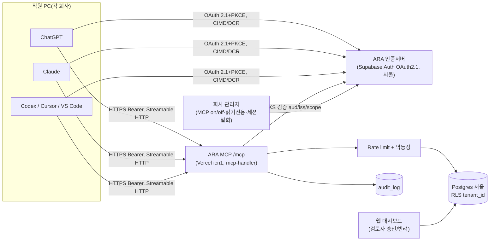

# ARA MCP 원격·멀티테넌트 전환 리서치

> 기준일 2026-10-01 · [00 방향 정리](./00_direction.md)의 모듈 ⑦(각자의 AI 연결, ARA MCP)에 대한 보강 조사 · 데이터 등급·국외이전은 [04 데이터 거버넌스](./04_data-governance.md)를 따릅니다.

> 표기: [n] = 하단 출처 번호. **(미검증)** = 1차 출처로 확인하지 못했거나 출처끼리 내용이 다른 항목.

## 1. 핵심 결론 (5줄)
1. 현재 MCP 최신 사양은 **2026-07-28 개정판**입니다. 원격 서버는 OAuth 2.1 리소스 서버로 동작하며, Protected Resource Metadata(RFC 9728) 제공과 토큰 audience 검증이 필수입니다. DCR은 **deprecated**되었고 CIMD가 권장 방식입니다 [1][2][3].
2. 다만 Claude는 AS가 CIMD 조건 두 가지를 모두 광고할 때만 CIMD를 쓰고 그 외에는 DCR로 폴백하며, VS Code는 DCR을 먼저 시도합니다. 따라서 v1의 인증 서버는 **CIMD와 DCR을 함께** 지원해야 합니다 [13][17].
3. 테넌트는 URL로 나누지 않고 **토큰 클레임(tenant_id, sub)**으로 결정합니다. 그 위에 DB 행 수준 보안(RLS)으로 한 번 더 막고, 접속 URL은 하나로 운영합니다 [5][6][38].
4. AI는 **'제출'까지만** 할 수 있게 하고, **'완료'는 웹 대시보드의 검토자만** 처리하게 합니다. 이는 Stripe의 '사람 승인 URL' 패턴과 OWASP LLM06(과도한 권한) 완화책에 해당합니다 [24][45].
5. 최소 스택은 Next.js+mcp-handler(Vercel 서울 icn1)에 Supabase(서울)의 OAuth 2.1 서버와 RLS를 조합하는 구성입니다. 단, 도구 결과는 해외 AI 사업자에게 전달되므로 국외 이전 고지를 검토해야 합니다 [33][34][38][39][47].

## 2. MCP 인증 표준 요약 (사양 2026-07-28)
- **역할**: MCP 서버 = OAuth 2.1 리소스 서버, 클라이언트 = OAuth 클라이언트입니다. AS는 별도 호스트에 둘 수 있습니다 [1].
- **필수 사항(MUST)**
  - 서버는 PRM(RFC 9728)을 구현합니다. 미인증 요청에는 `401` + `WWW-Authenticate: Bearer resource_metadata=…`로 응답합니다.
  - AS는 RFC 8414 또는 OIDC Discovery를 제공합니다.
  - 클라이언트는 인가·토큰 요청 모두에 `resource`(RFC 8707, 서버의 정규 URI)를 넣습니다.
  - 서버는 자신에게 발급된 토큰(audience)만 받고, 다른 토큰을 그대로 넘기는 것(passthrough)은 금지됩니다.
  - 토큰은 매 요청마다 `Authorization` 헤더로 보내며, 쿼리스트링에 넣는 것은 금지됩니다 [1].
- **클라이언트 등록 우선순위**: 사전등록 → CIMD(`client_id_metadata_document_supported`) → DCR(deprecated, 하위호환) → 사용자 수동 입력 [3].
- **스코프**: `WWW-Authenticate`의 `scope`로 최소 권한을 안내합니다. 권한이 부족하면 `403 insufficient_scope`로 단계적 상향(step-up)을 유도합니다. `scopes_supported`에는 기본 기능에 필요한 최소 집합만 넣습니다 [1][6].
- **신규 MUST(2026-07-28)**: 클라이언트는 인가 응답에 `iss`가 있으면 기록해 둔 issuer와 비교해야 합니다(RFC 9207). AS의 `iss` 포함은 SHOULD입니다 [1][2].
- **Streamable HTTP**
  - 단일 POST 엔드포인트(예: `/mcp`)를 씁니다. 세션(`Mcp-Session-Id`), `initialize` 핸드셰이크, GET 스트림은 제거되었고 **stateless**로 바뀌었습니다. 서버는 `server/discover`를 구현해야 합니다.
  - `MCP-Protocol-Version`·`Mcp-Method`·`Mcp-Name` 헤더가 필요하며, 서버는 헤더와 본문이 일치하는지 검증합니다.
  - 서버는 `Origin`을 검증합니다(값이 잘못되면 403).
  - SSE 재개(`Last-Event-ID`)가 제거되어, 응답 스트림이 끊기면 클라이언트가 같은 요청을 새로 다시 보냅니다. 즉 **쓰기 도구에는 멱등성 처리가 필요**합니다 [2][4].
- **하위호환**: 2025-11-25 이하 클라이언트와 공존하려면 해당 개정판의 동작도 함께 구현해야 합니다 [4]. Claude 개발 문서는 아직 2025-11-25 사양을 링크합니다 [13].

## 3. 클라이언트별 연결 방식
| 클라이언트 | 연결 | 인증·등록 | 플랜·관리자 조건 | 쓰기 확인 |
|---|---|---|---|---|
| ChatGPT | 개발자 모드 켜기 → Plugins에서 **+** → `/mcp`까지 포함한 공개 HTTPS URL 입력 [10] | OAuth(정적 자격증명/CIMD/DCR) [8]. CIMD 우선, redirect `https://chatgpt.com/connector_platform_oauth_redirect`. 툴별 `securitySchemes`와 `_meta["mcp/www_authenticate"]`가 있어야 로그인 UI가 뜸 [7] | 개발자 모드: Plus·Pro·Business·Enterprise·Edu [8]. 헬프센터는 "쓰기 포함 풀 MCP는 Business·Enterprise/Edu"라고 해 개발자 문서와 다름 **(미검증, 문서 간 불일치)** [9]. 워크스페이스 게시는 Admin/Owner만 [9] | `readOnlyHint`가 없으면 쓰기로 보고 기본 확인 [8] |
| Claude(웹·Desktop·모바일·Cowork) | Customize › Connectors › Add custom connector. Team/Enterprise는 Owner가 조직 설정에서 먼저 추가한 뒤 구성원이 각자 인증 [12] | DCR·CIMD 기본 지원. callback `https://claude.ai/api/mcp/auth_callback`. 401 필수, `authorization_servers`는 첫 항목만 사용. CIMD는 `client_id_metadata_document_supported`와 `none` 인증방식을 둘 다 광고해야 사용 [13] | Free는 커스텀 커넥터 1개 [12]. SSO 무동의 연결(EMA)은 Team/Enterprise [14]. 요청 IP 대역 `160.79.104.0/21` [13] | 디렉터리 기준: read-only는 확인 없이 실행, destructive는 항상 확인 [15]. "Allow always" 옵션 있음 [12] |
| Claude Code | `claude mcp add --transport http …` [24] | loopback redirect(포트 무관 매칭) [13] | – | – |
| Codex(CLI·IDE·앱) | `~/.codex/config.toml`의 `[mcp_servers.ara] url=…` → `codex mcp login ara` [11] | DCR·CIMD 지원, 서버가 광고한 스코프 우선 [11] | 플랜 제한 **(미검증)** | `default_tools_approval_mode`(auto/prompt/writes/approve), `enabled_tools`/`disabled_tools` [11] |
| Cursor | `mcp.json`에 `url` [16] | Static OAuth 또는 DCR. redirect `https://www.cursor.com/agents/mcp/oauth/callback`, `http://localhost:8787/callback` [16] | 엔터프라이즈 관리자가 URL 패턴 허용목록 지정 [16]. 플랜 **(미검증)** | 기본 승인 필요 [16] |
| VS Code(Copilot) | `mcp.json`에 `"type":"http"` [17] | DCR 우선, 안 되면 클라이언트 자격증명 입력. redirect `http://127.0.0.1:33418`, `https://vscode.dev/redirect` [17]. CIMD **(미검증)** | Copilot Business/Enterprise는 "MCP servers in Copilot" 정책(기본 꺼짐)을 켜야 함 [18] | `readOnlyHint`가 없는 툴은 확인 대화상자 표시 [17] |

## 4. 참고 구현 사례
| 서비스 | 엔드포인트·인증 | 권한·테넌트 범위 | 관리·감사 | ARA 시사점 |
|---|---|---|---|---|
| Linear | `mcp.linear.app/mcp`, OAuth 2.1+DCR, API 키 [19] | 기본 읽기·쓰기. `/mcp/readonly` 또는 `read` 스코프로 읽기 전용. 워크스페이스마다 인증 분리 [19] | Okta 기반 엔터프라이즈 인증 [19] | 읽기 전용 모드 제공 |
| Notion | OAuth, 사용자의 Notion 권한 전체를 그대로 사용 [20] | 사용자 권한 상속 [20] | Enterprise에서 MCP 클라이언트 승인·차단, 연결 이벤트 감사로그. 사용자별 사용 가시성은 아직 없음 [20] | 회사 관리자의 클라이언트 허용목록 |
| Asana | `mcp.asana.com/v2/mcp`, Streamable HTTP, OAuth. 구 SSE URL은 2026-05-11 종료 [21] | 사용자 권한 [21] | Enterprise+ 앱 관리에서 MCP 클라이언트 허용·차단 [21] | 구 전송 방식 종료 일정 공지 |
| Atlassian Rovo | OAuth 2.1/API 토큰 [22] | 기존 Jira·Confluence 권한 준수 [22] | 클라이언트 허용목록, MCP 사용 로그 [22]. 의도(Read/Write/Search)별 권한 **(2차 출처, 미검증)** | 쓰기 의도별 on/off |
| Sentry | `mcp.sentry.dev/mcp`, 모든 연결 OAuth [23] | URL 경로 `/{org}/{project}`로 범위 축소 [23] | – | 범위 축소 패턴 |
| Stripe | `mcp.stripe.com`, OAuth(환경별 권한)/Agent 키. 2026-10-31부터 Agent 태그 없는 키는 거부 [24] | 계정·환경 단위 [24] | 팀 전체 MCP on/off, OAuth 세션 조회·철회, 환불 등은 **사람 승인 URL → 승인 토큰(24시간 만료)**, Workbench에 툴 호출 로그 [24] | **'완료 승인' 설계의 직접 참고 사례** |
| GitHub | `api.githubcopilot.com/mcp/`, OAuth/PAT [25] | `X-MCP-Readonly`, `/readonly`, `X-MCP-Toolsets`. Lockdown은 "보안 경계가 아님" [25] | 조직 정책 [18] | 툴셋·읽기전용 토글 |
| Plaud | `npx` 설치 또는 HTTP, 브라우저 OAuth 로그인, **미국 호스팅** [26] | 7개 툴 대부분 읽기 [26] | – | ARA는 쓰기가 있으므로 Plaud보다 통제 강화 필요 |
| flow(마드라스체크) | ChatGPT·Claude 공식 앱 동시 등록(2026-09-17) [27] | "사용자가 플로우에서 볼 수 있는 범위 안에서만 조회" [27] | 인증 세부 **(미검증)** | 국내 경쟁사 기준선 |
| 두레이(NHN) | AI 에이전트 공개, MCP는 "지원 준비 중"(2026-04 기사) **(미검증)** [28] | – | – | – |
| 티로 | `mcp.tiro.ooo/mcp`, OAuth(대화형)/API 키(헤드리스) [29] | 읽기 위주, 팀·개인 폴더 구분 [29] | – | 국내 읽기형 레퍼런스 |

## 5. 호스팅·인증 스택 옵션
| 옵션 | MCP 인증 지원 | 한국 데이터 위치 | 평가 |
|---|---|---|---|
| Cloudflare Workers + `workers-oauth-provider` | OAuth 2.1 AS 내장, 사전등록·CIMD·DCR·PKCE, 토큰은 해시로만 저장, props 암호화 [30][31]. Stytch/Auth0/WorkOS 연동 [30] | Durable Objects 관할은 EU/US/FedRAMP뿐이고 한국은 없음 [32] | 인증 구현이 가장 빠름. 업무 데이터는 서울 DB에 분리 |
| Vercel + `mcp-handler` 2.x | `withMcpAuth`(401/403), `protectedResourceHandler`. **AS는 제공하지 않음** [33] | 함수 리전 `icn1`(서울) 지정 가능, 기본값은 `iad1` [34] | 대시보드와 같은 Next.js 앱에 통합 |
| Supabase Auth OAuth 2.1 서버 | DCR 지원, 동의 화면은 직접 구현, 기존 RLS가 MCP 토큰에도 적용, MAU 과금 [38]. CIMD **(미검증)** | `ap-northeast-2` 서울 [39] | **v1 권장 AS·DB** |
| AWS Bedrock AgentCore Gateway/Identity | JWT inbound(Cognito 등)에서 401/403 시 `resource_metadata`·`scope`를 자동 광고 [36]. Cognito의 DCR/CIMD 지원 **(미검증)** | Gateway·Identity 모두 서울 지원 [35] | 대기업·AWS 고객용 v2 |
| Azure API Management | REST API를 MCP로 노출하거나 기존 MCP를 프록시. JWT 검증·rate limit·IP 필터. tools만 지원 [37] | 리전 선택(서울 리전 지원 여부 **미검증**) | MS 고객 대응 |
| WorkOS / Auth0 / Stytch / Clerk | WorkOS: CIMD 기본, DCR 옵션 [40]. Auth0: CIMD 수동 등록 권장 [41]. Stytch [42]·Clerk [43]: CIMD·DCR **(검색 결과 기반, 미검증)** | 한국 리전 **(미검증)** | B2B SSO 요구가 생기면 검토 |

**한국 고려사항**: 개인정보 국외 이전은 개인정보 보호법 제28조의8의 요건(처리방침 공개 등)을 따라야 합니다 [47]. 서버를 서울에 두더라도 ChatGPT·Claude가 도구 결과를 받아 처리하므로, 고객 계약과 처리방침에 이를 고지해야 합니다 **(법률 검토 필요)** [10][13].

## 6. 보안 체크리스트
- [ ] `aud`가 정규 URI(`https://mcp.ara.example/mcp`)와 같은지, `iss`·`exp`·서명(JWKS)을 검증. 타 리소스 토큰은 거부하고 그대로 넘기지 않음 [1][6][7]
- [ ] **tenant_id·user_id는 토큰에서만** 가져오고 툴 인자로는 받지 않음. 쿼리마다 RLS 적용. 작업 ID는 불투명 값(UUID)으로 하고 매 호출 인가 검사("handle은 권한이 아님") [5][6]
- [ ] 스코프는 `read:tasks`/`write:progress`/`submit:results`로 분리. 와일드카드·전체 권한 스코프 금지. 권한 부족 시 403 `insufficient_scope` [1][6]
- [ ] 읽기와 쓰기 툴을 분리하고 annotation을 정확히 지정. 범용 API 툴 금지. 툴 설명에 행동 지시문을 넣지 않음 [15]
- [ ] `submit_result`는 상태를 **'검토 대기'로만** 바꿈. 승인·반려는 웹의 검토자 역할에서만 처리 [24][45]
- [ ] 프롬프트 인젝션 대응: 작업 본문과 제출물을 데이터로 취급하고, 출력 길이를 제한하며, 대시보드에서는 HTML을 이스케이프해 저장형 XSS를 막음 [44][46]
- [ ] 쓰기 툴에 `idempotency_key` 적용(스트림 재개가 없어 재전송이 발생함) [2]
- [ ] 사용자·테넌트·툴 단위 rate limit(사양상 MUST) [5]
- [ ] 감사로그: tenant, user, client_id, tool, 인자 해시, 결과, IP, correlation id를 기록하고 PII는 가림. 스코프 상향 이벤트도 기록 [6][44][46]
- [ ] AS: PKCE S256, redirect URI 정확 일치, 동의 화면에 클라이언트명·redirect 호스트 표시, CSRF 방지, `frame-ancestors` 설정, CIMD fetch 시 SSRF 차단, refresh 토큰 회전 [6][13]
- [ ] `Origin` 검증, 헤더·본문 불일치 거부, 토큰을 쿼리스트링에 두지 않음 [1][4]
- [ ] 사용자와 관리자가 OAuth 세션을 철회할 수 있고, 회사 단위 MCP 끄기·읽기전용 토글 제공 [19][24]

## 7. ARA MCP v1 권장 아키텍처
**데이터 모델**: `tenant`(회사) → `membership`(user, role ∈ owner·reviewer·member) → `task`(tenant_id, assignee_id) → `progress_log`·`submission`(status: submitted/approved/rejected) → `audit_log`(추가만 가능).

**OAuth 흐름**
1. 클라이언트가 `/mcp` 호출 → 401 + PRM 응답
2. PRM이 AS(`auth.ara`)를 안내
3. 클라이언트가 CIMD 또는 DCR로 등록
4. 사용자가 브라우저에서 ARA 계정으로 로그인하고, 소속 회사와 스코프에 동의
5. AS가 `sub`, `tenant_id`, `role`, `scope`, `aud`를 담은 1시간 JWT와 회전형 refresh 토큰 발급 [1][13]

| 툴 | scope | annotation | 규칙 |
|---|---|---|---|
| `list_my_tasks` | read:tasks | readOnlyHint | assignee는 항상 토큰의 sub |
| `get_task` | read:tasks | readOnlyHint | 다른 테넌트의 ID면 "not found" |
| `start_task` | write:progress | idempotentHint, destructiveHint=false | 본인 작업만 |
| `log_progress` | write:progress | destructiveHint=false | 길이 제한, 추가만 |
| `submit_result` | submit:results | destructiveHint=true(확인 유도) | idempotency_key, 상태 → 검토 대기 |
| `get_submission_status` | read:tasks | readOnlyHint | 검토 코멘트 반환 |

`tools/list`는 부여된 스코프에 맞춰 달라질 수 있습니다(사양상 MAY) [5].

**역할**
- owner: 결제, 구성원 초대, 회사 MCP 정책(끄기·읽기전용) 관리
- reviewer: 작업 생성과 승인·반려. **웹에서만** 가능
- member: MCP 툴 6개만 사용

**최소 스택**: Next.js 하나(대시보드와 `/mcp`를 같은 앱에) + `mcp-handler` + Supabase(서울: Auth OAuth 서버·Postgres·RLS) [33][34][38][39]. AS가 CIMD를 지원하지 않으면 DCR로 먼저 출시합니다. ChatGPT·Claude·Codex 모두 DCR을 지원합니다 [7][11][13].

**구현 메모**
- ChatGPT: 툴마다 `securitySchemes`(oauth2, scopes)를 선언하고, 인증 오류 응답에 `_meta["mcp/www_authenticate"]`를 넣어야 로그인 UI가 뜹니다 [7].
- Claude: AS의 discovery·token 엔드포인트는 10초, refresh는 30초 안에 응답해야 합니다. `/token`은 form-urlencoded로 받습니다 [13].
- 사양 버전: 2026-07-28과 2025-11-25를 함께 지원하는 것을 목표로 합니다. SDK가 버전을 자동 협상하는지는 **(미검증)**입니다 [4].
- 향후 디렉터리 등재: Claude 심사에는 테스트 계정과 공개 문서가 필요하고 [15], ChatGPT 게시에는 터널이 아닌 공개 HTTPS가 필요합니다 [10].

## 8. 출시 기준 테스트 (첫 판매 가능 릴리스)
1. 회사 A와 B의 관리자가 각각 가입하고, 검토자 1명과 직원 1명을 초대한 뒤 작업 3건씩 생성
2. A 직원은 PC1에서 Claude(Pro 커스텀 커넥터), B 직원은 PC2에서 ChatGPT(Business 개발자 모드)와 Codex(`codex mcp login`)로 연결. 각 연결이 OAuth 로그인만으로 끝나야 함 [8][11][12]
3. `list_my_tasks` 결과가 자기 작업 3건뿐인지 확인. A 직원이 B의 작업 ID로 `get_task`를 호출하면 not found가 나오고 감사로그에 기록
4. 다른 `aud`로 발급된 토큰, 만료 토큰, 쿼리스트링 토큰은 모두 401 [1]
5. `read:tasks`만 가진 토큰으로 `submit_result` 호출 시 403 `insufficient_scope` [1]
6. 클라이언트에서 쓰기 확인 프롬프트가 뜨는지 확인 [8][15]
7. 제출 후 10초 안에 해당 회사 검토자 대시보드에만 표시되고, 상대 회사 대시보드에는 0건
8. 같은 `idempotency_key`로 재전송하면 제출이 1건만 남음
9. 검토자 승인 후 `get_submission_status`가 approved를 반환. MCP로는 승인할 수 없음
10. 관리자가 세션을 철회하면 다음 호출이 401. 읽기전용으로 바꾸면 쓰기 툴이 목록에서 사라짐
11. 분당 한도를 넘기면 거부되고, MCP Inspector로 PRM·AS 메타데이터 검증을 통과 [33]

## 출처
[1] https://modelcontextprotocol.io/specification/2026-07-28/basic/authorization
[2] https://modelcontextprotocol.io/specification/2026-07-28/changelog
[3] https://modelcontextprotocol.io/specification/2026-07-28/basic/authorization/client-registration
[4] https://modelcontextprotocol.io/specification/2026-07-28/basic/transports/streamable-http
[5] https://modelcontextprotocol.io/specification/2026-07-28/server/tools
[6] https://modelcontextprotocol.io/docs/tutorials/security/security_best_practices
[7] https://developers.openai.com/apps-sdk/build/auth
[8] https://developers.openai.com/api/docs/guides/developer-mode
[9] https://help.openai.com/en/articles/12584461 (직접 조회 403, 검색 스니펫 기반)
[10] https://developers.openai.com/apps-sdk/deploy/connect-chatgpt
[11] https://learn.chatgpt.com/docs/extend/mcp?surface=cli
[12] https://support.claude.com/en/articles/11175166-get-started-with-custom-connectors-using-remote-mcp
[13] https://claude.com/docs/connectors/building/authentication
[14] https://claude.com/docs/connectors/building/enterprise-managed-auth
[15] https://claude.com/docs/connectors/building/review-criteria
[16] https://cursor.com/docs/context/mcp
[17] https://code.visualstudio.com/api/extension-guides/ai/mcp
[18] https://docs.github.com/en/copilot/concepts/context/mcp
[19] https://linear.app/docs/mcp
[20] https://www.notion.com/help/notion-mcp , https://developers.notion.com/docs/mcp
[21] https://developers.asana.com/docs/using-asanas-mcp-server
[22] https://www.atlassian.com/blog/announcements/atlassian-rovo-mcp-ga
[23] https://mcp.sentry.dev/
[24] https://docs.stripe.com/mcp
[25] https://github.com/github/github-mcp-server/blob/main/docs/remote-server.md
[26] https://docs.plaud.ai/documentation/plaud_app/mcp
[27] https://byline.network/2026/09/17-600/
[28] https://byline.network/2026/04/429-2/ (검색 요약 기반)
[29] https://docs.tiro.ooo/en/developers/mcp/mcp-overview.md
[30] https://developers.cloudflare.com/agents/model-context-protocol/authorization/
[31] https://github.com/cloudflare/workers-oauth-provider
[32] https://developers.cloudflare.com/durable-objects/reference/data-location/
[33] https://vercel.com/docs/mcp/deploy-mcp-servers-to-vercel
[34] https://vercel.com/docs/regions
[35] https://docs.aws.amazon.com/bedrock-agentcore/latest/devguide/agentcore-regions.html
[36] https://docs.aws.amazon.com/bedrock-agentcore/latest/devguide/gateway-inbound-auth.html
[37] https://learn.microsoft.com/en-us/azure/api-management/mcp-server-overview
[38] https://supabase.com/docs/guides/auth/oauth-server/mcp-authentication
[39] https://supabase.com/docs/guides/platform/regions
[40] https://workos.com/docs/authkit/mcp
[41] https://auth0.com/ai/docs/mcp/guides/registering-your-mcp-client-application
[42] https://stytch.com/blog/stytch-supports-cimd/ (검색 결과)
[43] https://clerk.com/docs/nextjs/mcp/build-mcp-server (검색 결과)
[44] https://owasp.org/www-project-mcp-top-10/
[45] https://genai.owasp.org/llmrisk/llm062025-excessive-agency/
[46] https://developers.openai.com/apps-sdk/guides/security-privacy
[47] https://www.law.go.kr/법령/개인정보보호법/제28조의8 , https://shinkim.com/kor/media/newsletter/2452 (검색 요약 기반)
