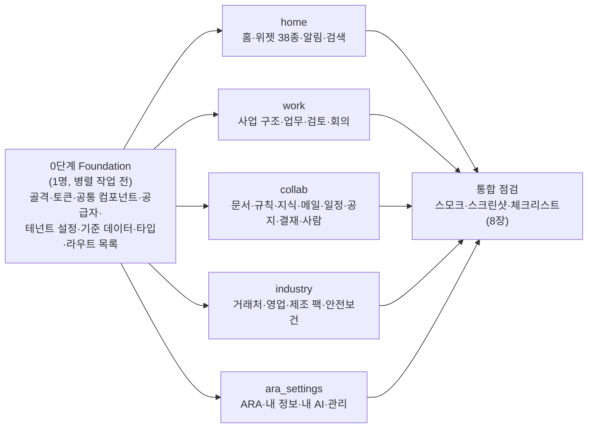

# 00. 공통 업무사이트 뼈대 빌드 스펙

> 기준일 2026-10-02 · 상태: **개발 착수용 v1.0** · 앱 위치: `apps/worksite` · 데모 테넌트: `crata-demo`(CRATA 자신), `tr-technology`(첫 고객 (주)티알테크놀러지)
>
> **이 문서는 뼈대 구현의 정본입니다.** 조사·근거는 아래 문서에 있고, 이 문서는 그 결론을 개발자 5명이 동시에 만들 수 있는 수준으로 묶었습니다. 앞 문서와 다른 곳은 0.4절에 모아 두었고, 다르면 이 문서를 따릅니다.
>
> | 문서 | 이 문서에서 가져온 것 |
> |---|---|
> | [research/00 방향](../research/00_direction.md) | 제품 정의, 모듈 ①~⑧, 첫 판매 기준(검토자만 완료, 복지 분리, 테넌트 분리) |
> | [01 디자인 레퍼런스](./01_design-references.md) | 화면 골격, 색·타이포·간격·라운드, 'AI 티' 체크리스트, 컴포넌트 초안 |
> | [02 공통 모듈](./02_common-modules.md) + [`config/worksite_modules.yaml`](../../config/worksite_modules.yaml) | 모듈 id·엔티티 필드·권한·메뉴·하단 탭·홈 위젯·프리셋 |
> | [03 티알테크놀러지](./03_tr-technology.md) + [`clients/tr-technology/company_profile.yaml`](../../clients/tr-technology/company_profile.yaml) | 제조 팩 화면·엔티티·KPI, 역할별 홈, 데모 데이터(가상 거래처·품번·설비·시나리오) |
> | [05 기술 스택](./05_tech-stack.md) | 패키지 버전, Refine 사용 범위, 메모리 공급자, 권한·감사·i18n·테마 구현 방식, 폴더 구조 |
>
> **꼭 지킬 것(요약):** 실존 인물 이름 금지 · 실존 회사에 대한 사실을 지어내지 않음(TR은 공개 자료만) · 제3자 이미지(레퍼런스 캡처, TR 로고) 커밋 금지 · 모든 UI 문구는 한국어 · 예시 데이터는 늘 '예시 데이터' 표시.

---

## 0. 읽는 법

### 0.1 한 줄 요약

모든 회사가 같이 쓰는 업무사이트 뼈대 하나를 만들고, 회사별 차이는 `TenantConfig` 데이터로만 줍니다. 이번 빌드는 **백엔드 없는 정적 데모**(해시 라우팅 + 메모리 데이터 공급자)이고, 두 테넌트(CRATA 기본 틸, 티알 네이비)를 머리의 전환기로 오가며 **63개 화면**이 모두 예시 데이터로 동작해야 합니다.

### 0.2 용어

| 용어 | 뜻 |
|---|---|
| 테넌트 | 회사 하나. `slug`로 구분(`crata-demo`, `tr-technology`). 데이터 칸막이는 `tenantId` |
| 플랫폼 역할 | 권한 단위 4개: `owner` 소유자 · `admin` 관리자 · `reviewer` 검토자 · `member` 구성원 |
| 역할코드 | 회사 안의 자리(예: `R_PLANT_MGR` 공장장). 플랫폼 역할 1개와 소속 단위 1개를 정함 |
| 페르소나 | 데모에서 "누구로 보기"로 고르는 사람. 역할코드마다 1명 |
| 그룹 | 개발 분담 단위 5개: `home` · `work` · `collab` · `industry` · `ara_settings` |
| 깊이 | 화면 완성 수준. **A 완성형**(표시 + 쓰기 동작 + 로딩·빈·오류·권한 상태 + 모바일 배치) · **B 목록형**(목록·필터·상세 서랍 + 동작 1~2개) · **C 안내형**(읽기 전용, 설명 + 예시 행) |
| 기준 데이터 | 여러 그룹이 함께 참조하는 행(조직·사람·사업 구조·거래처). Foundation이 고정 ID로 만듦 |
| 앵커 | 그룹끼리 서로 링크하는 시나리오 행. ID를 이 문서가 미리 정함(6.3절) |

### 0.3 작업 순서와 분담



| 단계 | 누가 | 끝난 기준 |
|---|---|---|
| 0 Foundation | 1명(또는 오케스트레이터) | 7.2절 체크리스트 전부. 63개 라우트가 모두 '준비 중' 화면으로 열리고 스모크 테스트가 돈다 |
| 1 그룹 병렬 | 5명 | 각자 맡은 `src/pages/<dir>/`, 시드, 셀렉터만 고침(7.3절). 8.8절 그룹별 완료 정의 |
| 2 통합 | Foundation 담당 | 8장 전체 통과, 스크린샷 리뷰 |

### 0.4 앞 문서와 달라진 점 (이 문서가 정함)

| 항목 | 앞 문서 | 이 문서 결정 | 이유 |
|---|---|---|---|
| CRATA 테넌트 slug | 05: `crata` | **`crata-demo`** (tenantId도 `crata-demo`) | 작업 지시. 데모임을 이름에 드러냄 |
| 좌측 메뉴 | 01: 7개(문서·양식/지식 분리, 연결·설정) | **레지스트리 9개 그대로**: 홈 / 내 업무 / 프로젝트 / 회의 / 문서·지식 / 업종 팩 / 회사 / ARA / 관리 | 기계가 읽는 정본은 레지스트리. 01 안은 모듈 수가 늘기 전 초안 |
| 모바일 하단 탭 | 01: 홈·내 업무·회의·ARA·전체 | **레지스트리**: 홈·내 업무·회의(제조: 현장 등록)·알림·전체 | 같은 이유. ARA는 '전체'와 홈 위젯으로 진입 |
| `control-line` 색 | 01: #8A92A5 / #7E9896 | **#80889B / #738C8A** | 01 값은 패널(#F3F5FB 등) 위에서 2.86:1로 비텍스트 3:1에 못 미침. 새 값은 흰 바탕 3.55/3.59, 패널 3.26/3.30(직접 계산) |
| 상태색 | 01: 성공·경고·위험 3단계 | **dataviz 4단계 good·warning·serious·critical + info·neutral** | 작업 지시와 dataviz 고정 상태 팔레트. serious 배지 색은 새로 계산(4.1절) |
| 감사 로그 행위자 값 | 02: `ai_mcp` | **`ai_connection`** | 05와 `via` 값에 맞춤 |
| CommandMenu | 01: `@refinedev/kbar` | **직접 구현**(antd `Modal` + 목록) | 05: kbar peer 경고 |
| 데모 저장 | 05: 메모리만(새로고침하면 초기화) | **메모리 + 변경분을 localStorage에 저장(끌 수 있음) + '데모 초기화' 버튼** | 작업 지시. 시연 중 새로고침해도 승인 결과가 남아야 함(5.5절) |
| 홈 히어로 | 01: '오늘 할 일' 히어로 / 02: 프리셋은 위젯 목록만 정함 | **`greeting` 위젯 = 인사말 머리 + '오늘 할 일' 히어로 카드** | 프리셋이 무엇이든 홈 히어로가 정확히 1장이 되게 함 |
| 페이지 폴더 | 05: `pages/<module-id>/` | **`pages/<dir>/` 페이지마다 1개**(2.7절 표) | 병렬 작업 시 파일 충돌 방지. 라우트는 `import.meta.glob`으로 자동 연결(7.3절) |
| 결재·메일 연결 | 레지스트리 기본값 꺼짐 | **두 데모 테넌트에서 켬**(화면에 '연동 미리보기' 표시) | 작업 지시(결재·메일 미리보기 화면 포함). 실제 연동은 하지 않음 |

---

## 1. 범위

### 1.1 이번에 만드는 것

| 영역 | 내용 | 모듈(레지스트리 id) |
|---|---|---|
| P0 공통 코어 14개 | 홈, 구성원·조직도, 회사 소개, 사업·프로젝트·파트, 업무·검토, 회의, 산출물·양식, 공지, 알림, 검색, 내 AI 연결, 구성원·권한, 회사 설정, 감사 로그 | `home-dashboard` `org-members` `company-info` `business-structure` `tasks` `meetings` `documents` `notices` `notifications` `search` `ai-connect` `admin-members` `admin-settings` `audit-log` |
| P1 중 화면이 있는 것 | 거래처·담당자, 일정, 결재(연동 미리보기), 지식·용어집, 작성 규칙, 메일 제안(연동 미리보기), ARA 복지, 안전보건 | `partners` `calendar` `approvals` `knowledge` `correction-rules` `mail-connector` `ara-wellbeing` `safety-health` |
| 제조업 팩(TR) | 생산·품질 홈, 현장 등록, 수주·납품, 생산, 설비 현황판, 품질, 클레임·8D, 설비, 자재·재고, LOT 추적, 기준정보 | `mfg-master-data` `mfg-orders` `mfg-production` `mfg-quality` `mfg-equipment` `mfg-materials` |
| CRM 라이트(사용자 다이어그램의 Sales Pipeline) | 거래처(Companies)·담당자(Contacts)는 두 테넌트 공통, 영업 파이프라인·견적(Quotes)은 CRATA | `partners`, `edu-sales` |
| 설정·ARA | Company DNA, 모듈 켜기·끄기, 브랜드·테마, AI 연결 정책, 데이터 등급·권한, 구성원·역할, 감사 로그 / ARA 홈·코칭·개인정보 안내 | `admin-settings` `ai-connect` `admin-members` `audit-log` `ara-wellbeing` |
| 데모 장치 | 테넌트 전환, "누구로 보기", 예시 데이터 표시, 데모 초기화 | (공통 기반) |

### 1.2 만들지 않는 것

- 레지스트리 `excluded` 9개(메신저, 메일 앱, 드라이브, 에디터·위키 엔진, STT, 전자결재 엔진, 인사·급여·근태 계산, 회계·ERP, 사내 통합검색).
- 실제 로그인·서버·DB·외부 연동(Supabase, MCP 서버, 메일 OAuth, 그룹웨어). 화면과 데이터 계약만 2단계와 같게 둡니다(05 문서 2장).
- 화면이 없는 모듈: `reports`, `integrations`, `attendance-leave`, `training-records`, `surveys`, `resource-booking`, `help-updates`, `data-export`, `billing`, `edu-programs`. 메뉴에 나오지 않습니다. 이 모듈을 쓰는 홈 위젯은 데이터만 보여 주고 '더보기' 링크를 두지 않습니다.
- 다크 모드, 위젯 배치 편집, 끌어놓기(칸반은 버튼·메뉴로 이동), 실제 사진 업로드(현장 등록 사진은 이름만 남김), 실제 AI 호출(ARA 코칭은 정해 둔 예시 답변).

### 1.3 두 테넌트

| | `crata-demo` | `tr-technology` |
|---|---|---|
| 회사 | CRATA(내부 적용 가안) | 주식회사 티알테크놀러지(첫 고객, 데모 칸막이 `tr-technology-demo`) |
| 표시명·모노그램 | "CRATA" · `CR` | "티알테크놀러지" · `TR`(로고 이미지 쓰지 않음) |
| 브랜드 씨앗 | 딥 틸 `#0B6E69`(가안, 보라 아님) / 차트 강조 `#00897B` | 네이비 `#2D3C67`(공개 홈페이지 로고 색 근사) / 차트 강조 `#3A5BA8` |
| 업종 팩 | `education_consulting`(메뉴 이름 "영업·교육") | `manufacturing`(메뉴 이름 "생산·품질") |
| 사업 구조 | 강의·워크샵(EDU) / 학맞통(SSI) / 아라 개발(ARA) / 공통(CORE). 코드는 `config/meeting_taxonomy.yaml` | 양산·납품 / 신규 품목 개발 / 품질 개선 / 안전보건 / AX 업무사이트(가설, 03 문서 5.9절) |
| 사람 | 누가 봐도 가상인 이름 7명(6.2절) | 역할 표시명만(예: "공장장(예시)"), 03 문서 10.5절 |
| 데이터 원칙 | **학생 데이터 없음.** 학맞통은 기관·연수·정책 업무만, 학생 이름·학년·반·상담 내용(L3)은 어떤 시드에도 넣지 않음 | 공개 자료(조직 단위, 제품 카테고리, 공정, 설비 종류·대수)만 사실로 쓰고 나머지는 모두 예시 |
| 데모 '오늘' | 2026-09-30(수) | 2026-09-30(수) |

- 두 테넌트 모두 `isDemo: true`입니다. 머리의 **테넌트 전환기**와 **누구로 보기**는 `isDemo` 테넌트에서만 보입니다.
- 주소는 `index.html?tenant=tr-technology&as=R_PLANT_MGR#/ops` 형식입니다(쿼리는 해시 앞). 전환하면 쿼리를 바꾸고 새로고침해 공급자·캐시를 새로 만듭니다(05 문서 4.5절).

---

## 2. 정보 구조(IA)

### 2.1 앱 골격

```
넓은 데스크톱(≥1440)
+------------+----------------------------------------------------------+-------------+
| SideNav    | TopBar 64: [회사 ▾][누구로 보기 ▾]      [검색 Ctrl K][AI 연결 2][종][사용자] [예시 데이터] |
| 240 흰 바탕 +----------------------------------------------------+-------------+
| [TR] 티알… |  Panel(틴트, 라운드 28, 안쪽 32)                    | RightRail   |
|            |  PageHeader: 제목/인사말 · 기간 [이번 주|이번 달]     | 320, 홈만   |
| 홈         |  +-----------------------+------------------------+ | 오늘        |
| 내 업무    |  | (콘텐츠 12열, 간격 24, 최대 1200)               | | ·필독 공지  |
|  · 업무 보드|  |                                                | | ·오늘 일정  |
| 프로젝트   |  +------------------------------------------------+ | ·다가오는 회의|
| 회의       |                                                     |             |
| 문서·지식  |                                                     |             |
| 생산·품질  |                                                     |             |
| 회사       |                                                     |             |
| ---------- |                                                     |             |
| ARA (자물쇠) 나만 보여요                            |             |
| 관리       |                                                     |             |
+------------+----------------------------------------------------+-------------+

데스크톱(1280~1439): 위와 같고 RightRail 없음(레일 내용은 홈 본문의 '오늘' 카드로)
태블릿(768~1279):   SideNav 대신 NavRail 80(아이콘 + 글자 13), 콘텐츠 8열·간격 20, 패널 안쪽 24
모바일(≤767)
+------------------------------+
| TopBar 56: [TR] 티알… [예시 데이터] (검색)(종)(사용자) |
+------------------------------+
| 패널 틴트가 화면 전체 바탕   |
| PageHeader                   |
| 카드 1열, 좌우 16, 간격 16   |
+------------------------------+
| 홈 · 내 업무 · 현장 등록 · 알림 · 전체 |  MobileTabBar 64 + 안전 영역
+------------------------------+
```

- 앱 바탕은 흰색(`surface`), SideNav·TopBar·RightRail은 흰 바탕 위에 둡니다. **패널만 틴트**(`panel`)이고 위·오른쪽·아래 16px 띄운 둥근 면입니다. 카드는 패널 위의 흰 면입니다(01 문서 6.1절).
- 모바일에서는 패널 라운드를 없애고 화면 전체를 틴트로 칠합니다. 카드는 흰 면 그대로입니다.
- 패널 안 최대 폭 1,200px, 왼쪽 정렬. 본문 문단은 한 줄 80자 미만.

### 2.2 좌측 메뉴

최상위 순서와 아이콘은 레지스트리 `nav_groups`를 따르고, 하위 항목은 이 표가 정합니다. 하위 항목은 아이콘 없이 점 불릿, 활성 그룹만 펼칩니다. 소제목(`[현장]` 등)은 `caption` 크기 `muted` 글자입니다.

| # | 그룹 id | 이름 | 아이콘 | 그룹 경로 | 하위 항목 (경로) | 보이는 역할 |
|---|---|---|---|---|---|---|
| 1 | home | 홈 | HomeOutlined | `/` | — | 전원 |
| 2 | work | 내 업무 | CheckSquareOutlined | `/work` | 내 업무 `/work`(급한 내 업무 배지: 기한 지남·오늘 마감·수정 요청) · 업무 보드 `/work/board` · 검토함 `/work/review`(내가 검토자인 검토 대기 수 배지) · 메일 제안 `/work/mail` | 검토함은 owner·admin·reviewer. 모바일 '내 업무' 탭 배지 = 급한 내 업무 + 내가 검토할 제출(스크린리더는 둘을 나눠 읽음) |
| 3 | projects | 프로젝트(**TR: 사업·거래처**) | ProjectOutlined | `/projects` | 사업·프로젝트 `/projects` · 거래처 `/projects/partners` · 담당자 `/projects/contacts` | 전원 |
| 4 | meetings | 회의 | TeamOutlined | `/meetings` | 회의 목록 `/meetings` · 분류 확인 `/meetings/inbox`(확인 대기 수 배지) · 결정 모음 `/meetings/decisions` | 분류 확인은 owner·admin·reviewer |
| 5 | docs | 문서·지식 | FileTextOutlined | `/docs` | 산출물 `/docs` · 양식 `/docs/templates` · 작성 규칙 `/docs/rules` · 지식 `/docs/knowledge` · 용어집 `/docs/glossary` | 전원 |
| 6 | industry | **TR: 생산·품질** | BuildOutlined | `/ops` | [현장] 생산·품질 홈 `/ops` · 현장 등록 `/ops/report` · [품질] 품질 현황 `/ops/quality` · 클레임·8D `/ops/quality/claims` · LOT 추적 `/ops/trace` · [생산·설비] 생산 `/ops/production` · 설비 현황판 `/ops/production/board` · 설비 `/ops/equipment` · [물류·기준] 수주·납품 `/ops/orders` · 자재·재고 `/ops/materials` · 기준정보 `/ops/master` · 거래처 `/projects/partners`(바로가기, 리뷰 2차) | 전원 |
| 6 | industry | **CRATA: 영업·교육** | BuildOutlined | `/ops` → `/ops/sales` | 영업 파이프라인 `/ops/sales` · 견적 `/ops/sales/quotes` | 전원 |
| 7 | company | 회사 | BankOutlined | `/company` → `/company/notices` | [소통] 공지 `/company/notices` · 일정 `/company/calendar` · [사람] 구성원 `/company/people` · 조직도 `/company/org` · 회사 소개 `/company/about` · [운영] 결재 `/company/approvals` · 안전보건 `/company/safety`(TR만) | 전원 |
| — | (구분선) | | | | | |
| 8 | ara | ARA | HeartOutlined | `/ara` | 이름 아래 LockOutlined + "일하는 방식 코치 · 나만 보여요"(caption, 리뷰 2차). 하위 항목 없음 | 전원 |
| 9 | admin | 관리 | SettingOutlined | `/admin` → `/admin/settings` | 회사 설정 `/admin/settings`(메뉴는 한 줄로 짧게, 화면 제목은 "회사 설정(Company DNA)") · 모듈 `/admin/modules` · 브랜드·테마 `/admin/theme` · AI 연결 정책 `/admin/ai-policy` · 데이터 등급·권한 `/admin/data` · 구성원·역할 `/admin/members` · 감사 로그 `/admin/audit` | owner·admin |

- 최상위는 owner·admin 9개, reviewer·member 8개입니다(레지스트리 규칙 9개 이하).
- 메뉴 항목은 **모듈이 켜져 있고 `list` 권한이 있을 때만** 보입니다(`buildNav`). 메뉴 라벨은 `TenantConfig.nav.labels`로만 바꿉니다. 순서·구조는 바꾸지 않습니다. 예외(리뷰 2차): 제조 팩의 [물류·기준]에 거래처 바로가기 한 줄(`alias`, 활성 판단에서 빠지고 원래 그룹이 켜짐) — 작은 제조사는 수주·납품과 거래처를 한 메뉴에서 찾아요.
- 접기: 1280 이상에서 SideNav 위쪽 버튼으로 72px(아이콘만 + 툴팁)으로 접습니다. 접힌 상태는 localStorage 편의 값입니다.
- 활성 항목: `brand-weak` 바탕 + `brand` 글자 + 굵기 700(하위 항목은 600) + `aria-current="page"`. 색만으로 표시하지 않도록 활성 항목 왼쪽에 3px `brand` 막대를 둡니다(라운드 2). 하위 항목이 켜지면 그룹 줄은 `brand` 글자·아이콘만 남기고 바탕·막대는 하위 항목 하나에만 둡니다(두 줄이 같이 칠해지지 않게, 리뷰 2차).
- 배지 숫자는 `ink` 바탕 흰 글자 알약(최소 20px), 99 넘으면 "99+". 0이면 숨김.

### 2.3 모바일 하단 탭

| 테넌트 | 탭(왼쪽부터) |
|---|---|
| 기본(`crata-demo`) | 홈 `/` · 내 업무 `/work` · 회의 `/meetings` · 알림 `/notifications` · 전체 `/more` |
| 제조(`tr-technology`) | 홈 `/` · 내 업무 `/work` · **현장 등록** `/ops/report` · 알림 `/notifications` · 전체 `/more` |

- 아이콘 22px + 글자 13, 늘 함께 표시합니다. 안 켜진 탭은 `muted` 400, 활성 탭은 `brand` 색 + 굵기 700 + 아이콘 뒤 `brand-weak` 알약(56×32) + 위쪽 2px 막대(색만으로 구분하지 않음). 네 탭에 없는 화면(생산·품질·회사·관리 등)은 '전체' 탭이 켜집니다(리뷰 2차).
- '내 업무' 탭에는 검토자에게 검토 대기 수, '알림' 탭에는 안 읽은 알림 수 배지를 붙입니다.
- '전체'(`/more`)는 2.2절 메뉴 전체 + 사용자 영역(테넌트·인물 전환, AI 연결 상태, 데모 초기화)을 보여 주는 화면입니다(H-05).
- 탭 바가 있는 화면은 본문 아래 여백을 `64 + env(safe-area-inset-bottom)`만큼 둡니다. 바텀시트·서랍의 고정 버튼(BottomCTA)은 탭 바 위에 뜹니다.

### 2.4 상단 바(TopBar)

| 위치 | 요소 | 동작 | 모바일 |
|---|---|---|---|
| 왼쪽 | `TenantSwitcher` "회사" 선택(데모만) | 고르면 `?tenant=` 바꾸고 새로고침. 옵션: "CRATA(예시)", "티알테크놀러지(예시)" | 사용자 시트 안으로 |
| 왼쪽 | `PersonaSwitcher` "누구로 보기"(데모만) | 페르소나 목록(표시명 · 역할 이름 · 소속). 고르면 `?as=` 바꾸고 새로고침 | 사용자 시트 안으로 |
| 오른쪽 | 검색 버튼(입력칸 모양, "검색" + `Ctrl K` 표시) | 누르거나 Ctrl/Cmd+K → `CommandMenu`. Enter → `/search?q=` | 아이콘 버튼(SearchOutlined) |
| 오른쪽 | AI 연결 상태 칩 | 내 연결 수에 따라 "AI 연결 2"(good, ApiOutlined) / "AI 연결 전"(neutral) / "회사에서 AI 연결을 꺼 두었어요"(neutral, 정책 꺼짐). 누르면 `/me/ai` | 사용자 시트 안으로 |
| 오른쪽 | 알림 종(BellOutlined) + 안 읽은 수 | 누르면 팝오버(최근 5건 + "모두 보기" → `/notifications`) | 아이콘 → `/notifications` |
| 오른쪽 | 사용자 메뉴(이니셜 원 + 표시명) | 내 정보 `/me` · 내 AI 연결 `/me/ai` · 알림 설정 `/me/notifications` · 변경 내용 이 브라우저에 저장(스위치) · 데모 초기화(확인 대화상자) · 데모 시작 화면 `/login` | 이니셜 원 → 사용자 시트 |
| 맨 오른쪽 | `DemoDataBadge`(topbar 변형) | 늘 보임. 툴팁 "실제 회사 값이 아닌 예시예요" | 회사명 옆에 늘 보임 |

- TopBar는 스크롤해도 고정되고, 스크롤되면 아래에 1px `line`이 생깁니다. 아이콘만 있는 버튼은 `aria-label`과 툴팁을 둡니다.
- 첫 Tab은 `SkipLink`("본문으로 건너뛰기")입니다.

### 2.5 오른쪽 레일(RightRail) 규칙

1. **홈(`/`)에서만, 1440px 이상에서만** 보입니다. 다른 화면은 레일 없이 패널이 넓어집니다.
2. 블록 3개, 이 순서: **필독 공지**(안 읽은 필독 최대 1건) · **오늘 일정**(오늘 `calendar_events` + 오늘 회의, 최대 3건) · **다가오는 회의**(내일 이후 7일, 최대 3건).
3. 블록은 카드가 아닙니다. 흰 바탕 위 소제목(`title-card`) + `ListRow` + 1px 구분선입니다(카드 안 카드 방지, 01 문서 2.3절).
4. 항목이 없는 블록은 숨기고, 셋 다 비면 레일 전체를 숨깁니다(네이버웍스 Today 방식).
5. 1440 미만에서는 같은 내용이 홈 본문의 '오늘' 카드 1장(`SectionCard`, 크기 M)으로 들어가, 히어로 줄 바로 다음에 놓입니다. 이 카드도 비면 숨깁니다.
6. 레일 맨 위에는 아무것도 두지 않습니다(사용자·알림은 TopBar에 있음). 추천 콘텐츠·썸네일은 두지 않습니다.

### 2.6 라우팅 규칙

- `HashRouter` + `vite base "./"`(05 문서 3.2절). 경로는 2.7절 표가 정본입니다.
- **목록 상태는 URL에 남깁니다.** 필터·정렬·페이지(`syncWithLocation`), 탭(`?tab=`), 보기 전환(`?view=board`), 열린 서랍(`?selected=<id>`), 기간(`?period=week|month|quarter`).
- 같은 단계의 하위 화면은 `PageHeader.tabs`(링크 탭)로 오갑니다(예: 안전보건 현황 · 위험성평가 · 반기 점검).
- 리디렉션: `/admin` → `/admin/settings`, `/company` → `/company/notices`, CRATA의 `/ops` → `/ops/sales`, 데스크톱(≥768)의 `/more` → `/`.
- 모든 페이지는 `PageGuard`로 감쌉니다. `PageGuard`는 막을 때도 `PageHeader`(페이지 이름, h1)를 먼저 그립니다. 순서: 모듈이 꺼져 있으면 `EmptyState kind="module_off"`("이 회사에서는 쓰지 않는 기능이에요" + 홈으로), `list` 권한이 없으면 `kind="forbidden"`("볼 수 있는 권한이 없어요. 관리자에게 문의해 주세요"). 리디렉션하지 않고 그 자리에서 보여 줍니다(스모크 테스트가 모든 경로를 열 수 있게).
- 다른 테넌트의 id로 상세 경로를 열면 공급자가 404를 내고, 화면은 `EmptyState kind="not_found"`("찾는 항목이 없어요")를 보여 줍니다.
- 정적 경로가 매개변수 경로보다 우선합니다(React Router 규칙). 그래서 `projects`·`partners`·`contacts`·`inbox`·`decisions`·`board`·`claims` 같은 단어는 id로 쓰지 않습니다(id는 접두어 규칙 5.6절).

### 2.7 전체 페이지 목록 (63개)

`dir`은 `apps/worksite/src/pages/<dir>/index.tsx`입니다. 테넌트 열의 "둘 다"가 아닌 화면은 다른 테넌트에서 `module_off` 상태로 열립니다.

| ID | 경로 | 이름 | dir | 그룹 | 모듈 | 테넌트 | 깊이 |
|---|---|---|---|---|---|---|---|
| H-01 | `/` | 홈 | `home` | home | home-dashboard | 둘 다 | A |
| H-02 | `/notifications` | 알림 | `notifications` | home | notifications | 둘 다 | A |
| H-03 | `/me/notifications` | 알림 설정 | `notification-settings` | home | notifications | 둘 다 | B |
| H-04 | `/search` | 검색 | `search` | home | search | 둘 다 | A |
| H-05 | `/more` | 전체 메뉴 | `more` | home | home-dashboard | 둘 다(모바일) | B |
| H-06 | `/login` | 데모 시작 | `login` | home | home-dashboard | 둘 다 | B |
| H-07 | `*` | 찾을 수 없음 | `not-found` | home | home-dashboard | 둘 다 | C |
| W-01 | `/projects` | 사업·프로젝트 | `projects` | work | business-structure | 둘 다 | A |
| W-02 | `/projects/:projectId` | 프로젝트 상세 | `project-detail` | work | business-structure | 둘 다 | A |
| W-03 | `/work` | 내 업무 | `work-list` | work | tasks | 둘 다 | A |
| W-04 | `/work/board` | 업무 보드 | `work-board` | work | tasks | 둘 다 | A |
| W-05 | `/work/review` | 검토함 | `work-review` | work | tasks | 둘 다 | A |
| W-06 | `/work/tasks/:taskId` | 업무 상세 | `task-detail` | work | tasks | 둘 다 | A |
| W-07 | `/meetings` | 회의 | `meetings` | work | meetings | 둘 다 | A |
| W-08 | `/meetings/:meetingId` | 회의 상세 | `meeting-detail` | work | meetings | 둘 다 | A |
| W-09 | `/meetings/inbox` | 분류 확인 | `meeting-inbox` | work | meetings | 둘 다 | A |
| W-10 | `/meetings/decisions` | 결정 모음 | `decisions` | work | meetings | 둘 다 | B |
| C-01 | `/docs` | 산출물 | `docs` | collab | documents | 둘 다 | A |
| C-02 | `/docs/artifacts/:artifactId` | 산출물 상세 | `artifact-detail` | collab | documents | 둘 다 | A |
| C-03 | `/docs/templates` | 양식 | `templates` | collab | documents | 둘 다 | B |
| C-04 | `/docs/rules` | 작성 규칙 | `correction-rules` | collab | correction-rules | 둘 다 | A |
| C-05 | `/docs/knowledge` | 지식 | `knowledge` | collab | knowledge | 둘 다 | B |
| C-06 | `/docs/glossary` | 용어집 | `glossary` | collab | knowledge | 둘 다 | B |
| C-07 | `/work/mail` | 메일 제안 | `mail-inbox` | collab | mail-connector | 둘 다 | B |
| C-08 | `/company/notices` | 공지 | `notices` | collab | notices | 둘 다 | A |
| C-09 | `/company/notices/:noticeId` | 공지 상세 | `notice-detail` | collab | notices | 둘 다 | A |
| C-10 | `/company/calendar` | 일정 | `calendar` | collab | calendar | 둘 다 | B |
| C-11 | `/company/approvals` | 결재 | `approvals` | collab | approvals | 둘 다 | B |
| C-12 | `/company/people` | 구성원 | `people` | collab | org-members | 둘 다 | A |
| C-13 | `/company/org` | 조직도 | `org-chart` | collab | org-members | 둘 다 | B |
| C-14 | `/company/about` | 회사 소개 | `company-about` | collab | company-info | 둘 다 | C |
| I-01 | `/projects/partners` | 거래처 | `partners` | industry | partners | 둘 다 | A |
| I-02 | `/projects/partners/:partnerId` | 거래처 상세 | `partner-detail` | industry | partners | 둘 다 | A |
| I-03 | `/projects/contacts` | 담당자 | `contacts` | industry | partners | 둘 다 | B |
| I-04 | `/ops/sales` | 영업 파이프라인 | `sales-pipeline` | industry | edu-sales | CRATA | A |
| I-05 | `/ops/sales/quotes` | 견적 | `quotes` | industry | edu-sales | CRATA | B |
| I-06 | `/ops` | 생산·품질 홈 | `ops-home` | industry | mfg-production | TR | A |
| I-07 | `/ops/report` | 현장 등록 | `field-report` | industry | mfg-quality | TR | A |
| I-08 | `/ops/orders` | 수주·납품 | `orders` | industry | mfg-orders | TR | B |
| I-09 | `/ops/production` | 생산 | `production` | industry | mfg-production | TR | B |
| I-10 | `/ops/production/board` | 설비 현황판 | `equipment-board` | industry | mfg-production | TR | A |
| I-11 | `/ops/quality` | 품질 현황 | `quality` | industry | mfg-quality | TR | A |
| I-12 | `/ops/quality/claims` | 클레임·8D | `claims` | industry | mfg-quality | TR | A |
| I-13 | `/ops/quality/claims/:claimId` | 클레임 상세 | `claim-detail` | industry | mfg-quality | TR | A |
| I-14 | `/ops/equipment` | 설비 | `equipment` | industry | mfg-equipment | TR | B |
| I-15 | `/ops/materials` | 자재·재고 | `materials` | industry | mfg-materials | TR | B |
| I-16 | `/ops/trace` | LOT 추적 | `lot-trace` | industry | mfg-materials | TR | B |
| I-17 | `/ops/master` | 기준정보 | `master-data` | industry | mfg-master-data | TR | B |
| I-18 | `/company/safety` | 안전보건 | `safety` | industry | safety-health | TR | A |
| I-19 | `/company/safety/risk` | 위험성평가 | `safety-risk` | industry | safety-health | TR | B |
| I-20 | `/company/safety/review` | 반기 점검 | `safety-review` | industry | safety-health | TR | A |
| A-01 | `/ara` | ARA | `ara-home` | ara_settings | ara-wellbeing | 둘 다 | A |
| A-02 | `/ara/coach` | ARA와 이야기 | `ara-coach` | ara_settings | ara-wellbeing | 둘 다 | B |
| A-03 | `/ara/privacy` | 회사가 보는 것·못 보는 것 | `ara-privacy` | ara_settings | ara-wellbeing | 둘 다 | C |
| A-04 | `/me` | 내 정보 | `my-profile` | ara_settings | org-members | 둘 다 | B |
| A-05 | `/me/ai` | 내 AI 연결 | `my-ai` | ara_settings | ai-connect | 둘 다 | A |
| A-06 | `/admin/settings` | 회사 설정(Company DNA) | `admin-company` | ara_settings | admin-settings | 둘 다 | B |
| A-07 | `/admin/modules` | 모듈 | `admin-modules` | ara_settings | admin-settings | 둘 다 | A |
| A-08 | `/admin/theme` | 브랜드·테마 | `admin-theme` | ara_settings | admin-settings | 둘 다 | A |
| A-09 | `/admin/ai-policy` | AI 연결 정책 | `admin-ai` | ara_settings | ai-connect | 둘 다 | B |
| A-10 | `/admin/data` | 데이터 등급·권한 | `admin-data` | ara_settings | admin-settings | 둘 다 | C |
| A-11 | `/admin/members` | 구성원·역할 | `admin-members` | ara_settings | admin-members | 둘 다 | A |
| A-12 | `/admin/audit` | 감사 로그 | `admin-audit` | ara_settings | audit-log | 둘 다 | B |

그룹별 수: home 7 · work 10 · collab 14 · industry 20 · ara_settings 12. industry는 화면 수가 많은 대신 B 깊이 화면이 많고, 홈 위젯 38종은 home 그룹이 맡습니다(3.1절). industry 담당은 1차 파일럿 화면(I-06·07·10·11·12·13·18·20)을 먼저 끝냅니다.

---

## 3. 페이지 상세

### 3.0 모든 페이지 공통 규칙

1. **틀:** 페이지 파일은 `src/pages/<dir>/index.tsx`의 기본 내보내기 하나입니다. 맨 바깥을 `<PageGuard moduleId=… action=…>`로 감싸고(2.6절), 첫 요소는 `PageHeader`(h1)입니다. `document.title`은 `"{페이지 이름} · {회사 표시명}"`. 첫 데이터 요청이 끝나면(성공·빈·오류 모두) 페이지 루트에 `data-page-ready`를 붙입니다(스모크 테스트가 기다리는 신호).
2. **카드 규칙:** 카드는 `SectionCard`뿐이고 **카드 안에 카드를 넣지 않습니다.** 카드 안 묶음은 1px `line` 구분선이나 간격으로 나눕니다. 칸반·목록·표는 카드 없이 패널 위에 바로 두거나, 카드 하나에 담습니다(둘 다 하지 않음).
3. **히어로·알약:** 브랜드 단색 `HeroCard`는 화면당 최대 1장(이 문서가 정한 화면만: H-01, I-06, I-18). 검정 알약 제목(`PillLabel`)은 화면당 3개 이하이고, 이 문서에서 "(알약)"이라 적은 카드에만 씁니다.
4. **로딩:** 첫 로딩은 300ms가 지나도 데이터가 없을 때만 스켈레톤을 보여 줍니다. 다시 불러올 때는 이전 화면을 투명도 0.6으로 유지합니다(깜빡임 금지).
5. **빈·오류·권한 상태:** 모두 `EmptyState`로 그립니다. 오류 문구는 "불러오지 못했어요. 잠시 뒤 다시 시도해 주세요" + [다시 시도]. 필터 결과가 없으면 `kind="filtered"`("조건에 맞는 항목이 없어요" + [필터 지우기]).
6. **상세·쓰기:** 목록 행의 상세 보기와 만들기·고치기는 `DetailDrawer`(데스크톱 오른쪽 480px, 모바일 바텀시트)로 엽니다. 열린 서랍은 `?selected=<id>`(만들기는 `?selected=new`)로 URL에 남깁니다. 저장하면 서랍을 닫고 토스트(해요체)를 띄웁니다.
7. **모바일(≤767):** `DataTable`은 `ListRow` 목록으로 바뀝니다(각 페이지의 `mobileRow` 정의). 필터는 칩 가로 스크롤 + [필터] 바텀시트. 주 버튼은 BottomCTA.
8. **데이터 표시:** 수치가 있는 카드는 제목 줄에 `DemoDataBadge`(inline)를 붙입니다(`SectionCard demo`). L2 행·화면은 `SensitivityTag`, AI가 만든 것은 `AiTag`, 단가·금액은 `PriceGate`로 감쌉니다. 상태는 늘 `StatusTag`(아이콘 + 글자)이고 표기는 `src/lib/status.ts`(4.10절)에서만 가져옵니다.
9. **권한 차이:** 버튼은 `useCan`으로 숨기거나 끕니다. 끈 버튼에는 이유 툴팁을 답니다(예: "완료는 검토자가 승인하면 바뀌어요"). 목록 범위(본인·참여 프로젝트)는 공급자가 거릅니다(5.4절). 화면에서 다시 거르지 않습니다.
10. **사람 표시:** 사람은 늘 `PersonChip`으로 보여 줍니다. AI 연결이 한 일은 `PersonChip kind="ai"`("AI 연결 · Claude"), 시스템은 `kind="system"`.

**블록 읽는 법:** 각 페이지는 목적 · 배치(ASCII, 데스크톱 기준) · 컴포넌트 · 데이터(리소스와 쓰는 필드) · 동작 · 빈 상태 · 역할 차이 순서입니다. 리소스 필드의 정의는 5.6절, enum은 5.7절, 이름 있는 동작(`rpc:`)은 5.8절입니다.

### 3.1 home 그룹 (홈·알림·검색 + 위젯 38종)

#### H-01 홈 `/` · `home` · home-dashboard · 깊이 A

- **목적:** 로그인하자마자 "오늘 내가 처리할 것"을 먼저, 회사 상황을 그다음에 보여 줍니다. 역할·소속에 맞는 위젯 6~8개.
- **배치**
```
[PageHeader greeting] 안녕하세요, 공장장(예시)님                     기간 [이번 주|이번 달]
                      9월 30일(수) · 오늘 회의 2건, 마감 임박 업무 3건이 있어요.
+------------------------------+------------------------------------------+
| (알약) 오늘 할 일   HeroCard 5열 | (알약) 프리셋 2번째 위젯      7열            |
| 오늘 처리할 일                   |                                          |
| 7 건                            |                                          |
| 기한 지남 1 | 오늘 마감 2 | 검토 요청 1 |                                        |
| [내 업무 보기]                   |                                          |
+------------------------------+------------------------------------------+
| (1440 미만) 오늘 M            | (알약) 프리셋 3번째 위젯 M                    |
+------------------------------+------------------------------------------+
| 나머지 위젯: S=4열 · M=6열 · L=12열, grid-auto-flow: dense (위에서 아래로 프리셋 순서)  |
+-----------------------------------------------------------------------+
RightRail(≥1440): 필독 공지 · 오늘 일정 · 다가오는 회의 (2.5절)
```
- **컴포넌트:** `PageHeader`(greeting, period), `HeroCard`, `WidgetSlot`×n, `RightRail`, `SectionCard`('오늘' 카드).
- **데이터:** `custom({url:"sel:home.today"})` → `{ myOpen, dueToday, overdue, reviewWaiting, companyReviewWaiting, returnedToMe, returnedOnly, meetingsToday, dueSoon, workOrdersToday?, workOrdersByProcess?, checksPending? }`. `reviewWaiting`은 **내가 지정 검토자인** 검토 대기만 셉니다(소유자·관리자도 회사 전체를 세지 않음 — 같은 건이 두 사람의 할 일로 보이지 않게). 위젯은 3.1.1절 카탈로그.
- **동작:** 기간 세그먼트(`?period=week|month`)는 기간을 받는 위젯 전부에 같이 적용. 히어로 행은 각각 필터된 목록으로 이동(`/work?due=overdue`, `/work?due=today`, `/work/review`, `/work?status=changes_requested`). 위젯 제목 줄 '더보기'는 카탈로그의 링크.
- **빈 상태:** 히어로의 모든 줄이 0일 때만 "오늘 처리할 일이 없어요. 이번 주 업무를 미리 볼까요?" + [이번 주 업무 보기]. 위젯은 각자의 빈 문구(카탈로그). 위젯이 하나도 남지 않으면(모듈이 다 꺼짐) 히어로만 보여 줍니다.
- **역할 차이:** 위젯 구성은 5.3절 결정 규칙. 히어로 행은 **큰 숫자를 이루는 줄만**(리뷰 1·3차): 모든 역할 "기한 지남 · 오늘 마감 · 수정 요청" + reviewer 이상 "검토 요청"(0인 줄은 숨김, 한 업무는 한 줄에만: 기한 지남 → 오늘 마감 → 수정 요청 순). TR 생산 작업자는 "오늘 작업지시"를 공정별(편조 · 가공)로 나누고, 한 공정뿐이면 줄 없이 큰 숫자만. 합에 넣지 않는 참고(“남은 내 업무 n건”, 소유자·관리자의 “회사 전체 검토 대기 n건” → `/work/review?scope=all`, 작업자의 “점검 전 내 설비 n대”·“오늘 마감 업무 n건”)는 구분선 아래 작은 링크로 둡니다. 인사말 요약은 “기한 지난 업무 n건”을 맨 앞에 둡니다.
- **히어로 정의:** 숫자 = 그 아래 줄의 합 = `overdue + dueToday + returnedOnly + reviewWaiting(검토자 이상)`(작업자는 `workOrdersToday`만, 단위 '건'. 설비 '대'는 더하지 않음, '내 설비' = 오늘 작업지시가 걸린 설비). `src/pages/home/lib/heroModel.ts` + 단위 테스트 `tests/unit/hero.test.ts`. 숫자는 `figure-hero`(48/56, 비례 숫자, 흰 글자), 단위 "건" 20/600. 행 사이 1px `rgba(255,255,255,0.24)` 선. 버튼은 흰 바탕 `brand` 글자.

#### 3.1.1 홈 위젯 카탈로그 (home 그룹이 전부 만듦)

- 위젯 파일은 `src/widgets/<widget-id>.tsx`이고 아래 계약을 내보냅니다. **카드 틀(제목·알약·예시 배지·더보기)은 `WidgetSlot`이 그리고, 위젯은 카드 안 내용만 그립니다**(카드 중첩 방지).
```ts
export interface WidgetDef {
  id: WidgetId;                 // 레지스트리 id 또는 03 문서 추가 제안 id
  title: string;                // 카드 제목(알약 여부는 WidgetSlot이 위치로 정함)
  size: "S" | "M" | "L";        // 데스크톱 4·6·12열, 태블릿 4·8·8열, 모바일 전체
  link?: { label: string; to: string };          // 제목 줄 오른쪽 '더보기'
  requires?: { modules?: ModuleId[]; bundle?: "view_prices"; minPopulation?: number };
  periodAware?: boolean;        // 머리의 기간 세그먼트를 받는지
  Body: (p: { ctx: WidgetContext }) => JSX.Element | null;   // null이면 빈 상태를 WidgetSlot이 그림
  emptyText: string;
}
```
- 셀렉터는 홈 그룹 시드 파일 `src/data/seed/home.ts`의 `sel` 표에 `widget.<id>` 이름으로 둡니다(`defineGroup({ sel })`로 등록, 2단계에서 DB 뷰·RPC로 바꿈). 셀렉터는 5.6절 리소스·필드와 5.7절 enum만 씁니다.
- 템플릿: **list**(숫자 1개 선택 + `ListRow` 최대 5) · **figure**(`StatTile` 1~4개, 선택 `LineSpark`) · **chart**(`SimpleBarChart`/`StackedShareBar` + 요약 문장 1줄) · **action**(큰 버튼 2~4개) · **private**(ARA 전용, 자물쇠 표시).

| id | 이름 | 템플릿 | 데이터(셀렉터가 하는 일) | 크기 | 더보기 | 빈 문구 |
|---|---|---|---|---|---|---|
| `greeting` | 인사·오늘 | 머리+히어로 | `sel:home.today`(H-01) | — | — | (H-01) |
| `my-tasks` | 내 업무 | list | tasks: assignee=나, status∈{todo,in_progress,changes_requested}, due_at 오름차순 5건(제목·프로젝트·DdayBadge·StatusTag) | M | `/work` | 맡은 업무가 없어요 |
| `returned-submissions` | 수정 요청 받은 제출 | list | submissions: submitted_by=나, status=rejected이고 그 task.status=changes_requested. 업무명·review_comment 첫 줄·reviewed_at | M | `/work?status=changes_requested` | 수정 요청 받은 제출이 없어요 |
| `review-queue` | 검토 대기 | list | submissions: status=submitted, task.reviewer_id=나(owner·admin은 전체). 숫자=건수, 보조="가장 오래 기다린 건 n일". 행: 업무·제출자(사람/AI)·제출 시각 | M | `/work/review` | 검토할 제출이 없어요 |
| `team-workload` | 팀 업무 현황 | chart | tasks: reviewer_id=나. 상태별 수 `StackedShareBar`(상태 tone 색) + 담당자별 진행 중 수 목록(숫자만, 막대·순위 없음). 캡션 "평가용이 아니에요" | M | `/work/board?scope=review` | 팀 업무가 없어요 |
| `project-health` | 사업·프로젝트 현황 | list | projects status=active: 사업별 수 + health별 수(StatusTag) + 14일 안 due_on 3건 | M | `/projects` | 진행 중인 프로젝트가 없어요 |
| `upcoming-meetings` | 회의와 내 액션 | list | meetings 오늘~7일(참석자에 나) + action_proposals(suggested_assignee=나, proposed). 검토자는 needs_review 회의 수를 숫자로 | M | `/meetings` | 이번 주 회의가 없어요 |
| `recent-decisions` | 최근 결정 | list | decisions status=confirmed, decided_at ≥ 오늘−7일, 5건 | M | `/meetings/decisions` | 지난 7일 동안 확정된 결정이 없어요 |
| `notices` | 공지 | list | 필독 안 읽음 수(숫자) + pinned + 최신 3건 | S | `/company/notices` | 새 공지가 없어요 |
| `ai-connect-status` | 내 AI 연결 | list | mcp_connections member=나, revoked_at=null: client_name·last_used_at | S | `/me/ai` | 아직 연결한 AI가 없어요 [연결하기] |
| `company-kpi` | 회사 KPI | figure | kpi_values `CR_*`(6.5절): 현재값·목표·6개월 LineSpark | L | — | KPI 값이 아직 없어요 |
| `ax-effect` | AX 운영 효과 | figure+chart | kpi_values `AX_REPEAT_RATE`·`AX_FIRST_PASS`·`AX_REVIEW_MIN`·`AX_ACTIVE_AI` StatTile 4개 + 재발률 8주 `SimpleBarChart`(이번 주만 강조) | L | `/docs/rules?tab=effect` | 수정 기록이 쌓이면 여기에 보여요 |
| `approvals-pending` | 결재 대기 | figure | approval_links: current_approver=나·pending 수, requester=나·pending 수. 캡션 "연동 미리보기" | S | `/company/approvals` | 결재할 문서가 없어요 |
| `attendance-today` | 오늘 근무·휴가 | — | 모듈이 꺼져 있어 그리지 않음. 파일은 `return null` 자리만 | — | — | — |
| `mail-followups` | 메일 후속 제안 | figure | mail_links member=나: project_id 있는 수, suggested_task_id 있고 미처리인 수 | S | `/work/mail` | 분류된 메일이 없어요 |
| `safety-status` | 안전보건 현황 | figure | risk_assessments status≠done 수(그중 기한 지남), 다음 반기 점검 D-day, 이번 달 near_miss_reports 수("많을수록 좋은 신호예요") | M | `/company/safety` | 안전보건 기록이 아직 없어요 |
| `ara-card` | 나의 ARA | private | **ara 공급자**에서 내 카드 첫 문장 + [ARA와 이야기하기]. 다른 사람 데이터 읽기 금지 | S | `/ara` | ARA를 시작하면 내 카드가 여기에 보여요 |
| `ara-aggregate` | 복지 집계 | figure | wellbeing_aggregates 최신 월. `population_n < 10`이면 **위젯 자체를 숨김** | M | `/ara/privacy` | (숨김) |
| `calendar-week` | 이번 주 일정 | list | `sel:calendar.range`(이번 주) 5건 | M | `/company/calendar` | 이번 주 일정이 없어요 |
| `admin-health` | 운영 점검 | figure | invitations pending 수, 최근 7일 역할 변경 수(audit_events resource=role_assignments), 최근 7일 모듈 변경 수 | S | `/admin/members` | 점검할 것이 없어요 |
| `mfg-delivery-due` | 납기 임박 | list | sales_order_lines due_date ≤ 오늘+7, status≠shipped: 품목·고객·수량·DdayBadge·출하 준비(shipments 상태) | M | `/ops/orders` | 7일 안 납기가 없어요 |
| `mfg-production-today` | 오늘 생산 | chart | 오늘 가공 3공정(크림핑·프레스 성형·스파이럴링) planned_qty vs good_qty(단위 "개" 하나). `SimpleBarChart` 비교형(계획·실적 범례). 편조(단위가 다름)는 차트 밖 문장 "편조 1,840m(계획 2,000m)", 불량 수 문장 | M | `/ops/production?tab=results` | 오늘 작업지시가 없어요 |
| `mfg-quality-ppm` | 품질 지표 | figure+chart | `K06` 이번 달 StatTile(목표 "Single PPM 목표 10 미만") + 3개월 `SimpleBarChart`(목표선) + 이번 달 클레임 수 + 미결 시정조치 수 | L | `/ops/quality` | 품질 기록이 아직 없어요 |
| `mfg-equipment-status` | 설비 상태 | chart | 오늘 현재 근무조 equipment_run_logs 상태별 대수 `StackedShareBar`(상태 tone) + 오늘 점검 미실시 대수 | M | `/ops/production/board` | 설비 가동 기록이 없어요 |
| `mfg-field-report` | 현장 등록 | action | 버튼 4개(불량·설비 이상·아차사고·기타) → `/ops/report?kind=` | M | `/ops/report` | — |
| `mfg-material-alert` | 자재 부족 | list | stock_lots 재질별 재고일수 < safety_stocks.min_days: `MaterialGradeTag`·재고일수·입고 예정(purchase_orders.due_on) | M | `/ops/materials` | 모자란 자재가 없어요 |
| `mfg-claims-8d` | 클레임·8D | list | customer_claims status≠closed: 번호·고객·현재 D단계·report_8d_due DdayBadge. 숫자=진행 중 수 | M | `/ops/quality/claims` | 진행 중인 클레임이 없어요 |
| `mfg-inspection-queue` | 검사 대기 | list | material_receipts inspection_id=null + shipments status=planned(출하검사 없음): LOT·종류·대기 일수(오래된 순) | S | `/ops/quality?tab=inspections` | 검사 대기 LOT이 없어요 |
| `mfg-4m-changes` | 4M 변경 | figure | change_requests_4m status∈{drafting,in_review,waiting_customer} 수 + 고객 승인 대기 최장 일수 | S | `/ops/quality?tab=changes` | 진행 중인 4M 변경이 없어요 |
| `mfg-calibration-due` | 계측기 검교정 | list | gauges next_due_on ≤ 오늘+30 | S | `/ops/quality?tab=gauges` | 30일 안 검교정이 없어요 |
| `mfg-first-mid-last` | 초중종물 미실시 | list | 오늘 work_orders 중 inspections(kind first·mid·last) 셋이 다 있지 않은 것 | S | `/ops/production?tab=work-orders` | 오늘 빠진 초중종물 검사가 없어요 |
| `mfg-pm-due` | 보전 일정 | list | pm_plans next_due_on ≤ 이번 주 끝(지난 것 포함, 지난 것은 critical) | S | `/ops/equipment?tab=pm` | 이번 주 보전 일정이 없어요 |
| `mfg-legal-calendar` | 법정 일정 | list | legal_calendar_items status≠done + legal_inspections, 가까운 순 4건 DdayBadge | M | `/company/safety` | 다가오는 법정 일정이 없어요 |
| `mfg-monthly-summary` | 이달 요약 | chart | `K_PROD_QTY` 3개월 `SimpleBarChart`(이번 달 강조) + `K01` 달성률 + `K06` 문장 | L | `/ops/production` | 이달 기록이 아직 없어요 |
| `mfg-order-backlog` | 수주 잔량 | chart | 미납 수량 상위 5 품목(list) + 납기 구간(이번 주·다음 주·그 뒤) `StackedShareBar` | M | `/ops/orders` | 남은 수주가 없어요 |
| `mfg-field-feed` | 오늘 현장 등록 | list | field_reports 오늘 최신순 5 + 미배정(status=new) 수 | M | `/ops/report?tab=feed` | 오늘 등록된 현장 기록이 없어요 |
| `mfg-dev-projects` | 개발 진행 | list | projects business_line=신규 품목 개발: 이름·status·health·due DdayBadge | M | `/projects?line=bl-tr-dev` | 진행 중인 개발 과제가 없어요 |
| `mfg-material-price` | 원재료 가격 | figure | price_indexes 재질별 6개월 LineSpark + 변동률. `requires.bundle=view_prices`(없으면 위젯 숨김) | S | `/ops/materials?tab=prices` | 가격 기록이 없어요 |

- 위젯이 다루는 모듈이 꺼져 있으면(`requires.modules`) 위젯을 빼고, 빈 자리는 남기지 않습니다. 연동형 모듈(`approvals`, `mail-connector`)의 위젯에는 캡션 "연동 미리보기"를 붙입니다.
- 위젯 위치 규칙: 프리셋 1번(`greeting`)은 머리+히어로, 2번째 위젯은 히어로 옆 7열(크기 무시), 2·3번째 위젯 제목만 알약입니다(히어로 알약 포함 화면당 3개).

#### H-02 알림 `/notifications` · `notifications` · notifications · 깊이 A

- **목적:** 배정·검토 요청·수정 요청·마감·필독·현장 등록·안전 일정 알림을 한곳에서 확인합니다.
- **배치**
```
[PageHeader: 알림 · actions [모두 읽음으로]]
[FilterBar: 탭 칩 전체 | 안 읽음 | 검토 | 마감 | 공지 | 현장(TR) ]
[SectionCard(카드 1장, 행 사이 1px 선)]
 오늘
  (아이콘) 검토 요청 · "예시기업 특강 제안서 초안"을 AI 연결(Claude)이 제출했어요   3분 전  ● 안 읽음
 이번 주 / 이전
```
- **컴포넌트:** `PageHeader`, `FilterBar`, `SectionCard`, `ListRow`(왼쪽 종류 아이콘 + 종류 글자, 오른쪽 상대 시각), `EmptyState`.
- **데이터:** notifications(recipient_id=나): kind, title, body, link, source_module, read_at, created_at.
- **동작:** 행 누르면 `read_at` 기록 후 `link`로 이동. [모두 읽음으로] → `rpc:mark_all_notifications_read`. 안 읽음은 점 + "안 읽음" 글자(시각 숨김 아님, caption).
- **빈 상태:** "새 알림이 없어요. 업무가 배정되거나 검토 요청이 오면 알려 드려요."
- **역할 차이:** 모두 본인 것만. TopBar 종 팝오버는 같은 데이터의 최근 5건.

#### H-03 알림 설정 `/me/notifications` · `notification-settings` · notifications · 깊이 B

- **목적:** 종류별로 받을 곳과 묶음 주기, 조용한 시간을 정합니다.
- **배치**
```
[PageHeader: 알림 설정 · "업무 시간 밖에는 조용히 모아서 보내요."]
+---------------------------------------------------+
| 종류별 받기(SectionCard 12)                          |
| 종류          | 사이트 | 메신저(연동 전) | 메일(연동 전) |
| 검토 요청      |  [on]  |   [off·비활성]  |  [off·비활성] |
+---------------------------------------------------+
| 묶음 주기(6): [바로|하루 2번|하루 1번]  | 조용한 시간(6): 19:00 ~ 08:00 |
+---------------------------------------------------+
| (owner·admin) 회사 기본값(12): 위와 같은 구성       |
```
- **데이터:** notification_preferences(member_id=나): kind, channels, digest, quiet_hours. 회사 기본값은 `member_id=null` 행.
- **동작:** [저장하기] → upsert, 토스트 "알림 설정을 저장했어요". 메신저·메일 스위치는 끈 상태 고정 + 툴팁 "메신저 연결은 2단계에서 열려요".
- **빈 상태:** 해당 없음(기본값 표시).
- **역할 차이:** owner·admin만 회사 기본값 카드.

#### H-04 검색 `/search` · `search` · search · 깊이 A (+ `CommandMenu`)

- **목적:** 사이트 안의 사람·프로젝트·업무·회의·문서·지식(TR은 품목·LOT·클레임)을 찾습니다. 사람 찾기가 1순위입니다(NN/g).
- **배치**
```
[PageHeader: 검색]
[큰 입력칸 ?q=  (자동 초점)  [검색]]
사람(3)        PersonChip · 조직 · 직함 · [메일 복사] [전화 복사]
프로젝트(2)    ListRow 이름 · 사업 · 상태
업무(5)        ListRow 제목 · 프로젝트 · 상태 · DdayBadge     [더보기]
회의 / 문서·지식 / (TR) 품목·LOT·클레임
```
- **컴포넌트:** `PageHeader`, `Input.Search`, `SectionCard`(그룹마다 1장), `ListRow`, `PersonChip`, `CopyField`.
- **데이터:** `custom({url:"sel:search", query:{q}})` → 그룹별 결과. 셀렉터는 **공급자의 list 경로를 거쳐** 현재 페르소나가 볼 수 있는 행만 씁니다(L2 비참여자 제외).
- **동작:** 일치 글자는 굵게(색 아님). 그룹당 5건, [더보기]로 20건. 최근 검색어 5개는 localStorage 편의 값.
- **빈 상태:** 검색어 없음 → 최근 검색어 + 예시 검색어 칩. 결과 없음 → "‘{q}’에 맞는 결과가 없어요. 철자를 확인하거나 더 짧게 검색해 보세요."
- **역할 차이:** 결과는 권한으로만 달라집니다.
- **CommandMenu**(`src/pages/search/CommandMenu.tsx`, home 그룹 소유, TopBar가 불러 씀): Ctrl/Cmd+K로 열리는 모달. 입력 + 그룹별 상위 3건 + 빠른 동작(업무 만들기(검토자 이상) · 현장 등록(TR) · 내 AI 연결 · 알림). ↑↓ 이동, Enter 실행, Esc 닫기, 초점 가두기와 복귀.

#### H-05 전체 메뉴 `/more` · `more` · home-dashboard · 깊이 B

- **목적:** 모바일 하단 탭의 '전체'. 탭에 없는 메뉴와 사용자 영역.
- **배치**
```
[PageHeader: 전체]
[SectionCard 사용자] PersonChip(나) · 역할 · AI 연결 상태 · [내 정보] [알림 설정]
[SectionCard 메뉴] 그룹 이름(소제목) → 하위 항목 ListRow(ArrowRight) … 관리(권한 있을 때)
[SectionCard 데모] 회사 [▾] · 누구로 보기 [▾] · 변경 내용 저장 [스위치] · [데모 초기화] · 예시 데이터 설명
```
- **데이터:** `buildNav(tenant, role)`(Foundation), mcp_connections(나).
- **동작:** 768px 이상에서 열면 `/`로 리디렉션.
- **역할 차이:** 메뉴는 `buildNav` 결과 그대로.

#### H-06 데모 시작 `/login` · `login` · home-dashboard · 깊이 B

- **목적:** 시연할 회사와 사람을 고르고 들어갑니다(2단계에서는 로그인 화면이 됨).
- **배치**(AppShell 없이, 패널 틴트 바탕 가운데 960px)
```
CRATA 워크사이트 데모(h1) [예시 데이터 배지] · "모든 숫자와 사람은 예시예요. 실제 회사 값이 아니에요."
+---------------------------+---------------------------+
| [CR] CRATA(예시)            | [TR] 티알테크놀러지(예시)      |
| 교육·컨설팅 · 사업 4개        | 자동차 부품 제조 · 생산·품질     |
| (선택됨 표시: 2px brand 테두리 + "선택됨" 글자)              |
+---------------------------+---------------------------+
누구로 볼까요?  ( ) 홍길동 · 대표 · 소유자   ( ) 성춘향 · 강의·워크샵 리드 · 검토자 …
                                   [데모로 둘러보기]
```
- **데이터:** `tenants`(Foundation 등록 목록), 각 테넌트의 `personas`.
- **동작:** [데모로 둘러보기] → `?tenant=&as=` 설정 후 `/`로. 회사 카드는 라디오 그룹(키보드 화살표).
- **빈 상태:** 해당 없음.

#### H-07 찾을 수 없음 `*` · `not-found` · home-dashboard · 깊이 C

- AppShell 안에서 `EmptyState kind="not_found"`: "페이지를 찾을 수 없어요"(h1) / "주소를 확인하거나 홈으로 돌아가 주세요" / [홈으로]. 스모크 테스트는 `#/does-not-exist`로 엽니다.

### 3.2 work 그룹 (사업 구조·업무·검토·회의)

#### W-01 사업·프로젝트 `/projects` · `projects` · business-structure · 깊이 A

- **목적:** 회사의 뼈대(사업 > 프로젝트 > 파트)를 보여 주고 프로젝트를 찾습니다. 업무·회의·문서는 모두 여기에 붙습니다.
- **배치**
```
[PageHeader: 사업·프로젝트 · "업무·회의·문서는 모두 프로젝트에 붙어요." · [+ 프로젝트 만들기]]
[FilterBar: 검색 · 사업 칩(전체|강의·워크샵|학맞통|아라 개발|공통) · 상태 · 보기 [구조|목록]]
보기=구조(기본)
+--------------------------+-------------------------------------------+
| 구조(SectionCard 4열)      | 선택한 사업(SectionCard 8열)                 |
| v 강의·워크샵 EDU  3        | 강의·워크샵 · EDU · 책임 PersonChip           |
|   · 예시기업 임원 특강 | 프로젝트 표: 이름|코드|담당|기간|상태|신호      |
| > 학맞통 SSI  2  [L2]      |                                           |
+--------------------------+-------------------------------------------+
보기=목록: DataTable(전체 프로젝트)
```
- **컴포넌트:** `PageHeader`, `FilterBar`, `SectionCard`, antd `Tree`(키보드 이동), `DataTable`, `StatusTag`(status·health), `SensitivityTag`, `PersonChip`, `DetailDrawer`.
- **데이터:** business_lines(id, code, name, owner_member_id, status, sort_order) · projects(id, business_line_id, code, name, aliases, partner_id, owner_member_id, reviewer_member_id, start_on, due_on, status, health, sensitivity, member_ids) · parts(project_id 수).
- **동작:** 사업 선택 → `?line=`. 행 → `/projects/:id`. [+ 프로젝트 만들기] 서랍: 사업, 이름, 코드(자동 제안 `{사업코드}-{연도}-{순번}`), 별칭(쉼표), 거래처, 담당, 검토자, 시작·마감, 민감도(L0~L2) → `projects` create.
- **빈 상태:** "아직 등록된 사업이 없어요. Company DNA에서 사업 구조를 먼저 정해요." (owner·admin에게 [Company DNA 열기]).
- **역할 차이:** member는 참여 프로젝트만(공급자), 만들기 버튼 없음. reviewer는 자기가 담당·검토자인 프로젝트만 고칠 수 있음. L2 프로젝트는 참여자에게만 보임.
- **모바일:** 트리 대신 사업 칩 + `ListRow`(이름, 사업·마감, 상태).

#### W-02 프로젝트 상세 `/projects/:projectId` · `project-detail` · business-structure · 깊이 A

- **목적:** 프로젝트 하나에 붙은 사람·업무·회의·문서·결정·메일을 한 화면에서 봅니다.
- **배치**
```
[PageHeader: ← 사업·프로젝트 / 예시기업 임원 생성형 AI 특강  [진행][정상][L1]
             EDU-2026-A · 9월 1일 ~ 10월 31일 · [수정](권한)
             tabs ?tab=: 개요 | 업무 | 회의 | 문서 | 결정 | 메일]
개요
+------------------------------------+------------------------+
| 요약(8): 설명 · 별칭 · 거래처 링크     | 사람(4): 담당 · 검토자     |
|  파트 ListRow(이름 · 리드 · 업무 수)   |  파트 리드              |
|                                    | 다음 마감 3건            |
+------------------------------------+------------------------+
| 업무 상태(12): StackedShareBar(할 일·진행 중·검토 대기·완료) + 범례(수·%) |
업무: DataTable(project_id=이것) · 회의: ListRow · 문서: artifacts DataTable · 결정: Timeline · 메일: 공유된 mail_links
```
- **데이터:** projects, parts, tasks(project_id), meetings(project_ids 포함), artifacts(project_id), decisions(project_id), mail_links(project_id, shared_to_project=true), partners, members.
- **동작:** 탭은 `?tab=`. [수정] 서랍(W-01과 같은 폼). 업무 탭의 [+ 업무 만들기](검토자 이상, 프로젝트 고정). 파트 추가(owner·admin·해당 프로젝트 reviewer).
- **빈 상태:** 탭마다 "이 프로젝트에 붙은 업무가 없어요" / "…회의가 없어요" / "…문서가 없어요" / "…결정이 없어요" / "프로젝트에 공유된 메일이 없어요".
- **역할 차이:** 볼 수 없는 프로젝트(L2 비참여 등)는 공급자 404 → `not_found`(존재를 드러내지 않음).

#### W-03 내 업무 `/work` · `work-list` · tasks · 깊이 A

- **목적:** 내가 할 일과 마감을 확인하고, 검토자는 팀 업무를 봅니다.
- **배치**
```
[PageHeader: 내 업무 · 보기 [목록|보드] · [+ 업무 만들기](검토자 이상)]
[FilterBar: 범위 [내 업무|내가 검토|회사 전체] · 상태 칩 · 프로젝트 · 마감 [오늘|이번 주|기한 지남|전체] · 검색]
진행 중 4 · 오늘 마감 2 · 수정 요청 1      ← 카드 아닌 글자 링크(누르면 필터)
[DataTable: 업무명 | 프로젝트 | 담당 | 검토자 | 마감 | 상태 | 출처]
```
- **컴포넌트:** `PageHeader`, `SegmentedPills`(보기·범위), `FilterBar`, `DataTable`, `PersonChip`, `DdayBadge`, `StatusTag`, `DetailDrawer`.
- **데이터:** tasks(id, title, project_id, part_id, assignee_id, reviewer_id, due_at, priority, status, source, sensitivity), projects(name), members.
- **동작:** 행 → `/work/tasks/:id`. 업무 만들기 서랍: 제목, 설명, 프로젝트, 파트, 업무 유형(CRATA는 분류 체계 `task_types`, TR은 자유 입력), 담당, 검토자(배분 규칙 `assignment_rules`로 자동 제안 + "자동 제안" 표시), 마감, 우선순위, 민감도 → `tasks` create(status=todo, source=manual) + 담당자 알림(task_assigned).
- **빈 상태:** "맡은 업무가 없어요. 프로젝트에서 할 일을 찾아볼까요?" [프로젝트 보기]. 필터 결과 없음은 `filtered`.
- **역할 차이:** 범위는 `?scope=mine|review|all`. member는 범위 선택 없이 `mine`(assignee=나). reviewer는 `mine`·`review`(reviewer_id=나), owner·admin은 `all`까지.
- **모바일:** `ListRow`(제목 / 프로젝트 · DdayBadge / StatusTag).

#### W-04 업무 보드 `/work/board` · `work-board` · tasks · 깊이 A

- **목적:** 업무 흐름을 칸반으로 봅니다(Refine CRM Scrum Board). AI는 '검토 대기'까지만, '완료'는 검토자만.
- **배치**
```
[PageHeader: 업무 보드 · 보기 [목록|보드] · [+ 업무 만들기]]
[FilterBar: 범위 · 프로젝트 · 담당자 · 검색 · 묶음 [상태별|담당자별](검토자 이상)]
KanbanBoard(패널 위에 바로, 카드로 감싸지 않음)
| 할 일 10        | 진행 중 14         | 검토 대기 6        | 완료(최근 14일) 13 |
| [카드]          | [카드] 수정 요청 태그 |                  |                  |
|  제목            |                    |                  |                  |
|  프로젝트 · DdayBadge · PersonChip · [이동 v] |                       |
```
- **컴포넌트:** `KanbanBoard`, `StatusTag`, `DdayBadge`, `PersonChip`, 제출·검토 서랍(W-06에서 가져옴).
- **데이터:** tasks(위와 같음), submissions(검토 대기 카드의 제출 경로 표시용).
- **동작:** 열 = 할 일(todo) · 진행 중(in_progress + changes_requested, 후자는 serious 태그) · 검토 대기(submitted) · 완료(done, 최근 14일). canceled는 숨김. 이동은 카드의 [이동] 메뉴(키보드 가능):
  - 할 일 ↔ 진행 중: 담당자 또는 검토자 이상 → `update status`.
  - → 검토 대기: "제출하기" 서랍만(`rpc:submit_task`). 직접 옮기기 없음.
  - → 완료: 검토자만, "검토하기" 서랍의 [승인하기](`rpc:approve_submission`). 구성원에게는 메뉴 항목을 끄고 툴팁 "완료는 검토자가 승인하면 바뀌어요".
  - 묶음=담당자별: 열이 사람(진행 중 업무만), 위에 캡션 "평가용이 아니에요".
- **빈 상태:** 열이 비면 열 안에 "없음"(caption). 전체가 비면 W-03과 같은 문구.
- **역할 차이:** W-03과 같은 범위 규칙.
- **모바일:** 열 선택 `SegmentedPills`(할 일·진행 중·검토 대기·완료) + 한 열 목록.

#### W-05 검토함 `/work/review` · `work-review` · tasks · 깊이 A

- **목적:** 사람과 AI가 낸 제출을 검토자가 승인하거나 수정 요청합니다. 첫 판매 기준 2번(검토자만 완료)을 보여 주는 화면입니다.
- **배치**
```
[PageHeader: 검토함 · "AI가 제출한 결과도 여기서 사람이 확인해요."]
[FilterBar: (owner·admin만) 범위 [내가 검토자|회사 전체](?scope=all) · 상태 [검토 대기|처리함] · 제출 경로 [전체|웹|AI 연결] · 프로젝트]
[DataTable: 업무 | 제출(v2) | 제출자(사람/AI 연결·Claude) | 제출 시각 | 기다린 시간 | 상태]
행 → ReviewDrawer(480)
  업무 제목 · 프로젝트 · 마감
  제출 요약 · 산출물 링크 [AI 초안] · 진행 기록 최근 3 · 이전 검토 코멘트
  코멘트 입력(수정 요청 시 필수, 5자 이상)
  [수정 요청하기]                         [승인하기]
```
- **데이터:** submissions(id, task_id, version, artifact_id, summary, submitted_by, via, via_client, status, review_comment, reviewed_by, reviewed_at), tasks, progress_logs, artifacts, members.
- **동작:** [승인하기] → `rpc:approve_submission`, 토스트 "승인했어요. 담당자에게 알렸어요." [수정 요청하기] → `rpc:request_changes`(코멘트 필수). 처리 후 다음 행 서랍으로 넘어감.
- **빈 상태:** "검토할 제출이 없어요. 새 제출이 오면 알림으로 알려 드려요."
- **역할 차이:** `PageGuard action="approve"`. reviewer는 task.reviewer_id=나, owner·admin은 전체, member는 `forbidden`.

#### W-06 업무 상세 `/work/tasks/:taskId` · `task-detail` · tasks · 깊이 A

- **목적:** 업무 하나의 진행 기록, 제출, 검토 이력을 봅니다. 구성원은 여기서 기록하고 제출합니다.
- **배치**
```
[PageHeader: ← 내 업무 / 예시기업 특강 제안서 초안  [검토 대기][L1]
             프로젝트 › 파트 · 마감 D-2 · actions: (담당) [시작하기]/[제출하기]  (검토자) [검토하기]]
+-------------------------------------------+-----------------------+
| 본문(8)                                     | 정보(4)                |
| 설명                                        | 담당 · 검토자 PersonChip |
| ─ 진행 기록(Timeline, 추가만 가능)            | 출처: 회의 링크          |
|   9/25 AI 연결(Claude): 초안 1차 완성          | 업무 유형 · 우선순위       |
|   [한 줄 기록 남기기 ……] [남기기]             | 예상 시간 · 민감도         |
| ─ 제출·검토 이력(Timeline)                    | 산출물 링크              |
|   v2 AI 연결로 제출 · 검토 대기                |                       |
|   v1 수정 요청 · "첫 장에 교육 목표 3줄 요약"    |                       |
+-------------------------------------------+-----------------------+
```
- **컴포넌트:** `PageHeader`, `SectionCard`×2, `Timeline`, `AiTag`, `PersonChip`, `SubmitDrawer`·`ReviewDrawer`(이 폴더에서 내보내 W-04·W-05가 씀).
- **데이터:** tasks, progress_logs(task_id; author_id, body, via, via_client, created_at), submissions(task_id, 버전 내림차순), artifacts(task_id), projects, parts, meetings(source_ref).
- **동작:** [시작하기] todo→in_progress(담당자). 기록 남기기 → `progress_logs` create(via=web). **수정·삭제 UI 없음**(추가만). [제출하기] → SubmitDrawer(요약 필수, 산출물 선택 또는 외부 링크) → `rpc:submit_task`. [검토하기] → ReviewDrawer. [취소](검토자 이상) → status canceled + 확인 대화상자.
- **빈 상태:** 진행 기록 "아직 진행 기록이 없어요. 한 줄로 남겨 보세요." 제출 "아직 제출하지 않았어요."
- **역할 차이:** member는 본인 업무만(남의 업무 id → 404). 제출 버튼은 담당자에게만, 검토 버튼은 status=submitted이고 검토 권한이 있을 때만.

#### W-07 회의 `/meetings` · `meetings` · meetings · 깊이 A

- **목적:** 회의를 프로젝트에 붙여 찾고, 확인이 필요한 회의를 골라냅니다. 녹음·전사는 기존 도구에 둡니다.
- **배치**
```
[PageHeader: 회의 · "녹음은 쓰던 도구에 두고, 여기서는 분류와 결정만 다뤄요." · [+ 회의 기록 추가]]
[FilterBar: 기간 · 사업 칩 · 프로젝트 · 회의 유형 · 상태 · 검색]
[DataTable: 회의명([강의] 접두어 태그) | 일시 | 길이 | 프로젝트 칩 | 참석 | 결정 | 액션 제안 | 상태]
```
- **데이터:** meetings(id, title, title_prefix, meeting_type, project_ids, started_at, duration_min, attendee_ids, source, summary, sensitivity, status), meeting_segments·decisions·action_proposals(건수).
- **동작:** 행 → `/meetings/:id`. [+ 회의 기록 추가] 서랍: 접두어(분류 체계 6종 중, TR은 [AX]·[공통]·회사 정례 회의 접두어 없음 허용), 제목, 일시, 길이, 프로젝트, 참석자, 요약 → `meetings` create(status=needs_review, source=manual).
- **빈 상태:** "아직 회의 기록이 없어요. Plaud·클로바노트 연결은 2단계에서 열려요."
- **역할 차이:** member는 참석했거나 참여 프로젝트의 회의만(L2 회의는 참석자만).

#### W-08 회의 상세 `/meetings/:meetingId` · `meeting-detail` · meetings · 깊이 A

- **목적:** 회의 하나의 요약·구간·결정·액션 제안을 확인하고, 검토자가 1클릭으로 확정합니다.
- **배치**
```
[PageHeader: ← 회의 / [강의] 예시기업 특강 요구사항 미팅  [확인 필요]
             9월 24일(목) 14:00 · 52분 · 참석 4 · [원문 열기](끔: "데모에서는 열 수 없어요")
             tabs: 요약 | 구간 | 결정 | 액션 제안]
요약: 요약 문단 [AI 요약] + 프로젝트 칩 + 참석자 PersonChip
구간: SectionCard 1장, 행 = 구간
  00:00–08:30 | 강의·워크샵 › 예시기업 특강 › 요구분석 | 자동 분류 0.91 | "실습 위주로…"(근거 발화) | 확인됨
  08:30–15:10 | 공통 › 영업                         | 확인 필요 0.72 | "다음 분기 …"          | [맞아요][고치기 v]
결정: ListRow(문장 · 결정 역할 · 상태) + [확정하기]
액션 제안: ListRow(제목 · 제안 담당 · 제안 마감) + [업무로 만들기][안 만들기]
```
- **컴포넌트:** `PageHeader`, `SectionCard`, `ListRow`, `StatusTag`, `AiTag`, `PersonChip`, `DetailDrawer`(업무로 만들기 폼).
- **데이터:** meetings, meeting_segments(start_ts, end_ts, business_line_code, project_code, task_type, confidence, evidence_quote, review_status), decisions, action_proposals, business_lines·projects(라벨), tasks(연결).
- **신뢰도 표시(02 문서 신뢰도 게이트):** confidence ≥ 0.85이고 review_status=auto → "자동 분류"(info) · 0.60~0.84 → "확인 필요"(warning) · 0.60 미만 또는 unclassified → "미분류"(neutral). 숫자는 caption, tabular.
- **동작(검토자 이상):** [맞아요] → `rpc:confirm_segment`(confirmed). [고치기] → 사업·프로젝트·업무 유형 고르기 → corrected. 결정 [확정하기] → status confirmed. [업무로 만들기] → 담당(기본: 제안 담당)·마감 확인 → `rpc:accept_action_proposal`(업무 생성, source=meeting). [안 만들기] → dismissed.
- **빈 상태:** "구간 분류가 아직 없어요" / "확정된 결정이 없어요" / "액션 제안이 없어요".
- **역할 차이:** member는 읽기만, 액션 제안 옆에 "검토자가 확인하면 업무가 돼요". 근거 발화에는 학생 정보가 들어가지 않습니다(시드 규칙).

#### W-09 분류 확인 `/meetings/inbox` · `meeting-inbox` · meetings · 깊이 A

- **목적:** 확인이 필요한 구간·결정·액션 제안을 회의를 넘나들며 한 줄씩 처리합니다(근거 + 제안 + 1클릭 승인).
- **배치**
```
[PageHeader: 분류 확인 · "처음 2주는 모든 분류를 사람이 확인해요." · 남은 확인 7건]
[FilterBar: 종류 [구간|결정 제안|액션 제안] · 회의 · 확인 상태 [확인 필요|미분류|전체]] · 머리 숫자는 "구간 n건 · 결정·액션 m건"(메뉴 배지는 구간만 세요, 리뷰 2차)
[SectionCard 1장]
 회의명 · 08:30–15:10 · 근거 "다음 분기 영업 …" · 제안: 공통 › 영업 (0.72)      [맞아요] [고치기 v]
 ─────────────────────────────────────────────────────────────
```
- **데이터:** meeting_segments(review_status∈{pending, unclassified} 또는 confidence<0.85), decisions(status=proposed), action_proposals(status=proposed), meetings.
- **동작:** W-08과 같은 동작. 처리한 행은 0.6 투명도로 1초 남았다가 빠집니다(움직임 없이 사라짐, reduced-motion이면 바로).
- **빈 상태:** "확인할 것이 없어요. 새 회의가 분류되면 여기에 모여요."
- **역할 차이:** `PageGuard action="approve"`. member는 `forbidden`.

#### W-10 결정 모음 `/meetings/decisions` · `decisions` · meetings · 깊이 B

- **목적:** 회의에서 정한 것을 프로젝트별로 모아 "지금 기준"을 찾습니다.
- **배치**
```
[PageHeader: 결정 모음 · "회의에서 정한 것을 프로젝트별로 모았어요."]
[FilterBar: 프로젝트 · 기간 · 상태 [확정|제안|바뀜]]
[SectionCard] Timeline(날짜 내림차순): 결정 문장 / 프로젝트 칩 · 결정 역할 · 회의 링크 / (바뀐 결정이면) "이 결정으로 바뀌었어요 →"
```
- **데이터:** decisions(statement, project_id, decided_by_role, decided_at, supersedes_id, status), meetings, projects.
- **빈 상태:** "아직 확정된 결정이 없어요."
- **역할 차이:** 회의와 같은 공개 범위.

### 3.3 collab 그룹 (문서·규칙·지식·메일·일정·공지·결재·사람)

#### C-01 산출물 `/docs` · `docs` · documents · 깊이 A

- **목적:** 산출물의 버전(AI 초안 → 수정본 → 최종본)과 적용된 규칙을 찾습니다. 파일 본체는 회사 저장소에 있고 여기는 메타데이터만 둡니다.
- **배치**
```
[PageHeader: 산출물 · "AI 초안부터 최종본까지 버전을 남겨요. 파일은 회사 저장소에 있어요." · [+ 산출물 등록]]
[FilterBar: 문서 유형 칩 · 프로젝트 · 상태 · [AI 초안 포함만] · 검색]
[DataTable: 제목 | 문서 유형 | 프로젝트 | 버전 | 적용 규칙 수 | 담당 | 상태 | 수정일]
```
- **데이터:** artifacts(id, project_id, task_id, doc_type, template_id, title, current_version, file_ref, ai_generated, sensitivity, owner_id, status, updated_at), artifact_versions(건수·applied_rule_ids).
- **문서 유형(`doc_type`):** CRATA `proposal` 제안서 · `curriculum` 교안 · `result_report` 결과보고서 · `quote` 견적서 · `minutes` 회의록 / TR `report_8d` 8D 보고서 · `outgoing_cert` 출하 검사성적서 · `daily_production` 생산일보 · `request_4m` 4M 변경 신청서 · `monthly_quality` 월 품질 리포트.
- **동작:** 행 → `/docs/artifacts/:id`. [+ 산출물 등록] 서랍: 제목, 유형, 프로젝트, 업무, 양식, 파일 링크(외부 URL, 데모는 `https://files.example.invalid/...`), AI 초안 여부 → artifacts + artifact_versions(v1, kind=ai_draft 또는 revision).
- **빈 상태:** "아직 등록된 산출물이 없어요. 업무를 제출하면 여기에 쌓여요."
- **역할 차이:** member는 본인·참여 프로젝트(작성), reviewer는 최종본 확정, L2는 참여자만.

#### C-02 산출물 상세 `/docs/artifacts/:artifactId` · `artifact-detail` · documents · 깊이 A

- **목적:** 버전끼리 비교하고, 사람이 고친 내용이 어떤 규칙 후보가 되는지 봅니다(수정에서 배운 규칙 루프의 입구).
- **배치**
```
[PageHeader: ← 산출물 / 예시기업 특강 제안서  [AI 초안 포함][검토 중][L1]
             제안서 · 프로젝트 · 업무 링크 · actions [최종본으로 확정](검토자) [파일 열기](끔)]
+----------------------------+----------------------------------------------+
| 버전(4)                     | 비교(8)  [v1 AI 초안 v] → [v3 최종본 v]          |
| Timeline                   | 수정 목록(corrections)                          |
|  v3 최종본 · 성춘향 · 9/26  |  전: "교육 목표"                                  |
|  v2 수정본 · 이몽룡 · 9/25  |  후: "교육 목표(3줄 요약)"   [추가] 표시            |
|  v1 AI 초안 · AI 연결 · 9/24 |  범위 제안: 작성 규칙 0.81 · 사유 [사유 남기기]     |
|                            | 적용된 규칙 칩: R-07 첫 장 요약 3줄 …              |
+----------------------------+----------------------------------------------+
```
- **컴포넌트:** `Timeline`, `SectionCard`, `AiTag`, `StatusTag`, 비교 블록(지운 글자는 취소선 + "삭제", 넣은 글자는 밑줄 + "추가" 글자. 색만으로 표시하지 않음).
- **데이터:** artifacts, artifact_versions(ver, kind, author_id, created_at, applied_rule_ids), corrections(artifact_id; ai_ver, final_ver, diff_kind, before, after, reason, scope_suggested, scope_confidence, status, linked_rule_id), rules(id, statement), tasks, templates.
- **동작:** 비교 대상은 `?from=&to=`. [사유 남기기](담당자·검토자) → corrections.reason 수정. [규칙 후보 보기] → `/docs/rules?tab=pending&selected=<ruleId>`. [최종본으로 확정](검토자) → status final, 최신 버전 kind=final.
- **빈 상태:** 버전이 하나면 비교 칸에 "버전이 하나뿐이라 비교할 것이 없어요". 수정 기록이 없으면 "고친 내용이 없어요".
- **역할 차이:** C-01과 같음.

#### C-03 양식 `/docs/templates` · `templates` · documents · 깊이 B

- **목적:** 문서 유형마다 지금 쓰는 양식 하나를 정해 둡니다.
- **배치**
```
[PageHeader: 양식 · "문서 유형마다 지금 쓰는 양식을 하나씩 정해 둬요."]
[FilterBar: 문서 유형 · 상태 · 형식(PPTX·DOCX·XLSX·HWP·PDF)]
[DataTable: 양식 이름 | 문서 유형 | 형식 | 버전 | 담당 | 상태 | 이 양식으로 만든 산출물 수]
서랍: 양식 정보 · 연결된 규칙(rules.doc_types 일치) · [게시하기](검토자)
```
- **데이터:** templates(id, doc_type, name, format, version, file_ref, owner_id, status), artifacts(template_id 건수), rules.
- **동작:** [게시하기] → status active, 같은 doc_type의 이전 active는 retired.
- **빈 상태:** "등록된 양식이 없어요."
- **TR 주의:** TR 양식은 모두 "진단에서 수집할 양식이에요" 캡션 + status=draft(프로파일 `documents.archetypes`가 `to_collect`).

#### C-04 작성 규칙 `/docs/rules` · `correction-rules` · correction-rules · 깊이 A

- **목적:** 고친 내용을 범위(양식·작성 규칙·이번 문서만)로 나눠 승인하고, 효과를 숫자로 봅니다. "수정 0"을 약속하지 않고 같은 수정이 줄어드는 것을 보여 줍니다.
- **배치**
```
[PageHeader: 작성 규칙 · "고친 내용이 쌓이면 회사 규칙이 돼요. 승인한 것만 다음 초안에 적용돼요."
             tabs ?tab=: 승인 대기 3 | 규칙 12 | 효과   · (효과 탭) 기간 [8주|12주]]
승인 대기: SectionCard 1장, 행 = 규칙 후보
  "제안서 첫 장에 교육 목표를 3줄로 요약해요" · [작성 규칙] · 제안서 · 근거 수정 4건 [근거 보기] · [반려하기] [승인하기]
규칙: DataTable 규칙 문장 | 범위 | 문서 유형 | 상태 | 적용 수 | 무시율 | 승인자 | 재검토일
효과:
+-------------------------------+--------------------------------------+
| (알약) 같은 수정 재발률  (6)     | (알약) 8주 추이  (6)                      |
| 19 %  ▼ 지난주보다 3%p 줄었어요  | SimpleBarChart(이번 주만 강조) [표로 보기] |
| 1차 통과율 55% · 평균 검토 25분  |                                      |
+-------------------------------+--------------------------------------+
캡션: "같은 종류 문서가 쌓일수록 줄어드는지 봐요. 수정이 0이 되는 것을 약속하지는 않아요."
```
- **데이터:** rules(id, scope_level, doc_types, statement, evidence_ids, examples, approver_id, status, valid_from, review_by, supersedes_id, stats{applied, overridden}), corrections(근거), kpi_values(`AX_REPEAT_RATE`, `AX_FIRST_PASS`, `AX_REVIEW_MIN`).
- **동작:** [승인하기] → `rpc:approve_rule`(active, valid_from=오늘, review_by=+90일). [반려하기] → `rpc:reject_rule`(rejected, "반려"). [근거 보기] → 서랍에 근거 수정 목록(산출물 링크).
- **빈 상태:** 승인 대기 "승인할 규칙 후보가 없어요." 효과 "수정 기록이 4주 이상 쌓이면 효과가 보여요."
- **역할 차이:** reviewer 이상 승인, member는 조회만(승인 버튼 없음).

#### C-05 지식 `/docs/knowledge` · `knowledge` · knowledge · 깊이 B

- **목적:** 결정·규정·매뉴얼·FAQ·참고 자료를 잇고 "지금도 맞는지"를 관리합니다(본문은 회사 저장소).
- **배치**
```
[PageHeader: 지식 · "본문은 회사 저장소에 두고, 지금도 맞는지만 관리해요." · [+ 지식 추가]]
[FilterBar: 종류 칩(결정·규정·매뉴얼·FAQ·참고) · 상태 · 프로젝트 · 검색]
재검토 기한 지남 2 · 이번 달 재검토 3     ← 글자 링크
[DataTable: 제목 | 종류 | 프로젝트 | 담당 | 검증일 | 재검토일(DdayBadge) | 상태]
서랍: 요약 · 원문 링크(외부) · 관련 항목(knowledge_links: 결정·회의·산출물·용어) · [검증됨으로 확정](검토자)
```
- **데이터:** knowledge_items(id, kind, title, summary, body_ref, project_id, owner_id, source_ref, verified_at, review_by, status), knowledge_links(from_type, from_id, to_type, to_id, relation).
- **동작:** [검증됨으로 확정] → status verified, verified_at=오늘, review_by=+180일. [+ 지식 추가](구성원 이상, status=draft).
- **빈 상태:** "등록된 지식이 없어요. 회의에서 확정된 결정이 여기에 쌓여요."

#### C-06 용어집 `/docs/glossary` · `glossary` · knowledge · 깊이 B

- **목적:** 회사가 쓰는 말과 화면 표기를 맞춥니다. 메뉴·필드 이름과 AI 초안이 이 표기를 따릅니다.
- **배치**
```
[PageHeader: 용어집 · "화면 이름과 AI 초안이 이 표기를 따라요."]
[FilterBar: 검색 · [화면 이름에 쓰이는 용어만] · [금칙어만]]
[DataTable: 용어 | 화면 표기 | 같은 말 | 뜻 | 쓰이는 곳(platform_key) | 금칙어]
```
- **데이터:** glossary_terms(id, term, ui_label, aliases, forbidden, definition, platform_key).
- **동작:** owner·admin만 [화면 표기 고치기](서랍). `platform_key`가 있는 행을 고치면 메뉴·필드 이름이 바로 바뀝니다(Foundation `useGlossary`).
- **빈 상태:** "등록된 용어가 없어요."
- **시드:** TR은 프로파일 `glossary.highlights` 13개(공개 근거) + `industry_terms_to_confirm` 7개("진단에서 확인" 태그). CRATA는 사업 이름·별칭(분류 체계 `aliases`).

#### C-07 메일 제안 `/work/mail` · `mail-inbox` · mail-connector · 깊이 B

- **목적:** 내 메일을 거래처·프로젝트로 분류하고 후속 업무를 제안하는 모습을 미리 보여 줍니다(연동 미리보기).
- **배치**
```
[배너(info): 연동 미리보기 · "실제 메일은 연결하지 않았어요. 연결하면 본문은 저장하지 않고 제목·보낸 곳·분류만 보여요."]
[PageHeader: 메일 제안 · tabs ?tab=: 분류됨 | 후속 업무 제안 | 미분류]
내 메일 연결: 예시 메일 계정(IMAP) · 읽기만 · 마지막 확인 9월 30일 08:10  [연결 끊기](끔)
분류됨: DataTable 제목 | 보낸 곳(거래처 칩) | 프로젝트 칩 | 분류(규칙/AI · 신뢰도) | 받은 시각 | 프로젝트에 공유[스위치]
후속 업무 제안: ListRow "예시배기시스템 클레임 회신 요청 → 업무로 만들까요?" [건너뛰기][업무로 만들기]
미분류: DataTable + [프로젝트 고르기]
```
- **데이터:** mail_connections(member_id=나), mail_links(member_id=나; subject, from_address, partner_id, project_id, classified_by, confidence, received_at, suggested_task_id, shared_to_project), mail_rules, partners, projects.
- **동작:** 공유 스위치 → shared_to_project 수정(공유한 메일만 프로젝트 상세 '메일' 탭에 보임). [업무로 만들기] → tasks create(source=mail, source_ref=mail_link id) 후 suggested_task_id 연결. [프로젝트 고르기] → project_id 지정(classified_by=manual).
- **빈 상태:** 메일 데이터가 없는 페르소나 "아직 메일을 연결하지 않았어요. 메일 연결은 2단계에서 열려요." + 연결 안내(끈 버튼).
- **역할 차이:** **모든 역할이 본인 메일만.** owner·admin은 아래에 "회사 정책" 읽기 전용 카드(허용 제공자, 읽기만, 본문 저장 안 함)를 더 봅니다. 남의 메일 목록은 어떤 역할에도 없습니다.

#### C-08 공지 `/company/notices` · `notices` · notices · 깊이 A

- **목적:** 회사 공지·규정 변경·안전 공지를 알리고, 필독은 확인을 남깁니다.
- **배치**
```
[PageHeader: 공지 · [+ 공지 쓰기](검토자 이상)]
[FilterBar: 분류 칩(일반·규정·행사·안전·시스템) · [필독만] · 검색]
고정 공지: ListRow(PushpinOutlined + "고정")
[DataTable: 제목(필독 태그) | 분류 | 작성자 | 게시일 | 내 확인 | (작성자·관리자) 확인 7/12]
```
- **데이터:** notices(id, category, title, body, author_id, audience, pinned, must_read, published_at, expires_at), read_receipts(notice_id, member_id, read_at).
- **동작:** 행 → `/company/notices/:id`. 공지 쓰기 서랍: 분류, 제목, 본문(일반 텍스트), 대상(전체·조직·역할·프로젝트), 필독, 고정, 게시일, 만료일 → notices create + 대상에게 알림(필독이면 notice_must_read).
- **빈 상태:** "아직 공지가 없어요."
- **역할 차이:** reviewer는 대상이 본인 조직·프로젝트로 제한됩니다. member는 조회만.

#### C-09 공지 상세 `/company/notices/:noticeId` · `notice-detail` · notices · 깊이 A

- **배치**
```
[PageHeader: ← 공지 / 하반기 반기 안전 점검 안내  [필독][안전] · 공장장(예시) · 9월 25일]
[SectionCard] 본문(16/24, 최대 70자 폭) · 첨부 링크
(필독이고 안 읽었으면) 하단 고정 바: "이 공지는 필독이에요."  [확인했어요]
(작성자·관리자) [SectionCard 확인 현황] Meter(확인 7 / 12명) · 아직 확인하지 않은 사람 PersonChip 목록
```
- **데이터:** notices, read_receipts, members(대상).
- **동작:** [확인했어요] → `rpc:mark_notice_read`, 바가 "9월 30일에 확인했어요"로 바뀜.
- **역할 차이:** 확인 현황은 작성자·owner·admin만. 확인 여부는 평가에 쓰지 않는다는 캡션.

#### C-10 일정 `/company/calendar` · `calendar` · calendar · 깊이 B

- **목적:** 회의·마감·납기·검사·교육·안전 일정을 한 화면에서 봅니다(캘린더 앱은 만들지 않음).
- **배치**
```
[PageHeader: 일정 · 보기 [주|월] · [오늘] · < 9월 28일 – 10월 4일 > · [+ 일정 추가]]
[FilterBar: 종류 칩(회의·마감·납기·검사·교육·안전·회사) · [내 일정만]]
주 보기: 날짜 머리(9월 30일(수) 오늘) + ListRow(시각 · 종류 태그 · 제목 · 프로젝트)
월 보기: antd Calendar, 칸마다 최대 3건(종류 글자 포함) + "+2"
캡션: 회사 캘린더(Google·M365·네이버웍스) 연결은 2단계예요.
```
- **데이터:** `custom({url:"sel:calendar.range", query:{from,to}})` = calendar_events + tasks.due_at(kind=due, 내 것) + meetings.started_at + sales_order_lines.due_date(delivery, TR) + legal_calendar_items·legal_inspections(safety/inspection, TR).
- **동작:** 일정 추가 서랍: 제목, 종류, 시작·끝, 종일, 프로젝트, 참석자, 공개 범위(나만·팀·전체; 구성원은 나만만) → calendar_events create.
- **빈 상태:** "이 기간에 일정이 없어요."

#### C-11 결재 `/company/approvals` · `approvals` · approvals · 깊이 B

- **목적:** 그룹웨어 결재의 "내가 결재할 문서"와 "내가 올린 문서"를 업무 옆에서 봅니다. 결재 원본은 결재 시스템에 남습니다.
- **배치**
```
[배너(info): 연동 미리보기 · "결재 원본은 결재 시스템에 있어요. 여기서는 상태와 링크만 보여요."]
[PageHeader: 결재 · tabs ?tab=: 내가 결재할 문서 | 내가 올린 문서]
[DataTable: 문서 제목 | 양식 | 문서 번호 | 기안자 | 현재 결재자 | 상태 | 올린 날 | 연결된 업무·프로젝트 | [원문 열기](끔)]
(admin) [SectionCard 연동 설정] 결재 시스템: 예시 결재 시스템 · 상태 미연결 · [연결하기](끔)
```
- **데이터:** approval_links(id, system, doc_no, title, form_name, requester_id, current_approver_id, status, submitted_at, completed_at, url, related_type, related_id).
- **빈 상태:** "결재할 문서가 없어요." / "올린 문서가 없어요."
- **역할 차이:** member는 본인이 기안자이거나 결재선에 있는 것만. admin만 연동 설정 카드.

#### C-12 구성원 `/company/people` · `people` · org-members · 깊이 A

- **목적:** 사람을 찾고 바로 연락합니다.
- **배치**
```
[PageHeader: 구성원 · "사람을 찾고 바로 연락해요." · 12명]
[FilterBar: 검색(이름·담당 업무) · 조직 칩 · 직함]
[DataTable: 이름(PersonChip) | 조직 | 직함 | 담당 업무 | 업무 전화 [복사] | 메일 [복사]]
서랍: 이니셜 원(48) · 이름 · 조직 · 직함 · 담당 업무 · 연락처 복사 · 참여 프로젝트 · (본인) [내 정보 고치기 → /me]
```
- **데이터:** members(display_name, email, phone_work, org_unit_id, position, job_title, duties, status=active), org_units, projects(member_ids).
- **동작:** 복사 → 토스트 "메일 주소를 복사했어요". `?unit=`으로 조직 필터.
- **빈 상태:** 필터 결과 없음만(`filtered`).
- **지킬 것:** 주민번호·주소·급여 같은 근로자명부 항목은 필드 자체가 없습니다. 연락처는 모두 가짜(5.6절 형식).
- **역할 차이:** 모두 조회. owner·admin에게 [구성원 관리 → /admin/members] 링크.

#### C-13 조직도 `/company/org` · `org-chart` · org-members · 깊이 B

- **배치**
```
[PageHeader: 조직도 · [모두 펼치기|모두 접기]]
[SectionCard] 들여쓰기 트리(1px line 연결선, 키보드 ↑↓←→)
 대표이사 · 대표(예시)
  └ 공장장 · 공장장(예시)
     ├ 총무/구매/경리팀 · 1명(예시) · [구성원 보기]
     ├ 개발팀 · 1명(예시)
     ├ 영업/생산팀 · 7명(예시)
     └ 품질보증팀 · 1명(예시)
캡션(TR): 조직 구성은 공개 자료(2016) 기준이에요. 인원은 예시예요.
```
- **데이터:** org_units(id, name, parent_id, head_member_id, sort_order), members(org_unit_id 건수).
- **동작:** [구성원 보기] → `/company/people?unit=<id>`.
- **빈 상태:** "조직 정보가 없어요. Company DNA에서 먼저 정해요."

#### C-14 회사 소개 `/company/about` · `company-about` · company-info · 깊이 C

- **목적:** 비전·연혁·인증·연락처를 한 화면에. **공개 정보만** 씁니다.
- **배치(TR)**
```
[PageHeader: 회사 소개 · 캡션 "공개 자료(홈페이지·회사소개서, 2016년 기준)를 옮겼어요. 현재 값은 진단에서 확인해요."]
+-----------------------------------+-----------------------------------+
| 개요(6): 회사명·영문명·설립일·업종·      | 비전(6): 미션 문장 + VISION·QUALITY·    |
|  주소·대표 전화·대표 메일                | PRODUCT·R&D 네 문장                    |
+-----------------------------------+-----------------------------------+
| 연혁(6): Timeline 2011.12 → 2016.02  | 인증(6): ISO 9001 · ISO 14001 · IATF 16949 |
|                                   |  각 "현재 상태 확인 필요"(neutral)         |
+-----------------------------------+-----------------------------------+
| 공정·제품·재질(12): 공정 2단계 · 제품 카테고리 목록 · 재질 등급 목록(글자)                 |
```
- **배치(CRATA):** "회사 소개는 CRATA Company DNA를 만든 뒤 채워요." + 사업 4개 목록(강의·워크샵 · 학맞통 · 아라 개발 · 공통, 분류 체계 설명 문장). 주소·연혁 등은 비워 두고 TODO 표시. **지어내지 않습니다.**
- **데이터:** company_info(1행) ← `TenantConfig.facts`.
- **역할 차이:** owner·admin에게 [Company DNA에서 고치기 → /admin/settings].

### 3.4 industry 그룹 (CRM 라이트 · 제조 팩 · 안전보건)

> 모든 거래처 이름은 `예시…` 형식이고, 사람은 역할 표시명 또는 누가 봐도 가상인 이름입니다. TR 화면의 제품 카테고리·재질·공정·설비 종류와 대수, 조직 단위는 공개 자료이고, 나머지 숫자(수량·불량·납기·가격)는 모두 예시입니다. 단가·금액은 `view_prices` 권한 묶음이 있을 때만 보입니다(5.4절).

#### I-01 거래처 `/projects/partners` · `partners` · partners · 깊이 A

- **목적:** 고객사·공급사·외주처·기관을 찾고 프로젝트·거래와 잇습니다(Refine CRM의 Companies).
- **배치**
```
[PageHeader: 거래처 · 캡션 "모든 거래처는 가상이에요." · [+ 거래처 등록](검토자 이상)]
[FilterBar: 종류 칩(고객사·공급사·외주처·기관) · 상태 · 담당 · 검색]
[DataTable: 거래처명 | 종류 | 상태 | 담당(PersonChip) | 진행 프로젝트 | 담당자 수 | 태그]
```
- **데이터:** partners(id, kind, name, biz_reg_no, status, owner_member_id, tags), partner_contacts(건수), projects(partner_id 건수).
- **동작:** 행 → `/projects/partners/:id`. 등록 서랍: 종류, 이름, 사업자번호(선택, 데모는 비움), 담당, 태그 → partners create. 단가·계약 조건 칸은 두지 않습니다(L2). [내보내기]는 owner·admin에게만, 데모에서는 끔("준비 중").
- **빈 상태:** "등록된 거래처가 없어요."
- **역할 차이:** reviewer 이상 등록·수정, member 조회.

#### I-02 거래처 상세 `/projects/partners/:partnerId` · `partner-detail` · partners · 깊이 A

- **배치**
```
[PageHeader: ← 거래처 / 예시배기시스템(주)  [고객사][거래 중] · 담당 PersonChip · [수정]
             tabs ?tab=: 개요 | 담당자 | 프로젝트 | 거래]
개요:  +------------------------------+-------------------------------+
       | 정보(6): 종류·태그·등록일       | 최근 활동(6): Timeline(회의·메일·클레임) |
       +------------------------------+-------------------------------+
담당자: ListRow(이름(가상) · 부서 · 직함 · 메일 복사 · 주 담당 표시) + [담당자 추가]
프로젝트: projects(partner_id) DataTable
거래: TR → 수주(sales_orders) 표 + 클레임(customer_claims) 표 / CRATA → 영업 기회(opportunities) + 견적(quotes) 표
      금액 열은 PriceGate("금액은 권한이 있는 사람만 볼 수 있어요")
```
- **데이터:** partners, partner_contacts(partner_id), projects, sales_orders·customer_claims(TR), opportunities·quotes(CRATA), meetings·mail_links(최근 활동, 볼 수 있는 것만).
- **빈 상태:** 탭마다 "…이 없어요".

#### I-03 담당자 `/projects/contacts` · `contacts` · partners · 깊이 B

- **목적:** 거래처 담당자 연락처(Refine CRM의 Contacts). 개인정보(L1)라 내보내기는 owner·admin만.
- **배치**
```
[PageHeader: 담당자 · [+ 담당자 추가](검토자 이상)]
[FilterBar: 거래처 종류 · 거래처 · 검색]
[DataTable: 이름 | 거래처 | 부서 | 직함 | 메일 [복사] | 전화 [복사] | 주 담당]
```
- **데이터:** partner_contacts(id, partner_id, name, dept, title, email, phone, is_primary), partners.
- **빈 상태:** "등록된 담당자가 없어요."

#### I-04 영업 파이프라인 `/ops/sales` · `sales-pipeline` · edu-sales · 깊이 A · CRATA

- **목적:** 문의부터 수주까지 영업 기회를 단계별로 봅니다(사용자 다이어그램의 Sales Pipeline).
- **배치**
```
[PageHeader: 영업 파이프라인 · 기간 [이번 달|이번 분기] · [+ 영업 기회]]
진행 중 9건 · 이번 달 수주 2건 · (금액 권한) 예상 금액 합계 4,200만 원   ← 글자 줄
KanbanBoard
| 문의 3 | 요구 확인 2 | 제안·견적 2 | 협상 1 | 수주 2 | 실패·보류 1(접힘) |
 카드: 기회 이름 · 거래처(가상) · 담당 PersonChip · 예상 시기 · (금액 권한) 금액 · [이동 v]
```
- **데이터:** opportunities(id, partner_id, title, stage, owner_id, expected_on, amount_krw), partners, quotes(opportunity_id 건수).
- **동작:** [이동] 메뉴로 단계 변경(update stage, 감사 기록). [+ 영업 기회] 서랍: 이름, 거래처, 담당, 예상 시기, 금액(권한 있을 때) → opportunities create(stage=inquiry). 카드 누르면 서랍(정보 + 견적 목록 → I-05).
- **빈 상태:** 열 "없음". 전체 "아직 영업 기회가 없어요. 문의가 오면 여기에 올려요."
- **역할 차이:** member 작성, reviewer·owner 승인, admin 조회. 금액은 `view_prices`(CRATA: R_CEO, R_EDU_LEAD).

#### I-05 견적 `/ops/sales/quotes` · `quotes` · edu-sales · 깊이 B · CRATA

- **목적:** 견적 목록. 견적서는 산출물이라 고친 내용이 작성 규칙 후보로 쌓입니다(다이어그램의 Quotes).
- **배치**
```
[PageHeader: 견적 · "견적서도 산출물이에요. 고친 내용은 작성 규칙 후보로 쌓여요."]
[FilterBar: 상태 · 거래처 · 기간]
[DataTable: 견적 번호 | 영업 기회 | 거래처 | 상태 | 금액(PriceGate) | 할인율(PriceGate) | 발행일 | 유효 기한 | 견적서 → 산출물]
```
- **데이터:** quotes(id, opportunity_id, partner_id, quote_no, status, amount_krw, discount_rate, issued_on, valid_until, artifact_id), opportunities, artifacts.
- **동작:** 서랍에서 [발송 처리](검토자 이상: draft→sent). 견적서 링크 → `/docs/artifacts/:id`.
- **빈 상태:** "아직 견적이 없어요."

#### I-06 생산·품질 홈 `/ops` · `ops-home` · mfg-production · 깊이 A · TR

- **목적:** 공장장·품질·영업이 아침에 "오늘 라인이 정상인가, 급한 품질 일이 있나"를 3초 안에 봅니다. CRATA에서는 `/ops/sales`로 리디렉션합니다.
- **배치**
```
[PageHeader: 생산·품질 · "9월 30일(수) 주간조" · 기간 [오늘|이번 주|이번 달]]
+------------------------------+--------------------------------------------+
| (알약) 오늘 라인  HeroCard 5열  | (알약) 품질 지표  WidgetSlot mfg-quality-ppm 7열 |
| 편조기 가동                     |                                            |
| 31 / 36 대                     |                                            |
| 프레스 가동 4/5 | 고장 2건 | 미배정 현장 등록 2건 |                              |
| [설비 현황판 보기]               |                                            |
+------------------------------+--------------------------------------------+
| 클레임·8D  WidgetSlot mfg-claims-8d M(알약은 첫 줄만, 리뷰 2차) | WidgetSlot mfg-delivery-due M |
| WidgetSlot mfg-field-feed M                 | WidgetSlot mfg-legal-calendar M       |
```
- **컴포넌트:** `PageHeader`, `HeroCard`(industry 소유 `OpsHero`), `WidgetSlot`(위젯은 home 그룹 구현).
- **데이터:** `sel:ops.today` → { knitRunning, knitTotal, pressRunning, pressTotal, openBreakdowns, unassignedReports } (equipment_run_logs 오늘 현재 근무조, breakdown_records status≠repaired, field_reports status=new).
- **동작:** 히어로 행은 각각 `/ops/production/board`, `/ops/equipment?tab=breakdowns`, `/ops/report?tab=feed&status=new`로 이동.
- **빈 상태:** 가동 기록이 없으면 히어로 "오늘 설비 기록이 아직 없어요. 근무조 시작 때 현황판에서 상태를 눌러 주세요."
- **역할 차이:** 생산 작업자(R_OPERATOR)는 숫자 대시보드를 보지 않습니다(03 문서 7.7절): 히어로 "오늘 작업지시 n건(라인 전체)" + 참고 링크 "점검 전 내 설비 n대" + `mfg-field-report` + `mfg-field-feed`(내 등록만)만 보여 줍니다. 개인별 작업량은 어디에도 보여 주지 않습니다.

#### I-07 현장 등록 `/ops/report` · `field-report` · mfg-quality · 깊이 A · TR

- **목적:** 불량·설비 이상·아차사고를 사진 한 장과 한 줄로 30초 안에 남깁니다. 모바일 하단 탭의 가운데 자리입니다.
- **배치**(모바일 우선, 데스크톱은 가운데 560px 폭)
```
[PageHeader: 현장 등록 · "사진 한 장과 한 줄이면 돼요." · tabs ?tab=: 등록 | 오늘 현장 기록(검토자 이상)]
1 무엇인가요?
  +-------------+-------------+
  | (아이콘) 불량  | (아이콘) 설비 이상 |   버튼 높이 96, 아이콘 28, 글자 18/700
  +-------------+-------------+
  | (아이콘) 아차사고 | (아이콘) 기타   |
  +-------------+-------------+
2 (고르면 같은 화면 아래로 펼침)
  사진 [사진 찍기·고르기]   ← input accept=image/* capture=environment, 미리보기는 이 화면에서만
  한 줄 설명 [............] 0/60
  공정 칩: 편조 · 크림핑 · 프레스 성형 · 스파이럴링 · 출하
  설비: [종류 v][번호 v] (최근 고른 3개 먼저)
  (아차사고만) 이름 없이 보내기 [스위치]
  BottomCTA [등록하기] (48px)
등록 후: "등록했어요. 공장장에게 알렸어요." [하나 더 등록] [내 등록 보기]
내가 등록한 것(최근 10): ListRow 종류 태그 · 한 줄 · 상태 · 시각
```
- **데이터:** field_reports(id, kind, note, photo_name, process_step_id, equipment_id, reported_by, anonymous, reported_at, status, assignee_id, linked_type, linked_id), process_steps, equipment.
- **동작:** `?kind=`로 1단계 미리 고름. [등록하기] → `rpc:create_field_report`: field_reports 생성 + 종류별 연결 행(불량 → nonconformances(status=open, source=field_report), 설비 이상 → breakdown_records(status=open), 아차사고 → near_miss_reports(status=new, 익명이면 reported_by=null)) + 공장장(불량이면 품질보증 담당도)에게 알림. 사진은 **파일 이름만 저장**하고 이미지 데이터는 저장하지 않습니다(데모).
- **오늘 현장 기록 탭(검토자 이상):** DataTable 시각 | 종류 | 한 줄 | 공정·설비 | 등록자(익명이면 "이름 없음") | 상태 | [담당 정하기] → assignee 지정 + status=assigned + (선택) 업무 만들기(source=field_report).
- **빈 상태:** "아직 등록한 기록이 없어요."
- **역할 차이:** 모든 구성원이 등록. 담당 지정은 검토자 이상.

#### I-08 수주·납품 `/ops/orders` · `orders` · mfg-orders · 깊이 B · TR

- **배치**
```
[PageHeader: 수주·납품 · meta "납기준수율 96.7%(9월, 예시)" · tabs ?tab=: 수주 | 출하·납품]
수주: [FilterBar: 고객 · 상태 · 납기 [이번 주|다음 주|전체]]
      [DataTable: 고객 발주번호 | 고객(가상) | 품목 | 수량 | 출하 수량 | 납기(DdayBadge) | 상태 | 단가(PriceGate)]
      서랍: 수주 정보 · 품목 줄 · 출하 이력 · 첨부 "발주서(예시)"
출하: [SegmentedPills 오늘|내일|이번 주]
      [DataTable: 출하 번호 | 수주 | 품목 | 수량 | LOT | 출하검사 | 상태] + [+ 출하 등록]
```
- **데이터:** sales_orders(id, partner_id, customer_po_no, order_date, status, owner_id, source), sales_order_lines(id, order_id, item_id, qty, due_date, status, promised_date, unit_price, shipped_qty, late_reason), shipments(id, order_id, ship_date, qty, lot_ids, delivery_note_no, status), items, partners.
- **동작:** [+ 출하 등록] 서랍: 수주 줄, 수량, LOT 고르기, 포장 사진 이름 → shipments create(status=planned).
- **빈 상태:** "진행 중인 수주가 없어요." / "출하 예정이 없어요."
- **역할 차이:** member·reviewer 작성, owner 조회. 단가는 `view_prices`(TR: R_CEO, R_SALES_PROD, R_ADMIN_PUR_ACC).

#### I-09 생산 `/ops/production` · `production` · mfg-production · 깊이 B · TR

- **배치**
```
[PageHeader: 생산 · tabs ?tab=: 계획 | 작업지시 | 실적 · (실적 탭) [+ 실적 입력]]
계획: 표 품목 × 요일(이번 주 월~토) 계획 수량(tabular) + 합계 줄
작업지시: [DataTable: 번호 | 품목 | 공정 | 설비 | 계획 수량 | 계획일 | 원자재 LOT | 초·중·종(CheckOutlined + 글자) | 상태]
실적: 캡션 "작업자 기록은 공정·설비 단위로만 집계해요." 
      [DataTable: 일자 | 근무조 | 공정 | 설비 | 품목 | 양품 | 불량 | LOT | 정지(분)]   ← 작업자 열 없음
```
- **데이터:** work_orders(id, order_line_id, item_id, process_step_id, planned_qty, planned_date, equipment_id, status, material_lot_ids, shift, lot_no), production_results(id, work_order_id, date, shift, process_step_id, equipment_id, item_id, good_qty, defect_qty, lot_no, downtime_min), inspections(work_order_id, kind), items, process_steps, equipment.
- **동작:** [+ 실적 입력] 서랍(모바일 우선): 작업지시 고르기 → 양품·불량 수(`inputMode="numeric"`), 불량 유형, LOT, 정지 시간 → production_results create.
- **빈 상태:** 탭마다 "이번 주 계획이 없어요" / "작업지시가 없어요" / "실적이 없어요".
- **역할 차이:** 개인별 실적 순위·비교 화면은 만들지 않습니다.

#### I-10 설비 현황판 `/ops/production/board` · `equipment-board` · mfg-production · 깊이 A · TR

- **목적:** 대수가 많은 편조기를 칸으로 깔고 근무조마다 한 번 눌러 상태를 남깁니다.
- **배치**
```
[PageHeader: 설비 현황판 · 근무조 [주간|야간] · 9월 30일(수) · [오늘 점검 →]]
가동 31 · 정지 3 · 고장 1 · 준비 1   (각 StatusTag, 예시 데이터)
편조기 36대  캡션 "대수는 홈페이지 공개 값(36대) 기준 예시예요."
+------+------+------+------+------+------+------+------+------+   데스크톱 9열 / 태블릿 6열 / 모바일 4열
|KN-01 |KN-02 |KN-03 |KN-04 |KN-05 |KN-06 |KN-07 |KN-08 |KN-09 |   칸 최소 72×72, 라운드 12
| 가동  | 가동  | 정지  | 가동  | 가동  | 가동  | 가동  | 가동  | 준비  |   칸 바탕 = 상태 배지 바탕, 글자 = 상태 글자색
+------+------+------+------+------+------+------+------+------+   (아이콘 + 상태 글자, 색만으로 구분하지 않음)
프레스 5 · 전용기 4 · 롤링기 3 · 절단기 2 · 스포트기 2   (같은 칸 모양, 종류별 소제목)
```
- **컴포넌트:** 칸은 `<button>`(aria-label "KN-21, 고장, 08:40부터"), 누르면 `Dropdown`(가동·정지·고장·준비 + 이유 한 줄).
- **데이터:** equipment(equipment_no, kind, name, status), equipment_run_logs(equipment_id, date, shift, status, reason, recorded_by, recorded_at). 칸 상태 = 오늘 현재 근무조 최신 기록(없으면 "기록 전", neutral).
- **동작:** 상태 고르기 → `rpc:set_equipment_status`. '고장'을 고르면 "고장 기록도 남길까요?" → [현장 등록 열기](`/ops/report?kind=equipment&equipment=<id>`).
- **빈 상태:** 설비가 없으면 "등록된 설비가 없어요."
- **역할 차이:** 공장장(R_PLANT_MGR)·생산 작업자(R_OPERATOR)·owner·admin이 바꿀 수 있고, 나머지는 보기만(칸이 버튼이 아니라 글자).

#### I-11 품질 현황 `/ops/quality` · `quality` · mfg-quality · 깊이 A · TR

- **목적:** 회사가 내건 "Single PPM" 목표 대비 현재를 보고, 검사·부적합·4M·계측기를 관리합니다(1차 파일럿 중심).
- **배치**
```
[PageHeader: 품질 현황 · 기간 [이번 달|3개월]]
+------------------------------------+------------------------------------+
| (알약) 고객 PPM  (6)                  | (알약) 월별 고객 PPM  (6)               |
| 18 PPM                              | SimpleBarChart 7월 24 · 8월 21 · 9월 18  |
| ▼ 지난달보다 3 줄었어요                 | 목표선 "Single PPM 목표 10" [표로 보기]   |
| 목표 Single PPM(10 미만)              |                                    |
+------------------------------------+------------------------------------+
| 공정 불량률 0.62% · 초중종물 실시율 Meter 88% · 미결 시정조치 2건  (SectionCard 12, StatTile 3) |
tabs ?tab=: 검사 | 부적합 | 4M 변경 | 계측기
검사:   [DataTable: 검사일 | 종류 | 품목 | LOT | 판정 | 검사자(역할)]
부적합: [DataTable: 등록일 | 출처(현장 등록·검사·클레임) | 품목 | LOT | 수량 | 불량 유형 | 처분 | 상태] 서랍 [처분 정하기](검토자)
4M 변경: [DataTable: 번호 | 분류(사람·설비·재료·방법) | 내용 | 영향 품목 | 고객 승인 | 적용일 | 상태] + [+ 4M 변경 신청]
계측기: [DataTable: 번호 | 종류 | 위치 | 다음 검교정(DdayBadge) | 상태]
```
- **데이터:** kpi_values(`K06`, `K03`, `K04`), corrective_actions(status≠closed 수), inspections(kind, item_id, lot_no, inspected_on, inspector_id, result), nonconformances(source, item_id, lot_no, qty, defect_type, found_on, disposition, status), change_requests_4m(전 필드), gauges.
- **동작:** [처분 정하기] → disposition(재작업·폐기·선별·특채) + status=dispositioned. [+ 4M 변경 신청] 서랍: 분류, 내용, 영향 품목, 사유, 고객 통보 필요, 적용 예정일 → status=drafting. 고객 승인 결과 입력(검토자 이상).
- **빈 상태:** 탭마다 "…이 없어요".
- **역할 차이:** member 작성(검사·부적합 등록), reviewer 승인(처분·4M 검토), owner 조회.

#### I-12 클레임·8D `/ops/quality/claims` · `claims` · mfg-quality · 깊이 A · TR

- **배치**
```
[PageHeader: 클레임·8D · 보기 [목록|8D 보드] · [+ 클레임 접수](검토자 이상)]
캡션(L2): "고객 비밀 정보예요. AI 초안은 국내 처리 경로가 열린 뒤에만 써요."
목록: [DataTable: 클레임 번호 | 고객(가상) | 품목 | 접수일 | 수량 | 심각도 | 현재 단계 | 임시 조치 기한 | 8D 기한 | 상태]
8D 보드: KanbanBoard 5열
 | 접수 D0–D1 | 문제 정의·임시 조치 D2–D3 | 원인·대책 D4–D5 | 실행·검증 D6 | 재발 방지·종결 D7–D8 |
 카드: CL-2026-03 · 고객(가상) · 품목 · 8D 기한 DdayBadge · 현재 단계 태그(D4) · [이동 v]
```
- **데이터:** customer_claims(id, claim_no, partner_id, item_id, received_on, description, customer_ref_no, qty_affected, lot_nos, containment_due, report_8d_due, severity, status), corrective_actions(related_type=claim, d_steps, owner_id).
- **동작:** 행·카드 → `/ops/quality/claims/:id`. [이동] → d_steps의 해당 열 앞 단계들을 done으로. 접수 서랍: 고객, 품목, 고객 참조번호, 수량, LOT(수기), 내용, 임시 조치 기한, 8D 기한 → customer_claims + corrective_actions(method=8D, D0 todo) 생성.
- **빈 상태:** "진행 중인 클레임이 없어요."
- **역할 차이:** reviewer 이상 접수·이동. member는 보기만. 모든 행에 `SensitivityTag L2`.

#### I-13 클레임 상세 `/ops/quality/claims/:claimId` · `claim-detail` · mfg-quality · 깊이 A · TR

- **목적:** 클레임 하나를 8D 단계로 끝까지 따라가고, 8D 보고서(산출물)와 수정에서 배운 규칙을 잇습니다(시나리오 S2).
- **배치**
```
[PageHeader: ← 클레임·8D / CL-2026-03 · 예시배기시스템(주) · 디커플링 링 치수 불량  [원인 조사][L2]
             접수 9월 18일 · 8D 기한 D-5 · actions [8D 보고서 열기]]
+-----------------------------------------+---------------------------------+
| 8D 단계(8)  Timeline D0 → D8               | 요약(4)                          |
|  D0 준비            완료 9/18              | 품목 FP-DR-321-001 · 고객 품번 DEMO-EXH-1001 |
|  D1 팀              완료 9/18              | 수량 1,200개(예시) · 심각도 높음        |
|  D2 문제 정의        완료 9/19              | 대상 LOT K-KN07-260914-A [LOT 추적]   |
|  D3 임시 조치        완료 9/19 "재고 선별"    | 연결 업무 ListRow 3                  |
|  D4 근본 원인        진행 중 · 품질보증 담당 A | 4M 변경 CR4M-2026-04 (고객 승인 대기)  |
|  D5~D8              할 일                  | 8D 보고서 [AI 초안] → 산출물 상세       |
|  [이 단계 완료로 표시](검토자)                | 수정에서 배운 규칙: 8D 작성 규칙 후보 2건 →|
+-----------------------------------------+---------------------------------+
```
- **데이터:** customer_claims, corrective_actions(d_steps, containment, verification, horizontal_deployment, artifact_id), tasks(source=claim, source_ref), change_requests_4m, artifacts(`art-tr-8d-03`), rules(doc_types∋report_8d, status=candidate 수).
- **동작:** [이 단계 완료로 표시] → d_steps 갱신(완료일=오늘). [+ 업무] → tasks create(source=claim). [8D 보고서 열기] → `/docs/artifacts/art-tr-8d-03`. 규칙 후보 → `/docs/rules?tab=pending`.
- **빈 상태:** 해당 없음(없는 id는 not_found).
- **역할 차이:** 단계 완료는 검토자 이상.

#### I-14 설비 `/ops/equipment` · `equipment` · mfg-equipment · 깊이 B · TR

- **배치**
```
[PageHeader: 설비 · tabs ?tab=: 대장 | 오늘 점검 | 고장 | 법정 검사 | 보전 일정]
대장:     [FilterBar 종류] [DataTable: 설비 번호 | 종류 | 이름 | 위치 | 상태 | 다음 점검 | 다음 법정 검사]
          행 → 서랍: 정보 + Timeline(점검·고장·법정 검사·보전)
오늘 점검: ListRow(설비 · 점검 양식) [이상 없음] [이상 있음 → 현장 등록(kind=equipment)]
고장:     [DataTable: 발생 | 설비 | 증상 | 정지(분) | 원인 | 상태] [수리 완료](검토자)
법정 검사: [DataTable: 설비 | 검사 종류 | 기한(DdayBadge) | 결과 | 증명서] 캡션 "프레스 등 안전검사는 설치 후 3년 안 최초, 이후 2년마다예요(산업안전보건법 시행규칙 제126조)."
보전 일정: [DataTable: 설비 | 할 일 | 주기 | 마지막 | 다음(DdayBadge) | 담당]
```
- **데이터:** equipment(id, equipment_no, kind, name, location, status, installed_on, capacity, legal_inspection_required, next_legal_inspection_on), equipment_checks(equipment_id, kind, checked_on, checked_by, result, findings), breakdown_records(equipment_id, occurred_at, symptom, downtime_min, cause, repair, repaired_by, status, linked_task_id), legal_inspections, pm_plans.
- **동작:** [이상 없음] → equipment_checks create(result=ok). [수리 완료] → breakdown_records status=repaired, 정지 시간 계산, 등록자에게 알림("등록하신 프레스 소음 건: 수리 완료").
- **빈 상태:** 탭마다 "…이 없어요".

#### I-15 자재·재고 `/ops/materials` · `materials` · mfg-materials · 깊이 B · TR

- **배치**
```
[PageHeader: 자재·재고 · tabs ?tab=: 재고 | 입고 | 발주 | 원재료 가격(금액 권한)]
재고: [DataTable: 재질(MaterialGradeTag: 색 견본 + 코드 글자) | 품목 | LOT | 수량(kg) | 위치 | 재고일수 | 상태(안전재고 미달 warning)]
입고: [DataTable: 입고일 | 공급사(가상) | 품목 | 공급사 LOT | 히트번호 | 성적서 | 수입검사 | 수량] + [+ 입고 등록]
      입고 등록 서랍: 성적서 사진 이름 → "읽은 값(예시)" 칸이 미리 채워짐 [AI 초안] → 사람이 확인 후 저장
발주: [DataTable: 발주 번호 | 공급사 | 품목 줄 | 납기 | 상태 | 단가(PriceGate)]
원재료 가격: LineSpark 재질별 + 표(월 | 지표 | 값 | 변동률)  ← view_prices 없으면 탭 자체를 숨김
```
- **데이터:** stock_lots(id, item_id, lot_no, qty_on_hand, location, status), safety_stocks(item_id, min_days, reorder_qty), material_receipts(id, partner_id, item_id, supplier_lot_no, qty, received_on, cert_ref, inspection_id, heat_no, cert_type), purchase_orders(id, partner_id, ordered_on, lines, due_on, status), price_indexes, material_grades, items.
- **재질 표기:** 재질은 늘 코드 글자(304·316·321·310S·Cu·Al·Brass·TCu·주문)와 색 견본을 같이 씁니다(색만으로 구별하지 않음, 03 문서 3.5절).
- **빈 상태:** 탭마다 "…이 없어요".

#### I-16 LOT 추적 `/ops/trace` · `lot-trace` · mfg-materials · 깊이 B · TR

- **목적:** 클레임이 오면 원자재 → 편조 → 가공 → 출하 → 고객을 LOT로 앞뒤로 찾습니다(목표: 30분 안에 범위 확인).
- **배치**
```
[PageHeader: LOT 추적 · "클레임이 오면 LOT로 앞뒤를 따라가요."]
[입력: LOT 번호 (예: K-KN07-260914-A) ?lot=] [방향 [거꾸로: 출하→원자재 | 앞으로: 원자재→출하]] [찾기]
체인(데스크톱 가로, 모바일 세로). 노드는 1px line 테두리 블록(라운드 12, 카드 아님), 사이에 ArrowRightOutlined
 [원자재 R-321-260911-01 · SUS321 · 히트번호 예시] → [편조 K-KN07-260914-A · KN-07 · 주간조]
 → [가공 F-PR02-260915-003 · PR-020-01] → [출하 S-260916-012 · 예시배기시스템] → [클레임 CL-2026-03]
[표로 보기: 단계 | LOT | 품목 | 수량 | 일자 | 설비 | 관련 검사]
```
- **데이터:** lot_links(parent_lot, child_lot, qty, process_step_id, linked_at), stock_lots, production_results(lot_no), shipments(lot_ids), material_receipts, inspections(lot_no), customer_claims(lot_nos).
- **빈 상태:** 입력 전 "LOT 번호를 넣으면 앞뒤 기록을 찾아 드려요." 없는 번호 "그 LOT 번호는 기록에 없어요."

#### I-17 기준정보 `/ops/master` · `master-data` · mfg-master-data · 깊이 B · TR

- **배치**
```
[PageHeader: 기준정보 · 캡션 "제품 카테고리·재질·공정 이름은 공개 자료, 품번·치수는 예시예요." · tabs ?tab=: 품목 | 공정 | 재질]
품목: [FilterBar 종류 · 재질 · 적용 카테고리] [DataTable: 품번 | 품목명 | 종류 | 재질 | 메시 | 적용 카테고리 | 고객 품번 | 상태]
공정: [DataTable: 순서 | 코드 | 공정 | 설비 종류 | 초중종물 대상]
재질: [DataTable: 코드 | 표시 | 색 견본 + 글자 태그 | 메모]
```
- **데이터:** items(id, item_no, name, kind, material_grade, spec, unit, customer_part_no, partner_id, status, mesh_grade, wire_dia_mm, form_process, application_category, special_char), process_steps(id, code, name, sequence, equipment_kind, inspection_points), material_grades.
- **역할 차이:** 고객 품번(L2)은 owner·admin·reviewer에게만 보이고 member에게는 "—". 고치기는 reviewer 이상(개발·품질).

#### I-18 안전보건 `/company/safety` · `safety` · safety-health · 깊이 A · TR

- **목적:** 법정 일정과 미조치 위험요인을 놓치지 않게 합니다. **무재해 일수는 크게 띄우지 않고**, 아차사고 신고 수를 좋은 신호로 보여 줍니다(03 문서 6.2절).
- **배치**
```
[PageHeader: 안전보건 · tabs(링크): 현황 | 위험성평가 | 반기 점검 · [아차사고·의견 남기기]]
캡션: "기록과 일정을 놓치지 않게 돕는 도구예요. 법 준수를 보장하지는 않아요."
+-------------------------------+-------------------------------------+
| (알약) 가장 가까운 법정 일정       | (알약) 미조치 위험요인  (7)              |
|        HeroCard 5열             | 3 건 기한 지남                         |
| 하반기 반기 점검                 | ListRow 3 (요인 · 공정 · 기한 DdayBadge)  |
| D-14 · 10월 14일(수)까지          |                                     |
| SH 항목 10개 중 6개 확인           |                                     |
| [반기 점검 열기]                 |                                     |
+-------------------------------+-------------------------------------+
| (알약) 아차사고·의견  (6)          | 법정 일정  (6)                          |
| 이번 달 6건 "많을수록 좋은 신호예요" | ListRow + DdayBadge                   |
| SimpleBarChart 7·8·9월          |                                     |
+-------------------------------+-------------------------------------+
| 최근 아차사고·의견 (12): DataTable 일시 | 종류 | 장소 | 내용 | 익명 | 상태          |
```
- **데이터:** legal_calendar_items, risk_assessments(status≠done, due_on), near_miss_reports, worker_opinions, kpi_values(`K17`), semiannual_reviews(진행 수).
- **동작:** [아차사고·의견 남기기] 서랍: 종류(아차사고·개선 제안·의견), 장소, 내용, 이름 없이 보내기 → near_miss_reports 또는 worker_opinions create + 공장장 알림.
- **빈 상태:** 히어로 "다가오는 법정 일정이 없어요." 목록 "아직 등록된 아차사고·의견이 없어요. 작은 것도 남겨 주세요."
- **역할 차이:** member는 등록과 공개된 위험성평가 결과 조회, reviewer 작성, admin 관리, owner 승인. 산업재해 기록 화면은 이번 범위에 없습니다(건강 정보, 03 문서 11장).

#### I-19 위험성평가 `/company/safety/risk` · `safety-risk` · safety-health · 깊이 B · TR

- **배치**
```
[PageHeader: 위험성평가 · tabs(링크) · [+ 위험요인 추가](검토자 이상)]
캡션: "2026년 6월 1일 시행 개정에 맞춰 근로자 참여·공유 기록 칸을 두었어요. 기록은 3년 보존해요."
[FilterBar: 평가 종류(최초·정기·수시) · 공정 · 상태 · 위험 수준]
[DataTable: 작업 구역 | 공정 | 유해·위험요인 | 위험 수준(전) | 개선대책 | 담당 | 기한(DdayBadge) | 상태 | 위험 수준(후)]
위험 수준은 "상·중·하" 글자 + tone(critical·warning·neutral)
서랍: 상세 + 참여·공유 기록(참여 인원 수 · 근로자대표 참여 · 방법(순회 점검·설문·면담) · 실시 전 공유일 · 결과 공유일 · 공유 방법) + 증빙 링크 + [이행 확인](검토자)
```
- **데이터:** risk_assessments(id, work_area, process, hazard, risk_level_before, control_measures, owner_id, due_on, status, risk_level_after, evidence_refs, assessed_on, kind, participants, participation_method, shared_before_on, shared_after_on, share_channel).
- **빈 상태:** "등록된 위험요인이 없어요."

#### I-20 반기 점검 `/company/safety/review` · `safety-review` · safety-health · 깊이 A · TR

- **목적:** 중대재해처벌법 시행령 제4조·제5조의 반기 점검 항목(SH 코드)을 증빙과 함께 확인하고, 대표가 마지막으로 확인합니다.
- **배치**
```
[PageHeader: 반기 점검 · tabs(링크) · 반기 [2026 상반기|2026 하반기]]
Meter: 10개 항목 중 6개 확인 · 기한 10월 14일(수) D-14
[SectionCard 1장, 행 = SH 코드]
 SH-01 | 제4조 1호 | 안전·보건 목표와 경영방침 설정·게시 | 증빙 링크 | 확인일 | 확인자(역할) | 결과 StatusTag | [확인하기]
 SH-03 | 제4조 3호 | 유해·위험요인 확인·개선 절차 이행 | …
 … SH-04 · SH-05 · SH-06 · SH-07 · SH-08 · SH-09 · SH-L1 · SH-L3 (03 문서 5.7절 표 그대로)
하단 고정 바(owner): "모든 항목을 확인했어요."  [대표 확인하기]   ← 결과가 모두 pending이 아닐 때만 켜짐
```
- **데이터:** semiannual_reviews(id, half, item, checked_on, checked_by, findings, actions, result, evidence_ref), (대표 확인) audit_events.
- **동작:** [확인하기] 서랍: 결과(이상 없음·조치 필요·해당 없음), 확인 내용, 조치(조치 필요면 [업무로 만들기] → tasks create), 증빙 링크 → 행 갱신. [대표 확인하기] → `rpc:confirm_semiannual_review`.
- **빈 상태:** 이전 반기 데이터가 없으면 "이 반기의 점검 기록이 없어요."
- **역할 차이:** admin·reviewer가 항목 확인, owner가 최종 확인, member는 읽기만.

### 3.5 ara_settings 그룹 (ARA · 내 정보 · 내 AI · 관리)

> ARA 화면(`/ara/*`)은 **P 영역**입니다. 데이터는 별도 공급자 `ara`(5.9절)에서만 읽고 쓰며, 회사 공급자 리소스에는 원점수·대화·요약이 없습니다. owner·admin도 남의 ARA 데이터를 볼 수 없습니다. 문구에는 '치료'라는 말을 쓰지 않고, 인사평가에 쓰지 않는다고 밝힙니다(10 문서).

#### A-01 ARA `/ara` · `ara-home` · ara-wellbeing · 깊이 A

- **목적:** 나만 보는 공간에서 내 일하는 방식 카드를 만들고, 동료와 나눌 문장만 고릅니다.
- **배치**
```
PrivateZone 띠(패널 맨 위, 카드 아님): (자물쇠) 나만 보여요. 회사·관리자는 이 화면을 볼 수 없어요. [자세히 보기 → /ara/privacy]
[PageHeader: ARA · "일하는 방식을 알아보고, 동료와 나눌 문장을 골라요."]
(동의 전) [SectionCard 12] 시작하기 전에 확인해요  1 AI 안내 → 2 개인정보 → 3 민감정보 → 4 회사가 보는 것·못 보는 것   [동의하고 시작하기]
(동의 후)
+--------------------------------------+-------------------------------+
| (알약) 내 일하는 방식 카드  (7)          | ARA와 이야기하기  (5)            |
| "집중이 필요한 일은 오전에 하는 편이에요."  | 최근 대화 한 줄 · 9월 29일         |
|   나눌 범위 [나만|팀|회사]               | [이어서 이야기하기 → /ara/coach]  |
| "급한 요청은 메신저보다 전화가 편해요."     |                               |
|   나눌 범위 [나만|팀|회사]               |                               |
+--------------------------------------+-------------------------------+
caption: 마음이 많이 힘들 때는 109(자살예방 상담전화, 24시간)에서 이야기를 들어줘요. 위급하면 119에 연락해 주세요.
```
- **데이터:** ara 공급자 `ara_profile`(consented_at, steps), `ara_card_sentences`(id, text, order, share_scope). 회사 공급자 `work_style_cards`(member_id=나; sentence, share_scope, shared_with_ids, shared_at, revoked_at), `wellbeing_consents`(member_id=나).
- **동작:** 동의 단계는 한 화면 안에서 순서대로(각 단계 [다음]). 나눌 범위를 팀·회사로 바꾸면 그 문장의 **사본만** `work_style_cards`에 만들고(shared_at), '나만'으로 바꾸면 revoked_at을 채웁니다. 원래 문장과 점수는 ara 공급자에만 남습니다.
- **빈 상태:** 문장이 없으면 "ARA와 이야기하면 내 카드 문장이 생겨요." [이야기 시작하기].
- **역할 차이:** 없음. 누구로 보든 그 페르소나 **본인** 것만 있습니다(다른 사람 ARA 데이터는 시드도 만들지 않음).

#### A-02 ARA와 이야기 `/ara/coach` · `ara-coach` · ara-wellbeing · 깊이 B

- **목적:** 코칭 대화 입구. 이번 빌드는 정해 둔 예시 답변만 돌려줍니다.
- **배치**
```
PrivateZone 띠
[PageHeader: ARA와 이야기 · 캡션 "예시 대화예요. 실제 ARA 연결은 2단계에서 열려요." · [대화 지우기]]
[SectionCard 12] 말풍선 목록(내 말 오른쪽 brand-weak 바탕 / ARA 왼쪽 panel 바탕, 라운드 16, 그림자 없음)
[입력칸 ………………] [보내기]
caption: 위기 안내(A-01과 같은 문장)
```
- **데이터:** ara 공급자 `ara_messages`(id, role: me|ara, text, created_at).
- **동작:** 보내면 내 말 저장 → 400ms 뒤 예시 답변 4개를 차례로 돌려 저장(질문 형태의 짧은 해요체, 진단·치료 표현 금지). 입력에 위기 단어 목록(Foundation `src/lib/crisisWords.ts`)이 있으면 답변 위에 위기 안내 블록을 먼저 보여 줍니다. [대화 지우기] → 내 ara_messages 전부 삭제(확인 대화상자).
- **빈 상태:** "요즘 일하면서 어떤 순간이 편했나요? 편하게 적어 주세요."

#### A-03 회사가 보는 것·못 보는 것 `/ara/privacy` · `ara-privacy` · ara-wellbeing · 깊이 C

- **배치**
```
PrivateZone 띠
[PageHeader: 회사가 보는 것·못 보는 것]
+-----------------------------------+-----------------------------------+
| 회사가 볼 수 있는 것  (6)             | 회사가 볼 수 없는 것  (6)             |
| · 내가 나누기로 고른 카드 문장 사본      | · 진단 원점수                         |
| · 10명 이상일 때 월 단위 집계            | · ARA와 나눈 대화와 요약                |
|   (활성 인원, 진단 완료율, 카드 공유율)  | · 개별 이용 시각                       |
+-----------------------------------+-----------------------------------+
| 약속(12): 인사평가·배치에 쓰지 않아요 · 관리자도 볼 수 없어요 · 언제든 동의를 철회할 수 있어요 [동의 철회하기] |
| 어디에 두나요(12, 리뷰 2차): 운영 주체 CRATA · 저장 위치 ARA 전용 저장소(P 영역, 사람마다 따로) · AI 처리 경로(예시) · 보관 기간(철회 시 즉시 삭제, 미사용 12개월 뒤 삭제 — 예시) · 문의처(예시) |
| (owner·admin) 이번 달 집계(12): "이번 달 이용 인원이 7명이라 집계를 보여 주지 않아요(10명 이상일 때만)." |
```
- **데이터:** wellbeing_aggregates(최신 월; population_n), wellbeing_consents(나).
- **동작:** [동의 철회하기] → 확인 대화상자 → withdrawn_at 기록, ara 공급자의 내 데이터 삭제, 공유 사본 revoked.
- **역할 차이:** 집계 카드는 owner·admin에게만. 두 데모 테넌트 모두 population_n < 10이라 숨김 문구가 보입니다.

#### A-04 내 정보 `/me` · `my-profile` · org-members · 깊이 B

- **배치**
```
[PageHeader: 내 정보]
+--------------------------------+-------------------------------+
| 프로필(6): 이니셜 원 · 이름 · 조직 · 직함 | 역할(6): 플랫폼 역할(읽기 전용) · 역할코드 · 권한 묶음(금액 보기 등) |
|  담당 업무 [고치기] · 업무 전화 [고치기]   |  "역할은 관리자가 정해요."               |
+--------------------------------+-------------------------------+
| 내 활동(12): Timeline 최근 10건 — 내 계정과 내 AI 연결이 한 일(audit_events actor=나 또는 내 AI 연결) |
| 바로가기: [내 AI 연결] [알림 설정]                                                     |
```
- **데이터:** members(나), role_assignments(나), audit_events(actor_id=나, actor_type∈{member, ai_connection}).
- **동작:** 담당 업무·업무 전화만 본인이 고침(members update). 이름·조직·역할은 읽기 전용.
- **빈 상태:** 활동 "아직 남은 활동이 없어요."

#### A-05 내 AI 연결 `/me/ai` · `my-ai` · ai-connect · 깊이 A

- **목적:** 내가 쓰는 ChatGPT·Claude·Codex에서 내 업무를 보고·기록하고·제출하게 연결합니다(모듈 ⑦, 첫 판매 기준 1번).
- **배치**
```
[PageHeader: 내 AI 연결 · "내가 쓰는 AI에서 내 업무를 보고, 기록하고, 제출해요."]
(정책이 꺼져 있으면) 배너: "회사에서 AI 연결을 꺼 두었어요. 관리자에게 문의해 주세요."
+------------------------------------+---------------------------------+
| (알약) 연결된 AI  (7)                  | AI가 할 수 있는 것  (5)             |
| Claude · 9월 30일 08:12 사용 · 범위 3   | 할 수 있어요: 내 업무 보기, 진행 기록,  |
|                         [연결 끊기]    |  결과 제출                         |
| ChatGPT · 9월 27일 사용   [연결 끊기]   | 할 수 없어요: 승인·완료, 다른 사람 업무 |
+------------------------------------+---------------------------------+
| 연결 방법(12): tabs ChatGPT | Claude | Codex — 단계 1·2·3, MCP 주소 CopyField                     |
|   https://mcp.example.invalid/{tenantId}/mcp  (예시) "2단계에서 실제 주소가 생겨요."                |
|   도구 6개 표: list_my_tasks · get_task · start_task · log_progress · submit_result · get_submission_status |
|   국외이전 안내: "연결하면 내 업무 내용이 해외 AI 사업자에게 전달돼요. 연결 전에 동의를 받아요."            |
|   [연결 연습하기](데모)                                                                          |
```
- **데이터:** mcp_connections(member_id=나; client_name, scopes, created_at, last_used_at, revoked_at), mcp_policies(1행).
- **동작:** [연결 끊기] → `rpc:revoke_mcp_connection`(확인 대화상자). [연결 연습하기] → AI 고르기 → 국외이전 고지 동의 대화상자 → 예시 연결 1건 생성(client_name, scopes 3개, `is_demo`).
- **빈 상태:** "아직 연결한 AI가 없어요. 아래 방법대로 연결해 보세요."
- **역할 차이:** 모두 본인 연결만.

#### A-06 회사 설정(Company DNA) `/admin/settings` · `admin-company` · admin-settings · 깊이 B

- **목적:** 회사별 설정(Company DNA Profile)이 적용된 결과를 확인합니다. 원본은 CRATA 운영자가 차이(diff)로 고치고, 고객은 변경을 요청합니다.
- **배치**
```
[PageHeader: Company DNA · "회사가 일하는 방식을 담은 설정이에요. 원본은 CRATA 운영자가 고쳐요."
             meta: 프로파일 v1.1 · 2026-10-02 확인 · (TR) 공개 자료 기준·진단 전 · [변경 요청하기]]
+--------------------------------+--------------------------------+
| 정체성(6): 표시명·법인명·모노그램·업종 팩 | 사업 구조(6): 사업 코드 목록 → /projects   |
+--------------------------------+--------------------------------+
| 조직·역할 매핑(12): 역할코드 | 직함 | 소속 | 플랫폼 역할 | 홈 구성 | 가설 표시            |
+--------------------------------+--------------------------------+
| 배분 규칙(6): assignment_rules ListRow  | 회의·법정 주기(6): cadences ListRow     |
| 용어(6): 용어 수 · 상위 5 → /docs/glossary | 근거와 신뢰도(6): 가설 항목 + confidence Meter |
+--------------------------------+--------------------------------+
| 변경 이력(12): Timeline (예: v1.1 공개 자료로 초안 작성 · v1.0 템플릿)                    |
```
- **데이터:** `TenantConfig`(정체성·조직·역할·사업 구조·용어·주기·가설), tenant_settings(profile_version), assignment_rules, glossary_terms.
- **동작:** [변경 요청하기] 서랍(무엇을·왜) → audit_events(action=profile_change_requested) + 토스트 "CRATA 운영자에게 보냈어요(예시)".
- **역할 차이:** owner·admin만.

#### A-07 모듈 `/admin/modules` · `admin-modules` · admin-settings · 깊이 A

- **목적:** 이 회사에서 켤 모듈을 정합니다.
- **배치**
```
[PageHeader: 모듈 · "켜고 끄면 메뉴가 바로 바뀌어요."]
[SectionCard 공통 코어 12] DataTable: 모듈 | 단계(P0·P1·P2) | 방식(직접·연동·혼합) | 메뉴 위치 | 필요한 모듈 | 상태[스위치]
[SectionCard 업종 팩 12] 팩 이름 | 모듈 수 | 상태[스위치 끔] · 캡션 "업종 팩은 계약 사항이라 CRATA 운영자와 함께 바꿔요."
```
- **데이터:** 레지스트리(`registry.generated.ts`) + `TenantConfig.modules` + 데모 덮어쓰기(로컬 저장).
- **동작:** 스위치 → 덮어쓰기 저장 + 감사 기록 + 메뉴 즉시 갱신. 다른 켜진 모듈이 필요로 하는 모듈은 끌 수 없고 이유를 보여 줌("업무·회의가 이 모듈을 써요"). 항상 켜 둘 모듈(`home-dashboard`, `admin-members`, `admin-settings`, `audit-log`, `org-members`)은 잠금 + "꼭 필요해요".
- **역할 차이:** owner·admin만.

#### A-08 브랜드·테마 `/admin/theme` · `admin-theme` · admin-settings · 깊이 A

- **목적:** 회사 색 씨앗 2개와 모노그램·밀도만 정합니다. 라운드·간격·글자 크기는 플랫폼 고정입니다.
- **배치**
```
[PageHeader: 브랜드·테마 · "색 두 개만 정하면 나머지는 자동으로 맞춰요."]
+---------------------------------+----------------------------------------+
| 설정(5)                          | 미리보기(7, 저장 전)                        |
| 브랜드 색 [색 고르기] #2D3C67      | 견본: 활성 메뉴 · 브랜드 면 · 버튼 ·         |
| 차트 강조 [검사 통과 목록 v]        | StatusTag 4종 · 막대 차트 · 표 머리           |
| 모노그램 [TR] (글자 2자)           |                                        |
| 밀도 [보통|촘촘|공공(본문 17px)]    |                                        |
| 검사                             |                                        |
|  (아이콘) 흰 글자 대비 10.75:1 · 통과 |                                        |
|  (아이콘) 흰 바탕 글자 대비 10.75:1 · 통과 |                                     |
|  (아이콘) 상태색과 거리 · 통과        |                                        |
| [기본값으로]          [저장하기]    |                                        |
+---------------------------------+----------------------------------------+
```
- **데이터:** `TenantConfig.theme` + 데모 덮어쓰기. 파생 값은 `deriveTenantTheme()`(4.1.3절).
- **동작:** 미리보기는 저장 전 미리보기 영역에만 적용하고, **카드·히어로 컴포넌트를 다시 쓰지 않고 견본 블록**(브랜드 면 견본, 글자, 버튼, StatusTag, 작은 막대)으로 그립니다(카드 안 카드·히어로 2장 금지). 검사: 흰 글자/브랜드 4.5:1 이상(실패면 저장 막음), 브랜드 글자/흰 바탕 4.5:1(실패면 경고 + 글자용 진한 단계 사용), 브랜드 색상(hue)이 상태색 hue ±20° 안이면 경고. 차트 강조는 **검사 통과 목록**(`#3A5BA8`, `#00897B`, `#2A78D6`)에서만 고름. [저장하기] → 덮어쓰기 저장 + 감사 기록 + 앱 전체 테마 갱신.
- **역할 차이:** owner·admin만.

#### A-09 AI 연결 정책 `/admin/ai-policy` · `admin-ai` · ai-connect · 깊이 B

- **배치**
```
[PageHeader: AI 연결 정책 · "직원이 자기 AI로 회사 업무를 다루는 범위를 정해요."]
+----------------------------------+---------------------------------+
| 정책(6)                           | 연결 방식(6)                      |
| 회사 전체 AI 연결 [켜짐]             | OAuth 2.1로 로그인해서 연결해요.     |
| 읽기만 허용 [꺼짐]                  | 직원에게 키를 나눠 주지 않아요.        |
| 허용 AI [v]ChatGPT [v]Claude [v]Codex | MCP 서버: 2단계 예정(neutral 태그)   |
| 허용 범위: 업무 보기·진행 기록·결과 제출 | 주소(예시) CopyField              |
| 국외이전 안내 v1 (2026-10-01)        |                                 |
+----------------------------------+---------------------------------+
| 연결 현황(12): 연결한 사람 4명 · AI별 수 / DataTable 구성원 | AI | 연결일 | 마지막 사용 | 범위        |
|                                                     [모든 연결 끊기](위험 버튼)        |
caption: 관리자도 AI와 나눈 대화 내용은 볼 수 없어요. 저장하지 않아요.
```
- **데이터:** mcp_policies(tenant_id, enabled, read_only, allowed_clients, allowed_scopes, overseas_notice_version, updated_by, updated_at), mcp_connections(회사 전체, 내용 없음).
- **동작:** 정책 저장 → mcp_policies update + 감사 기록. [모든 연결 끊기] → 확인 대화상자("직원 4명의 연결이 끊겨요") → `rpc:revoke_all_mcp`.
- **역할 차이:** owner·admin만.

#### A-10 데이터 등급·권한 `/admin/data` · `admin-data` · admin-settings · 깊이 C

- **배치**
```
[PageHeader: 데이터 등급·권한 · "무엇을 어디에 두고, 누가 볼 수 있는지 정리했어요."]
[SectionCard 데이터 등급 12] 등급 | 뜻 | 예 | 저장 위치 | AI 처리 경로     ← L0 · L1 · L2 · L3(저장 안 함) · P 영역(ARA)
[SectionCard 권한 표 12] 모듈 × 역할(소유자·관리자·검토자·구성원) 칸에 등급 글자(관리·승인·작성·본인·조회·집계만·없음)
[SectionCard 권한 묶음 6] 금액 보기(view_prices): 받는 역할코드 목록
[SectionCard 지키는 것 6] 개인 평가 금지 · 10명 미만 집계 숨김 · 5명 미만 팀 합치기 · L3 저장 안 함
```
- **데이터:** TR은 프로파일 `data_governance`(class_examples, routes)에서 L0 값만, CRATA는 분류 체계 `sensitivity_levels` 요약. 권한 표는 레지스트리 `permissions`.
- **동작:** 읽기 전용. 바꾸기는 "계약 사항이에요. CRATA 운영자와 함께 바꿔요."
- **역할 차이:** owner·admin만.

#### A-11 구성원·역할 `/admin/members` · `admin-members` · admin-members · 깊이 A

- **배치**
```
[PageHeader: 구성원·역할 · [+ 초대하기] · tabs ?tab=: 구성원 | 초대 | 직책-역할 매핑]
구성원: [FilterBar 역할 · 조직 · 상태] [DataTable: 이름 | 조직 | 직함 | 역할코드 | 플랫폼 역할 | 상태 | [비활성화]]
초대:   [DataTable: 메일 | 역할 | 조직 | 보낸 사람 | 만료 | 상태 | [다시 보내기][취소]]
직책-역할 매핑: [DataTable: 직책 | 기본 역할]
```
- **데이터:** members, invitations(id, email, role, org_unit_id, invited_by, expires_at, status), role_assignments(member_id, role, scope_type, scope_id, granted_by, granted_at), position_role_maps.
- **동작:** 역할 바꾸기(행의 Select) → role_assignments create + members.role update + 감사 기록. 초대 서랍: 메일(example.com 외 도메인은 데모에서 막음), 역할, 조직 → invitations create(메일은 보내지 않음, 토스트 "초대 링크를 만들었어요(예시)"). [비활성화] → status=inactive(삭제하지 않음) + 확인 대화상자 "업무·결정 기록은 그대로 남아요."
- **규칙:** owner 지정·해제는 owner만. 마지막 owner는 바꿀 수 없음. admin은 owner를 만들 수 없음.
- **빈 상태:** 초대 "보낸 초대가 없어요."

#### A-12 감사 로그 `/admin/audit` · `admin-audit` · audit-log · 깊이 B

- **배치**
```
[PageHeader: 감사 로그 · "누가 언제 무엇을 바꿨는지 남겨요. 아무도 고치거나 지울 수 없어요." · [내보내기](끔: 준비 중)]
[FilterBar: 기간 · 행위자 종류 [전체|사람|AI 연결|시스템|CRATA 운영자] · 리소스 · 행위자]
[DataTable: 시각 | 행위자(PersonChip/AI 연결·Claude/시스템) | 종류 태그 | 동작 | 대상(리소스·이름 링크) | 바뀐 내용 요약]
서랍: 바뀐 필드 표(전 → 후, 마스킹된 값은 "••• 가림"), request_id
```
- **데이터:** audit_events(id, at, actor_id, actor_type, action, resource, resource_id, changes, request_id). ip·user_agent는 데모에서 비움.
- **동작:** 읽기만. 수정·삭제 버튼 없음. ARA 개인 영역 이벤트는 여기에 나오지 않습니다.
- **빈 상태:** "이 조건에 맞는 기록이 없어요."
- **역할 차이:** owner·admin 조회. member는 이 화면이 `forbidden`이고 자기 활동은 `/me`에서 봅니다.

---

## 4. 디자인 토큰과 공통 컴포넌트

토큰은 `src/theme/tokens.ts`(플랫폼 고정 값)와 `src/theme/tenants.ts`(테넌트 색)에 두고, `TenantBoundary`가 `document.documentElement`에 CSS 변수(`--ws-*`)와 `data-tenant`로 적용합니다. 컴포넌트는 CSS 변수만 씁니다. **하드코딩 색 금지**(검사: `src/**/*.{ts,tsx,css}`에서 `#[0-9a-fA-F]{3,8}`은 `src/theme/`에만 허용).

### 4.1 색

#### 4.1.1 테넌트 색 (확정 값, 대비는 직접 계산한 WCAG 대비비)

| 토큰 | CSS 변수 | 쓰임 | `tr-technology` | `crata-demo` | 확인한 대비 |
|---|---|---|---|---|---|
| brand | `--ws-brand` | 히어로 카드 면, 활성 메뉴 글자·막대, 주 버튼, 초점 링, info 태그 글자 | `#2D3C67` | `#0B6E69` | 흰 글자 10.75 / 6.09, 흰 바탕 위 글자 10.75 / 6.09 |
| brand-weak | `--ws-brand-weak` | 활성 메뉴 바탕, 클릭 가능한 행 호버, info 태그 바탕, 내 말풍선 | `#E7EDFB` | `#DFF1EF` | brand 글자 9.16 / 5.21 |
| on-brand | `--ws-on-brand` | 히어로 위 글자 | `#FFFFFF` | `#FFFFFF` | 10.75 / 6.09 |
| on-brand-2 | `--ws-on-brand-2` | 히어로 위 보조 글자 | `#E7EDFB` | `#DFF1EF` | 9.16 / 5.21 |
| hero-line | `--ws-hero-line` | 히어로 안 구분선 | `rgba(255,255,255,0.24)` | 같음 | 장식 |
| panel | `--ws-panel` | 콘텐츠 패널 바탕(OKLCH L 0.970, C 0.008) | `#F3F5FB` | `#EFF7F6` | 흰 카드와 1.09(면 구분은 장식) |
| surface | `--ws-surface` | 앱 바탕, 카드, 서랍, 표 | `#FFFFFF` | `#FFFFFF` | — |
| line | `--ws-line` | 구분선, 차트 격자 | `#E2E6EF` | `#DEE9E8` | 장식 |
| control-line | `--ws-control-line` | 입력칸·선택칸 테두리 | `#80889B` | `#738C8A` | 흰 바탕 3.55 / 3.59, 패널 3.26 / 3.30 |
| ink | `--ws-ink` | 본문, 제목, 검정 알약 바탕 | `#1B1E25` | `#16201F` | 흰 바탕 16.68 / 16.66, 패널 15.30 / 15.32 |
| ink-2 | `--ws-ink-2` | 보조 글자, 단위, 비활성 메뉴 | `#434853` | `#3C4B4A` | 흰 바탕 9.17 / 9.14, 패널 8.41 / 8.40 |
| muted | `--ws-muted` | 가장 옅은 글자(축 눈금·시각·캡션) | `#616776` | `#586C6A` | 흰 바탕 5.66 / 5.57, 패널 5.19 / 5.12, brand-weak 4.83 / 4.77 |
| chart-accent | `--ws-chart-accent` | 단일 계열·강조 계열, 범주 1번 | `#3A5BA8` | `#00897B` | 흰 바탕 6.48 / 4.32 |
| chart-muted | `--ws-chart-muted` | 지난 기간·강조하지 않는 계열·'기타', 차트 기준선 | `#C6CAD5` | `#C0CECC` | 흰 바탕 1.64 / 1.62 → **이번 기간 값 라벨 + 표로 보기 필수** |

- 중립색은 모두 브랜드와 같은 색상(hue)으로 물들였습니다(TR H≈268, CRATA H≈189). 순회색·순검정은 쓰지 않습니다.
- CRATA 틸은 보라가 아니고(보라 ≈ H 280~310), 성공 초록(H≈143)과 떨어져 있고, 티알 네이비와 겹치지 않습니다. CRATA CI가 정해지면 씨앗 값만 바꿉니다.

#### 4.1.2 상태색 (고정, 테마와 무관, 늘 아이콘 + 글자)

| tone | 마크(차트·점) | 태그 바탕 | 태그 글자·아이콘 | 글자 대비(바탕 위) | 기본 아이콘 | 쓰는 곳 |
|---|---|---|---|---|---|---|
| `good` | `#0CA30C` | `#E7F5E7` | `#0B6B0B` | 5.96 | CheckCircleOutlined | 승인됨, 완료, 가동, 합격 |
| `warning` | `#FAB219` | `#FEF3D6` | `#7A5300` | 6.20 | ClockCircleOutlined | 마감 임박, 확인 필요, 정지, 주의 |
| `serious` | `#EC835A` | `#FDEEE7` | `#9A3F16` | 5.99 | ExclamationCircleOutlined | 수정 요청, 지연, 조치 필요 |
| `critical` | `#D03B3B` | `#FBE8E8` | `#A82727` | 5.97 | CloseCircleOutlined | 기한 지남, 고장, 불합격, 위험 |
| `info` | brand | brand-weak | brand | 9.16 / 5.21 | RightCircleOutlined(진행 상태라 'i' 아이콘 대신, 리뷰 2차) | 검토 대기, 진행 중, 자동 분류, 결정·액션 제안 |
| `neutral` | muted | panel + 1px line | ink-2 | 8.41 / 8.40 | MinusCircleOutlined | 할 일, 기록 전, 해당 없음, 확인 필요(사실) |

- 마크 색(첫 열)은 차트·범례 점에만 씁니다. **태그·아이콘·글자는 셋째 열 색**을 씁니다(경고 노랑·serious 주황은 흰 바탕에서 3:1이 안 되기 때문).
- 상태색은 범주 계열 색으로 쓰지 않고, 범주 색도 상태에 쓰지 않습니다(dataviz).
- (리뷰 2차) 진한 상태색은 작은 표시(점·아이콘·예외 조각)에만. 넓은 면(누적 막대의 '가동'·'완료' 같은 평상시 다수)은 차분한 `--ws-good-fill` `#5DAA6E`, 누적 막대 두께는 8px. 업무 상태 막대의 '진행 중'은 `chart-progress`(브랜드가 초록·청록이면 파랑 쪽, CRATA `#5E8FD6`). validate_palette.js(라이트, 인접 쌍): 업무 상태 TR CVD ΔE 19.1·일반 20.8 / CRATA 16.3·20.1, 설비 상태[가동·정지·고장·준비·기록 전] CVD 8.7(글자 범례 필수)·일반 20.8.

#### 4.1.3 테마 파생 규칙 (`deriveTenantTheme`)

두 데모 테넌트는 4.1.1절의 확정 값을 그대로 씁니다. 브랜드·테마 화면(A-08)의 미리보기와 새 테넌트는 아래 OKLCH 규칙으로 만듭니다(H = brand의 OKLCH hue: TR 268, CRATA 189). 이 규칙으로 계산하면 확정 값과 채널마다 hex 1단계 안에서 같고(예: TR control-line `#80879A`), 대비 기준도 모두 통과합니다(2026-10-02 직접 계산).

| 토큰 | L | C |
|---|---|---|
| brand-weak | 0.945 | 0.020 |
| panel | 0.970 | 0.008 |
| line | 0.925 | 0.012 |
| control-line | 0.625 | 0.030 |
| ink | 0.235 | 0.014 |
| ink-2 | 0.400 | 0.020 |
| muted | 0.514 | 0.025 |
| chart-muted | 0.840 | 0.016 |

- 순수 함수(외부 색 라이브러리 없음)이고 단위 테스트로 대비(글자 4.5, 비텍스트 3)를 확인합니다. sRGB 범위를 넘으면 C를 0.002씩 줄입니다.

#### 4.1.4 차트 범주 팔레트 (검사 결과, `validate_palette.js`, 라이트, 카드 바탕 `#FFFFFF`, 2026-10-02 실행)

| 테넌트 | 순서(슬롯 1~8) | 인접 검사(막대·누적·선) | 전체 쌍(산점·지도·소형 다중) | 결정 |
|---|---|---|---|---|
| TR | `#3A5BA8` `#eb6834` `#1baf7a` `#eda100` `#e87ba4` `#008300` `#4a3aa7` `#e34948` | 통과(CVD ΔE 9.1, 일반 ΔE 19.6) | 앞 3개 통과(ΔE 9.2 / 27.6) | 그대로 |
| CRATA | `#00897B` + 위 2~8번 | 통과(같은 값) | **앞 3개 실패**(#1baf7a↔#00897B 일반 ΔE 11.9 < 15) | 인접형 차트만 씀. 이번 빌드에는 전체 쌍 형태 차트가 없음 |

- 두 팔레트 모두 `#1baf7a`(2.82), `#eda100`(2.17), `#e87ba4`(2.69)가 흰 바탕 3:1 미만(WARN)이라, 이 슬롯이 보이는 차트는 **범례에 값을 적거나 표로 보기**를 반드시 둡니다.
- 슬롯은 항목(엔티티)에 고정해 줍니다(예: 고객사별 색은 고객 id 순서로 한 번 정하면 필터해도 그대로). 순위로 칠하지 않습니다. 8개를 넘으면 '기타'(chart-muted)로 묶습니다.
- 기본 형태는 **강조형**(단일 계열: 이번 기간만 chart-accent, 나머지 chart-muted)입니다. 범주 색은 계열 자체가 주제일 때만 씁니다.

### 4.2 타이포 (Pretendard 하나)

글꼴: `import "pretendard/dist/web/variable/pretendardvariable-dynamic-subset.css"`. 스택 `"Pretendard Variable", Pretendard, -apple-system, BlinkMacSystemFont, system-ui, sans-serif`. 굵기는 **400·600·700만**.

| 토큰 | 데스크톱 | 모바일 | 굵기 | 숫자 | 쓰임 |
|---|---|---|---|---|---|
| `figure-hero` | 48/56 | 40/48 | 700 | 비례 | 화면당 1개 큰 숫자(히어로). 단위 20/28·600 |
| `title-page` | 28/38 | 22/30 | 700 | — | 페이지 제목(h1), 인사말 첫 줄 |
| `figure` | 28/36 | 24/32 | 700 | 비례 | StatTile 값. 단위 15/22·600 `ink-2` |
| `title-card` | 18/26 | 17/24 | 700 | — | 카드 제목, 서랍 제목(h2) |
| `pill` | 14/20 | 14/20 | 700 | — | 검정 알약 라벨 |
| `body` | 16/24 | 16/24 | 400 | 비례 | 본문, 목록 제목 아닌 글 |
| `body-strong` | 16/24 | 16/24 | 600 | — | 목록 행 제목, 강조 |
| `nav` | 15/22 | — | 600(활성 700) | — | 좌측 메뉴 최상위. 하위 항목은 `label` 400(활성 600) |
| `label` | 14/22 | 14/22 | 600 | — | 버튼, 탭, 표 머리, 필드 이름 |
| `table` | 14/22 | 14/22 | 400 | **tabular** | 표 본문. 숫자 열은 오른쪽 정렬 |
| `caption` | 13/20 | 13/20 | 400 | tabular(시각·축) | 보조 설명, 축 눈금, 시각, 배지 |
| `tab` | — | 13/16 | 600 | — | 모바일 하단 탭 라벨 |

- 자간: 제목 −0.01em, 나머지 0. −0.02em보다 좁히지 않습니다.
- `density: public`이면 `body`를 17/26으로 올립니다(KRDS). `compact`이면 목록 행 높이만 56 → 44.
- 숫자 표기: 천 단위 쉼표, 한글 단위(건·회·분·%·원·개·대·kg·PPM), 날짜 "9월 30일(수)", 기간 "9월 28일 – 10월 4일", 최근 시각 "3분 전", 1시간 넘으면 "오늘 08:12", 하루 넘으면 날짜. 함수는 `src/lib/format.ts` 한 곳.

### 4.3 간격 (4px 단위)

| 토큰 | 값 | 쓰임 |
|---|---|---|
| `--ws-space-1` | 4 | 아이콘과 글자 사이 |
| `--ws-space-2` | 8 | 컨트롤 안쪽, 칩 사이 |
| `--ws-space-3` | 12 | 묶음 안 작은 간격 |
| `--ws-space-4` | 16 | 묶음 안 기본 간격, 모바일 좌우 여백·카드 사이 |
| `--ws-space-5` | 20 | 모바일 카드 안쪽 |
| `--ws-space-6` | 24 | 카드 안쪽, 카드 사이(데스크톱), 패널 안쪽(태블릿) |
| `--ws-space-8` | 32 | 패널 안쪽(데스크톱), 묶음 사이 |
| `--ws-space-10` | 40 | 섹션 사이 |
| `--ws-space-12` | 48 | 큰 섹션 사이 |
| `--ws-space-16` | 64 | 빈 상태 위아래 |

- 목록 행 높이 56(compact 44), 터치 영역 모바일 44 이상, 현장 화면 주요 버튼 48 이상(I-07 종류 버튼 96).

### 4.4 라운드·그림자·선

| 대상 | 라운드 |
|---|---|
| 콘텐츠 패널 | 28 (모바일 0) |
| 카드·히어로 카드·서랍 위쪽(바텀시트) | 20 |
| 말풍선 | 16 |
| 버튼·세그먼트 바깥·드롭다운·칸반 카드·현황판 칸·LOT 노드 | 12 |
| 입력칸 | 10 |
| 작은 칩·툴팁 | 8 |
| 알약(라벨·배지·태그·세그먼트 항목) | 999 |
| 막대 데이터 끝 | 4(기준선 쪽 0) |

- **평상시 카드: 그림자 없음, 테두리 없음.** 흰 카드와 틴트 패널의 면 차이로 나눕니다.
- 떠 있는 층만 그림자: `--ws-shadow-pop` 드롭다운·팝오버·툴팁 = `0 8px 24px rgba(ink, 0.12)` + 1px `line` (TR `rgba(27,30,37,0.12)`, CRATA `rgba(22,32,31,0.12)`), `--ws-shadow-modal` 모달·서랍·바텀시트 = `0 16px 48px rgba(ink, 0.18)`.
- 선은 1px `line` 실선만(점선 금지). TopBar·표 머리는 스크롤될 때만 아래 1px `line`.
- 클릭할 수 있는 행·카드는 호버 시 바탕이 `brand-weak`(120ms 이하, 움직임 없음).

### 4.5 브레이크포인트와 레이아웃 폭

| 구간 | 폭 | 메뉴 | 패널 | 그리드 | 레일 |
|---|---|---|---|---|---|
| `mobile` | ≤767 | TopBar 56 + MobileTabBar 64(+안전 영역) | 전체 틴트, 라운드 0, 좌우 16 | 1열, 간격 16 | 없음 |
| `tablet` | 768~1279 | NavRail 80(아이콘 22 + 글자 13) + TopBar 64 | 위·오른쪽·아래 16 띄움, 안쪽 24 | 8열, 간격 20 | 없음 |
| `desktop` | 1280~1439 | SideNav 240(접으면 72) + TopBar 64 | 같음, 안쪽 32 | 12열, 간격 24, 최대 1200 | 없음 |
| `wide` | ≥1440 | 같음 | 같음 | 같음 | RightRail 320(홈만) |

- 위젯 크기: S = 4/4/전체, M = 6/8/전체, L = 12/8/전체(데스크톱/태블릿/모바일 열 수). 히어로 5열 + 옆 위젯 7열(태블릿은 각각 8열로 쌓음).
- 서랍 폭 480(데스크톱·태블릿), 모바일은 바텀시트(최대 높이 90vh, 위 라운드 20). 현장 화면(I-07)·데모 시작(H-06)의 본문 최대 폭 560 / 960.
- `useBreakpoint()`(Foundation)가 위 4개 값 중 하나를 돌려줍니다. antd `Grid` 브레이크포인트는 쓰지 않습니다.

### 4.6 움직임·초점·아이콘

- 등장 애니메이션 없음, 섹션 페이드 없음, 모든 카드 호버 애니메이션 없음, 튀는 이징 없음, 깜빡이는 점 없음. 서랍·모달 전환 200ms. `prefers-reduced-motion: reduce`이면 전환 0.
- 초점: `:focus-visible`에 `outline: 2px solid var(--ws-brand); outline-offset: 2px`. 브랜드 바탕(히어로) 위에서는 흰색. 마우스 클릭 초점은 보이지 않게.
- 아이콘: `@ant-design/icons` 5.6.1 **Outlined만**, 이름 단위 import. 크기 메뉴 20, 하단 탭 22, 글자 옆 16. 아이콘만 있는 버튼은 `aria-label` + 툴팁. 이모지를 아이콘으로 쓰지 않습니다.

### 4.7 문구 규칙

- 안내·빈 상태·토스트는 **해요체**("등록했어요", "검토할 제출이 없어요"), 라벨·메뉴·표 머리는 **명사형**("검토 대기", "마감").
- 버튼은 일어날 일을 동사로("승인하기", "수정 요청하기", "등록하기"). 대화상자 왼쪽 버튼은 [닫기] 또는 [취소], 오른쪽이 주 동작.
- 과한 경어("~하시겠습니까") 대신 "~할까요?", 과장 문구("혁신적인") 금지, 대시(—) 남용 금지, 느낌표 금지.
- 빈 상태: "무엇이 없고 + 무엇을 하면 되는지" 두 문장 이내. 오류: 사과하지 않고 원인과 해결.
- 영어 UI 문구 금지. 허용하는 고유명사·약어: ARA, AI, MCP, OAuth, LOT, PPM, 8D, 4M, KPI, ISO, IATF, SUS, ChatGPT, Claude, Codex, Plaud, PDF, XLSX, DOCX, PPTX, HWP, IMAP, CRATA, TR, 그리고 공개 자료의 공정명(Crimping 등은 화면 표기 "크림핑"으로).
- (통합 때 추가) 키 이름 Ctrl·Cmd·Enter·Esc, 재질 코드(Brass·TCu 등, 색 견본과 함께), 품질 용어 "Single PPM", Company DNA, 품번·고객 품번·계정 같은 코드는 허용합니다. 식별자(MCP 도구 이름·역할코드·예시 주소·요청 번호)는 `<code translate="no">`로 감싸고, 8.6절 검사는 `code` 요소와 메일 주소를 뺍니다. 회사 용어집·회사 소개의 공개 자료 원문 영어 표기(편조 공정 영문명 등)는 한국어 표기와 함께 보여 줄 때만 허용합니다.
- (리뷰 2차) 한 개념은 한 이름: 메뉴·화면 이름은 **작성 규칙**, 개념 설명은 **수정에서 배운 규칙**(예전 '수정 규칙'·'수정 학습'은 쓰지 않음). AI 분류 수치는 **신뢰도 n%**('확신' 아님). 거절 동작은 뜻대로 나눠요: 규칙 후보 [반려하기] · 액션 제안 [안 만들기](상태 '안 만듦') · 메일 제안 [건너뛰기](상태 '건너뜀'). '넘기기'는 다른 사람·단계로 넘길 때만 써요.
- Refine 내장 문구(`buttons.save`, `notifications.createSuccess` 등)는 `src/i18n/ko.ts`에서 모두 한국어로 바꿉니다(05 문서 5.5절).

### 4.8 차트 규칙 (dataviz 스킬)

1. **형태 먼저:** 숫자 하나면 `StatTile`, 화면의 대표 숫자는 히어로 1개, 비교는 막대, 추세는 선(`LineSpark`), 비중은 `StackedShareBar`(도넛·파이 쓰지 않음), 7개 넘는 범주는 표.
2. **마크:** 막대 두께 최대 24px(칸을 다 채우지 않음), 데이터 끝 4px 라운드·기준선 쪽 직각, 붙은 막대·누적 조각 사이 2px 바탕색 틈, 선 2px, 끝점 지름 8px + 2px 바탕색 고리, 격자·축 1px 실선(`line`), 기준선 `chart-muted`.
3. **글자는 데이터 색을 입지 않습니다.** 값·라벨·범례 글자는 ink/ink-2/muted, 색은 옆의 점·짧은 선·견본이 맡습니다.
4. **라벨은 아껴서:** 강조 막대(이번 기간)와 끝값·극값에만 값 라벨. 계열 2개 이상이면 범례 필수, 1개면 범례 없음(제목이 계열 이름).
5. **이중 축 금지.** 목표는 수평 실선 1px `muted` + 글자 라벨("Single PPM 목표 10")로 그립니다(점선 아님).
6. **상호작용:** 막대·조각마다 `tabIndex=0` + 호버·초점 툴팁(값이 먼저, 이름이 뒤). 툴팁은 보조일 뿐, 모든 차트에 **[표로 보기]**(ChartFrame 토글)로 같은 값을 표로 보여 줍니다. 차트 이름·값은 `textContent`로 넣습니다.
7. **필터:** 기간 세그먼트는 `PageHeader` 한 곳, 카드 안에 넣지 않습니다. 다시 불러올 때 이전 그림을 흐리게 유지합니다.
8. **차트 라이브러리를 쓰지 않습니다**(SVG 직접 구현). `@ant-design/plots` 금지.

### 4.9 공통 컴포넌트와 props

Foundation이 0단계에 모두 만듭니다(`src/components/`, `src/layout/`). 그룹은 고치지 않고 쓰기만 합니다(7.3절). 아래는 계약이고 세부 타입은 코드가 정본입니다.

**레이아웃**

| 컴포넌트 | 하는 일 | 핵심 props |
|---|---|---|
| `AppShell` | 2.1절 골격, 구간별 배치 | `rail?: ReactNode`(홈만) |
| `SideNav` / `NavRail` | 좌측 메뉴 / 태블릿 레일 | `items: NavItem[]`(=`buildNav`), `collapsed`, `onCollapse` |
| `TopBar` | 2.4절 | 내부에서 테넌트·페르소나·알림·AI 상태를 읽음 |
| `MobileTabBar` | 2.3절 | `tabs: {key,label,icon,to,badge?}[]`, `activeKey` |
| `RightRail` | 2.5절 | `blocks: {title, items: ListRowProps[]}[]`(빈 블록 자동 숨김) |
| `TenantSwitcher` / `PersonaSwitcher` | 데모 전환(새로고침) | — |
| `SkipLink` | 첫 Tab "본문으로 건너뛰기" | — |
| `PageGuard` | 모듈 켜짐·권한 확인(2.6절) | `moduleId`, `action?: "list"\|"approve"\|…` |
| `PrivateZone` | ARA 띠 + 별도 경계 | `children` |

**화면 요소**

```ts
type Tone = "good" | "warning" | "serious" | "critical" | "info" | "neutral";

interface PageHeaderProps {
  title: string;                                   // h1. 홈은 greeting이 h1을 대신함
  description?: string;                            // 해요체 한 줄
  greeting?: { name: string; dateText: string; summary?: string }; // "안녕하세요, {name}님" (이름만 색칠하지 않음)
  period?: SegmentedPillsProps;                    // 페이지당 1개, 모든 카드에 적용
  tabs?: { key: string; label: string; to: string; badge?: number }[]; // 링크 탭 또는 ?tab=
  actions?: ReactNode;                             // 주 버튼 1 + 보조 1까지
  back?: { label: string; to: string };            // 상세 화면의 이동 경로
  meta?: ReactNode;                                // StatusTag·SensitivityTag·caption 글
}
interface PillLabelProps { children: string }   // 검정(ink) 알약, 14/20·700 흰 글자, 높이 28, 좌우 14
                                                                // 카드 왼쪽 위 모서리에 top:-12px로 반쯤 걸침, 2px panel 색 고리
interface SectionCardProps {
  title?: string; pill?: boolean;                  // pill=true면 제목을 PillLabel로(화면당 3개 이하)
  demo?: boolean;                                  // 제목 줄 오른쪽 DemoDataBadge(inline). 수치 카드 기본 true
  actions?: ReactNode; more?: { label: string; to: string };
  size?: "S" | "M" | "L"; span?: number;          // 그리드 열(4.5절)
  variant?: "default" | "hero";                    // hero = HeroCard(brand 면, 화면당 1장)
  as?: "section" | "div"; children: ReactNode;     // 안에 SectionCard를 넣으면 개발 모드에서 콘솔 오류(검사용)
}
interface StatTileProps {
  label: string; value: number | string; unit?: string;
  delta?: DeltaTextProps; trend?: number[];        // trend → LineSpark(마지막 점 강조)
  hero?: boolean;                                  // figure-hero 크기. 화면당 1개
  caption?: string; tone?: Tone;                   // tone은 값 옆 StatusTag로만(숫자 색칠 금지)
}
interface BigNumberProps { value: number | string; unit?: string; label: string } // 히어로 안 숫자(흰 글자)
interface DeltaTextProps {
  value: number; unit?: string; period: string;   // period: "지난주보다"
  goodWhen: "up" | "down" | "none";
}  // 렌더: CaretUpOutlined/CaretDownOutlined(색: 좋으면 good 글자색, 나쁘면 critical 글자색, none이면 muted) + "지난주보다 3건 줄었어요"(글자는 ink-2)
interface SegmentedPillsProps<T extends string = string> {
  options: { value: T; label: string }[]; value: T; onChange: (v: T) => void;
  ariaLabel: string; urlParam?: string;            // 있으면 URL 쿼리와 동기화
}  // antd Segmented 기반, 알약 모양, 선택 항목 흰 바탕 + 굵기 700(색만으로 표시하지 않음)
interface StatusTagProps { tone: Tone; label: string; icon?: ReactNode; size?: "sm" | "md" }
interface PersonChipProps {
  memberId?: string; kind?: "member" | "ai" | "system"; clientName?: string; // ai → "AI 연결 · Claude"(ApiOutlined)
  size?: "sm" | "md"; showUnit?: boolean;          // 이니셜 원: brand-weak 바탕 + brand 글자(사진 없음)
}
interface EmptyStateProps {
  kind: "empty" | "filtered" | "error" | "forbidden" | "module_off" | "not_found";
  title: string; description?: string;
  action?: { label: string; to?: string; onClick?: () => void };  // 주 버튼 1개, 그림 없음
}
interface DemoDataBadgeProps { variant: "topbar" | "inline" } // 테두리 알약 "예시 데이터", 툴팁 "실제 회사 값이 아닌 예시예요"
interface KanbanBoardProps<T> {
  columns: { key: string; label: string; tone?: Tone; collapsed?: boolean }[];
  items: T[]; getColumn: (item: T) => string; getId: (item: T) => string;
  renderCard: (item: T) => ReactNode;              // 카드 바깥 틀(흰 면, 라운드 12, 그림자 없음)은 보드가 그림
  canMove?: (item: T, to: string) => { ok: true } | { ok: false; reason: string };
  onMove?: (item: T, to: string) => Promise<void> | void;  // 카드의 [이동] 메뉴에서 호출(끌어놓기 없음)
  emptyColumnText?: string; ariaLabel: string;
}  // 열은 틴트 위의 레인(카드 아님). 모바일은 열 선택 세그먼트 + 한 열
interface TimelineProps {
  items: { id: string; at: string; title: string; description?: string;
           actor?: PersonChipProps; tone?: Tone; icon?: ReactNode }[];
  order?: "desc" | "asc"; dense?: boolean;
}  // 세로 1px line + 8px 점(tone 마크색) + 시각(caption, tabular)
interface DataTableProps<T> {
  resource: string; columns: ColumnDef<T>[];       // ColumnDef.kind: "name"|"text"|"number"|"date"|"status"|"person"|"dday"|"tag"|"price"
  filters?: CrudFilter[]; sorters?: CrudSort[]; meta?: { expand?: string[] };
  onRowClick?: (row: T) => void; rowHref?: (row: T) => string;
  mobileRow: (row: T) => ListRowProps;             // ≤767에서 ListRow 목록으로
  empty: EmptyStateProps; pageSize?: number;       // 기본 20, syncWithLocation
}  // Refine useTable(src/lib/refineAntd.ts 경유) + antd Table. 첫 열은 사람이 읽는 이름, 머리 고정, 숫자 열 오른쪽 정렬 tabular
   // 리뷰 2차: 남는 폭을 가질 칸(ColumnDef.flex 또는 폭 없는 kind "name") 하나 필수 — 없으면 개발 모드 경고. 코드·LOT·날짜+D-day 칸은 고정 폭 + 줄바꿈 없음(.ws-date)
   // 정렬 머리는 늘 현재 정렬(기본·URL ?sort)을 보여 주고(aria-sort) 오름·내림만 오감(정렬 풀림 없음). URL의 쪽 번호가 범위를 넘으면 마지막 쪽으로
   // 표 카드: 안쪽 8 8 12, 첫·끝 칸 16px, 마지막 행 선 없음
interface FilterBarProps {
  search?: { placeholder: string; param?: string };
  chips?: { param: string; options: { value: string; label: string }[]; multiple?: boolean }[];
  selects?: { param: string; label: string; options: { value: string; label: string }[] }[];
  view?: SegmentedPillsProps; right?: ReactNode;   // 한 줄, 콘텐츠 위. 모바일은 칩 가로 스크롤 + [필터] 바텀시트
}
interface ListRowProps {
  leading?: ReactNode; title: string; subtitle?: string;  // 왼쪽 아이콘은 범주 구분일 때만
  trailing?: ReactNode; to?: string; onClick?: () => void; unread?: boolean;
  action?: ReactNode;                              // 줄 밖의 따로 누르는 동작(전화·메일 링크). 누를 것 안에 누를 것 금지(리뷰 2차)
}
```

**차트(SVG 직접 구현, 4.8절)**

```ts
interface SimpleBarChartProps {
  data: { key: string; label: string; value: number; previous?: number }[];
  unit: string; highlightKey?: string;             // 이 막대만 chart-accent + 값 라벨, 나머지 chart-muted
  compare?: { currentLabel: string; previousLabel: string }; // 짝 막대(이전 chart-muted · 이번 chart-accent, 사이 2px 틈) + 범례
  target?: { value: number; label: string };       // 수평 실선 목표
  height?: number;                                 // 기본 180, x축 글자 띠 포함한 높이
  ariaLabel: string; tableCaption: string;         // 표로 보기의 caption
}
interface StackedShareBarProps {
  segments: { key: string; label: string; value: number; slot?: 1|2|3|4|5|6|7|8 | "other"; tone?: Tone }[];
  unit: string; height?: number;                   // 기본 12, 조각 사이 2px 틈, 바깥 끝만 4px 라운드
  legend?: "list" | "none";                        // 기본 list: 점 + 이름 + % + 값(tabular), 2열
  ariaLabel: string;
}  // tone을 주면 상태색 마크(상태 비중일 때만), 아니면 slot 색. 6개 넘으면 나머지는 "기타"
interface LineSparkProps { values: number[]; width?: number; height?: number; ariaLabel: string }
  // 96×28 기본, 선 2px chart-muted, 마지막 점 chart-accent 지름 8 + 2px 고리, 축 없음.
  // ariaLabel 예: "12주 추이, 최저 3, 최고 9, 이번 주 5"
interface MeterProps { value: number; max: number; label: string; tone?: Tone; showValue?: boolean }
  // 높이 8, 트랙 = 같은 색 계열의 옅은 단계(accent면 brand-weak, tone이면 태그 바탕), 값 글자는 ink
interface ChartFrameProps { title: string; table: { columns: string[]; rows: (string|number)[][] }; children: ReactNode }
  // [표로 보기]/[차트로 보기] 토글. 표로 바꾸면 같은 자리에 표(높이 점프 없게 최소 높이 유지)
```

**검사용 표시(data 속성):** `SectionCard`는 `data-card`, 히어로는 `data-hero`, `PillLabel`은 `data-pill`, `DemoDataBadge`는 `data-demo-badge`, `EmptyState`는 `data-empty-kind="<kind>"`, `StatusTag`는 `data-tone`, 차트 틀은 `data-chart`를 붙입니다(8.2·8.4절 자동 검사가 씀).

**그 밖의 공통 요소:** `HeroCard`(=`SectionCard variant="hero"`), `DetailDrawer`(`open`, `title`, `onClose`, `footer`: 왼쪽 [닫기]·오른쪽 주 버튼, 초점 가두기·복귀), `ConfirmDialog`, `DdayBadge`(`date` → "D-3"(neutral) · "D-1 내일 마감"(warning) · "오늘 마감"(warning) · "2일 지남"(critical)), `SensitivityTag`(`level: "L0"|"L1"|"L2"` → "공개"·"내부"·"고객 비밀"(툴팁 "국내에서만 처리해요"), L2만 LockOutlined), `AiTag`(`kind: "draft"|"summary"|"submitted"` → "AI 초안"·"AI 요약"·"AI 연결로 제출", RobotOutlined), `PriceGate`(`children`; `view_prices`가 없으면 "—" + 툴팁 "금액은 권한이 있는 사람만 볼 수 있어요"), `MaterialGradeTag`(`code` → 색 견본 8px 사각 + 코드 글자), `CopyField`(값 + [복사] + 토스트), `WidgetSlot`(`id` → `src/widgets/<id>.tsx` 지연 로딩, 없으면 '준비 중' 내용), `LinkTabs`, `Banner`(`tone: "info"|"warning"`, 연동 미리보기·정책 꺼짐 안내), `CommandMenu`(home 그룹 소유, 4.9절 계약은 H-04).

### 4.10 상태 표시 매핑

`src/lib/status.ts`가 `statusOf(domain, value) → { tone, label, icon }`를 내보냅니다. 표의 값은 5.7절 enum 표가 정본이고, 그룹은 이 함수만 씁니다(같은 상태가 화면마다 다른 말·색이 되지 않게).

### 4.11 'AI 티' 금지 (01 문서 5.2절 체크리스트의 요약, 8.4절에서 자동 검사)

- 그라데이션(배경·글자·테두리) 없음, 글로·블러·유리 효과 없음, 보라 기본색 없음.
- 카드 안 카드 없음, 카드 한쪽 굵은 색 띠 없음, 모든 카드 같은 크기 반복 없음.
- 평상시 카드 그림자·테두리 없음. 라운드는 4.4절 위계대로.
- 제목 안 한 단어만 색칠 없음, 영문 대문자 눈썹 라벨 없음, 제목 위 아이콘 타일 없음.
- 숫자를 색으로 칠하지 않음(증감은 아이콘 + 문장), 점선 격자 없음, 파이·도넛·3D·이중 축 없음.
- 이모지 아이콘 없음, 등장 애니메이션 없음, 과장 문구 없음.

---

## 5. 테넌트 설정과 데이터 공급자

### 5.1 `TenantConfig` 타입

05 문서 4.2절의 타입을 이 빌드에 맞게 넓혔습니다. 파일은 `src/tenants/types.ts`, 값은 `src/tenants/crata-demo.ts`·`src/tenants/tr-technology.ts`(Foundation 작성). **번들에는 공개 정보(L0)와 가상 데이터만 넣습니다.**

```ts
import type { ModuleId, NavGroupId, WidgetId } from "@/modules/registry.generated";

export type TenantSlug = "crata-demo" | "tr-technology";
export type PlatformRole = "owner" | "admin" | "reviewer" | "member";
export type HomePreset = "ceo" | "lead" | "staff" | "staff_admin";
export type IndustryPack = "manufacturing" | "education_consulting";
export type Density = "comfortable" | "compact" | "public";
export type PermissionBundle = "view_prices";
export type Sensitivity = "L0" | "L1" | "L2";
/** 화면 용어 키. glossary.platform으로 회사 말로 바꿀 수 있음 */
export type PlatformTermKey =
  | "term.businessLine" | "term.project" | "term.part" | "term.task" | "term.meeting"
  | "term.artifact" | "term.partner" | "term.review" | `nav.${NavGroupId}`;

export interface BrandTokens {
  brand: string; brandWeak: string; onBrand: string; onBrand2: string; heroLine: string;
  panel: string; surface: string; line: string; controlLine: string;
  ink: string; ink2: string; muted: string;
  chartAccent: string; chartMuted: string;
  chartPalette: [string, string, string, string, string, string, string, string]; // 4.1.4절, 슬롯 1 = chartAccent
  shadowPop: string; shadowModal: string;
}

export interface RoleDef {
  code: string;                 // "R_PLANT_MGR"
  title: string;                // "공장장"
  unitId: string;               // OrgUnit id
  platformRole: PlatformRole;
  homePreset: HomePreset;       // 레지스트리 프리셋(5.3절에서 덮어쓸 수 있음)
  bundles?: PermissionBundle[];
  mobileFirst?: boolean;        // 현장 작업자: 모바일 배치를 기본으로 보여 줌(데스크톱에서도 홈 위젯 최소화)
  hypothesis?: boolean;         // 진단 전 가설이면 true(Company DNA 화면에 '가설' 태그)
}

export interface PersonSeed {
  id: string;                   // "m-tr-plant"
  displayName: string;          // "공장장(예시)" 또는 "성춘향"
  roleCode: string; unitId: string; jobTitle: string; duties?: string;
  email: string;                // 반드시 @example.com
  phoneWork: string;            // 반드시 "000-0000-0000" 형식의 가짜 번호
  persona: boolean;             // "누구로 보기" 목록에 나오는지(역할코드마다 1명)
}

export interface ProjectSeed {
  id: string; code: string; name: string; aliases?: string[];
  partnerId?: string; ownerMemberId: string; reviewerMemberId: string; memberIds: string[];
  startOn: string; dueOn: string;                 // YYYY-MM-DD
  status: "planned" | "active" | "on_hold" | "done";
  health: "good" | "warning" | "critical";
  sensitivity: Sensitivity; description: string;
  parts: { id: string; name: string; leadMemberId: string; memberIds: string[] }[];
}
export interface BusinessLineSeed {
  id: string; code: string; name: string; description: string; ownerMemberId: string;
  projects: ProjectSeed[];
}
export interface PartnerSeed {
  id: string; kind: "customer" | "supplier" | "vendor" | "agency";
  name: string;                 // 반드시 "예시"로 시작("(가상)" 꼬리는 붙이지 않음, 6.1절)
  status: "active" | "prospect" | "inactive"; ownerMemberId: string; tags: string[]; note?: string;
}
/** 회사 소개·Company DNA에 보이는 사실. 공개 자료(L0)만. 각 값에 근거 id */
export interface TenantFacts {
  overview: { label: string; value: string; evidence?: string[] }[];
  vision?: { mission: string; pillars: { key: string; text: string }[]; evidence: string[] };
  history?: { date: string; event: string; evidence: string[] }[];
  certifications?: { name: string; stated: string; currentStatus: "확인 필요" }[];
  processes?: string[]; productCategories?: string[]; materialGrades?: string[];
  equipmentPublic?: { kind: string; countPublic: number | null; note?: string }[];
  dataClasses: { level: "L0" | "L1" | "L2" | "L3"; meaning: string; examples: string[]; storage: string; aiRoute: string }[];
  hypotheses: { label: string; confidence: number }[];   // Company DNA '근거와 신뢰도'
  cadences: { name: string; rule: string; basis?: string }[];
  todo: string[];               // "회사 소개는 Company DNA 작성 후" 같은 빈칸 안내
}

export interface TenantConfig {
  slug: TenantSlug;
  tenantId: string;             // 데이터 칸막이: "crata-demo" | "tr-technology-demo"
  displayName: string; legalName?: string; monogram: string;   // 모노그램 2자, 로고 이미지 없음
  isDemo: true;
  demoToday: string;            // "2026-09-30" — 화면의 '오늘', ?today=로 바꿀 수 있음
  seedVersion: number;          // 시드 규칙이 바뀌면 +1 → 저장된 변경분 버림(5.5절)
  profile: { version: string; verifiedOn: string; sourceNote: string };
  theme: { tokens: BrandTokens; density: Density };
  packs: IndustryPack[];
  modules: { enable: ModuleId[]; disable: ModuleId[] };      // 레지스트리 default_enabled 위에 덮어씀
  nav: { labels: Partial<Record<NavGroupId, string>>; mobileTabs: "default" | "manufacturing" };
  glossary: {
    platform: Partial<Record<PlatformTermKey, string>>;      // 메뉴·필드 이름 치환
    terms: { id: string; term: string; uiLabel: string; aliases: string[]; definition: string;
             forbidden?: boolean; platformKey?: PlatformTermKey; toConfirm?: boolean; evidence?: string[] }[];
  };
  orgUnits: { id: string; name: string; parentId: string | null; headMemberId?: string; sortOrder: number }[];
  roles: RoleDef[];
  people: PersonSeed[];
  defaultPersona: string;       // roleCode
  permissionBundles: Record<PermissionBundle, string[]>;     // 묶음 → 역할코드 목록
  home: {
    byRoleCode?: Record<string, WidgetId[]>;                  // 1순위
    byUnit?: Record<string, WidgetId[]>;                      // 2순위
    byPreset?: Partial<Record<HomePreset, WidgetId[]>>;       // 3순위: 역할 프리셋을 회사별로 덮어쓰기(없으면 레지스트리)
    hidden: WidgetId[];                                       // 늘 뺄 위젯
  };
  businessStructure: BusinessLineSeed[];
  partners: PartnerSeed[];
  facts: TenantFacts;
  policies: { aggregateMinN: 10; teamMinN: 5; mcpEnabled: boolean; mailPreview: boolean; approvalsPreview: boolean };
}
```

- 런타임 함수(Foundation, `src/modules/index.ts`): `resolveModules(tenant, overrides)`(켜진 모듈 + `depends_on` 확인), `buildNav(tenant, role, enabledModules)`(2.2절 메뉴 트리, 페이지가 있는 항목만), `homeLayout(tenant, persona, enabledModules)`(5.3절), `t(key)`(용어 치환, i18n 공급자와 같은 함수).
- 데모 덮어쓰기(모듈 켜기·끄기, 테마, 용어 화면 표기)는 `tenant_settings` 리소스의 변경분으로 저장되고, `TenantBoundary`가 시작할 때 `TenantConfig` 위에 겹칩니다.

### 5.2 두 테넌트 설정 값

| 키 | `crata-demo` | `tr-technology` |
|---|---|---|
| `tenantId` | `crata-demo` | `tr-technology-demo` |
| `displayName` / `legalName` / `monogram` | CRATA / — / `CR` | 티알테크놀러지 / 주식회사 티알테크놀러지 / `TR` |
| `profile` | v0(내부 적용 가안) · "CRATA Company DNA 작성 전 가안이에요" | v1.1 · 2026-10-02 · "공개 자료(2016) 기준, 진단 전" |
| `theme.tokens` | 4.1.1절 CRATA 열 | 4.1.1절 TR 열 |
| `packs` | `["education_consulting"]` | `["manufacturing"]` |
| `modules.enable` | `approvals`, `mail-connector` | `safety-health`, `approvals`, `mail-connector` |
| `modules.disable` | `edu-programs`, `attendance-leave`, `safety-health` | `attendance-leave` |
| `nav.labels` | `{ industry: "영업·교육" }` | `{ industry: "생산·품질", projects: "사업·거래처" }` |
| `nav.mobileTabs` | `default` | `manufacturing` |
| `glossary.platform` | 없음(기본 용어) | 없음. 용어 13개 + 확인할 업계 용어 7개(프로파일 `glossary`) |
| `orgUnits` | U_CEO 대표 · U_EDU 강의·워크샵 · U_SSI 학맞통 · U_ARA 아라 개발 · U_OPS 경영지원(가안) | U_CEO 대표이사 → U_PLANT 공장장 → U_ADMIN_PUR 총무/구매/경리팀 · U_DEV 개발팀 · U_SALES_PROD 영업/생산팀 · U_QA 품질보증팀(공개 조직도) |
| `roles` | 6.2.1절 | 6.2.2절(프로파일 `org.roles`, 모두 가설) |
| `defaultPersona` | `R_EDU_LEAD`(검토 흐름을 바로 보여 줌) | `R_PLANT_MGR`(1차 파일럿의 중심 역할) |
| `permissionBundles.view_prices` | `R_CEO`, `R_EDU_LEAD` | `R_CEO`, `R_SALES_PROD`, `R_ADMIN_PUR_ACC` |
| `home.byRoleCode` | 없음 | `R_OPERATOR`: `[greeting, mfg-field-report, my-tasks, notices, ara-card]` |
| `home.byUnit` | 없음 | 프로파일 `portal_hints.home_widgets_by_unit` 6개 단위 그대로 |
| `home.byPreset` | 없음(레지스트리 `home_presets` 4종: owner→ceo, admin→staff_admin, reviewer→lead, member→staff) | 없음(모든 사람이 단위·역할코드로 정해짐) |
| `home.hidden` | `ara-aggregate` | `ara-aggregate` |
| `policies` | mcpEnabled true, 미리보기 둘 다 true | 같음 |

- 05 문서는 데모 기본 인물을 "그 회사의 실무자"로 적었지만, 시연 첫 화면에서 검토 흐름과 제조 대시보드를 바로 보이도록 위처럼 바꿉니다.

### 5.3 홈 위젯 결정 규칙 (`homeLayout`)

1. 페르소나의 역할코드가 `home.byRoleCode`에 있으면 그 목록.
2. 아니면 소속 단위가 `home.byUnit`에 있으면 그 목록.
3. 아니면 `home.byPreset[role.homePreset]`, 그것도 없으면 레지스트리 `home_presets[role.homePreset]`. 레지스트리 프리셋을 쓸 때 제조업 팩이 켜져 있으면 `manufacturing_overrides[preset]`를 `greeting` 바로 뒤에 끼움.
4. 빼기: `home.hidden`, `requires.modules` 중 꺼진 모듈이 있는 위젯, `requires.bundle`이 없는 위젯(`mfg-material-price`), `requires.minPopulation`보다 모수가 작은 위젯(`ara-aggregate`).
5. `greeting`이 없으면 맨 앞에 넣고, 8개를 넘으면 뒤를 자름. 레지스트리에도 03 문서 추가 제안 12개에도 없는 id는 콘솔 경고 후 건너뜀.

결과 예: TR 공장장 → `greeting · mfg-production-today · mfg-equipment-status · mfg-claims-8d · mfg-field-feed · review-queue · mfg-delivery-due · mfg-legal-calendar`(첫 파일럿이 품질 먼저라 클레임·8D를 공장장 홈에도 둠, 리뷰 2차). CRATA 강의·워크샵 리드(reviewer → lead) → `greeting · review-queue · team-workload · my-tasks · upcoming-meetings · project-health · approvals-pending`.

### 5.4 권한

**역할 × 권한 등급 → 허용 동작**(05 문서 5.2절, `src/providers/accessControl.ts`)

| 등급 | 동작 | 행 범위(메모리 공급자 `src/providers/policy.ts`) |
|---|---|---|
| `manage` | list, show, create, edit, delete, approve, export | 회사 전체 |
| `approve` | list, show, create, edit, approve | 회사 전체(1단계 데모. 2단계에 범위 권한) |
| `edit` | list, show, create, edit | 회사 전체 |
| `own` | list, show, create, edit | 본인 행만(리소스의 `ownerField`) |
| `view` | list, show | 회사 전체 |
| `aggregate` | list | 집계 리소스만, 모수 < 10이면 0행 |
| `none` | — | — |

**리소스별 추가 규칙**(등급보다 우선)

| 대상 | 규칙 |
|---|---|
| `projects` (member) | `member_ids`·`owner_member_id`·`reviewer_member_id`에 내가 있는 것만 |
| `sensitivity = "L2"` 행(projects·tasks·meetings·artifacts) | owner·admin과 참여자(프로젝트 구성원·담당·검토자·참석자)만. 나머지에게는 목록에서 빠지고 `getOne`은 404 |
| `tasks` (member) | `assignee_id = 나` |
| `submissions` approve | 역할이 approve 이상이고, (task.reviewer_id = 나 또는 owner·admin). **담당자 본인(task.assignee_id = 나)은 owner·admin이어도 승인 못 함**("내 제출은 지정된 검토자가 승인해요"). owner·admin이 남의 제출을 승인하면 감사 기록에 `rpc:approve_submission_substitute`('대신 승인')로 남고 지정 검토자에게도 알림 |
| `progress_logs` | `appendOnly`: create만, edit·delete 403 |
| `audit_events` | `immutable`: list·show만. member는 `actor_id = 나` 또는 내 AI 연결 행만 |
| `notifications`, `notification_preferences`, `mail_connections`, `mail_links` | **모든 역할 본인 것만**(owner·admin 포함) |
| `mcp_connections` | reviewer·member 본인 것만, owner·admin은 회사 전체(내용 없는 메타데이터) |
| `work_style_cards` | 본인 것 + 나에게 공유된 사본(share_scope=company 또는 shared_with_ids ∋ 나) |
| 금액 필드(`unit_price`, `amount_krw`, `discount_rate`, purchase_orders.lines[].unit_price, price_indexes 전체) | `view_prices` 묶음이 없으면 **공급자가 값을 `null`로 지워서** 돌려줌(DOM에 남지 않게). `price_indexes`는 목록 자체가 0행 |
| `items.customer_part_no` (member) | `null`로 지움(L2) |
| ARA 공급자(`ara`) 전체 | 역할과 관계없이 현재 페르소나 본인 것만. owner·admin 예외 없음 |
| 설비 현황판 상태 바꾸기 | 역할코드 `R_PLANT_MGR`·`R_OPERATOR` 또는 owner·admin(`useCan({resource:"equipment_run_logs", action:"create"})`에서 처리) |

- 메뉴는 `buildNav`가 `list` 권한으로 거르고, 버튼은 `useCan`으로 숨기거나 끕니다. **화면 권한은 보안이 아닙니다.** 2단계에서 같은 표를 SQL RLS로 옮깁니다(정책 정본은 `policy.ts` 하나).

### 5.5 메모리 데이터 공급자 계약

```ts
// src/providers/mockDataProvider.ts (+ 변경분 저장 src/providers/store.ts, 행 범위 src/providers/policy.ts)
export function createMemoryDataProvider(opts: {
  tenant: TenantConfig;
  persona: { memberId: string; roleCode: string; role: PlatformRole; bundles: PermissionBundle[] };
  clock: { today: string; now: () => string };   // demoToday 기준
  seeds: SeedRegistry;                             // 5.5.3절
  persist: boolean;                                // 기본 true, ?persist=0 또는 사용자 메뉴 스위치로 끔
  latencyMs: [number, number];                     // 기본 [150, 300], ?latency=0이면 [0, 0]
  emptyMode: boolean;                              // ?empty=1 — 빈 상태 확인용(5.5.4절)
}): DataProvider;
```

**5.5.1 메서드와 요청 규칙** (Refine v5 `DataProvider`)

| 메서드 | 규칙 |
|---|---|
| `getList({resource, pagination, filters, sorters, meta})` | `pagination.mode`: `server`(기본, `currentPage`·`pageSize`, 기본 20) · `client` · `off`. 결과 `{ data, total }` |
| `getOne({resource, id, meta})` | 현재 테넌트·권한 범위 밖이면 `HttpError { statusCode: 404, message: "없음" }` |
| `getMany({resource, ids})` | 볼 수 없는 id는 조용히 뺌 |
| `create` / `update` / `deleteOne` | 권한 없으면 403 "권한이 없어요". `immutable` 리소스 수정 403 "고칠 수 없는 기록이에요", `appendOnly` 수정·삭제 403. 새 id는 `{접두어}-{base36 시각}{순번}`. `tenant_id`·`is_demo: true`·`created_at`·`created_by`·`updated_at`를 채움 |
| `custom({url, method, payload, query})` | `url`이 `rpc:<이름>`이면 5.8절 동작, `sel:<이름>`이면 읽기 전용 셀렉터(각 그룹 시드 파일 `src/data/seed/<group>.ts`의 `sel` 표 + Foundation 내장 `nav.badges`·`me.ai`). 그 밖은 400 |
| `getApiUrl()` | `"memory://"` |

- **필터 연산자:** `eq` `ne` `lt` `gt` `lte` `gte` `in` `nin` `contains` `ncontains` `startswith` `between` `null` `nnull`와 `or`·`and` 묶음. 그 밖은 400 "지원하지 않는 필터예요: {op}"(개발 중 발견용).
  - 배열 필드(`project_ids`, `attendee_ids`, `member_ids`, `lot_nos`, `lot_ids`, `doc_types`, `tags`, `shared_with_ids`)에서 `eq`는 "값을 포함", `in`은 "하나라도 겹침".
  - `contains`는 NFC 정규화 + 대소문자 무시.
  - 날짜는 `YYYY-MM-DD`, 시각은 UTC ISO(`2026-09-30T00:12:00.000Z`)로 저장해 문자열 비교가 맞게 합니다. 화면 표시는 `Asia/Seoul`.
- **정렬:** 여러 개, 문자열은 `localeCompare(b, "ko")`, `null`은 맨 뒤.
- **`meta.expand: string[]`:** `src/types/relations.ts`에 정의한 관계(예: `tasks.project → projects`, `tasks.assignee → members`)를 행의 `_rel.<이름>`에 붙여 줌. 볼 수 없는 관계 행은 `null`.
- **오류 문구는 한국어**이고, Refine `notificationProvider`가 토스트로 보여 줍니다.

**5.5.2 저장·초기화**

- 저장은 **변경분 기록(op log)** 방식입니다. 시드는 고정 난수로 늘 같게 만들고, 사용자가 만든 변경(create·update·delete·rpc)만 `localStorage["ws:v1:{tenantId}:ops"]`에 순서대로 남겨, 시작할 때 시드 위에 다시 적용합니다. 최대 1,000건, 넘으면 오래된 것부터 지우고 토스트로 알림.
- 저장된 `seedVersion`이 `TenantConfig.seedVersion`과 다르면 기록을 버리고 토스트 "데모 데이터가 새 버전이라 처음 상태로 돌아갔어요".
- 편의 값은 `localStorage["ws:v1:prefs"]`: 마지막 테넌트·페르소나, 메뉴 접힘, 저장 스위치, 최근 검색어.
- **모든 저장소 접근은 `src/lib/storage.ts`의 try/catch 함수로만** 합니다. 저장소를 못 쓰면 조용히 메모리로만 동작합니다.
- **데모 초기화:** 사용자 메뉴와 `/more`의 [데모 초기화] → 확인 대화상자("이 회사의 데모 데이터를 처음 상태로 돌려요. 내가 바꾼 내용이 모두 사라져요.") → `rpc:reset_demo`(회사 기록 + 이 테넌트의 ARA 기록 삭제) → 새로고침.

**5.5.3 시드 등록과 순서**

```ts
// src/data/seed/types.ts
export interface SeedContext {
  tenant: TenantConfig; today: string;
  rng: (stream: string) => Rng;          // 테넌트 slug + stream 이름으로 고정된 난수
  get: <T = Row>(resource: ResourceName) => T[];   // 앞 단계가 만든 행 읽기(읽기 전용)
  anchors: typeof ANCHORS;               // 6.3절 앵커 id 상수
}
export type GroupSeed = (ctx: SeedContext) => Partial<Record<ResourceName, Row[] | (() => Row[])>>;
```
- 순서: `reference`(Foundation) → `work` → `collab` → `industry` → `ara_settings` → `home`(알림처럼 다른 그룹 행에서 만드는 파생 데이터). 파일은 `src/data/seed/<group>.ts` 하나씩(`defineGroup({ group, seed, rpc, sel })`을 기본 내보내기로). 같은 파일에 그 그룹의 이름 있는 동작(rpc)과 셀렉터(sel)를 함께 둡니다. 사람이 정하는 일정(회의·공지·마감·납기 …)이 일요일·공휴일에 놓이면 파이프라인(`seed/index.ts`의 달력 지킴이)이 가까운 일하는 날로 옮깁니다.
- 수천 행짜리(생산 실적·검사·설비 가동 기록)는 함수(`() => Row[]`)로 내보내 처음 읽을 때 만듭니다.
- 한 리소스를 여러 그룹이 채우는 경우는 `kpis`·`kpi_values`뿐입니다(id 접두어 `CR_`·`AX_`·`K`로 나눔, 5.6절). `seed/index.ts`는 같은 리소스 행을 이어 붙이고, id가 겹치면 시작할 때 오류를 냅니다.

**5.5.4 빈 상태 확인 모드** — `?empty=1`이면 `members`·`org_units`·`company_info`·`tenant_settings`·`glossary_terms`를 뺀 모든 리소스가 0행입니다. 모든 목록 화면이 빈 상태를 그리는지 이 모드로 확인합니다(8.2절).

### 5.6 리소스 카탈로그

모든 행의 공통 필드: `id`, `tenant_id`, `is_demo`, `created_at`, `updated_at`(+ 사람이 만든 행은 `created_by`). 아래 "레지스트리"는 `config/worksite_modules.yaml`의 `entities.fields` 전부를 뜻하고, `+`는 이 문서가 더한 필드입니다. 리소스 이름은 2단계 DB 테이블 이름과 같습니다(snake_case 복수형). Foundation이 이 표로 `src/types/entities.ts`(행 타입 + enum 유니언)와 `src/types/relations.ts`를 만듭니다.

**기준 데이터(Foundation)**

| 리소스 | 엔티티 | 모듈 | id 규칙 | 필드 |
|---|---|---|---|---|
| `org_units` | OrgUnit | org-members | `U_*` | 레지스트리 |
| `members` | Member | org-members | `m-cr-*`, `m-tr-*` | 레지스트리 + `role_code`, `is_persona`. `role`은 플랫폼 역할. 이메일 `@example.com`, 전화 `000-0000-0xxx` |
| `business_lines` | BusinessLine | business-structure | `bl-cr-*`, `bl-tr-*` | 레지스트리 |
| `projects` | Project | business-structure | `prj-cr-*`, `prj-tr-*` | 레지스트리 + `member_ids` |
| `parts` | Part | business-structure | `part-*` | 레지스트리 |
| `partners` | Partner | partners | `p-cr-*`, `p-tr-*` | 레지스트리(`biz_reg_no`는 비움) |
| `company_info` | CompanyInfo | company-info | `company`(1행) | 레지스트리(`TenantConfig.facts`에서 채움, `logo_ref`=null) |
| `tenant_settings` | TenantSettings | admin-settings | `settings`(1행) | 레지스트리 + `overrides`(모듈·테마·용어 덮어쓰기) |
| `glossary_terms` | GlossaryTerm | admin-settings | `g-*` | 레지스트리 + `platform_key`, `to_confirm` |
| `assignment_rules` | AssignmentRule | tasks | `ar-*` | 레지스트리(`condition`·`assignee_rule`·`reviewer_rule`은 사람이 읽는 문장) |

**work 그룹**

| 리소스 | 엔티티 | 모듈 | id | 필드 · 본인 필드(ownerField) |
|---|---|---|---|---|
| `tasks` | Task | tasks | `t-*` | 레지스트리 + `updated_at` · ownerField `assignee_id` |
| `progress_logs` | ProgressLog | tasks | `pl-*` | 레지스트리 + `via_client` · appendOnly |
| `submissions` | Submission | tasks | `sub-*` | 레지스트리 + `via_client`, `submitted_at` · ownerField `submitted_by` |
| `meetings` | Meeting | meetings | `mtg-*` | 레지스트리 |
| `meeting_segments` | MeetingSegment | meetings | `seg-*` | 레지스트리 |
| `decisions` | Decision | meetings | `dec-*` | 레지스트리 |
| `action_proposals` | ActionProposal | meetings | `ap-*` | 레지스트리 |
| `kpis`·`kpi_values`(`CR_*`) | Kpi·KpiValue | reports | `CR_*` / `kv-CR_*-{기간}` | 레지스트리 |

**collab 그룹**

| 리소스 | 엔티티 | 모듈 | id | 필드 |
|---|---|---|---|---|
| `artifacts` | Artifact | documents | `art-*` | 레지스트리 + `updated_at` · ownerField `owner_id` |
| `artifact_versions` | ArtifactVersion | documents | `av-*` | 레지스트리 |
| `templates` | Template | documents | `tpl-*` | 레지스트리 |
| `corrections` | Correction | correction-rules | `cor-*` | 레지스트리 |
| `rules` | Rule | correction-rules | `rule-*` | 레지스트리(`stats` = `{applied, overridden}`) |
| `knowledge_items` | KnowledgeItem | knowledge | `ki-*` | 레지스트리 |
| `knowledge_links` | KnowledgeLink | knowledge | `kl-*` | 레지스트리 |
| `notices` | Notice | notices | `ntc-*` | 레지스트리 |
| `read_receipts` | ReadReceipt | notices | `rr-*` | 레지스트리 · ownerField `member_id` |
| `calendar_events` | CalendarEvent | calendar | `ev-*` | 레지스트리 |
| `approval_links` | ApprovalLink | approvals | `apv-*` | 레지스트리(`url`은 `https://approvals.example.invalid/...`) |
| `mail_connections` | MailConnection | mail-connector | `mc-*` | 레지스트리 · ownerField `member_id` |
| `mail_links` | MailLink | mail-connector | `ml-*` | 레지스트리 · ownerField `member_id`. 본문 필드 없음 |
| `mail_rules` | MailRule | mail-connector | `mr-*` | 레지스트리 |
| `kpis`·`kpi_values`(`AX_*`) | Kpi·KpiValue | reports | `AX_*` / `kv-AX_*-{기간}` | 레지스트리 |

**industry 그룹**

| 리소스 | 엔티티 | 모듈 | id | 필드 |
|---|---|---|---|---|
| `partner_contacts` | PartnerContact | partners | `pc-*` | 레지스트리(이름 "담당자 A(예시)", 메일 `@example.com`) |
| `opportunities` | Opportunity | edu-sales | `opp-*` | 레지스트리 + `title`, `amount_krw`(금액) |
| `quotes` | Quote | edu-sales | `q-*` | 레지스트리 + `partner_id`, `issued_on`, `valid_until` |
| `items` | Item | mfg-master-data | `it-*`(품번은 `item_no`) | 레지스트리 + `mesh_grade`, `wire_dia_mm`, `form_process`, `application_category`, `special_char`, `knit_width_mm`, `dims` |
| `process_steps` | ProcessStep | mfg-master-data | `ps-*` | 레지스트리 + `inspection_points` |
| `boms` | Bom | mfg-master-data | `bom-*` | 레지스트리 |
| `material_grades` | (추가) MaterialGrade | mfg-master-data | `mg-*` | code, label, color_tag, text_tag, heat_resistant_note |
| `sales_orders` | SalesOrder | mfg-orders | `so-*` | 레지스트리 + `source`, `attachment_refs` |
| `sales_order_lines` | SalesOrderLine | mfg-orders | `sol-*` | 레지스트리 + `promised_date`, `unit_price`(금액), `shipped_qty`, `late_reason` |
| `shipments` | Shipment | mfg-orders | `shp-*` | 레지스트리 + `outgoing_inspection_id`, `packing_photo_names` |
| `work_orders` | WorkOrder | mfg-production | `wo-*` | 레지스트리 + `material_lot_ids`, `std_ref`, `shift`, `lot_no` |
| `production_results` | ProductionResult | mfg-production | `prr-*` | 레지스트리 + `shift`, `start_at`, `end_at`, `downtime_min`, `defect_breakdown`. `worker_ids`는 시드에 넣지만 어떤 화면·집계에도 쓰지 않음 |
| `equipment_run_logs` | (추가) EquipmentRunLog | mfg-production | `erl-*` | equipment_id, date, shift(day·night), status, reason, recorded_by, recorded_at |
| `inspections` | Inspection | mfg-quality | `ins-*` | 레지스트리 + `sample_size`, `photo_names`, `work_order_id` |
| `nonconformances` | Nonconformance | mfg-quality | `nc-*` | 레지스트리 + `qty_disposed` |
| `customer_claims` | CustomerClaim | mfg-quality | `clm-*` | 레지스트리 + `claim_no`, `customer_ref_no`, `qty_affected`, `lot_nos`, `containment_due`, `report_8d_due`, `severity` |
| `corrective_actions` | CorrectiveAction | mfg-quality | `ca-*` | 레지스트리 + `d_steps`(`{step:"D0".."D8", status, done_on}`[]), `containment`, `verification`, `horizontal_deployment` |
| `change_requests_4m` | (추가) ChangeRequest4M | mfg-quality | `cr4m-*` | change_no, category, description, affected_item_ids, reason, risk_note, customer_notice_required, customer_approval_status, ppap_required, initial_lot_no, effective_on, status, requested_by, requested_on |
| `gauges` | (추가) Gauge | mfg-quality | `ga-*` | gauge_no, kind, range, location, cycle_months, last_calibrated_on, next_due_on, cert_ref, status |
| `field_reports` | (추가) FieldReport | mfg-quality | `fr-*` | kind, note(≤60자), photo_name, process_step_id, equipment_id, reported_by(익명이면 null), anonymous, reported_at, status, assignee_id, linked_type, linked_id · ownerField `reported_by` |
| `equipment` | Equipment | mfg-equipment | `eq-*`(번호는 `equipment_no`) | 레지스트리 + `capacity`, `legal_inspection_required`, `next_legal_inspection_on` |
| `equipment_checks` | EquipmentCheck | mfg-equipment | `ec-*` | 레지스트리 + `items_result` |
| `breakdown_records` | BreakdownRecord | mfg-equipment | `bd-*` | 레지스트리 + `status` |
| `legal_inspections` | (추가) LegalInspection | mfg-equipment | `li-*` | equipment_id, kind, due_on, done_on, result, cert_ref |
| `pm_plans` | (추가) PmPlan | mfg-equipment | `pm-*` | equipment_id, task, cycle, last_done_on, next_due_on, owner_id |
| `material_receipts` | MaterialReceipt | mfg-materials | `rcv-*` | 레지스트리 + `heat_no`, `cert_type`, `material_grade_verified`, `wire_dia_measured` |
| `stock_lots` | StockLot | mfg-materials | `sl-*` | 레지스트리 |
| `stock_movements` | StockMovement | mfg-materials | `mv-*` | 레지스트리 |
| `purchase_orders` | PurchaseOrder | mfg-materials | `po-*` | 레지스트리(`lines` = `{item_id, qty, unit_price}`[]) |
| `safety_stocks` | (추가) SafetyStock | mfg-materials | `ss-*` | item_id, min_days, reorder_qty |
| `price_indexes` | (추가) PriceIndex | mfg-materials | `pi-*` | index_name, material, period, value, unit, source("예시") |
| `lot_links` | (추가) LotLink | mfg-materials | `ll-*` | parent_lot, child_lot, qty, process_step_id, linked_at |
| `risk_assessments` | RiskAssessment | safety-health | `risk-*` | 레지스트리 + `kind`, `participants`, `participation_method`, `shared_before_on`, `shared_after_on`, `share_channel` |
| `near_miss_reports` | NearMissReport | safety-health | `nm-*` | 레지스트리 · ownerField `reported_by` |
| `worker_opinions` | WorkerOpinion | safety-health | `wop-*` | 레지스트리 |
| `semiannual_reviews` | SemiannualReview | safety-health | `sr-*` | 레지스트리 + `result`, `evidence_ref`(item은 SH 코드) |
| `legal_calendar_items` | (추가) LegalCalendarItem | safety-health | `lc-*` | kind, title, basis, due_on, owner_id, status |
| `kpis`·`kpi_values`(`K*`) | Kpi·KpiValue | reports | `K01`…, `K_PROD_QTY` / `kv-K*-{기간}` | 레지스트리 |

**ara_settings 그룹**

| 리소스 | 엔티티 | 모듈 | id | 필드 |
|---|---|---|---|---|
| `mcp_connections` | McpConnection | ai-connect | `mcp-*` | 레지스트리 · ownerField `member_id` |
| `mcp_policies` | McpPolicy | ai-connect | `mcppol`(1행) | 레지스트리 |
| `invitations` | Invitation | admin-members | `inv-*` | 레지스트리 |
| `role_assignments` | RoleAssignment | admin-members | `rasg-*` | 레지스트리 |
| `position_role_maps` | PositionRoleMap | admin-members | `prm-*` | 레지스트리 |
| `work_style_cards` | WorkStyleCard | ara-wellbeing | `wsc-*` | 레지스트리(공유 사본만) |
| `wellbeing_consents` | WellbeingConsent | ara-wellbeing | `wcon-*` | 레지스트리 |
| `wellbeing_aggregates` | WellbeingAggregate | ara-wellbeing | `wagg-*` | 레지스트리 |
| `audit_events` | AuditEvent | audit-log | `ae-*` | 레지스트리 · immutable |

**home 그룹**: `notifications`(Notification, `ntf-*`, ownerField `recipient_id`), `notification_preferences`(NotificationPreference, `npref-*`, ownerField `member_id`).

### 5.7 공통 enum (값 · 화면 글자 · tone)

`src/lib/status.ts`에 이 표 그대로 넣습니다. tone의 아이콘은 4.1.2절 기본값을 씁니다.

| 도메인.필드 | 값 → 글자(tone) |
|---|---|
| `tasks.status` | todo 할 일(neutral) · in_progress 진행 중(info) · submitted 검토 대기(info) · changes_requested 수정 요청(serious) · done 완료(good) · canceled 취소(neutral) |
| `tasks.priority` | high 높음 · normal 보통 · low 낮음 (글자만, high는 FlagOutlined) |
| `tasks.source` | manual 직접 · meeting 회의 · mail 메일 · field_report 현장 등록 · claim 클레임 · rule 배분 규칙 |
| `submissions.status` | submitted 검토 대기(info) · approved 승인됨(good) · rejected 수정 요청(serious) |
| `*.via` | web 웹 · ai_connection AI 연결 · system 시스템 |
| `projects.status` | planned 준비 · active 진행 · on_hold 보류 · done 완료 (neutral·info·warning·good) |
| `projects.health` | good 정상(good) · warning 주의(warning) · critical 위험(critical) |
| `sensitivity` | L0 공개 · L1 내부 · L2 고객 비밀(국내에서만 처리) |
| `meetings.status` | scheduled 예정(neutral) · needs_review 확인 필요(warning) · confirmed 분류 확인 완료(good) |
| `meeting_segments.review_status` | auto 자동 분류(info) · pending 확인 필요(warning) · confirmed 확인됨(good) · corrected 고침(good) · unclassified 미분류(neutral) |
| `decisions.status` | proposed 결정 제안(info) · confirmed 확정(good) · superseded 바뀜(neutral) |
| `action_proposals.status` | proposed 액션 제안(info) · accepted 업무로 만듦(good) · dismissed 안 만듦(neutral) |
| `artifacts.status` | draft 작성 중(neutral) · in_review 검토 중(info) · final 최종(good) · archived 보관(neutral) |
| `artifact_versions.kind` | ai_draft AI 초안 · draft 초안(사람이 쓴 첫 버전) · revision 수정본 · final 최종본 |
| `templates.status` | draft 초안(neutral) · active 사용 중(good) · retired 사용 안 함(neutral) |
| `corrections.status` / `scope_suggested` | new 새 수정 · grouped 후보에 묶임 · promoted 규칙이 됨 · dismissed 이번만 / template 양식 · writing_rule 작성 규칙 · one_off 이번 문서만 |
| `rules.status` | candidate 승인 대기(warning) · active 적용 중(good) · paused 멈춤(neutral) · rejected 반려(neutral) · expired 만료(neutral) · superseded 바뀜(neutral) |
| `knowledge_items.kind` / `status` | decision 결정 · policy 규정 · manual 매뉴얼 · faq FAQ · reference 참고 / draft 초안(neutral) · verified 검증됨(good) · review_due 재검토 필요(warning) · archived 보관(neutral) |
| `notices.category` | general 일반 · policy 규정 · event 행사 · safety 안전 · system 시스템 |
| `notifications.kind` | task_assigned 업무 배정 · review_requested 검토 요청 · submission_returned 수정 요청 · submission_approved 승인 · due_soon 마감 임박 · overdue 기한 지남 · notice_must_read 필독 공지 · meeting_review 회의 확인 · rule_candidate 규칙 후보 · field_report 현장 등록 · safety_due 안전 일정 · claim 클레임 · system 시스템 |
| `calendar_events.kind` / `visibility` | meeting 회의 · due 마감 · delivery 납기 · inspection 검사·점검 · training 교육 · safety 안전 · company 회사 / private 나만 · team 팀 · company 전체 |
| `approval_links.status` | pending 진행 중(info) · approved 승인(good) · rejected 반려(serious) · withdrawn 회수(neutral) |
| `partners.kind` / `status` | customer 고객사 · supplier 공급사 · vendor 외주처 · agency 기관 / active 거래 중(good) · prospect 잠재(info) · inactive 거래 없음(neutral) |
| `opportunities.stage` | inquiry 문의 · needs 요구 확인 · proposal 제안·견적 · negotiation 협상 · won 수주(good) · lost 실패·보류(neutral) |
| `quotes.status` | draft 작성 중(neutral) · sent 발송(info) · accepted 수주(good) · rejected 실패(neutral) · expired 만료(neutral) |
| `field_reports.kind` / `status` | defect 불량 · equipment 설비 이상 · near_miss 아차사고 · other 기타 / new 미배정(warning) · assigned 배정됨(info) · in_action 조치 중(info) · done 조치 완료(good) |
| `sales_orders.status` · `sales_order_lines.status` | open 진행(info) · partially_shipped 일부 출하(info) · shipped 출하 완료(good) · closed 마감(neutral) · canceled 취소(neutral) · late 지연(critical, 줄만) |
| `shipments.status` | planned 출하 예정(neutral) · inspected 출하검사 완료(info) · shipped 출하(good) · delivered 납품 확인(good) |
| `work_orders.status` | planned 계획(neutral) · released 발행(info) · in_progress 작업 중(info) · done 완료(good) · on_hold 보류(warning) |
| `equipment_run_logs.status` | running 가동(good) · stopped 정지(warning) · breakdown 고장(critical) · setup 준비(neutral) · (기록 없음) 기록 전(neutral) |
| `equipment.status` | active 사용(good) · idle 대기(neutral) · repair 수리 중(warning) · retired 폐기(neutral) |
| `inspections.kind` / `result` | incoming 수입 · first 초물 · mid 중물 · last 종물 · outgoing 출하 · periodic 정기 / pass 합격(good) · fail 불합격(critical) · hold 보류(warning) |
| `nonconformances.status` / `disposition` | open 등록(warning) · dispositioned 처분 결정(info) · closed 종결(good) / rework 재작업 · scrap 폐기 · sort 선별 · concession 특채 |
| `customer_claims.status` / `severity` | received 접수(warning) · containment 임시 조치(serious) · investigating 원인 조사(serious) · countermeasure 대책(info) · closed 종결(good) / high 높음 · medium 보통 · low 낮음 |
| `corrective_actions.d_steps[].status` | todo 할 일(neutral) · doing 진행 중(info) · done 완료(good) |
| `change_requests_4m.category` / `customer_approval_status` / `status` | man 사람 · machine 설비 · material 재료 · method 방법 / not_required 불필요 · requested 승인 요청(warning) · approved 승인(good) · rejected 반려(serious) / drafting 작성 중(neutral) · in_review 검토 중(info) · waiting_customer 고객 승인 대기(warning) · effective 적용(good) · closed 완료(neutral) |
| `breakdown_records.status` | open 고장(critical) · repairing 수리 중(warning) · repaired 수리 완료(good) |
| `legal_inspections.result` | scheduled 예정(neutral) · pass 합격(good) · fail 불합격(critical) |
| `stock_lots.status` | available 사용 가능(good) · hold 보류(warning) · consumed 소진(neutral) |
| `purchase_orders.status` | draft 초안(neutral) · ordered 발주(info) · partially_received 일부 입고(info) · received 입고 완료(good) |
| `risk_assessments.kind` / `risk_level_*` / `status` | initial 최초 · regular 정기 · ad_hoc 수시 / high 상(critical) · medium 중(warning) · low 하(neutral) / open 개선 필요(warning) · in_progress 조치 중(info) · done 이행 확인(good). 기한 지난 open은 DdayBadge가 critical |
| `near_miss_reports.status` | new 접수(warning) · reviewing 검토 중(info) · action 조치 중(info) · closed 완료(good) |
| `semiannual_reviews.result` | pending 확인 전(neutral) · ok 이상 없음(good) · action_needed 조치 필요(serious) · not_applicable 해당 없음(neutral) |
| `legal_calendar_items.kind` / `status` | semiannual_review 반기 점검 · risk_regular 위험성평가 정기 · safety_inspection 안전검사 · legal_training 법정 교육 · work_env 작업환경측정 · health_exam 특수건강진단 / upcoming 예정(neutral) · done 완료(good) · overdue 기한 지남(critical) |
| `members.status` / `invitations.status` | active 활성(good) · invited 초대 중(info) · inactive 비활성(neutral) / pending 대기(info) · accepted 수락(good) · expired 만료(neutral) · canceled 취소(neutral) |
| `audit_events.actor_type` | member 구성원 · ai_connection AI 연결 · system 시스템 · crata_operator CRATA 운영자 |
| `mcp_connections.client_name` | ChatGPT · Claude · Codex |
| `work_style_cards.share_scope` | private 나만 · team 팀 · company 회사 |

### 5.8 이름 있는 동작 (`custom({ url: "rpc:<이름>" })`)

여러 행을 함께 바꾸는 업무 동작입니다. 메모리 공급자는 자바스크립트로, 2단계는 Postgres 함수로 같은 이름을 구현합니다(05 문서 3.5절). 모든 동작은 성공하면 `audit_events`를 1건 이상 남깁니다(ARA 제외).

| 이름 | 입력 | 하는 일 | 권한 | 알림 |
|---|---|---|---|---|
| `rpc:submit_task` | taskId, summary, artifactId?, link? | Submission 생성(version+1, via=web, status=submitted), task.status=submitted | 담당자 | 검토자에게 review_requested |
| `rpc:approve_submission` | submissionId, comment? | submission approved, task done, reviewed_by·at | 5.4절 approve 규칙 | 담당자에게 submission_approved |
| `rpc:request_changes` | submissionId, comment(필수) | submission rejected + review_comment, task changes_requested | 같음 | 담당자에게 submission_returned |
| `rpc:accept_action_proposal` | proposalId, assigneeId, dueAt | Task 생성(source=meeting, source_ref=proposal), proposal accepted·task_id | reviewer 이상 | 담당자에게 task_assigned |
| `rpc:confirm_segment` | segmentId, correction? {businessLineCode, projectCode, taskType} | review_status confirmed 또는 corrected(값 갱신) | reviewer 이상 | — |
| `rpc:mark_notice_read` | noticeId | read_receipts 생성(중복 무시) | 대상자 | — |
| `rpc:mark_all_notifications_read` | — | 내 안 읽은 알림 read_at | 본인 | — |
| `rpc:approve_rule` / `rpc:reject_rule` | ruleId | active(valid_from=오늘, review_by=+90일) / rejected, 근거 corrections.status 갱신 | reviewer 이상 | — |
| `rpc:create_field_report` | kind, note, photoName?, processStepId?, equipmentId?, anonymous | field_reports + 종류별 연결 행(I-07) | 전원 | 공장장(불량이면 품질보증 담당도)에게 field_report |
| `rpc:set_equipment_status` | equipmentId, date, shift, status, reason? | equipment_run_logs 추가(같은 날·조는 최신이 이김) | 5.4절 | 고장이면 공장장에게 field_report |
| `rpc:confirm_semiannual_review` | half | 그 반기 모든 행 확인 완료 기록 + 해당 legal_calendar_items done | owner | — |
| `rpc:revoke_mcp_connection` / `rpc:revoke_all_mcp` | connectionId / — | revoked_at 기록 | 본인 / owner·admin | 끊긴 사람에게 system |
| `rpc:reset_demo` | — | 이 테넌트 변경분·ARA 기록 삭제 | 전원(데모) | — |

읽기 전용 셀렉터(`sel:`): `home.today`, `ops.today`, `search`, `calendar.range`, `widget.<id>`(3.1.1절). 셀렉터는 반드시 공급자의 권한 경로(`getList`와 같은 정책)를 거친 행만 씁니다.

**그룹이 화면 때문에 더한 동작(통합 때 반영, 구현은 `src/data/seed/<그룹>.ts`, 이름 목록은 `GROUP_ACTIONS`)**

| 그룹 | rpc | sel |
|---|---|---|
| home | `save_notification_preferences`(본인 또는 회사 기본값 13종 한 번에) | `home.rail` |
| work | `create_task`(검토자 이상, 담당자 알림) · `confirm_decision`(이전 결정 superseded) | — |
| collab | `register_artifact` · `finalize_artifact` · `set_correction_reason` · `publish_template` · `verify_knowledge` · `create_notice` · `create_task_from_mail` · `set_glossary_label` | — |
| industry | `assign_field_report` · `create_linked_task` · `create_claim` · `move_claim_column` · `complete_d_step` · `repair_breakdown` · `create_safety_report`(이름 없이 보내면 created_by null, 감사는 system) | — |
| ara_settings | `set_card_share` · `withdraw_wellbeing_consent`(둘 다 감사 기록 없음, A-03) · `update_my_profile` · `list_my_activity`(읽기 전용) · `request_profile_change` · `set_module_enabled` · `save_theme` · `change_member_role` · `set_member_status` | — |

- `mark_all_notifications_read`는 위 "모든 동작은 감사 1건 이상"을 따라 읽은 건이 있을 때 1건을 남깁니다(5.10절의 '남기지 않는 리소스'는 `notifications` 행 자체의 CRUD 기록을 말함).

### 5.9 ARA 공급자 (P 영역)

- `dataProvider.ara = createAraProvider({ tenantId, memberId })`: 회사 공급자와 **다른 인스턴스·다른 저장 키**(`ws:v1:{tenantId}:ara:{memberId}`).
- 리소스: `ara_profile`(1행: consented_at, steps_done), `ara_card_sentences`(id, text, order, share_scope), `ara_messages`(id, role "me"|"ara", text, created_at).
- 현재 페르소나 본인 데이터만 있고, 시드도 본인 것만 만듭니다(다른 인물의 ARA 데이터는 어디에도 없음). 관리자 페르소나로 바꿔도 남의 ARA를 볼 길이 없습니다.
- 회사 쪽으로 가는 것은 `work_style_cards`(본인이 고른 문장 사본)와 `wellbeing_aggregates`(월 집계)뿐이고, 이 둘은 회사 공급자 리소스입니다.
- React Query 키에 공급자 이름이 들어가 캐시가 섞이지 않습니다. ARA 읽기·쓰기는 회사 `audit_events`에 남기지 않습니다.

### 5.10 감사 기록

- CRUD는 Refine `auditLogProvider.create`로, rpc는 동작 안에서 `audit_events`에 추가합니다. 필드: at, actor_id(페르소나 member id), actor_type=member, action(`create|update|delete|rpc:<이름>`), resource, resource_id, changes(`{field: [before, after]}`, 이메일·전화·금액은 "••• 가림"), request_id.
- 남기지 않는 리소스: `notifications`, `read_receipts`, `notification_preferences`, `audit_events`, ARA 공급자 전체.
- 시드 이력(ara_settings 그룹)에는 `actor_type=ai_connection`(AI 연결이 진행 기록·제출을 남김)과 `system` 행을 섞어 A-12 필터를 확인할 수 있게 합니다. `crata_operator` 행은 "프로파일 v1.1 적용" 1건만.

---

## 6. 데모 데이터 계획

### 6.1 공통 원칙

1. **누가 봐도 예시:** 모든 행에 `is_demo: true`. TopBar 배지는 늘 보이고, 수치 카드마다 제목 줄 배지. 거래처·기회 이름은 `예시…`로 시작합니다(앞말 "예시"가 가상 표시라 `(가상)` 꼬리는 붙이지 않음, 리뷰 2차: 표시가 겹치면 목록이 시끄러워요). 사람은 TR은 역할 표시명("공장장(예시)"), CRATA는 옛이야기 인물 이름(홍길동 등)만 씁니다. 목록마다 반복되는 꼬리 대신 카드 캡션 한 줄("인원은 예시예요")로 알립니다(조직도 등).
2. **실존 정보 금지:** 실존 인물 이름, 실존 기업명(완성차·부품사·학교·교육청 실명), 실제 품번, 실제 주소·전화(TR 공개 대표 연락처를 회사 소개에 보여 주는 것만 예외)를 시드에 넣지 않습니다. 메일은 `@example.com`, 전화는 `000-0000-0xxx`, 링크는 `https://….example.invalid/…`.
3. **TR 사실은 공개 자료만:** 조직 단위 6개, 제품 카테고리 11개, 재질 9종, 공정 2단계(편조, 크림핑·프레스 성형·스파이럴링), 설비 종류와 대수(편조기 36대는 홈페이지 공개 값, 스포트기 2대는 회사소개서), 비전·연혁·인증 '언급'까지. 나머지 숫자는 모두 지어낸 예시이고 TR의 실제 값처럼 쓰지 않습니다(03 문서 10.1절).
4. **CRATA 학생 데이터 없음:** 학맞통 행은 기관·연수·정책·서식 업무만. 학생 이름·학년·반·상담·사례 내용은 어떤 문자열에도 없습니다. 분류 체계 `pre_llm_gate.l3_keywords`가 시드 어디에도 나오지 않는지 테스트합니다(8.7절).
5. **재현 가능:** 고정 난수(`rng(stream)`), 기준일 `demoToday = 2026-09-30(수)`. 기간은 2026-07-01 ~ 2026-09-30(13주) + 앞으로 일정(마감·납기·법정 일정)은 2026-10-31까지. 날짜는 기준일에서 거꾸로 계산해 D-day·마감 임박이 늘 보이게 합니다.
6. **이미지 없음:** 사진 칸은 파일 이름 문자열만(`현장사진_0930_01.jpg` 같은 가짜 이름). 저장소에 제3자 이미지·로고를 넣지 않습니다.
7. **문장 톤:** 업무 제목은 짧은 명사구("예시기업 특강 제안서 초안"), 진행 기록·요약은 해요체 한두 문장, 결정은 "~한다/~하기로 했어요". 과장·이모지 없음.

### 6.2 기준 데이터 (Foundation, `src/tenants/*.ts` + `src/data/seed/reference.ts`)

#### 6.2.1 CRATA(`crata-demo`) 사람·역할

| id | 표시명 | 역할코드 | 직함 | 소속 | 플랫폼 역할 | 홈 프리셋 | 금액 보기 |
|---|---|---|---|---|---|---|---|
| `m-cr-ceo` | 홍길동 | R_CEO | 대표 | U_CEO | owner | ceo | ○ |
| `m-cr-ops` | 심청 | R_OPS_ADMIN | 경영지원 담당 | U_OPS | admin | staff_admin | |
| `m-cr-edu-lead` | 성춘향 | R_EDU_LEAD | 강의·워크샵 리드 | U_EDU | reviewer | lead | ○ |
| `m-cr-edu-1` | 이몽룡 | R_EDU_STAFF | 강의 운영 담당 | U_EDU | member | staff | |
| `m-cr-ssi-lead` | 박흥부 | R_SSI_LEAD | 학맞통 리드 | U_SSI | reviewer | lead | |
| `m-cr-ara-lead` | 전우치 | R_ARA_LEAD | 아라 개발 리드 | U_ARA | reviewer | lead | |
| `m-cr-ara-1` | 김선달 | R_ARA_DEV | 아라 개발 담당 | U_ARA | member | staff | |

- 7명 모두 페르소나. 조직·역할은 CRATA 내부 적용 **가안**이라 Company DNA 화면에 '가설' 태그를 붙입니다.

#### 6.2.2 TR(`tr-technology`) 사람·역할 (03 문서 10.5절, 프로파일 `org.roles`)

| id | 표시명 | 역할코드 | 직함 | 소속 | 플랫폼 역할 | 홈 | 금액 보기 | 페르소나 |
|---|---|---|---|---|---|---|---|---|
| `m-tr-ceo` | 대표(예시) | R_CEO | 대표이사 | U_CEO | owner | 단위 U_CEO | ○ | ○ |
| `m-tr-plant` | 공장장(예시) | R_PLANT_MGR | 공장장 | U_PLANT | reviewer | 단위 U_PLANT | | ○(기본) |
| `m-tr-qa` | 품질보증 담당 A(예시) | R_QA | 품질보증 담당 | U_QA | reviewer | 단위 U_QA | | ○ |
| `m-tr-sales` | 영업·생산 담당 A(예시) | R_SALES_PROD | 영업·생산 담당 | U_SALES_PROD | reviewer | 단위 U_SALES_PROD | ○ | ○ |
| `m-tr-admin` | 총무·구매·경리 담당 A(예시) | R_ADMIN_PUR_ACC | 총무·구매·경리 담당 | U_ADMIN_PUR | admin | 단위 U_ADMIN_PUR | ○ | ○ |
| `m-tr-dev` | 개발 담당 A(예시) | R_DEV | 개발 담당 | U_DEV | member | 단위 U_DEV | | ○ |
| `m-tr-op-a` ~ `m-tr-op-f` | 생산 작업자 A(예시) ~ F(예시) | R_OPERATOR | 생산 작업자 | U_SALES_PROD | member | 역할코드 R_OPERATOR(모바일 우선) | | A만 |

- 합계 12명. 조직도 인원(예시): 대표이사 1 · 공장장 1 · 총무/구매/경리팀 1 · 개발팀 1 · 영업/생산팀 7 · 품질보증팀 1.

#### 6.2.3 사업 구조

**CRATA** (사업 코드는 `config/meeting_taxonomy.yaml`)

| 사업 | 프로젝트 id | 코드 | 이름 | 담당 → 검토자 | 기간 | 상태·신호 | 등급 | 파트 |
|---|---|---|---|---|---|---|---|---|
| `bl-cr-edu` 강의·워크샵(EDU, 책임 성춘향) | `prj-cr-edu-a` | EDU-2026-A | 예시기업 임원 생성형 AI 특강 | 이몽룡 → 성춘향 | 09-01~10-31 | active·good | L1 | 교안 · 운영 · 정산 |
| | `prj-cr-edu-b` | EDU-2026-B | 예시고 교사 AI 활용 연수 | 이몽룡 → 성춘향 | 08-15~11-30 | active·warning | L1 | 교안 · 운영 |
| | `prj-cr-edu-content` | EDU-CONTENT | 공통 강의 콘텐츠·교안 | 성춘향 → 홍길동 | 07-01~12-31 | active·good | L1 | 표준 교안 · 실습 예제 |
| `bl-cr-ssi` 학맞통(SSI, 책임 박흥부) | `prj-cr-ssi-a` | SSI-2026-A | 예시교육지원청 관리자 연수 커리큘럼 | 박흥부 → 홍길동 | 09-01~12-15 | active·good | **L2** | 커리큘럼 · 서식 |
| | `prj-cr-ssi-research` | SSI-RESEARCH | 학맞통 법령·정책 리서치 | 박흥부 → 홍길동 | 07-01~12-31 | active·good | L1 | 법령 · 기관 운영 사례 |
| `bl-cr-ara` 아라 개발(ARA, 책임 전우치) | `prj-cr-ara-core` | ARA-CORE | 아라 제품 본체 | 김선달 → 전우치 | 07-01~12-31 | active·warning | L1 | 대화 설계 · 백엔드 · 평가 |
| | `prj-cr-ara-pipeline` | ARA-MEETING-PIPELINE | 회의 자동 분류 파이프라인 | 전우치 → 홍길동 | 08-01~11-30 | active·good | L1 | 분류 체계 · 연동 |
| `bl-cr-core` 공통(CORE, 책임 홍길동) | `prj-cr-core-general` | CORE-GENERAL | 회사 운영 일반 | 심청 → 홍길동 | 07-01~12-31 | active·good | L1 | — |
| | `prj-cr-core-ax` | CORE-INTERNAL-AX | 사내 AX: 워크사이트 내부 적용 | 심청 → 홍길동 | 09-15~12-31 | active·good | L1 | 설정 · 교육 |

**TR** (사업 구조는 가설, 03 문서 5.9절)

| 사업 | 프로젝트 id | 코드 | 이름 | 담당 → 검토자 | 기간 | 상태·신호 | 등급 |
|---|---|---|---|---|---|---|---|
| `bl-tr-mass` 양산·납품 | `prj-tr-mass-exh` | MASS-EXH | 예시배기시스템 양산 대응 | 영업·생산 A → 공장장 | 07-01~12-31 | active·warning | L1 |
| | `prj-tr-mass-saf` | MASS-SAF | 예시세이프티 에어백 필터 양산 대응 | 영업·생산 A → 공장장 | 07-01~12-31 | active·good | L1 |
| | `prj-tr-mass-flt` | MASS-FLT | 예시필터 편조 롤 공급 | 영업·생산 A → 공장장 | 07-01~12-31 | active·good | L1 |
| `bl-tr-dev` 신규 품목 개발 | `prj-tr-dev-dr` | DEV-2026-01 | 디커플링 링 신규 품목 개발(예시) | 개발 A → 공장장 | 08-01~12-15 | active·warning | **L2** |
| `bl-tr-qual` 품질 개선 | `prj-tr-qual-ppm` | QUAL-PPM-26H2 | Single PPM 활동 2026 하반기(예시) | 품질보증 A → 공장장 | 07-01~12-31 | active·warning | L1 |
| | `prj-tr-qual-clm` | QUAL-CLM-2026-03 | 클레임 CL-2026-03 대응(예시) | 품질보증 A → 공장장 | 09-18~10-31 | active·critical | **L2** |
| `bl-tr-safe` 안전보건 | `prj-tr-safe-h2` | SAFE-2026-H2 | 2026 하반기 반기 점검(예시) | 총무 A → 대표 | 07-01~10-14 | active·warning | L1 |
| | `prj-tr-safe-press` | SAFE-PRESS | 프레스 안전검사 대응(예시) | 공장장 → 대표 | 09-01~11-30 | active·good | L1 |
| `bl-tr-ax` AX 업무사이트 | `prj-tr-ax-pilot` | AX-PILOT-1 | 업무사이트 1차 파일럿(예시) | 총무 A → 대표 | 10-01~12-15 | planned·good | L1 |

- 프로젝트 `member_ids`: CRATA는 담당·검토자·파트 구성원. TR 생산 작업자 A~F는 양산 프로젝트 3개(`prj-tr-mass-*`)와 `prj-tr-safe-h2`에 들어가 구성원 화면이 비지 않게 합니다. L2 프로젝트(`prj-cr-ssi-a`, `prj-tr-dev-dr`, `prj-tr-qual-clm`)에는 담당·검토자와 해당 팀만 넣어, 다른 구성원에게 보이지 않는 것을 확인할 수 있게 합니다.

#### 6.2.4 거래처

| 테넌트 | id · 이름 · 종류 |
|---|---|
| CRATA | `p-cr-corp` 예시기업(주) 고객사 · `p-cr-school` 예시고등학교 고객사 · `p-cr-edu-office` 예시교육지원청 기관 · `p-cr-found` 예시재단 고객사 · `p-cr-design` 예시디자인 외주처 |
| TR(03 문서 10.2절) | 고객사 `p-tr-exh` 예시배기시스템(주) · `p-tr-saf` 예시세이프티(주) · `p-tr-pwt` 예시파워트레인(주) · `p-tr-thm` 예시써멀(주) · `p-tr-flt` 예시필터(주) · `p-tr-ele` 예시전자(주) / 공급사 `p-tr-wire` 예시선재(주) · `p-tr-nfe` 예시비철(주) · `p-tr-pack` 예시포장(주) / 외주처 `p-tr-prec` 예시정밀(주) / 기관 `p-tr-cal` 예시교정센터 |

### 6.3 시나리오 앵커 (고정 id, `src/data/seed/anchors.ts`)

그룹끼리 서로 링크하는 행은 아래 id로 **정확히** 만듭니다. 다른 행 id는 자유지만 접두어 규칙(5.6절)을 지킵니다.

| 앵커 id | 리소스 | 만드는 그룹 | 내용 | 쓰는 곳 |
|---|---|---|---|---|
| `t-cr-001` | tasks | work | "예시기업 특강 제안서 초안", prj-cr-edu-a, 담당 이몽룡, 검토자 성춘향, submitted, 마감 2026-10-02 | 홈 검토 대기, W-05, W-06, C-02 |
| `sub-cr-001` | submissions | work | t-cr-001 v1, via web, rejected, 코멘트 "첫 장에 교육 목표를 3줄로 요약해 주세요", 9/26 | W-06 이력 |
| `sub-cr-002` | submissions | work | t-cr-001 v2, **via ai_connection(Claude)**, submitted, 9/30 08:40 KST, artifact art-cr-001 | 시나리오 C1 |
| `art-cr-001` | artifacts | collab | "예시기업 특강 제안서", proposal, ai_generated, 버전 3개(AI 초안 → 수정본 → 수정본), 수정 기록 4개 | C-02, W-05 서랍 |
| `rule-cr-01` | rules | collab | candidate "제안서 첫 장에 교육 목표를 3줄로 요약해요", writing_rule, doc_types [proposal], 근거 cor-cr-001~004 | C-04 |
| `mtg-cr-01` | meetings | work | "[강의] 예시기업 특강 요구사항 미팅", 9/24 14:00 KST, 52분, 참석 성춘향·이몽룡·홍길동, needs_review, 구간 3(자동 1·확인 필요 1·미분류 1), 결정 `dec-cr-01` "실습 비중을 60%로 하기로 했어요"(confirmed), 액션 제안 `ap-cr-01` "실습 예제 3종 준비"(proposed, 제안 담당 이몽룡) | W-08, W-09, 홈 회의 위젯 |
| `ntc-cr-01` | notices | collab | "10월 전사 회의 일정 안내", 필독, 9/28 | 레일 필독, C-09 |
| `opp-cr-01` | opportunities | industry | "예시재단 AI 리터러시 워크숍", proposal 단계, 견적 `q-cr-01` 연결 | I-04, I-05 |
| `t-tr-001` | tasks | work | "CL-2026-03 8D D4 근거 정리", prj-tr-qual-clm, 담당 품질보증 A, 검토자 공장장, submitted, 마감 2026-10-02, source claim → clm-tr-2026-03 | 홈 검토 대기(공장장), I-13 |
| `sub-tr-001` | submissions | work | t-tr-001 v1, **via web**(품질보증 A가 웹에서 제출), submitted, 9/30 07:55 KST, artifact art-tr-8d-03. L2(고객 비밀) 업무는 국내 처리 경로가 열리기 전까지 AI 연결에 보이지 않아요(리뷰 2차, A-09·A-10과 같은 규칙). TR의 'AI 연결로 제출' 예시는 L1 업무 `t-tr-002`(9월 고객 PPM 월간 보고 초안, Claude) | 시나리오 S2 |
| `art-tr-8d-03` | artifacts | collab | "CL-2026-03 8D 보고서", report_8d, **사람 초안**(ai_generated false, v1 kind draft), L2, 버전 3개, 수정 기록 5개(사람이 고친 것 → 규칙 후보 rule-tr-01·02). 시드 규칙: L2 산출물·업무에는 AI 초안·AI 연결 기록을 만들지 않음 | I-13, C-02 |
| `rule-tr-01`, `rule-tr-02` | rules | collab | candidate "D4에는 근거(LOT·검사 기록) 출처를 표로 적어요", "임시 조치는 수량과 보관 장소를 함께 적어요", doc_types [report_8d] | I-13, C-04 |
| `clm-tr-2026-03` | customer_claims | industry | CL-2026-03, p-tr-exh, FP-DR-321-001(디커플링 링), 9/18 접수(출하 9/16 → 고객 수입검사 → 접수), 1,200개, lot_nos [S-260916-012], high, containment_due 9/19, report_8d_due **2026-10-06**(10/5 개천절 대체공휴일), investigating | I-12, I-13, I-16 |
| `ca-tr-2026-03` | corrective_actions | industry | D0~D3 done, D4 doing(품질보증 A), D5~D8 todo, artifact art-tr-8d-03 | I-13 |
| `cr4m-tr-2026-04` | change_requests_4m | industry | CR4M-2026-04, method, "KN-07 편조 조건표 개정", 영향 FP-DR-321-001, waiting_customer(9/21부터, 9일째) | I-11, I-13, 위젯 |
| LOT 체인 | lot_links·stock_lots 등 | industry | `R-321-260911-01`(9/11 입고) → `K-KN07-260914-A`(9/14 편조) → `F-PR02-260915-003`(9/15 가공) → `S-260916-012`(9/16 출하, 클레임 접수 이틀 전) | I-16 |
| `fr-tr-0085` | field_reports | industry | equipment, "프레스 PR-010-02 작업 중 이상 소음", 생산 작업자 B, 9/30 08:40 KST, assigned(공장장) → `bd-tr-011`(open) | I-07, I-06, 위젯 |
| 오늘 주간조 설비 상태 | equipment_run_logs·breakdown_records | industry | 9/30 주간조 편조기 36대: 가동 31, 정지 3(KN-03·KN-15·KN-28), 고장 1(KN-21 → `bd-tr-010` open), 준비 1(KN-09). 프레스 5대 중 PR-010-02 고장(`bd-tr-011`) → 가동 4/5. 미배정 현장 등록 2건 | I-06, I-10, 위젯 |
| `lc-tr-2026h2` | legal_calendar_items | industry | semiannual_review "2026 하반기 반기 점검", 마감 **2026-10-14**(D-14), upcoming | I-18, I-20, 위젯 |
| `sl-tr-321-020` | stock_lots | industry | RM-321-0.20(SUS321 선재), 재고일수 4일(안전재고 7일) + 발주 초안 `po-tr-049` | I-15, 위젯 |
| `mtg-tr-01` | meetings | work | "주간 품질회의(예시)", 9/29 09:00 KST, 참석 공장장·품질보증 A·영업·생산 A, confirmed, 결정 `dec-tr-01` "SUS321 선재 공급사를 2곳으로 늘리는 안을 검토하기로 했어요", 액션 제안 `ap-tr-01` "KN-07 조건표 개정안 작성"(proposed) | W-08 |
| `ntc-tr-01` | notices | collab | "하반기 반기 안전 점검 안내", 필독, safety, 작성 공장장, 9/25 | C-09, 레일 |

### 6.4 그룹별 데이터 양과 내용

**work**

| 리소스 | crata-demo | tr-technology | 메모 |
|---|---|---|---|
| tasks | 48 (할 일 10 · 진행 중 14 · 검토 대기 6 · 수정 요청 3 · 완료 13 · 취소 2) | 40 (8 · 12 · 5 · 2 · 12 · 1) | 오늘 마감 2~3건, 지난 마감 2건, 페르소나마다 담당 업무 2건 이상(김선달은 2건만) |
| progress_logs | 140 (AI 연결 30) | 110 (AI 연결 15) | 한 줄 해요체 |
| submissions | 20 (승인 11 · 수정 요청 3 · 검토 대기 6, AI 연결 7) | 14 (7 · 2 · 5, AI 연결 4) | 검토 대기 수 = tasks submitted 수 |
| meetings | 12 (확인 필요 2), 접두어 [강의][학맞통][아라][AX][공통] | 10 (주간 생산회의 4 · 주간 품질회의 4 · [AX] 파일럿 준비 2, 확인 필요 2) | 원음·전사 없음, `transcript_ref`는 example.invalid |
| meeting_segments | 40 (자동 22 · 확인 필요 8 · 미분류 3 · 확인됨 7) | 30 (18 · 6 · 2 · 4) | evidence_quote는 지어낸 짧은 문장 |
| decisions | 15 | 12 | |
| action_proposals | 20 (제안 6) | 16 (제안 5) | |
| kpis·kpi_values `CR_*` | 3개 × 6개월 | — | 6.5절 |

**collab**

| 리소스 | crata-demo | tr-technology | 메모 |
|---|---|---|---|
| artifacts | 18 (제안서 5 · 교안 6 · 결과보고서 3 · 견적서 3 · 회의록 1; AI 초안 포함 12) | 14 (8D 3 · 출하 검사성적서 4 · 생산일보 4 · 4M 신청서 2 · 월 품질 리포트 1) | 견적서 3건은 quotes와 연결 |
| artifact_versions | 산출물마다 2~4 | 같음 | |
| templates | 5 (active) | 5 (draft, "진단에서 수집할 양식이에요") | |
| corrections | 36 | 14 | 범위 제안·신뢰도 포함 |
| rules | 12 (적용 중 8 · 승인 대기 3 · 멈춤 1) | 4 (승인 대기 2 · 적용 중 2) | |
| knowledge_items / links | 20 / 30 | 14 / 20 | TR은 작업표준·검사기준 '이름'만 |
| notices / read_receipts | 8 (필독 2 · 고정 1) / 대상의 약 70% 읽음 | 8 (필독 2 · 안전 3) / 같음 | |
| calendar_events | 25 | 30 | 회의·마감은 다른 리소스에서 셀렉터가 합침 |
| approval_links | 10 | 8 | 양식명은 일반명(지출결의서·구매요청서·출장신청서) |
| mail_connections / mail_links / mail_rules | 2(성춘향·홍길동) / 30 / 3 | 2(영업·생산 A·품질보증 A) / 26 / 3 | 제목만, 본문 없음 |
| kpis·kpi_values `AX_*` | 4개 × 8주 | 4개 × 8주 | 6.5절 |

**industry**

| 리소스 | crata-demo | tr-technology(03 문서 10장) |
|---|---|---|
| partner_contacts | 8 | 15 |
| opportunities / quotes | 11 (문의 3 · 요구 확인 2 · 제안·견적 2 · 협상 1 · 수주 2 · 실패 1) / 7 | — |
| items / process_steps / material_grades / boms | — | 50(RM 10 · KM 12 · FP 28, 단위 RM kg · KM m · FP 개) / 6(편조 · 크림핑 · 프레스 성형 · 스파이럴링은 공개, 수입검사 · 출하검사·포장은 '가설' 표시) / 9 / 40 |
| sales_orders · lines / shipments | — | 45 · 120 / 360 |
| work_orders / production_results | — | 650 / 1,900(지연 생성) |
| equipment / equipment_run_logs | — | 52(편조기 36 · 프레스 5 · 전용기 4 · 롤링기 3 · 절단기 2 · 스포트기 2) / 52대 × 2조 × 78일(지연 생성), 오늘 주간조 편조기 가동 31 · 정지 3 · 고장 1 · 준비 1 |
| inspections / nonconformances | — | 2,100(지연 생성) / 38 |
| customer_claims / corrective_actions / change_requests_4m | — | 3(7·8·9월 각 1, 앞 2건 종결) / 3 / 4(완료 2 · 고객 승인 대기 1 · 작성 중 1) |
| gauges / pm_plans / legal_inspections / equipment_checks / breakdown_records | — | 15 / 20 / 5(프레스) / 1,200(지연 생성) / 11 |
| field_reports | — | 85(불량 40 · 설비 이상 25 · 아차사고 14 · 기타 6), 오늘 4건(미배정 2) |
| material_receipts / stock_lots / stock_movements / purchase_orders / safety_stocks / price_indexes | — | 48 / 60 / 400 / 50 / 10 / 4 재질 × 6개월 |
| lot_links | — | 300 |
| risk_assessments / near_miss_reports / worker_opinions | — | 32(개선대책 기한 지남 3) / 14 / 6 |
| semiannual_reviews | — | 2026-H1 10행(모두 확인, 대표 확인 완료) · 2026-H2 10행(6행 확인) |
| legal_calendar_items | — | 8 |

**ara_settings**

| 리소스 | crata-demo | tr-technology |
|---|---|---|
| mcp_connections | 6(4명: 성춘향 Claude·ChatGPT · 이몽룡 Claude · 김선달 Codex · 전우치 ChatGPT, 끊긴 연결 1) | 4(4명: 품질보증 A Claude · 영업·생산 A ChatGPT · 개발 A Claude · 공장장 ChatGPT) |
| mcp_policies | 1(켜짐, 읽기만 꺼짐, 3종 허용, 범위 3개, 안내 v1 2026-10-01) | 같음 |
| invitations | 1 대기 | 2 대기(생산 작업자 초대) |
| role_assignments / position_role_maps | 사람마다 1 + 최근 7일 변경 2 / 4 | 같음 / 6 |
| work_style_cards | 공유 사본 5 | 3 |
| wellbeing_consents / wellbeing_aggregates | 6명 동의(김선달 미동의) / 3개월, population_n 6 | 7명 동의 / 3개월, population_n 7 |
| audit_events(이력) | 200(구성원 70% · AI 연결 20% · 시스템 9% · CRATA 운영자 1건) | 160(같은 비율) |
| ARA 공급자(본인만) | 페르소나마다 카드 문장 3~4개, 대화 4개. 김선달은 동의 전(동의 흐름 확인용) | 같음. 생산 작업자 A는 동의 전 |

- ARA 카드 문장은 진단 용어 없이 일하는 방식만 씁니다. 문장 풀 예: "집중이 필요한 일은 오전에 하는 편이에요." · "급한 요청은 메신저보다 전화가 편해요." · "새 일을 맡을 때 목적을 먼저 들으면 빨리 움직여요." · "피드백은 문서에 코멘트로 남겨 주면 좋아요." · "회의 전에 안건을 미리 받으면 더 잘 준비해요."

**home(파생, 다른 그룹 시드 뒤에 실행)**

| 리소스 | 만드는 규칙 |
|---|---|
| notifications | 검토 대기 제출마다 검토자에게 review_requested · 수정 요청 제출마다 담당자에게 submission_returned · 오늘·내일 마감 업무마다 담당자에게 due_soon · 안 읽은 필독 공지마다 대상에게 notice_must_read · (TR) 오늘 현장 등록마다 공장장에게 field_report, 진행 중 클레임마다 품질보증 A에게 claim, 법정 일정 D-14 이내면 대표·총무에게 safety_due. 페르소나당 약 15건, 그중 안 읽음 약 5건 |
| notification_preferences | 회사 기본값 1행(하루 2번 묶음, 조용한 시간 19:00~08:00) |

### 6.5 지표 예시 값 (모두 가상)

기간 표기: 월 `YYYY-MM`, 주 = 그 주 월요일 `YYYY-MM-DD`. 최근 8주 = 08-10 · 08-17 · 08-24 · 08-31 · 09-07 · 09-14 · 09-21 · 09-28.

| KPI id | 이름 | 단위 | crata-demo | tr-technology |
|---|---|---|---|---|
| `CR_PROPOSAL_WIN` | 제안 수주율 | % | 4~9월 31 · 33 · 35 · 38 · 40 · 44 (목표 50) | — |
| `CR_ACTIVE_PROJECTS` | 진행 중 프로젝트 | 개 | 6 · 7 · 7 · 8 · 8 · 9 | — |
| `CR_SATISFACTION` | 강의 만족도 | 점(5점) | 4.3 · 4.4 · 4.4 · 4.5 · 4.6 · 4.6 | — |
| `AX_REPEAT_RATE` | 같은 수정 재발률 | % | 46 · 41 · 38 · 33 · 29 · 27 · 22 · 19 | 50 · 50 · 44 · 40 · 40 · 33 · 29 · 25 |
| `AX_FIRST_PASS` | 1차 통과율 | % | 31 · 35 · 34 · 40 · 44 · 47 · 52 · 55 | 20 · 20 · 25 · 25 · 30 · 33 · 33 · 40 |
| `AX_REVIEW_MIN` | 평균 검토 시간 | 분 | 42 · 40 · 37 · 35 · 31 · 30 · 27 · 25 | 70 · 66 · 64 · 60 · 58 · 55 · 51 · 48 |
| `AX_ACTIVE_AI` | 주간 AI 연결 활성 인원 | 명 | 2 · 2 · 3 · 3 · 4 · 4 · 4 · 4 | 1 · 1 · 2 · 2 · 3 · 3 · 4 · 4 |
| `K01` | 생산계획 달성률 | % | — | 7·8·9월 91.8 · 93.0 · 94.2 |
| `K02` | 편조기 가동(오늘 주간조) | 대 | — | 31 / 36 |
| `K03` | 공정 불량률 | % | — | 0.71 · 0.66 · 0.62 |
| `K04` | 초중종물 실시율 | % | — | 82 · 85 · 88 |
| `K05` | 납기준수율 | % | — | 95.1 · 96.0 · 96.7 |
| `K06` | 고객 PPM | PPM | — | 24 · 21 · 18 (목표 10 미만, "Single PPM") |
| `K07` | 클레임 건수 | 건 | — | 1 · 1 · 1 |
| `K08` | 8D 기한 준수 | 건 | — | 9월 기준 2 / 2 |
| `K10` | 4M 고객 승인 대기 | 건·일 | — | 1건, 9일째 |
| `K11` | SUS321 재고일수 | 일 | — | 4 (안전재고 7) |
| `K16` | 개선대책 기한 지남 | 건 | — | 3 |
| `K17` | 아차사고·개선 제안 신고 | 건 | — | 3 · 5 · 6 |
| `K_PROD_QTY` | 가공 완제품 생산 수량 | 개 | — | 182,400 · 176,900 · 191,300 |

- CRATA 지표는 CRATA의 실제 값이 아닌 데모 값입니다(Company DNA 작성 전). TR 지표는 03 문서 10.8절 값을 따르고 월 추이만 더했습니다.

---

## 7. 폴더 구조와 병렬 작업 방식

### 7.1 폴더 (05 문서 7.1절을 이 문서 기준으로 고침)

```
apps/worksite/
├─ index.html (lang="ko")  package.json(05 문서 1.4절 버전 그대로)  vite.config.ts(base "./")  tsconfig.json  playwright.config.ts
├─ scripts/
│  ├─ gen-registry.ts        config/worksite_modules.yaml → src/modules/registry.generated.ts (+03 문서 추가 위젯 12개 id)
│  ├─ check-rules.ts         8.4절 정적 검사
│  └─ check-ownership.ts     바뀐 파일이 그룹 소유 경로 안인지(7.3절)
├─ src/
│  ├─ main.tsx · app/{App,router,routes,TenantBoundary}.tsx           Foundation
│  ├─ routes/manifest.ts       2.7절 63행 {id, path, dir, group, moduleId, nameKo, tenants, depth, sampleParams}  Foundation
│  ├─ layout/ theme/ components/ providers/ modules/ tenants/ i18n/ lib/ types/      Foundation
│  ├─ pages/home/widgets/<widget-id>.tsx  위젯 38개                     home
│  ├─ pages/<dir>/index.tsx    63개(2.7절)                             dir 표의 그룹
│  └─ data/
│     ├─ seed/{reference,anchors,index,types}.ts                     Foundation
│     └─ seed/{work,collab,industry,ara_settings,home}.ts            각 그룹(시드 행 + rpc + sel 셀렉터를 한 파일에)
└─ tests/  unit/  e2e/{smoke,flows,shots}.spec.ts
```

- 라우트는 `routes.tsx`가 `manifest.ts`와 `import.meta.glob("../pages/*/index.tsx")`로 **자동 연결**합니다. 그룹은 라우트 파일을 고치지 않습니다.
- 위젯은 `WidgetSlot`이 `import.meta.glob("../pages/home/widgets/*.tsx")`로 찾고, 시드 그룹 파일은 `seed/index.ts`가 정해진 순서로 부릅니다.
- 개발 모드 전용 `#/__kit` 화면(매니페스트 밖, `import.meta.env.DEV`일 때만)에 4.9절 컴포넌트를 예시 props로 모두 보여 줍니다. 그룹 개발자는 여기서 쓰는 법을 확인합니다.

### 7.2 Foundation 체크리스트 (0단계 완료 기준)

1. 05 문서 1.4절 버전으로 앱 생성(`npm ci` 가능, `.npmrc save-exact=true`, `.nvmrc 22`), `disableTelemetry: true`.
2. `gen-registry.ts`와 생성 파일(모듈·메뉴·하단 탭·위젯·프리셋·권한, 리터럴 타입). 검사: id 중복, 없는 참조, `depends_on`, 메뉴 9개·탭 5개 초과, 아이콘 이름.
3. 4장 토큰·테마(`antdTheme`: 05 문서 5.6절 + control-line 새 값), 글꼴, 전역 CSS(초점·tabular 클래스·reduced-motion).
4. 4.9절의 레이아웃 요소와 공통 컴포넌트 전부 + `#/__kit`.
5. 공급자: 메모리(5.5절)·ARA(5.9절)·정책(5.4절)·접근 제어·데모 인증·감사·i18n(Refine 키 한국어 + 용어 치환)·알림.
6. 테넌트 2개 설정(5.2절)과 기준 데이터(6.2절), 앵커 상수(6.3절), 시드 파이프라인(그룹 파일은 빈 함수로 시작).
7. 타입(`entities.ts`, `relations.ts`), `status.ts`(5.7절 전체), `format.ts`, `clock.ts`, `rng.ts`, `storage.ts`, `crisisWords.ts`.
8. 63개 페이지 폴더에 자리 페이지(PageGuard + PageHeader + "준비 중" EmptyState), 38개 위젯 자리 파일, 리디렉션(2.6절).
9. 테스트: 단위(5.4절 권한 표 전체 조합, 테넌트 분리·404, 금액 지우기, `deriveTenantTheme` 대비, `homeLayout` 결과 예 2개, `status.ts`가 5.7절 값을 모두 가짐), e2e 스모크 틀(8.2절)과 스크린샷 스크립트.
10. `check-rules.ts`, `check-ownership.ts`, 앱 README(실행법, URL 매개변수 표).

**URL 매개변수(데모)**

| 매개변수 | 값 | 뜻 |
|---|---|---|
| `tenant` | `crata-demo` · `tr-technology` | 테넌트 |
| `as` | 역할코드(예: `R_PLANT_MGR`) | 누구로 보기 |
| `today` | `YYYY-MM-DD` | 데모 기준일 바꾸기 |
| `latency` | `0` | 가짜 지연 끄기(스크린샷·테스트) |
| `persist` | `0` | 변경 내용 저장 끄기 |
| `empty` | `1` | 빈 상태 확인 모드 |

### 7.3 병렬 작업 규칙

| 경로 | 소유 |
|---|---|
| `src/pages/<dir>/**` | 2.7절 표의 그룹 |
| `src/pages/home/widgets/**`, `src/data/seed/home.ts` | home |
| `src/data/seed/work.ts` | work |
| `src/data/seed/collab.ts` | collab |
| `src/data/seed/industry.ts` | industry |
| `src/data/seed/ara_settings.ts` | ara_settings |
| 그 밖의 모든 파일 | Foundation |

1. **자기 경로만 고칩니다.** PR마다 `check-ownership.ts`가 막습니다. 그룹 안에서 함께 쓰는 코드는 그 그룹의 페이지 폴더 하나에 두고 같은 그룹 폴더끼리만 import합니다(예: `pages/task-detail/SubmitDrawer.tsx`를 `work-board`·`work-review`가 씀). 다른 그룹 폴더는 import하지 않습니다. 예외: TopBar가 부르는 `pages/search/CommandMenu.tsx`(Foundation이 자리 파일을 만들고 home이 채움).
2. **공통 컴포넌트가 모자라면** `pages/<dir>/_local/`에 임시로 만들고 PR에 "공통 승격 후보"라고 적습니다. Foundation이 통합 단계에서 `components/`로 올립니다.
3. **패키지 추가 금지**(버전 고정). 필요하면 Foundation과 상의합니다.
4. **데이터:** 시드는 5.6절에서 내 그룹이 맡은 리소스만 만듭니다. 다른 그룹 행은 공급자로 읽고, 링크는 앵커 id(6.3절)만 하드코딩합니다. 필드 이름·enum 값은 `entities.ts`·`status.ts` 타입을 따릅니다(타입 오류로 어긋남을 잡음).
5. **문구:** 페이지 문구는 페이지 폴더 안에, 상태 글자는 `status.ts`, 메뉴·용어는 `t()`. 영어 문구를 넣지 않습니다.
6. **브랜치:** `ws/foundation` → 병합 후 `ws/home`, `ws/work`, `ws/collab`, `ws/industry`, `ws/ara-settings` 동시 진행 → 각자 8.8절을 통과하면 병합 → 통합 점검.

### 7.4 스크립트

| 명령 | 내용 |
|---|---|
| `npm run gen` | `node scripts/gen-registry.ts` |
| `npm run dev` / `build` / `preview` | `predev`·`prebuild`로 gen → vite (05 문서 7.4절) |
| `npm run typecheck` | `tsc -b --pretty false` |
| `npm run test` | `vitest run --environment node` |
| `npm run check` | `node scripts/check-rules.ts && node scripts/check-ownership.ts` |
| `npm run smoke` | `playwright test tests/e2e/smoke.spec.ts tests/e2e/flows.spec.ts` |
| `npm run shots` | `playwright test tests/e2e/shots.spec.ts`(`.shots/`에 저장, 커밋하지 않음) |

---

## 8. 완료 기준 (Acceptance)

### 8.1 빌드

- `npm ci && npm run build`가 0으로 끝나고, `tsc -b`(strict) 오류 0, `npm run test`·`npm run check` 통과.
- `npm run gen` 뒤 `git diff --exit-code`(생성 파일이 최신).
- 첫 화면 JS gzip 450KB 이하(05 문서 8.1절 목표). 넘으면 원인을 PR에 기록. 2026-10-02 리뷰 2차 측정: 홈 445KB(측정법·경과는 `apps/worksite/notes/INTEGRATION.md`).

### 8.2 라우트 스모크 (Playwright, `vite preview`, `?latency=0`)

1. **데스크톱 1440×900:** 테넌트 2개 × 페르소나 전부(CRATA 7 · TR 7) × 매니페스트 63개 경로(매개변수는 `sampleParams`, 6.3절 앵커). 각 화면에서: `console.error`·`pageerror`·실패한 요청 0, `h1` 정확히 1개, `[data-demo-badge]` 보임(TopBar, 데모 시작 화면은 본문), 가로 넘침 없음(`scrollWidth ≤ innerWidth`), 무한 로딩 없음(3초 안에 `[data-page-ready]`).
2. **모바일 390×844:** 테넌트 2개 × 플랫폼 역할별 대표 페르소나 4명 × 63개 경로. 위 조건 + `MobileTabBar` 5개 탭과 글자 라벨.
3. **태블릿 1024×768:** 테넌트별 페르소나 1명 × 63개 경로(NavRail 표시, 넘침 없음).
4. **빈 상태:** `?empty=1`로 목록이 있는 모든 화면이 `EmptyState`(`data-empty-kind`)를 그리고 오류 0.
5. **경계 확인:**
   - `crata-demo`에서 `/work/tasks/t-tr-001`, `tr-technology`에서 `/docs/artifacts/art-cr-001` → `not_found`.
   - CRATA `/ops/quality`·`/company/safety` → `module_off`. TR `/ops/sales` → `module_off`. CRATA `/ops` → `/ops/sales`.
   - member 페르소나: 메뉴에 '관리' 없음, `/admin/members`·`/work/review`·`/meetings/inbox` → `forbidden`.
   - 금액: CRATA 이몽룡 `/ops/sales/quotes`, TR 생산 작업자 A `/ops/orders`에서 금액 칸이 "—"이고 공급자 응답에 금액 값이 없음.
   - ARA: 관리자 페르소나로 `/ara`를 열면 그 관리자 **본인** 데이터만 있고, ARA 공급자 저장 키가 본인 id 하나뿐.
6. **흐름 테스트**(`flows.spec.ts`):
   - C1: CRATA 성춘향이 `/work/review`에서 `sub-cr-002` 승인 → `t-cr-001` 완료, 이몽룡 알림 1건, 감사 기록 1건. 새로고침해도 유지(저장 켬), [데모 초기화] 뒤 원래대로.
   - 구성원(이몽룡)이 업무 보드에서 '완료'로 옮길 수 없음(메뉴 항목 꺼짐 + 이유 툴팁).
   - CRATA 성춘향이 `mtg-cr-01`의 `ap-cr-01`을 [업무로 만들기] → 새 업무가 `/work`에 보임.
   - TR 생산 작업자 A가 `/ops/report`에서 설비 이상 등록 → 공장장 페르소나 `/ops/report?tab=feed`에 보이고 알림 1건.
   - TR 공장장이 설비 현황판에서 KN-03을 '가동'으로 → 요약 숫자 32 / 36.

### 8.3 반응형

- 390px 모든 화면 가로 스크롤 없음, 표는 `ListRow` 목록, 주 버튼은 BottomCTA, 탭 바 위로 내용이 가려지지 않음.
- 주요 화면(홈, 현장 등록, 업무 보드, 검토함 서랍, 설비 현황판)의 버튼·칸 터치 영역 44px 이상, 현장 등록 종류 버튼 96px.
- 1440px 홈에만 RightRail, 1280~1439px 홈은 레일 내용이 '오늘' 카드로, 768~1279px는 NavRail.

### 8.4 시각 규칙 ('AI 티' 금지)

**정적 검사(`check-rules.ts`)**
- `src/`에 `gradient(` · `backdrop-filter` · `filter: blur` · `stroke-dasharray` · `border-style: dashed`/`dashed` 없음.
- `box-shadow`와 색 hex는 `src/theme/`에만.
- 이모지(`\p{Extended_Pictographic}`) 없음(문자열·주석 포함).
- `@ant-design/icons`에서 `Outlined`가 아닌 아이콘 import 없음. `@ant-design/plots`·`kbar`·`@refinedev/inferencer`·`@refinedev/kbar` import 없음.
- CSS `font-weight`는 400·600·700만.

**DOM 검사(스모크 중)**
- 카드 중첩 없음: `[data-card] [data-card]` 0개.
- 화면당 `[data-hero]` ≤ 1, `[data-pill]` ≤ 3.
- `body`의 계산된 `font-family`에 Pretendard. 표 숫자 칸 `font-variant-numeric: tabular-nums`.
- `StatusTag`마다 글자가 있고 아이콘이 있음. 차트마다 [표로 보기]가 있음.

**사람 검토(스크린샷):** 두 테넌트 × (홈, 내 업무, 업무 보드, 검토함, 회의 상세, 산출물 상세, 작성 규칙 효과, 생산·품질 홈, 품질 현황, 설비 현황판, 안전보건, ARA, 브랜드·테마) × 1440·390을 01 문서 5.2절 체크리스트로 봅니다.

### 8.5 접근성

- 4.1절 토큰 대비를 단위 테스트로 확인(글자 4.5:1, 입력칸 테두리·초점·차트 마크 3:1).
- 키보드만으로: 첫 Tab이 SkipLink, 메뉴 전 항목, 표 행, 서랍 열기·닫기(초점 가두기, Esc, 원래 자리로 복귀), 칸반 [이동] 메뉴, CommandMenu(Ctrl/Cmd+K), 현황판 칸. 초점 링이 늘 보임.
- `lang="ko"`, 아이콘만 있는 버튼에 `aria-label`, 차트 `aria-label` + 표로 보기, 상태는 색 + 아이콘 + 글자.
- 200% 확대에서 가로 스크롤 없이 재배치. `prefers-reduced-motion` 존중.
- (선택) `@axe-core/playwright`를 넣으면 serious·critical 위반 0. 넣을 때 버전을 고정하고 05 문서 표에 추가합니다.

### 8.6 한국어 문구

- 스모크 중 화면 글자를 모아 `/[A-Za-z]{3,}/` 중 4.7절 허용 목록에 없는 단어가 있으면 실패(예: Refine 기본 "Save", "Create", "Loading", "Delete").
- 사람 검토: 안내는 해요체, 라벨은 명사형, 버튼은 동사, 빈 상태는 "없는 것 + 할 일", 오류는 원인 + 해결.

### 8.7 데이터·안전 규칙 (단위 테스트)

- `members.display_name`은 6.2절 목록에만 있음. 거래처 이름은 "예시"로 시작. `members`·`partner_contacts`의 메일은 `@example.com`, 전화는 `000-0000-`, 외부 링크는 `.example.invalid`(예외: TR 회사 소개의 공개 대표 연락처).
- 실존 기업명 금지 목록(완성차·주요 부품사·통신사 등 이름)과 분류 체계 `pre_llm_gate.l3_keywords`가 어떤 시드 문자열에도 없음.
- TR `facts`의 값은 프로파일 YAML의 같은 키 값과 같음(지어낸 사실 없음). CRATA `facts`에는 주소·연혁·인증 값이 없음(TODO만).
- `apps/worksite`에 이미지 파일은 모노그램 SVG·파비콘뿐(`git ls-files '*.png' '*.jpg' '*.jpeg' '*.webp'` 0건).
- ARA 공급자 시드는 현재 페르소나 1명분만 생성됨.

### 8.8 그룹별 완료 정의

각 그룹은 아래를 모두 만족해야 병합합니다.

1. 맡은 페이지가 3장 블록(배치·컴포넌트·데이터·동작·빈 상태·역할 차이·모바일)을 깊이 등급만큼 구현.
2. 맡은 페이지가 8.2절 스모크(두 테넌트, 모든 페르소나, 1440·390)를 통과.
3. 맡은 리소스 시드가 6.4절 양(±10%)과 6.3절 앵커를 정확히 만듦. 다른 그룹 리소스를 만들지 않음.
4. 소유 경로 밖 변경 0(`check-ownership`).
5. PR에 1440·390 스크린샷(두 테넌트)과 8.4절 체크 결과.
6. home 그룹은 위젯 38개 파일(그중 `attendance-today`는 자리만)과 `homeLayout` 결과 예 2개가 5.3절과 같음을 확인.

---

## 9. 남은 결정과 확인

| # | 항목 | 지금 쓰는 값 | 누가 |
|---|---|---|---|
| 1 | CRATA 브랜드 색(CI) | 딥 틸 `#0B6E69` 가안 | CRATA 대표 |
| 2 | CRATA 실제 조직·역할·회사 소개 | 6.2.1절 가안, 회사 소개는 TODO | CRATA(Company DNA 내부 적용) |
| 3 | TR 화면 표기 | "티알테크놀러지"(공개 자료 표기). 사용자 표기 "티알테크놀로지" | TR 확인 |
| 4 | 사용자 레퍼런스 인스타그램 게시물 3건 | 열람 못 함(01 문서 2.5절) | 사용자에게 캡처 요청 |
| 5 | 데모 공개 범위·호스팅 | 정적 파일, 미정 | CRATA |
| 6 | TR 1차 파일럿 범위 | 품질 + 현장 등록 + 설비 + 안전보건(03 문서 8.2절) | CRATA + TR(진단) |
| 7 | 레지스트리 반영 | 이 문서의 추가 리소스(`field_reports`, `equipment_run_logs`, `change_requests_4m`, `gauges`, `pm_plans`, `legal_inspections`, `legal_calendar_items`, `safety_stocks`, `price_indexes`, `lot_links`, `material_grades`), 위젯 12개, `view_prices` 묶음, `actor_type=ai_connection`, 새 control-line 값 | 레지스트리 관리자 |
| 8 | TR 현장 기기·메일 경로·ERP/MES | 가설(모바일 우선, 예시 IMAP) | TR 진단(03 문서 9장 A5·G1·E5) |
| 9 | 접근성 자동 검사 도구 | 선택(`@axe-core/playwright`) | Foundation |
| 10 | 2단계 전환 | Supabase 서울 + 경로 라우팅 + ARA 공급자 저장소 구조 | 05 문서 9장 |
