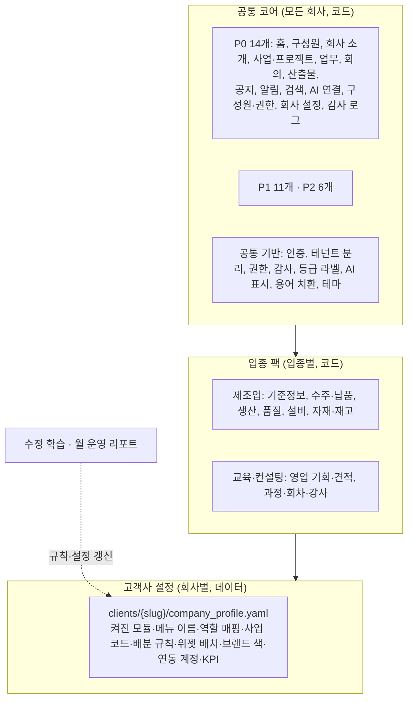

# 02. 회사별 업무사이트 공통 모듈 정의

> 기준일 2026-10-02 · 업무사이트 뼈대 설계 문서
>
> **표기**
> - ●: 공식 출처(제품 공식 페이지, 법령 조문)로 확인
> - ◐: 2차 출처(기사, 로펌·업체 해설)로 확인했거나 일부만 확인
> - ○: 확인 못 함(미검증). "없다"는 뜻이 아닙니다
> - [n]: 맨 아래 출처 번호
>
> **함께 볼 파일**
> - 기계가 읽는 목록: [`config/worksite_modules.yaml`](../../config/worksite_modules.yaml). 모듈 id·엔티티 필드·권한·아이콘·위젯은 이 파일과 이 문서가 같아야 하며, 다르면 **YAML의 필드 목록**과 **이 문서의 판단·근거**를 각각 정본으로 봅니다.
> - 방향과 모듈 ①~⑧: [00 방향 정리](../research/00_direction.md)
> - 회사별 설정 원천: [03 Company DNA 플레이북](../research/03_company-dna-playbook.md), [`templates/company_profile.template.yaml`](../../templates/company_profile.template.yaml)
> - 데이터 등급 L0~L3: [04 데이터 거버넌스](../research/04_data-governance.md)
> - 시장·만들지 말 것: [07 통합 플랫폼 시장](../research/07_work-os-market.md)
> - 수정 학습 [08](../research/08_correction-learning.md) · ARA MCP [09](../research/09_ara-mcp-remote.md) · ARA 복지 [10](../research/10_ara-wellbeing.md)
>
> 이 문서의 법령 내용은 기록 항목을 정하기 위한 조사이며 법률 자문이 아닙니다. 고객 계약·출시 전에 노무·안전·개인정보 전문가 검토를 받으세요.

---

## 0. 한눈에 보기

1. **국내 그룹웨어·협업툴 8종 중 6종 이상이 가진 것은 메신저·전자결재·할 일·메일·캘린더·드라이브입니다**([1.1](#11-국내-그룹웨어협업툴-8종-모듈-비교)). 중소기업은 이 중 상당수를 이미 쓰고 있을 가능성이 큽니다. 업무사이트는 이것들을 **새로 만들지 않고 연동**합니다.
2. **어느 제품도 잇지 않는 것을 만듭니다.** 사업 > 프로젝트 > 파트 구조에 회의·업무·문서·메일·결정을 붙이는 뼈대, 수정 학습, 직원 각자의 AI 연결(MCP), 회사가 볼 수 없게 분리된 ARA 복지입니다. 이것이 CRATA 모듈 ①~⑧입니다.
3. **모든 회사에 공통인 모듈은 31개로 정했습니다.** 지금 뼈대에 넣을 **P0 14개**, 첫 고객 파일럿 안에 넣을 **P1 11개**, 나중 **P2 6개**입니다. 여기에 **제조업 팩 6개**(첫 고객 TR용)와 **교육·컨설팅 팩 2개**(CRATA 자신용)를 업종 팩으로 따로 둡니다([3장](#3-공통-모듈-목록), [4장](#4-업종-팩)).
4. **3층 구조:** 공통 코어(코드) → 업종 팩(코드) → 고객사 설정(Company DNA 데이터). 고객사 전용 코드는 만들지 않는 것이 원칙입니다([2장](#2-3층-구조-공통-코어--업종-팩--고객사-설정)).
5. **법정 기록은 "원본을 가진 시스템"을 먼저 정합니다.** 근태·연차·결재·회계 증빙의 원본은 기존 시스템에 두고 사이트는 요약·알림·링크만 보여 줍니다. 예외로, 상시 5명 이상 사업장의 **안전보건 기록**(위험성평가, 반기 점검, 아차사고)은 경량 모듈로 직접 둡니다. 제조업 팩에서는 기본으로 켭니다([1.4](#14-한국-법운영상-꼭-남겨야-하는-기록)).
6. **홈은 역할별 프리셋 3개(대표·팀장·실무자)에 위젯 6~8개**로 시작합니다. 대표는 KPI·프로젝트 상태·결정·AX 효과, 팀장은 검토 대기·팀 현황, 실무자는 내 업무·반려·회의·AI 연결을 봅니다([5장](#5-홈-대시보드-공통-위젯)).
7. **좌측 메뉴는 최상위 9개 이하입니다**(구성원에게는 8개). 순서는 홈 → 내 업무 → 프로젝트 → 회의 → 문서·지식 → (업종 팩) → 회사 → ARA → 관리입니다. **모바일 하단 탭은 5개**이고, 제조업 팩이 켜지면 '회의' 자리에 '현장 등록'이 들어갑니다([6장](#6-내비게이션-ia)).

---

## 1. 조사: 회사마다 공통으로 있는 것

### 1.1 국내 그룹웨어·협업툴 8종 모듈 비교

각 제품의 공식 페이지(2026-10-02 열람)에 메뉴·기능 이름으로 나온 것만 ●로 표시했습니다. ○는 이번에 확인하지 못했다는 뜻입니다.

| 기능 | 네이버웍스 [1][2] | 다우오피스 [3] | 하이웍스 [4] | 플로우 [5] | 두레이 [6] | 카카오워크 [7] | 더존 Amaranth 10 [8] | 스윗 [9] |
|---|---|---|---|---|---|---|---|---|
| 메신저 | ● 메시지 | ● | ● | ● | ● | ● 채팅 | ● 미팅룸 | ● Chat |
| 메일 | ● Standard 이상 | ● | ● | ○ | ● | ● | ● | ○ |
| 캘린더·일정 | ● | ● | ● 일정 | ● 업무일정관리 | ● | ● | ○ | ○ |
| 할 일·프로젝트 | ● 할 일, 프로젝트 관리 | ● Works, ToDO+ | ◐ 그룹 | ● 프로젝트·업무 관리 | ● 프로젝트 | ● 할 일 관리·워크보드 | ○ | ● Task |
| 게시판·공지 | ● | ● | ● | ○ | ● 홈/게시판 | ● 인트라넷 | ○ | ○ |
| 주소록·조직도 | ● | ● | ● | ○ | ● | ◐ 인사계정 | ○ | ○ |
| 드라이브·문서 | ● Standard 이상 | ● 드라이브·문서관리 | ● | ● 드라이브·지식&문서관리 | ● 드라이브·위키 | ○ | ● 문서관리 | ○ |
| 전자결재 | ● 결재(경영지원) | ● | ● | ○ | ● 결재 | ● | ● | ● Approvals 플러그인 |
| 근태·휴가 | ● 근태(경영지원) | ● 근태·휴가 | ● 근무관리 | ○ | ○ | ● 근태관리 | ◐ 인사 | ○ |
| 인사·급여 | ● 급여(경영지원) | ● 급여·인사정보 | ● 인사 | ○ | ○ | ○ | ● 인사 | ○ |
| 경비·회계 | ● 재무(경영지원) | ● 경리관리 | ● 경리회계·경비 관리 | ○ | ○ | ○ | ● 회계 | ○ |
| 설문·폼 | ● | ● | ○ | ○ | ● 폼 | ○ | ○ | ○ |
| 회의실·자원 예약 | ○ | ● | ● | ○ | ● 자원예약 | ● 공간·자원예약 | ○ | ○ |
| 화상회의 | ● | ○ | ● | ○ | ● | ● | ● 미팅룸 | ○ |
| 법정교육·전자계약 | ○ | ● 둘 다 | ● 전자계약 | ○ | ○ | ○ | ○ | ○ |
| 감사·로그 | ● 180일 보관·다운로드 | ○ | ○ | ◐ 보안·관리자 모니터링 | ○ | ○ | ○ | ○ |
| AI | ● 클로바노트·AI 스튜디오 | ● 다우오피스 AI | ○ | ● 협업 Agent, 멀티 GPT | ● 생성형 AI | ● 카카오워크AI | ○ | ● |
| OKR·목표 | ○ | ○ | ○ | ● OKR | ○ | ○ | ○ | ● Goals |

- 더존 Amaranth 10 열은 공식 제품 페이지가 아니라 출시 기사(2021-05)와 앱 소개 문구 기준이라 실제로는 ◐ 수준입니다 [8].

**읽는 법**
- **8종 중 6종 이상에서 확인:** 메신저(8), 전자결재(7), 메일(6), 캘린더(6), 할 일·프로젝트(7, 일부 ◐), 드라이브·문서(6). 고객사가 그룹웨어를 쓰고 있다면 이 기능들은 이미 있다고 보고 **연동 대상**으로 둡니다.
- **그룹웨어형(네이버웍스·다우오피스·하이웍스·카카오워크·Amaranth)은 근태·인사·경비까지 포함합니다.** 네이버웍스는 결재·근태·급여·재무를 '경영지원' 상품으로 따로 팝니다 [2]. 다우오피스HR은 법정 연차 자동 생성과 출입통제 연동을 강조합니다 [33]. 이런 기능은 법 개정을 따라가야 하는 전문 영역이라 CRATA가 만들 이유가 없습니다.
- **협업툴형(플로우·두레이·스윗)은 프로젝트·업무가 중심입니다.** 결재는 플러그인이나 별도 모듈입니다.
- **아무도 하지 않는 것:** 사업 > 프로젝트 > 파트 구조에 회의 구간·결정·업무·산출물·메일을 함께 잇는 것, 수정 이력을 회사 규칙으로 승격하는 것, 회사가 볼 수 없게 분리된 직원 복지입니다. 외부 AI 연결은 플로우(ChatGPT·Claude 공식 앱)와 티로(MCP)가 시작했습니다([07 문서](../research/07_work-os-market.md) 2장).
- **ERP 계열은 영업·구매·자재·생산 모듈을 따로 둡니다.** Amaranth 10은 회계·인사·커뮤니케이션·문서관리를 먼저 내고 영업·구매·자재·생산을 뒤이어 내겠다고 발표했습니다(2021-05) [8]. 업종 팩을 따로 두는 근거 중 하나입니다.

### 1.2 인트라넷 모범 사례 (NN/g)

| 발견 | 내용 | 출처 | 업무사이트에 반영 |
|---|---|---|---|
| 가장 흔한 최상위 메뉴 | 인트라넷 56곳 분석. 최상위 메뉴 수 중앙값 7개. 가장 흔한 주제는 인사(66%), 회사 정보(63%), 뉴스(59%), 부서(46%) | NN/g, 2007 [10] ● | 최상위 9개 이하. '회사' 그룹에 공지·회사 소개·구성원을 둠 |
| 업무 기반 구조 | 업무(과업) 기준으로 짠 메뉴가 부서 기준보다 조직 개편에 잘 견딤 | NN/g, 2007 [10] ● | 메뉴를 부서가 아닌 일(내 업무·프로젝트·회의·문서)로 나눔 |
| 사람 찾기 | "동료를 찾는 일이 인트라넷에서 가장 흔한 과업". 검색 제안에 사진·이름·메일·전화·메시지 링크 | NN/g, 2013 [11] ● | `search`는 사람 결과를 맨 위에. `org-members`를 P0로 |
| 일을 끝내는 곳 | "인트라넷은 더 이상 뉴스만 보는 곳이 아니라 업무를 처리하는 곳". HR·경비·메신저 API 연동 | NN/g 2023 Intranet Design Annual 트렌드 [12] ● | 홈 위젯이 '처리할 것'(검토 대기·반려·결재 대기)을 먼저 보여 줌 |
| AI 기능 | 수상작들이 AI를 챗봇, 도구 추천, 경력 가이드, 가상 비서, 개인화된 소통에 씀 | NN/g, 2024-01 [13] ● | 사이트 안 챗봇 대신 직원 각자의 AI를 MCP로 연결(`ai-connect`) |
| 짧은 피드백 | 콘텐츠·검색 결과에 바로 평가를 남기는 기능이 개선에 유용 | NN/g 2023 [12] ● | 수정 학습의 '수정 사유' 입력, 위젯 '도움이 됐나요' (P2) |

### 1.3 SaaS 관리 기본기

| 항목 | 내용 | 출처 | 반영 모듈 |
|---|---|---|---|
| 팀 관리 | 계정 안에서 중앙 관리되는 구성원. 조직 단위가 멀티테넌트의 기초 | EnterpriseReady [14] ● | `admin-members` |
| 역할 기반 권한(RBAC) | 역할별 권한 분리 | EnterpriseReady [14] ● | 4개 역할 + 범위 권한 |
| 감사 로그 | 관리자에게 계정 활동의 상세 기록 제공 | EnterpriseReady [14] ● | `audit-log` |
| SSO | 중앙 디렉터리로 사용자 관리 | EnterpriseReady [14] ● | P2 이후(국내 SMB는 수요 확인 후) |
| 변경 관리 | 새 기능·변경을 관리자가 퍼뜨릴 수 있는 도구 | EnterpriseReady [14] ● | `help-updates` |
| 연동·데이터 이동 | 데이터를 넣고 빼는 경로 | EnterpriseReady [14] ● | `integrations`, `data-export` |
| 리포트 | 관리자가 조직에 가치를 보여 주는 리포트 | EnterpriseReady [14] ● | `reports` |
| Refine의 권한 | `accessControlProvider`의 `can({resource, action})`, `CanAccess`, 권한 없으면 버튼·메뉴 자동 숨김 | Refine 문서 [16] ● | 레지스트리의 `permissions`를 `can`의 기본값으로 씀 |
| Refine의 감사 | `auditLogProvider`가 생성·수정·삭제를 자동 기록. 보안상 서버 쪽 기록 권장 | Refine 문서 [17] ● | 화면 이벤트는 Refine, 정본은 서버(DB 트리거) |
| Refine CRM 예제 구성 | Dashboard, Calendar, Scrumboard, Sales Pipeline, Companies, Contacts, Quotes, Administration(설정·역할·권한) | Refine 템플릿 [15] ● | 사용자 다이어그램과 같은 구성. Companies·Contacts → `partners`, Scrumboard → `tasks` 보드, Quotes → 업종 팩, Administration → '관리' 그룹 |

### 1.4 한국 법·운영상 꼭 남겨야 하는 기록

원칙: **원본을 가진 시스템**을 먼저 정하고, 업무사이트는 그 시스템을 대신하지 않습니다.

| 의무 | 근거와 확인 상태 | 원본을 가진 곳 | 업무사이트 방침 |
|---|---|---|---|
| 주 40시간 + 연장 12시간(주 52시간) | 근로기준법 제53조① [19] ●. 30인 미만 특별연장 8시간(제53조③)은 법 부칙상 2022-12-31까지 효력 [19] ●. 그 뒤의 연장·계도 여부는 ○ | 근태 시스템 | `attendance-leave`가 주간 근로시간 요약만 받아 한도 접근 경고. 계산·기록은 하지 않음 |
| 연차 사용 촉진 | 제61조: 6개월 전 미사용 일수 알리고 서면 촉구 → 10일 안에 시기 통보 없으면 2개월 전 사용자가 시기 지정 통보 [20] ● | 근태 시스템 | 촉진 서면은 근태 시스템. 사이트는 '내 잔여 연차' 위젯만 |
| 근로자 명부·근로계약 중요 서류 3년 보존 | 제42조 [18] ●. 대상 서류(근로계약서, 임금대장, 휴가 관련 서류 등)는 시행령 제22조, 2차 정리 [21] ◐ | HR·급여·근태 시스템 | `org-members`에 주민번호·주소·임금 같은 근로자명부 항목을 두지 않음 |
| 상업장부·영업 중요서류 10년, 전표 5년 | 상법 제33조. 전산 보존 허용 [22] ● | 전자결재·ERP | `approvals`는 링크와 상태만. 결재 원본 보관 책임을 지지 않음 |
| 세무 장부·증빙 5년 | 국세기본법 제85조의3(법정신고기한 후 5년, 역외거래 7년) [23] ● | ERP·결재 | 위와 같음 |
| 개인정보처리시스템 접속기록 1년 이상 | 개인정보의 안전성 확보조치 기준 제8조: 1년 이상, 정보주체 5만 명 이상 등은 2년 이상. 점검 주기를 내부 관리계획으로 정하고 위변조 방지 [24] ◐(2차 요약) | CRATA 플랫폼 | `audit-log` 기본 2년 보관(제안), 추가만 가능, 내려받기·조회도 기록 |
| 직장 내 성희롱 예방교육 매년 | 남녀고용평등법 제13조 [25] ● | 교육 플랫폼 | `training-records`(P2)에 이수 증빙만 |
| 위험성평가 기록 3년 보존 | 산업안전보건법 제36조, 시행규칙 제37조: 유해·위험요인, 위험성 결정 내용, 조치 내용을 기록하고 3년 보존 [27] ◐(로펌 해설, 2026-03) | 안전보건 기록 | `safety-health`의 `RiskAssessment`에 세 항목을 필수로 |
| 2026년 위험성평가 개정(근로자 대표 참여 의무화, 결과 공유 등) | 업체 해설 [28] ○(2차·미검증, 시행일 원문 확인 필요) | 안전보건 기록 | `worker_participation_note` 필드만 미리 두고 원문 확인 후 확정 |
| 안전보건관리체계 반기 점검 | 중대재해처벌법 시행령 제4조: 유해·위험요인 확인·개선 절차와 **반기 1회 이상 점검**, 종사자 의견 청취 절차와 **반기 1회 이상 점검** [29] ◐. 상시 5명 이상 사업장 전면 적용은 2024-01-27부터 [29] ◐. 예산·비상대응 매뉴얼·도급 기준 항목의 점검 주기는 조문 원문 확인 필요 ○ | 안전보건 기록 | `SemiannualReview` 체크리스트와 반기 D-day 위젯 |
| 산업재해 기록·보고 | 산업안전보건법 제57조: 은폐 금지, 원인 등 기록·보존, 보고 [26] ●. 보존 3년, 3일 이상 휴업 재해는 1개월 안에 산업재해조사표 제출 [30] ◐(2차) | 안전보건 기록 | `SafetyIncident.report_due_on`을 발생일 + 1개월로 계산해 알림 |
| 근로자 정기 안전보건교육 | 산업안전보건법 시행규칙 별표4: 반기별, 직종에 따라 6~12시간 [31] ◐(2차) | 교육 | `training-records` |
| AI 생성물 고지·표시 | AI 기본법 2026-01-22 시행, 과태료 계도기간 운영 [32] ◐. 제31조 고지 의무는 [03 문서](../research/03_company-dna-playbook.md) 8.2절 | CRATA 플랫폼 | 공통 기반: AI 초안 라벨, AI 연결 전 고지 |
| 국외이전 고지 | MCP 결과가 직원이 연결한 해외 AI 사업자로 전달됨([00 문서](../research/00_direction.md) 6장, [09 문서](../research/09_ara-mcp-remote.md)) | CRATA 플랫폼 | `McpPolicy.overseas_notice_version`, 연결 전 동의 기록 |
| (자동차 부품) 품질 기록 보존 정책 | IATF 16949 7.5.3.2.1: 법령·고객 요구를 충족하는 기록 보존 정책을 정하고 문서화 [34] ◐. 구체 기간은 규격 원문·고객 CSR 확인 필요 ○ | 품질 기록 | 제조업 팩 `mfg-quality`에 보존 정책 설정 자리 |

**안전보건만 직접 두는 이유:** 근태·결재·회계는 그룹웨어·ERP라는 원본 시스템이 분명합니다. 반면 위험성평가·반기 점검·아차사고 기록은 소규모 제조사에서 엑셀·종이로 흩어져 있는 경우가 많다고 봤습니다(**추정**, 진단 때 확인). 이 기록이 회의(안전 회의)·업무(조치)·공지(안전 공지)와 바로 이어지므로 경량 모듈로 둡니다. 전문 안전관리 솔루션을 쓰는 고객이면 연동으로 바꿉니다.

### 1.5 CRATA 고유 모듈과의 대응

| CRATA 모듈([00 문서](../research/00_direction.md) 5장) | 업무사이트 모듈 id | 단계 |
|---|---|---|
| ① 진단·설정(Company DNA Profile) | `admin-settings`, `org-members`, `company-info`, `business-structure`, `admin-members`, `partners`, `reports`, `surveys` | P0~P2 |
| ② 회의 | `meetings` | P0 |
| ③ 업무·배분 | `tasks` | P0 |
| ④ 산출물·수정 학습 | `documents`(P0), `correction-rules`(P1) | P0·P1 |
| ⑤ 메일 커넥터 | `mail-connector` | P1 |
| ⑥ 지식 연결 | `knowledge` | P1 |
| ⑦ ARA MCP | `ai-connect` | P0 |
| ⑧ ARA 복지 | `ara-wellbeing` | P1(P0에는 자리와 안내 화면만) |

`ai-connect`를 P0에 두는 이유: "서로 다른 두 회사가 각자의 PC에서 각자의 AI로 자기 업무만 조회·제출한다"가 첫 판매 기준이기 때문입니다([00 문서](../research/00_direction.md) 8장).

### 1.6 조사에서 나온 원칙

1. **그룹웨어가 다 가진 것은 연동합니다.** 메신저, 메일, 결재, 드라이브, 캘린더, 근태, 급여, 회계는 만들지 않습니다(레지스트리 `excluded` 9개).
2. **아무도 잇지 않는 것을 만듭니다.** 구조(사업·프로젝트·파트) + 회의 + 업무·검토 + 산출물·수정 학습 + 각자의 AI 연결 + 분리된 복지.
3. **인트라넷 기본기는 가볍게 직접 둡니다.** 사람 찾기, 공지, 회사 소개는 그룹웨어가 없는 고객에게도 필요하고, 사이트 첫인상을 정합니다.
4. **관리 기본기는 처음부터 고정 베이스에 둡니다.** 역할, 감사 로그, 연동 관리, 내보내기는 화면 생성기가 건드리지 않습니다([03 문서](../research/03_company-dna-playbook.md) 6.1절 원칙 3).
5. **법정 기록은 원본 시스템을 정하고, 사이트는 요약·알림·링크만 보여 줍니다.** 예외는 안전보건 기록 하나입니다(1.4절).

---

## 2. 3층 구조: 공통 코어 · 업종 팩 · 고객사 설정



| 층 | 무엇 | 어디에 | 누가 바꾸나 | 어떻게 |
|---|---|---|---|---|
| 공통 코어 | 공통 모듈 31개와 공통 기반 | 앱 코드 + `config/worksite_modules.yaml` | CRATA 제품팀 | 릴리스 |
| 업종 팩 | 엔티티·화면, 메뉴 그룹 이름, 홈 위젯, 기본 용어집, KPI 목록, 법정·인증 기록 양식, MCP 도구 확장, 데모 데이터, 진단 질문 추가분 | 앱 코드 + 레지스트리(`industry: manufacturing` 등) | CRATA 제품팀 | 릴리스 |
| 고객사 설정 | 켜진 모듈, 메뉴·필드 이름, 조직·직책 → 역할 매핑, 사업·프로젝트 코드, 배분 규칙, 위젯 배치, 브랜드 색, 연동 계정, KPI 기준선 | `clients/{slug}/company_profile.yaml` | CRATA 운영자(고객 owner는 브랜드·라벨·알림 기본값만) | 프로파일 차이(diff)로 기록 |

**규칙**
- **고객사 전용 코드는 만들지 않습니다.** 같은 요청이 고객 2~3곳에서 나오면 업종 팩이나 코어로 올립니다. 예외는 특정 ERP·MES 연동 어댑터뿐입니다.
- **업종 팩은 코어 엔티티를 고치지 않고 '붙기만' 합니다.** 예: 제조업 `CorrectiveAction.artifact_id` → 코어 `Artifact`, `Nonconformance.linked_task_id` → 코어 `Task`.
- 업종 팩을 이렇게 따로 두는 방식은 해외 업무 SaaS에서도 흔합니다. Odoo는 업종별 시작 구성을 따로 제공합니다 [35](구성 방식의 세부는 ○).

---

## 3. 공통 모듈 목록

### 3.1 역할과 권한 표기

| 역할 | 누구(중소기업 기준) | 할 수 있는 것 |
|---|---|---|
| owner 소유자 | 대표이사(1~2명) | 계약·결제, 회사 정책(AI 연결·데이터 등급·업종 팩), 소유자 지정 |
| admin 관리자 | 총무·경영지원 담당 | 구성원 초대·역할, 연동, 회사 설정, 감사 로그 조회 |
| reviewer 검토자 | 팀장, 공장장 | 업무 생성·배정, 제출물 승인·반려, 회의 결정 확정, 담당 문서 유형의 규칙 승인 |
| member 구성원 | 실무자 | 내 업무 진행·제출, 참여 프로젝트 조회, 산출물 작성, 본인 AI 연결 |
| (테넌트 밖) CRATA 운영자 | CRATA 직원 | 프로파일 적용, 모듈 켜기·끄기, 장애 대응. 고객 데이터 열람은 고객 승인 + 기간 한정 + 감사 로그(`actor_type=crata_operator`) |

- 역할은 직급·직책과 다릅니다. 직책 → 역할 기본 매핑은 `PositionRoleMap`에 두고, 사람마다 바꿀 수 있습니다.
- 역할 위에 **범위 권한**을 겹칩니다(예: 품질보증팀장은 품질 사업에서만 reviewer). `RoleAssignment.scope_type`.
- [09 문서](../research/09_ara-mcp-remote.md)의 MCP 역할(owner·reviewer·member)에 admin을 더한 것입니다. MCP 토큰의 `role`에는 4개 중 하나가 들어갑니다.

**권한 표기:** 관리(설정·삭제 포함) · 승인(작성 + 승인·반려·확정) · 작성(권한 범위 안) · 본인(본인 것만) · 조회 · 집계만(개인 식별 불가) · —(접근 불가)

### 3.2 전체 목록

| id | 이름 | 단계 | 메뉴 그룹 | 방식 | CRATA | 소유자 | 관리자 | 검토자 | 구성원 |
|---|---|---|---|---|---|---|---|---|---|
| `home-dashboard` | 홈 대시보드 | P0 | 홈 | 직접 | – | 관리 | 관리 | 본인 | 본인 |
| `org-members` | 구성원·조직도 | P0 | 회사 | 혼합 | ① | 관리 | 관리 | 조회 | 조회 |
| `company-info` | 회사 소개 | P0 | 회사 | 직접 | ① | 관리 | 관리 | 조회 | 조회 |
| `business-structure` | 사업·프로젝트·파트 | P0 | 프로젝트 | 직접 | ① | 관리 | 관리 | 작성 | 조회 |
| `tasks` | 업무·배분·검토 | P0 | 내 업무 | 직접 | ③ | 관리 | 관리 | 승인 | 본인 |
| `meetings` | 회의 | P0 | 회의 | 혼합 | ② | 관리 | 관리 | 승인 | 조회 |
| `documents` | 산출물·양식 | P0 | 문서·지식 | 혼합 | ④ | 관리 | 관리 | 승인 | 작성 |
| `notices` | 공지·게시판 | P0 | 회사 | 혼합 | – | 관리 | 관리 | 작성 | 조회 |
| `notifications` | 알림 | P0 | 상단 바 | 혼합 | – | 관리 | 관리 | 본인 | 본인 |
| `search` | 검색 | P0 | 상단 바 | 직접 | – | 조회 | 조회 | 조회 | 조회 |
| `ai-connect` | ARA 연결(내 AI 연결) | P0 | 상단 바(프로필) | 직접 | ⑦ | 관리 | 관리 | 본인 | 본인 |
| `admin-members` | 구성원·권한 관리 | P0 | 관리 | 직접 | ① | 관리 | 관리 | — | — |
| `admin-settings` | 회사 설정 | P0 | 관리 | 직접 | ① | 관리 | 관리 | — | — |
| `audit-log` | 감사 로그 | P0 | 관리 | 직접 | – | 조회 | 조회 | — | 본인 |
| `partners` | 거래처·연락처 | P1 | 프로젝트 | 혼합 | ① | 관리 | 관리 | 작성 | 조회 |
| `calendar` | 일정 | P1 | 회사 | 혼합 | – | 관리 | 관리 | 작성 | 본인 |
| `approvals` | 결재(연동) | P1 | 회사 | 연동 | – | 조회 | 관리 | 조회 | 본인 |
| `attendance-leave` | 근태·휴가(연동) | P1 | 회사 | 연동 | – | 조회 | 조회 | 조회 | 본인 |
| `knowledge` | 지식 | P1 | 문서·지식 | 혼합 | ⑥ | 관리 | 관리 | 승인 | 작성 |
| `correction-rules` | 수정 학습·규칙 | P1 | 문서·지식 | 직접 | ④ | 관리 | 관리 | 승인 | 조회 |
| `mail-connector` | 메일 연결 | P1 | 내 업무 | 연동 | ⑤ | 관리 | 관리 | 본인 | 본인 |
| `integrations` | 연동 관리 | P1 | 관리 | 직접 | – | 관리 | 관리 | — | — |
| `ara-wellbeing` | ARA 복지 | P1 | ARA | 직접 | ⑧ | 집계만 | 집계만 | — | 본인 |
| `reports` | 리포트 | P1 | 관리 | 직접 | ① | 조회 | 관리 | 조회 | — |
| `safety-health` | 안전보건 | P1 | 회사 | 혼합 | – | 승인 | 관리 | 작성 | 본인 |
| `training-records` | 교육·이수 기록 | P2 | 회사 | 혼합 | – | 조회 | 관리 | 조회 | 본인 |
| `surveys` | 설문·의견함 | P2 | 회사 | 혼합 | ① | 관리 | 관리 | 작성 | 본인 |
| `resource-booking` | 회의실·자원 예약 | P2 | 회사 | 연동 | – | 관리 | 관리 | 본인 | 본인 |
| `help-updates` | 도움말·새 기능 안내 | P2 | 상단 바 | 직접 | – | 조회 | 조회 | 조회 | 조회 |
| `data-export` | 데이터 내보내기·이관 | P2 | 관리 | 직접 | – | 관리 | 관리 | — | 본인 |
| `billing` | 구독·좌석 | P2 | 관리 | 직접 | – | 관리 | 조회 | — | — |

방식: 직접(CRATA가 만듦) · 연동(기존 도구에 연결만, 원본은 그쪽) · 혼합(가벼운 자체 화면 + 연동. 고객이 해당 도구를 쓰면 연동이 우선)

### 3.3 P0 모듈 상세 (지금 뼈대에 있어야 함)

P0는 "화면·데이터 모델·권한이 데모 데이터로 동작하는 상태"를 뜻합니다. 실제 외부 연동은 P1부터입니다.

#### `home-dashboard` 홈 대시보드
- **목적:** 로그인하자마자 "오늘 내가 처리할 것"과 "회사가 어떻게 돌아가는지"를 역할에 맞게 보여 줍니다.
- **핵심 화면:** 홈(역할별 프리셋, [5장](#5-홈-대시보드-공통-위젯)), 위젯 배치 편집(순서·숨김).
- **엔티티:**
  - `DashboardLayout` 대시보드 배치: id, tenant_id, preset, member_id, widgets, updated_at
- **권한:** 소유자·관리자 관리(회사 기본 배치) · 검토자·구성원 본인(내 배치의 순서·숨김만)
- **만들기/연동:** 직접. 회사 기본 배치는 Company DNA의 `portal_hints.home_widgets`와 `kpis`에서 만듭니다([03 문서](../research/03_company-dna-playbook.md) 6.2절 매핑 규칙).
- **근거:** NN/g 2023 "업무를 처리하는 곳" [12], 레퍼런스 대시보드의 인사말·큰 숫자·D-day 목록 구조 [37].

#### `org-members` 구성원·조직도
- **목적:** 사람 찾기와 조직도. 모든 모듈의 담당자·검토자·참석자가 여기를 참조합니다.
- **핵심 화면:** 구성원 디렉터리(검색·조직 필터, 사진·이름·소속·직책·담당 업무·업무 연락처), 조직도(트리), 내 프로필.
- **엔티티:**
  - `OrgUnit` 조직: id, name, parent_id, head_member_id, sort_order, valid_from, valid_to
  - `Member` 구성원: id, tenant_id, display_name, email, phone_work, org_unit_id, position, job_title, duties, role, status, joined_at, avatar_ref, external_ids
- **권한:** 소유자·관리자 관리 · 검토자·구성원 조회(본인 프로필의 사진·업무 연락처·담당 업무는 본인이 수정)
- **만들기/연동:** 혼합. 그룹웨어·HR이 있으면 동기화(하이웍스는 조직·구성원 API가 있음, [03 문서](../research/03_company-dna-playbook.md) L5), 없으면 직접 입력합니다. **근로자명부 항목(주민번호·주소·임금)은 저장하지 않습니다**(1.4절). 조직 개편은 행을 지우지 않고 `valid_to`로 끝냅니다.
- **근거:** 사람 찾기가 인트라넷 1순위 과업 [11]. 8종 중 5종이 주소록·조직도를 가짐(1종은 ◐, 1.1절).

#### `company-info` 회사 소개
- **목적:** 비전·방침·연혁·인증·대표 연락처를 한 화면에. 회사 정보는 인트라넷 최상위 메뉴 2위 주제입니다 [10].
- **핵심 화면:** 회사 소개(비전·핵심 가치·방침, 연혁 타임라인, 인증 목록과 유효기간, 위치·연락처).
- **엔티티:**
  - `CompanyInfo` 회사 정보: tenant_id, legal_name, display_name, address, phone, website, founded_on, vision, values, policies, history, certifications, logo_ref, updated_at
- **권한:** 소유자·관리자 관리 · 검토자·구성원 조회
- **만들기/연동:** 직접. Company DNA L1(정체성)을 그대로 보여 줍니다. 공개 정보 위주로 채우고, 인증 유효기간이 다가오면 관리자에게 알립니다.
- **근거:** NN/g [10]. 첫 고객 TR은 홈페이지에 비전·품질방침·연혁·조직도를 공개하고 있어 첫 화면 시안에 쓸 수 있습니다(4.3절).

#### `business-structure` 사업·프로젝트·파트
- **목적:** 모든 것의 뼈대입니다. 업무·회의·문서·메일·결정이 모두 여기에 붙습니다([00 문서](../research/00_direction.md) 4장 "제일 먼저 정해야 합니다").
- **핵심 화면:** 구조 트리(사업 > 프로젝트 > 파트), 프로젝트 상세(개요 · 업무 · 회의 · 문서 · 메일 · 결정 탭), 프로젝트 만들기·수정.
- **엔티티:**
  - `BusinessLine` 사업: id, code, name, description, owner_member_id, status, sort_order
  - `Project` 프로젝트: id, business_line_id, code, name, aliases, partner_id, owner_member_id, reviewer_member_id, start_on, due_on, status, health, sensitivity, description
  - `Part` 파트: id, project_id, name, lead_member_id, member_ids, sort_order
- **권한:** 소유자·관리자 관리 · 검토자 작성(자기가 담당·검토자인 사업·프로젝트만) · 구성원 조회(참여 프로젝트만, `sensitivity=L2`는 참여자만)
- **만들기/연동:** 직접. 코드는 회의 분류 체계([`config/meeting_taxonomy.yaml`](../../config/meeting_taxonomy.yaml))와 같은 값을 씁니다. `aliases`는 회의·메일 자동 분류의 단서입니다.
- **근거:** [02 문서](../research/02_meeting-auto-classification.md) 4장, [03 문서](../research/03_company-dna-playbook.md) L6. 그룹웨어 8종 어디에도 "사업 > 프로젝트 > 파트에 회의 구간·결정·메일을 잇는 구조"는 확인되지 않았습니다(1.1절).

#### `tasks` 업무·배분·검토
- **목적:** 내 업무, 팀 배분, 제출과 검토. 직원 각자의 AI(MCP)가 다루는 대상이기도 합니다.
- **핵심 화면:** 내 업무(목록·보드, 마감순), 업무 상세(진행 기록·제출·검토 이력), 검토함(검토자), 팀 배분 보드(담당자별 진행 중 건수), 배분 규칙(관리).
- **엔티티:**
  - `Task` 업무: id, project_id, part_id, title, description, task_type, assignee_id, reviewer_id, due_at, priority, status, source, source_ref, estimate_hours, sensitivity, created_by, created_at
  - `ProgressLog` 진행 기록: id, task_id, author_id, body, via, created_at
  - `Submission` 제출: id, task_id, version, artifact_id, summary, submitted_by, via, idempotency_key, status, review_comment, reviewed_by, reviewed_at
  - `AssignmentRule` 배분 규칙: id, name, condition, assignee_rule, reviewer_rule, source_ref, active
- **상태:** `Task.status` = 할 일 → 진행 중 → 제출됨(검토 대기) → 수정 요청 / 완료(또는 취소). `Submission.status` = submitted / approved / rejected([09 문서](../research/09_ara-mcp-remote.md) 7장과 같음).
- **권한:** 소유자·관리자 관리 · 검토자 승인(담당 범위의 생성·배정·승인·반려) · 구성원 본인(본인 업무의 진행 기록·제출). 진행 기록은 추가만 됩니다.
- **만들기/연동:** 직접. **AI(MCP)는 '제출'까지만, '완료'는 검토자가 웹에서** 합니다([00 문서](../research/00_direction.md) 8장 기준 2). 배분 규칙은 Company DNA L5(결재선·검토자)·L7(판단 규칙)에서 옵니다. 범용 프로젝트 관리 도구(간트·워크로드 최적화)를 다시 만들지는 않습니다([07 문서](../research/07_work-os-market.md) 6장).
- **근거:** 8종 중 7종이 할 일·프로젝트를 가졌지만 회의 결정·검토자 규칙과 이어진 곳은 없음(1.1절). 한국식 규칙(검토자·직급·결재선)이 차별점([07 문서](../research/07_work-os-market.md) 3장(a)).

#### `meetings` 회의
- **목적:** 회의를 프로젝트에 붙이고, 결정과 할 일을 남깁니다.
- **핵심 화면:** 회의 목록(프로젝트·유형 필터), 회의 상세(요약 · 구간 · 결정 · 액션 제안, 제안 카드 1클릭 승인), 분류 확인 대기(검토자), 결정 모음, 회의 방식(정기 회의 리듬·템플릿).
- **엔티티:**
  - `Meeting` 회의: id, title, title_prefix, meeting_type, project_ids, started_at, duration_min, attendee_ids, source, transcript_ref, summary, sensitivity, status
  - `MeetingSegment` 회의 구간: id, meeting_id, start_ts, end_ts, business_line_code, project_code, task_type, confidence, evidence_quote, review_status
  - `Decision` 결정: id, meeting_id, project_id, statement, decided_by_role, decided_at, supersedes_id, status
  - `ActionProposal` 액션 제안: id, meeting_id, segment_id, title, suggested_assignee_id, suggested_due_at, status, task_id
- **권한:** 소유자·관리자 관리 · 검토자 승인(분류·결정·액션 확정) · 구성원 조회(참석했거나 공개 범위에 든 회의, 본인이 올린 회의는 수정)
- **만들기/연동:** 혼합. 녹음·전사는 Plaud·클로바노트·티로에 맡기고 원음은 저장하지 않습니다(링크만). 구간 분류·결정·액션 제안·프로젝트 연결만 만듭니다. 신뢰도 게이트와 처음 2주 전부 사람 확인은 [02 문서](../research/02_meeting-auto-classification.md) 규칙을 따릅니다. L3(학생 식별·상담 내용)는 저장하지 않습니다.
- **근거:** "회의 하나를 구간으로 나눠 구간마다 다른 사업부·프로젝트로 보내는" 완제품은 확인되지 않음(README 1장). 근거 타임스탬프 + 제안 카드 + 1클릭 승인 UX(Otolio·Rimo).

#### `documents` 산출물·양식
- **목적:** 산출물의 버전(AI 초안 → 수정 → 최종)과 회사 양식을 관리합니다. 수정 학습의 입력입니다.
- **핵심 화면:** 산출물 목록(문서 유형·프로젝트 필터), 산출물 상세(버전 목록·비교, 적용된 규칙), 양식 목록(문서 유형별 최신 양식).
- **엔티티:**
  - `Artifact` 산출물: id, project_id, task_id, doc_type, template_id, title, current_version, file_ref, ai_generated, sensitivity, owner_id, status
  - `ArtifactVersion` 산출물 버전: id, artifact_id, ver, kind, file_ref, author_id, created_at, applied_rule_ids
  - `Template` 양식: id, doc_type, name, format, version, file_ref, owner_id, status
- **권한:** 소유자·관리자 관리 · 검토자 승인(최종본 확정·양식 게시) · 구성원 작성(본인·참여 프로젝트)
- **만들기/연동:** 혼합. 파일 본체는 고객 저장소(Drive·SharePoint·네이버웍스 드라이브·NAS)에 두고 메타데이터·버전·적용 규칙만 관리합니다. 문서 에디터·PPT 생성 엔진은 만들지 않습니다. AI 초안에는 AI 생성 표시를 붙입니다(`ai_generated`).
- **근거:** [08 문서](../research/08_correction-learning.md) 4장 흐름 ①(AI 초안과 최종본을 버전으로 보관). 8종 중 6종이 드라이브·문서를 가짐(1.1절) → 저장은 연동.

#### `notices` 공지·게시판
- **목적:** 회사 공지, 규정 변경 안내, 행사, 안전 공지. 필독 공지는 열람 확인을 남깁니다.
- **핵심 화면:** 공지 목록(분류·고정), 공지 상세(필독이면 '확인했어요' 버튼), 작성(대상: 전체·조직·역할·프로젝트), 열람 현황(작성자·관리자).
- **엔티티:**
  - `Notice` 공지: id, category, title, body, author_id, audience, pinned, must_read, published_at, expires_at, attachments
  - `ReadReceipt` 열람 확인: notice_id, member_id, read_at
- **권한:** 소유자·관리자 관리 · 검토자 작성(본인 조직·프로젝트 대상) · 구성원 조회
- **만들기/연동:** 혼합. 경량 자체 게시판을 두고, 그룹웨어 게시판이 있으면 그 글을 함께 보여 주는 연동은 P1입니다. 열람 확인은 법정 교육을 대신하지 않습니다.
- **근거:** 뉴스는 인트라넷 최상위 메뉴 3위 주제 [10]. 8종 중 5종이 게시판을 가짐(1.1절).

#### `notifications` 알림
- **목적:** 배정·검토 요청·반려·마감·필독 공지·안전 점검 D-day를 알립니다.
- **핵심 화면:** 알림함(상단 바 종 아이콘, 모바일 탭), 알림 설정(종류별 채널, 즉시·하루 2회 묶음·하루 1회, 업무시간 외 조용히).
- **엔티티:**
  - `Notification` 알림: id, recipient_id, kind, title, body, link, source_module, source_id, channel, batched_at, read_at, created_at
  - `NotificationPreference` 알림 설정: member_id, kind, channels, digest, quiet_hours
- **권한:** 소유자·관리자 관리(회사 기본값) · 검토자·구성원 본인
- **만들기/연동:** 혼합. 사이트 안 알림함은 직접, 메신저 봇(카카오워크·네이버웍스·잔디·Slack)과 메일 발송은 P1 연동입니다. 메신저 앱은 만들지 않습니다.
- **근거:** 8종 모두 메신저를 가짐(1.1절) → 알림은 기존 메신저로. Company DNA 문화 → "알림은 하루 2회 묶음" 같은 기본값([03 문서](../research/03_company-dna-playbook.md) L8 `portal_implications`).

#### `search` 검색
- **목적:** 사이트 안에서 사람·프로젝트·업무·회의·문서·지식을 찾습니다.
- **핵심 화면:** 명령 팔레트(Ctrl/Cmd+K, `@refinedev/kbar`), 검색 결과(사람 → 프로젝트 → 업무 → 회의 → 문서·지식 순).
- **엔티티:**
  - `SearchIndexEntry` 검색 색인: id, tenant_id, object_type, object_id, title, snippet, acl_principals, sensitivity, updated_at
- **권한:** 전원 조회. 결과는 항상 요청자 권한으로 거릅니다(L2는 참여자에게만).
- **만들기/연동:** 직접. 사람 결과는 사진·이름·소속·연락처·메신저 링크를 바로 보여 줍니다 [11]. **외부 도구 전체를 뒤지는 사내 통합검색은 만들지 않습니다**([00 문서](../research/00_direction.md) 5장).
- **근거:** NN/g [11].

#### `ai-connect` ARA 연결(내 AI 연결)
- **목적:** 직원이 자기 ChatGPT·Claude·Codex에서 회사 업무를 조회·진행·제출하게 합니다.
- **핵심 화면:** 내 AI 연결(프로필 메뉴: 연결 안내, 연결된 클라이언트, 마지막 사용, 끊기), AI 연결 정책(관리 그룹 `/admin/ai-policy`: 회사 전체 끄기·읽기 전용·허용 클라이언트·전체 세션 철회), 연결 전 국외이전 고지.
- **엔티티:**
  - `McpConnection` AI 연결: id, member_id, client_name, client_id, scopes, created_at, last_used_at, revoked_at
  - `McpPolicy` AI 연결 정책: tenant_id, enabled, read_only, allowed_clients, allowed_scopes, overseas_notice_version, updated_by, updated_at
- **권한:** 소유자·관리자 관리(정책·전체 철회) · 검토자·구성원 본인(본인 연결만). 관리자는 AI 대화 내용을 볼 수 없습니다(저장하지 않음). AI가 한 일은 `audit-log`에 `actor_type=ai_mcp`로 남습니다.
- **만들기/연동:** 직접. OAuth 2.1, 토큰의 회사 ID로 데이터 분리, 도구 6개(`list_my_tasks`, `get_task`, `start_task`, `log_progress`, `submit_result`, `get_submission_status`)는 [09 문서](../research/09_ara-mcp-remote.md) 7장을 따릅니다.
- **근거:** 첫 판매 기준 1번([00 문서](../research/00_direction.md) 8장).

#### `admin-members` 구성원·권한 관리
- **목적:** 초대, 역할 부여, 범위 권한, 직책 → 역할 매핑, 퇴사자 비활성화.
- **핵심 화면:** 구성원 관리 목록(역할·상태 필터), 초대, 역할·범위 권한 편집, 직책-역할 매핑.
- **엔티티:**
  - `Invitation` 초대: id, email, role, org_unit_id, invited_by, expires_at, status
  - `RoleAssignment` 역할 부여: member_id, role, scope_type, scope_id, granted_by, granted_at
  - `PositionRoleMap` 직책-역할 매핑: position_or_title, default_role
- **권한:** 소유자·관리자 관리(소유자 지정·해제는 소유자만) · 검토자·구성원 —
- **만들기/연동:** 직접. 퇴사자는 삭제하지 않고 비활성화합니다(업무·결정 이력 보존). SSO(SAML·OIDC)와 SCIM 자동 동기화는 P2 이후 수요를 보고 정합니다.
- **근거:** EnterpriseReady 팀 관리·RBAC [14], Refine `accessControlProvider` [16].

#### `admin-settings` 회사 설정
- **목적:** Company DNA Profile이 적용된 결과를 확인하고, 고객이 바꿔도 되는 것만 바꿉니다.
- **핵심 화면:** 브랜드(대표 색·로고), 용어(메뉴·필드 이름), 모듈·업종 팩 상태, 데이터 등급 기본값, 프로파일 버전 이력.
- **엔티티:**
  - `TenantSettings` 회사 설정: tenant_id, display_name, brand_tokens, logo_ref, locale, timezone, enabled_modules, enabled_packs, nav_overrides, data_class_defaults, profile_version
  - `GlossaryTerm` 용어: id, term, ui_label, aliases, forbidden, definition
- **권한:** 소유자·관리자 관리 · 검토자·구성원 —. 업종 팩 추가·삭제와 데이터 등급 기본값은 계약 사항이라 소유자 + CRATA 운영자가 함께 바꿉니다.
- **만들기/연동:** 직접. 프로파일 원본은 CRATA 운영자가 차이(diff)로 고칩니다([03 문서](../research/03_company-dna-playbook.md) 6.1절 원칙 1). `brand_tokens`는 Ant Design 테마 토큰으로 바뀌고, `GlossaryTerm.ui_label`은 메뉴·필드 이름이 됩니다(6.2절 매핑 규칙).
- **근거:** [03 문서](../research/03_company-dna-playbook.md) 6장.

#### `audit-log` 감사 로그
- **목적:** 누가(사람·AI 연결·시스템·CRATA 운영자) 언제 무엇을 바꿨는지 추가만 가능한 기록.
- **핵심 화면:** 감사 로그(행위자·종류·대상·기간 필터, 내보내기), 내 활동(구성원: 내 계정과 내 AI 연결이 한 일).
- **엔티티:**
  - `AuditEvent` 감사 이벤트: id, tenant_id, at, actor_id, actor_type, action, resource, resource_id, changes, ip, user_agent, request_id
- **권한:** 소유자·관리자 조회 · 검토자 — · 구성원 본인. 아무도 수정·삭제할 수 없습니다.
- **만들기/연동:** 직접(고정 베이스). 화면 이벤트는 Refine `auditLogProvider` [17], 정본은 서버(DB 트리거)에 둡니다. `changes`는 마스킹해서 남깁니다. 보관은 최소 1년, **기본 2년(제안)** 입니다 [24].
- **근거:** EnterpriseReady [14], 네이버웍스도 감사 로그를 180일 보관·다운로드로 제공 [1], 개인정보 접속기록 요건 [24].

### 3.4 P1 모듈 상세 (첫 고객 파일럿 안에)

#### `partners` 거래처·연락처
- **목적:** 고객사·공급사·외주처·기관과 담당자. 프로젝트와 메일 분류의 기준점입니다.
- **핵심 화면:** 거래처 목록, 거래처 상세(담당자 · 프로젝트 · 메일 · 업종 팩 데이터 탭).
- **엔티티:**
  - `Partner` 거래처: id, kind, name, biz_reg_no, status, owner_member_id, tags, external_ids
  - `PartnerContact` 거래처 담당자: id, partner_id, name, dept, title, email, phone, is_primary
- **권한:** 소유자·관리자 관리 · 검토자 작성 · 구성원 조회. 담당자 연락처는 개인정보(L1)이고 내보내기는 소유자·관리자만.
- **만들기/연동:** 혼합. ERP·CRM 거래처가 있으면 동기화. **단가·계약 조건(L2)은 여기에 두지 않습니다.**
- **근거:** Refine CRM의 Companies·Contacts [15], [03 문서](../research/03_company-dna-playbook.md) 온톨로지 예시(Opportunity의 client_org).

#### `calendar` 일정
- **목적:** 회사 캘린더와 사이트 안 일정(회의·마감·납기·교육·점검)을 한 화면에.
- **엔티티:** `CalendarEvent` 일정: id, source, external_id, title, kind, start_at, end_at, all_day, project_id, attendee_ids, visibility
- **권한:** 소유자·관리자 관리 · 검토자 작성 · 구성원 본인(개인 일정)과 공유 일정 조회
- **만들기/연동:** 혼합. Google·M365·네이버웍스·그룹웨어 캘린더를 읽어 옵니다. 캘린더 앱은 만들지 않습니다.
- **근거:** 8종 중 6종이 캘린더를 가짐(1.1절).

#### `approvals` 결재(연동)
- **목적:** 그룹웨어 전자결재의 "내 결재 대기"와 "내가 올린 문서"를 업무·프로젝트 옆에 보여 줍니다.
- **엔티티:** `ApprovalLink` 결재 문서 링크: id, system, doc_no, title, form_name, requester_id, current_approver_id, status, submitted_at, completed_at, url, related_type, related_id
- **권한:** 소유자 조회 · 관리자 관리(연동 설정) · 검토자 조회(본인이 결재선에 있는 문서) · 구성원 본인
- **만들기/연동:** 연동. 결재 원본·증빙은 결재 시스템에 남깁니다(상법 10년·5년, 세법 5년 [22][23]). **결재 시스템이 없는 고객에게 결재를 새로 만들어 주지 않습니다.** 업무 산출물의 '검토·승인'은 `tasks`가 맡고, 법적 증빙이 필요한 결재와 구분합니다. 기본값 꺼짐(사용하는 결재 시스템 확인 후 켬).
- **근거:** 8종 중 7종이 전자결재를 가짐(1.1절).

#### `attendance-leave` 근태·휴가(연동)
- **목적:** 오늘 누가 근무·휴가인지, 내 잔여 연차, 주간 근로시간 한도 접근을 알려 줍니다.
- **엔티티:**
  - `AttendanceSummary` 근태 요약: member_id, date, status, source, synced_at
  - `WorkHoursWeekly` 주간 근로시간: member_id, week_start, regular_hours, overtime_hours, source, synced_at
  - `LeaveBalance` 연차 잔여: member_id, year, granted_days, used_days, remaining_days, source, synced_at
- **권한:** 소유자·관리자 조회 · 검토자 조회(팀원의 오늘 근무·휴가 상태만, 사유·시간 상세 제외) · 구성원 본인
- **만들기/연동:** 연동(요약만 읽기). 출퇴근 기록, 연차 계산, 사용 촉진은 근태 시스템이 합니다(1.4절).
- **근거:** 그룹웨어형 5종 중 4종이 근태를 메뉴로 가짐(Amaranth는 ◐), 다우오피스HR의 법정 연차 자동 생성 [33].

#### `knowledge` 지식
- **목적:** 결정 이력, 규정·매뉴얼, FAQ, 용어집, 참고 자료를 잇고 "지금도 맞는지"(검증일·재검토일)를 관리합니다.
- **핵심 화면:** 지식 홈(최근 결정, 필독 규정, 재검토 임박), 결정 이력 타임라인, 규정·매뉴얼, 용어집, 항목 상세("관련 항목" 목록).
- **엔티티:**
  - `KnowledgeItem` 지식 항목: id, kind, title, summary, body_ref, project_id, owner_id, source_ref, verified_at, review_by, status
  - `KnowledgeLink` 지식 연결: from_type, from_id, to_type, to_id, relation
  - (용어는 `admin-settings`의 `GlossaryTerm`을 같이 씁니다)
- **권한:** 소유자·관리자 관리 · 검토자 승인('검증됨' 확정) · 구성원 작성(초안)
- **만들기/연동:** 혼합. 본문은 Notion·Drive·위키에 두고 링크합니다. 연결 구조와 검증 주기만 CRATA가 설계합니다. 위키 에디터·지식그래프 엔진은 만들지 않습니다([07 문서](../research/07_work-os-market.md) 3장(c)).
- **근거:** 인사·회사 정보가 인트라넷 최상위 주제 [10], [00 문서](../research/00_direction.md) 4장 "Obsidian은 개념만".

#### `correction-rules` 수정 학습·규칙
- **목적:** AI 초안과 최종본의 차이를 회사 규칙으로 승격하고, 효과를 숫자로 보여 줍니다.
- **핵심 화면:** 승인 대기열(규칙 후보 + 근거 수정 묶음), 규칙 목록·상세(적용 통계, override율), 효과 리포트(같은 수정 재발률, 편집량, 검토 시간).
- **엔티티:**
  - `Correction` 수정 기록: id, artifact_id, ai_ver, final_ver, diff_kind, before, after, reason, scope_suggested, scope_confidence, status, linked_rule_id
  - `Rule` 규칙: id, scope_level, doc_types, statement, evidence_ids, examples, compiled_to, approver_id, status, valid_from, review_by, supersedes_id, stats
- **권한:** 소유자·관리자 관리 · 검토자 승인(담당 문서 유형) · 구성원 조회(본인 수정의 사유 입력)
- **만들기/연동:** 직접. 범위 분류(템플릿·작성 규칙·일회성), 충돌·만료, KPI는 [08 문서](../research/08_correction-learning.md) 4장을 따릅니다. "수정 0"을 약속하지 않습니다.
- **근거:** "수정 → 범위 분류 → 승인 → 회사 규칙 → 효과 측정" 전체 흐름은 공개 자료에서 확인되지 않음([08 문서](../research/08_correction-learning.md)).

#### `mail-connector` 메일 연결
- **목적:** 본인 메일을 거래처·프로젝트로 분류하고 후속 업무를 제안합니다.
- **엔티티:**
  - `MailConnection` 메일 연결: id, member_id, provider, scopes, status, connected_at, revoked_at
  - `MailLink` 메일 링크: id, member_id, provider_message_id, thread_id, subject, from_address, partner_id, project_id, classified_by, confidence, received_at, suggested_task_id, shared_to_project
  - `MailRule` 메일 분류 규칙: id, condition, project_id, action, active
- **권한:** 소유자·관리자 관리(회사 정책만, 남의 메일은 볼 수 없음) · 검토자·구성원 본인. 본인이 '프로젝트에 공유'한 메일만 다른 사람에게 보입니다.
- **만들기/연동:** 연동. 직원 본인 OAuth만, 읽기 우선, 본문은 기본 저장하지 않고 메타데이터와 링크만. 메일 앱은 만들지 않습니다. 네이버웍스 Mail API는 구성원 본인 OAuth만 됩니다([07 문서](../research/07_work-os-market.md) 3장(b)). 기본값 꺼짐(메일 범위 결정 후 켬, [00 문서](../research/00_direction.md) 10장 결정 5).
- **근거:** [07 문서](../research/07_work-os-market.md) 3장(b), [04 문서](../research/04_data-governance.md).

#### `integrations` 연동 관리
- **목적:** 그룹웨어·캘린더·저장소·회의 녹음·메신저·ERP·MES 연결 상태와 동기화 이력을 한곳에.
- **엔티티:**
  - `Integration` 연동: id, provider, kind, auth_type, scopes, data_class, sync_mode, connected_by, status, last_sync_at
  - `SyncJob` 동기화 작업: id, integration_id, started_at, finished_at, result, counts
- **권한:** 소유자·관리자 관리 · 검토자·구성원 —(개인 계정 연결은 `mail-connector`·`ai-connect`에서 본인이)
- **만들기/연동:** 직접. 실시간 조회(federated)와 색인(synced)을 구분해 표시합니다([03 문서](../research/03_company-dna-playbook.md) L9, Microsoft Work IQ 구분).
- **근거:** EnterpriseReady Integrations [14].

#### `ara-wellbeing` ARA 복지
- **목적:** 성향 진단, 일하는 방식 카드, 코칭. 직원 복지이자 협업 도구입니다.
- **핵심 화면:** ARA 홈(나만 보는 공간), 동의 흐름(AI 고지 → 개인정보 → 민감정보 → '회사가 보는 것 / 못 보는 것'), 내 카드와 공유 범위, 위기 시 109·119 안내. **P0 뼈대에는 메뉴 자리와 '회사가 보는 것 / 못 보는 것' 안내 화면만** 둡니다.
- **엔티티(공유·집계 계층만):**
  - `WellbeingConsent` 복지 동의: member_id, ai_notice_at, privacy_consent_at, sensitive_consent_at, withdrawn_at
  - `WorkStyleCard` 일하는 방식 카드(공유 사본): id, member_id, sentence, share_scope, shared_with_ids, shared_at, revoked_at
  - `WellbeingAggregate` 복지 집계: period_month, population_n, active_seats, assessment_completion_rate, card_share_rate, topic_distribution
- **권한:** 소유자·관리자 집계만(월 단위, 모수 10명 미만이면 숨김) · 검토자 — · 구성원 본인
- **만들기/연동:** 직접. 원점수·대화·요약은 P 영역(별도 DB·직원별 암호화)에 두고 이 레지스트리의 엔티티로 노출하지 않습니다. 인사평가·배치 사용 금지, '치료' 표현 금지([10 문서](../research/10_ara-wellbeing.md) 5장).
- **근거:** [00 문서](../research/00_direction.md) 6장 P 영역, [10 문서](../research/10_ara-wellbeing.md).

#### `reports` 리포트
- **목적:** 회사 KPI와 CRATA 월 운영 리포트. 대표가 매달 "AX가 효과가 있었나"를 확인하는 화면입니다.
- **엔티티:**
  - `Kpi` KPI: id, name, unit, baseline, target, measure_source, owner_id, review_cycle
  - `KpiValue` KPI 값: kpi_id, period, value, note, recorded_at
  - `OpsReport` 운영 리포트: id, period_month, summary, metrics, published_at, published_by
- **권한:** 소유자 조회 · 관리자 관리 · 검토자 조회(자기 사업·팀 범위, 홈 위젯 '더보기'로 진입) · 구성원 —
- **만들기/연동:** 직접. KPI 기준선은 Company DNA `kpis`에서, AX 지표는 `correction-rules`·`ai-connect`·`meetings`에서 옵니다.
- **근거:** EnterpriseReady Reporting [14], [08 문서](../research/08_correction-learning.md) KPI, 월 운영(伴走) 상품 구조([07 문서](../research/07_work-os-market.md) 4장).

#### `safety-health` 안전보건
- **목적:** 상시 5명 이상 사업장의 안전보건 기록과 반기 점검을 놓치지 않게 합니다. 법 준수를 보장하는 도구가 아니라 기록·점검을 돕는 도구입니다.
- **핵심 화면:** 안전보건 홈(미조치 위험요인, 반기 점검 D-day, 이번 달 아차사고), 위험성평가(유해·위험요인 → 조치 → 확인), 아차사고·개선 제안 등록(모바일, 익명 선택), 종사자 의견함, 반기 점검 체크리스트, 산업재해 기록.
- **엔티티:**
  - `RiskAssessment` 위험성평가: id, work_area, process, hazard, risk_level_before, control_measures, owner_id, due_on, status, risk_level_after, worker_participation_note, evidence_refs, assessed_on
  - `NearMissReport` 아차사고·개선 제안: id, reported_by, anonymous, occurred_at, location, description, photo_refs, status, linked_task_id
  - `WorkerOpinion` 종사자 의견: id, channel, submitted_at, anonymous, content, response, status
  - `SemiannualReview` 반기 점검: id, half, item, checked_on, checked_by, findings, actions
  - `SafetyIncident` 산업재해 기록: id, occurred_at, location, injured_count, lost_days, summary, cause, prevention_plan, report_due_on, reported_on
- **권한:** 소유자 승인(경영책임자가 반기 점검 확인) · 관리자 관리 · 검토자 작성(담당 구역) · 구성원 본인(아차사고·의견 제출, 공개된 위험성평가 결과 조회). 재해자 인적사항은 최소한만, 소유자·관리자만.
- **만들기/연동:** 혼합. 경량 기록은 직접, 전문 안전관리 솔루션이 있으면 연동. 기본값 꺼짐, **제조업 팩이 켜지면 자동으로 켬**(`enabled_by_packs: [manufacturing]`). 조치는 `tasks`로, 안전 공지는 `notices`(필독)로 잇습니다.
- **근거:** 1.4절 산업안전보건법·중대재해처벌법 행.

### 3.5 P2 모듈 (나중)

| id | 이름 | 목적·핵심 화면 | 엔티티(핵심 필드) | 권한(소유자·관리자·검토자·구성원) | 방식·근거 |
|---|---|---|---|---|---|
| `training-records` | 교육·이수 기록 | 법정·사내 교육의 대상·주기·이수 현황, 미이수자 알림 | `TrainingCourse`: id, name, legal_basis, cycle, required_for, hours_required, provider · `TrainingRecord`: id, course_id, member_id, completed_on, hours, evidence_ref | 조회 · 관리 · 조회 · 본인 | 혼합. 교육은 외부 플랫폼, 이수 증빙만. 성희롱 예방 매년 [25], 산업안전보건 정기교육 [31], 다우오피스 '법정교육' [3]. 제조업 고객은 P1로 당길 수 있음 |
| `surveys` | 설문·의견함 | 진단 설문, 만족도, 의견 수렴(종사자 의견 청취 채널로도) | `Survey`: id, title, purpose, anonymous, audience, open_at, close_at, status · `SurveyResponse`: id, survey_id, respondent_id, answers, submitted_at | 관리 · 관리 · 작성 · 본인 | 혼합. 익명이면 respondent_id 저장 안 함, 응답 5명 미만이면 결과 숨김(제안). 네이버웍스·다우오피스 설문, 두레이 폼 [1][3][6] |
| `resource-booking` | 회의실·자원 예약 | 회의실·차량·공용 장비 예약 | `Resource`: id, kind, name, location, capacity · `Booking`: id, resource_id, booked_by, start_at, end_at, purpose, status | 관리 · 관리 · 본인 · 본인 | 연동 우선. 하이웍스·두레이·카카오워크·다우오피스 예약 [3][4][6][7] |
| `help-updates` | 도움말·새 기능 안내 | 모듈별 도움말, 역할별 변경 안내 | `HelpArticle`: id, module_id, title, body, updated_at · `ReleaseNote`: id, version, published_at, title, body, audience_roles | 조회 · 조회 · 조회 · 조회 | 직접. EnterpriseReady Change Management [14] |
| `data-export` | 데이터 내보내기·이관 | 계약 종료 반환, 이관, 정보주체 열람 요청 대응 | `ExportJob`: id, requested_by, scope, format, status, file_ref, expires_at, created_at | 관리 · 관리 · — · 본인 | 직접. 내려받기 링크 만료. [04 문서](../research/04_data-governance.md) 7장, EnterpriseReady Integrations [14] |
| `billing` | 구독·좌석 | 요금제, 좌석, ARA 복지 애드온, 계약 기간 | `Subscription`: tenant_id, plan, seats, addons, term_start, term_end, billing_contact · `SeatUsage`: month, active_members, ara_addon_seats | 관리 · 조회 · — · — | 직접. 초기에는 계약서로 처리하고 화면은 조회용. EnterpriseReady Product Assortment [14] |

### 3.6 만들지 않는 것

| 무엇 | 이유 | 대신 |
|---|---|---|
| 메신저 | 그룹웨어 8종이 모두 가짐 | 기존 메신저 봇으로 알림 |
| 메일 앱 | 포화 시장 | `mail-connector`(커넥터 + 분류 규칙) |
| 드라이브·파일 저장소 | 고객 저장소가 이미 있음 | `documents`(메타데이터·버전) |
| 문서 에디터·위키 엔진 | Notion·Drive·위키 | `knowledge`(연결 구조·검증 주기) |
| 음성 인식(회의록 작성) | Plaud·클로바노트·티로 | `meetings`(분류·라우팅) |
| 전자결재 엔진 | 증빙 보존 의무(상법·세법)가 걸린 핵심 기록 | `approvals`(연동) |
| 인사·급여·근태 계산 | 근로기준법 개정 반영과 계산 책임이 큰 전문 영역 | `attendance-leave`(연동 요약) |
| 회계·경비·ERP | 더존 등 기존 ERP 영역 | `integrations`(ERP 연동). 업종 팩은 ERP가 없을 때만 경량 |
| 사내 통합검색(외부 도구 전체) | Glean·Notion·Rovo 영역 | `search`(사이트 안 검색) |

### 3.7 공통 기반 (모듈이 아니라 모든 모듈 밑에 깔리는 것)

화면 생성기가 건드리지 않는 고정 베이스입니다([03 문서](../research/03_company-dna-playbook.md) 6.1절 원칙 3).

| 기반 | 내용 | 참고 |
|---|---|---|
| 인증 | 이메일 로그인, MCP용 OAuth 2.1 인가 서버. SSO는 P2 이후 | [09 문서](../research/09_ara-mcp-remote.md) |
| 테넌트 분리 | 모든 행에 `tenant_id`, DB 행 단위 보안(RLS). 다른 회사 ID로 조회하면 "없음" | [00 문서](../research/00_direction.md) 8장 기준 1 |
| 권한 | 역할 4개 + 범위 권한. 레지스트리 `permissions`가 Refine `can`의 기본값 | [16] |
| 감사 | 화면은 Refine `auditLogProvider`, 정본은 서버 | [17] |
| 데이터 등급 | 객체마다 `sensitivity`(L0~L2). L3는 저장하지 않음. 등급별 LLM 경로 | [04 문서](../research/04_data-governance.md) |
| AI 표시 | AI 초안·요약에 라벨, AI 연결 전 고지 | AI 기본법 [32] |
| 용어 치환 | `GlossaryTerm.ui_label` → 메뉴·필드 이름. 금칙어는 카피 검사 | [03 문서](../research/03_company-dna-playbook.md) 6.2절 |
| 테마 | `brand_tokens` → Ant Design 테마 토큰(대표 색·모서리·글꼴). 회사 색은 바꾸되 레이아웃은 공통 | 디자인 문서(별도) |
| 파일 | 외부 저장소 링크 우선. 업로드는 사진(현장 등록)·첨부 정도 | — |

---

## 4. 업종 팩

### 4.1 팩에 들어가는 것

| 구성 요소 | 설명 | 제조업 예 |
|---|---|---|
| 엔티티·화면 | 업종 고유 객체의 목록·상세·입력 | 수주, 작업지시, 생산 실적, 검사, 부적합, 설비, LOT |
| 메뉴 그룹 | 좌측 메뉴 6번 자리의 이름과 하위 메뉴 | "생산·품질" |
| 홈 위젯 | 역할별 프리셋 앞쪽에 끼워 넣는 위젯 | 납기 임박, 오늘 생산, 품질 지표, 설비 상태, 현장 등록 |
| 기본 용어집 | 업종 공통 용어(고객사 용어는 Company DNA가 덮어씀) | LOT, 부적합, 시정조치, PPM, 작업지시 |
| KPI 목록 | 대표 홈에 올릴 후보 지표 | 납기 준수율, 불량 PPM, 설비 가동률 |
| 법정·인증 기록 양식 | 업종에서 자주 요구되는 기록 | 위험성평가(안전보건 켬), 검사 성적서, 8D 보고서 |
| MCP 도구 확장 | 직원 AI가 쓸 업종 도구 | (예) 내 작업지시 조회, 부적합 등록 초안 |
| 데모 데이터 | 가상의 회사·사람·품목 | 가상 품번·가상 이름만 |
| 진단 질문 추가분 | Company DNA 진단 때 더 물을 것 | ERP·MES 사용 여부, 교대 근무, 고객 CSR |

### 4.2 제조업 팩 (개요)

상세 화면·필드·우선순위는 **제조업 팩 설계 문서가 정본**입니다(작성 중). 여기서는 코어와의 경계만 정합니다.

| id | 이름 | 하는 일 | 코어와 이어지는 곳 |
|---|---|---|---|
| `mfg-master-data` | 기준정보(품목·공정·재질) | 품목(원자재·반제품·완제품·고객 품번), 공정 순서, 재질 등급, BOM | `partners`(고객 품번의 거래처) |
| `mfg-orders` | 수주·납품 | 고객 발주, 납기, 출하·납품, 납기 준수 | `partners`, `mail-connector`(메일로 온 발주 → 수주 후보 제안) |
| `mfg-production` | 생산 | 작업지시, 일일 생산 실적(공정·설비·양품·불량·LOT), 생산 일보 | `meetings`(주간 생산회의 결정 → 업무) |
| `mfg-quality` | 품질 | 수입·공정·출하 검사, 부적합, 고객 클레임, 시정조치(8D 등), 계측기 검교정, 품질 문서 | `tasks`(부적합 조치), `documents`(8D 보고서 = 산출물 → **수정 학습**) |
| `mfg-equipment` | 설비 | 설비 대장, 일상·정기 점검, 고장·수리, 금형·지그 | `tasks`(수리), `safety-health`(설비 안전 점검) |
| `mfg-materials` | 자재·재고 | 원자재 입고(공급사 LOT·성적서), 재고 LOT, 입출고, 협력사 발주 | `partners`(공급사), LOT 역추적(원자재 → 생산 → 출하) |

- **방식은 모두 혼합(hybrid)입니다.** ERP·MES가 있으면 연동하고, 없으면 엑셀을 대신할 경량 화면을 둡니다. 설비에서 데이터를 자동으로 모으는 MES 기능은 범위 밖입니다.
- **제조업 팩이 켜지면** `safety-health`가 자동으로 켜지고, 모바일 하단 탭의 '회의' 자리에 **'현장 등록'**(불량·설비 이상·아차사고를 사진 1장 + 한 줄로)이 들어갑니다.
- **CRATA다운 연결:** 클레임 → 시정조치 → 8D 보고서(산출물)는 매번 비슷한 형식으로 쓰고 고객이 고쳐 돌려보내는 문서입니다. 이 문서가 수정 학습 루프([08 문서](../research/08_correction-learning.md))의 좋은 첫 대상 후보입니다(가설, 진단에서 확인).

### 4.3 첫 고객 (주)티알테크놀러지 설정 초안 (공개 정보 기준)

> **표기 주의:** 사용자는 '티알테크놀로지'로 적었고, 회사 홈페이지와 기업정보 사이트는 **'주식회사 티알테크놀러지(TR TECHNOLOGY CO.,LTD)'** 로 표기합니다 [36]. 화면에는 고객이 확인한 표기를 씁니다.
>
> 아래는 홈페이지·기업정보 사이트에 공개된 내용만 옮긴 것이고, **모두 진단에서 현재 값으로 다시 확인**해야 합니다. 인원, 고객사, ERP·MES, 그룹웨어·메일, IATF 16949 인증 상태, 현재 KPI는 공개 정보에서 확인하지 못했습니다(○).

| 설정 항목 | 공개 정보 값 | 쓰일 곳 |
|---|---|---|
| 업종 | 자동차 부품(Knitted Mesh & Parts), 일반기계. 표준산업분류 25929 그 외 기타 금속가공업 | `enabled_packs: [manufacturing]` |
| 위치·연락처 | 경상남도 양산시 산막공단북13길 38(산막동), 대표전화 055-785-3699 | `company-info` |
| 연혁 | 2011-12 (주)태성엔테크 설립 → 2012-06 MESH 공급 시작 → 2015-05 ISO9001 품질시스템 구축 → 2015-12 양산 산막공단 신축공장 이전 → 2016-02 상호 변경 | `company-info.history` |
| 비전·방침 | "혁신적이고 경쟁력 있는 KNITTED MESH SOLUTION을 제공함으로써 자동차 부품 제조 분야의 발전을 선도한다." 품질 목표로 'Single PPM 실현'을 내걸었음 | `company-info.vision`, 대표 홈의 품질 PPM 위젯 후보 |
| 조직(홈페이지 조직도) | 대표이사 → 공장장 → 총무/구매/경리팀 · 개발팀 · 영업/생산팀 · 품질보증팀 | `OrgUnit` 초안, 역할 매핑 가설(아래) |
| 공정 | ① 편조(Knit wire: Fine/Medium/Standard mesh) ② 가공(Crimping, Pressing, Spiralling) | `mfg-master-data.ProcessStep` 초안 |
| 설비(홈페이지 게시 기준) | 편조장치 36대, 프레스(20톤·10톤·50톤), 전용기, 롤링기, 절단기 | `mfg-equipment.Equipment.kind` 초안. 현재 수량은 확인 필요 |
| 제품 | 편조 롤(필터 원자재), 편조 부품(소음 저감·충격 완충·실링·필터·브리더) | `Item.kind` 초안 |
| 재질 | 스테인리스(304, 316, 321, 310S), 비철(구리, 알루미늄, 황동, 주석도금 구리), 주문 등급 | `Item.material_grade` 초안 |
| 브랜드 색 | 로고의 남색 계열(+ 파랑). 로고 이미지는 저장소에 넣지 않고 글자 모노그램으로 대체 | `brand_tokens` |

**역할 매핑 가설(진단에서 확정):** 대표이사 → owner(대표 프리셋) · 공장장 → reviewer(대표 프리셋을 고를 수 있음) · 각 팀장 → reviewer · 총무 담당 → admin · 실무자 → member.

**진단에서 꼭 물을 것(TR):** 상시 인원과 교대 근무, 쓰는 그룹웨어·메일·결재, ERP·MES 사용 여부, 주요 고객과 고객 CSR(품질 기록 보존 기간 포함), IATF 16949 인증 상태(홈페이지에는 2016년 기준 TS16949 '예정'), 현장 직원의 PC·휴대폰 사용 여부, 안전보건 담당과 현재 위험성평가 기록 방식, 회의 리듬(생산·품질 회의).

### 4.4 다른 팩 후보

- **교육·컨설팅 팩**(`edu-sales`, `edu-programs`, P2): CRATA 자신(내부 적용)과 비슷한 고객용입니다. 필드는 [Company DNA 템플릿](../../templates/company_profile.template.yaml)의 온톨로지 예시(영업 기회·견적·과정·회차·강사)에서 왔습니다. CRATA 내부 적용을 시작하면 P1로 올립니다.
- 그 밖의 업종(유통·서비스 등)은 실제 고객이 생길 때 만듭니다.

---

## 5. 홈 대시보드 공통 위젯

### 5.1 원칙

1. **역할 프리셋 3개로 시작합니다.** 대표(`ceo`) · 팀장(`lead`) · 실무자(`staff`), 그리고 관리자용 `staff_admin`(실무자 + 운영 점검). 역할(권한)과 프리셋(화면)은 따로 고릅니다. 공장장이 reviewer여도 대표 프리셋을 쓸 수 있습니다.
2. **위젯은 6~8개를 넘기지 않습니다.** 첫 화면에서 "처리할 것"(검토 대기·반려·결재 대기)을 정보성 위젯보다 위에 둡니다 [12].
3. **숫자는 크게, 단위는 작게, 기준 시각을 함께.** D-day 배지와 상태 칩, 위젯 제목은 카드 위쪽의 알약형 라벨로. 레퍼런스 대시보드의 구조(인사말 · 큰 숫자 · D-day 목록)를 따르고, 카드 안에 카드를 넣지 않습니다 [37].
4. **사람을 평가하는 화면으로 쓰지 않습니다.** 팀 업무 현황은 "건수"만, "평가용 아님"을 표시합니다. ARA 집계는 모수 10명 미만이면 위젯 자체를 숨깁니다.
5. **데이터가 없으면 빈 상태 문구로 다음 행동을 알려 줍니다**(예: "아직 연결된 AI가 없어요 → 연결하기").

### 5.2 위젯 목록

○는 기본 배치에 들어감, –는 기본 배치에는 없음(직접 추가 가능)입니다.

| id | 이름 | 대표 | 팀장 | 실무자 | 보여 주는 데이터 | 출처 모듈 | 단계 |
|---|---|---|---|---|---|---|---|
| `greeting` | 인사·오늘 | ○ | ○ | ○ | 이름, 날짜, 오늘 회의 수, 마감 임박 업무 수, (연동 시) 근무 상태 | home-dashboard | P0 |
| `my-tasks` | 내 업무 | – | ○ | ○ | 마감순 상위 5건: 제목, 프로젝트, D-day, 상태 | tasks | P0 |
| `returned-submissions` | 수정 요청 받은 제출 | – | – | ○ | 반려된 제출: 업무명, 검토자 코멘트 첫 줄, 반려일 | tasks | P0 |
| `review-queue` | 검토 대기 | ○ | ○ | – | 내가 검토할 제출 수, 가장 오래 기다린 건의 대기 일수, 상위 5건 | tasks | P0 |
| `team-workload` | 팀 업무 현황 | – | ○ | – | 상태별 건수(할 일·진행·검토 대기·지연), 담당자별 진행 중 건수("평가용 아님") | tasks | P0 |
| `project-health` | 사업·프로젝트 현황 | ○ | ○ | – | 사업별 프로젝트 수, 상태 신호(정상·주의·위험) 수, 2주 안 마감 프로젝트 | business-structure | P0 |
| `upcoming-meetings` | 회의와 내 액션 | – | ○ | ○ | 오늘·이번 주 회의, 내 액션 제안·업무, (팀장) 분류 확인 대기 수 | meetings | P0 |
| `recent-decisions` | 최근 결정 | ○ | – | – | 지난 7일 확정된 결정 문장, 프로젝트, 회의 링크 | meetings | P0 |
| `notices` | 공지 | ○ | – | ○ | 필독 미확인 수, 고정 공지, 최신 3건 | notices | P0 |
| `ai-connect-status` | 내 AI 연결 | – | – | ○ | 연결된 AI(ChatGPT·Claude·Codex), 마지막 사용 시각, 연결 안내 버튼 | ai-connect | P0 |
| `company-kpi` | 회사 KPI | ○ | – | – | Company DNA `kpis`의 현재값·기준선·목표, 최근 6개월 추세 | reports | P1 |
| `ax-effect` | AX 운영 효과 | ○ | – | – | 같은 수정 재발률, 1차 통과율, 평균 검토 시간, 주간 AI 연결 활성 인원 | reports | P1 |
| `approvals-pending` | 결재 대기 | – | ○ | – | 연동 결재 시스템의 내 결재 대기 수, 내가 올린 진행 중 문서 수 | approvals | P1 |
| `attendance-today` | 오늘 근무·휴가 | – | – | – | (대표·팀장) 오늘 휴가·외근 인원과 이름 / (실무자) 내 잔여 연차, 이번 주 근로시간과 한도 접근 경고 | attendance-leave | P1 |
| `mail-followups` | 메일 후속 제안 | – | – | – | 본인 메일 중 프로젝트로 분류된 건 수, 후속 업무 제안 수 | mail-connector | P1 |
| `safety-status` | 안전보건 현황 | ○ | – | – | 미조치 위험요인 수, 반기 점검 D-day, 이번 달 아차사고 수 | safety-health | P1 |
| `ara-card` | 나의 ARA | – | – | ○ | 본인에게만: 내 일하는 방식 카드, ARA 대화 진입 | ara-wellbeing | P1 |
| `ara-aggregate` | 복지 집계 | – | – | – | 활성 좌석, 진단 완료율, 카드 공유율(월 단위). 모수 10명 미만이면 숨김 | ara-wellbeing | P1 |
| `calendar-week` | 이번 주 일정 | – | – | – | 회의·마감·납기·교육·점검 일정 | calendar | P1 |
| `admin-health` | 운영 점검 | – | – | – | 초대 대기, 연동 오류, 최근 권한 변경(관리자 프리셋 기본) | integrations | P1 |

**제조업 팩 위젯** (팩이 켜지면 프리셋의 인사말 바로 뒤에 끼워 넣음)

| id | 이름 | 대표 | 팀장 | 실무자 | 보여 주는 데이터 | 출처 모듈 |
|---|---|---|---|---|---|---|
| `mfg-delivery-due` | 납기 임박 | ○ | – | – | 7일 안 납기 수주 품목, 출하 준비 상태 | mfg-orders |
| `mfg-quality-ppm` | 품질 지표 | ○ | – | – | 월 불량 PPM(공정·고객), 클레임 건수, 미결 시정조치 | mfg-quality |
| `mfg-production-today` | 오늘 생산 | – | ○ | – | 공정별 계획 대비 실적, 불량 수 | mfg-production |
| `mfg-equipment-status` | 설비 상태 | – | ○ | – | 가동·정지·고장 대수, 오늘 점검 미실시 설비 | mfg-equipment |
| `mfg-field-report` | 현장 등록 | – | – | ○ | 불량·설비 이상·아차사고 빠른 등록 버튼(사진 + 한 줄) | mfg-quality |
| `mfg-material-alert` | 자재 부족 | – | – | – | 안전재고 미달 원자재, 입고 예정 | mfg-materials |

### 5.3 역할별 기본 배치

| 프리셋 | 기본 배치(위에서부터) | 제조업 팩 추가 |
|---|---|---|
| 대표 `ceo` | 인사·오늘 → 회사 KPI → 사업·프로젝트 현황 → 검토 대기 → 최근 결정 → AX 운영 효과 → 안전보건 현황 → 공지 | 인사말 뒤에 납기 임박, 품질 지표 |
| 팀장 `lead` | 인사·오늘 → 검토 대기 → 팀 업무 현황 → 내 업무 → 회의와 내 액션 → 사업·프로젝트 현황 → 결재 대기 | 인사말 뒤에 오늘 생산, 설비 상태 |
| 실무자 `staff` | 인사·오늘 → 내 업무 → 수정 요청 받은 제출 → 회의와 내 액션 → 공지 → 내 AI 연결 → 나의 ARA | 인사말 뒤에 현장 등록 |
| 관리자 `staff_admin` | 인사·오늘 → 운영 점검 → 내 업무 → 공지 → AX 운영 효과 → 안전보건 현황 → 내 AI 연결 | — |

- P0 뼈대에서는 P1 위젯(회사 KPI, AX 운영 효과, 안전보건 현황, 나의 ARA 등)을 **데모 데이터**로 자리만 보여 주고 "준비 중" 표시를 붙입니다.
- 모바일은 같은 순서로 1열로 쌓고, 첫 화면에 3개까지만 보이게 합니다.
- 고객사별 배치는 Company DNA `portal_hints.home_widgets`가 덮어씁니다.

---

## 6. 내비게이션 IA

### 6.1 원칙

1. **업무 기준으로 나눕니다.** 부서 기준 메뉴는 조직 개편에 약합니다 [10]. 메뉴는 "내가 하는 일"(업무·프로젝트·회의·문서) → "회사"(공지·사람·운영) → "나만의 공간"(ARA) → "관리" 순입니다.
2. **최상위는 9개 이하입니다.** 인트라넷 최상위 메뉴 수 중앙값은 7개입니다 [10]. 구성원에게는 '관리'가 보이지 않아 8개(업종 팩이 없으면 7개)입니다.
3. **자주 쓰는 순서로 위에서 아래로.** 개인 → 팀·프로젝트 → 회사 → 관리.
4. **ARA는 구분선 아래에 따로 둡니다.** '나만 보는 공간' 표시로 회사 메뉴와 섞이지 않게 합니다.
5. **검색·알림·도움말·프로필은 상단 바에** 둡니다(좌측 메뉴 수에 넣지 않음).
6. 메뉴 이름은 Company DNA 용어집으로 바꿀 수 있습니다(예: '프로젝트' → 고객이 실제로 쓰는 말). 메뉴 id와 순서는 바꾸지 않습니다.

### 6.2 데스크톱 좌측 메뉴

```
[회사 모노그램 + 회사명]                    상단 바: 검색(Ctrl/Cmd+K) · 알림 · 도움말 · 프로필
                                                    └ 프로필: 내 정보 · 내 AI 연결 · 알림 설정 · 로그아웃
1  홈
2  내 업무        내 업무 · 검토함(검토자) · 팀 배분 보드(검토자) · 메일 제안(P1)
3  프로젝트       사업·프로젝트 트리 · 거래처(P1)
4  회의           회의 목록 · 확인 대기(검토자) · 결정 모음
5  문서·지식      산출물 · 양식 · 수정 규칙(P1) · 지식(P1)
6  생산·품질      기준정보 · 수주·납품 · 생산 · 품질 · 설비 · 자재·재고       ← 업종 팩이 켜졌을 때만
7  회사           [소통] 공지 · 일정(P1) · 설문(P2)
                  [사람] 구성원·조직도 · 회사 소개 · 교육(P2)
                  [운영] 결재(P1) · 근태·휴가(P1) · 안전보건(P1) · 예약(P2)
── 구분선 ──
8  ARA            나만 보는 공간(진단·카드·코칭)
9  관리           리포트(P1) · 회사 설정 · 구성원·권한 · AI 연결 정책 · 연동(P1) · 감사 로그 · 내보내기(P2) · 구독(P2)
                  ← 소유자·관리자만
```

| 순서 | id | 이름 | 아이콘(Ant Design) | 라우트 |
|---|---|---|---|---|
| 1 | home | 홈 | HomeOutlined | `/` |
| 2 | work | 내 업무 | CheckSquareOutlined | `/work` |
| 3 | projects | 프로젝트 | ProjectOutlined | `/projects` |
| 4 | meetings | 회의 | TeamOutlined | `/meetings` |
| 5 | docs | 문서·지식 | FileTextOutlined | `/docs` |
| 6 | industry | 생산·품질(제조업 팩) | BuildOutlined | `/ops` |
| 7 | company | 회사 | BankOutlined | `/company` |
| 8 | ara | ARA | HeartOutlined | `/ara` |
| 9 | admin | 관리 | SettingOutlined | `/admin` |

- 하위 메뉴는 P0에서 데이터가 있는 것만 보이고, P1·P2 항목은 켜질 때 나타납니다.
- '회사' 그룹은 P2까지 모두 켜면 하위 메뉴가 10개라, [소통]·[사람]·[운영] 소제목으로 묶습니다.

### 6.3 역할별로 보이는 최상위 메뉴

| 메뉴 | 소유자 | 관리자 | 검토자 | 구성원 |
|---|---|---|---|---|
| 홈 · 내 업무 · 프로젝트 · 회의 · 문서·지식 · 회사 · ARA | ● | ● | ● | ● |
| 업종 팩(생산·품질) | ● | ● | ● | ● |
| 관리 | ● | ● | – | – |
| 하위: 검토함 · 팀 배분 보드 · 회의 확인 대기 | ● | ● | ● | – |

### 6.4 모바일 하단 탭 (5개)

| 기본 | 제조업 팩이 켜진 회사 |
|---|---|
| 홈 · 내 업무 · 회의 · 알림 · 전체 | 홈 · 내 업무 · **현장 등록** · 알림 · 전체 |

- '내 업무' 탭에는 검토자의 검토 대기 수를 배지로 붙입니다.
- '전체'는 전체 메뉴 시트입니다(회사·문서·ARA·관리 진입).
- 제조 현장은 회의보다 불량·설비 이상·아차사고 등록이 잦다고 보고(**가설**, TR 진단에서 확인) 가운데 탭을 바꿉니다. 회의는 '전체'에서 들어갑니다.
- 상단 바: 회사 모노그램 + 검색 + 프로필(레퍼런스 모바일 화면의 상단 아이콘 구성과 같음 [37]).
- 하단 탭은 3~5개가 업계 관행입니다(**미검증**: Material·Apple 가이드 원문은 이번에 열지 못했고 2차 자료로만 확인).

---

## 7. 레지스트리 파일 사용법

[`config/worksite_modules.yaml`](../../config/worksite_modules.yaml)의 구성입니다.

| 키 | 내용 |
|---|---|
| `tiers`, `roles`, `platform_roles`, `permission_levels`, `build_modes`, `industries`, `crata_modules` | 값의 정의 |
| `nav_groups` | 좌측 메뉴 최상위 9개 + 상단 바. 순서·아이콘·라우트·보이는 역할 |
| `mobile_tabs` | 기본(`default`)과 제조업(`manufacturing`) 하단 탭 |
| `modules[]` | 모듈 39개(코어 31 + 제조업 6 + 교육·컨설팅 2). 필수 키: `id`, `name_ko`, `tier`, `group`, `icon`, `entities`, `default_enabled`, `industry`, `description`. 추가 키: `route`, `build_mode`, `crata_module`, `permissions`, `permission_notes`, `integrations`, `depends_on`, `enabled_by_packs` |
| `home_widgets[]`, `home_presets` | 위젯 26개와 역할별 기본 배치, 제조업 팩 끼워 넣기 |
| `excluded[]` | 만들지 않는 것 9개 |

**검증한 것(2026-10-02):** PyYAML 파싱, id 중복 없음·kebab-case, `group`이 `nav_groups`에 있음, `depends_on`·위젯 `module`·프리셋 위젯 id가 모두 존재, 권한 값이 정의된 7개 중 하나, 엔티티 이름 중복 없음(93개), 최상위 메뉴 9개 이하, 모바일 탭 5개 이하, 아이콘 이름이 `@ant-design/icons` 5.6.1 패키지에 모두 있음.

**고객사 설정과의 연결(제안):** 레지스트리는 고치지 않고, 고객사 프로파일의 `portal_hints`에서 덮어씁니다. 아래는 형식 예시이며 값은 진단 전 가정입니다. 템플릿([`templates/company_profile.template.yaml`](../../templates/company_profile.template.yaml)) 반영은 TODO입니다.

```yaml
# clients/{slug}/company_profile.yaml 의 portal_hints (형식 예시, 값은 가정)
portal_hints:
  enabled_packs: [manufacturing]
  modules:
    enable: [safety-health]          # 제조업 팩이면 자동으로 켜지지만 명시해도 됨
    disable: [mail-connector]        # 메일 범위를 정하기 전까지
  nav_labels:
    projects: "과제"                 # 예시. 실제 용어는 진단에서 확인
  role_map:                          # 직책 → 역할 기본값(PositionRoleMap)
    "대표이사": owner
    "공장장": reviewer
    "팀장": reviewer
  home_preset_by_title:
    "공장장": ceo
  home_widgets: []                   # 비우면 레지스트리 home_presets를 그대로 씀
```

---

## 8. 확인이 필요한 것

**첫 고객(TR) 진단에서**
1. 상시 인원, 교대 근무, 현장 직원의 휴대폰·PC 사용(모바일 '현장 등록' 탭의 전제)
2. 쓰는 그룹웨어·메일·결재·근태 시스템 → `approvals`·`attendance-leave`·`mail-connector`를 켤지
3. ERP·MES 사용 여부 → 제조업 팩을 연동으로 갈지, 경량 화면으로 갈지
4. 주요 고객과 고객 CSR, IATF 16949 인증 상태 → 품질 기록 보존 정책
5. 안전보건 담당자와 현재 위험성평가·반기 점검 기록 방식
6. 회사가 실제로 쓰는 말(프로젝트·과제·차종·품번 등) → 메뉴 이름

**제품 결정**
1. 결재 시스템이 없는 고객에게 간이 결재를 줄지(현재 방침: 주지 않음)
2. 감사 로그 기본 보관 2년(제안) 확정
3. 홈 기본 배치에 '나의 ARA'를 넣을지(복지 분리 원칙과 노출 정도의 균형)
4. SSO·SCIM을 언제 넣을지(국내 SMB 수요 확인 후)

**법령 원문 확인(○·◐ 항목)**
1. 중대재해처벌법 시행령 제4조 각 호의 반기 점검 대상(예산·비상대응 매뉴얼·도급 기준) 원문
2. 2026년 위험성평가 개정 내용과 시행일
3. 근로기준법 시행령 제22조 보존 대상 서류 원문, 30인 미만 특별연장 일몰 이후 상황
4. 개인정보의 안전성 확보조치 기준 제8조 최신 고시 원문

**레퍼런스**
- 사용자가 준 인스타그램 게시물 4개 중 3개는 로그인 벽으로 읽지 못했습니다. 캡션·스크린샷을 받으면 홈 위젯·IA에 반영할 점을 다시 봅니다.

---

## 출처

열람일은 모두 2026-10-02입니다.

**국내 그룹웨어·협업툴**
1. 네이버웍스 요금제(코어 서비스, 감사/로그 180일): https://naver.worksmobile.com/pricing/
2. 네이버웍스 제품 구성(코어, 경영지원: 결재·근태·급여·재무, 클로바노트, AI 스튜디오): https://naver.worksmobile.com/
3. 다우오피스 기능 목록: https://daouoffice.com/features.jsp · 메인: https://daouoffice.com/
4. 하이웍스: https://main.hiworks.com/
5. 플로우: https://flow.team/
6. 두레이: https://dooray.com/main/
7. 카카오워크: https://www.kakaowork.com/
8. 더존 Amaranth 10 출시 기사(2021-05-11): https://www.taxtimes.co.kr/mobile/article.html?no=249790 · 앱 소개: https://apps.apple.com/us/app/amaranth10/id1498550773
9. 스윗: https://swit.io/

**인트라넷·SaaS**

10. Jakob Nielsen, Intranet Information Architecture(2007-11-25): https://www.nngroup.com/articles/intranet-ia-methods/
11. Kara Pernice, Employee Search Is the Most Important Intranet Feature Today(2013-12-01): https://www.nngroup.com/articles/suggested-employee-search/
12. NN/g, 2023 Intranet Design Annual 트렌드(2023-07-30): https://www.nngroup.com/articles/intranet-trends/
13. NN/g, AI on Intranets: 5 Valuable Features(2024-01-08): https://www.nngroup.com/videos/ai-intranets-features/
14. EnterpriseReady: https://www.enterpriseready.io/
15. Refine CRM 템플릿: https://refine.dev/templates/crm-application/
16. Refine 권한: https://refine.dev/docs/guides-concepts/authorization/
17. Refine 감사 로그: https://refine.dev/docs/audit-logs/audit-log-provider/

**법령·해설**

18. 근로기준법 제42조: https://casenote.kr/법령/근로기준법/제42조
19. 근로기준법 제53조: https://casenote.kr/법령/근로기준법/제53조
20. 근로기준법 제61조: https://casenote.kr/법령/근로기준법/제61조
21. 인사 서류 보존기간 정리(2차): https://shiftee.io/ko/blog/article/personnel-record-retention-period-guide
22. 상법 제33조: https://casenote.kr/법령/상법/제33조
23. 국세기본법 제85조의3: https://casenote.kr/법령/국세기본법/제85조의3
24. 개인정보의 안전성 확보조치 기준 제8조(2차 요약): https://itwiki.kr/w/%EA%B0%9C%EC%9D%B8%EC%A0%95%EB%B3%B4%EC%9D%98_%EC%95%88%EC%A0%84%EC%84%B1_%ED%99%95%EB%B3%B4%EC%A1%B0%EC%B9%98_%EA%B8%B0%EC%A4%80_%EC%A0%9C8%EC%A1%B0
25. 남녀고용평등과 일·가정 양립 지원에 관한 법률 제13조: https://casenote.kr/법령/남녀고용평등과_일·가정_양립_지원에_관한_법률/제13조
26. 산업안전보건법 제57조: https://casenote.kr/법령/산업안전보건법/제57조
27. 법무법인 율촌, 위험성평가 실무 해설(2026-03-25): https://www.yulchon.com/ko/resources/publications/legal-update-view/43137/page.do
28. 2026 위험성평가 제도 변경 해설(업체, 2차·미검증): https://www.sankun.com/blog/detail/1454_2026-risk-assessment-reform
29. 중대재해처벌법 시행령 제4조 반기 점검·5인 이상 적용(2차): 법무법인 율촌(2024-11-27) https://www.yulchon.com/ko/resources/publications/legal-update-view/38691/page.do · 서울시 안전 Q&A https://news.seoul.go.kr/safe/punishment-qna · 법률신문 https://www.lawtimes.co.kr/opinion/199336 · 데일리벳 https://www.dailyvet.co.kr/print?id=205954
30. 산업재해조사표 1개월·기록 보존(2차): https://thecheck.co.kr/industrial-accident-report-one-month/
31. 산업안전보건교육 정기교육(2차): https://shiftee.io/ko/blog/article/mandatory-industrial-safety-and-health-education
32. AI 기본법 시행·과태료 계도기간(법무법인 세종 뉴스레터): https://shinkim.com/kor/media/newsletter/3114
33. 다우오피스HR 출시 기사(2차): https://www.smarttoday.co.kr/ko-kr/articles/85296
34. IATF 16949 문서화 정보 해설(2차): https://16949store.com/iatf-16949-requirements/section-07-supporting-the-quality-management-system/iatf-16949-documented-information/

**업종 팩·고객·디자인 레퍼런스**

35. Odoo Industries: https://www.odoo.com/industries
36. (주)티알테크놀러지 홈페이지: http://trtechnology.co.kr/ko/ · 기업정보: https://allcompany.co.kr/company/4ff61436-1cd1-4e1e-89c8-b4e687bea428
37. 오희컴퍼니 '스마트경리' 대시보드 레퍼런스: https://ohcp.tistory.com/51
