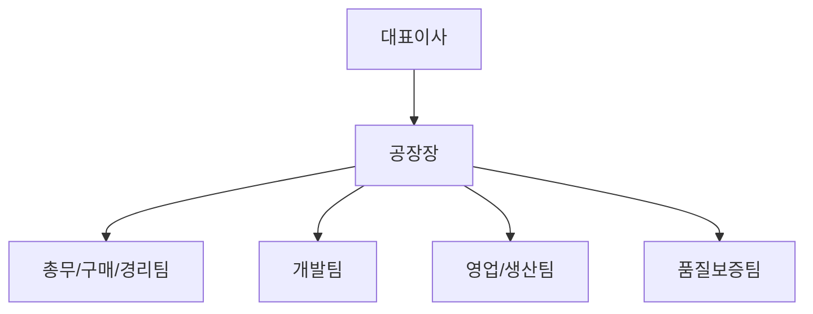
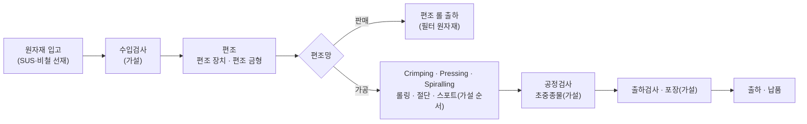
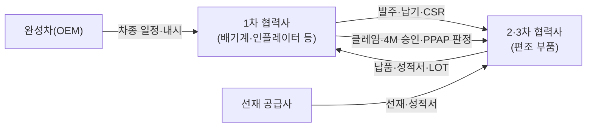
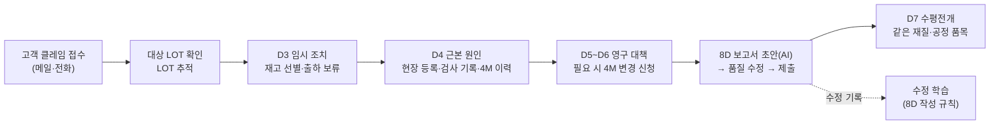

# 03. 첫 고객 (주)티알테크놀러지: 제조 팩 설계와 진단 준비

> 기준일 2026-10-02 · 상위 문서: [00 방향 정리](../research/00_direction.md) · 함께 읽을 문서: [01 디자인 레퍼런스](./01_design-references.md), [02 공통 모듈](./02_common-modules.md), [04 데이터 거버넌스](../research/04_data-governance.md), 모듈 레지스트리 [`config/worksite_modules.yaml`](../../config/worksite_modules.yaml), 회사 프로파일 [`clients/tr-technology/company_profile.yaml`](../../clients/tr-technology/company_profile.yaml)
>
> **이 문서의 역할:** [02 문서](./02_common-modules.md) 4.2절과 레지스트리가 "작성 중"이라고 적어 둔 **제조업 팩 설계 정본(초안)**입니다. 화면·엔티티·KPI·역할별 홈을 정하고, 첫 고객 진단 질문과 데모 데이터를 설계합니다.
>
> **표기**
> - **(공개)** 티알테크놀러지가 홈페이지·회사소개서에 직접 공개한 내용입니다. 공개 자료는 대부분 2016~2017년 기준이라 **현재 값은 진단에서 다시 확인**합니다.
> - **(가설)** 업계 일반 관행이나 공개 자료에서 추론한 내용입니다. TR에 대한 사실이 아닙니다. 진단에서 확인하기 전에는 화면 기본값으로만 씁니다.
> - **(예시)** 데모 데이터입니다. 가상의 거래처·품번·수치이며, 실제 회사 값이 아닙니다.
> - **(제안)** 이 문서가 권하는 기준값·설계입니다.
> - 출처 확인 상태(13장): ● 1차 출처(원문·공식 자료) 확인 · ◐ 2차 출처(해설·요약)만 확인 · ○ 확인 못 함
>
> **지킨 원칙:** 실존 인물 이름은 쓰지 않습니다(공개 자료에 있는 대표자 성명도 옮기지 않음). 데모 데이터에는 실존 기업명을 쓰지 않습니다. 티알테크놀러지 홈페이지 이미지와 로고는 저장소에 넣지 않습니다.

---

## 0. 한눈에 보기

1. **회사 표기는 '주식회사 티알테크놀러지(TR TECHNOLOGY CO.,LTD)'입니다.** 사용자는 '티알테크놀로지'로 적었지만 홈페이지·회사소개서·기업정보 사이트 모두 '테크놀러지'입니다[1][7][8]. 경남 양산 산막공단에서 **편조(knitted wire mesh) 롤과 편조 압축 성형 부품**을 만드는 자동차 부품 회사입니다(공개).
2. **공개 자료가 오래됐습니다.** 홈페이지 저작권 표기는 2016년, 회사소개서 표지는 2016.06입니다. 두 자료의 편조기 대수가 **36대(홈페이지)와 57대(회사소개서)**로 다릅니다. 인원도 2016년 3월 13명이 마지막 공개 값입니다[5][7]. 현재 인원·고객·시스템은 모두 진단 항목입니다.
3. **회사가 스스로 내건 목표가 업무사이트의 첫 가치 제안입니다.** 회사소개서의 '품질보증 운영체계' 7개 항목 중 하나가 **"품질경영관리 전산화 구축"**이고, 품질 비전은 **"전사적인 품질 활동을 통한 Single PPM 실현"**입니다[3][7]. 그래서 첫 파일럿은 **품질(부적합·클레임·8D·4M) + 현장 등록 + 설비 점검 + 안전보건**을 먼저 하고, 수주·생산·자재는 그다음에 붙입니다(8.2절).
4. **제조 팩은 레지스트리의 6개 모듈 + 안전보건 + LOT 추적 화면으로 정합니다.** 기준정보, 수주·납품, 생산(계획·작업지시·실적), 품질, 설비·보전, 자재·재고·구매, 안전보건이고, LOT 추적은 모듈을 가로지르는 화면입니다(5장). 레지스트리에 없는 엔티티 22개(1차 파일럿 8 · 2차 12 · 나중 2)와 위젯 12개를 추가로 제안합니다(5.10절).
5. **소규모 2·3차 협력사에 실제로 걸리는 요구는 네 갈래입니다.**
   - 고객 품질 요구: IATF 16949를 받은 1차 협력사는 공급자에게 최소 ISO 9001 인증을 요구하고 IATF 수준으로 단계적으로 끌어올려야 합니다(8.4.2.3, 규격 원문이 유료라 해설 기준)[12]. PPAP·4M 변경 신고·8D·LOT 추적이 여기서 나옵니다.
   - 안전보건 법령: 중대재해처벌법(상시 5명 이상) 시행령 제4조 9개 항목과 반기 점검, 2026-06-01 시행된 위험성평가 개정(근로자 참여·결과 공유·3년 보존), 프레스·전단기 안전검사(설치 후 3년 안 최초, 이후 2년마다)입니다[20]~[24].
   - 거래 조건: 납품대금 연동제(주요 원재료 가격 변동분 반영)와 60일 지급기일입니다[26]. SUS 선재 가격이 원가에 크게 걸리는 업종이라 구매·경리 화면에 원재료 가격 기록을 둡니다(가설).
   - 정부 지원: 2026년 정부형 스마트공장은 고도화만 지원하고, 기초 단계는 지자체(경남 기초구축 최대 1.2억 원)가 맡습니다[27][28]. 경남 스마트공장 컨설팅 추가모집은 **2026-10-08 마감**입니다[29].
6. **역할별 홈은 공개 조직도 6개 단위에 맞춰 만듭니다**(대표, 공장장, 품질보증팀, 영업/생산팀, 총무/구매/경리팀, 개발팀 + 현장 작업자 모바일). 홈마다 "아침에 3초 안에 답해야 할 질문"을 먼저 정하고 위젯 6~8개를 고릅니다(7장).
7. **작은 회사라서 생기는 설계 조건이 있습니다.** 2016년 기준 13명이었다면 한 사람이 여러 역할을 맡고, 팀 단위 집계(5명)·ARA 복지 집계(10명) 최소 인원에 걸려 대부분의 집계가 합쳐지거나 숨겨집니다. 생산 실적의 작업자 기록은 **개인 평가에 쓰지 않고 공정·설비 단위로만** 보여 줍니다(2.3절, 11장).
8. **진단 질문 62개와 데모 데이터 설계를 준비했습니다**(9장, 10장). 데모는 '예시' 접두어의 가상 거래처 6곳·공급사 5곳, 공개 제품 카테고리 기반 품번 체계, 2026년 7~9월 3개월치 시나리오 5개로 구성합니다.

---

## 1. 회사 개요 (공개 사실)

### 1.1 기본 정보

| 항목 | 공개 값 | 출처 | 비고 |
|---|---|---|---|
| 회사명 | 주식회사 티알테크놀러지 / TR TECHNOLOGY CO.,LTD | [1][7] ● | 사용자 표기 '티알테크놀로지'와 다름. 화면에는 고객이 확인한 표기를 씀 |
| 설립 | 2011-12-08 (주식회사 태성엔테크) | [1][2] ● | 2016-02 (주)티알테크놀러지로 상호 변경 |
| 자본금 | 350백만 원 | [1][7] ● | 현재 값 확인 필요 |
| 사업 분야 | 자동차 부품(Knitted Mesh & Parts) | [1][7] ● | 기업정보 사이트: 업종 '그 외 기타 금속가공업', 주요 제품 '일반기계, 자동차부품'[8] ◐ |
| 사업장 | 경상남도 양산시 산막공단북13길 38(산막동). 대지 4,032㎡, 건평 1,902㎡ | [1][7] ● | 회사소개서 표기는 '산막일반산업단지 북13길 38' |
| 대표 연락처 | 전화 055-785-3699, 팩스 055-785-0125, 메일 trtechnology@daum.net | [1][7] ● | **팩스가 있고 대표 메일이 daum.net** → 팩스 발주와 다음 메일 사용 가능성(가설, 진단 G1·B4) |
| 슬로건 | "신사고로 고객에게 다가 서자" / "We Create Customer Value With Knitted Mesh Technologies" / "KNITTED MESH SOLUTION PROVIDER" | [7] ● | 보이스·톤 단서(프로파일 `voice`) |
| 홈페이지 언어 | 국문·영문·중문, 회사소개서도 3개 언어 | 홈페이지 첫 화면 ● | 해외 고객 대응 흔적(가설: 현재 수출 여부는 진단 B6) |

### 1.2 연혁 (공개)

| 시기 | 내용 | 출처 |
|---|---|---|
| 2011.12 | 주식회사 태성엔테크 설립 | [2][7] ● |
| 2012.06 | H/KMC MESH(류) 공급 | [2][7] ● 원문 표기. 'H/KMC'가 무엇을 가리키는지, 직접 납품인지 1차 협력사 경유인지는 공개 자료에 없음(진단 B2) |
| 2012.07 | 중국(북경/염성) KD부품 공급 | [2][7] ● |
| 2015.05 | ISO9001 품질시스템 구축 | [2][7] ● 인증 유효 여부는 확인 못 함 ○ |
| 2015.11 | 기술보증기금 벤처기업 등록 | [7] ● 회사소개서에만 있음. 현재 유효 여부 확인 못 함 ○ |
| 2015.12 | 양산 산막공단 신축공장 확장 이전 | [2][7] ● |
| 2016.02 | (주)태성엔테크 → (주)티알테크놀러지 상호 변경 | [2][7] ● |

### 1.3 인력 (공개된 마지막 값: 2016년 3월)

| 구분 | 계 | 임원 | 관리직 | 기술직 | 생산직 |
|---|---|---|---|---|---|
| 인원 | 13 | 2 | 3 | 2 | 6 |

- 출처: 회사소개서 5쪽 '인력 구성(2016년 03월 현재)'[7] ●. 성별 구성도 공개돼 있지만 업무사이트 설계에 필요 없어 옮기지 않았습니다.
- **현재 인원은 확인 못 함 ○.** 인원에 따라 중대재해처벌법(5명 이상), 안전보건관리담당자(제조업 20~50명 미만), 노사협의회(30명 이상), ARA 복지 집계(10명 이상) 적용이 모두 갈립니다(진단 A1).

### 1.4 비전·품질방침 (공개)

- **미션:** "혁신적이고 경쟁력 있는 KNITTED MESH SOLUTION을 제공함으로써 자동차 부품 제조 분야의 발전을 선도한다."[3][7] ●
- **네 기둥**[3][7] ●

| 기둥 | 문구 | 업무사이트에서 쓰는 곳 |
|---|---|---|
| VISION | 고객이 감동하는 자동차 부품 제조 전문 강소기업 | 회사 소개 |
| QUALITY | 전사적인 품질 활동을 통한 **Single PPM 실현** | 대표 홈 품질 위젯의 목표선(K06 고객 PPM < 10, 제안) |
| PRODUCT | 혁신적이고 경쟁력 있는 가치 창출을 통한 고객 만족 실현 | 회사 소개 |
| R&D | 고객, 전문기관과 상호신뢰를 바탕으로 유기적인 협력 관계 구축 | 개발팀 홈(신규 품목 개발) |

- **품질방침(홈페이지 비전 페이지):** 새로운 제조기술의 개발·적용, ISO9001/14001 품질환경시스템, ISO TS16949 인증 등 품질보증 시스템 구축(예정)을 통해, 품질방침을 "신사고로 고객에게 다가서자"로 정하고 품질·납기·가격 면에서 더 좋은 조건을 제공하겠다는 내용입니다[3] ●.
  - ISO/TS 16949는 2016년 10월 IATF 16949:2016으로 대체됐고, 기존 TS 인증은 2018-09-14 이후 효력이 없습니다[11] ◐. 따라서 지금 확인할 것은 **IATF 16949 인증 여부**입니다(진단 C1).
- **'고객 만족 추구' 도식의 품질보증 운영체계 7개 항목**[3][7] ●: 전사적 참여와 활동(가운데), 적극적 고객요구반영, **품질경영관리 전산화 구축**, 협력업체 품질관리지도, 품질보증 시스템 구축, 연구개발 협업체제 강화, 지속적 품질개선운동 전개.
  - 이 7개 항목은 제조 팩 모듈과 거의 1:1로 대응합니다. 진단 첫 회의에서 "회사가 2016년에 적은 목표 중 지금 어디까지 왔나"를 묻는 출발점으로 씁니다.

| 운영체계 항목(공개) | 대응 모듈·화면 |
|---|---|
| 적극적 고객요구반영 | 수주·납품, 고객 클레임, 고객 요구 문서(PPAP·CSR) |
| 품질경영관리 전산화 구축 | 제조 팩 전체(특히 품질) |
| 협력업체 품질관리지도 | 자재 입고·수입검사, 공급사 평가(P2) |
| 품질보증 시스템 구축 | 품질 문서(관리계획서·PFMEA·검사기준서) 버전 관리, 4M 변경 |
| 연구개발 협업체제 강화 | 개발팀 홈(신규 품목 개발·APQP 템플릿 프로젝트) |
| 지속적 품질개선운동 전개 | 부적합 → 시정조치 → 수평전개, 현장 등록 |
| 전사적 참여와 활동 | 현장 등록(전원), 아차사고·의견, 회의 결정 → 업무 |

### 1.5 공개 자료의 한계

- 홈페이지 하단 저작권 표기가 2016년이고, 회사소개서 PDF는 표지 2016.06(파일 생성 2017-02)입니다[1][7]. **10년 가까이 갱신되지 않았을 수 있습니다.**
- 같은 시기 자료인데 편조기 대수(36대 / 57대)와 스포트기 유무가 다릅니다(3.2절). 어느 쪽이 최신인지 알 수 없습니다.
- 고객사 이름, 매출, 현재 인원, 인증 유효 여부, 사용 시스템은 공개 자료에 없습니다. 인터넷 검색(기업정보·채용 사이트)으로도 현재 인원을 확인하지 못했습니다 ○.

---

## 2. 조직 → 업무사이트 역할

### 2.1 공개 조직도

출처: 홈페이지 조직도, 회사소개서 5쪽[4][7] ●. 네 팀이 모두 공장장 아래에 있습니다. **영업과 생산이 한 팀**이라 수주 → 생산계획이 한 팀 안에서 이어집니다(공개 조직도에서 읽히는 구조).

### 2.2 역할 매핑 (가설, 진단에서 확정)

플랫폼 역할(owner·admin·reviewer·member)과 홈 프리셋은 레지스트리 정의를 따릅니다.

| 조직 단위(공개) | 플랫폼 역할 | 홈 | 주로 쓰는 모듈 | 승인하는 것(가설) |
|---|---|---|---|---|
| 대표이사 | owner | 대표(7.1) | 홈, 리포트, 안전보건 반기 확인 | 4M 변경 최종, 반기 안전 점검 확인, 원재료 가격·단가(L2) |
| 공장장 | reviewer (+ 안전보건 승인 위임 가능) | 공장장(7.2) | 생산, 설비, 현장 등록, 품질 요약 | 작업지시, 부적합 처분, 고장 수리 완료, 위험성평가 조치 확인 |
| 품질보증팀 | reviewer(팀장) / member | 품질(7.3) | 품질 전체, LOT 추적, 계측기 | 검사 판정, 8D 제출, 4M 변경 1차 검토 |
| 영업/생산팀 | reviewer(팀장) / member | 영업·생산(7.4) | 수주·납품, 생산계획·실적, 메일 연결 | 수주 확정, 출하 |
| 총무/구매/경리팀 | admin / member | 총무·구매·경리(7.5) | 자재·구매, 법정 일정, 구성원·연동 관리 | 발주, 입고 확인 |
| 개발팀 | reviewer / member | 개발(7.6) | 기준정보, 신규 품목 개발 프로젝트, 금형·지그, 작업표준 | 품목·공정 기준정보 변경, 작업표준 개정 |
| 생산직(2016 공개 구성) | member(모바일 중심) | 현장(7.7) | 현장 등록, 오늘 작업지시, 점검표, 초중종물 입력 | — |

- 공장장이 산업안전보건법상 **안전보건관리책임자·관리감독자** 역할을 맡는지는 확인 못 함 ○(진단 A3). 맡는다면 위험성평가·반기 점검의 실무 승인자가 됩니다.
- 금액·단가 필드(L2)는 역할이 아니라 **권한 묶음 `view_prices`**로 따로 줍니다(제안). 대표, 영업 담당 reviewer, 경리 담당만 받습니다. 레지스트리 `mfg-orders.permission_notes`(owner·영업 reviewer만)보다 한 단계 넓혀 경리 담당을 포함합니다.

### 2.3 작은 조직에서 생기는 설계 조건 (가설 → 진단 A1·A2)

| 조건 | 업무사이트 처리 |
|---|---|
| 한 사람이 여러 역할(예: 총무 + 구매 + 경리, 영업 + 생산계획) | 구성원 1명에 역할·팀 여러 개 허용(`org-members` 겸직). 홈은 주 역할 프리셋 + 부 역할 위젯 추가 |
| 결재자가 1~2명에 몰림 | 대결(代決) 지정, 검토 대기 7일 경과 알림 |
| 팀 인원이 5명 미만 | 팀 단위 집계(ONA·검사 분포)는 인접 팀과 합침([04 문서](../research/04_data-governance.md) 8.2절) |
| 전사 인원이 10명 미만일 수 있음 | ARA 복지 집계 위젯 자체를 숨김(레지스트리 `ara-aggregate`) |
| 현장 인원은 PC가 없고 장갑을 낌(가설) | 모바일 우선, 사진 1장 + 한 줄, 큰 버튼, 선택지 위주 입력(01 문서 6.11절) |
| 생산 실적에 작업자가 기록됨 | 대시보드는 공정·설비 단위 집계만. 개인별 실적 순위·비교 화면은 만들지 않음. 인사평가 사용 금지(11장) |

---

## 3. 공정·설비·제품·소재

### 3.1 공정

**공개된 두 단계**[5][7] ●

1. **편조(Knit wire):** 편조 장치로 금속 선재를 짜서 Fine / Medium / Standard mesh 등 다양한 형태의 편조망을 만듭니다. 회사소개서에는 '편조 금형'이 함께 나옵니다.
2. **가공(Processing):** Crimping 가공, Pressing 가공, Spiralling 가공. 각각 적용 부품 사진이 있습니다.

**전체 흐름 (공개 단계 + 가설 단계)**

- 굵은 단계(편조, 가공 세 종류, 편조 롤 판매)는 공개 자료에 있습니다. **수입검사·초중종물·출하검사·포장과 가공 단계 순서는 업계 일반 흐름에 맞춘 가설**입니다(진단 C4·D6).

### 3.2 설비 (공개 자료 두 가지 비교)

| 설비 | 홈페이지 '공정설비'[5] | 회사소개서 2016.06[7] | 업무사이트 처리 |
|---|---|---|---|
| 편조 장치(Knitting Machine) | 36대 | **57대** | 설비 대장 초안. 현재 대수 확인 필요(진단 D1) |
| 프레스 50ton | 1대 | 1대 | 법정 안전검사 대상 후보(4.4절) |
| 프레스 20ton | 1대 | 1대 | 〃 |
| 프레스 10ton | 3대 | 3대 | 〃 |
| 전용기 | 4대 | 4대 | 용도 확인 필요 |
| 롤링기 | 3대 | 3대 | 산업안전보건법상 '롤러기'와 같은 설비인지 확인 필요 |
| 절단기 | 2대 | 2대 | '전단기'(안전검사 대상)에 해당하는지 확인 필요 |
| 스포트기 | (없음) | 2대 | 회사소개서에만 있음 |

- 회사소개서에는 설비 제조사 이름도 적혀 있지만 업무사이트 설계에 필요 없어 옮기지 않았습니다.
- 공개된 설비 수만 봐도 **편조기가 압도적으로 많습니다.** 대수가 많은 동일 설비는 "설비 그리드"(대수만큼 칸을 깔고 상태를 글자 + 색으로 표시)가 맞습니다(5.3절 편조기 가동 현황판).

### 3.3 제품 (공개 카테고리)

| 구분 | 공개 표기 | 공개 설명 | 업계 일반 용도(조사) |
|---|---|---|---|
| 편조 롤 | Knitted Mesh Roll | 필터 Media와 같이 특정 부품을 제조하기 위한 원재료 상태의 제품[6][7] ● | — |
| 편조 부품 | Knitted Mesh Forming Parts | 편조망을 압축 성형한 소음저감, 충격완화(완충), Sealing, Filter, Breather 용도 제품[6][7] ● | 고밀도 압축 메시 와셔·가스켓·실(밀도 범위를 설계, 치수 공차 관리)[10] ◐ |
| 자동차용 | Airbag Filters | [6][7] ● | 에어백 가스 발생기의 필터·냉각재[9] ◐ |
| 자동차용 | Spacer Rings & Air Gap Seals | [6][7] ● | — |
| 자동차용 | Silencer & Muffler Packing | [6][7] ● | — |
| 자동차용 | Separation Rings | [6][7] ● | — |
| 자동차용 | Catalytic Converter Mesh Wraps / Catalytic Converter Seals | [6][7] ● | 배기계 슬라이딩 시트 링, 촉매 컨버터 베어링(지지)[9] ◐ |
| 자동차용 | Exhaust Decoupling Rings & Mesh Bellows Sleeves | [6][7] ● | 배기·엔진부 진동 댐퍼[9] ◐ |
| 자동차용 | Anti-Vibration, Sound Attenuation, Heat Shield 부품 | [6][7] ● | 히트실드 디커플링 요소, 음향·차폐[9] ◐ |
| 자동차용 | Engine Breathers, Air/Oil Separator, Oil Filter Cap 부품 | [6][7] ● | 밸브 커버의 오일 미스트 분리기[9] ◐ |
| 일반 산업용 | EMI Shielding Parts & Gaskets | 회사소개서 9쪽[7] ● | 전자파 차폐용 압축 메시 가스켓[10] ◐ |

- 업계 자료에 따르면 편조 메시는 스테인리스·구리·알루미늄 등 0.03~1.0mm 선재로 만들고, 실링 코드는 최고 1,100℃까지 견디는 용도도 있습니다[9] ◐. 압축 메시 부품은 밀도(체적비 약 10~70%)와 치수(예: ±0.5mm)를 설계·관리합니다[10] ◐(해외 제조사 제품 사양 예시, TR 사양 아님).
- 공개 제품군은 **배기계(촉매·디커플링·머플러) 비중이 큰 구성**으로 보입니다. 내연기관 차량용 부품인지, 전동화 이후에도 남는 제품(에어백 필터, 히트실드·방진, EMI 가스켓)이 얼마인지는 경영 판단에 중요한 질문입니다(가설, 진단 B8).

### 3.4 소재 (공개)

| 구분 | 공개 값[6][7] ● |
|---|---|
| Stainless Steel Grade | 304, 316, 321, 310S |
| Non Ferrous Grade | Copper, Aluminium, Brass, Tinned Copper |
| 기타 | Order Grade(주문 사양) |

### 3.5 데이터 모델에 주는 시사점 (가설 → 진단 C·D·E)

1. **재질 혼입이 가장 비싼 실수일 가능성이 큽니다.** 304·316·321·310S 선재는 눈으로 구별이 어렵고, 배기계 고온 부품은 재질 등급이 성능에 직결됩니다. 그래서 다음을 둡니다.
   - 입고 시 재질·히트번호·성적서(EN 10204 3.1 같은 제조사 검사증명서는 배치별 화학성분·기계적 성질과 히트번호를 담음[30] ◐)를 필수 입력으로 둡니다.
   - 편조기에 선재를 걸 때 원자재 LOT를 작업지시에 연결합니다.
   - 재질마다 색 + 글자 라벨 규칙을 둡니다(색만으로 구별하지 않음).
2. **품목 속성이 일반 부품사와 다릅니다.** 선경(mm), 메시 종류(Fine/Medium/Standard), 편조 폭, 롤 길이·중량, 압축 부품 치수(외경·내경·높이), 목표 중량·밀도, 적용 카테고리(3.3절)를 품목 마스터에 둡니다.
3. **편조 조건이 품질을 좌우합니다.** 선경·편조 폭·밀도 같은 조건표(작업표준)를 버전 관리하고, 바꾸면 4M 변경(Method·Machine)으로 이어지게 합니다.
4. **에어백 필터는 안전 관련 부품입니다.** 고객이 특별특성으로 지정했을 가능성이 있어(가설), 해당 품목은 LOT 추적·검사 기록 보존을 더 엄격하게 설정할 수 있게 `special_char` 표시를 둡니다(진단 C10).
5. **편조 롤은 완제품이면서 사내 반제품입니다.** 판매용 롤과 가공 투입용 롤을 같은 품목, 다른 LOT 흐름으로 다룹니다.

---

## 4. 업계 맥락: 소규모 자동차 부품 2·3차 협력사의 일

> 이 장은 업계 일반 조사입니다. TR이 몇 차 협력사인지, 어떤 요구를 받는지는 확인 못 함 ○(진단 B1·C1).

### 4.1 공급망과 주문 흐름

- 현대·기아는 2017년 발표에서 300곳 이상의 1차 협력사와 **직접 거래가 없는 5천 곳 이상의 2·3차 협력사**를 언급했고[18] ●, 2025년 보도도 2·3차 협력사를 5,000여 개사로 적었습니다[19] ◐.
- 일반 흐름(가설): **완성차(OEM) → 1차 협력사(모듈·시스템: 배기계, 에어백 인플레이터 등) → 2·3차 협력사(편조 부품 같은 구성 부품)**. 2·3차 협력사는 1차 협력사의 발주·납기·품질 기준을 따릅니다.

### 4.2 품질 요구

| 요구 | 내용(조사) | 확인 상태 | 업무사이트 반영 |
|---|---|---|---|
| IATF 16949 | ISO 9001을 기반으로 자동차 산업 요구를 더한 품질경영시스템. TS 16949를 2016년 대체[11] | ◐ | 인증 상태·심사 일정을 회사 정보·법정 일정에 |
| 공급자 QMS 개발(8.4.2.3) | IATF 인증 조직은 공급자에게 **최소 ISO 9001 인증**을 요구하고, 위험 기반으로 목표 수준을 정해 IATF 16949 쪽으로 단계적으로 개발하게 해야 함(IATF 공인 해석, 2018-06-01)[12] | ◐(규격 원문 유료, 해설 기준) | 2·3차인 TR에는 **1차 고객이 ISO 9001 + 고객 요구를 요구할 가능성**(가설). 인증·감사 일정 관리 |
| PPAP | 부품 승인 절차. 설계 기록, 공정흐름도, PFMEA, 관리계획서, MSA, 치수 결과, 재료 시험, 초기 공정 연구, 외관 승인, 샘플, PSW 등 **18개 요소**, 제출 레벨 1~5. 낮은 레벨이어도 18개 요소는 모두 작성·보관[13] | ◐ | `PpapSubmission` 체크리스트(제안). 고객이 따로 정하지 않으면 레벨 3이 기본이라는 설명이 흔함(○ 원문 미확인) |
| APQP | 신제품 품질 계획(개념 → 설계 → 공정 → 검증 → 양산·피드백) | ◐(일반 지식) | 개발팀의 '신규 품목 개발' 프로젝트 템플릿(코어 `business-structure` 재사용) |
| 4M 변경 | 사람·설비·재료·방법(Man·Machine·Material·Method) 변경을 기록·공유하고, 고객에게 알리지 않는 '무단 변경(silent change)'을 막음. 한 해외 1차 부품사 지침은 품질 문제의 큰 원인으로 4M 변경 관리 실패를 꼽고, 변경 후 초기 제품 납품을 따로 관리함[15] | ◐ | `ChangeRequest4M`(제안): 고객 통보·승인, 초품 LOT, 적용일 |
| 8D | 고객 클레임 대응 보고 형식. D0 준비 → D1 팀 → D2 문제 정의 → D3 임시 조치 → D4 근본 원인 → D5 영구 대책 선정 → D6 실행·검증 → D7 재발 방지 → D8 마무리[14] | ◐ | 8D 보드(단계별 기한), 8D 보고서 = 산출물 → 수정 학습 |
| 초중종물 검사 | 작업 시작·중간·종료 시점의 제품을 검사해 공정 이상을 잡는 공정검사 관행 | ○(업계 관행, 고객 CSR로 확인) | 작업지시별 초·중·종 검사 입력과 실시율(K14) |
| LOT 추적 | 원자재 → 생산 → 출하를 LOT로 잇는 것. IATF 16949에 식별·추적성 보충 요구(8.5.2.1)가 있음 | ○(규격 원문 미열람, 조항 번호는 일반 지식) | LOT 규칙과 LOT 추적 화면(5.8절) |
| 품질 기록 보존 | IATF 16949 7.5.3.2.1: 법령·고객 요구를 충족하는 보존 정책 문서화. 기간은 원문·CSR 확인 필요([02 문서](./02_common-modules.md) 1.4절) | ◐ | 품질 모듈 보존 정책 설정 |
| 현대차·기아 SQ 인증 | 2·3차 협력사가 1차 협력사에 납품하려고 받는 공급자 품질인증이라는 설명. 업종(고무성형·도장·도금·전기전자·용접·주조·단조 등)과 필요 문서(공정흐름도·PFMEA·관리계획서·작업표준서·검사기준서·계측기 교정기록·부적합품 관리대장·변경관리 기록)가 거론됨[17] | ◐(개인 블로그, 공식 문서 인용 없음) | 편조·금속가공이 대상 업종인지, TR이 보유했는지 확인 필요(진단 C1). 문서 목록은 품질 문서 화면의 체크리스트 후보 |

### 4.3 거래·대금

| 제도 | 내용 | 확인 상태 | 반영 |
|---|---|---|---|
| 납품대금 연동제 | '주요 원재료'는 비용이 납품대금의 10% 이상인 원재료. 그 가격이 위탁·수탁기업이 10% 이내에서 협의한 비율 이상 변동하면 변동분에 연동해 납품대금을 조정(상생협력법 제2조 제12·13호)[26] | ● | `SupplyAgreement`(연동 약정)와 `PriceIndex`(원재료 가격 지표) 기록(L2). SUS 선재가 주요 원재료에 해당하는지는 진단 E4 |
| 납품대금 지급기일 | 물품 수령일부터 60일 이내 최단기간(상생협력법 제22조①)[26] | ● | 경리 홈의 매출채권 경과일 표시(P2, ERP 연동 시) |

### 4.4 안전보건

| 의무 | 내용 | 확인 상태 | 반영 |
|---|---|---|---|
| 중대재해처벌법 적용 | 상시 근로자 5명 미만 사업장은 제2장 적용 제외(제3조). 50명 미만 사업장은 공포 후 3년(2024-01-27)부터 시행(부칙 제1조)[20] | ● | 인원 확인 후 적용(진단 A1) |
| 안전보건관리체계 9개 항목 | 시행령 제4조: ① 안전·보건 목표와 경영방침 ② 전담 조직(500명 이상 등만) ③ 유해·위험요인 확인·개선 절차와 **반기 1회 이상 점검**(위험성평가로 갈음 가능) ④ 예산 편성·집행 ⑤ 안전보건관리책임자등에게 권한·예산, **반기 1회 이상 평가** ⑥ 안전관리자 등 배치 ⑦ 종사자 의견 청취 절차와 **반기 1회 이상 점검** ⑧ 중대산업재해 대비 매뉴얼과 **반기 1회 이상 점검** ⑨ 도급·용역·위탁 기준과 **반기 1회 이상 점검**[21] | ● | 반기 점검 체크리스트를 9개 항목 + 제5조(관계 법령 의무 이행 반기 점검, 유해·위험 작업 교육 반기 점검)로 구성. [02 문서](./02_common-modules.md) 1.4절에서 "원문 확인 필요"로 남긴 예산·매뉴얼·도급 항목의 점검 주기는 **⑧·⑨는 반기 1회 이상**, ④는 주기 없이 편성·집행으로 확인 |
| 위험성평가(2026 개정) | 2026-06-01 시행. 근로자 참여(사업장 순회 점검 방식 + 설문·면담 병행 가능), 근로자대표 요구 시 참여, 실시 전 일정과 실시 후 결과(유해·위험요인, 위험성 수준, 개선대책·이행 결과)를 근로자에게 알림, 결과 기록(실시 시기·담당자, 참여 근로자·근로자대표 포함)을 **3년 보존**. 최초평가(작업 시작 전), 정기평가(매년 1회 이상), 수시평가[22][23] | ● | `RiskAssessment`에 참여자·공유 기록 필드 추가(5.7절). 위험성평가 미실시 과태료 조항은 50명 미만 사업장에 **2028-01-01**부터 적용[22] ● |
| 안전보건관리담당자 | 제조업 상시근로자 20명 이상 50명 미만 사업장은 1명 이상 선임(겸직 가능, 선임·업무 수행 증빙 비치)[24] | ● | 인원이 20~50명이면 담당자 지정 칸과 업무 증빙 묶음 |
| 안전검사 | 프레스·전단기·롤러기(밀폐형 제외)·컨베이어·산업용 로봇 등은 안전검사 대상. 설치 후 3년 이내 최초, 이후 2년마다[23][24] | ●(세부 규격·형식은 고시 확인 필요 ○) | 설비 대장에 `legal_inspection_required`, 다음 검사일 D-day |
| 외국인근로자 기초안전보건교육 | 2026-07-07 개정 법률(공포 후 6개월 뒤 시행)의 적용례: 시행 이후 외국인근로자를 채용하는 경우부터 | ◐(부칙·적용례만 확인, 조문 본문 확인 필요) | 외국인 근로자가 있으면 교육 기록·다국어 현장 화면(진단 A4) |

### 4.5 스마트공장 지원사업과 CRATA의 위치

| 사업(2026) | 지원 조건 | 확인 상태 |
|---|---|---|
| 정부형 스마트공장 | 고도화만. 최대 9개월, 최대 2억 원, 50% 이내, 목표 수준 '중간1 이상'(KS X 9001-1 기준) | [27] ● |
| 지역특화형 | 정부는 고도화, 지자체는 기초 단계 예산을 매칭. 기초: 최대 6개월, 1억 원 내외 | [27] ● |
| 경남 스마트공장 기초구축 추가모집 | 최대 1.2억 원(도비 0.36억 · 시군비 0.36억 · 기업 0.48억), 최대 6개월. 접수 2026-09-03 ~ **09-30(마감)** | [28] ◐(요약 사이트, 경남TP 원문 확인 필요) |
| 경남 스마트공장 컨설팅 추가모집 | 기업당 800만 원(지방비 720만 · 기업 80만), 6개월 24회. 전문가 매칭, 현장·공정 분석, 로드맵, 제조 데이터 수집·연동. 접수 2026-09-15 ~ **10-08** | [29] ◐ |
| 제조DX 멘토단 활용지원 | 사전기획(최대 238만 원), **AX기획**(AI 도입 스마트공장 전략 컨설팅 8회, 최대 476만 원), 정부 85% | [27] ● |

- **CRATA 업무사이트는 MES가 아닙니다.** 설비 데이터 자동 수집(PLC·센서)은 범위 밖이고, 사람이 남기는 기록(검사·부적합·클레임·점검·안전)과 업무 흐름을 맡습니다(레지스트리 `mfg-production` 설명과 같음). 설비 자동 수집이 필요하면 지원사업으로 들이는 MES·센서와 **연동**합니다.
- 지원사업으로 들일 솔루션이 있으면 업무사이트는 그 위에 "회의·업무·산출물·AI 연결" 층으로 붙습니다. CRATA가 지원사업의 공급기업이 될지는 따로 정할 일입니다(12장).

### 4.6 정리: TR 업무사이트에 꼭 있어야 하는 것 (요구 → 모듈)

| 요구(출처) | 모듈 | 우선순위(제안) |
|---|---|---|
| Single PPM 목표, 품질경영관리 전산화(공개 비전) | 품질, 대표 홈 | 1차 파일럿 |
| 고객 클레임·8D 대응(업계 관행) | 품질 → 산출물·수정 학습 | 1차 |
| 4M 변경 무단 변경 방지(업계 요구) | 품질 | 1차 |
| 반기 안전 점검·위험성평가(법령) | 안전보건 | 1차 |
| 프레스 안전검사 일정(법령) | 설비 + 안전보건 | 1차 |
| 현장 이상 즉시 공유(제안) | 현장 등록 | 1차 |
| 납기 지키기(업계 관행) | 수주·납품 | 2차 |
| 생산 실적·생산일보(업계 관행) | 생산 | 2차 |
| 원자재 LOT·성적서·재질 혼입 방지(가설) | 자재·재고 | 2차 |
| LOT 역추적(업계 요구) | LOT 추적 | 2차(1차 파일럿에서는 클레임 상세에 수기 LOT 입력) |
| 원재료 가격 연동(법령) | 자재·구매(L2) | 2차 |
| PPAP·APQP(업계 요구) | 품질, 개발 | 나중(신규 품목이 있을 때) |

---

## 5. 제조 팩 모듈 정의 (정본 초안)

### 5.0 공통 규칙

1. **방식은 모두 혼합(hybrid)입니다.** ERP·MES가 있으면 그쪽이 원본이고 업무사이트는 읽기·요약·알림·링크입니다. 없으면 엑셀을 대신하는 경량 화면을 둡니다(레지스트리 `build_mode`).
2. **현장 입력은 30초 안에 끝나야 합니다(제안).** 사진 1장 + 한 줄 + 선택지 2~3개. 수량은 숫자 키패드. 나머지(공정·설비·품목)는 작업지시나 QR에서 자동으로 채웁니다(QR 라벨은 P2).
3. **LOT는 모든 기록의 열쇠입니다.** 검사·부적합·클레임·출하는 LOT 번호를 받습니다. 1차 파일럿에서는 수기 입력, 2차에서 선택·스캔으로 바꿉니다.
4. **AI는 초안까지입니다.** 분류 제안, 8D 초안, 생산일보 요약은 AI가 만들고, 판정·승인·제출은 사람이 합니다. AI가 만든 칸에는 'AI 초안' 표시를 붙입니다([02 문서](./02_common-modules.md) 1.4절 AI 기본법 행).
5. **데이터 등급은 [04 문서](../research/04_data-governance.md)를 따릅니다.** 이 장의 각 엔티티 끝에 기본 등급을 적었습니다. 고객 도면·단가·클레임 원문은 L2입니다.
6. **개인 평가 금지.** 작업자가 기록되는 엔티티(`ProductionResult.worker_ids`, `EquipmentCheck.checked_by` 등)는 공정·설비·팀 단위로만 집계합니다.
7. **레지스트리에 없는 것은 '추가 제안'으로 표시했습니다.** 엔티티 이름은 레지스트리 규칙(영문 PascalCase, 한글 라벨)을 따릅니다.

### 5.1 기준정보 `mfg-master-data`

**목적:** 품목·공정·재질·설비 종류를 한 번 정해 나머지 모듈이 같은 이름을 쓰게 합니다.

| 화면 | 유형 | 누가 | 핵심 동작 | 단계 |
|---|---|---|---|---|
| 품목 목록 | 목록(필터: 종류·재질·고객·적용 카테고리) | 전원 조회, 개발·품질 편집 | 검색, 엑셀 가져오기 | 1차 |
| 품목 상세 | 상세(탭: 기본·고객 품번·공정·검사기준·문서·변경 이력) | 〃 | 고객 품번 연결, 도면 링크(L2) | 1차 |
| 공정 라우팅 | 표 | 개발·공장장 | 품목별 공정 순서·설비 종류 | 2차 |
| 작업표준·편조 조건표 | 문서 목록 + 버전 | 개발 편집, 공장장 승인 | 개정 시 4M 변경 생성 제안 | 2차 |

**엔티티**

- `Item` 품목(레지스트리) + 추가 필드: `wire_dia_mm`, `mesh_grade`(Fine·Medium·Standard·기타), `knit_width_mm`, `form_process`(crimping·pressing·spiralling·none), `dims`(외경·내경·높이 등 JSON), `target_weight_g`, `density_spec`, `application_category`(3.3절 공개 카테고리), `special_char`(특별특성 여부), `drawing_ref`(L2 링크) · L1(도면 링크만 L2)
- `ProcessStep` 공정(레지스트리) + `inspection_points`(초·중·종 검사 대상 여부) · L1
- `Bom`(레지스트리) · L1
- **추가 제안** `Routing` 공정 라우팅: item_id, seq, process_step_id, equipment_kind, std_ref · L1
- **추가 제안** `MaterialGrade` 재질 등급: code(304·316·321·310S·Cu·Al·Brass·TCu·주문), label, color_tag, text_tag, heat_resistant_note · L0
- **추가 제안** `ItemCustomer` 품목-고객 품번: item_id, partner_id, customer_part_no, customer_rev, ppap_status · L2(고객 품번·리비전은 고객 정보)
- **추가 제안** `WorkStandard` 작업표준·조건표: item_id, equipment_kind, version, params(JSON: 선경·게이지·폭·밀도 등), approved_by, approved_on, doc_ref · L2(공정 노하우)

### 5.2 수주·납품 `mfg-orders`

**목적:** 약속한 날에 약속한 수량을 보내는지 한 화면에서 봅니다.

**흐름(가설):** 발주 수신(메일·팩스·고객 포털·전화) → 수주 등록 → 재고 차감 후 생산 필요량 → 작업지시 → 출하검사 → 출하·거래명세서·성적서 → 고객 수령·불량 피드백

| 화면 | 유형 | 누가 | 핵심 동작 | 단계 |
|---|---|---|---|---|
| 수주 목록 | 목록(기본 정렬: 납기 빠른 순) | 영업/생산, 공장장, 대표 | 상태 필터, 납기 D-day | 2차 |
| 수주 등록·상세 | 입력·상세 | 영업/생산 | 품목·수량·납기, 고객 발주번호, 첨부(발주서 PDF·팩스 사진) | 2차 |
| 발주서 → 수주 후보 | 제안 카드 | 영업/생산 | 메일·팩스 이미지에서 AI가 품목·수량·납기 추출 → 사람이 확인(L2 → 국내 경로) | 2차 |
| 내시(예상 발주) | 표(품목 × 주) | 영업/생산 | 고객 예상 물량 입력·비교 | P2 |
| 출하 예정 보드 | 보드(오늘·내일·이번 주) | 영업/생산, 품질 | 출하검사 완료 여부, LOT 선택 | 2차 |
| 출하 등록 | 모바일 입력 | 영업/생산 | 수량, LOT, 사진(포장 상태), 거래명세서 출력 | 2차 |
| 납기 리포트 | 리포트 | 대표, 공장장 | 고객별 납기준수율(K05), 지연 사유 | 2차 |

**엔티티**

- `SalesOrder`(레지스트리) + `source`(메일·팩스·포털·전화), `attachment_refs` · L2(고객 발주 조건)
- `SalesOrderLine`(레지스트리) + `promised_date`, `unit_price`(L2, `view_prices` 권한만), `shipped_qty`, `late_reason` · L2
- `Shipment`(레지스트리) + `outgoing_inspection_id`, `packing_photo_refs`, `doc_refs`(거래명세서·성적서) · L1
- **추가 제안** `Forecast` 내시·예상 발주: partner_id, item_id, period, qty, received_on, source · L2

**산출물(코어 `documents`):** 거래명세서, 출하 검사성적서. 고객별 양식이 다르면 양식을 등록하고 수정 학습 대상에 넣습니다.

### 5.3 생산: 계획·작업지시·실적 `mfg-production`

**목적:** 오늘 무엇을 몇 개 만들고, 실제로 몇 개 만들었고, 무엇이 멈췄는지 봅니다.

| 화면 | 유형 | 누가 | 핵심 동작 | 단계 |
|---|---|---|---|---|
| 주간 생산계획 | 그리드(품목 × 일자) | 영업/생산, 공장장 | 수주 잔량에서 끌어오기, 설비 배정 | 2차 |
| 작업지시 목록·발행 | 목록 | 영업/생산 | 발행, 원자재 LOT 연결, 작업지시서 출력(라벨은 P2) | 2차 |
| 실적 입력 | 모바일 입력 | 생산직 | 작업지시 선택 → 양품·불량 수량, 불량 유형, LOT, 정지 시간, 사진 | 2차 |
| **편조기 가동 현황판** | 설비 그리드(대수만큼 칸) | 공장장, 생산직 | 칸마다 '가동·정지·고장·준비' 글자 + 색. 근무조별 한 번 탭으로 상태 변경 | 1차(설비 모듈과 공유) |
| 생산일보 | 자동 집계 + AI 요약 → 공장장 확인 | 공장장, 대표 | 계획 대비 실적, 불량, 정지, 특이사항. 확인 후 PDF·엑셀 | 2차 |
| 생산 리포트 | 리포트 | 대표, 공장장 | 계획 달성률(K01), 공정 불량률(K03), 가동률(K02) | 2차 |

**엔티티**

- `WorkOrder`(레지스트리) + `material_lot_ids`, `std_ref`(작업표준 버전), `shift`, `lot_no` · L1
- `ProductionResult`(레지스트리) + `shift`, `start_at`, `end_at`, `downtime_min`, `defect_breakdown`(유형별 수량 JSON) · L1. `worker_ids`는 집계 화면에 쓰지 않음
- **추가 제안** `EquipmentRunLog` 설비 가동 기록: equipment_id, date, shift, status(가동·정지·고장·준비), reason, recorded_by · L1
- **추가 제안** `DailyReport` 생산일보: date, summary(AI 초안), metrics(JSON), confirmed_by, confirmed_at, artifact_id · L1

### 5.4 품질 `mfg-quality`

**목적:** 불량을 빨리 잡고, 고객 클레임에 기한 안에 답하고, 같은 문제가 다시 나지 않게 합니다. **1차 파일럿의 중심 모듈입니다.**

| 화면 | 유형 | 누가 | 핵심 동작 | 단계 |
|---|---|---|---|---|
| 품질 홈 | 대시보드 | 품질보증팀 | PPM 추이, 미결 클레임·8D 기한, 검사 대기, 4M 진행 | 1차 |
| 검사 대기 큐 | 목록(수입·출하) | 품질보증팀 | 입고·출하 예정 LOT별 검사 시작 | 2차 |
| 초중종물 입력 | 모바일 체크 | 생산직, 품질 | 작업지시별 초·중·종 판정, 측정값, 사진 | 1차(간이: 판정 + 사진) |
| 부적합 등록·처리 | 목록·상세 | 전원 등록, 품질 처분 | 처분(재작업·폐기·선별·특채), 조치 업무 생성 | 1차 |
| 고객 클레임 | 목록·상세 | 품질보증팀, 대표 조회 | 접수, 대상 LOT·수량, 임시 조치 기한, 8D 요구 기한 | 1차 |
| **8D 보드** | 칸반(D0~D8 열, 카드에 기한) | 품질보증팀, 공장장 | 단계 이동, 담당 배정(코어 `tasks`), 증빙 첨부 | 1차 |
| 8D 보고서 작성 | 산출물(고객 양식) | 품질보증팀 | AI 초안 → 사람 수정 → 제출. 수정은 수정 학습 루프로 | 1차 |
| 4M 변경 대장·신청 | 목록·입력 | 개발·품질·공장장 | 변경 내용, 영향 품목, 고객 통보·승인, 초품 LOT, 적용일 | 1차 |
| PPAP 체크리스트 | 체크리스트(18요소) | 품질·개발 | 요소별 문서 링크·상태, 제출 레벨, PSW | P2 |
| 계측기 대장·검교정 | 목록 + 달력 | 품질보증팀 | 다음 검교정일, 성적서 첨부 | 2차 |
| 품질 문서 | 문서 목록(종류별) | 품질·개발 | 관리계획서·PFMEA·공정흐름도·검사기준서 버전 | 2차 |
| 월 품질 리포트 | 리포트(산출물) | 품질 → 대표 | 고객 PPM, 공정 불량 TOP 5, 클레임, 8D 기한 준수 | 1차 |

**엔티티**

- `Inspection`(레지스트리) + `kind`(수입·초물·중물·종물·출하·정기), `sample_size`, `judgement`, `photo_refs`, `work_order_id` · L1
- `Nonconformance`(레지스트리) + `disposition`(재작업·폐기·선별·특채), `qty_disposed`, `cost_estimate`(L2) · L1
- `CustomerClaim`(레지스트리) + `customer_ref_no`, `qty_affected`, `lot_nos`, `containment_due`, `report_8d_due`, `severity` · **L2**(고객 비밀)
- `CorrectiveAction`(레지스트리, method=8D 등) + `d_steps`(D0~D8 상태·완료일 JSON), `containment`, `verification`, `horizontal_deployment`(수평전개 대상 품목·공정) · L2(클레임 연계 시)
- **추가 제안** `InspectionStandard` 검사기준: item_id, kind, items(JSON: 항목·규격·방법·주기·샘플 수), version, approved_by · L2(고객 규격 포함 시)
- **추가 제안** `ChangeRequest4M` 4M 변경: id, category(Man·Machine·Material·Method), description, affected_item_ids, reason, risk_note, customer_notice_required, customer_approval_status(불필요·요청·승인·반려), ppap_required, initial_lot_no, effective_on, approvals · L2
- **추가 제안** `PpapSubmission` PPAP: item_id, partner_id, level, elements(18요소 상태 JSON), due_on, status, psw_signed_on · L2
- **추가 제안** `Gauge` 계측기: gauge_no, kind, range, location, cycle_months, last_calibrated_on, next_due_on, cert_ref, status · L1

**흐름: 클레임 → 8D → 4M (예시 시나리오 10.7절 S2)**

### 5.5 설비·보전 `mfg-equipment`

**목적:** 설비가 갑자기 서지 않게 점검하고, 서면 빨리 기록·수리하고, 법정 검사를 놓치지 않습니다.

| 화면 | 유형 | 누가 | 핵심 동작 | 단계 |
|---|---|---|---|---|
| 설비 대장 | 목록 + 그리드(종류별) | 공장장, 전원 조회 | 상태, 다음 점검·검사일 | 1차 |
| 설비 상세 | 타임라인(점검·고장·PM·법정 검사) | 공장장 | 이력 한눈에 | 1차 |
| 오늘 점검 | 모바일 체크리스트 | 생산직 | 작업 전 일상점검(설비 종류별 양식), 이상 시 사진 → 고장·현장 등록 | 1차 |
| 고장 등록·수리 | 입력·상세 | 생산직 등록, 공장장 완료 | 증상·정지 시작, 수리 내용, 정지 시간 자동 계산 | 1차 |
| PM 달력 | 달력 | 공장장 | 예방보전 계획·완료 | 2차 |
| 금형·지그 대장 | 목록(수명 게이지) | 개발·공장장 | 사용 횟수·수명 기준·보수 이력 | 2차 |
| 법정 검사 일정 | 목록(D-day) | 총무·공장장 | 프레스 등 안전검사, 합격증명서 첨부 | 1차(안전보건과 공유) |

**엔티티**

- `Equipment`(레지스트리) + `capacity`(톤수 등), `legal_inspection_required`, `next_legal_inspection_on` · L1
- `EquipmentCheck`(레지스트리) + `template_id`, `items_result`(JSON), `photo_refs` · L1
- `BreakdownRecord`(레지스트리) · L1
- **추가 제안** `CheckTemplate` 점검 양식: equipment_kind, items(JSON), version · L1
- **추가 제안** `PmPlan` 예방보전 계획: equipment_id, task, cycle(일·사용 횟수), last_done_on, next_due_on, owner_id · L1
- **추가 제안** `Tooling` 금형·지그: tool_no, kind(편조 금형·프레스 금형·지그), item_ids, use_count, life_limit, location, status, repair_log · L1(도면은 L2 링크)
- **추가 제안** `LegalInspection` 법정 검사: equipment_id, kind(안전검사 등), due_on, done_on, result, cert_ref · L1

### 5.6 자재·재고·구매 `mfg-materials`

**목적:** 선재가 떨어지기 전에 사고, 들어온 선재가 맞는 재질인지 확인하고, LOT를 남깁니다.

| 화면 | 유형 | 누가 | 핵심 동작 | 단계 |
|---|---|---|---|---|
| 입고 등록 | 모바일 입력 | 총무/구매 | 라벨·성적서 사진 → AI가 재질·선경·히트번호·수량 추출 → 사람 확인 → 수입검사 연결 | 2차 |
| 재고 현황 | 목록(재질 색 + 글자 라벨) | 구매, 영업/생산, 공장장 | LOT별 수량·위치, 재고일수 | 2차 |
| 안전재고 경고 | 목록 | 구매 | 미달 품목 → 발주 초안 | 2차 |
| 발주 | 목록·입력 | 구매 | 공급사·품목·수량·납기, 단가(L2) | 2차 |
| 원재료 가격 추이 | 차트(L2) | 대표, 경리 | 약정 기준 지표 입력, 변동률 계산, 연동 조건 도달 알림 | 2차 |
| 연동 약정 대장 | 목록(L2) | 대표, 영업, 경리 | 고객·공급사별 연동 대상 원재료, 기준 지표, 조정 요건 | 2차 |

**엔티티**

- `MaterialReceipt`(레지스트리) + `heat_no`, `cert_type`(EN 10204 3.1 등), `material_grade_verified`, `wire_dia_measured` · L1
- `StockLot`, `StockMovement`(레지스트리) · L1
- `PurchaseOrder`(레지스트리) + `unit_price`(L2) · L2
- **추가 제안** `SafetyStock` 안전재고: item_id, min_days 또는 min_qty, reorder_qty · L1
- **추가 제안** `PriceIndex` 원재료 가격 지표: index_name, period, value, unit, source · L2(약정과 묶여 쓰임)
- **추가 제안** `SupplyAgreement` 연동 약정: partner_id, direction(고객·공급사), material, index_name, threshold_pct, adjust_rule, valid_from · L2

### 5.7 안전보건 `safety-health` (공통 코어, 제조 팩이 켜면 자동으로 켬)

레지스트리 엔티티(`RiskAssessment`, `NearMissReport`, `WorkerOpinion`, `SemiannualReview`, `SafetyIncident`)는 그대로 쓰고, 2026 개정과 시행령 원문에 맞춰 다음을 고칩니다.

**필드 보강(제안)**

- `RiskAssessment` + `kind`(최초·정기·수시), `participants`(참여 근로자 수·근로자대표 참여 여부, 이름은 선택), `participation_method`(순회 점검·설문·면담), `shared_before_on`(실시 일정 공유일), `shared_after_on`(결과 공유일), `share_channel`(교육·설명회·게시·전자) → 시행규칙 제37조의2~4[23]. `worker_participation_note`는 이 필드들로 대체합니다.
- `SemiannualReview.item`을 자유 입력 대신 **시행령 제4조 3·4·5·7·8·9호 + 제5조 ②항 1·3호** 코드 목록으로 고정합니다. 반기 점검 규정이 없는 제4조 1·6호도 함께 확인하도록 넣었습니다(아래 표).

| 반기 점검 코드 | 근거[21] | 확인할 것 | 증빙 |
|---|---|---|---|
| SH-01 | 제4조 1호 | 안전·보건 목표와 경영방침 설정·게시(점검 주기 규정 없음, 반기 점검 때 함께 확인 제안) | 방침 문서, 게시 사진 |
| SH-03 | 제4조 3호 | 유해·위험요인 확인·개선 절차대로 됐는지(위험성평가로 갈음 가능) | 위험성평가 기록 |
| SH-04 | 제4조 4호 | 안전보건 예산 편성·집행 | 예산·집행 내역 |
| SH-05 | 제4조 5호 | 안전보건관리책임자등의 업무 수행 평가 | 평가표 |
| SH-06 | 제4조 6호 | 안전보건관리담당자 등 법정 인력 배치(해당 시. 점검 주기 규정 없음) | 선임 서류 |
| SH-07 | 제4조 7호 | 종사자 의견 청취·개선 이행 | 의견함·조치 기록 |
| SH-08 | 제4조 8호 | 비상 대응 매뉴얼대로 조치하는지 | 매뉴얼, 훈련 기록 |
| SH-09 | 제4조 9호 | 도급·용역·위탁 기준·절차 이행 | 평가 기준, 계약 |
| SH-L1 | 제5조 ②항 1호 | 안전·보건 관계 법령 의무 이행 | 점검표 |
| SH-L3 | 제5조 ②항 3호 | 유해·위험 작업 안전보건교육 실시 | 교육 기록 |

**추가 제안 엔티티**

- `TbmRecord` 작업 전 안전점검회의: date, area, topic, hazards_mentioned, attendee_count, photo_ref · L1. 법 제36조④ 후단(작업 전 안전점검회의 등으로 상시 주지, 노력 의무)[22]
- `LegalCalendarItem` 법정 일정: kind(반기 점검·위험성평가 정기·안전검사·법정 교육·작업환경측정·특수건강진단), basis, due_on, owner_id, status · L1. 작업환경측정·특수건강진단 해당 여부는 진단 F 항목에서 확인
- `SafetyBudget` 안전보건 예산: year, item, planned_krw, spent_krw · L2

| 화면 | 유형 | 누가 | 단계 |
|---|---|---|---|
| 안전 홈(법정 일정 D-day, 미조치 위험요인, 이번 달 아차사고) | 대시보드 | 대표, 공장장, 총무 | 1차 |
| 위험성평가(공정별 표: 요인 → 위험 수준 3단계 → 개선대책 → 이행 확인, 참여·공유 기록) | 표·상세 | 공장장, 담당 | 1차 |
| 아차사고·의견(익명 선택, 사진) | 모바일 입력 | 전원 | 1차(현장 등록과 같은 입구) |
| TBM 기록(30초) | 모바일 입력 | 공장장·반장 | 1차 |
| 반기 점검 체크리스트(SH 코드) | 체크리스트 + 증빙 링크 | 대표 확인 | 1차 |
| 산업재해 기록(최소 정보) | 상세 | 대표·총무만 | 1차 |

> 이 모듈은 **법 준수를 보장하지 않습니다.** 기록과 일정을 놓치지 않게 돕는 도구입니다. 법률 해석은 전문가 확인이 필요합니다(11장).

### 5.8 LOT 추적 (교차 화면 `/ops/trace`)

**목적:** 클레임이 오면 "어느 원자재 LOT로, 언제, 어느 설비에서 만든 것이 어느 고객에게 갔는가"를 앞뒤로 찾습니다. **목표(제안): 클레임 접수 후 대상 LOT 범위 확인 30분 이내.**

- **추가 제안** `LotLink` LOT 연결: parent_lot, child_lot, qty, process_step_id, linked_at · L1
- **LOT 번호 규칙(제안, TR 기존 규칙이 있으면 그대로 따름, 진단 C8)**

| 단계 | 형식(예시) | 비고 |
|---|---|---|
| 원자재 | `R-321-260915-01` | 재질-입고일-순번. 공급사 히트번호는 별도 필드로 보관 |
| 편조 | `K-KN07-260916-A` | 설비-생산일-근무조 |
| 가공 | `F-PR02-260917-003` | 공정·설비-생산일-순번 |
| 출하 | `S-260918-012` | 출하일-순번 |

### 5.9 공통 코어와의 연결 (CRATA다운 부분)

| CRATA 모듈([00 문서](../research/00_direction.md) 5장) | TR에서의 쓰임(가설) |
|---|---|
| ② 회의 | 주간 생산·품질 회의의 결정 → 업무(예: "SUS321 선재 공급사 2곳으로") → 4M 변경 신청으로 이어짐. 회의 분류 체계의 사업·프로젝트는 '고객별 양산', '신규 품목 개발', '품질 개선', '안전' 정도로 시작 |
| ③ 업무·배분 | 부적합 처분·8D 단계·고장 수리·위험성평가 개선대책이 모두 업무가 됨. 검토자는 공장장·품질 팀장 |
| ④ 산출물·수정 학습 | **8D 보고서, 월 품질 리포트, 생산일보, 출하 검사성적서**가 반복 산출물. 고객이 8D를 고쳐 돌려보내면 그 수정이 규칙 후보가 됨([08 문서](../research/08_correction-learning.md)). 첫 대상은 8D(제안) |
| ⑤ 메일 커넥터 | 고객 발주·클레임 메일 → 수주 후보·클레임 후보. 대표 메일이 daum.net이라 IMAP 경로 가능성(가설, 진단 G1) |
| ⑥ 지식 | 작업표준·조건표·검사기준·고객 CSR의 최신본 관리, 클레임 이력 검색 |
| ⑦ ARA MCP | 직원 각자의 AI에서 "오늘 내 점검표", "8D D4 근거 정리", "이번 주 납기 임박" 조회·초안 제출. 제출은 검토 대기로만 들어감 |
| ⑧ ARA 복지 | 생산직 포함 전원 대상. 인원이 10명 미만이면 집계 위젯 숨김. 교대 근무 직원 접근 시간대 고려(가설) |

### 5.10 레지스트리 반영 제안

[`config/worksite_modules.yaml`](../../config/worksite_modules.yaml)은 이 문서가 고치지 않았습니다. 레지스트리 관리자가 아래를 검토해 반영합니다.

1. 제조업 팩 주석의 "제조업 팩 설계 문서가 정본이다(작성 중)"를 이 문서(`docs/worksite/03_tr-technology.md` 5장)로 연결.
2. **엔티티 추가(22개):**
   - 1차 파일럿(8): `MaterialGrade`, `ChangeRequest4M`, `EquipmentRunLog`, `CheckTemplate`, `LegalInspection`, `TbmRecord`, `LegalCalendarItem`, `SafetyBudget`
   - 2차 파일럿(12): `Routing`, `ItemCustomer`, `WorkStandard`, `DailyReport`, `InspectionStandard`, `Gauge`, `PmPlan`, `Tooling`, `SafetyStock`, `PriceIndex`, `SupplyAgreement`, `LotLink`
   - 나중(2): `Forecast`, `PpapSubmission`
3. **위젯 추가(12개):** 7장 표의 `mfg-claims-8d`, `mfg-inspection-queue`, `mfg-4m-changes`, `mfg-calibration-due`, `mfg-pm-due`, `mfg-legal-calendar`, `mfg-monthly-summary`, `mfg-order-backlog`, `mfg-field-feed`, `mfg-first-mid-last`, `mfg-dev-projects`, `mfg-material-price`.
4. **권한:** `view_prices` 권한 묶음(단가·금액 필드 조회).
5. **안전보건:** `RiskAssessment` 필드 보강, `SemiannualReview.item` 코드 목록(5.7절). [02 문서](./02_common-modules.md) 1.4절의 "2026년 위험성평가 개정(○)" 행은 시행일 2026-06-01로 확인됨([22][23] ●).

---

## 6. KPI 정의

### 6.1 KPI 카탈로그

| ID | 지표 | 산식(제안) | 주기 | 원천 | 보는 사람 | 등급 | 단계 |
|---|---|---|---|---|---|---|---|
| K01 | 생산계획 달성률 | 기간 양품 실적 수량 ÷ 기간 계획 수량 × 100 (품목·공정별) | 일·주·월 | 생산 | 대표, 공장장, 영업/생산 | L1 | 2차 |
| K02 | 설비 가동률(대수 기준) | 근무조별 '가동' 상태 설비 수 ÷ 보유 설비 수 × 100. 편조기·프레스 따로 | 일 | 설비 가동 기록 | 공장장 | L1 | 1차 |
| K02b | 설비 종합효율(OEE) | 시간가동률 × 성능가동률 × 양품률[31] | 월 | 생산·설비 | 공장장 | L1 | P2(가동 시간 기록이 쌓인 뒤) |
| K03 | 공정 불량률 / 공정 PPM | 공정 불량 수량 ÷ (양품 + 불량) × 100 / × 1,000,000 | 일·월 | 생산·부적합 | 공장장, 품질 | L1 | 1차(부적합 기준) |
| K04 | 초중종물 검사 실시율 | 초·중·종 기록이 모두 있는 작업지시 ÷ 대상 작업지시 × 100 | 주 | 품질 | 품질, 공장장 | L1 | 1차 |
| K05 | 납기준수율(OTD) | 약속 납기일까지 전량 납품한 수주 라인 ÷ 기간 중 납기가 도래한 수주 라인 × 100 | 주·월 | 수주·납품 | 대표, 영업/생산 | L1 | 2차 |
| K06 | 고객 PPM | 고객이 불량으로 판정한 수량 ÷ 같은 기간 납품 수량 × 1,000,000. **고객별 산식이 다르면 고객 정의를 따름** | 월 | 클레임·출하 | 대표, 품질 | L2(고객별) | 1차(납품 수량은 수기 입력) |
| K07 | 클레임 건수 | 기간 접수 고객 클레임 수(고객별) | 월 | 품질 | 대표, 품질 | L2 | 1차 |
| K08 | 8D 기한 준수율 | 기한 안에 제출한 8D ÷ 요구받은 8D × 100 | 월 | 품질 | 품질, 대표 | L2 | 1차 |
| K09 | 시정조치 평균 종결 일수 | Σ(종결일 − 등록일) ÷ 종결 건수 | 월 | 품질·업무 | 품질, 공장장 | L1 | 1차 |
| K10 | 4M 변경 승인 대기 | 고객 승인 대기 건수, 최장 대기 일수 | 주 | 품질 | 품질, 개발, 대표 | L2 | 1차 |
| K11 | 원자재 재고일수 | 현재 재고 수량 ÷ 최근 30일 일평균 사용량 (재질별) | 일 | 자재 | 구매, 영업/생산 | L1 | 2차 |
| K12 | 안전재고 미달 품목 수 | 재고일수 < 안전재고 기준인 품목 수 | 일 | 자재 | 구매, 공장장 | L1 | 2차 |
| K13 | PM 계획 준수율 | 기한 안에 실시한 PM ÷ 기간 계획 PM × 100 | 월 | 설비 | 공장장 | L1 | 2차 |
| K14 | 고장 정지 시간 | Σ 고장 정지 분(설비 종류별), MTTR = 총 수리 시간 ÷ 고장 건수 | 주·월 | 설비 | 공장장 | L1 | 1차(정지 시간), MTTR은 2차 |
| K15 | 계측기 검교정 기한 초과 | 다음 검교정일이 지난 계측기 수 | 주 | 품질 | 품질 | L1 | 2차 |
| K16 | 위험성평가 개선대책 미이행 | 기한이 지난 미완료 개선대책 수 | 주 | 안전보건 | 대표, 공장장 | L1 | 1차 |
| K17 | 아차사고·개선 제안 신고 수 | 기간 신고 건수(많을수록 좋은 신호로 표시) | 월 | 안전보건 | 대표, 공장장 | L1 | 1차 |
| K18 | 법정 일정 D-day | 반기 점검·위험성평가 정기·안전검사·법정 교육 중 가장 가까운 것 | 상시 | 안전보건·설비 | 대표, 총무 | L1 | 1차 |
| K19 | 현장 등록 → 조치 리드타임 | Σ(조치 완료 − 등록) ÷ 건수(유형별) | 주 | 현장 등록·업무 | 공장장 | L1 | 1차 |
| K20 | AX 효과 | 8D 초안의 같은 수정 재발률, 생산일보 작성 시간, 1차 통과율([08 문서](../research/08_correction-learning.md)) | 월 | 산출물·수정 학습 | 대표, CRATA | L1 | 1차 |

### 6.2 지표 운영 원칙 (제안)

1. **기준선부터 잽니다.** 파일럿 첫 4주는 목표 없이 현재 값만 모읍니다. 진단 때 들은 숫자와 기록상 숫자가 다르면 둘 다 남깁니다([03 문서](../research/03_company-dna-playbook.md) say-do gap).
2. **'Single PPM'은 회사가 고른 목표라 대표 홈의 목표선으로 씁니다.** 백만 개당 한 자릿수(10 미만)로 해석하는 것이 일반적이나, 회사가 쓰는 정의(고객 PPM인지 공정 PPM인지)를 진단에서 확인합니다(진단 C5).
3. **무재해 일수는 홈에 크게 띄우지 않습니다.** 숫자를 지키려고 신고를 줄이는 유인이 생길 수 있어서입니다(제안). 대신 아차사고 신고 수(K17)와 미이행 개선대책(K16)을 보여 줍니다.
4. **개인 지표는 만들지 않습니다.** 모든 생산·품질 지표는 품목·공정·설비·고객 단위입니다.
5. **숫자 옆에 비교 기준을 붙입니다.** 지난달, 목표, 같은 달 작년 중 하나. 색만으로 좋고 나쁨을 표시하지 않고 ▲▼와 글자를 함께 씁니다([01 문서](./01_design-references.md) 3.5절).

---

## 7. 역할별 대시보드 (홈)

레지스트리의 프리셋(`ceo`·`lead`·`staff`·`staff_admin`)에 TR 조직 단위별 덮어쓰기를 더합니다. 덮어쓰기는 프로파일 `portal_hints.home_widgets_by_unit`에 둡니다. 위젯은 6~8개를 넘기지 않습니다.

**새 위젯(추가 제안)**

| id | 이름 | 데이터 | 모듈 |
|---|---|---|---|
| `mfg-claims-8d` | 클레임·8D | 미결 클레임, 8D 단계별 건수, 가장 급한 기한 | 품질 |
| `mfg-inspection-queue` | 검사 대기 | 수입·출하 검사 대기 LOT, 오래된 순 | 품질 |
| `mfg-4m-changes` | 4M 변경 | 진행·고객 승인 대기, 최장 대기 일수 | 품질 |
| `mfg-calibration-due` | 계측기 검교정 | 30일 안 도래·초과 | 품질 |
| `mfg-first-mid-last` | 초중종물 미실시 | 오늘 작업지시 중 기록 빠진 것 | 품질 |
| `mfg-pm-due` | 보전 일정 | 이번 주 PM, 지연 PM | 설비 |
| `mfg-legal-calendar` | 법정 일정 | 반기 점검·안전검사·정기 위험성평가·법정 교육 D-day | 안전보건·설비 |
| `mfg-monthly-summary` | 이달 요약 | 생산·출하 수량 추이, 계획 대비, 고객 PPM | 리포트 |
| `mfg-order-backlog` | 수주 잔량 | 품목별 미납 수량, 납기 분포 | 수주 |
| `mfg-field-feed` | 오늘 현장 등록 | 불량·설비 이상·아차사고 최신순, 미배정 수 | 현장 등록 |
| `mfg-dev-projects` | 개발 진행 | 신규 품목 개발 프로젝트 단계, PPAP 기한 | 개발(코어 프로젝트) |
| `mfg-material-price` | 원재료 가격 | 약정 기준 지표 추이, 연동 조건 도달 여부(L2) | 자재·구매 |

### 7.1 대표 (owner, `ceo` 프리셋 기반)

- **아침 질문:** "이번 주 약속(납기)을 지키나? 품질 사고가 있나? 사람 다칠 위험이 방치돼 있나? 원가에 영향 줄 일이 있나?"
- **위젯 순서:** 인사·오늘(`greeting`) → 납기 임박(`mfg-delivery-due`) → 품질 지표(`mfg-quality-ppm`, Single PPM 목표선) → 클레임·8D(`mfg-claims-8d`) → 안전보건 현황(`safety-status`) → 이달 요약(`mfg-monthly-summary`) → 검토 대기(`review-queue`: 4M 최종 승인, 반기 점검 확인) → 원재료 가격(`mfg-material-price`, L2)
- **알림:** 고객 클레임 접수, 8D 기한 D-2, 4M 고객 승인 결과, 반기 점검 D-14, 재해 발생
- **보지 않는 것:** 개인별 실적·근태 비교

### 7.2 공장장 (reviewer, `lead` 프리셋 + 제조 덮어쓰기)

- **아침 질문:** "오늘 라인이 정상인가? 어제 무엇이 멈췄나? 내가 결정해 줄 것이 무엇인가?"
- **위젯:** `greeting` → 오늘 생산(`mfg-production-today`) → 설비 상태(`mfg-equipment-status`: 편조기 그리드 요약) → 오늘 현장 등록(`mfg-field-feed`) → 검토 대기(`review-queue`: 부적합 처분·수리 완료·작업지시) → 납기 임박(`mfg-delivery-due`) → 법정 일정(`mfg-legal-calendar`) → 팀 업무 현황(`team-workload`, "평가용 아님" 표시)
- **알림:** 설비 고장 등록, 현장 등록 미배정 30분 경과, 초중종물 미실시, 위험성평가 개선대책 기한

### 7.3 품질보증팀

- **아침 질문:** "오늘 검사할 것은? 기한이 다가오는 8D·4M은? 어제 공정 불량이 튀었나?"
- **위젯:** `greeting` → 클레임·8D(`mfg-claims-8d`) → 검사 대기(`mfg-inspection-queue`) → 초중종물 미실시(`mfg-first-mid-last`) → 품질 지표(`mfg-quality-ppm`) → 4M 변경(`mfg-4m-changes`) → 계측기 검교정(`mfg-calibration-due`) → 내 업무(`my-tasks`)
- **알림:** 클레임 접수, 부적합 등록, 고객 4M 승인·반려, 검교정 D-7

### 7.4 영업/생산팀

- **아침 질문:** "오늘·이번 주 무엇을 내보내야 하나? 그에 맞게 만들고 있나? 자재가 모자라지 않나?"
- **위젯:** `greeting` → 납기 임박·출하 예정(`mfg-delivery-due`) → 수주 잔량(`mfg-order-backlog`) → 오늘 생산(`mfg-production-today`) → 자재 부족(`mfg-material-alert`) → 메일 후속 제안(`mail-followups`: 고객 발주·문의) → 내 업무(`my-tasks`)
- **알림:** 새 발주 메일(수주 후보), 출하검사 완료, 생산 지연(계획 대비 80% 미만)

### 7.5 총무/구매/경리팀 (admin, `staff_admin` 프리셋 + 제조 덮어쓰기)

- **아침 질문:** "오늘 들어올 자재는? 떨어져 가는 자재는? 놓친 법정 일정·서류는? 시스템에 문제는 없나?"
- **위젯:** `greeting` → 자재 부족(`mfg-material-alert`) → 법정 일정(`mfg-legal-calendar`) → 안전보건 현황(`safety-status`) → 결재 대기(`approvals-pending`, 연동 시) → 오늘 근무·휴가(`attendance-today`, 연동 시) → 운영 점검(`admin-health`) → 원재료 가격(`mfg-material-price`, `view_prices` 권한이 있을 때만)
- **알림:** 입고 예정일, 성적서 누락 입고, 안전검사 D-30, 법정 교육 미이수

### 7.6 개발팀

- **아침 질문:** "진행 중인 신규 품목은 어느 단계인가? 기한이 다가오는 고객 제출물은? 금형·지그 수명은?"
- **위젯:** `greeting` → 개발 진행(`mfg-dev-projects`) → 4M 변경(`mfg-4m-changes`, 기술 검토 대기) → 내 업무(`my-tasks`) → 회의와 내 액션(`upcoming-meetings`) → 보전 일정(`mfg-pm-due`, 금형·지그 항목만) → 최근 결정(`recent-decisions`)
- **알림:** 고객 사양 변경 메일, 작업표준 개정 승인 요청, 금형 수명 90% 도달

### 7.7 현장 작업자 (member, 모바일, `staff` 프리셋 + 제조 덮어쓰기)

- **아침 질문:** "오늘 내가 할 작업지시는? 작업 전 점검은 했나?"
- **화면:** 하단 탭 '현장 등록'(레지스트리 `mobile_tabs.manufacturing`) → 큰 버튼 4개(불량 · 설비 이상 · 아차사고 · 기타). 홈 위젯은 `greeting` → 현장 등록(`mfg-field-report`) → 오늘 점검(설비 일상점검 미완료) → 내 업무(오늘 작업지시) → 공지(필독·TBM 주제) → 나의 ARA(`ara-card`)
- **원칙:** 숫자 대시보드는 보여 주지 않습니다. 내가 등록한 것이 어떻게 처리됐는지는 알림으로 돌려줍니다("등록하신 프레스 소음 건: 수리 완료").

---

## 8. 화면 목록(IA)과 파일럿 범위

### 8.1 라우트 (좌측 메뉴 6번 '생산·품질' 아래)

| 경로 | 화면 | 모듈 | 단계 |
|---|---|---|---|
| `/ops` | 생산·품질 홈(역할별 요약) | — | 1차 |
| `/ops/report` | 현장 등록(모바일 탭) | 품질·설비·안전 공용 | 1차 |
| `/ops/quality` · `/claims` · `/8d` · `/nonconformances` · `/changes` · `/first-mid-last` | 품질 홈, 클레임, 8D 보드, 부적합, 4M 변경, 초중종물 | `mfg-quality` | 1차 |
| `/ops/quality/inspections` · `/gauges` · `/docs` · `/ppap` | 검사, 계측기, 품질 문서, PPAP | `mfg-quality` | 2차 / P2(PPAP) |
| `/ops/equipment` · `/checks` · `/breakdowns` · `/legal` | 설비 대장, 오늘 점검, 고장, 법정 검사 | `mfg-equipment` | 1차 |
| `/ops/equipment/pm` · `/tooling` | PM 달력, 금형·지그 | `mfg-equipment` | 2차 |
| `/ops/master/items` · `/routings` · `/standards` | 품목, 라우팅, 작업표준 | `mfg-master-data` | 1차(품목) / 2차 |
| `/ops/orders` · `/shipments` | 수주, 출하 | `mfg-orders` | 2차 |
| `/ops/production/plan` · `/work-orders` · `/results` · `/daily` · `/board` | 계획, 작업지시, 실적, 생산일보, 편조기 현황판 | `mfg-production` | 2차(현황판은 1차) |
| `/ops/materials/receipts` · `/stock` · `/purchase-orders` · `/prices` | 입고, 재고, 발주, 원재료 가격 | `mfg-materials` | 2차 |
| `/ops/trace` | LOT 추적 | 교차 | 2차 |
| `/company/safety/*` | 안전 홈, 위험성평가, 아차사고·의견, TBM, 반기 점검, 재해 기록 | `safety-health` | 1차 |

### 8.2 파일럿 단계 (제안)

| 단계 | 기간 | 범위 | 끝났다고 보는 기준 |
|---|---|---|---|
| 0. 진단 | 2~3주 | 9장 질문, 문서·양식 수집, 현장 관찰(녹음 없이 메모), Company DNA v1 | 프로파일 `status: validated`, 1차 범위 합의 |
| 1차 파일럿 | 8~10주 | 현장 등록, 품질(부적합·클레임·8D 보드·8D 보고서·4M), 설비(대장·오늘 점검·고장·법정 검사·편조기 현황판), 안전보건 전체, 품목(최소), 역할별 홈, 메일 연결(클레임·발주 메일 분류만) | 현장 등록이 주 20건 이상 쌓임(예시 목표), 8D 1건 이상을 사이트에서 작성·제출, 반기 점검을 사이트에서 마감 |
| 2차 파일럿 | 8~12주 | 수주·납품, 생산(계획·작업지시·실적·생산일보), 자재(입고·재고·발주·성적서), LOT 추적, 계측기, PM | 생산일보를 사이트에서 마감, 클레임 시 LOT 범위 확인 30분 이내 |
| 나중(P2) | — | PPAP·APQP, OEE, QR 라벨, 내시, 공급사 평가, 다국어 현장 화면(필요 시), 매출채권 | 고객 요청·계약 조건에 따라 |

- **품질부터 하는 이유:** ① 회사가 공개한 목표(Single PPM, 품질경영관리 전산화)와 바로 이어집니다. ② 기록량이 적고(건 단위) 가치가 커서 현장 부담이 작습니다. ③ 8D는 CRATA의 수정 학습 루프를 시험하기 좋은 반복 산출물입니다. ④ 안전보건 반기 점검은 법정 기한이 있어 도입 동기가 분명합니다.
- **ERP·MES가 이미 있으면** 2차의 수주·생산·자재는 연동으로 바꾸고 기간을 줄입니다(진단 E5).

---

## 9. 진단에서 확인할 질문

> 진단 회의는 [AX] 접두어, L2 자료입니다. 녹음은 [04 문서](../research/04_data-governance.md) 2.4절의 계정 분리 규칙을 따르고, 현장 관찰은 녹음하지 않고 메모만 합니다. 질문 ID는 프로파일의 evidence(`INT-TR-xx#Q-A1` 형식)로 씁니다.

### A. 회사·인원·현장 환경

| ID | 질문 | 왜 묻나 / 답에 따라 바뀌는 것 |
|---|---|---|
| A1 | 현재 상시근로자 수(정규·계약·파견·외국인 포함)와 교대 형태는? | 중대재해처벌법(5명), 안전보건관리담당자(20~50명), 노사협의회(30명), ARA 집계(10명) 적용. 근무조 필드 |
| A2 | 2016년 공개 조직도(대표 → 공장장 → 4개 팀)가 지금도 같은가? 팀별 인원과 겸직은? | 역할 매핑, 팀 집계 합치기 |
| A3 | 공장장이 안전보건관리책임자·관리감독자를 맡는가? 안전 업무 담당은 누구인가(역할로)? | 안전보건 승인자 |
| A4 | 외국인 근로자가 있는가? 쓰는 언어와 한국어 수준은? | 다국어 현장 화면, 외국인 기초안전보건교육(2027 시행 예정) |
| A5 | 현장에서 쓸 수 있는 기기(공용 태블릿·개인 휴대폰)와 공장 Wi-Fi 범위는? 장갑을 끼고 일하나? | 모바일 입력 방식, 오프라인 대비 |
| A6 | 개인 휴대폰을 업무에 쓰는 것에 대한 회사 규칙이나 직원 의견은? | 공용 기기 계정 방식 여부 |

### B. 고객·제품·수주

| ID | 질문 | 왜 묻나 |
|---|---|---|
| B1 | 고객사는 몇 곳이고, 상위 고객의 매출 비중은? 각 고객은 완성차·1차·2차·수출 중 어디인가?(회사명은 가명 처리해 기록) | 공급망 위치, CSR 범위 |
| B2 | 연혁의 '2012.06 H/KMC MESH 공급'은 무엇을 뜻하나? 직접 납품인가, 1차 협력사를 거치나? | 고객 구조 확인 |
| B3 | 제품군별 비중(공개 카테고리 기준)과 활성 품번 수는? | 품목 마스터 규모, 데모 비중 |
| B4 | 발주는 어떻게 받나(메일·팩스·고객 포털·전화)? 내시(예상 물량)가 오나? 납기 단위는? | 수주 입력 방식, 메일·팩스 AI 추출 |
| B5 | 출하 때 보내는 서류(거래명세서·검사성적서·라벨)는? 고객마다 양식이 다른가? | 산출물 양식 등록 |
| B6 | 수출(2012년 중국 KD 부품 등)은 지금도 하나? | 수출 서류, 다국어 |
| B7 | 고객별 품질 요구(CSR): PPM 산식, 클레임 기준, 8D 양식·기한, 기록 보존 기간은? | K06·K08 정의, 보존 정책 |
| B8 | 제품군 중 내연기관 배기계 비중과, 전동화 이후에도 남는 제품군 비중은? 개발 중인 신규 품목은? | 개발팀 홈, 경영 리포트 |

### C. 품질·인증

| ID | 질문 | 왜 묻나 |
|---|---|---|
| C1 | 보유 인증과 유효기간: ISO 9001(2015 구축), ISO 14001, IATF 16949(2016 '예정'), 고객 품질인증(현대차·기아 SQ 등)? | 인증 일정, 감사 대응 |
| C2 | 고객 2자 감사 주기와 최근 지적사항은? | 품질 문서 체크리스트 우선순위 |
| C3 | 관리계획서·PFMEA·공정흐름도·작업표준서·검사기준서가 있나? 형식(엑셀·HWP·종이)과 위치는? | 품질 문서 화면, 수정 학습 대상 |
| C4 | 수입검사(성적서 확인·선경 측정), 초중종물, 출하검사는 실제로 어떻게 하고 어디에 기록하나? | 검사 화면 설계 |
| C5 | 불량 유형 TOP 5와 집계 방법은? PPM을 계산하나? 'Single PPM'은 어떤 PPM인가? | K03·K06 정의 |
| C6 | 최근 12개월 클레임 건수, 처리 기간, 8D 작성자와 작성 시간은? | 1차 파일럿 기준선 |
| C7 | 4M 변경을 고객에 신고한 경험과 절차는? 선재 공급사를 바꿀 때 고객 승인을 받나? | 4M 화면 흐름 |
| C8 | LOT 번호 규칙이 있나? 출하 LOT에서 원자재 히트번호까지 거꾸로 찾는 데 얼마나 걸리나? | LOT 규칙, K 목표 |
| C9 | 계측기 수와 검교정 관리 방법은? | 계측기 대장 |
| C10 | 고객이 특별특성(안전·법규 관련)으로 지정한 품목이 있나(예: 에어백 필터)? | `special_char`, 보존 정책 |

### D. 생산·설비

| ID | 질문 | 왜 묻나 |
|---|---|---|
| D1 | 편조기 현재 대수(홈페이지 36대, 2016 회사소개서 57대), 프레스·전용기·롤링기·절단기·스포트기 현황은? | 설비 대장, 현황판 칸 수 |
| D2 | 생산계획은 누가, 언제, 어떤 도구로 세우나? | 계획 화면 |
| D3 | 생산일보 양식이 있나? 누가 언제 쓰고, 집계에 얼마나 걸리나? | 생산일보 자동화 기준선 |
| D4 | 설비 가동·고장 기록, 예방보전 계획이 있나? | 설비 모듈 범위 |
| D5 | 편조 금형·프레스 금형·지그의 수와 수명 관리 방법은? | 금형·지그 대장 |
| D6 | 편조 조건(선경·폭·밀도 등)과 가공 순서는 표준화돼 있나? 조건표는 어디 있나? | 작업표준, 4M 연결 |
| D7 | 외주 가공(도금·열처리 등) 공정이 있나? | 외주처 관리, 도급 기준(SH-09) |
| D8 | 프레스·절단기·롤링기의 법정 안전검사 대상 여부와 최근 검사일은? | `LegalInspection` |

### E. 자재·구매·경리

| ID | 질문 | 왜 묻나 |
|---|---|---|
| E1 | 선재 공급사 수, 발주 주기, 리드타임, 재고 보관 위치는? | 안전재고 기준 |
| E2 | 성적서(제조사 검사증명서)를 받나? 어디에 보관하나? | 입고 화면 필수 항목 |
| E3 | 재질 혼입을 막는 방법(표시·구역·색)은? 혼입 사고가 있었나? | 재질 라벨 규칙 |
| E4 | 원재료 가격 변동을 납품 단가에 반영하는 약정(연동제)이 있나? 기준 지표는? | `SupplyAgreement` |
| E5 | ERP·회계 프로그램을 쓰나? 품목·거래처 마스터는 어디에 있나? | 연동 vs 경량 화면 |
| E6 | 결재는 전자결재인가 종이인가? 위임전결 규정이 있나? | 승인 흐름, 결재 연동 |

### F. 안전보건

| ID | 질문 | 왜 묻나 |
|---|---|---|
| F1 | 안전보건 경영방침·목표를 정해 게시했나? | 반기 점검 SH-01 |
| F2 | 최근 위험성평가 실시일, 방법, 근로자 참여 기록은? 2026-06 개정 내용(참여·공유·3년 보존)을 반영했나? | 위험성평가 화면 이관 |
| F3 | 반기 점검(시행령 제4조·제5조) 기록이 있나? 형식은? | 반기 점검 화면 이관 |
| F4 | 안전보건관리담당자를 선임했나(해당 시)? 외부 위탁인가? | 담당자 칸 |
| F5 | 아차사고·건의를 어떻게 받나? | 현장 등록 설계 |
| F6 | 최근 3년 산업재해가 있었나(건수만)? | 재해 기록 화면 필요도 |
| F7 | 법정 교육은 어떻게 하고 기록하나? | 교육 기록(P2 → P1 당김 여부) |
| F8 | 작업환경측정·특수건강진단 대상 공정(소음·분진 등)이 있나? | 법정 일정 항목 |

### G. 시스템·도구·소통

| ID | 질문 | 왜 묻나 |
|---|---|---|
| G1 | 회사 메일은 무엇인가(대표 메일이 daum.net)? 직원 개인 메일도 같은가? | 메일 커넥터 경로(IMAP 등) |
| G2 | 업무 메신저는(카카오톡 단톡방 등)? 불량·고장 사진을 어디로 공유하나? | 현장 등록이 대체할 채널 |
| G3 | 쓰는 엑셀 파일 목록(생산일보·재고·수주 대장·검사 기록)은? | 이관 대상, 섀도 시스템 |
| G4 | 고객 포털(발주·품질)을 쓰나? 계정은 개인별인가 공용인가? | 연동 가능성, 계정 보안 |
| G5 | 사무실 PC 수와 사용자, 프린터·라벨 프린터는? | 출력물·라벨 |
| G6 | 직원이 개인적으로 쓰는 AI(ChatGPT 등)가 있나? 회사 규칙은? | ARA 연결, 학습 설정 점검 |

### H. 회의·리듬·문서

| ID | 질문 | 왜 묻나 |
|---|---|---|
| H1 | 정례 회의(조회·주간 생산회의·품질회의)는 언제, 누가, 어떻게 기록하나? | 회의 분류 체계, 반복 일정 |
| H2 | 대표에게 올리는 월간 보고 양식과 숫자는? | 이달 요약 위젯, 월 리포트 |
| H3 | 대표가 매일·매주 꼭 보는 숫자 3개는? | 대표 홈 순서 |

### I. 지원사업·우선순위

| ID | 질문 | 왜 묻나 |
|---|---|---|
| I1 | 스마트공장 지원사업(기초·고도화·수준확인) 참여 이력과 계획은? 2026 경남 기초구축(9월 마감)·컨설팅(10-08 마감)에 신청했나? | 기존 솔루션 연동, 사업 연계 |
| I2 | 가장 시간이 많이 드는 일 3개, 가장 불안한 일 3개(클레임·감사·사고 등)는? | 파일럿 범위 조정 |
| I3 | 3개월 뒤 무엇이 달라지면 성공이라고 보나? | 파일럿 성공 기준 |

### J. 데이터·보안·동의

| ID | 질문 | 왜 묻나 |
|---|---|---|
| J1 | 고객 도면·사양·단가·클레임 자료를 외부 클라우드·AI에 올리는 것에 고객 계약상 제한이 있나? | L2 경로(국내 저장·Bedrock 서울)로 충분한지 |
| J2 | 현장 사진 촬영 범위(사람 얼굴, 고객 도면 노출)를 어떻게 할까? | 촬영 가이드 |
| J3 | 진단 인터뷰 녹음, 현장 관찰(메모) 범위에 대한 동의와 직원 설명 방법은? 노사협의회 대상인가? | [04 문서](../research/04_data-governance.md) 8.3절 |
| J4 | 업무사이트 데이터의 소유와 계약 종료 시 반환 형식(엑셀·CSV)은? | 내보내기 |

---

## 10. 데모 데이터 설계

### 10.1 원칙

1. **명백한 예시:** 모든 거래처 이름 앞에 '예시'를 붙이고 뒤에 '(가상)'을 씁니다. 화면 상단과 모든 숫자 카드에 '예시 데이터' 배지를 붙입니다. 데이터 레코드에는 `is_demo: true`를 넣습니다.
2. **실존 기업명·실명 금지:** 고객·공급사·검교정 기관 모두 가상입니다. 사람은 이름 대신 역할 표시명(예: "공장장(예시)")을 씁니다.
3. **제품은 공개 카테고리만:** 3.3절의 공개 제품 카테고리와 3.4절의 공개 재질만 씁니다. 치수·선경·수치는 모두 지어낸 값입니다.
4. **TR의 실제 값처럼 보이지 않게:** 설비 대수는 홈페이지 공개 값(편조기 36대)을 쓰되 '예시' 표시를 붙입니다. 품질·납기 수치는 업계 일반 범위의 그럴듯한 값이지 TR의 값이 아닙니다.
5. **데이터 등급:** 데모 데이터는 전부 더미이므로 L0입니다. 시안 엔진(Lovable·v0)에 넣을 수 있습니다([04 문서](../research/04_data-governance.md) 8.5절).
6. **재현 가능:** 고정 시드로 생성하고, 기간은 2026-07-01 ~ 2026-09-30(13주)입니다. 기준일은 2026-09-30(화면의 '오늘').

### 10.2 가상 거래처

| 구분 | 이름(예시) | 역할(가상 설정) | 거래 품목 |
|---|---|---|---|
| 고객 | 예시배기시스템(주)(가상) | 배기계 1차 협력사 | 디커플링 링, 촉매 컨버터 메시 랩·씰, 머플러 패킹 |
| 고객 | 예시세이프티(주)(가상) | 에어백 인플레이터 1차 협력사 | 에어백 필터 |
| 고객 | 예시파워트레인(주)(가상) | 엔진 부품 1차 협력사 | 엔진 브리더, 오일 세퍼레이터 부품 |
| 고객 | 예시써멀(주)(가상) | 히트실드·방진 1차 협력사 | 히트실드·방진 부품, 스페이서 링 |
| 고객 | 예시필터(주)(가상) | 필터 제조사 | 편조 롤 |
| 고객 | 예시전자(주)(가상) | 일반 산업 | EMI 가스켓 |
| 공급사 | 예시선재(주)(가상) | 스테인리스 선재 | SUS 304·316·321·310S 선재 |
| 공급사 | 예시비철(주)(가상) | 비철 선재 | 구리, 주석도금 구리, 황동 선재 |
| 공급사 | 예시포장(주)(가상) | 포장재 | 박스·비닐 |
| 외주 | 예시정밀(주)(가상) | 금형·지그 수리 | 편조 금형 보수 |
| 기관 | 예시교정센터(가상) | 계측기 검교정 | — |

### 10.3 품목·품번 체계 (예시)

| 구분 | 형식 | 예 | 수(예시) |
|---|---|---|---|
| 원자재 | `RM-{재질}-{선경}` | `RM-304-0.15`, `RM-321-0.20`, `RM-310S-0.25`, `RM-TCU-0.11` | 10 |
| 편조망·편조 롤 | `KM-{재질}-{메시}-{폭}` | `KM-304-F-080`(Fine, 폭 80mm), `KM-321-M-100`, `KM-304-S-150` | 12 |
| 완제품(편조 부품) | `FP-{카테고리}-{재질}-{순번}` | `FP-DR-321-001`(디커플링 링), `FP-AF-304-002`(에어백 필터), `FP-CW-310S-001`(촉매 메시 랩), `FP-MP-304-003`(머플러 패킹), `FP-SR-316-001`(스페이서 링), `FP-BR-304-001`(브리더), `FP-HS-321-001`(히트실드 부품), `FP-EMI-TCU-001`(EMI 가스켓) | 28 |
| 고객 품번 | `DEMO-{고객약어}-{4자리}` | `DEMO-EXH-1001`, `DEMO-SAF-2003` | 완제품과 1:1~1:2 |

- 카테고리 약어: DR 디커플링 링 · AF 에어백 필터 · CW 촉매 메시 랩 · CS 촉매 씰 · MP 머플러 패킹 · SR 스페이서 링·에어갭 씰 · SP 분리 링 · BR 브리더·오일 세퍼레이터 · HS 히트실드·방진·흡음 · EMI EMI 가스켓
- 고객 품번은 실제 완성차·부품사 품번 체계를 흉내 내지 않도록 `DEMO-` 접두어를 씁니다.

### 10.4 설비 (예시)

| 종류 | ID | 수 | 비고 |
|---|---|---|---|
| 편조기 | `KN-01` ~ `KN-36` | 36 | 홈페이지 공개 대수 기준(예시). 진단 후 교체 |
| 프레스 50ton / 20ton / 10ton | `PR-050-01` / `PR-020-01` / `PR-010-01~03` | 5 | 안전검사 대상으로 설정(예시) |
| 전용기 | `SP-01` ~ `SP-04` | 4 | |
| 롤링기 | `RL-01` ~ `RL-03` | 3 | |
| 절단기 | `CT-01` ~ `CT-02` | 2 | |
| 스포트기 | `SW-01` ~ `SW-02` | 2 | 회사소개서 기준(예시) |
| 금형·지그 | `TL-K-01~12`(편조 금형), `TL-P-01~20`(프레스 금형), `TL-J-01~08`(지그) | 40 | |
| 계측기 | `GA-01` ~ `GA-15` | 15 | 버니어 캘리퍼스, 마이크로미터, 저울 등 |

### 10.5 사람 (역할 표시명만)

| 표시명 | 역할 코드 | 플랫폼 역할 | 비고 |
|---|---|---|---|
| 대표(예시) | R_CEO | owner | |
| 공장장(예시) | R_PLANT_MGR | reviewer | 안전보건 승인 위임 |
| 품질보증 담당 A(예시) | R_QA | reviewer | |
| 영업·생산 담당 A(예시) | R_SALES_PROD | reviewer | `view_prices` |
| 총무·구매·경리 담당 A(예시) | R_ADMIN_PUR_ACC | admin | `view_prices` |
| 개발 담당 A(예시) | R_DEV | member | |
| 생산 작업자 A~F(예시) | R_OPERATOR | member | 모바일 |

### 10.6 규모 (13주 합계, 예시)

| 데이터 | 수 | 데이터 | 수 |
|---|---|---|---|
| 수주 라인 | 120 | 현장 등록 | 85(불량 40 · 설비 이상 25 · 아차사고 14 · 기타 6) |
| 출하 | 360 | 부적합 | 38 |
| 작업지시 | 650 | 고객 클레임 | 3 |
| 생산 실적 | 1,900 | 8D | 3(완료 2, 진행 1) |
| 설비 가동 기록 | 36대 × 2조 × 78일 | 4M 변경 | 4(완료 2, 고객 승인 대기 1, 작성 중 1) |
| 고장 기록 | 11 | 위험성평가 항목 | 32(개선대책 미이행 3) |
| 자재 입고 | 48 | TBM 기록 | 120 |
| 검사 기록 | 2,100 | 반기 점검 | 2026 상반기 완료, 하반기 진행 |

### 10.7 시나리오 (데모 동선)

| ID | 이름 | 이야기 | 보여 주는 것 |
|---|---|---|---|
| S1 | 대표의 아침 | 9/30 대표 홈: 납기 임박 3건(그중 1건 생산 지연), 고객 PPM 18(목표선 10 위), 8D 1건 D4 진행 중, 반기 점검 D-14 | 대표 홈 위젯, 숫자 → 상세 이동 |
| S2 | 클레임에서 4M까지 | 예시배기시스템(가상)이 디커플링 링 치수 불량 클레임 → LOT 추적으로 편조 LOT 2개 특정 → 임시 조치(재고 선별) → 원인: 편조기 KN-07 조건표 미개정 → 4M(Method) 신청 → 8D 초안(AI) → 품질 담당이 수정 → 수정 내용이 '8D 작성 규칙 후보'로 쌓임 | 품질 흐름 전체, 수정 학습 |
| S3 | 현장에서 고장까지 | 작업자가 프레스 PR-010-02 이상 소음 사진 등록 → 공장장에게 알림 → 고장 기록 → 작업지시 다른 프레스로 재배정 → 수리 완료 → 작업자에게 결과 알림 | 현장 등록, 설비, 알림 |
| S4 | 재질 부족 | SUS321 선재 재고일수 4일(안전재고 7일) 경고 → 발주 초안 → 입고 시 성적서 사진에서 재질·히트번호 추출 → 수입검사 → 원자재 LOT 생성 | 자재·입고, AI 추출(사람 확인) |
| S5 | 반기 안전 점검 | 하반기 점검 D-14 → SH 코드별 증빙 확인 → 미이행 개선대책 3건 업무화 → 대표 확인 | 안전보건, 법정 일정 |

### 10.8 대시보드 예시 값 (2026-09, 모두 가상)

| 지표 | 예시 값 | 지표 | 예시 값 |
|---|---|---|---|
| K01 생산계획 달성률 | 94.2% | K07 클레임 건수 | 1건(9월) |
| K02 편조기 가동(오늘 주간조) | 31 / 36대 | K08 8D 기한 준수율 | 2 / 2건 |
| K03 공정 불량률 | 0.62% | K10 4M 고객 승인 대기 | 1건, 9일째 |
| K04 초중종물 실시율 | 88% | K11 SUS321 재고일수 | 4일 |
| K05 납기준수율 | 96.7% | K16 개선대책 미이행 | 3건 |
| K06 고객 PPM | 18 (목표 10 미만) | K18 가장 가까운 법정 일정 | 하반기 반기 점검 D-14 |

### 10.9 파일·형식 (제안)

- 위치: 업무사이트 앱 저장소의 시드 폴더(예: `seed/demo/tr-technology/`) 또는 이 저장소의 `clients/tr-technology/demo/`. 앱 저장소가 정해지면 확정합니다(12장).
- 형식: 엔티티별 JSON(레지스트리 엔티티 이름과 필드). 생성 스크립트는 시드·기간·규모(10.6절)를 인자로 받습니다.
- 모든 레코드 공통 필드: `tenant_id: "tr-technology-demo"`, `is_demo: true`, `created_by: "demo-generator"`.

---

## 11. 데이터 등급·거버넌스 (TR 적용)

| 등급([04 문서](../research/04_data-governance.md)) | TR 업무사이트에서의 예 |
|---|---|
| L0 | 홈페이지 공개 정보, 공개 제품 카테고리·재질, 브랜드 색, 데모 데이터 |
| L1 | 생산 실적·설비 점검·검사 기록, 현장 등록(사진은 사람·도면 노출 주의), 직원 이름·연락처, 거래처 담당자 연락처 |
| L2 | 고객 도면·사양·검사기준, 고객 품번·리비전, 단가·수주 금액·원재료 구매 단가·연동 약정, 고객 클레임 원문, 8D, 4M 변경 서류, PPAP, 작업표준·편조 조건표(공정 노하우), 진단 자료(인터뷰·규정) |
| L3 | 해당 없음(학생 정보 없음). 들어오면 04 문서 절차대로 중단·격리·삭제 |

- **산업재해 기록의 건강 정보:** 재해자의 부상·건강 내용은 개인정보 보호법상 민감정보(건강)에 해당할 수 있습니다. 04 문서의 L0~L3 정의에는 이 범주가 따로 없으므로, TR에서는 **L2 + 최소 수집(인적사항 최소, 대표·총무만 조회)**으로 두고 04 문서 보완을 요청합니다(12장).
- **AI 처리 경로:** L2(클레임·8D·발주서·성적서 추출 등)는 Bedrock 서울 In-Region 경로만 씁니다. 그 경로가 생기기 전에는 해당 AI 기능을 끄고 사람이 직접 씁니다.
- **이 저장소에는 공개 정보(L0)만 둡니다.** 진단에서 나온 L2 값은 이 저장소에 커밋하지 않고 국내 정본 저장소에 둡니다. `clients/tr-technology/company_profile.yaml`도 지금은 공개 정보만 담았습니다.
- **직원 관찰:** 현장 관찰은 녹음 없이 메모만 합니다. 상시 30명 이상이면 노사협의회 협의를 먼저 거칩니다([04 문서](../research/04_data-governance.md) 8.3절, 진단 A1·J3).
- **개인 평가 금지:** 생산 실적의 작업자 기록, 현장 등록자, 점검자 기록을 인사평가·배치·보상에 쓰지 않는다는 조항을 계약에 넣습니다(제안, 04 문서 8.1절 AI 조항과 함께).

---

## 12. 결정이 필요한 것 · 남은 확인

| # | 항목 | 담당 | 비고 |
|---|---|---|---|
| 1 | 레지스트리 반영(5.10절): 엔티티 14개, 위젯 12개, `view_prices` 권한, 안전보건 필드 보강 | 레지스트리 관리자 | 02 문서 1.4절 위험성평가 개정 행 갱신 포함 |
| 2 | 1차 파일럿 범위를 '품질 + 현장 등록 + 설비 점검 + 안전보건'으로 할지 | CRATA 대표 + TR | 진단 I2·I3 결과로 조정 |
| 3 | 스마트공장 지원사업과의 관계: CRATA가 공급기업으로 참여할지, TR이 들이는 솔루션과 연동만 할지 | CRATA 대표 | 공급기업 등록 요건 확인 필요 ○ |
| 4 | 산업재해 건강 정보의 등급(04 문서 보완) | 04 문서 관리자 | 11장 |
| 5 | 데모 시드 파일 위치(앱 저장소 vs 이 저장소) | 개발 | 10.9절 |
| 6 | 현장 기기 방식(공용 태블릿 계정 vs 개인 휴대폰) | TR + CRATA | 진단 A5·A6 |
| 7 | 경남 스마트공장 컨설팅 추가모집(10-08 마감) 안내 여부 | CRATA 대표 | 요약 사이트 기준이라 경남TP 원문 확인 후 |
| 8 | 확인 못 한 사실: 현재 인원, 고객, IATF·SQ 인증, ERP·메일·그룹웨어, 편조기 대수, 안전검사 대상 설비 세부 규격, 외국인 기초안전보건교육 조문 본문, PPAP 기본 레벨 | 진단·조사 | 9장 질문으로 확인 |

---

## 13. 출처

확인일은 모두 2026-10-02입니다.

**티알테크놀러지 공개 자료**

1. ● 티알테크놀러지 홈페이지 '회사소개 > 개요' http://trtechnology.co.kr/ko/sub01_1.php (텍스트)
2. ● 〃 '회사소개 > 연혁' http://trtechnology.co.kr/ko/sub01_3.php (텍스트)
3. ● 〃 '회사소개 > 비전' http://trtechnology.co.kr/ko/sub01_2.php (이미지 내용 확인)
4. ● 〃 '회사소개 > 조직도' http://trtechnology.co.kr/ko/sub01_4.php (이미지 내용 확인)
5. ● 〃 '사업영역 > 공정설비' http://trtechnology.co.kr/ko/sub02_1.php (이미지 내용 확인)
6. ● 〃 '제품소개' http://trtechnology.co.kr/ko/sub03_1.php ~ sub03_3.php (이미지 내용 확인)
7. ● 티알테크놀러지 회사소개서(국문) PDF 15쪽, 표지 2016.06. 홈페이지 첫 화면 내려받기 링크(`/ko/asset/download/티알테크놀러지 회사소개서(국문).pdf`)
8. ◐ 올컴퍼니 기업정보 https://allcompany.co.kr/company/4ff61436-1cd1-4e1e-89c8-b4e687bea428 (업종명·주요 제품·주소·전화. 공공 자료 기반 집계 사이트)

**업계·기술**

9. ◐ Knitting Industry, "Knitted wire mesh in the automotive industry", 2011-12-02 https://knittingindustry.com/technical-textiles/knitted-wire-mesh-in-the-automotive-industry
10. ◐ Nolato, Compressed knitted wire gaskets(제품 페이지) https://www.nolato.com/standard-products/emc-products/emc-shielding-products/knitted-wire-meshes-and-gaskets/compressed-knitted-wire-gaskets/
11. ◐ BSI, IATF 16949:2016(ISO/TS 16949 대체·전환 기한) https://bsigroup.com/en-PH/iatf-16949-automotive-quality-management/iso-ts-16949-is-changing · DNV https://www.dnv.us/assurance/automotive/16949changes/
12. ◐ IATF 16949 8.4.2.3 공급자 QMS 개발 해설: Elsmar Cove 포럼 https://elsmar.com/elsmarqualityforum/threads/iatf-16949-cl-8-4-2-3-supplier-quality-management-system-development.70543/ · 16949store https://16949store.com/?p=27275 (규격 원문은 유료라 미열람)
13. ◐ PPAP 18요소·제출 레벨 해설: Plexus International https://plexusintl.com/us/blog/what-is-ppap · InspectionXpert https://www.inspectionxpert.com/ppap
14. ◐ Siemens, 8D report https://www.siemens.com/ko-kr/technology/8d-report/
15. ◐ Hitachi Astemo Americas, Supplier Change Management Guidebook Rev4.0(2025) — 4M 정의, 무단 변경, 초기 제품 납품 관리 https://www.am.astemo.com/sites/default/files/2026-01/Supplier%20Change%20Management%20Guidebook_Rev4.0_2025%20%28AM%29.pdf
16. ○ 초중종물 검사: 정의를 담은 공개 1차 자료를 찾지 못했습니다. 본문에서는 '업계 관행'으로만 씁니다.
17. ◐ 잡가이버, "현대자동차·기아 5스타와 SQ 인증제도"(개인 블로그, 공식 문서 인용 없음) https://jab-guyver.co.kr/4968
18. ● 아이뉴스24, "협력사와 상생…현대·기아차, 선순환형 동반성장 발표", 2017-07-20 https://www.inews24.com/view/1036692
19. ◐ 딜사이트, "현대차·기아 잘 팔리니…중소·중견 협력사 매출 90조", 2025-01-21 https://dealsite.co.kr/articles/135371

**법령** (법령 원문을 옮겨 둔 casenote.kr에서 확인. 계약·운영 전 국가법령정보센터 law.go.kr 원문으로 다시 확인)

20. ● 중대재해 처벌 등에 관한 법률 제3조·제4조, 부칙(제17907호) https://casenote.kr/법령/중대재해_처벌_등에_관한_법률
21. ● 같은 법 시행령 제4조·제5조 https://casenote.kr/법령/중대재해_처벌_등에_관한_법률_시행령
22. ● 산업안전보건법 제29조·제36조, 부칙(법률 제21374호, 2026-02-19, 시행 2026-06-01; 과태료 조항 50명 미만 2028-01-01) https://casenote.kr/법령/산업안전보건법
23. ● 산업안전보건법 시행규칙 제37조~제37조의4(2026-05-29 개정, 2026-06-01 시행), 제126조(안전검사 주기) https://casenote.kr/법령/산업안전보건법_시행규칙
24. ● 산업안전보건법 시행령 제24조·제25조(안전보건관리담당자), 제78조(안전검사 대상) https://casenote.kr/법령/산업안전보건법_시행령
25. ◐ 산업안전보건법 부칙(법률 제21853호, 2026-07-07) 외국인근로자 기초안전보건교육 적용례 — 위 [22] 페이지(조문 본문은 시행 전이라 미확인)
26. ● 대·중소기업 상생협력 촉진에 관한 법률 제2조 제12·13호, 제22조 https://casenote.kr/법령/대·중소기업_상생협력_촉진에_관한_법률

**지원사업**

27. ● 중소벤처기업부 공고 제2025-574호 "2026년 스마트 제조혁신 지원사업 통합공고"(2025-10-31) 사본 https://grant-documents.thevc.kr/282439_26%EB%85%84_%EC%8A%A4%EB%A7%88%ED%8A%B8%EC%A0%9C%EC%A1%B0%ED%98%81%EC%8B%A0_%EC%A7%80%EC%9B%90%EC%82%AC%EC%97%85_%ED%86%B5%ED%95%A9%EA%B3%B5%EA%B3%A0.pdf
28. ◐ THE VC, "[경남] 2026년 스마트공장 기초구축 지원사업 추가모집 공고"(경남테크노파크, AI 요약) https://thevc.kr/grants/7865790f56fb37a4110e7ab7
29. ◐ THE VC, "[경남] 2026년 스마트공장 컨설팅 지원사업 참여기업 추가모집 공고"(경남테크노파크, AI 요약) https://thevc.kr/grants/e12aff7e0180bb9a05e6ec0a

**기타**

30. ◐ EN 10204 3.1 검사증명서 해설: Material Welding https://www.materialwelding.com/material-test-certificates-explained · Sakysteel https://www.sakysteel.com/news/en-10204-3-1-certificate-for-stainless-steel-materials-what-buyers-need/
31. ◐ OEE 산식 해설: TEEPTRAK https://teeptrak.com/en/how-to-calculate-oee-complete-guide/
