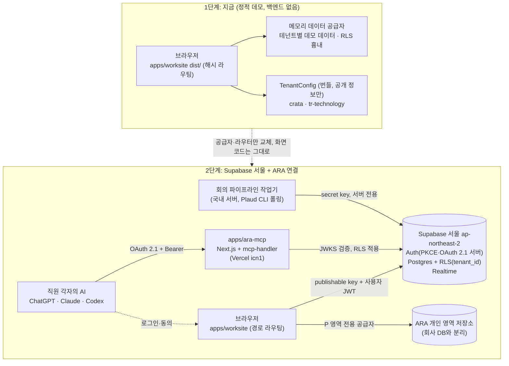
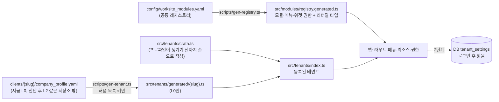
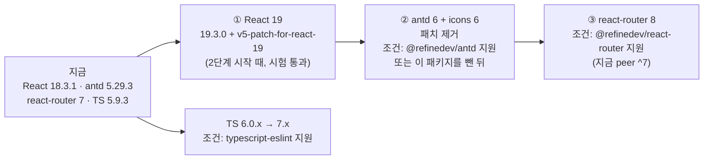

# 05. 기술 스택·아키텍처: 업무사이트 공통 뼈대

> 기준일 2026-10-02 · 상위 문서: [00 방향 정리](../research/00_direction.md) · 대상: `apps/worksite`(모든 고객사가 같이 쓰는 뼈대, 첫 고객 (주)티알테크놀러지)
>
> **표기**
> - ●: 공식 문서, npm 레지스트리(`npm view`), 직접 설치·빌드 시험으로 확인
> - ◐: 2차 출처나 정황으로 판단(추정 포함)
> - ○: 확인하지 못함(미검증). "없다"는 뜻이 아닙니다
> - [n]: 맨 아래 출처 번호. 버전·날짜는 모두 2026-10-02 npm 레지스트리 기준입니다.
>
> **함께 볼 문서**
> - 화면 설계: [01 디자인 레퍼런스](./01_design-references.md)(색·타이포·컴포넌트·테마 규칙) · [02 공통 모듈](./02_common-modules.md)(모듈 31개 + 업종 팩, 역할·권한) · [03 첫 고객 티알테크놀러지](./03_tr-technology.md)(제조 팩, 역할별 홈, 데모 데이터 설계)
> - 기계가 읽는 목록: [`config/worksite_modules.yaml`](../../config/worksite_modules.yaml)(모듈 레지스트리) · [`templates/company_profile.template.yaml`](../../templates/company_profile.template.yaml)(회사별 설정 템플릿) · [`clients/tr-technology/company_profile.yaml`](../../clients/tr-technology/company_profile.yaml)(첫 고객 프로파일, 공개 정보만)
> - 나중에 붙일 것: [09 ARA MCP 원격](../research/09_ara-mcp-remote.md) · [02 회의 자동 분류](../research/02_meeting-auto-classification.md) · [04 데이터 거버넌스](../research/04_data-governance.md)

---

## 0. 결정 요약

1. **사용자 다이어그램의 스택(Refine + React + Ant Design + TypeScript)을 그대로 씁니다.** 다만 버전은 Refine v5가 허용하는 범위로 고정합니다. `antd` **5.29.3**(6 아님), `react-router` **7.18.4**(8 아님), `react` **18.3.1**, `typescript` **5.9.3**, `vite` **8.3.2** + `@vitejs/plugin-react` **6.1.1**입니다(1.4절). 이 조합은 직접 설치·타입검사·빌드·브라우저 렌더까지 통과했습니다(1.3절). ●
2. **다이어그램의 'GraphQL API' 자리는 Refine 데이터 공급자(data provider)가 맡습니다.** 지금은 **테넌트별 데모 데이터를 넣은 메모리 공급자**, 다음 단계는 **Supabase 서울 + `@refinedev/supabase`(REST)**입니다. GraphQL은 지금도, 2단계에서도 쓰지 않습니다. Supabase가 2026년부터 새 프로젝트에서 GraphQL을 기본으로 켜지 않고, Refine CRM 예제가 GraphQL을 쓴 이유는 NestJS 백엔드 때문이었습니다(3.4절). ●
3. **지금 뼈대는 백엔드 없이 도는 정적 SPA입니다.** 해시 라우팅(`#/work`)과 상대 경로 빌드(`base: "./"`)를 써서 `dist/` 폴더를 어떤 정적 호스팅의 어느 하위 경로에 올려도 동작합니다. 2단계(로그인·OAuth 동의 화면)부터는 일반 경로 라우팅으로 바꿉니다. 환경 변수 하나로 바꿀 수 있습니다(3.2절).
4. **회사별 차이는 코드가 아니라 `TenantConfig` 데이터입니다.** 켜진 모듈, 메뉴 이름, 용어, 브랜드 씨앗 색, 홈 위젯, 역할코드 → 플랫폼 역할 매핑을 담습니다. 원천은 `config/worksite_modules.yaml`(공통 기본값)과 `clients/{slug}/company_profile.yaml`(회사별 덮어쓰기)입니다. 데모에는 공개 정보(L0)만 번들에 넣고, 운영에서는 로그인 후 DB에서 읽습니다(4장).
5. **권한은 역할 4개(owner·admin·reviewer·member) × 레지스트리 권한 등급을 Refine `accessControlProvider`로 풉니다.** 화면 권한은 편의 기능일 뿐이고, 진짜 경계는 DB 행 단위 보안(RLS)입니다. 데모 메모리 공급자도 같은 규칙으로 RLS를 흉내 내서, 공급자를 바꿔도 화면 동작이 같게 합니다(5.2절).
6. **ARA 개인 영역(P 영역)은 별도 데이터 공급자(`ara`)·별도 경로(`/ara`)·별도 저장소로 나눕니다.** 회사 데이터 공급자로는 개인 영역 데이터에 닿을 수 없게 만듭니다. 관리자 예외는 없습니다(5.3절).
7. **ARA MCP 서버는 이 앱에 넣지 않고 별도 앱(`apps/ara-mcp`, 09 문서의 Next.js + mcp-handler)으로 둡니다.** 이 앱은 같은 Supabase 인증·DB를 쓰고, 다음 화면을 맡습니다: OAuth 동의 화면(`/oauth/consent`), 내 AI 연결(`/me/ai`), AI 연결 정책, 검토 대기. 회의 파이프라인도 국내 서버의 작업기가 DB에 쓰고, 이 앱은 확인 제안 카드만 보여줍니다(6장).
8. **Refine은 얇게 씁니다.** `@refinedev/core`의 공급자·훅과 `@refinedev/antd`의 표·폼 훅만 쓰고, 레이아웃(`ThemedLayout`)·Inferencer·Devtools·kbar는 쓰지 않습니다. `@refinedev/antd`는 2025-10-23 이후 새 릴리스가 없고 antd 6을 아직 지원하지 않습니다. 따라서 나중에 이 패키지를 빼도 화면을 고치지 않아도 되게 감싸 둡니다(8장). ●
9. **React 19는 검증을 끝냈고, 2단계 시작 때 올립니다.** `react` 19.3.0 + `@ant-design/v5-patch-for-react-19` 1.0.3 조합으로 빌드·렌더를 통과했습니다. React Router 8은 React 19.2.7 이상을 요구하므로, 순서는 React 19 → antd 6 → React Router 8입니다(8.2절). ●

---

## 1. 사용자 다이어그램 스택 검토

### 1.1 다이어그램 상자별 결정

사용자 다이어그램은 Refine 공식 CRM 예제의 구조입니다: Refine Framework → React Components → Ant Design UI Library → GraphQL API → TypeScript Code([01 문서](./01_design-references.md) 2.4절).

| 상자 | 결정 | 이유 |
|---|---|---|
| Refine Framework | **채택.** `@refinedev/core` 5.0.12 | CRUD·목록·폼·권한·감사·i18n 공급자 구조가 우리 모듈(업무·회의·산출물·관리)과 맞습니다. MIT 라이선스입니다 [15] |
| React Components | **채택.** `react` 18.3.1(2단계에 19로) | Refine v5는 React 18과 19를 모두 지원합니다 [2]. antd 5는 기본 지원 범위가 React 16~18이라 18에서는 패치가 필요 없습니다 [18] |
| Ant Design UI Library | **채택.** `antd` 5.29.3 | `@refinedev/antd` 6.0.3의 peer가 `antd ^5.23.0`입니다. antd 6은 설치할 수 없습니다 ●. 디자인 토큰·CSS 변수로 테넌트 색을 바꿀 수 있습니다 [19] |
| GraphQL API | **'데이터 공급자 층'으로 바꿔 읽음.** 지금 메모리 → 2단계 Supabase REST | 3.4절. 화면 코드는 Refine 훅만 쓰므로, 나중에 GraphQL 공급자를 붙여도 화면은 그대로입니다 |
| TypeScript Code | **채택.** `typescript` 5.9.3 | 최신 7.0.2는 아직 안정된 프로그래밍 API가 없고 [24], `typescript-eslint` 8.71.0이 `<6.1.0`까지만 지원합니다 [25] ● |

### 1.2 Refine v5 호환 제약 (npm peer 의존성)

| 패키지 | 고정 버전 | peer 요구 | 마지막 릴리스 | 메모 |
|---|---|---|---|---|
| `@refinedev/core` | 5.0.12 | react `^18 \|\| ^19`, `@tanstack/react-query ^5.81.5` | 2026-04-02 | GitHub main 브랜치에는 5.2.0이 있지만 npm에는 아직 없습니다 ● |
| `@refinedev/antd` | 6.0.3 | **`antd ^5.23.0`**, dayjs `^1.10.7`, react `^18 \|\| ^19` | **2025-10-23** | `@ant-design/pro-layout` 7.22.7을 함께 설치합니다 |
| `@refinedev/react-router` | 2.0.4 | **`react-router ^7.0.2`** | 2026-03-05 | React Router 8(8.4.0)은 범위 밖입니다 |
| `@refinedev/supabase` | 6.0.2 (2단계) | `@supabase/supabase-js ^2.7.0` | — | 2단계에 추가합니다 |
| `@refinedev/nestjs-query` | 2.0.1 (안 씀) | graphql-request `^5.2.0`, graphql-ws `^5.9.1` | — | CRM 예제의 공급자입니다 |
| `@refinedev/kbar` | 2.0.1 (안 씀) | — | — | 내부 의존 `kbar 0.1.0-beta.40`의 peer가 React ≤18이고, 그 안의 `react-virtual 2.x` peer는 React ≤17입니다. 설치 시 `ERESOLVE overriding peer dependency` 경고가 납니다(직접 확인) ● |
| `antd` | 5.29.3 | react `>=16.9.0` | 2025-12-18 | npm 태그 `latest-5`. 최신 `latest`는 6.6.5입니다 |
| `@ant-design/icons` | 5.6.1 | react `>=16` | — | antd 6은 icons 6 이상이 필요해 함께 올려야 합니다 [17] |
| `react-router` | 7.18.4 | — | — | 8.4.0은 peer `react >=19.2.7`, Node `>=22.22.0`을 요구합니다 ● |
| `vite` | 8.3.2 | Node `^20.19 \|\| >=22.12` | 2026-10-01 | Rolldown 단일 번들러. 2026-03-12에 정식 출시됐습니다 [23] |
| `@vitejs/plugin-react` | 6.1.1 | `vite ^8.0.0` | 2026-08-28 | Babel 대신 Oxc로 React Refresh를 처리합니다. React Compiler는 선택 사항입니다 [23] |

### 1.3 직접 확인한 것 (설치·빌드·렌더 시험)

스크래치 폴더에서 아래 버전으로 최소 앱을 만들어 확인했습니다. 앱 구성은 Refine + 메모리 공급자 + 해시 라우팅 + antd 표 + 한국어 로케일 + 테넌트 색입니다. 환경은 Node 22.22.0, npm 10.9.4입니다. 시험 코드는 저장소에 넣지 않았습니다.

| 시험 | 결과 |
|---|---|
| `npm install` (1.4절 버전 + `@refinedev/kbar`) | `ERESOLVE overriding peer dependency` 경고 1건(kbar → react-virtual) |
| `npm install` (kbar 제외, 1.4절 그대로) | 경고 없음. 211개 패키지. react·antd·react-query가 각각 한 벌만 설치됨(중복 없음) |
| `tsc -b` (strict, TS 5.9.3) | 통과. Refine 공급자 5종 타입, antd `ThemeConfig` 컴포넌트 토큰(Card·Menu·Segmented·Table·Layout) 포함 |
| `vite build` | 1.9초. JS 1,236 KB(gzip 392 KB), CSS 51 KB(gzip 16 KB). "500 KB 넘는 청크" 경고가 남 → 8.1절 |
| 헤드리스 Chromium(Playwright 1.56.1)으로 `vite preview` 렌더 | `#/work?pageSize=10&currentPage=1`로 이동해 목록 상태가 URL에 남음. 같은 테넌트 2행만 보이고 다른 테넌트 1행은 숨겨짐. `--ant-color-primary: #2d3c67` 적용. 콘솔 오류·경고 0 |
| React 19.3.0 + `@ant-design/v5-patch-for-react-19` 1.0.3 | 타입검사·빌드·렌더 모두 통과. JS gzip 414 KB(+23 KB). 콘솔 오류·경고 0 |
| `vitest` 5.0.3 (`--environment node`) | Vite 8.3.2와 함께 동작. "다른 테넌트 행은 목록에 없고 상세는 404" 테스트 통과 |

**번들 크기 내역(같은 화면, gzip):**

| 구성 | JS min | JS gzip |
|---|---|---|
| React + react-router + antd(ConfigProvider·App·Table)만 | 867 KB | 273 KB |
| + `@refinedev/core`(공급자·`useTable`) | 1,044 KB | 331 KB |
| + `@refinedev/antd`(`useTable`·`useNotificationProvider`) | 1,236 KB | 392 KB |
| 위와 같고 React 19.3.0 + 패치 | 1,315 KB | 414 KB |

`@refinedev/antd`는 `dist/index.mjs` 한 파일로 배포되어 일부 훅만 가져와도 약 61 KB(gzip)가 붙습니다. 대응은 8.1절에 있습니다.

### 1.4 고정 버전

모든 버전은 `^` 없이 정확히 고정합니다. `package-lock.json`을 커밋하고, 설치는 `npm ci`로 합니다. `.npmrc`에 `save-exact=true`를 둡니다.

```jsonc
// apps/worksite/package.json (발췌)
{
  "private": true,
  "type": "module",
  "engines": { "node": ">=22.12.0" },          // vite 8: ^20.19||>=22.12, vitest 5: ^22.12
  "dependencies": {
    "@ant-design/icons": "5.6.1",
    "@refinedev/antd": "6.0.3",
    "@refinedev/core": "5.0.12",
    "@refinedev/react-router": "2.0.4",
    "@tanstack/react-query": "5.104.0",        // Refine의 peer(^5.81.5). 최상위에 고정해 한 벌만 설치
    "antd": "5.29.3",
    "dayjs": "1.11.23",
    "pretendard": "1.3.9",
    "react": "18.3.1",
    "react-dom": "18.3.1",
    "react-router": "7.18.4"
  },
  "devDependencies": {
    "@playwright/test": "1.56.1",              // 개발 환경에 설치된 Chromium 리비전 1194와 맞춤
    "@types/react": "18.3.31",
    "@types/react-dom": "18.3.7",
    "@vitejs/plugin-react": "6.1.1",
    "typescript": "5.9.3",
    "vite": "8.3.2",
    "vitest": "5.0.3",                         // 선택
    "yaml": "2.9.1"                            // 레지스트리·프로파일 생성 스크립트용
  }
}
```

| 단계 | 추가·변경 | 버전 |
|---|---|---|
| 2단계(Supabase) | `@refinedev/supabase`, `@supabase/supabase-js` | 6.0.2, 2.117.2 (추가할 때 다시 확인) |
| React 19 전환 | `react`·`react-dom`, `@types/react`·`@types/react-dom`, `@ant-design/v5-patch-for-react-19` | 19.3.0, 19.3.0, 1.0.3 (시험 통과) |
| ARA MCP 앱(별도) | `next`, `mcp-handler`, `@modelcontextprotocol/server` | 16.3.8, 2.2.0, 2.2.0 (참고. 그 앱을 만들 때 고정) |

**Node·도구 버전:** `.nvmrc`는 `22`입니다. 생성 스크립트(`scripts/*.ts`)는 Node의 타입 제거(type stripping)로 플래그 없이 바로 실행합니다(Node 22.22.0에서 `node 파일.ts` 실행 확인). 그래서 스크립트에는 enum·namespace처럼 지워지지 않는 문법을 쓰지 않습니다. `tsx`는 필요 없습니다.

### 1.5 쓰지 않는 것과 이유

| 패키지·기능 | 이유 | 대신 |
|---|---|---|
| `antd` 6, `@ant-design/icons` 6 | `@refinedev/antd` peer 범위 밖. 지원 요청 이슈 #7140이 2025-12-02부터 열려 있음 [16] | antd 5. 6 전환은 8.2절 순서대로 |
| `react-router` 8 | `@refinedev/react-router` peer `^7`. React 19.2.7 이상 필요 | 7.18.4 |
| `typescript` 7 | 안정된 프로그래밍 API가 7.1에서 나올 예정이고 [24], typescript-eslint 미지원 [25] | 5.9.3. 다음은 6.0.x → 7.x |
| `@refinedev/kbar` | 위 peer 경고. React 19로 갈 때 걸림돌 | `CommandMenu`를 antd `Modal` + `Input` + 목록으로 직접 구현([01 문서](./01_design-references.md) 6.10절의 `@refinedev/kbar` 표기를 이것으로 바꿈) |
| `ThemedLayout`·`ThemedSider` (`@refinedev/antd`) | 디자인 문서의 3단 골격(메뉴·패널·레일), 모바일 하단 탭과 맞지 않음 | `src/layout/AppShell` 직접 구현 |
| `RefineThemes` 프리셋 | 고정 색 프리셋. 테넌트 색을 쓰지 않음 | `deriveTenantTheme()`(5.6절) |
| `@refinedev/inferencer`, `@refinedev/devtools`, `@refinedev/cli` | 코드 생성·개발 도구. 번들·의존성이 커짐. devtools는 cli 서버가 필요 | 직접 작성 |
| `@ant-design/plots` (CRM 예제의 차트) | 번들 크기, 'AI 티' 나는 기본 스타일 | SVG 직접 구현(`ThinBarChart` 등, 01 문서 6.10절, dataviz 규칙) |
| `@ant-design/pro-components` 직접 사용 | Ant Design Pro 최신판은 antd 6 기준 | 패턴만 참고 |
| `@refinedev/multitenancy` | Enterprise 전용(`@refinedev/enterprise` 필요) [9] | 테넌트 결정을 직접 구현(4.5절) |
| GraphQL 클라이언트(`graphql-request`, `urql`, `graphql-ws`) | 3.4절 | Supabase REST |
| 다크 모드 | 1단계 범위 밖(01 문서 6.12절) | 토큰을 역할 이름으로만 써 두기 |

### 1.6 Refine CRM 예제에서 가져오는 것

공식 CRM 템플릿은 Vite + Ant Design + Nestjs-query(GraphQL) + 자체 인증 공급자로 되어 있습니다 [13]. 전체판 `app-crm`은 Enterprise Edition으로 옮겨졌고, 커뮤니티판 `app-crm-minimal`만 공개돼 있습니다 [14]. `app-crm-minimal`의 `package.json`을 직접 확인한 결과는 다음과 같습니다 [15].
- `@refinedev/nestjs-query` + `graphql-ws`(실시간), `@ant-design/plots`(차트), `@dnd-kit/*`(칸반 끌어놓기), `@uiw/react-md-editor`
- **React 19.1 + `@ant-design/v5-patch-for-react-19`**, `antd ^5.23.0`, Vite 5
- 데이터 공급자는 `https://api.crm.refine.dev/graphql`(Refine이 운영하는 데모 NestJS 서버)에 붙습니다

| CRM 예제 | CRATA 워크사이트 | 가져오는 방식 |
|---|---|---|
| `resources` 배열(companies, tasks…) | 레지스트리 `modules[].entities[]` → Refine 리소스(7.2절) | 리소스 이름은 2단계 DB 테이블 이름과 같게 |
| Dashboard(`total-count-card`, `deals-chart`, `latest-activities`, `upcoming-events`) | 홈 위젯 26개(레지스트리 `home_widgets`) | 카드 구조만. 차트는 SVG 직접 |
| Scrumboard(`@dnd-kit`) | `TaskBoard`: 할 일 → 진행 중 → 검토 대기 → 완료 | 1단계는 버튼·선택으로 상태 이동(키보드 접근성). 끌어놓기는 나중 |
| Companies / Contacts | 사업·프로젝트·파트, 구성원·조직도, 거래처 | 목록·상세·서랍 패턴 |
| Quotes | 산출물·양식(견적서도 산출물의 한 종류) | |
| Calendar | 회의·일정 | |
| Administration | 관리(구성원·권한, 회사 설정, 감사 로그, AI 연결 정책) | |
| nestjs-query + graphql-ws | 메모리 → Supabase REST + Realtime | 3장 |
| 자체 인증(토큰을 localStorage에) | 데모 인물 전환 → Supabase Auth(PKCE) | 5.1절 |

화면 단위 대응표는 [01 문서](./01_design-references.md) 2.4절에 있습니다.

---

## 2. 전체 아키텍처

### 2.1 단계별 그림



| 단계 | 언제 | 데이터 | 인증 | 라우팅 | 배포 |
|---|---|---|---|---|---|
| 1. 정적 데모 | 지금 | 메모리(새로고침하면 초기화) | 데모 인물·역할 전환 | 해시 `#/…` | 정적 파일 어디나 |
| 2. 단일 테넌트 운영 | [00 문서](../research/00_direction.md) 7장 0~1단계(CRATA 자신) | Supabase 서울 | Supabase Auth | 경로 `/…` | 정적 호스팅 + SPA 폴백 |
| 3. 멀티테넌트 + ARA MCP v1 | 7장 1~2단계(유료 파일럿) | 같은 DB, 테넌트별 RLS | + MCP용 OAuth 2.1 | 같음 | + `apps/ara-mcp` |

### 2.2 앱 안의 층

```
main.tsx
 └ <TenantBoundary>            테넌트·역할 결정(4.5절), 테마 CSS 변수 적용
   └ <Router>                  HashRouter | BrowserRouter (VITE_ROUTER_MODE)
     └ <ConfigProvider>        locale=koKR, theme=antdTheme(tenant)  ← 5.5·5.6절
       └ <AntdApp>             message·notification·modal 문맥
         └ <Refine            dataProvider={default, ara}  authProvider  accessControlProvider
                               auditLogProvider  i18nProvider  notificationProvider  resources
                               options={ syncWithLocation, disableTelemetry: true }>
           └ <Routes>          레지스트리에서 만든 라우트(7.2절)
             └ <AppShell>      SideNav · PageHeader · RightRail · BottomTabBar
               └ pages/<module>/…   Refine 훅만 사용(useTable, useShow, useForm, useCan …)
                 └ components/…     PillLabel, StatValue, DataTable, ThinBarChart …
```

**규칙:** 화면(`pages/`)과 컴포넌트는 Supabase 클라이언트나 `fetch`를 직접 부르지 않습니다. 데이터는 Refine 데이터 훅으로만 다룹니다. 그래야 공급자를 바꿀 때 화면을 고치지 않습니다. 집계 숫자처럼 CRUD가 아닌 것은 공급자의 `custom` 메서드나 `src/data/selectors/`(1단계)·DB 뷰/RPC(2단계)로 감쌉니다.

### 2.3 Next.js가 아니라 Vite SPA로 하는 이유

[03 문서](../research/03_company-dna-playbook.md) 6.4절과 [09 문서](../research/09_ara-mcp-remote.md) 7장은 고정 베이스를 "Next.js + Supabase"로 적었습니다. 이 문서는 **업무사이트 화면은 Vite SPA, MCP 서버는 별도 Next.js 앱**으로 나눕니다.

| 기준 | Vite SPA (선택) | Next.js 한 앱 |
|---|---|---|
| 사용자 다이어그램·CRM 예제 | 같은 구성(Vite + Refine) [13] | Refine은 `@refinedev/nextjs-router`로 지원 |
| 지금 필요한 것(백엔드 없는 데모) | `dist/`를 어디에나 올림 | 정적 내보내기를 따로 설정해야 함 |
| 로그인 뒤 내부 도구 | SSR·SEO가 필요 없음 | 장점을 살리기 어려움 |
| MCP 서버 | 별도 앱(09 문서 구성 그대로) | 같은 앱에 넣을 수 있음 |
| 보안 경계 | 화면은 정적 파일, 경계는 RLS·MCP 서버 | 서버 코드와 화면이 한 배포에 섞임 |

나중에 서버 렌더링이 필요해지면(예: 공개 소개 페이지) Refine의 Next.js 라우터로 옮길 수 있습니다. 화면 코드가 Refine 훅만 쓰기 때문에 옮기는 비용은 라우팅 층에 한정됩니다.

---

## 3. 데이터 공급자 전략

### 3.1 지금: 메모리 공급자

`src/providers/data/memory.ts` 하나로 Refine `DataProvider`를 구현합니다. 필수 메서드는 `getList`·`getOne`·`create`·`update`·`deleteOne`·`getApiUrl`이고, `getMany`·`custom`을 더합니다 [5].

| 항목 | 규칙 |
|---|---|
| 생성 | `createMemoryDataProvider({ tenant, member, role, seed, clock })`. 테넌트를 바꾸면 페이지를 새로 불러와 공급자와 React Query 캐시를 통째로 새로 만듭니다(다른 회사 캐시가 섞이지 않음) |
| 테넌트 분리 | 모든 행에 `tenant_id`(= `TenantConfig.tenantId`). 모든 읽기·쓰기에서 현재 테넌트만 다룹니다. 다른 테넌트 id로 `getOne`을 부르면 `{ statusCode: 404, message: "없음" }`을 냅니다([09 문서](../research/09_ara-mcp-remote.md) 8장 출시 테스트 3번과 같은 동작) |
| RLS 흉내 | `src/providers/policy.ts`의 행 조건을 적용합니다. 예: 권한 등급 `own`이면 `tasks.assignee_id = 나`. 2단계에서는 같은 표를 SQL RLS 정책으로 옮깁니다(정책의 정본은 이 표 하나) |
| 필터·정렬·페이지 | `eq`·`ne`·`in`·`contains`·`gte`·`lte`·`null`과 `or` 묶음, 다중 정렬, `pagination.mode` `server`/`client`/`off` |
| 데모 데이터 | `src/data/seed/<group>.ts`(7.3절). 테넌트 slug로 시드를 고정한 난수라 매번 같은 데이터가 나옵니다(스크린샷 비교 가능) |
| 기준 날짜 | 데모의 "오늘"은 `clock`에서 옵니다. 기본은 테넌트의 `demoToday`(TR은 2026-09-30, 03 문서 10.1절)이고, 없으면 실제 오늘입니다. `?today=`로 바꿀 수 있습니다. 데이터 날짜는 기준 날짜에서 거꾸로 계산해 D-day·마감 임박이 늘 보이게 합니다 |
| 지연 | 기본 150~300 ms를 넣어 로딩 상태가 보이게 합니다. `?latency=0`이면 끕니다(스크린샷용) |
| 저장 | 탭 메모리에만 둡니다. 새로고침하면 처음 데이터로 돌아갑니다("데모 초기화"는 새로고침). 브라우저 저장소에는 마지막으로 고른 테넌트·역할만 둡니다(읽기·쓰기는 try/catch로 감쌈) |
| 감사 | 쓰기가 성공하면 Refine이 `auditLogProvider.create`를 부르고, 메모리의 `audit_events`에 쌓입니다(5.4절) |
| 개인 영역 | `ara` 공급자는 별도 인스턴스·별도 저장소입니다. 회사 공급자의 리소스 목록에 개인 영역 리소스가 없습니다(5.3절) |

### 3.2 해시 라우팅과 정적 배포

- **지금:** `HashRouter` + `vite.config.ts`의 `base: "./"`입니다. 주소는 `…/index.html?tenant=tr-technology#/work`처럼 됩니다. 해시 뒤 경로는 서버로 가지 않으므로, 서버 설정 없이 하위 경로에 올려도 새로고침과 직접 링크가 됩니다 [22]. 시험에서 Refine의 `syncWithLocation`이 `#/work?pageSize=10&currentPage=1`로 동작하는 것을 확인했습니다 ●.
- **어디에 올릴 수 있나:** `vite preview`, GitHub Pages, Cloudflare Pages, Netlify, Vercel, S3 같은 정적 호스팅이면 됩니다. 다만 `index.html`을 더블클릭해 `file://`로 여는 방식은 브라우저가 모듈 스크립트를 막아 동작하지 않습니다.
- **2단계에서 경로 라우팅으로 바꾸는 이유**
  - Supabase OAuth 2.1 서버는 동의 화면을 `사이트 URL + 인가 경로`(예: `/oauth/consent?authorization_id=…`)로 보냅니다 [34]. 해시가 아닌 실제 경로가 필요합니다.
  - Supabase Auth의 implicit 흐름은 토큰을 URL 해시에 붙입니다. 해시 라우터와 부딪히므로 **PKCE 흐름(`flowType: "pkce"`, `?code=` 쿼리)**만 씁니다 [33].
- **전환 방법:** `VITE_ROUTER_MODE=hash|browser` 하나로 `src/app/router.tsx`가 라우터를 고릅니다. 라우트 정의는 같습니다. 경로 라우팅 배포에는 호스팅의 SPA 폴백(모든 경로 → `index.html`)을 켭니다.

### 3.3 다음: Supabase 서울

| 항목 | 결정 | 근거 |
|---|---|---|
| 리전 | `ap-northeast-2`(서울) | [26]. [04 문서](../research/04_data-governance.md)의 국내 저장 원칙 |
| 공급자 | `@refinedev/supabase` `dataProvider(supabaseClient)`, `liveProvider(supabaseClient)`를 `src/providers/data/supabase.ts`에서 감쌉니다. 이 패키지의 `custom`은 구현돼 있지 않고 호출하면 오류를 냅니다(6.0.2 배포 파일 확인 ●). 그래서 감싼 쪽에서 `custom`을 `supabase.rpc()`로 이어 줍니다 | 공식 패키지. `meta.select`로 관계 조회, `meta.count: "estimated"` 지원 [11] |
| 테이블 | 레지스트리 엔티티 이름의 snake_case 복수형(`Task` → `tasks`, `MeetingSegment` → `meeting_segments`, `AuditEvent` → `audit_events`). 열 이름은 레지스트리 `fields` 그대로 | 메모리 공급자와 리소스 이름이 같아 화면을 고치지 않음 |
| 테넌트 열 | 모든 업무 테이블에 `tenant_id uuid not null` + 인덱스 | RLS 정책이 거르는 열마다 인덱스를 둡니다 [27] |
| RLS | 모든 노출 테이블에 RLS를 켭니다. 기본 형태는 `tenant_id = (select private.current_tenant_id())`입니다. 함수는 `(select …)`로 감싸 행마다 다시 계산하지 않게 합니다 | [27] |
| 테넌트·역할 클레임 | Custom Access Token Hook이 `app_metadata.tenant_id`, `app_metadata.role`을 토큰에 넣습니다. 최상위 `role` 클레임은 Postgres 역할(`authenticated`)용 필수 클레임이므로 건드리지 않습니다. **`user_metadata`는 사용자가 바꿀 수 있으므로 권한 판단에 쓰지 않습니다** | [27][28] |
| 권한 함수 | 역할·범위 권한 검사는 `security definer` 함수로 만들어 **노출되지 않는 스키마(`private`)**에 둡니다. `search_path = ''`로 고정합니다 | [27] |
| 테이블 노출 | 테이블을 만들 때 마이그레이션에 **명시적 `GRANT`**를 넣습니다. Supabase는 2026-05-30부터 새 프로젝트, 2026-10-30부터 기존 프로젝트에서 테이블을 Data API에 자동 노출하지 않습니다 | [31] |
| 키 | 브라우저에는 **publishable key(`sb_publishable_…`)**만 넣습니다. secret key는 회의 작업기·MCP 서버 같은 서버에서만 씁니다. 기존 `anon`·`service_role` 키는 2026년 말까지 폐기 예정입니다 | [35] |
| 인증 흐름 | 이메일 로그인(매직 링크 또는 비밀번호) + PKCE. 이메일 링크·OAuth 리디렉션은 경로 라우팅에서만 처리합니다 | [33] |
| 실시간 | 검토 대기·회의 확인 제안처럼 남이 바꾸는 목록에만 `liveMode: "auto"` | 09 문서 출시 테스트 7번(제출 후 10초 안에 검토자 화면에 표시) |
| 집계 | 홈 KPI·추이는 DB 뷰 또는 RPC. 공급자 `custom`으로 부릅니다 | 화면 규칙(2.2절) |
| 타입 | `supabase gen types typescript`로 DB 타입을 만들어 `apps/worksite`와 `apps/ara-mcp`가 함께 씁니다 | — |
| 환경 변수 | `VITE_DATA_MODE=supabase`, `VITE_SUPABASE_URL`, `VITE_SUPABASE_PUBLISHABLE_KEY`, `VITE_ROUTER_MODE=browser`. `VITE_`로 시작하는 값은 모두 번들에 들어가므로 비밀 값을 넣지 않습니다 | — |

### 3.4 GraphQL 선택지 비교와 권고

| 선택지 | Refine 공급자 | 좋은 점 | 걸리는 점 | 판단 |
|---|---|---|---|---|
| **Supabase REST(PostgREST)** | `@refinedev/supabase` 6.0.2(공식) | RLS가 그대로 적용됨, 실시간 공급자 있음, 운영할 서버가 없음, 관계 조회는 `meta.select` | 복잡한 집계는 뷰·RPC로 따로 만듦 | **채택(2단계)** |
| Supabase pg_graphql | 전용 공급자 없음. `@refinedev/graphql` 8.0.1에 맞춰 직접 매핑 | RLS를 존중하고 요청 한 번에 끝남 [29] | 2026-01-26 공지로 **새 프로젝트에서 자동으로 켜지지 않음**(만든 지 30일 넘고 GraphQL 요청이 0건인 기존 프로젝트도 꺼짐) [30]. pg_graphql 1.6.0부터 **introspection 기본 꺼짐**(2026-06-29 이후 새 프로젝트) [32]. `xxxCollection` 형태 스키마에 맞춰 공급자를 새로 짜야 함 | 보류 |
| Hasura | `@refinedev/hasura` 7.0.1(공식) | 공식 공급자, 자체 권한 엔진 | 서버를 하나 더 서울에 운영. RLS와 Hasura 권한을 이중으로 관리 | 보류 |
| nestjs-query (CRM 예제) | `@refinedev/nestjs-query` 2.0.1 | 예제 코드를 그대로 재사용 | NestJS 백엔드를 직접 개발·운영. `OffsetPagingStrategy`만 지원 [12]. 원조 `@nestjs-query/query-graphql`은 2022-04 이후 갱신 없음, 포크 `@ptc-org/nestjs-query-graphql`의 최신 태그는 11.0.0-alpha.1 ● | 채택 안 함 |

**권고:** GraphQL은 쓰지 않습니다. 다이어그램의 "GraphQL API" 층은 "Refine 데이터 공급자 층"으로 읽습니다. 다음 경우가 생기면 그때 pg_graphql을 켜고 `@refinedev/graphql`로 **두 번째 공급자**를 붙입니다(`dataProviderName`) [5].
- 외부 파트너에게 공개 API를 줘야 할 때
- 한 화면이 관계 5개 이상을 한 번에 읽어야 해서 REST 요청이 눈에 띄게 늘 때

GraphQL을 붙여도 기존 화면은 그대로 둡니다.

### 3.5 공급자 교체 규칙

1. 리소스 이름·필드 이름은 메모리와 DB가 같습니다(7.2절).
2. 상태 전이(예: 제출 승인)는 `useUpdate`로 `status`만 바꿉니다. 승인 권한은 화면(`useCan`)과 DB(RLS·트리거)가 각각 확인합니다.
3. 여러 행을 한 번에 바꾸는 업무 동작(예: 액션 제안 → 업무 생성)은 공급자 `custom`의 이름 있는 동작(`custom({ url: "rpc:accept_action_proposal", method: "post", payload })`)으로 감쌉니다. 메모리 공급자는 같은 이름을 자바스크립트로, 2단계는 Postgres 함수(`supabase.rpc`)로 구현합니다.
4. 데모 전용 동작(테넌트·역할 전환, 초기화)은 공급자가 아니라 `TenantBoundary`에 둡니다.

---

## 4. 멀티테넌트 설정

### 4.1 설정이 정하는 것

| 무엇 | 기본값(공통, 레지스트리) | 회사별 덮어쓰기(프로파일) | 화면에서 쓰는 곳 |
|---|---|---|---|
| 켜진 모듈 | `modules[].default_enabled`, 업종 팩 모듈은 `industry`·`enabled_by_packs` | `portal_hints.enabled_packs`, `portal_hints.enabled_modules_extra` | 라우트·메뉴·리소스 생성 |
| 메뉴 이름·하단 탭 | `nav_groups[].name_ko`, `name_by_pack`, `mobile_tabs` | `portal_hints.nav_overrides`, `portal_hints.mobile_tabs` | `SideNav`, `BottomTabBar` |
| 용어 | 플랫폼 기본 용어(`src/i18n/ko.ts`) | `glossary.highlights[]`의 `term` → `ui_label` | `translate()`(5.5절) |
| 브랜드 | CRATA 기본(딥 틸 #0B6E69, 가안) | `theme`의 씨앗 색 2개·밀도 + `identity.monogram` | `deriveTenantTheme()`(5.6절) |
| 홈 위젯 | `home_presets`, `manufacturing_overrides` | `portal_hints.home_widgets_by_unit`, `portal_hints.hidden_widgets` | 홈 대시보드 |
| 역할 | `roles`(4개) | `org.roles[]`(역할코드·직책·소속 단위 → `platform_role`) | 데모 "누구로 보기", 2단계 초대 기본값 |
| 데모 사실 | — | 공개 정보만(조직 단위 이름, 제품군, 공정, 설비 종류) | `src/data/seed/*` |

**원칙:** 레지스트리는 회사 때문에 고치지 않습니다. 순서와 구조는 플랫폼 고정이고, 회사가 바꿀 수 있는 것은 라벨·색·켜기/끄기·위젯 배치뿐입니다([02 문서](./02_common-modules.md) 2장, [01 문서](./01_design-references.md) 6.12절).

### 4.2 `TenantConfig` 타입

```ts
// src/tenants/types.ts
import type { NavGroupId, ModuleId, WidgetId, Role } from "@/modules/registry.generated";

export type IndustryPack = "manufacturing" | "education_consulting";
export type Density = "comfortable" | "compact" | "public";   // public = 본문 17px(KRDS)

export interface TenantConfig {
  slug: string;                    // "tr-technology". clients/{slug} 폴더명. ?tenant= 값
  tenantId: string;                // 데이터 칸막이. 데모: "tr-technology-demo", 운영: DB uuid
  displayName: string;             // "티알테크놀러지"
  legalName?: string;              // "주식회사 티알테크놀러지" (공개 정보만)
  monogram: string;                // "TR". 로고 이미지는 쓰지 않음
  profileVersion: string;          // 원천 프로파일의 schema_version·last_verified
  isDemo: boolean;                 // true면 머리에 '예시 데이터' 배지 고정
  demoToday?: string;              // 데모의 '오늘'. TR은 "2026-09-30"(03 문서 10.1절)
  theme: {
    brand: string;                 // 씨앗 1: 브랜드 색
    chartAccent: string;           // 씨앗 2: 차트 강조색(팔레트 검사 통과 값)
    density: Density;
  };
  packs: IndustryPack[];
  modules?: { enable?: ModuleId[]; disable?: ModuleId[] };
  navLabels?: Partial<Record<NavGroupId, string>>;
  mobileTabs?: "default" | "manufacturing";
  glossary?: Record<string, string>;              // 용어 키 → 화면 표기. 예: { "term.project": "과제", "편조 장치": "편조기" }
  roles?: { id: string; title: string; unitId: string; platformRole: Role }[];   // 역할코드 → 플랫폼 역할
  homeWidgetsByUnit?: Record<string, WidgetId[]>; // 조직 단위별 홈. 비우면 레지스트리 home_presets
  hiddenWidgets?: WidgetId[];
  demoFacts?: {                    // 공개 정보만. 출처 근거 ID를 함께 둠
    orgUnits?: { id: string; name: string; parent: string | null }[];
    productLines?: string[];
    processes?: string[];
    equipmentKinds?: { name: string; count?: number }[];
  };
}
```

- `ModuleId`·`NavGroupId`·`WidgetId`는 레지스트리에서 생성한 문자열 리터럴 타입입니다. 없는 모듈 id를 적으면 타입검사에서 걸립니다.
- 런타임 함수: `resolveModules(tenant)`(켜진 모듈 목록, `depends_on` 확인), `buildNav(tenant, role)`(메뉴 트리), `homeLayout(tenant, member)`(위젯 배치: 소속 단위 → 역할 프리셋 순으로 찾음).

### 4.3 원천 파일과의 대응

기준은 실제로 만들어진 [`clients/tr-technology/company_profile.yaml`](../../clients/tr-technology/company_profile.yaml)(공개 정보만, `meta.data_class_of_this_file: L0`)의 키입니다.

| `TenantConfig` | 프로파일 키 | 메모 |
|---|---|---|
| `slug` | `meta.client_slug` | |
| `tenantId` | 데모: `portal_hints.demo_tenant.tenant_id`(`tr-technology-demo`). 운영: DB | 데모와 실제 데이터가 섞이지 않게 칸막이 id를 따로 둠 |
| `displayName`, `legalName` | `meta.display_name`, `identity.legal_name` | |
| `monogram` | `identity.monogram` | |
| `theme.*` | 최상위 `theme.brand`, `theme.chart_accent`, `theme.density` | 01 문서 6.12절과 같은 위치. 템플릿의 `identity.tokens.color.primary`와는 다름(9장) |
| `isDemo`, `demoToday` | `portal_hints.demo_tenant.is_demo_badge`, 03 문서 10.1절 기준일 | |
| `packs` | `portal_hints.enabled_packs` | |
| `modules.enable` | `portal_hints.enabled_modules_extra`. 파일럿 범위는 `portal_hints.pilot_phase_1.modules` | 파일럿 범위를 켜진 모듈로 쓸지는 운영자가 고름 |
| `navLabels` | `portal_hints.nav_overrides.<그룹>.name_ko` | 예: `industry` → "생산·품질" |
| `mobileTabs` | `portal_hints.mobile_tabs` | |
| `glossary` | `glossary.highlights[]`의 `term` → `ui_label` | 플랫폼 용어(프로젝트·업무 등)를 바꾸는 항목에는 `platform_key`를 붙이자고 제안(9장) |
| `roles` | `org.roles[]`의 `id`·`title`·`unit`·`platform_role` | 02 문서 7장 예시의 `role_map`보다 이 형식이 정보가 많음 |
| `homeWidgetsByUnit`, `hiddenWidgets` | `portal_hints.home_widgets_by_unit`, `portal_hints.hidden_widgets` | 레지스트리에 아직 없는 위젯(`widgets_pending_registry` 12개)은 생성 단계에서 경고하고 '준비 중' 카드로 표시 |
| `demoFacts.orgUnits` | `org.units[]`의 `id`·`name`·`parent` | 인원수는 넣지 않음 |

**L0만 번들에 넣습니다.** 지금 TR 프로파일은 공개 정보만 담은 L0이지만, 진단이 시작되면 L2 값이 생깁니다(그 값은 이 저장소에 커밋하지 않음). 생성 스크립트는 위 표의 키만 **허용 목록 방식**으로 꺼냅니다. 그 밖의 키(인터뷰 근거, 배분 규칙, 페인포인트, KPI 기준선, 연락처)는 번들에 들어가지 않습니다.

### 4.4 생성 흐름



- `tr-technology`는 프로파일이 있으므로 처음부터 생성 스크립트로 만듭니다. `crata`는 `clients/crata/`가 생기기 전까지 손으로 쓴 TS 파일로 두고, 값마다 출처를 주석으로 남깁니다.
- 생성 파일(`registry.generated.ts`, `tenants/generated/*.ts`)은 커밋합니다. 리뷰에서 차이가 보이고, 앱을 혼자 빌드할 수 있기 때문입니다. CI는 `npm run gen` 후 `git diff --exit-code`로 생성 결과가 최신인지 확인합니다.
- 생성 스크립트는 다음을 검사하고, 어기면 빌드를 멈춥니다: id 중복, 없는 모듈 참조, `depends_on` 누락, 메뉴 9개 초과, 모바일 탭 5개 초과, 아이콘 이름이 `@ant-design/icons` 5.6.1에 있는지(02 문서 7장의 검증 항목). 레지스트리에 없는 위젯 id는 빌드를 멈추지 않고 경고만 합니다(제조 팩 위젯 추가 제안이 진행 중이라서, 03 문서 5.10절).
- **2단계:** 빌드 하나로 모든 고객을 받습니다. 테넌트 설정은 번들이 아니라 로그인 뒤 `tenant_settings` 테이블(레지스트리 `TenantSettings` 엔티티)에서 읽습니다. 번들에는 CRATA 기본값만 남습니다.

### 4.5 테넌트·역할 결정

| 단계 | 테넌트 | 역할 | 바꾸는 법 |
|---|---|---|---|
| 1 데모 | `?tenant=`(slug, 해시 앞) → 저장된 마지막 선택 → `VITE_DEFAULT_TENANT` | `?as=`(역할코드, 예: `R_PLANT_MGR`) → 저장된 마지막 선택 → 그 회사의 실무자 역할 | 머리의 `TenantSwitcher`·"누구로 보기" 선택. 바꾸면 새로고침(캐시 초기화) |
| 2·3 운영 | **토큰 클레임 `app_metadata.tenant_id`**. URL로 테넌트를 나누지 않습니다([09 문서](../research/09_ara-mcp-remote.md) 1장 3번) | 클레임 `app_metadata.role` + `role_assignments` 범위 권한 | 여러 회사 소속자·CRATA 운영자만 회사 전환. 전환하면 토큰을 다시 발급받음 |

- 데모의 "누구로 보기"는 역할코드 단위입니다. 역할코드가 플랫폼 역할(owner·admin·reviewer·member)과 소속 단위(홈 위젯)를 함께 정합니다. 데모 테넌트(`isDemo: true`)에서만 보입니다.
- 스크린샷 주소 예: `index.html?tenant=tr-technology&as=R_PLANT_MGR&latency=0#/`. 기준 날짜는 테넌트의 `demoToday`이고, `?today=`로 바꿀 수 있습니다.

### 4.6 첫 두 테넌트

| 테넌트 | 성격 | 브랜드 씨앗 | 업종 팩 | 데모 내용의 정본 |
|---|---|---|---|---|
| `crata` | CRATA 자신(내부 적용), 기본값 | #0B6E69 / 차트 인접형 #00897B(가안, 01 문서 6.6절) | `education_consulting` | 사업 구조는 `config/meeting_taxonomy.yaml`의 사업부 코드(EDU·SSI·ARA·CORE) |
| `tr-technology` | 첫 고객(데모 칸막이 `tr-technology-demo`) | #2D3C67 / #3A5BA8(프로파일 `theme`) | `manufacturing` | [03 문서](./03_tr-technology.md) 10장: 가상 거래처 11곳('예시…(가상)'), `RM-`·`KM-`·`FP-`·`DEMO-` 품번 체계, 설비 ID, 역할 표시명, 2026-07-01~09-30 13주 규모, 시나리오 S1~S5, 9월 대시보드 예시 값 |

**지키는 것**
- 사람은 역할 표시명(예: "공장장(예시)", "품질보증 담당 A(예시)")으로 보여줍니다(03 문서 10.5절). 실존 인물 이름은 어디에도 쓰지 않습니다.
- 거래처는 모두 '예시…(가상)'입니다. 실존 기업명을 쓰지 않습니다.
- 수치(생산량, 불량, 납기, KPI)는 모두 예시이고 `DemoBadge`로 표시합니다. 설비 대수처럼 공개 값을 쓴 것도 '예시'로 표시합니다.
- 로고 이미지는 쓰지 않고 글자 모노그램 "TR"을 씁니다.
- 03 문서 10.9절이 남긴 데모 파일 위치는 이 문서에서 `apps/worksite/src/data/seed/tenants/tr-technology.ts`로 정합니다(7.3절).

---

## 5. 인증·권한·감사·한국어·테마

### 5.1 인증

| 단계 | `authProvider` | 메모 |
|---|---|---|
| 1 데모 | `demoAuthProvider`: `check`는 늘 로그인됨, `getIdentity`는 현재 데모 인물(역할 표시명·역할코드·소속 단위), `getPermissions`는 플랫폼 역할 | 로그인 화면은 2단계 모양 그대로 두되 "데모로 둘러보기" 버튼으로 바로 들어감 |
| 2 운영 | `supabaseAuthProvider`: `supabase.auth.signInWithOtp`/`signInWithPassword`, `getSession`, `onAuthStateChange`. `getPermissions`는 토큰 클레임의 역할 | PKCE만 사용. 비활성화된 구성원은 RLS와 Hook에서 막음 |
| 3 MCP | AI 클라이언트용 OAuth 2.1은 **Supabase Auth OAuth 서버**(베타, 추가 요금 없음, MAU 집계)를 씁니다. 동의 화면은 이 앱의 `/oauth/consent`에서 `supabase.auth.oauth.getAuthorizationDetails / approveAuthorization / denyAuthorization`으로 구현합니다 [34] | 토큰 서명은 비대칭 키(RS256/ES256) 권장 [34]. CIMD 지원은 미검증(09 문서) |

### 5.2 권한: 역할 × 레지스트리 권한 등급

레지스트리의 `modules[].permissions[역할]` 값(7개 등급)을 Refine 동작으로 바꿉니다.

| 등급 | 허용 동작 | 행 범위(데모는 메모리 공급자, 운영은 RLS) |
|---|---|---|
| `manage` | list, show, create, edit, delete, approve, export | 회사 전체 |
| `approve` | list, show, create, edit, approve | 권한 범위(사업·프로젝트) 안 |
| `edit` | list, show, create, edit | 권한 범위 안 |
| `own` | list, show, create, edit | 본인 것만(리소스 `meta.ownerField`, 예: `tasks.assignee_id`) |
| `view` | list, show | 권한 범위 안 |
| `aggregate` | list | `*_aggregates` 리소스만, 모수 10명 미만이면 행 없음 |
| `none` | — | — |

```ts
// src/providers/accessControl.ts (요지)
export const createAccessControlProvider = (ctx: { role: Role; modules: ResolvedModule[] }): AccessControlProvider => ({
  can: async ({ resource, action }) => {
    const mod = moduleOfResource(resource);               // 리소스 → 모듈(레지스트리)
    if (!mod || !isEnabled(mod, ctx.modules)) return { can: false, reason: "이 회사에서 쓰지 않는 기능이에요" };
    const level = mod.permissions[ctx.role] ?? "none";
    return ACTIONS[level].includes(action)
      ? { can: true }
      : { can: false, reason: "권한이 없어요. 관리자에게 문의해 주세요" };
  },
  options: { buttons: { enableAccessControl: true, hideIfUnauthorized: true } },
});
```

- Refine은 `can({ resource, action })`으로 버튼을 숨기거나 끄고, `useCan`·`<CanAccess>`로 화면 일부를 감쌉니다 [6]. 메뉴는 우리 `SideNav`가 `list` 권한으로 거릅니다.
- `approve` 같은 업무 동작도 같은 방식으로 씁니다. 예: 제출 승인 버튼은 `useCan({ resource: "submissions", action: "approve" })`일 때만 보입니다. **'완료'는 검토자만 웹에서** 처리합니다([09 문서](../research/09_ara-mcp-remote.md) 1장 4번).
- 리소스 성질이 등급보다 우선합니다. `meta.immutable`(감사 이벤트)은 누구에게나 list·show만, `meta.appendOnly`(진행 기록)는 create까지만 허용하고 edit·delete는 막습니다(레지스트리 `permission_notes`의 "추가만 가능").
- 범위 권한(예: 품질보증팀장은 품질 사업에서만 reviewer)은 `role_assignments`(scope_type, scope_id)로 행 범위에서 처리합니다. 1단계 데모는 회사 전체 범위만 씁니다.
- **화면 권한은 보안이 아닙니다.** 브라우저 코드는 고칠 수 있으므로 진짜 경계는 RLS입니다. 2단계 테스트에 "화면을 우회해 다른 회사 id로 직접 조회하면 0건"을 넣습니다.
- CRATA 운영자(`crata_operator`)는 테넌트 밖 역할입니다. 고객 승인 + 기간 한정으로만 들어가고, 감사 로그에 `actor_type=crata_operator`로 남습니다(02 문서 3.1절). 1단계에는 넣지 않습니다.

### 5.3 ARA 개인 영역(P 영역) 격리

[00 문서](../research/00_direction.md) 6장 정의: 직원 본인 소유. 회사·관리자 접근, 회사 지식검색, 모델 학습 모두 금지. 회사와는 본인이 고른 카드 문장 사본과 10명 이상 집계만 공유합니다.

| 층 | 규칙 |
|---|---|
| 라우트 | `/ara/*`만 개인 영역입니다. `PrivateZone` 틀(자물쇠 아이콘 + "나만 보여요")로 감쌉니다. 회사 화면에 개인 영역 컴포넌트를 넣지 않습니다(홈의 '나의 ARA' 위젯은 본인 화면에서만, 본인 데이터만) |
| 공급자 | `dataProvider.ara`는 별도 인스턴스입니다. 1단계는 별도 메모리 저장소, 2단계는 회사 DB와 분리된 저장소입니다. 회사 공급자(`default`)의 리소스 목록에는 원점수·대화·요약 리소스가 **없습니다**(레지스트리도 노출하지 않음) |
| 권한 | `ara` 공급자의 리소스는 역할과 관계없이 `member_id = 나`만 허용합니다. owner·admin도 예외가 없습니다. 회사 쪽으로는 `work_style_cards`(본인이 공유를 고른 사본)와 `wellbeing_aggregates`(모수 10명 이상, 월 단위)만 갑니다 |
| 캐시 | React Query 키에 공급자 이름이 들어가 회사 데이터와 섞이지 않습니다. 로그아웃하면 캐시를 비웁니다 |
| 감사 | 개인 영역 읽기·쓰기는 회사 감사 로그에 내용을 남기지 않습니다(누가 언제 열었는지 정도만 본인 기록에). 회사 관리자가 보는 감사 로그에 개인 영역 이벤트는 나오지 않습니다 |
| 데모 데이터 | 개인 영역 데모는 현재 데모 인물 본인 것만 만듭니다. 다른 인물의 개인 데이터는 만들지 않습니다(관리자 역할로 바꿔도 볼 것이 없음) |

2단계 저장소 구조(별도 Supabase 프로젝트 + 토큰 교환, 또는 같은 프로젝트의 비노출 스키마 + 서버 함수 + 직원별 암호화)는 법적 구조 결정(00 문서 10장 4번) 뒤에 정합니다. 화면 쪽 경계(별도 공급자·별도 라우트)는 지금 만들어 두어, 저장소가 바뀌어도 화면은 그대로 둡니다.

### 5.4 감사 로그

| 단계 | 쓰기 | 읽기 |
|---|---|---|
| 1 데모 | Refine `auditLogProvider.create`가 성공한 `useCreate`·`useUpdate`·`useDelete`마다 불립니다 [7]. 메모리 `audit_events`에 행위자·동작·리소스·변경 전후(마스킹)를 남깁니다 | `/admin/audit` 목록, 상세 화면의 "기록" 탭(`useLogList`) |
| 2 운영 | **정본은 DB 트리거입니다.** 업무 테이블 트리거가 `audit_events`에 추가만 합니다(UPDATE·DELETE 권한 없음). 브라우저의 `auditLogProvider.create`는 쓰지 않거나 화면 이벤트(내보내기 등)만 남깁니다(이중 기록 방지) | 같은 화면. RLS: owner·admin 조회, member는 본인 행위만 |
| 3 MCP | MCP 서버가 도구 호출마다 `actor_type=ai_connection`, client_id, 도구 이름, 인자 해시, 결과, correlation id를 남깁니다(09 문서 6장) | 같은 화면에 "AI 연결" 필터 |

리소스별로 기록할 동작은 `resources[].meta.audit`로 정합니다 [7]. 보관 기간 2년(제안)은 02 문서 8장의 결정 사항입니다.

### 5.5 한국어 (i18n·날짜·숫자)

- **언어는 한국어 하나입니다.** 그래도 `i18nProvider`는 둡니다. Refine 내장 버튼·알림이 `buttons.save`, `notifications.createSuccess` 같은 키에 영어 기본값을 쓰기 때문입니다(배포 파일에서 키 확인 ●). 회사 용어 치환도 같은 함수로 처리합니다.

```ts
// src/providers/i18n.ts (요지) — i18next 같은 라이브러리는 쓰지 않음
export const createI18nProvider = (tenant: TenantConfig): I18nProvider => ({
  translate: (key, options, fallback) =>
    interpolate(tenant.glossary?.[key] ?? ko[key] ?? fallback ?? key, options),
  changeLocale: async () => {},
  getLocale: () => "ko",
});
```

- antd: `ConfigProvider locale={koKR}`(`antd/locale/ko_KR`) [20].
- dayjs: `import "dayjs/locale/ko"; dayjs.locale("ko")`. 필요한 플러그인만 씁니다(`relativeTime`·`utc`·`timezone`). 시각은 DB에 UTC(`timestamptz`)로 두고 화면은 `Asia/Seoul`로 보여줍니다.
- 표기 규칙은 01 문서 6.5절을 따릅니다: 천 단위 쉼표, 한글 단위(건·회·분·%·원), "10월 2일(목)", "3분 전". 함수는 `src/lib/format.ts` 한 곳에 둡니다(`Intl.NumberFormat("ko-KR")`).
- `index.html`에 `lang="ko"`를 둡니다.

### 5.6 테마 (antd 토큰 + CSS 변수 + Pretendard)

색 규칙의 정본은 [01 문서](./01_design-references.md) 6.6·6.12절입니다. 이 절은 코드에 옮기는 방법만 정합니다.

1. `deriveTenantTheme(tenant.theme)`가 씨앗 색 2개에서 파생 값(`brandSoft`, `panel`, `line`, `controlLine`, `ink`·`ink2`·`ink3`, `chartMuted`)을 OKLCH로 계산합니다. 외부 색 라이브러리 없이 순수 함수로 만들고 단위 테스트로 대비(4.5:1, 3:1)를 확인합니다.
2. 파생 값은 `document.documentElement`의 CSS 변수(`--ws-brand`, `--ws-panel` …)와 `data-tenant` 속성으로 적용합니다. 우리 컴포넌트는 이 변수만 씁니다.
3. antd에는 같은 값을 토큰으로 넘깁니다. `cssVar`를 켜면 antd도 `--ant-…` CSS 변수로 스타일을 냅니다(5.12.0부터, React 18에서는 키 자동) [19]. antd가 한 벌뿐이므로 `hashed: false`로 CSS를 줄입니다.

```ts
// src/theme/antdTheme.ts (요지) — 아래 토큰 이름은 antd 5.29.3 타입으로 검사 통과
export const antdTheme = (t: DerivedTheme): ThemeConfig => ({
  cssVar: true,
  hashed: false,
  token: {
    colorPrimary: t.brand, colorInfo: t.brand,
    colorSuccess: "#0CA30C", colorWarning: "#FAB219", colorError: "#D03B3B",   // 상태색은 고정
    colorText: t.ink, colorTextSecondary: t.ink2, colorTextTertiary: t.ink3,
    colorBorder: t.controlLine, colorBorderSecondary: t.line,
    colorBgLayout: t.panel, colorBgContainer: "#FFFFFF",
    fontFamily: FONT_STACK, fontSize: 14, borderRadius: 12, controlHeight: 40,
  },
  components: {
    Card: { borderRadiusLG: 20 },
    Menu: { itemSelectedBg: t.brandSoft, itemSelectedColor: t.brand, itemBorderRadius: 12 },
    Segmented: { trackBg: t.panel, itemSelectedBg: "#FFFFFF" },
    Table: { headerBg: "#FFFFFF", rowHoverBg: t.brandSoft },
    Layout: { bodyBg: t.panel, siderBg: "#FFFFFF" },
  },
});
```

- 글꼴: `import "pretendard/dist/web/variable/pretendardvariable-dynamic-subset.css"`. 빌드하면 woff2 조각 92개(합계 3.1 MB)가 나오지만, 브라우저는 화면에 쓰인 글자 범위(`unicode-range`)의 조각만 받습니다 ●. 글꼴 스택은 `"Pretendard Variable", Pretendard, -apple-system, BlinkMacSystemFont, system-ui, sans-serif`입니다. 표·금액은 `font-variant-numeric: tabular-nums`를 씁니다.
- antd 기본 글자 크기는 14로 둡니다(버튼·표·라벨). 본문 16·제목 크기는 우리 타이포 토큰(01 문서 6.5절)으로 따로 줍니다. `density: public`이면 본문을 17로 올립니다.
- 리셋 CSS는 `@refinedev/antd/dist/reset.css`를 씁니다(시험에서 확인).
- 그림자·그래디언트를 쓰지 않는 규칙(01 문서 5장 'AI 티' 체크리스트)은 토큰 단계에서 막습니다. 카드 그림자를 끄고, 떠 있는 층(드롭다운·모달)만 그림자를 씁니다.

---

## 6. 나중에 붙일 것: ARA MCP와 회의 파이프라인

### 6.1 ARA MCP ([09 문서](../research/09_ara-mcp-remote.md))

MCP 서버 자체는 `apps/ara-mcp`(Next.js + `mcp-handler`, Vercel 서울 `icn1`)입니다. 이 앱(워크사이트)이 맡는 곳은 아래와 같습니다.

| 연결 지점 | 이 앱에서 할 일 | 모듈·라우트 | 단계 |
|---|---|---|---|
| OAuth 동의 화면 | 클라이언트 이름, 리디렉션 호스트, 요청 스코프(`read:tasks`·`write:progress`·`submit:results`), 국외이전 고지를 보여주고 승인·거부 | `/oauth/consent`(경로 라우팅 필요) | 3 |
| 내 AI 연결 | MCP 주소 복사, 클라이언트별 연결 안내(ChatGPT·Claude·Codex), 내 연결 목록(`mcp_connections`), 끊기 | `ai-connect` `/me/ai` | 1단계는 안내·예시 목록만 |
| AI 연결 정책 | 회사 단위 끄기·읽기 전용·허용 클라이언트·세션 철회 | `/admin/ai-policy`(`McpPolicy`) | 3 |
| 검토 대기 | AI가 제출한 `submissions.status = submitted`를 검토자가 승인·반려. **MCP로는 승인할 수 없음** | `tasks`, 홈 `review-queue` 위젯 | 1단계부터(데모 데이터의 `via: "ai_connection"` 제출) |
| 실시간 반영 | 제출 후 10초 안에 해당 회사 검토자 화면에만 표시 | `liveProvider` | 3 |
| 감사 | AI 연결이 한 일을 "AI 연결" 행위자로 표시 | `audit-log` | 3 |
| 공유 계약 | 도구 입출력 타입과 DB 타입을 두 앱이 함께 씀 | `packages/shared`(그때 npm workspaces 도입) | 3 |

**지금 뼈대에 미리 넣는 것**
- 데이터 모델에 `via`(`web`·`ai_connection`·`system`), `idempotency_key`, `submitted_by`를 둡니다(레지스트리 `ProgressLog`·`Submission` 필드).
- 데모 데이터의 일부 제출을 `via: "ai_connection"`으로 만들어 검토 흐름을 보여줍니다.
- 상태 전이 표(`할 일 → 진행 중 → 검토 대기 → 완료/반려`)를 `src/pages/tasks/status.ts` 한 곳에 둡니다. 2단계에서 DB 트리거와 MCP 서버가 같은 표를 따릅니다.

### 6.2 회의 파이프라인 ([02 회의 자동 분류](../research/02_meeting-auto-classification.md))

| 연결 지점 | 방식 |
|---|---|
| 쓰는 쪽 | 국내 서버의 작업기(경로 B: Plaud CLI·MCP 폴링 → 로컬 민감도 판정 → 등급별 LLM)가 `meetings`·`meeting_segments`·`decisions`·`action_proposals`에 씁니다. **secret key는 서버에서만** 쓰고 브라우저는 쓰지 않습니다 |
| 계약 | `schemas/meeting_segments.schema.json` → `json-schema-to-typescript`(16.0.0)로 `src/types/meeting-segments.ts`를 생성합니다. 분류 체계 `config/meeting_taxonomy.yaml`의 사업부·업무유형 코드는 생성 스크립트로 라벨 표를 만듭니다. 작업기와 화면이 같은 정의를 씁니다 |
| 화면 | 회의 목록 → **확인 제안 카드**(근거 발화·타임스탬프, 신뢰도, 1클릭 승인) → 승인하면 `custom({ url: "rpc:accept_action_proposal" })`가 업무를 만들고 감사 로그를 남깁니다. 신뢰도 게이트(0.85 / 0.60)와 첫 2주 전부 사람이 확인하는 규칙은 02 문서 6장을 따릅니다 |
| 등급 | 업무사이트에는 전사 원문과 원음을 저장하지 않고 `transcript_ref`(링크)만 둡니다. L2 회의는 국내 저장소 링크만 둡니다. L3는 어디에도 저장하지 않습니다(04 문서) |
| 실시간 | 새 확인 제안이 들어오면 회의 화면 배지가 바뀝니다(`liveProvider`) |
| 데모 | 가상 회의 몇 건(구간·결정·액션 제안 포함)을 `seed/meetings.ts`에 둡니다. 사람 이름과 발화는 모두 가상입니다 |

---

## 7. 폴더 구조와 스크립트

### 7.1 `apps/worksite`

```
apps/worksite/
├─ index.html                 lang="ko", 제목, 파비콘(CRATA 모노그램 SVG)
├─ package.json  package-lock.json  .npmrc(save-exact=true)  .nvmrc(22)
├─ tsconfig.json              strict, moduleResolution: bundler, verbatimModuleSyntax, paths "@/*"
├─ vite.config.ts             base "./", plugin-react, alias "@" → src
├─ playwright.config.ts       데스크톱 1440×900, 모바일 390×844
├─ scripts/
│  ├─ gen-registry.ts         config/worksite_modules.yaml → src/modules/registry.generated.ts
│  ├─ gen-tenant.ts           clients/{slug}/company_profile.yaml → src/tenants/generated/{slug}.ts (L0 허용 목록)
│  └─ gen-types.ts            schemas/*.schema.json → src/types/*.ts (회의 구간 등)
├─ public/                    favicon.svg 등 (제3자 이미지·로고 금지)
├─ src/
│  ├─ main.tsx                글꼴·리셋 CSS, <App/> 마운트
│  ├─ app/
│  │  ├─ App.tsx              공급자 조립(2.2절)
│  │  ├─ router.tsx           hash | browser 선택
│  │  ├─ routes.tsx           레지스트리 → <Route> (모듈별 lazy)
│  │  └─ TenantBoundary.tsx   테넌트·역할·기준 날짜 결정, 테마 변수 적용
│  ├─ layout/                 AppShell, SideNav, NavRail, BottomTabBar, TopBar, PageHeader, RightRail
│  ├─ theme/                  tokens.ts(플랫폼 고정 값), deriveTenantTheme.ts, antdTheme.ts, global.css
│  ├─ tenants/                types.ts, index.ts, crata.ts, tr-technology.ts, generated/
│  ├─ modules/
│  │  ├─ registry.generated.ts   생성 파일(커밋)
│  │  ├─ index.ts             resolveModules, buildNav, homeLayout, moduleOfResource
│  │  └─ pages.ts             모듈 id → lazy 페이지. 없으면 ModulePlaceholder
│  ├─ pages/<module-id>/      home-dashboard, tasks, meetings, documents, business-structure,
│  │                          org-members, company-info, notices, notifications, search, ai-connect,
│  │                          admin-members, admin-settings, audit-log, mfg-*, ara-wellbeing, _placeholder
│  ├─ components/             PillLabel, StatValue, StatusBadge, DdayBadge, EmptyState, DemoBadge,
│  │                          PrivateZone, ListRow, DataTable, DetailDrawer, TaskBoard, ThinBarChart,
│  │                          ShareBar, Meter, CommandMenu, SkipLink, TenantMonogram, TenantSwitcher
│  ├─ providers/
│  │  ├─ data/memory.ts       메모리 공급자(3.1절)
│  │  ├─ data/supabase.ts     2단계
│  │  ├─ policy.ts            행 범위 규칙(RLS 흉내, 2단계 SQL의 정본)
│  │  ├─ auth/demo.ts  auth/supabase.ts
│  │  ├─ accessControl.ts  auditLog.ts  i18n.ts
│  ├─ data/
│  │  ├─ seed/                home.ts, work.ts, projects.ts, meetings.ts, docs.ts, company.ts,
│  │  │                       admin.ts, topbar.ts, ara.ts, industry/manufacturing.ts,
│  │  │                       industry/education-consulting.ts, people.ts(역할 표시명),
│  │  │                       tenants/tr-technology.ts·crata.ts(회사별 가상 시나리오), index.ts
│  │  └─ selectors/           홈 위젯 집계(1단계). 2단계는 DB 뷰·RPC
│  ├─ i18n/ko.ts              Refine 키 + 플랫폼 용어 기본값
│  ├─ lib/                    format.ts(숫자·날짜), clock.ts, rng.ts(시드 고정 난수), storage.ts(try/catch)
│  └─ types/                  생성 타입(회의 구간 등)
└─ tests/
   ├─ unit/                   vitest(node 환경)
   └─ e2e/                    Playwright 스모크·스크린샷
```

`.gitignore`에는 `node_modules/`, `dist/`, `test-results/`, `playwright-report/`, `.shots/`를 넣습니다.

### 7.2 레지스트리가 앱에 들어가는 길

| 레지스트리 | 앱에서 | 규칙 |
|---|---|---|
| `nav_groups[]` | `SideNav`·`NavRail` 최상위 메뉴 | 순서 고정. 라벨만 `navLabels`로 바꿈. `visible_to`와 `list` 권한으로 거름 |
| `mobile_tabs.default` / `.manufacturing` | `BottomTabBar` | 제조업 팩이 켜지면 manufacturing 탭 묶음 |
| `modules[].route` | `routes.tsx`의 `<Route path>` | 해시·경로 라우팅 모두 같은 경로 |
| `modules[].entities[]` | Refine `resources`(이름은 snake_case 복수형), `meta: { moduleId, label, ownerField, audit }` | 리소스 이름 = 2단계 테이블 이름 |
| `modules[].permissions` | `accessControlProvider`, `policy.ts` | 5.2절 표 |
| `modules[].depends_on` | `resolveModules`에서 확인 | 의존 모듈이 꺼져 있으면 생성 단계에서 실패 |
| `modules[].tier` | P0는 실제 화면, P1·P2는 `ModulePlaceholder`(모듈 설명과 "준비 중") | 메뉴에는 켜진 모듈만 |
| `home_widgets[]`, `home_presets` | 홈 위젯 카탈로그·역할별 배치 | 위젯 하나 = `src/pages/home-dashboard/widgets/<id>.tsx` |

### 7.3 데모 데이터 규칙 (`src/data/seed/<group>.ts`)

- 파일은 메뉴 그룹(`nav_groups` id)별로 나눕니다. 각 파일은 `seed(ctx) => Record<resource, Row[]>`를 내보냅니다. `ctx`에는 테넌트 설정, 시드 고정 난수, 데모 인물 목록(역할 표시명), 기준 날짜, 회사별 시나리오가 들어갑니다.
- 회사별 가상 시나리오(가상 거래처, 품번 체계, 설비 ID, 시나리오 S1~S5의 사건)는 `seed/tenants/<slug>.ts`에 둡니다. TR의 내용 정본은 [03 문서](./03_tr-technology.md) 10장입니다. 그룹 파일은 이 시나리오를 읽어 행을 만듭니다.
- 업종 팩 데이터는 `seed/industry/<pack>.ts`에 둡니다. 팩이 켜진 테넌트에서만 만듭니다.
- 공개 사실(조직 단위 이름 등)은 `TenantConfig.demoFacts`에서만 가져옵니다. 그룹 seed 파일에는 회사 이름을 직접 쓰지 않습니다.
- 모든 행에 `tenant_id`가 있고, 수치 행에는 `is_demo: true`가 있습니다. 화면은 `isDemo` 테넌트에서 머리 배지 + 카드 제목 줄 배지를 보여줍니다(01 문서 6.4절).
- 개인 영역(`seed/ara.ts`)은 현재 데모 인물 본인 것만 만듭니다(5.3절).
- 양: 공통 모듈은 홈 위젯이 빈 상태와 채워진 상태를 모두 보여줄 만큼만 둡니다(예: 업무 30~60건, 회의 8~12건, 제출 10건 안팎). 제조 팩은 03 문서 10.6절의 13주 규모를 따르되, 생산 실적·검사 기록처럼 수천 건인 것은 첫 로딩이 느려지지 않게 화면을 열 때 만듭니다(지연 생성). 빈 상태는 특정 인물(예: 개발 담당)로 확인합니다.

### 7.4 스크립트

| 명령 | 내용 |
|---|---|
| `npm run gen` | `node scripts/gen-registry.ts && node scripts/gen-types.ts` (테넌트 생성은 `clients/`가 생긴 뒤 추가) |
| `npm run dev` | `predev`로 `gen` → `vite` |
| `npm run build` | `prebuild`로 `gen` → `tsc -b && vite build`(출력 `dist/`) |
| `npm run preview` | `vite preview`(빌드 결과 확인, 스크린샷 대상) |
| `npm run typecheck` | `tsc -b --pretty false` |
| `npm run test` (선택) | `vitest run --environment node` |
| `npm run shots` | `playwright test tests/e2e`(스크린샷을 `.shots/`에 저장) |

### 7.5 테스트

| 종류 | 도구 | 무엇을 | 언제 |
|---|---|---|---|
| 타입 | `tsc -b` | 전체. 레지스트리 리터럴 타입으로 없는 모듈·위젯 참조를 잡음 | 매 커밋 |
| 단위 | `vitest` 5.0.3, **node 환경** | `buildNav`(역할별 메뉴), 권한 표(역할 × 모듈 × 동작), 메모리 공급자 테넌트 분리·`own` 범위, `deriveTenantTheme` 대비 검사, `translate` 용어 치환 | 매 커밋 |
| 스모크·스크린샷 | `@playwright/test` 1.56.1 + Chromium 1194 | 테넌트 2개 × 플랫폼 역할 4개(역할마다 대표 역할코드 하나) × 화면 크기 2개로 홈·내 업무·회의·관리를 엽니다. 콘솔 오류 0, `DemoBadge` 표시, 다른 테넌트 id 상세 → "없음", member 역할에서 관리 메뉴 없음을 확인합니다. 스크린샷으로 01 문서 5장 'AI 티' 체크리스트를 사람이 봅니다 | 화면을 바꿀 때 |
| 2단계 추가 | SQL 테스트 + e2e | RLS: 다른 회사 데이터 0건, member가 남의 업무를 수정할 수 없음, 개인 영역에 관리자가 접근할 수 없음 | Supabase 전환 때 |

- jsdom 30.1.1은 Node `^22.22.2`를 요구해 지금 환경(22.22.0)과 맞지 않습니다 ●. 그래서 단위 테스트는 DOM 없이 순수 함수만 다루고, 화면은 Playwright로 봅니다.
- Playwright를 1.56.1로 고정한 이유는 이 개발 환경에 설치된 브라우저(Chromium 리비전 1194, `/opt/pw-browsers`)와 맞추기 위해서입니다. CI에서 브라우저를 직접 받게 되면 최신(1.63.0)으로 올립니다.

### 7.6 코드 규칙

1. 화면은 Refine 훅으로만 데이터를 다룹니다(2.2절).
2. `@refinedev/antd`의 훅은 `src/lib/refine.ts`에서 다시 내보내고, 화면은 그 파일만 import합니다. 나중에 이 패키지를 빼도 고칠 곳이 한 곳입니다.
3. 색·간격·라운드는 토큰(CSS 변수, antd 토큰)으로만 씁니다. 하드코딩 색 금지는 리뷰와 간단한 검사(정규식)로 막습니다.
4. 아이콘은 `@ant-design/icons`의 Outlined만, 이름 단위로 import합니다(레지스트리 아이콘 이름과 같음).
5. 모든 화면 문구는 한국어입니다. 사람은 역할 표시명(또는 누가 봐도 가상인 이름)만, 실제 회사 정보는 공개된 것만 씁니다.
6. 브라우저 저장소는 마지막 테넌트·역할 같은 편의 값에만 쓰고, 읽기·쓰기를 try/catch로 감쌉니다.
7. Refine 원격 수집은 끕니다: `options.disableTelemetry: true` [10].

---

## 8. 리스크와 대응

### 8.1 리스크 표

| 리스크 | 사실 | 영향 | 대응 |
|---|---|---|---|
| **Refine antd 통합의 유지보수** | `@refinedev/antd` 마지막 릴리스 6.0.3(2025-10-23). `@refinedev/core` 마지막 5.0.12(2026-04-02), main에는 미배포 5.2.0이 있음 ●. antd 6 지원 이슈 #7140이 2025-12-02부터 열려 있고 지원 일정 공지는 찾지 못함 ◐ [16]. 전체 CRM 예제와 멀티테넌시는 Enterprise로 옮겨짐 [9][14] | antd 6으로 못 올라감, 버그 수정이 늦을 수 있음 | Refine을 얇게 씀(1.5절). `@refinedev/antd` 훅을 한 파일로 감쌈(7.6절). **빠져나갈 길:** 이 패키지를 빼고 `@refinedev/core` 훅 + antd를 직접 쓰는 구성은 시험에서 동작했고 61 KB(gzip) 줄어듦(1.3절) |
| **antd 5 유지보수 종료** | antd 5 마지막 릴리스 5.29.3(2025-12-18), 최신은 6.6.5 ●. v5 지원 종료 공지는 찾지 못함 ○. 선례로 v4는 v5 출시(2022-11) 뒤 2023년 말에 유지보수를 끝냈고, 그 뒤에는 심각한 결함만 고친다고 했음 [21] | 선례대로라면 v5도 2026년 말 전후로 끝날 수 있음(추정) ◐ | 토큰 기반 테마(v6에서도 같은 방식). v6 마이그레이션 문서에서 바뀌는 API는 새로 쓰지 않음 [17]. 정적 메서드(`Modal.confirm` 등) 대신 `App.useApp()`. 8.2절 순서로 전환 |
| **번들 크기** | 최소 화면이 JS gzip 392 KB, Vite가 500 KB 넘는 청크 경고 ● | 첫 화면 로딩, 현장 모바일 환경 | 모듈별 `React.lazy` 분할(`modules/pages.ts`), 라이브러리를 별도 청크로 나눠 캐시(Rolldown `codeSplitting`), 차트 라이브러리 미사용, 아이콘 이름 단위 import, Pretendard 다이내믹 서브셋. **목표:** 첫 화면 JS gzip 450 KB 이하. 넘으면 원인을 기록 |
| **React 18 고정** | 18.3.1은 2024-04-26 이후 새 릴리스 없음 ●. React Router 8은 React 19.2.7 이상 필요 ● | 장기적으로 막다른 길 | 8.2절 순서. React 19 조합은 시험 통과 |
| **TypeScript 7 전환** | TS 7.0(2026-07-08)은 프로그래밍 API가 아직 없고 7.1에서 나올 예정 [24]. typescript-eslint는 `<6.1.0`까지 지원 [25] | 지금 올리면 린트·도구가 깨짐 | 5.9.3 유지 → 도구가 지원하면 6.0.x → 7.x |
| **Vite 8·Rolldown이 새것** | 2026-03-12 정식 출시 [23] | 플러그인 호환 문제 가능성 | 플러그인은 `@vitejs/plugin-react` 하나만. 문제가 생기면 plugin-react 5로 내릴 수 있음(Vite 8과 호환) [23] |
| **해시 라우팅의 한계** | OAuth 동의 화면은 실제 경로가 필요. Supabase implicit 흐름은 토큰을 URL 해시에 붙임 [33][34] | 2단계 인증과 충돌 | PKCE만 사용, 2단계에서 `VITE_ROUTER_MODE=browser`(3.2절) |
| **Supabase 정책 변화** | 테이블 자동 노출 중단(2026-05-30 새 프로젝트, 2026-10-30 기존 프로젝트) [31], pg_graphql 기본 꺼짐 [30], 기존 키 2026년 말 폐기 예정 [35], OAuth 2.1 서버는 베타 [34] | 마이그레이션 누락 시 API에서 테이블이 안 보임 | 마이그레이션에 GRANT 포함, publishable/secret 키만 사용, MCP 인증은 09 문서 출시 테스트로 확인 |
| **화면 권한을 보안으로 착각** | Refine 접근 제어는 화면 표시 기능 [6] | 데이터 유출 | RLS가 경계. 2단계 테스트에 우회 조회 포함(5.2절) |
| **번들을 통한 정보 노출** | 프로파일 기본 등급은 L2 | 고객 비공개 정보가 정적 파일에 들어감 | 생성 스크립트는 허용 목록 필드만(4.3절). 운영은 로그인 뒤 DB에서 읽음 |
| **원격 수집** | Refine은 기본으로 사용 통계를 보냄 [10] | 고객 환경에서 외부 전송 | `disableTelemetry: true` |

### 8.2 업그레이드 순서



1. **React 19 (2단계 시작 때).** `react`·`react-dom` 19.3.0, `@types/*` 19.3.0, `@ant-design/v5-patch-for-react-19` 1.0.3을 넣고 `main.tsx` 첫 줄에서 패치를 import합니다. 패치는 React 19에서 깨지는 antd 5 기능(웨이브 효과, `Modal`·`message` 정적 메서드)을 고칩니다 [18]. Refine 공식 CRM 예제도 같은 조합을 씁니다 [15]. 바꿀 곳은 `package.json`의 버전 5개와 import 한 줄이고, 시험을 통과했습니다(1.3절).
2. **antd 6.** antd 6은 React 18 이상을 요구하고, icons 6과 함께 올려야 하며, React 19 패치가 필요 없습니다 [17]. `@refinedev/antd`가 지원하지 않으면, 이 패키지를 빼는 쪽(7.6절에서 감싸 둔 파일만 교체)을 먼저 합니다.
3. **React Router 8.** `@refinedev/react-router`가 8을 지원할 때 합니다. 지원하지 않으면 라우터 공급자를 직접 구현할 수 있습니다(Refine `routerProvider` 인터페이스).

---

## 9. 확인·결정이 필요한 것

**제품 결정**
1. 데모를 어디에 올릴지(내부 공유 링크, 고객 시연용). 정적 파일이라 어디든 되지만 공개 범위를 정해야 합니다.
2. 2단계 Supabase 프로젝트 구성: 고객별 프로젝트 vs 하나의 멀티테넌트 프로젝트. 이 문서는 하나의 프로젝트 + RLS를 전제로 했습니다([09 문서](../research/09_ara-mcp-remote.md) 1장 3번).
3. ARA 개인 영역 저장소 구조(5.3절). 법적 구조 결정(00 문서 10장 4번) 뒤에 정합니다.
4. 정적 화면 호스팅 위치(2단계). 화면 파일에는 개인정보가 없지만, ARA MCP는 09 문서대로 서울 리전(`icn1`)에 둡니다.

**문서·템플릿 정리**
1. 프로파일 키 맞추기(4.3절). TR 프로파일이 실제로 쓰는 키(`meta.display_name`, `identity.monogram`, 최상위 `theme.*`, `portal_hints.enabled_modules_extra`·`nav_overrides`·`home_widgets_by_unit`·`demo_tenant`, `org.roles[].platform_role`)가 템플릿(`identity.tokens.color.primary` 등)과 [02 문서](./02_common-modules.md) 7장 예시(`modules.enable`, `nav_labels`, `role_map`)와 다릅니다. 생성 스크립트는 TR 프로파일 형식을 기준으로 하고, 템플릿과 02 문서를 그쪽으로 맞추기를 제안합니다. 플랫폼 용어를 바꾸는 용어집 항목에는 `platform_key`를 붙이자고 제안합니다.
2. [01 문서](./01_design-references.md) 6.10절의 `CommandMenu` 기반을 `@refinedev/kbar`에서 직접 구현으로 바꿉니다(1.5절).
3. [03 문서](../research/03_company-dna-playbook.md) 6.4절의 "고정 베이스: Next.js + Supabase"를 "화면: Vite SPA + Refine / MCP: Next.js / 데이터: Supabase"로 맞출지(2.3절).

**미검증(○·◐)**
1. antd 5 유지보수 종료 시점(공식 공지 미확인).
2. `@refinedev/antd`의 antd 6 지원 계획(이슈 #7140에 일정 공지 없음).
3. Supabase OAuth 2.1 서버의 CIMD 지원(09 문서와 같음).

---

## 출처

모두 2026-10-02에 열람·실행했습니다.

**npm 레지스트리(`npm view`, 버전·peer 의존성·릴리스 날짜)**
- [1] `@refinedev/core`, `@refinedev/antd`, `@refinedev/react-router`, `@refinedev/supabase`, `@refinedev/nestjs-query`, `@refinedev/graphql`, `@refinedev/hasura`, `@refinedev/kbar`, `@refinedev/inferencer`, `@refinedev/devtools`, `antd`, `@ant-design/icons`, `@ant-design/pro-layout`, `@ant-design/v5-patch-for-react-19`, `react`, `react-router`, `vite`, `@vitejs/plugin-react`, `typescript`, `typescript-eslint`, `@tanstack/react-query`, `dayjs`, `pretendard`, `@supabase/supabase-js`, `vitest`, `jsdom`, `@playwright/test`, `kbar`, `mcp-handler`, `@modelcontextprotocol/server`, `@ptc-org/nestjs-query-graphql`, `@nestjs-query/query-graphql` — https://www.npmjs.com/

**Refine**
- [2] v4 → v5 마이그레이션(React 18·19 지원, React Query v5 필수): https://refine.dev/core/docs/migration-guide/4x-to-5x/
- [3] Ant Design 통합: https://refine.dev/core/docs/ui-integrations/ant-design/introduction/
- [4] React Router 통합: https://refine.dev/core/docs/routing/integrations/react-router/
- [5] 데이터 공급자(필수·선택 메서드, 여러 공급자): https://refine.dev/core/docs/data/data-provider/
- [6] 접근 제어 공급자: https://refine.dev/core/docs/authorization/access-control-provider/
- [7] 감사 로그 공급자: https://refine.dev/core/docs/audit-logs/audit-log-provider/
- [8] i18n 공급자: https://refine.dev/core/docs/i18n/i18n-provider/
- [9] 멀티테넌시 가이드(Enterprise 패키지): https://refine.dev/core/docs/guides-concepts/multitenancy/
- [10] `<Refine>` 옵션(`disableTelemetry` 등): https://refine.dev/core/docs/core/refine-component/
- [11] Supabase 공급자: https://refine.dev/core/docs/data/packages/supabase/
- [12] Nestjs-query 공급자: https://refine.dev/core/docs/data/packages/nestjs-query/
- [13] CRM 템플릿: https://refine.dev/core/templates/crm-application/
- [14] `app-crm` README(Enterprise로 이동): https://github.com/refinedev/refine/tree/main/examples/app-crm
- [15] `app-crm-minimal` 소스(`package.json`, `src/App.tsx`, `src/providers/data/index.ts`)와 저장소(MIT): https://github.com/refinedev/refine/tree/main/examples/app-crm-minimal , https://github.com/refinedev/refine
- [16] 이슈 #7140 "[FEAT] Support Ant Design v6": https://github.com/refinedev/refine/issues/7140

**Ant Design**
- [17] v5 → v6 마이그레이션: https://ant.design/docs/react/migration-v6
- [18] antd v5와 React 19: https://5x.ant.design/docs/react/v5-for-19
- [19] CSS 변수 모드: https://5x.ant.design/docs/react/css-variables
- [20] 국제화(`ko_KR`): https://5x.ant.design/docs/react/i18n
- [21] v4 유지보수 종료 공지: https://5x.ant.design/docs/blog/v4-ood

**라우팅·빌드·언어**
- [22] React Router `HashRouter`: https://reactrouter.com/api/declarative-routers/HashRouter
- [23] Vite 8 출시 공지: https://vite.dev/blog/announcing-vite8
- [24] TypeScript 7.0 출시 공지: https://devblogs.microsoft.com/typescript/announcing-typescript-7-0/
- [25] typescript-eslint 지원 버전: https://typescript-eslint.io/users/dependency-versions

**Supabase**
- [26] 리전: https://supabase.com/docs/guides/platform/regions
- [27] Row Level Security: https://supabase.com/docs/guides/database/postgres/row-level-security
- [28] Custom Access Token Hook: https://supabase.com/docs/guides/auth/auth-hooks/custom-access-token-hook
- [29] GraphQL(pg_graphql): https://supabase.com/docs/guides/graphql
- [30] 변경 공지(2026-01-26): pg_graphql 자동 활성화 중단: https://supabase.com/changelog/42180-breaking-change-pg-graphql-no-longer-enabled-automatically-within-approx-3-weeks-from-today
- [31] 변경 공지(2026-04-28): 테이블을 Data API·GraphQL에 자동 노출하지 않음: https://supabase.com/changelog/45329-breaking-change-tables-not-exposed-to-data-and-graphql-api-automatically
- [32] 변경 공지(2026-05-25): pg_graphql 1.6.0 introspection 기본 꺼짐: https://supabase.com/changelog/46320-breaking-change-in-pg-graphql-1-6-0-graphql-introspection-disabled-by-default
- [33] PKCE 흐름: https://supabase.com/docs/guides/auth/sessions/pkce-flow
- [34] OAuth 2.1 서버 시작하기: https://supabase.com/docs/guides/auth/oauth-server/getting-started
- [35] API 키(publishable·secret, 기존 키 폐기 예정): https://supabase.com/docs/guides/api/api-keys

**저장소 안 문서:** [00 방향](../research/00_direction.md) · [02 회의 자동 분류](../research/02_meeting-auto-classification.md) · [03 Company DNA](../research/03_company-dna-playbook.md) · [04 데이터 거버넌스](../research/04_data-governance.md) · [09 ARA MCP 원격](../research/09_ara-mcp-remote.md) · [01 디자인 레퍼런스](./01_design-references.md) · [02 공통 모듈](./02_common-modules.md) · [03 첫 고객 티알테크놀러지](./03_tr-technology.md) · [`clients/tr-technology/company_profile.yaml`](../../clients/tr-technology/company_profile.yaml)
